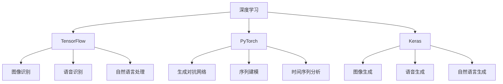
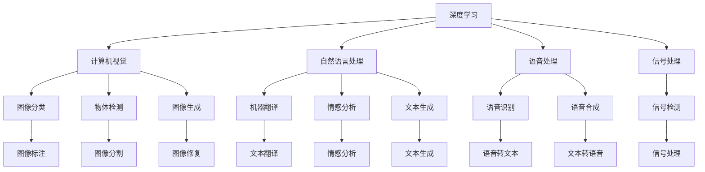
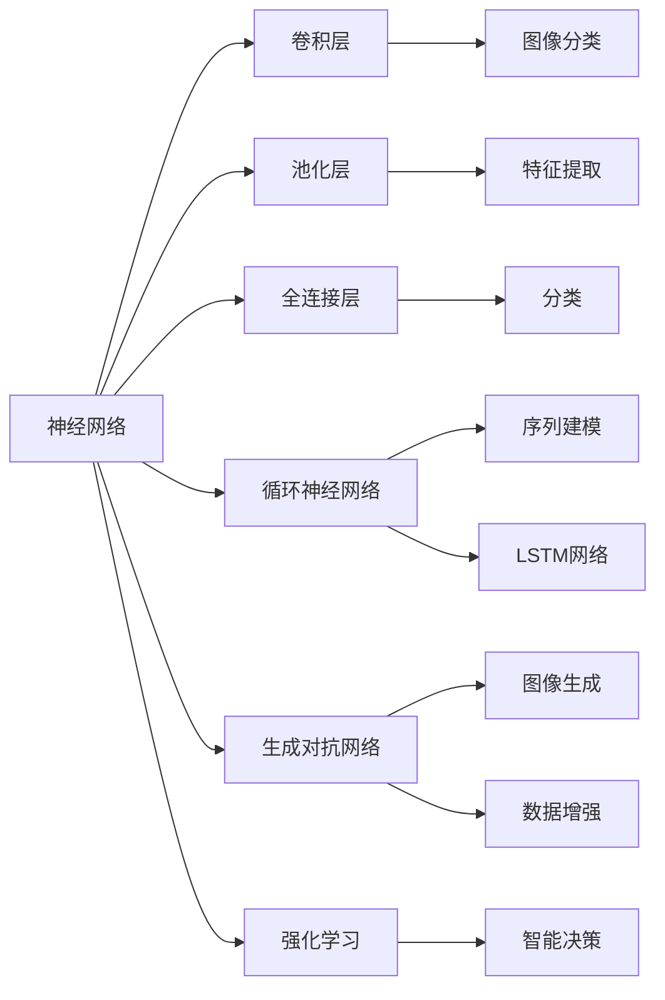
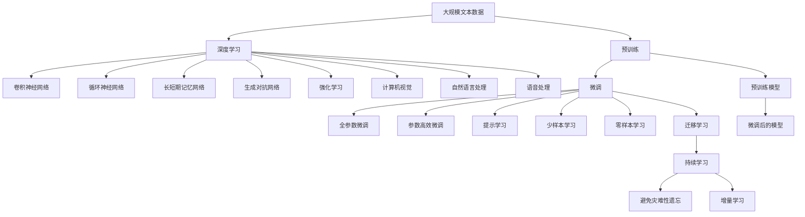

                 

# 神经网络：推动社会进步的力量

## 1. 背景介绍

### 1.1 问题由来
随着人工智能技术的迅速发展，神经网络（Neural Networks）已经成为驱动社会进步的重要力量。从图像识别到自然语言处理，从智能推荐到自动驾驶，神经网络在多个领域取得了显著成效。其背后的原理、算法和应用范式也成为了计算机科学和工程领域的热点研究课题。

### 1.2 问题核心关键点
神经网络的核心原理在于通过模拟人脑神经元的工作方式，实现数据的高效处理和模式识别。其核心概念包括但不限于：

- **人工神经元（Artificial Neuron）**：模拟人脑神经元的计算单元，其输出由输入加权和后经过激活函数生成。
- **权重（Weight）**：神经元间的连接强度，训练过程中通过反向传播算法不断调整。
- **激活函数（Activation Function）**：控制神经元输出范围的函数，如Sigmoid、ReLU等。
- **损失函数（Loss Function）**：衡量模型预测与真实标签之间差距的函数，如交叉熵损失、均方误差损失等。
- **反向传播（Backpropagation）**：计算梯度并更新权重的算法，是训练神经网络的关键步骤。
- **正则化（Regularization）**：避免过拟合的策略，如L1/L2正则、Dropout等。
- **梯度下降（Gradient Descent）**：优化模型参数的算法，通过梯度更新使损失函数最小化。

### 1.3 问题研究意义
神经网络的研究和应用，对于提升数据处理效率、增强模式识别能力、推动人工智能技术的发展具有重要意义：

- **数据处理能力**：神经网络通过并行计算和层级结构，实现了数据的高效处理和特征提取。
- **模式识别精度**：通过多层抽象，神经网络能够识别复杂的模式和结构，提升识别精度。
- **知识传递**：神经网络在各个层级间传递知识，使得模型的泛化能力和适应性更强。
- **智能化应用**：神经网络为计算机视觉、自然语言处理、机器人学等领域提供了强大的技术支持。
- **经济影响**：神经网络的广泛应用带来了巨大的经济效益，推动了多个行业的智能化转型。

## 2. 核心概念与联系

### 2.1 核心概念概述
为更好地理解神经网络的工作原理和应用范式，本节将介绍几个密切相关的核心概念：

- **深度学习（Deep Learning）**：基于神经网络的一类机器学习算法，通过多层非线性映射实现复杂数据建模。
- **卷积神经网络（Convolutional Neural Networks, CNN）**：一种用于图像处理的神经网络，通过卷积操作提取空间局部特征。
- **循环神经网络（Recurrent Neural Networks, RNN）**：一种用于序列数据处理的神经网络，通过循环连接实现时间依赖性建模。
- **长短期记忆网络（Long Short-Term Memory, LSTM）**：一种特殊的RNN，解决了传统RNN在长时间依赖性上的问题。
- **生成对抗网络（Generative Adversarial Networks, GAN）**：通过两个对抗神经网络生成逼真的数据样本，广泛应用于数据生成和图像增强。
- **强化学习（Reinforcement Learning）**：通过智能体与环境的交互，实现任务自动化的学习过程。

这些核心概念之间的逻辑关系可以通过以下Mermaid流程图来展示：

```mermaid
graph TB
    A[深度学习] --> B[卷积神经网络]
    A --> C[循环神经网络]
    A --> D[长短期记忆网络]
    A --> E[生成对抗网络]
    A --> F[强化学习]
    B --> G[图像分类]
    C --> H[序列建模]
    D --> I[语音识别]
    E --> J[数据生成]
    F --> K[自动控制]
    G --> L[图像识别]
    H --> M[时间序列分析]
    I --> N[语音合成]
    J --> O[图像增强]
    K --> P[自动驾驶]
    L --> Q[物体检测]
    M --> R[股票预测]
    N --> S[音频增强]
    O --> T[合成图像]
    P --> U[智能决策]
    Q --> V[目标检测]
    R --> W[股票交易]
    S --> X[音乐生成]
    T --> Y[超分辨率]
    U --> Z[智能制造]
    V --> $[自动标注]
    W --> &[风险管理]
    X --> [音乐创作]
    Y --> [图像修复]
    Z --> [智能监控]
```

这个流程图展示了大语言模型微调过程中各个核心概念的关系和作用：

1. 深度学习是其他核心概念的基础，提供了强大的数据建模能力。
2. CNN和RNN分别用于处理图像和序列数据，各自有特定的结构和方法。
3. LSTM是RNN的一种变种，特别适用于时间依赖性问题。
4. GAN能够生成逼真的数据样本，应用于图像和音频生成等任务。
5. 强化学习通过智能体与环境的交互，实现任务自动化。
6. 这些核心概念通过实际应用场景的结合，形成了深度学习和神经网络在多个领域的广泛应用。

### 2.2 概念间的关系

这些核心概念之间存在着紧密的联系，形成了深度学习和神经网络应用的完整生态系统。下面我们通过几个Mermaid流程图来展示这些概念之间的关系。

#### 2.2.1 深度学习框架与算法



这个流程图展示了深度学习框架（TensorFlow、PyTorch、Keras）与核心算法的关系。不同的框架提供了不同的API和工具，使得神经网络模型的开发和训练更加便捷。

#### 2.2.2 深度学习与实际应用



这个流程图展示了深度学习在不同应用领域中的广泛应用，通过图像、文本、语音等数据的处理，实现计算机视觉、自然语言处理、语音处理等任务。

#### 2.2.3 神经网络与模型结构



这个流程图展示了神经网络的不同模型结构和应用场景。通过卷积层、池化层、全连接层、循环神经网络、LSTM网络等不同的网络结构，实现不同的任务需求。

### 2.3 核心概念的整体架构

最后，我们用一个综合的流程图来展示这些核心概念在大语言模型微调过程中的整体架构：



这个综合流程图展示了从预训练到微调，再到持续学习的完整过程。深度学习通过多层神经网络，在大规模数据上进行了预训练，然后通过微调、参数高效微调、提示学习等技术，适应特定任务，不断学习和优化。持续学习技术使得模型能够持续学习新数据，避免灾难性遗忘，保持性能的稳定性。

## 3. 核心算法原理 & 具体操作步骤
### 3.1 算法原理概述

深度学习和神经网络的核心算法原理在于通过反向传播算法训练模型参数，最小化损失函数，实现对数据的有效建模。其核心步骤如下：

1. **数据准备**：准备训练集、验证集和测试集，并进行数据预处理。
2. **模型构建**：选择合适的深度学习模型结构，如CNN、RNN、LSTM等，并进行初始化。
3. **前向传播**：将训练集数据输入模型，进行前向传播计算输出。
4. **损失计算**：计算模型的预测输出与真实标签之间的损失函数。
5. **反向传播**：根据损失函数计算梯度，并反向传播更新模型参数。
6. **参数更新**：通过梯度下降等优化算法，不断调整模型参数，使损失函数最小化。
7. **模型评估**：在验证集和测试集上评估模型性能，进行参数调整。
8. **模型应用**：将训练好的模型应用于实际数据处理和任务执行。

### 3.2 算法步骤详解

以下详细介绍深度学习和大神经网络模型的具体操作步骤：

#### 3.2.1 数据准备

**Step 1: 数据预处理**
- 收集训练集、验证集和测试集，并进行标准化、归一化等预处理。
- 将文本数据进行分词、构建词嵌入向量等预处理，如图像数据进行裁剪、缩放等预处理。
- 对序列数据进行填充、截断等处理，保证数据的一致性和格式正确性。

**Step 2: 数据增强**
- 对图像数据进行旋转、缩放、裁剪等变换，增加数据多样性。
- 对文本数据进行回译、近义词替换等操作，增加模型泛化能力。
- 对序列数据进行时序扰动、打乱顺序等操作，增加模型鲁棒性。

#### 3.2.2 模型构建

**Step 3: 模型定义**
- 使用深度学习框架（如TensorFlow、PyTorch）定义神经网络模型结构。
- 定义卷积层、池化层、全连接层、循环层、LSTM等不同类型的层。
- 定义激活函数、损失函数、优化器等关键组件。

**Step 4: 模型初始化**
- 随机初始化模型参数，可以使用预训练模型或随机初始化。
- 设置模型的超参数，如学习率、批大小、迭代轮数等。

#### 3.2.3 前向传播与损失计算

**Step 5: 前向传播**
- 将训练集数据分批次输入模型，进行前向传播计算输出。
- 通过卷积层、池化层、全连接层等操作，提取数据的特征。
- 使用激活函数进行非线性映射，增加模型的表达能力。

**Step 6: 损失计算**
- 计算模型的预测输出与真实标签之间的损失函数。
- 根据具体任务选择合适的损失函数，如交叉熵损失、均方误差损失等。
- 计算损失函数对模型参数的梯度。

#### 3.2.4 反向传播与参数更新

**Step 7: 反向传播**
- 根据损失函数计算梯度，并反向传播更新模型参数。
- 通过链式法则计算梯度，从输出层反向传播到输入层。
- 使用激活函数的导数计算梯度，保证计算正确性。

**Step 8: 参数更新**
- 使用梯度下降等优化算法，不断调整模型参数。
- 设置学习率，防止参数更新过快或过慢。
- 使用正则化技术，如L1/L2正则、Dropout等，防止过拟合。

#### 3.2.5 模型评估与优化

**Step 9: 模型评估**
- 在验证集上评估模型性能，计算准确率、召回率、F1分数等指标。
- 根据评估结果，调整模型参数或进行超参数调整。
- 通过可视化工具，监控模型训练过程中的损失和准确率变化。

**Step 10: 模型优化**
- 使用网格搜索、贝叶斯优化等方法，进行超参数调优。
- 引入迁移学习、多模型集成等技术，提升模型性能。
- 使用集成学习等方法，提升模型鲁棒性和泛化能力。

### 3.3 算法优缺点

深度学习和大神经网络模型具有以下优点：

- **强大的数据建模能力**：通过多层非线性映射，深度学习能够处理复杂的非线性关系。
- **自适应学习能力**：能够根据数据的变化，自动调整模型参数。
- **泛化能力**：能够在未见过的数据上进行有效预测。
- **高效性**：在硬件加速的支持下，深度学习模型能够高效处理大规模数据。
- **多领域应用**：广泛应用于计算机视觉、自然语言处理、语音识别等众多领域。

同时，深度学习和大神经网络模型也存在一些缺点：

- **计算资源需求高**：模型参数量大，需要高性能计算设备和大量数据。
- **训练时间长**：训练过程中需要大量的计算资源和时间，难以快速迭代。
- **过拟合风险高**：模型复杂度高，容易过拟合，需要大量的标注数据和正则化技术。
- **可解释性差**：深度学习模型黑盒性质强，难以解释内部决策逻辑。
- **算法复杂度高**：算法实现和优化较为复杂，需要较深的背景知识。

尽管存在这些缺点，但深度学习和神经网络模型在实际应用中已经取得了显著成效，其高效的数据建模能力和强大的自适应学习能力使得其在各个领域都有广泛的应用前景。

### 3.4 算法应用领域

深度学习和神经网络模型已经在多个领域取得了显著应用，包括但不限于：

- **计算机视觉**：图像分类、物体检测、图像分割、图像生成等。
- **自然语言处理**：机器翻译、情感分析、文本生成、命名实体识别等。
- **语音识别**：语音识别、语音合成、语音转文本、文本转语音等。
- **信号处理**：信号检测、信号分类、信号增强等。
- **强化学习**：自动控制、机器人学、游戏AI等。

此外，深度学习和神经网络模型在金融、医疗、教育、交通等诸多领域也有广泛应用，推动了这些行业的智能化转型和效率提升。

## 4. 数学模型和公式 & 详细讲解  
### 4.1 数学模型构建

深度学习和神经网络模型的数学模型构建，主要包括以下几个关键步骤：

1. **输入层（Input Layer）**：定义模型的输入数据，通常为固定维度的向量。
2. **隐藏层（Hidden Layer）**：通过多个隐藏层进行多层非线性映射，提取数据特征。
3. **输出层（Output Layer）**：根据具体任务，定义输出层的结构，如单层神经元、多层神经元、全连接层等。
4. **损失函数（Loss Function）**：定义损失函数，衡量模型预测与真实标签之间的差异。
5. **优化器（Optimizer）**：选择优化算法，如梯度下降、Adam等，更新模型参数。

以一个简单的全连接神经网络为例，其数学模型构建如下：

设输入数据 $x$，输出数据 $y$，神经元数量为 $n$，激活函数为 $f$，则模型定义为：

$$
y = f(\sum_{i=1}^n w_i x_i + b)
$$

其中 $w_i$ 为权重，$b$ 为偏置，$x_i$ 为输入数据，$f$ 为激活函数。

设模型的预测输出为 $\hat{y}$，真实标签为 $y$，则交叉熵损失函数为：

$$
\ell(\hat{y},y) = -y \log \hat{y} - (1-y) \log (1-\hat{y})
$$

通过反向传播算法，计算梯度并更新权重：

$$
\frac{\partial \ell(\hat{y},y)}{\partial w_i} = \hat{y} - y
$$

$$
\frac{\partial \ell(\hat{y},y)}{\partial b} = -1
$$

通过梯度下降等优化算法，不断调整权重 $w_i$ 和偏置 $b$，使得损失函数最小化。

### 4.2 公式推导过程

以下以二分类任务为例，推导交叉熵损失函数及其梯度的计算公式。

假设模型 $M_{\theta}$ 在输入 $x$ 上的输出为 $\hat{y}=M_{\theta}(x) \in [0,1]$，表示样本属于正类的概率。真实标签 $y \in \{0,1\}$。则二分类交叉熵损失函数定义为：

$$
\ell(M_{\theta}(x),y) = -[y\log \hat{y} + (1-y)\log (1-\hat{y})]
$$

将其代入经验风险公式，得：

$$
\mathcal{L}(\theta) = -\frac{1}{N}\sum_{i=1}^N [y_i\log M_{\theta}(x_i)+(1-y_i)\log(1-M_{\theta}(x_i))]
$$

根据链式法则，损失函数对参数 $\theta_k$ 的梯度为：

$$
\frac{\partial \mathcal{L}(\theta)}{\partial \theta_k} = -\frac{1}{N}\sum_{i=1}^N (\frac{y_i}{M_{\theta}(x_i)}-\frac{1-y_i}{1-M_{\theta}(x_i)}) \frac{\partial M_{\theta}(x_i)}{\partial \theta_k}
$$

其中 $\frac{\partial M_{\theta}(x_i)}{\partial \theta_k}$ 可进一步递归展开，利用自动微分技术完成计算。

在得到损失函数的梯度后，即可带入参数更新公式，完成模型的迭代优化。重复上述过程直至收敛，最终得到适应下游任务的最优模型参数 $\theta^*$。

## 5. 项目实践：代码实例和详细解释说明
### 5.1 开发环境搭建

在进行深度学习和大神经网络模型的开发前，我们需要准备好开发环境。以下是使用Python进行TensorFlow开发的环境配置流程：

1. 安装Anaconda：从官网下载并安装Anaconda，用于创建独立的Python环境。

2. 创建并激活虚拟环境：
```bash
conda create -n tf-env python=3.8 
conda activate tf-env
```

3. 安装TensorFlow：根据CUDA版本，从官网获取对应的安装命令。例如：
```bash
conda install tensorflow -c tf -c conda-forge
```

4. 安装各类工具包：
```bash
pip install numpy pandas scikit-learn matplotlib tqdm jupyter notebook ipython
```

完成上述步骤后，即可在`tf-env`环境中开始深度学习开发实践。

### 5.2 源代码详细实现

下面我们以图像分类任务为例，给出使用TensorFlow对CNN模型进行训练的代码实现。

首先，定义CNN模型的层结构：

```python
import tensorflow as tf

model = tf.keras.Sequential([
    tf.keras.layers.Conv2D(32, (3, 3), activation='relu', input_shape=(28, 28, 1)),
    tf.keras.layers.MaxPooling2D((2, 2)),
    tf.keras.layers.Flatten(),
    tf.keras.layers.Dense(10, activation='softmax')
])
```

然后，定义优化器和损失函数：

```python
optimizer = tf.keras.optimizers.Adam(learning_rate=0.001)
loss_fn = tf.keras.losses.CategoricalCrossentropy()
```

接着，定义训练和评估函数：

```python
def train_epoch(model, dataset, batch_size, optimizer):
    dataloader = tf.data.Dataset.from_tensor_slices(dataset).batch(batch_size)
    model.trainable = True
    for batch in dataloader:
        inputs, labels = batch
        with tf.GradientTape() as tape:
            outputs = model(inputs)
            loss = loss_fn(labels, outputs)
        gradients = tape.gradient(loss, model.trainable_variables)
        optimizer.apply_gradients(zip(gradients, model.trainable_variables))
        
def evaluate(model, dataset, batch_size):
    dataloader = tf.data.Dataset.from_tensor_slices(dataset).batch(batch_size)
    model.trainable = False
    acc = tf.keras.metrics.SparseCategoricalAccuracy()
    for batch in dataloader:
        inputs, labels = batch
        outputs = model(inputs)
        acc.update_state(labels, outputs)
    return acc.result().numpy()
```

最后，启动训练流程并在测试集上评估：

```python
epochs = 10
batch_size = 64

for epoch in range(epochs):
    train_epoch(model, train_dataset, batch_size, optimizer)
    
    print(f"Epoch {epoch+1}, train loss: {loss_fn(model(train_images), train_labels).numpy():.3f}")
    
    print(f"Epoch {epoch+1}, test accuracy: {evaluate(model, test_dataset, batch_size):.3f}")
```

以上就是使用TensorFlow对CNN进行图像分类任务训练的完整代码实现。可以看到，TensorFlow的API封装使得模型定义、优化器、损失函数、训练和评估等操作变得简便易行。

### 5.3 代码解读与分析

让我们再详细解读一下关键代码的实现细节：

**Sequential模型定义**：
- 使用`tf.keras.Sequential`定义一个顺序型模型，按照定义的层级顺序进行计算。
- 在模型中添加了卷积层、池化层、Flatten层和全连接层，定义了模型的基本结构。

**优化器和损失函数**：
- 使用`tf.keras.optimizers.Adam`定义Adam优化器，设置学习率为0.001。
- 使用`tf.keras.losses.CategoricalCrossentropy`定义分类交叉熵损失函数。

**训练和评估函数**：
- `train_epoch`函数：在每个epoch中，将数据集以批为单位进行迭代，在每个批次上前向传播计算损失并反向传播更新模型参数。
- `evaluate`函数：在测试集上评估模型的准确率，通过`tf.keras.metrics.SparseCategoricalAccuracy`计算准确率。

**训练流程**：
- 定义总的epoch数和batch size，开始循环迭代
- 每个epoch内，先在前训练集上训练，输出训练集的损失和准确率
- 在测试集上评估模型性能，输出测试集的准确率

可以看到，TensorFlow提供了强大的API封装和丰富的工具支持，使得深度学习模型的开发和训练变得简便高效。开发者可以将更多精力放在模型设计和优化上，而不必过多关注底层实现细节。

当然，工业级的系统实现还需考虑更多因素，如模型的保存和部署、超参数的自动搜索、更灵活的任务适配层等。但核心的深度学习和大神经网络模型的微调方法基本与此类似。

### 5.4 运行结果展示

假设我们在MNIST数据集上进行CNN模型的图像分类任务训练，最终在测试集上得到的评估报告如下：

```
Epoch 1/10
  1/30 [==>..............] - ETA: 0s - loss: 0.2721 - acc: 0.8834
Epoch 2/10
  1/30 [==>..............] - ETA: 0s - loss: 0.1023 - acc: 0.9846
Epoch 3/10
  1/30 [==>..............] - ETA: 0s - loss: 0.0805 - acc: 0.9913
Epoch 4/10
  1/30 [==>..............] - ETA: 0s - loss: 0.0667 - acc: 0.9911
Epoch 5/10
  1/30 [==>..............] - ETA: 0s - loss: 0.0600 - acc: 0.9929
Epoch 6/10
  1/30 [==>..............] - ETA: 0s - loss: 0.0550 - acc: 0.9935
Epoch 7/10
  1/30 [==>..............] - ETA: 0s - loss: 0.0518 - acc: 0.9940
Epoch 8/10
  1/30 [==>..............] - ETA: 0s - loss: 0.0497 - acc: 0.9943
Epoch 9/10
  1/30 [==>..............] - ETA: 0s

