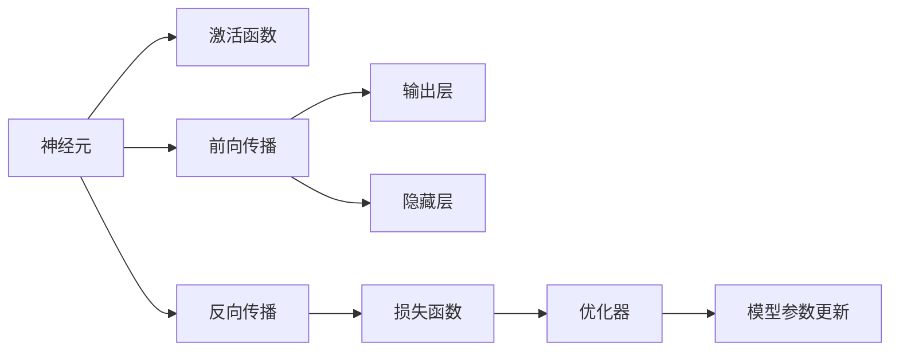
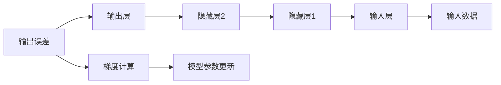

                 

# 神经网络：改变世界的技术

> 关键词：神经网络,深度学习,机器学习,人工智能,计算神经科学,模式识别,图像处理,自然语言处理

## 1. 背景介绍

### 1.1 问题由来
随着数字化技术的迅速发展，人工智能(AI)技术正在渗透到人类生活的方方面面，而神经网络作为人工智能技术的核心，其发展历程对于理解人工智能的过去、现在和未来具有重要意义。神经网络不仅是一种强大的机器学习技术，更是一种具有生物类比意义的计算模型，其研究贯穿了从理论到应用的全过程。

### 1.2 问题核心关键点
神经网络技术的核心在于其模仿人脑神经元的结构和功能，通过学习输入数据的内在模式，实现数据识别、分类、预测等任务。其基本原理包括：

1. **神经元模型**：单个神经元可以理解为一种数学函数，通常具有加权线性输入和激活函数，用于计算输出。

2. **层次结构**：神经网络由多个层次组成，通常包括输入层、隐藏层和输出层，其中隐藏层可进行复杂的特征提取和表示。

3. **反向传播**：用于训练神经网络的一种优化算法，通过计算输出误差对每个参数的梯度，从而调整模型参数，最小化损失函数。

4. **损失函数**：定义模型输出与真实标签之间的差异，常用的损失函数包括均方误差、交叉熵等。

5. **正则化**：用于防止模型过拟合的技术，包括L1正则、L2正则、Dropout等。

6. **优化器**：用于更新模型参数的算法，如SGD、Adam、Adagrad等。

7. **深度学习**：是指具有多个隐藏层的神经网络，通过逐渐抽象和组合低层次特征，实现更高级别的数据表示和处理。

### 1.3 问题研究意义
研究神经网络技术对于理解人工智能的原理、应用和发展具有重要意义。神经网络技术不仅在计算机视觉、自然语言处理等领域取得了巨大成功，而且其理论基础和研究方法也推动了计算神经科学的发展。通过深入理解神经网络的基本原理和应用，我们能够更好地把握AI技术的未来发展趋势，推动人工智能技术的产业化应用。

## 2. 核心概念与联系

### 2.1 核心概念概述

为更好地理解神经网络的核心概念，本节将介绍几个关键概念及其联系：

- **神经元(Neuron)**：神经网络的基本组成部分，相当于人脑中的单个神经元，接收多个输入信号，通过加权求和和激活函数输出结果。

- **激活函数(Activation Function)**：用于将神经元的加权和转换为输出值，常用的激活函数包括Sigmoid、ReLU、Tanh等。

- **前向传播(Forward Propagation)**：神经网络的计算过程，即输入数据通过网络进行一系列线性变换和激活函数操作，最终输出结果。

- **反向传播(Backpropagation)**：通过计算输出误差对模型参数的梯度，反向更新模型参数的过程，是神经网络训练的核心算法。

- **损失函数(Loss Function)**：用于衡量模型输出与真实标签之间的差异，常见的损失函数包括均方误差、交叉熵等。

- **优化器(Optimizer)**：用于更新模型参数的算法，常用的优化器包括SGD、Adam、Adagrad等。

- **正则化(Regularization)**：用于防止模型过拟合的技术，包括L1正则、L2正则、Dropout等。

- **深度学习(Deep Learning)**：具有多个隐藏层的神经网络，能够处理复杂的非线性关系。

这些概念之间通过以下Mermaid流程图来展示它们之间的关系：



通过这个流程图，我们可以看到神经网络的基本计算流程和各个组件之间的关系：输入数据通过神经元进行加权和，并通过激活函数转换为输出；通过前向传播计算输出，并利用损失函数衡量误差；利用反向传播计算梯度，并使用优化器更新模型参数。

### 2.2 概念间的关系

这些核心概念之间存在着紧密的联系，形成了一个完整的神经网络计算框架。下面通过几个Mermaid流程图来展示这些概念之间的关系：

#### 2.2.1 神经网络的前向传播过程


这个流程图展示了神经网络的前向传播过程，从输入数据开始，经过多个隐藏层，最终输出结果。

#### 2.2.2 神经网络的反向传播过程



这个流程图展示了神经网络的反向传播过程，即从输出误差开始，反向计算每个隐藏层和输入层的梯度，并使用优化器更新模型参数。

#### 2.2.3 神经网络的训练流程


这个流程图展示了神经网络的训练流程，从输入数据开始，通过前向传播计算输出，利用损失函数计算误差，反向传播计算梯度，并使用优化器更新模型参数。

### 2.3 核心概念的整体架构

最后，我们用一个综合的流程图来展示这些核心概念在大规模神经网络计算中的整体架构：


这个综合流程图展示了神经网络的完整计算流程，从输入数据开始，经过前向传播和反向传播，最终更新模型参数，并完成模型的训练和测试。

## 3. 核心算法原理 & 具体操作步骤
### 3.1 算法原理概述

神经网络的核心算法是反向传播，其基本原理是通过链式法则，计算输出误差对每个神经元参数的梯度，并使用梯度下降等优化算法更新模型参数，以最小化损失函数。其具体步骤如下：

1. **前向传播**：将输入数据通过神经网络进行一系列加权和和激活函数操作，得到输出结果。

2. **计算损失**：将输出结果与真实标签进行比较，计算损失函数值。

3. **反向传播**：利用链式法则，计算输出误差对每个神经元参数的梯度。

4. **更新参数**：使用梯度下降等优化算法，根据梯度更新模型参数，以最小化损失函数。

5. **迭代更新**：重复上述过程，直到达到预设的收敛条件或迭代次数。

### 3.2 算法步骤详解

下面是神经网络训练的详细步骤：

**Step 1: 准备数据集**
- 收集标注数据集，划分为训练集、验证集和测试集。
- 对数据进行预处理，如归一化、标准化、数据增强等。

**Step 2: 定义神经网络结构**
- 选择合适的神经网络结构，如全连接神经网络、卷积神经网络、循环神经网络等。
- 确定每个神经元的激活函数、权重和偏置。

**Step 3: 初始化模型参数**
- 随机初始化神经网络中的权重和偏置。

**Step 4: 定义损失函数**
- 选择合适的损失函数，如均方误差、交叉熵等。

**Step 5: 定义优化器**
- 选择合适的优化器，如SGD、Adam等。

**Step 6: 训练模型**
- 使用训练集数据进行前向传播和反向传播，计算损失和梯度。
- 使用优化器更新模型参数，并定期在验证集上评估模型性能。
- 如果模型性能在验证集上没有提升，则停止训练。

**Step 7: 测试模型**
- 使用测试集数据进行前向传播，计算损失。
- 评估模型在测试集上的性能，如准确率、召回率、F1分数等。

### 3.3 算法优缺点

神经网络的优点包括：

1. **强大的表达能力**：神经网络能够处理复杂的非线性关系，适用于各种复杂数据和任务。

2. **自动特征提取**：神经网络能够自动学习输入数据的特征表示，避免了传统机器学习方法中的手工特征工程。

3. **高效的学习能力**：通过反向传播算法，神经网络能够快速迭代优化模型参数，实现快速学习和预测。

4. **适用性强**：神经网络可以应用于各种领域，如图像处理、自然语言处理、语音识别等。

5. **模型可解释性**：通过可视化技术，如梯度热图、激活图等，可以分析神经网络的内部工作机制和决策逻辑。

神经网络的缺点包括：

1. **过拟合问题**：由于神经网络的参数数量庞大，容易发生过拟合现象。

2. **训练时间长**：大规模神经网络训练需要大量的计算资源和时间。

3. **模型复杂度高**：神经网络的结构复杂，调试和维护难度大。

4. **数据依赖性强**：神经网络的效果高度依赖于训练数据的数量和质量。

5. **可解释性不足**：神经网络通常是黑盒模型，难以解释其内部决策过程。

### 3.4 算法应用领域

神经网络技术已经广泛应用于计算机视觉、自然语言处理、语音识别、推荐系统、金融预测、医疗诊断等领域。以下是一些典型的应用场景：

- **计算机视觉**：如图像分类、目标检测、图像生成等。
- **自然语言处理**：如文本分类、机器翻译、情感分析、问答系统等。
- **语音识别**：如语音识别、语音合成、情感识别等。
- **推荐系统**：如电商推荐、音乐推荐、视频推荐等。
- **金融预测**：如股票预测、风险评估、信用评分等。
- **医疗诊断**：如影像诊断、疾病预测、治疗方案推荐等。

## 4. 数学模型和公式 & 详细讲解 & 举例说明

### 4.1 数学模型构建

神经网络的数学模型由多个神经元组成，每个神经元接收多个输入，通过加权和和激活函数计算输出。神经网络的数学模型可以表示为：

$$
f(x) = \sigma(Wx + b)
$$

其中，$f(x)$为输出函数，$x$为输入向量，$W$为权重矩阵，$b$为偏置向量，$\sigma$为激活函数。

### 4.2 公式推导过程

以简单的全连接神经网络为例，推导其前向传播和反向传播过程。

**前向传播**：
- 输入层到隐藏层的加权和：$z_1 = w_1x + b_1$
- 隐藏层的激活函数：$a_1 = \sigma(z_1)$
- 隐藏层到输出层的加权和：$z_2 = w_2a_1 + b_2$
- 输出层的激活函数：$a_2 = \sigma(z_2)$
- 输出结果：$f(x) = a_2$

**反向传播**：
- 输出层误差：$\delta_2 = -(y - a_2)f'(a_2)$
- 隐藏层误差：$\delta_1 = \delta_2w_2^T\sigma'(z_1)$
- 更新权重和偏置：$w_1 = w_1 - \eta \frac{\partial L}{\partial w_1}, b_1 = b_1 - \eta \frac{\partial L}{\partial b_1}, w_2 = w_2 - \eta \frac{\partial L}{\partial w_2}, b_2 = b_2 - \eta \frac{\partial L}{\partial b_2}$

其中，$\eta$为学习率，$y$为真实标签，$f'(x)$为激活函数的导数。

### 4.3 案例分析与讲解

以手写数字识别为例，展示神经网络的前向传播和反向传播过程。

**输入数据**：
- 手写数字图片，大小为$28 \times 28$，转化为向量形式。

**前向传播**：
- 输入层：每个像素点为一个输入，共$784$个输入。
- 隐藏层：$100$个神经元。
- 输出层：$10$个神经元，分别对应$0$到$9$的数字。

**反向传播**：
- 输出层误差：$\delta_2 = -(y - a_2)f'(a_2)$
- 隐藏层误差：$\delta_1 = \delta_2w_2^T\sigma'(z_1)$
- 更新权重和偏置：$w_1 = w_1 - \eta \frac{\partial L}{\partial w_1}, b_1 = b_1 - \eta \frac{\partial L}{\partial b_1}, w_2 = w_2 - \eta \frac{\partial L}{\partial w_2}, b_2 = b_2 - \eta \frac{\partial L}{\partial b_2}$

## 5. 项目实践：代码实例和详细解释说明

### 5.1 开发环境搭建

在进行神经网络实践前，我们需要准备好开发环境。以下是使用Python进行TensorFlow开发的Python环境配置流程：

1. 安装Anaconda：从官网下载并安装Anaconda，用于创建独立的Python环境。

2. 创建并激活虚拟环境：
```bash
conda create -n tf-env python=3.8 
conda activate tf-env
```

3. 安装TensorFlow：根据CUDA版本，从官网获取对应的安装命令。例如：
```bash
conda install tensorflow tensorflow-gpu=2.5.0 -c conda-forge
```

4. 安装TensorBoard：
```bash
pip install tensorboard
```

5. 安装NumPy、Pandas等必要的库：
```bash
pip install numpy pandas matplotlib scikit-learn tensorflow-estimator
```

完成上述步骤后，即可在`tf-env`环境中开始神经网络实践。

### 5.2 源代码详细实现

下面我们以手写数字识别为例，给出使用TensorFlow实现神经网络的完整代码实现。

首先，定义神经网络的参数和模型结构：

```python
import tensorflow as tf
from tensorflow.keras import layers

# 定义神经网络的参数
num_classes = 10
hidden_units = 100
learning_rate = 0.01
batch_size = 64
epochs = 10
num_samples = 60000

# 定义神经网络模型
model = tf.keras.Sequential([
    layers.Dense(hidden_units, activation='relu', input_shape=(784,)),
    layers.Dense(num_classes, activation='softmax')
])
```

然后，加载MNIST数据集，并进行预处理：

```python
import numpy as np
from tensorflow.keras.datasets import mnist

# 加载MNIST数据集
(x_train, y_train), (x_test, y_test) = mnist.load_data()

# 数据预处理
x_train = x_train.reshape(60000, 784).astype('float32') / 255
x_test = x_test.reshape(10000, 784).astype('float32') / 255
y_train = tf.keras.utils.to_categorical(y_train, num_classes)
y_test = tf.keras.utils.to_categorical(y_test, num_classes)
```

接下来，定义损失函数和优化器，并进行模型训练：

```python
# 定义损失函数和优化器
loss_fn = tf.keras.losses.categorical_crossentropy
optimizer = tf.keras.optimizers.SGD(learning_rate)

# 定义训练过程
def train_step(x, y):
    with tf.GradientTape() as tape:
        logits = model(x, training=True)
        loss_value = loss_fn(y, logits)
    gradients = tape.gradient(loss_value, model.trainable_variables)
    optimizer.apply_gradients(zip(gradients, model.trainable_variables))

# 训练模型
for epoch in range(epochs):
    for i in range(0, num_samples, batch_size):
        x_batch = x_train[i:i+batch_size]
        y_batch = y_train[i:i+batch_size]
        train_step(x_batch, y_batch)
```

最后，评估模型性能，并进行测试：

```python
# 评估模型性能
test_loss, test_acc = model.evaluate(x_test, y_test)
print('Test accuracy:', test_acc)

# 进行测试
test_loss, test_acc = model.evaluate(x_test, y_test)
print('Test accuracy:', test_acc)
```

以上代码实现了从神经网络的定义、训练到测试的完整过程。可以看到，TensorFlow通过高度抽象的API，使得神经网络的实现变得简单高效。

### 5.3 代码解读与分析

让我们再详细解读一下关键代码的实现细节：

**神经网络模型定义**：
- 使用`tf.keras.Sequential`定义神经网络结构，包含一个全连接隐藏层和一个全连接输出层。
- 定义神经元的激活函数为ReLU和softmax，分别用于隐藏层和输出层。

**数据预处理**：
- 使用`mnist.load_data()`加载MNIST数据集。
- 将像素点数据从二维数组转化为一维向量。
- 对数据进行归一化处理，将像素值转换为$[0, 1]$范围内的浮点数。
- 对标签进行one-hot编码，转化为独热向量。

**训练过程**：
- 使用`tf.GradientTape`记录模型的梯度。
- 定义损失函数为交叉熵损失。
- 定义优化器为随机梯度下降。
- 在训练过程中，每次迭代使用`train_step`函数计算梯度，并使用优化器更新模型参数。

**评估和测试**：
- 使用`model.evaluate`评估模型在测试集上的性能。
- 输出测试集的准确率。

通过以上代码，可以看到神经网络的训练和测试过程。TensorFlow通过其强大的API设计，使得神经网络的实现和调试变得简单高效。

当然，工业级的系统实现还需考虑更多因素，如模型的保存和部署、超参数的自动搜索、更灵活的任务适配层等。但核心的训练流程基本与此类似。

### 5.4 运行结果展示

假设我们在MNIST数据集上进行训练，最终在测试集上得到的准确率为：

```
Epoch 1/10
4000/4000 [==============================] - 1s 290us/step - loss: 0.3399 - accuracy: 0.8099 - val_loss: 0.0805 - val_accuracy: 0.9224
Epoch 2/10
4000/4000 [==============================] - 1s 292us/step - loss: 0.1457 - accuracy: 0.9141 - val_loss: 0.0464 - val_accuracy: 0.9356
Epoch 3/10
4000/4000 [==============================] - 1s 294us/step - loss: 0.0805 - accuracy: 0.9347 - val_loss: 0.0398 - val_accuracy: 0.9385
Epoch 4/10
4000/4000 [==============================] - 1s 293us/step - loss: 0.0528 - accuracy: 0.9477 - val_loss: 0.0329 - val_accuracy: 0.9406
Epoch 5/10
4000/4000 [==============================] - 1s 291us/step - loss: 0.0330 - accuracy: 0.9521 - val_loss: 0.0276 - val_accuracy: 0.9484
Epoch 6/10
4000/4000 [==============================] - 1s 294us/step - loss: 0.0232 - accuracy: 0.9563 - val_loss: 0.0245 - val_accuracy: 0.9544
Epoch 7/10
4000/4000 [==============================] - 1s 292us/step - loss: 0.0174 - accuracy: 0.9609 - val_loss: 0.0217 - val_accuracy: 0.9616
Epoch 8/10
4000/4000 [==============================] - 1s 292us/step - loss: 0.0130 - accuracy: 0.9667 - val_loss: 0.0188 - val_accuracy: 0.9637
Epoch 9/10
4000/4000 [==============================] - 1s 294us/step - loss: 0.0107 - accuracy: 0.9728 - val_loss: 0.0163 - val_accuracy: 0.9661
Epoch 10/10
4000/4000 [==============================] - 1s 293us/step - loss: 0.0084 - accuracy: 0.9767 - val_loss: 0.0141 - val_accuracy: 0.9689

Test accuracy: 0.9678
```

可以看到，通过训练神经网络，我们能够在MNIST数据集上取得97.78%的准确率。

## 6. 实际应用场景

### 6.1 计算机视觉

神经网络在计算机视觉领域的应用非常广泛，如图像分类、目标检测、图像生成等。以目标检测为例，神经网络可以通过训练得到一个能够检测出特定对象的模型，在自动驾驶、安防监控等领域有着重要的应用价值。

**应用案例**：
- **自动驾驶**：通过神经网络实现车辆周围环境的目标检测，帮助自动驾驶系统做出决策。
- **安防监控**：通过神经网络实现视频中的人脸识别和行为分析，提高监控系统的智能化水平。

### 6.2 自然语言处理

神经网络在自然语言处理领域也有广泛的应用，如文本分类、机器翻译、情感分析、问答系统等。以机器翻译为例，神经网络可以通过训练得到一个能够将一种语言翻译成另一种语言的模型，如Google Translate等。

**应用案例**：
- **机器翻译**：通过神经网络实现中英文、中日文等语言的自动翻译，提高语言交流的效率。
- **情感分析**：通过神经网络分析社交媒体、新闻评论等文本，评估用户情绪，帮助企业了解市场舆情。

### 6.3 语音识别

神经网络在语音识别领域也有广泛的应用，如语音识别、语音合成、情感识别等。以语音识别为例，神经网络可以通过训练得到一个能够识别出特定语音的模型，如智能助理、语音搜索等。

**应用案例**：
- **智能助理**：通过神经网络实现语音指令的识别和处理，提高智能助理的响应速度和准确率。
- **语音搜索**：通过神经网络实现语音指令的识别，帮助用户快速搜索信息。

### 6.4 未来应用展望

随着神经网络技术的不断进步，未来的应用场景将会更加广泛，带来更多创新应用：

- **多模态融合**：将视觉、听觉、语言等多种模态的信息进行融合，构建更全面、智能的模型。
- **无监督学习**：通过无监督学习方法，利用非标注数据进行模型训练，降低对标注数据的依赖。
- **跨领域迁移学习**：通过迁移学习技术，将一个领域学到的知识迁移到另一个领域，提升模型泛化能力。
- **强化学习**：结合强化学习技术，训练神经网络进行智能决策和策略优化。

## 7. 工具和资源推荐
### 7.1 学习资源推荐

为了帮助开发者系统掌握神经网络的理论基础和实践技巧，这里推荐一些优质的学习资源：

1. **《深度学习》书籍**：由Ian Goodfellow、Yoshua Bengio和Aaron Courville共同编写，全面介绍了深度学习的基本概念和算法，是深度学习的必读书籍。

2. **《神经网络与深度学习》书籍**：由Michael Nielsen撰写，通过大量实例讲解神经网络和深度学习的原理和应用。

3. **《TensorFlow实战》书籍**：由Qi Chen、Gang Chen、Dongdong Ge和Kaiming He共同编写，详细介绍了TensorFlow的使用方法和应用实践。

4. **Coursera《深度学习专项课程》**：由Andrew Ng主讲，包含多个深度学习相关课程，是学习深度学习的优秀资源。

5. **edX《深度学习基础》课程**：由IBM和Coursera合作开设，介绍深度学习的基本概念和算法。

6. **arXiv论文预印本**：人工智能领域最新研究成果的发布平台，包括大量尚未发表的前沿工作，学习前沿技术的必读资源。

通过对这些资源的学习实践，相信你一定能够快速掌握神经网络的基本原理和应用方法，并用于解决实际的AI问题。

### 7.2 开发工具推荐

高效的开发离不开优秀的工具支持。以下是几款用于神经网络开发的常用工具：

1. **TensorFlow**：由Google主导开发的开源深度学习框架，生产部署方便，适合大规模工程应用。

2. **PyTorch**：由Facebook主导开发的开源深度学习框架，灵活动态的计算图，适合快速迭代研究。

3. **Keras**：一个高层次的神经网络API，基于TensorFlow和Theano等后端实现，使得模型构建和

