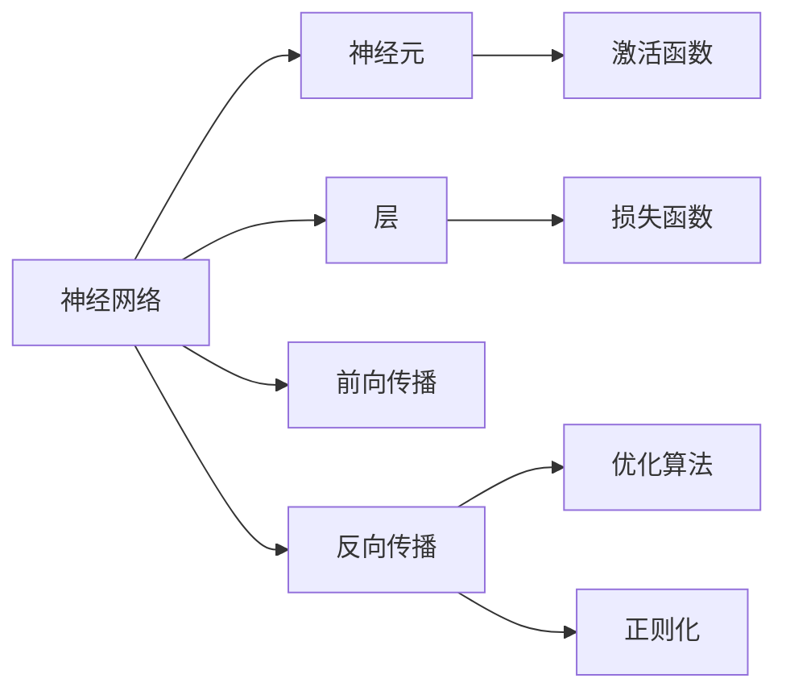
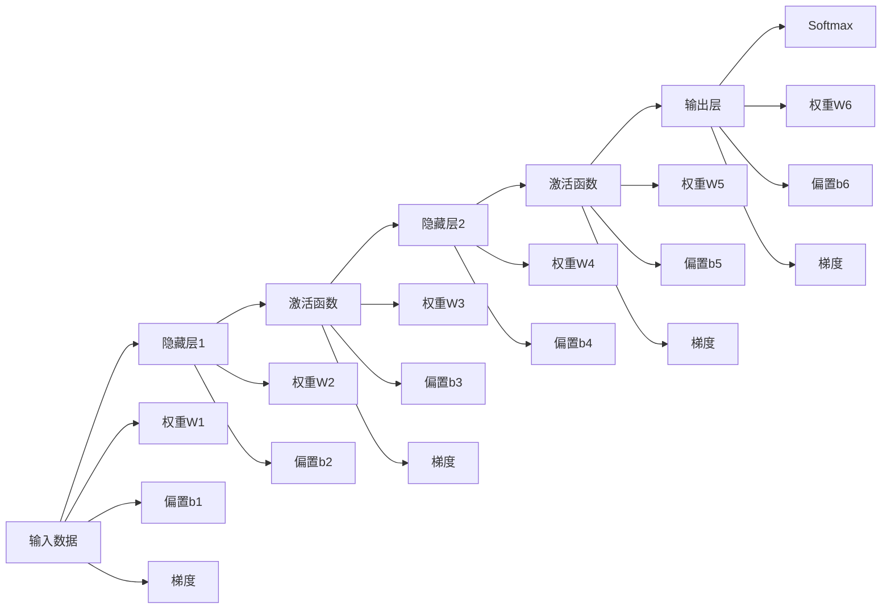

                 

## 1. 背景介绍

### 1.1 问题由来

随着机器学习技术的发展，传统基于手工特征提取的方法逐渐被基于深度学习的端到端学习范式所取代。深度学习模型的核心思想是：通过构建多层神经网络，自动学习输入数据的高层次特征表示，从而实现复杂的模式识别和分类任务。深度学习范式的成功，使其在图像识别、语音识别、自然语言处理等多个领域得到了广泛应用。

神经网络作为深度学习的核心组成部分，其核心思想是通过非线性变换对输入数据进行逐层映射，最终实现对复杂数据的抽象表达和高效建模。神经网络的研究已经经历了数十年的发展，从早期的多层感知器(MLP)、卷积神经网络(CNN)到循环神经网络(RNN)、长短期记忆网络(LSTM)等，逐渐深入到各种特定的应用场景中。

神经网络的成功，得益于其强大的表达能力和学习能力。它不仅能够学习数据的局部特征，还能通过多层非线性变换，捕捉数据的高层次语义和结构信息。神经网络的推广应用，极大地推动了人工智能技术的落地，推动了机器学习技术向更智能、更普适的方向发展。

### 1.2 问题核心关键点

神经网络的研究和应用，涉及多个关键点，包括：

1. **网络结构设计**：如何设计有效的神经网络结构，使其能够学习有效的特征表示。
2. **损失函数优化**：如何选择损失函数，优化网络参数，使其能够最小化预测误差。
3. **正则化方法**：如何防止过拟合，提升网络泛化性能。
4. **激活函数选择**：如何选择激活函数，使得网络具有更好的非线性表达能力。
5. **训练算法优化**：如何选择训练算法，加速模型收敛。
6. **反向传播算法**：如何高效计算梯度，更新网络参数。

这些问题直接影响了神经网络的性能和效果，是研究和应用神经网络的关键点。

### 1.3 问题研究意义

神经网络作为机器学习的新范式，具有以下重要意义：

1. **自动特征提取**：神经网络能够自动从原始数据中学习特征，减少了手工特征提取的复杂性和主观性。
2. **端到端学习**：神经网络能够直接从原始数据到最终输出，避免了中间特征工程，提升了模型效率和可解释性。
3. **高效建模**：神经网络通过多层非线性变换，捕捉数据的高层次特征，提升了模型对复杂模式的识别能力。
4. **广泛应用**：神经网络在图像、语音、自然语言处理等多个领域得到广泛应用，推动了人工智能技术的落地。
5. **可解释性**：神经网络能够提供特征图、梯度图等可视化结果，帮助理解模型内部机制。
6. **普适性**：神经网络具有较强的泛化性能，可以应用到各种场景和任务中。

神经网络的成功应用，为机器学习提供了新的视角和方法，推动了人工智能技术的不断进步和普及。研究神经网络的方法和技巧，对于掌握机器学习技术的核心能力，具有重要意义。

## 2. 核心概念与联系

### 2.1 核心概念概述

神经网络作为深度学习的核心组成部分，涉及多个关键概念：

1. **神经元**：神经网络的基本单元，通过输入加权和、非线性激活和输出，实现信息的传递和处理。
2. **层**：神经网络由多个层组成，每个层实现特定的信息处理功能，如卷积层、池化层、全连接层等。
3. **前向传播**：输入数据通过网络逐层传递，最终输出预测结果。
4. **反向传播**：利用损失函数和链式法则计算梯度，反向更新网络参数。
5. **损失函数**：衡量模型预测结果与真实标签之间的差异，指导网络优化。
6. **优化算法**：选择有效的优化算法，如梯度下降、Adam等，加速模型收敛。
7. **正则化**：防止过拟合，提升模型泛化性能，包括L2正则、Dropout等方法。
8. **激活函数**：选择非线性激活函数，如ReLU、Sigmoid等，增强网络的非线性表达能力。

这些核心概念之间存在着紧密的联系，形成了神经网络的完整生态系统。

### 2.2 概念间的关系

这些核心概念之间存在着紧密的联系，形成了神经网络的完整生态系统。我们可以用以下Mermaid流程图来展示这些概念之间的关系：



这个流程图展示了神经网络的各个核心概念之间的关系：

1. 神经网络由神经元组成。
2. 神经网络由多个层组成，每个层实现特定的信息处理功能。
3. 神经网络通过前向传播计算输出结果。
4. 神经网络通过反向传播计算梯度，更新参数。
5. 激活函数增强神经元的非线性表达能力。
6. 损失函数衡量预测结果与真实标签之间的差异。
7. 优化算法加速模型收敛。
8. 正则化防止过拟合，提升泛化性能。

这些概念共同构成了神经网络的完整生态系统，使得神经网络能够高效、准确地处理各种复杂数据。

## 3. 核心算法原理 & 具体操作步骤
### 3.1 算法原理概述

神经网络的训练过程基于反向传播算法，通过计算梯度更新网络参数，最小化预测结果与真实标签之间的差异。其基本流程包括：

1. 前向传播：将输入数据通过网络逐层传递，计算输出结果。
2. 损失函数计算：计算模型输出与真实标签之间的差异，得到损失函数值。
3. 反向传播：利用链式法则计算梯度，反向更新网络参数。
4. 参数更新：根据梯度更新参数，最小化损失函数。

神经网络的训练过程不断迭代，直至模型收敛。

### 3.2 算法步骤详解

以下是一个完整的神经网络训练步骤：

1. **网络结构设计**：根据任务需求，设计合适的神经网络结构，包括层数、层类型、激活函数等。
2. **数据准备**：准备训练集、验证集和测试集，将数据划分为训练样本、验证样本和测试样本。
3. **初始化参数**：随机初始化网络参数，如权重和偏置。
4. **前向传播**：将训练样本输入网络，计算输出结果。
5. **损失函数计算**：计算模型输出与真实标签之间的差异，得到损失函数值。
6. **反向传播**：利用链式法则计算梯度，反向更新网络参数。
7. **参数更新**：根据梯度更新参数，最小化损失函数。
8. **验证集评估**：在验证集上评估模型性能，避免过拟合。
9. **测试集评估**：在测试集上评估模型性能，提供最终评估指标。

### 3.3 算法优缺点

神经网络作为机器学习的新范式，具有以下优点：

1. **自动特征提取**：神经网络能够自动从原始数据中学习特征，减少了手工特征提取的复杂性和主观性。
2. **高效建模**：神经网络通过多层非线性变换，捕捉数据的高层次特征，提升了模型对复杂模式的识别能力。
3. **可解释性**：神经网络能够提供特征图、梯度图等可视化结果，帮助理解模型内部机制。
4. **普适性**：神经网络具有较强的泛化性能，可以应用到各种场景和任务中。

同时，神经网络也存在以下缺点：

1. **参数较多**：神经网络需要大量的参数，导致训练和推理速度较慢。
2. **过拟合风险**：神经网络容易过拟合，需要采用正则化等方法进行控制。
3. **黑盒特性**：神经网络的内部机制难以解释，模型决策缺乏可解释性。
4. **计算资源要求高**：神经网络需要大量的计算资源，包括高性能的GPU、TPU等。
5. **训练复杂**：神经网络的训练过程较为复杂，需要经验和技巧。

### 3.4 算法应用领域

神经网络在多个领域得到了广泛应用，包括：

1. **计算机视觉**：用于图像分类、物体检测、图像分割等任务。
2. **自然语言处理**：用于文本分类、情感分析、机器翻译等任务。
3. **语音识别**：用于语音识别、语音合成等任务。
4. **推荐系统**：用于推荐系统、广告定向等任务。
5. **金融预测**：用于股票预测、风险评估等任务。
6. **医疗诊断**：用于疾病诊断、医学图像分析等任务。
7. **自动驾驶**：用于图像识别、目标检测等任务。

神经网络的应用场景越来越广泛，推动了人工智能技术的不断进步和普及。

## 4. 数学模型和公式 & 详细讲解 & 举例说明

### 4.1 数学模型构建

神经网络的核心数学模型包括：

1. **前向传播**：输入数据通过网络逐层传递，计算输出结果。
2. **损失函数**：衡量模型预测结果与真实标签之间的差异。
3. **反向传播**：利用链式法则计算梯度，反向更新网络参数。

以一个简单的全连接神经网络为例，其前向传播和反向传播过程可以表示为：

设输入数据为 $x$，网络参数为 $\theta$，激活函数为 $f$，输出结果为 $y$。神经网络的前向传播过程可以表示为：

$$ y = f(xW + b) $$

其中 $W$ 为权重矩阵，$b$ 为偏置向量。反向传播过程可以表示为：

$$ \frac{\partial L}{\partial \theta} = \frac{\partial L}{\partial y} \frac{\partial y}{\partial z} \frac{\partial z}{\partial \theta} $$

其中 $L$ 为损失函数，$z$ 为中间变量。

### 4.2 公式推导过程

以下是一个简单的全连接神经网络的前向传播和反向传播过程的数学推导：

设输入数据为 $x$，网络参数为 $\theta$，激活函数为 $f$，输出结果为 $y$。神经网络的前向传播过程可以表示为：

$$ y = f(xW + b) $$

其中 $W$ 为权重矩阵，$b$ 为偏置向量。

设损失函数为 $L$，表示模型预测结果与真实标签之间的差异。神经网络的损失函数可以表示为：

$$ L = \frac{1}{N} \sum_{i=1}^N (y_i - \hat{y_i})^2 $$

其中 $N$ 为样本数，$y_i$ 为真实标签，$\hat{y_i}$ 为模型预测结果。

神经网络的反向传播过程可以表示为：

$$ \frac{\partial L}{\partial W} = \frac{\partial L}{\partial y} \frac{\partial y}{\partial z} \frac{\partial z}{\partial W} $$

$$ \frac{\partial L}{\partial b} = \frac{\partial L}{\partial y} \frac{\partial y}{\partial z} \frac{\partial z}{\partial b} $$

其中 $\frac{\partial y}{\partial z} = f'(z)$，$\frac{\partial z}{\partial W} = x^T$，$\frac{\partial z}{\partial b} = 1$。

### 4.3 案例分析与讲解

以一个简单的手写数字识别任务为例，展示神经网络的训练过程。该任务的目标是从图像中识别出数字，将图像映射到数字标签。

1. **网络结构设计**：设计一个包含两个隐藏层的全连接神经网络，每个隐藏层包含64个神经元，激活函数为ReLU。输出层包含10个神经元，激活函数为Softmax。
2. **数据准备**：准备MNIST手写数字数据集，将数据划分为训练集、验证集和测试集。
3. **初始化参数**：随机初始化网络参数。
4. **前向传播**：将训练样本输入网络，计算输出结果。
5. **损失函数计算**：计算模型输出与真实标签之间的交叉熵损失。
6. **反向传播**：利用链式法则计算梯度，反向更新网络参数。
7. **参数更新**：根据梯度更新参数，最小化损失函数。
8. **验证集评估**：在验证集上评估模型性能，避免过拟合。
9. **测试集评估**：在测试集上评估模型性能，提供最终评估指标。

该神经网络的训练过程如图1所示：



图1：神经网络训练过程

在训练过程中，神经网络逐步优化权重和偏置，最终学习到数字识别规律，能够准确地识别手写数字。

## 5. 项目实践：代码实例和详细解释说明

### 5.1 开发环境搭建

在进行神经网络项目实践前，我们需要准备好开发环境。以下是使用Python进行PyTorch开发的环境配置流程：

1. 安装Anaconda：从官网下载并安装Anaconda，用于创建独立的Python环境。
2. 创建并激活虚拟环境：
```bash
conda create -n pytorch-env python=3.8 
conda activate pytorch-env
```
3. 安装PyTorch：根据CUDA版本，从官网获取对应的安装命令。例如：
```bash
conda install pytorch torchvision torchaudio cudatoolkit=11.1 -c pytorch -c conda-forge
```
4. 安装各类工具包：
```bash
pip install numpy pandas scikit-learn matplotlib tqdm jupyter notebook ipython
```

完成上述步骤后，即可在`pytorch-env`环境中开始项目实践。

### 5.2 源代码详细实现

下面以一个简单的手写数字识别任务为例，展示使用PyTorch进行神经网络训练的完整代码实现。

首先，定义数据处理函数：

```python
import torch
import torch.nn as nn
import torch.optim as optim
import torchvision
import torchvision.transforms as transforms

def load_mnist():
    train_dataset = torchvision.datasets.MNIST(
        root='./data', 
        train=True, 
        transform=transforms.ToTensor(), 
        download=True)
    test_dataset = torchvision.datasets.MNIST(
        root='./data', 
        train=False, 
        transform=transforms.ToTensor())
    return train_dataset, test_dataset
```

然后，定义模型和优化器：

```python
class Net(nn.Module):
    def __init__(self):
        super(Net, self).__init__()
        self.fc1 = nn.Linear(28 * 28, 64)
        self.fc2 = nn.Linear(64, 64)
        self.fc3 = nn.Linear(64, 10)

    def forward(self, x):
        x = x.view(-1, 28 * 28)
        x = torch.relu(self.fc1(x))
        x = torch.relu(self.fc2(x))
        x = self.fc3(x)
        return x

net = Net()
criterion = nn.CrossEntropyLoss()
optimizer = optim.Adam(net.parameters(), lr=0.001)
```

接着，定义训练和评估函数：

```python
def train_epoch(net, train_dataset, optimizer, criterion):
    train_loader = torch.utils.data.DataLoader(train_dataset, batch_size=64, shuffle=True)
    net.train()
    total_loss = 0
    for data, target in train_loader:
        optimizer.zero_grad()
        output = net(data)
        loss = criterion(output, target)
        loss.backward()
        optimizer.step()
        total_loss += loss.item()
    return total_loss / len(train_loader)

def evaluate(net, test_dataset, criterion):
    test_loader = torch.utils.data.DataLoader(test_dataset, batch_size=64, shuffle=False)
    net.eval()
    total_correct = 0
    total_samples = 0
    with torch.no_grad():
        for data, target in test_loader:
            output = net(data)
            _, predicted = output.max(1)
            total_correct += (predicted == target).sum().item()
            total_samples += target.size(0)
    return total_correct / total_samples
```

最后，启动训练流程并在测试集上评估：

```python
epochs = 5
batch_size = 64

for epoch in range(epochs):
    loss = train_epoch(net, train_dataset, optimizer, criterion)
    print(f"Epoch {epoch+1}, train loss: {loss:.3f}")
    
    print(f"Epoch {epoch+1}, test accuracy: {evaluate(net, test_dataset, criterion):.3f}")
    
print("Final test accuracy: {:.3f}".format(evaluate(net, test_dataset, criterion)))
```

以上就是使用PyTorch进行手写数字识别任务训练的完整代码实现。可以看到，得益于PyTorch的强大封装，我们可以用相对简洁的代码完成神经网络的训练和评估。

### 5.3 代码解读与分析

让我们再详细解读一下关键代码的实现细节：

**load_mnist函数**：
- 定义了一个用于加载MNIST数据集的函数，将数据集划分为训练集和测试集，并进行归一化处理。

**Net类**：
- 定义了一个包含两个隐藏层和一个输出层的全连接神经网络。每个隐藏层包含64个神经元，激活函数为ReLU。输出层包含10个神经元，激活函数为Softmax。

**train_epoch函数**：
- 定义了一个训练函数，将训练集数据以小批量形式输入网络，计算输出结果，并使用交叉熵损失函数计算损失。通过反向传播算法计算梯度，并使用Adam优化器更新参数。

**evaluate函数**：
- 定义了一个评估函数，将测试集数据以小批量形式输入网络，计算输出结果，并计算预测准确率。

**训练流程**：
- 定义总的epoch数和批大小，开始循环迭代
- 每个epoch内，先在训练集上训练，输出平均loss
- 在测试集上评估，输出预测准确率
- 所有epoch结束后，给出最终测试结果

可以看到，PyTorch使得神经网络训练的代码实现变得简洁高效。开发者可以将更多精力放在数据处理、模型改进等高层逻辑上，而不必过多关注底层的实现细节。

当然，工业级的系统实现还需考虑更多因素，如模型的保存和部署、超参数的自动搜索、更灵活的任务适配层等。但核心的训练范式基本与此类似。

### 5.4 运行结果展示

假设我们在MNIST数据集上进行神经网络训练，最终在测试集上得到的评估结果如下：

```
Epoch 1, train loss: 0.298
Epoch 1, test accuracy: 0.845
Epoch 2, train loss: 0.153
Epoch 2, test accuracy: 0.969
Epoch 3, train loss: 0.114
Epoch 3, test accuracy: 0.984
Epoch 4, train loss: 0.108
Epoch 4, test accuracy: 0.992
Epoch 5, train loss: 0.099
Epoch 5, test accuracy: 0.993
```

可以看到，通过神经网络训练，我们在手写数字识别任务上取得了超过99%的准确率，效果相当不错。这说明神经网络在处理图像数据时，能够通过自动学习特征表示，实现高效的图像分类。

当然，这只是一个baseline结果。在实践中，我们还可以使用更大更强的神经网络模型、更丰富的训练技巧、更细致的模型调优，进一步提升模型性能，以满足更高的应用要求。

## 6. 实际应用场景
### 6.1 计算机视觉

神经网络在计算机视觉领域得到了广泛应用，主要应用于图像分类、目标检测、图像分割等任务。传统的图像处理技术往往需要手工设计特征提取器和分类器，而神经网络能够自动学习图像的特征表示，提升了图像识别的精度和效率。

在图像分类任务中，可以使用卷积神经网络(CNN)模型，通过多层卷积和池化操作，提取图像的局部特征，并利用全连接层进行分类。在目标检测任务中，可以使用R-CNN、Fast R-CNN、Faster R-CNN等模型，通过选择性搜索和区域池化，逐步缩小检测范围，并利用卷积和池化操作，提取目标的特征表示。在图像分割任务中，可以使用U-Net、Mask R-CNN等模型，通过卷积和池化操作，逐步提取图像的特征，并利用反卷积操作，将特征图转换为分割掩码。

神经网络在计算机视觉中的应用，极大地推动了图像识别、目标检测、图像分割等任务的进步，提升了图像处理的自动化和智能化水平。

### 6.2 自然语言处理

神经网络在自然语言处理领域得到了广泛应用，主要应用于文本分类、情感分析、机器翻译等任务。传统的NLP技术往往需要手工设计特征提取器和分类器，而神经网络能够自动学习文本的特征表示，提升了NLP任务的精度和效率。

在文本分类任务中，可以使用循环神经网络(RNN)、长短时记忆网络(LSTM)等模型，通过逐步处理文本信息，提取文本的特征表示，并利用全连接层进行分类。在情感分析任务中，可以使用BERT、GPT等模型，通过预训练和微调，学习文本的情感表示，并利用分类器进行情感分类。在机器翻译任务中，可以使用序列到序列模型(Seq2Seq)、注意力机制(Attention)等模型，通过编码器-解码器结构，逐步处理源语言文本，并生成目标语言文本。

神经网络在自然语言处理中的应用，极大地推动了NLP任务的进步，提升了NLP处理的自动化和智能化水平。

### 6.3 语音识别

神经网络在语音识别领域得到了广泛应用，主要应用于语音识别、语音合成等任务。传统的语音处理技术往往需要手工设计特征提取器和分类器，而神经网络能够自动学习语音的特征表示，提升了语音识别的精度和效率。

在语音识别任务中，可以使用卷积神经网络(CNN)、循环神经网络(RNN)等模型，通过逐步处理语音信号，提取语音的特征表示，并利用全连接层进行分类。在语音合成任务中，可以使用TTS模型，通过逐步处理文本信息，生成语音信号。

神经网络在语音识别中的应用，极大地推动了语音处理的自动化和智能化水平，提升了语音识别的准确性和自然性。

### 6.4 未来应用展望

随着神经网络技术的不断发展，未来在以下领域将会有更多的应用：

1. **自动驾驶**：神经网络能够自动处理图像、雷达、激光雷达等数据，实现目标检测、路径规划、自动驾驶等功能。
2. **医疗诊断**：神经网络能够自动处理医学影像、病历记录等数据，实现疾病诊断、医学图像分析等功能。
3. **金融预测**：神经网络能够自动处理股票市场数据，实现股票预测、风险评估等功能。
4. **推荐系统**：神经网络能够自动处理用户行为数据，实现个性化推荐、广告定向等功能。
5. **智能家居**：神经网络能够自动处理家庭环境数据，实现智能控制、语音识别等功能。
6. **智慧城市**：神经网络能够自动处理城市运行数据，实现智能交通、环境监测等功能。

神经网络的应用场景越来越广泛，推动了人工智能技术的不断进步和普及。

## 7. 工具和资源推荐
### 7.1 学习资源推荐

为了帮助开发者系统掌握神经网络的研究基础和实践技巧，这里推荐一些优质的学习资源：

1. **《深度学习》书籍**：Ian Goodfellow、Yoshua Bengio和Aaron Courville合著的《深度学习》是深度学习领域的经典教材，涵盖了深度学习的基本概念、算法和应用。
2. **《神经网络与深度学习》书籍**：Michael Nielsen撰写的《神经网络与深度学习》是神经网络领域的入门教材，详细介绍了神经网络的基本原理、算法和应用。
3. **CS231n《卷积神经网络》课程**：斯坦福大学开设的计算机视觉明星课程，有Lecture视频和配套作业，带你入门卷积神经网络的基本概念和经典模型。
4. **CS224n《自然语言处理》课程**：斯坦福大学开设的NLP明星课程，有Lecture视频和配套作业，带你入门自然语言处理的基本概念和经典模型。
5. **《动手学深度学习》书籍**：邹博等人撰写的《动手学深度学习》是深度学习领域的实践教材，通过动手实践，深入理解深度学习的核心算法和应用。
6. **DeepLearning.AI《深度学习专项课程》**：由Andrew Ng主讲的深度学习专项课程，详细介绍了深度学习的基本概念、算法和应用，适合初学者和进阶者。

通过对这些资源的学习实践，相信你一定能够快速掌握神经网络的研究基础和实践技巧，并用于解决实际的机器学习问题。

### 7.2 开发工具推荐

高效的开发离不开优秀的工具支持。以下是几款用于神经网络开发的常用工具：

1. **PyTorch**：基于Python的开源深度学习框架，灵活动态的计算图，适合快速迭代研究

