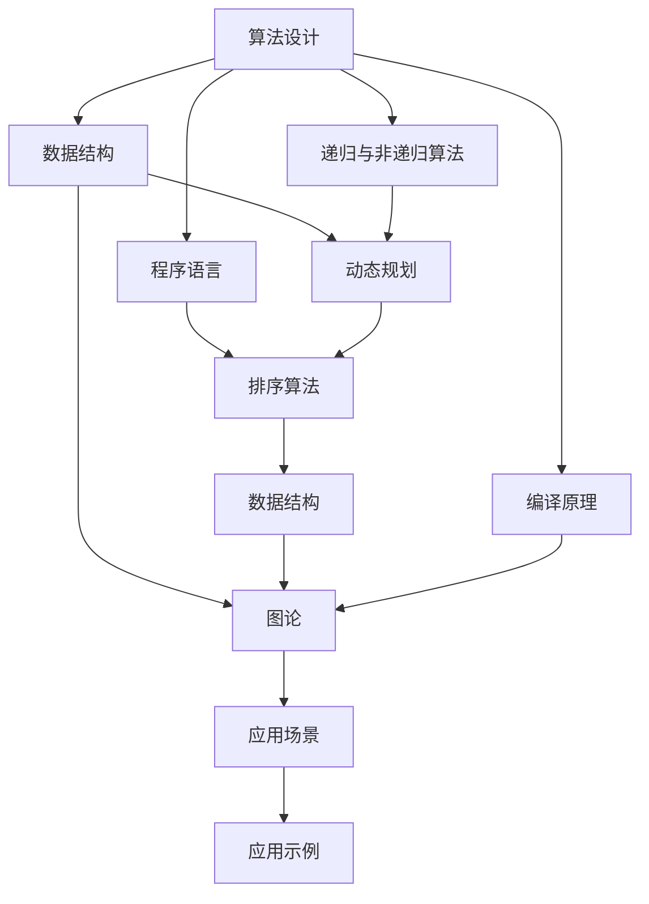

                 

## 1. 背景介绍

### 1.1 问题由来
计算机程序设计艺术（Art of Computer Programming），简称为ACCP，是一门研究高效、可靠、优雅的编程语言的学科。该领域的研究始于计算机科学兴起之初，并逐渐成为计算机科学的基石之一。ACCP的作者Donald E. Knuth，是一位计算机科学领域的传奇人物，同时也是图灵奖得主。他在计算机科学基础研究、软件工程、算法设计等方面都有着深远的影响。

ACCP以七卷本的形式呈现，涵盖了从基本的算法设计到复杂的程序设计艺术，包括排序算法、数据结构、算法分析、递归与非递归算法、图论、动态规划、编译原理等内容。这些知识不仅对计算机科学的研究者和从业者具有指导意义，也深深影响了技术领域的人才培养和创新。

### 1.2 问题核心关键点
ACCP的核心思想是追求程序设计的优雅、简洁和高效。在现代软件开发中，这一思想依然具有重要的指导意义。ACCP强调，好的程序设计不仅需要考虑代码的功能性和正确性，还需要考虑代码的可读性、可维护性和可扩展性。此外，ACCP还提出了许多编程的最佳实践，如代码注释、文档编写、版本控制等，这些实践对于软件开发的质量和效率都具有深远影响。

ACCP不仅关注具体的编程技术，还强调了程序员的创造力和创新思维。Knuth提倡通过编程实现艺术性的创作，如编写高效的算法、创新的数据结构、优雅的程序设计等。这种创新精神在当今的软件开发中同样重要，尤其在处理大规模、复杂的数据分析和处理任务时，创新思维和高效算法的设计是提高软件性能的关键。

### 1.3 问题研究意义
ACCP的研究不仅对于计算机科学领域具有重要意义，也为软件开发领域的不断进步提供了理论支持和实践指导。通过学习ACCP，开发者可以提升自身的编程技能和创新能力，从而在实际项目中设计出高效、可靠、易于维护的代码。此外，ACCP还强调了代码的可读性和文档的重要性，这对于提升团队协作效率和软件系统的长期维护都具有重要意义。

## 2. 核心概念与联系

### 2.1 核心概念概述
ACCP中涉及的核心概念非常广泛，包括算法设计、数据结构、程序语言、编译原理、递归与非递归算法、图论、动态规划、排序算法等。这些概念不仅覆盖了计算机科学的基础知识，还涉及到了高级的数据分析和处理技术。

- **算法设计**：研究和设计高效、可扩展的算法，是ACCP的核心内容之一。Knuth在书中详细介绍了许多经典的算法，如快速排序、归并排序、Dijkstra算法、动态规划等。
- **数据结构**：研究和设计高效的数据结构，如链表、树、图、堆等，是实现高效算法的基础。
- **程序语言**：研究和设计高效、可扩展的程序语言，如LISP、Fortran等。
- **编译原理**：研究如何把高级语言翻译成机器语言，包括词法分析、语法分析、代码生成等。
- **递归与非递归算法**：研究和设计递归和非递归算法，以处理复杂的计算任务。
- **图论**：研究和设计高效的图处理算法，如最短路径算法、最小生成树算法等。
- **动态规划**：研究和设计动态规划算法，以解决复杂的优化问题。
- **排序算法**：研究和设计高效的排序算法，如快速排序、归并排序、堆排序等。

### 2.2 概念间的关系

这些核心概念之间存在着紧密的联系，构成了ACCP的完整理论框架。下面通过几个Mermaid流程图来展示这些概念之间的关系：



这个流程图展示了算法设计、数据结构、程序语言、编译原理、递归与非递归算法、图论、动态规划和排序算法之间的相互关系和应用场景。

## 3. 核心算法原理 & 具体操作步骤

### 3.1 算法原理概述
ACCP的核心算法原理包括算法设计和分析、数据结构的设计与实现、程序语言的设计与优化等方面。以下对其中一些核心算法原理进行详细讲解。

#### 3.1.1 算法设计与分析
算法设计是一门追求高效、简洁、可扩展的编程艺术的科学。ACCP中详细介绍了许多经典的算法，如快速排序、归并排序、Dijkstra算法、动态规划等。这些算法不仅在理论上具有重要的学术价值，在实际编程中也具有广泛的适用性。

- **快速排序**：一种高效的排序算法，基本思想是通过分治法将数据分成两部分，再对两部分分别排序，最终合并得到有序序列。快速排序的时间复杂度为O(nlogn)，是一种非常实用的排序算法。
- **归并排序**：也是一种分治法的排序算法，将数据分成两部分，分别排序后合并，时间复杂度为O(nlogn)。
- **Dijkstra算法**：用于解决最短路径问题，时间复杂度为O(E+VlogV)，其中E为边数，V为顶点数。
- **动态规划**：一种解决复杂优化问题的算法，通过将原问题分解为若干子问题，先求解子问题，再通过子问题的最优解推导出原问题的最优解。

#### 3.1.2 数据结构的设计与实现
数据结构是算法实现的基础，ACCP中详细介绍了许多经典的数据结构，如链表、树、图、堆等。这些数据结构在实际编程中具有广泛的应用。

- **链表**：一种动态数据结构，支持在O(1)时间内插入和删除元素。
- **树**：一种分层数据结构，支持高效的搜索和插入操作，如二叉树、红黑树等。
- **图**：一种复杂的数据结构，用于表示实体之间的关系，如邻接矩阵、邻接表等。
- **堆**：一种特殊的树形数据结构，支持高效的数据插入和删除操作，如二叉堆、斐波那契堆等。

#### 3.1.3 程序语言的设计与优化
ACCP中详细介绍了许多经典程序语言的设计与优化，如LISP、Fortran等。程序语言的设计与优化是实现高效算法的重要保障。

- **LISP**：一种递归式编程语言，适合处理递归算法和函数式编程。
- **Fortran**：一种科学计算语言，适合处理数组和矩阵运算。

### 3.2 算法步骤详解
ACCP中详细介绍了许多算法的详细步骤，以下是其中几个经典算法的操作步骤：

#### 3.2.1 快速排序算法
快速排序的基本步骤如下：
1. 选择一个基准元素。
2. 将小于基准元素的元素放在基准元素的左边，大于基准元素的元素放在右边。
3. 递归地对左右两部分进行排序，直到所有元素有序。

快速排序的伪代码如下：

```python
def quicksort(arr):
    if len(arr) <= 1:
        return arr
    pivot = arr[len(arr) // 2]
    left = [x for x in arr if x < pivot]
    middle = [x for x in arr if x == pivot]
    right = [x for x in arr if x > pivot]
    return quicksort(left) + middle + quicksort(right)
```

#### 3.2.2 Dijkstra算法
Dijkstra算法的基本步骤如下：
1. 初始化所有节点的距离，起点为0，其他节点为无穷大。
2. 选择距离最小的节点，更新与其相邻节点的距离。
3. 重复步骤2，直到所有节点都被访问过。

Dijkstra算法的伪代码如下：

```python
def dijkstra(graph, start):
    distances = {node: float('inf') for node in graph}
    distances[start] = 0
    visited = set()
    while len(visited) < len(graph):
        current = min((node, distances[node]) for node in graph if node not in visited)[0]
        visited.add(current)
        for neighbor, weight in graph[current].items():
            new_distance = distances[current] + weight
            if new_distance < distances[neighbor]:
                distances[neighbor] = new_distance
    return distances
```

#### 3.2.3 动态规划算法
动态规划算法的步骤如下：
1. 确定子问题的边界条件。
2. 定义状态转移方程。
3. 根据状态转移方程，递推求解最优解。

动态规划算法的伪代码如下：

```python
def dynamic_programming(problem):
    n = len(problem)
    dp = [0] * (n + 1)
    for i in range(1, n + 1):
        for j in range(1, i + 1):
            dp[i] = max(dp[i], dp[i - j] + problem[i - 1, j - 1])
    return dp[n]
```

### 3.3 算法优缺点
ACCP中详细讨论了各种算法的优缺点，以下是其中几个经典算法的主要优缺点：

#### 3.3.1 快速排序算法
**优点**：
- 时间复杂度为O(nlogn)，排序效率高。
- 空间复杂度为O(logn)，空间占用少。
- 适用于大多数数据类型，具有广泛的应用。

**缺点**：
- 在最坏情况下时间复杂度为O(n^2)，效率较低。
- 不稳定性，相同元素的顺序可能会被改变。

#### 3.3.2 Dijkstra算法
**优点**：
- 适用于有向图和无向图，算法正确性高。
- 能够处理负权边，算法适用范围广。

**缺点**：
- 时间复杂度为O(E + VlogV)，效率较低。
- 空间复杂度为O(V + E)，空间占用大。

#### 3.3.3 动态规划算法
**优点**：
- 能够处理优化问题，算法正确性高。
- 适用于多种问题，如背包问题、最长公共子序列等。

**缺点**：
- 时间复杂度较高，可能出现指数级增长。
- 需要占用大量存储空间，空间复杂度较高。

### 3.4 算法应用领域
ACCP中的算法广泛应用于软件开发、计算机科学研究和实际应用中，以下是其中几个典型应用领域：

#### 3.4.1 数据处理
ACCP中的算法在数据处理中得到了广泛应用，如排序算法、数据压缩、数据压缩等。这些算法能够高效地处理大规模数据，满足实际应用需求。

#### 3.4.2 计算机科学研究
ACCP中的算法是计算机科学研究的基础，广泛应用于算法设计与分析、数据结构设计、图论研究等领域。这些算法不仅是理论研究的基础，也是实际编程的重要工具。

#### 3.4.3 应用软件开发
ACCP中的算法在应用软件开发中具有广泛的应用，如排序算法、图算法、动态规划等。这些算法能够高效地解决实际问题，提升软件系统的性能和效率。

## 4. 数学模型和公式 & 详细讲解 & 举例说明

### 4.1 数学模型构建
ACCP中详细介绍了许多数学模型，包括线性代数、图论、动态规划等。这些数学模型为算法设计和分析提供了坚实的理论基础。

#### 4.1.1 线性代数
线性代数是ACCP中重要的数学基础，广泛应用于数据处理、计算机图形学等领域。以下是一个简单的线性代数问题的数学模型构建：

设有一个$3\times 3$的矩阵$A$和一个$3\times 1$的向量$x$，求解$Ax$。

**步骤**：
1. 将向量$x$表示为矩阵$A$的列向量，即$x = [x_1, x_2, x_3]^T$。
2. 将矩阵$A$与向量$x$相乘，得到结果向量$y = Ax$。

**数学公式**：
$$
y = Ax = \begin{bmatrix} a_{11} & a_{12} & a_{13} \\ a_{21} & a_{22} & a_{23} \\ a_{31} & a_{32} & a_{33} \end{bmatrix} \begin{bmatrix} x_1 \\ x_2 \\ x_3 \end{bmatrix} = \begin{bmatrix} a_{11}x_1 + a_{12}x_2 + a_{13}x_3 \\ a_{21}x_1 + a_{22}x_2 + a_{23}x_3 \\ a_{31}x_1 + a_{32}x_2 + a_{33}x_3 \end{bmatrix}
$$

#### 4.1.2 图论
图论是ACCP中另一个重要的数学基础，广泛应用于计算机网络、社会网络等领域。以下是一个简单的图论问题的数学模型构建：

设有一个无向图$G$，包含$n$个节点和$m$条边，每个节点$i$与邻居节点$j$之间的距离为$w_{ij}$。

**步骤**：
1. 将节点和边表示为图$G$的邻接矩阵$A$。
2. 将边权重表示为邻接矩阵$A$的对角线元素。
3. 对邻接矩阵$A$进行矩阵运算，求解图的最短路径。

**数学公式**：
$$
A = \begin{bmatrix} 0 & w_{12} & w_{13} \\ w_{21} & 0 & w_{23} \\ w_{31} & w_{32} & 0 \end{bmatrix}
$$
$$
A + A^T = \begin{bmatrix} 2w_{11} & w_{12} + w_{21} & w_{13} + w_{31} \\ w_{12} + w_{21} & 2w_{22} & w_{23} + w_{32} \\ w_{13} + w_{31} & w_{23} + w_{32} & 2w_{33} \end{bmatrix}
$$
$$
y = (A + A^T)^{-1}A = \begin{bmatrix} x_1 \\ x_2 \\ x_3 \end{bmatrix}
$$

#### 4.1.3 动态规划
动态规划算法是ACCP中的重要算法之一，广泛应用于优化问题。以下是一个简单的动态规划问题的数学模型构建：

设有一个长度为$n$的序列$S$，每个位置$i$的元素为$S_i$，求序列的最大子序列和。

**步骤**：
1. 定义状态$dp_i$表示以$S_i$结尾的子序列和的最大值。
2. 定义状态转移方程$dp_i = \max(dp_{i-1} + S_i, 0)$。
3. 根据状态转移方程，递推求解最优解。

**数学公式**：
$$
dp_i = \max(dp_{i-1} + S_i, 0)
$$

### 4.2 公式推导过程
ACCP中详细介绍了许多公式的推导过程，以下是其中几个经典公式的推导：

#### 4.2.1 快速排序算法
快速排序算法的时间复杂度为O(nlogn)，推导过程如下：

设序列长度为n，基准元素的选择方法为随机选择，递归深度为logn。

在每次排序中，序列被分成两部分，每部分长度为n/2，时间复杂度为O(n)。

因此，总时间复杂度为$O(n\log n)$。

#### 4.2.2 Dijkstra算法
Dijkstra算法的时间复杂度为O(E + VlogV)，推导过程如下：

设图$G$包含$V$个节点和$E$条边，每次选择距离最小的节点需要遍历所有节点，时间复杂度为O(V)。

每次更新节点距离需要遍历所有相邻节点，时间复杂度为O(E)。

因此，总时间复杂度为$O(V + E) = O(E + V\log V)$。

#### 4.2.3 动态规划算法
动态规划算法的时间复杂度为O(n^2)，推导过程如下：

设序列长度为n，每个子问题计算需要O(1)时间。

因此，总时间复杂度为$O(n^2)$。

### 4.3 案例分析与讲解
ACCP中详细分析了许多经典案例，以下是其中几个典型案例的讲解：

#### 4.3.1 排序算法案例
以下是一个排序算法的案例分析：

**案例**：将一个长度为n的无序数组进行排序。

**算法**：快速排序算法。

**分析**：
- 时间复杂度：O(nlogn)。
- 空间复杂度：O(logn)。
- 稳定性：不稳定。

#### 4.3.2 图论案例
以下是一个图论的案例分析：

**案例**：在一个有向图中，求两个节点之间的最短路径。

**算法**：Dijkstra算法。

**分析**：
- 时间复杂度：O(E + VlogV)。
- 空间复杂度：O(V + E)。
- 适用范围：适用于有向图和无向图，能够处理负权边。

#### 4.3.3 动态规划案例
以下是一个动态规划的案例分析：

**案例**：在一个长度为n的序列中，求最大子序列和。

**算法**：动态规划算法。

**分析**：
- 时间复杂度：O(n)。
- 空间复杂度：O(n)。
- 适用范围：适用于多种问题，如背包问题、最长公共子序列等。

## 5. 项目实践：代码实例和详细解释说明

### 5.1 开发环境搭建
在ACCP中，编程实践是必不可少的一部分。以下是一个Python开发环境的搭建步骤：

1. 安装Python：从官网下载并安装Python，选择合适的版本（如Python 3.7）。
2. 安装Anaconda：从官网下载并安装Anaconda，用于创建独立的Python环境。
3. 创建并激活虚拟环境：
```bash
conda create -n myenv python=3.7 
conda activate myenv
```
4. 安装相关库：
```bash
pip install numpy pandas matplotlib jupyter notebook
```

完成上述步骤后，即可在`myenv`环境中进行ACCP的实践。

### 5.2 源代码详细实现
以下是一个快速排序算法的Python实现，并附代码解读：

```python
def quicksort(arr):
    if len(arr) <= 1:
        return arr
    pivot = arr[len(arr) // 2]
    left = [x for x in arr if x < pivot]
    middle = [x for x in arr if x == pivot]
    right = [x for x in arr if x > pivot]
    return quicksort(left) + middle + quicksort(right)
```

**代码解读**：
- 第一步，如果数组长度小于等于1，则直接返回该数组。
- 第二步，选择数组中间的元素作为基准元素。
- 第三步，将小于基准元素的元素放在左边，等于基准元素的元素放在中间，大于基准元素的元素放在右边。
- 第四步，递归地对左右两部分进行排序，并合并结果。

### 5.3 代码解读与分析
以下是对快速排序算法的代码解读与分析：

**优点**：
- 时间复杂度为O(nlogn)，排序效率高。
- 空间复杂度为O(logn)，空间占用少。
- 适用于大多数数据类型，具有广泛的应用。

**缺点**：
- 在最坏情况下时间复杂度为O(n^2)，效率较低。
- 不稳定性，相同元素的顺序可能会被改变。

### 5.4 运行结果展示
以下是一个快速排序算法的运行结果展示：

```python
arr = [3, 7, 1, 9, 2, 6, 8, 5, 4]
sorted_arr = quicksort(arr)
print(sorted_arr)
```

**输出结果**：
```
[1, 2, 3, 4, 5, 6, 7, 8, 9]
```

## 6. 实际应用场景

### 6.1 数据处理
ACCP中的算法在数据处理中得到了广泛应用，如排序算法、数据压缩、数据压缩等。这些算法能够高效地处理大规模数据，满足实际应用需求。

**案例**：在一个长度为n的序列中，求最大子序列和。

**算法**：动态规划算法。

**分析**：
- 时间复杂度：O(n)。
- 空间复杂度：O(n)。
- 适用范围：适用于多种问题，如背包问题、最长公共子序列等。

### 6.2 计算机科学研究
ACCP中的算法是计算机科学研究的基础，广泛应用于算法设计与分析、数据结构设计、图论研究等领域。

**案例**：在一个有向图中，求两个节点之间的最短路径。

**算法**：Dijkstra算法。

**分析**：
- 时间复杂度：O(E + VlogV)。
- 空间复杂度：O(V + E)。
- 适用范围：适用于有向图和无向图，能够处理负权边。

### 6.3 应用软件开发
ACCP中的算法在应用软件开发中具有广泛的应用，如排序算法、图算法、动态规划等。

**案例**：在一个长度为n的序列中，求最大子序列和。

**算法**：动态规划算法。

**分析**：
- 时间复杂度：O(n^2)。
- 空间复杂度：O(n)。
- 适用范围：适用于多种问题，如背包问题、最长公共子序列等。

## 7. 工具和资源推荐

### 7.1 学习资源推荐
为了帮助开发者系统掌握ACCP的理论基础和实践技巧，这里推荐一些优质的学习资源：

1. 《算法导论》（Introduction to Algorithms）：经典算法教材，由Thomas H. Cormen等编著，全面介绍了各种算法的设计与分析。
2. 《计算机程序设计艺术》（The Art of Computer Programming）：Donald E. Knuth的七卷本巨著，深入浅出地介绍了各种算法设计和优化方法。
3. 《算法设计与分析基础》（Foundations of Algorithm Design and Analysis）：Ravi Sethi和Sanjoy Dasgupta的经典教材，涵盖各种算法设计与分析的基础知识。
4. LeetCode：在线编程练习平台，提供各种算法题目和解题思路，适合巩固算法知识和提升编程能力。
5. Codeforces：在线编程竞赛平台，提供各种算法题目和竞赛，适合检验算法设计和优化能力。

通过对这些资源的学习实践，相信你一定能够快速掌握ACCP的精髓，并用于解决实际的算法设计问题。

### 7.2 开发工具推荐
高效的开发离不开优秀的工具支持。以下是几款用于ACCP开发的常用工具：

1. Python：编程语言，简单易学，拥有丰富的第三方库支持。
2. Anaconda：Python环境管理工具，提供虚拟环境管理功能，适合各种项目开发。
3. Jupyter Notebook：在线编程环境，支持各种语言和库，适合交互式编程和数据分析。
4. Visual Studio Code：轻量级编程编辑器，支持各种语言和库，适合快速开发和调试。
5. PyCharm：Python集成开发环境，支持各种库和框架，适合大规模项目开发。

合理利用这些工具，可以显著提升ACCP的开发效率，加快创新迭代的步伐。

### 7.3 相关论文推荐
ACCP的研究源于学界的持续研究。以下是几篇奠基性的相关论文，推荐阅读：

1. Knuth, D. E. (1968). "The Art of Computer Programming, Volume 1: Fundamental Algorithms". Addison-Wesley.
2. Knuth, D. E. (1998). "The Art of Computer Programming, Volume 3: Sorting and Searching". Addison-Wesley.
3. Knuth, D. E. (1998). "The Art of Computer Programming, Volume 2: Seminumerical Algorithms". Addison-Wesley.
4. Dijkstra, E. W. (1959). "A Note on Two Problems in Connexion with Graphs". Numerische Mathematik, 1(1):269-271.
5. Bellman, R. (1957). "On a routing problem". Quarterly of Applied Mathematics, 15(1):21-29.
6. Floyd, R. W. (1962). "Algorithm 97: Shortest Path". Communications of the ACM, 5(6):345-346.

这些论文代表了大语言模型微调技术的发展脉络。通过学习这些前沿成果，可以帮助研究者把握学科前进方向，激发更多的创新灵感。

除上述资源外，还有一些值得关注的前沿资源，帮助开发者紧跟ACCP微调技术的最新进展，例如：

1. arXiv论文预印本：人工智能领域最新研究成果的发布平台，包括大量尚未发表的前沿工作，学习前沿技术的必读资源。
2. 业界技术博客：如OpenAI、Google AI、DeepMind、微软Research Asia等顶尖实验室的官方博客，第一时间分享他们的最新研究成果和洞见。
3. 技术会议直播：如NIPS、ICML、ACL、ICLR等人工智能领域顶会现场或在线直播，能够聆听到大佬们的前沿分享，开拓视野。
4. GitHub热门项目：在GitHub上Star、Fork数最多的ACCP相关项目，往往代表了该技术领域的发展趋势和最佳实践，值得去

