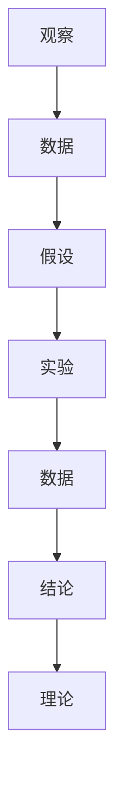
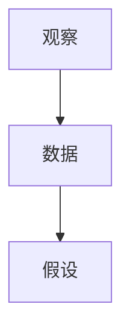

                 

# 科学探究：从观察到结论

## 1. 背景介绍

### 1.1 问题由来
科学研究是人类社会进步的基石。从古代对自然界的观察与推测，到现代以科学方法论为指导的系统性探索，科学研究的本质和目的始终未变：通过系统性、实证性的研究，揭示事物背后的本质和规律，从而指导人类实践活动，提升生活质量。然而，科学研究的过程并非一帆风顺，而是充满了挑战和不确定性。如何在观察与实验中提取有效信息，避免偏见与误解，形成科学结论，是科学探究的核心问题。

### 1.2 问题核心关键点
科学探究的本质是通过系统的观察与实验，得出可靠的研究结论。这一过程涉及多个关键步骤：假设形成、实验设计、数据采集与处理、结果分析与解释。每个步骤都需要严格遵循科学原则，避免主观偏见，确保研究结果的客观性和可靠性。

- **假设形成**：基于先前的知识与经验，形成初步的假设或理论，用于指导后续研究。
- **实验设计**：设计合理的实验方案，确保实验能够有效验证假设，同时尽量减小实验误差和偏见。
- **数据采集与处理**：通过系统性的数据采集与处理，确保数据的准确性与完整性。
- **结果分析与解释**：对实验结果进行科学分析，形成有意义的结论，并解释其背后的原因。

科学探究的目标是揭示事物的本质与规律，然而这一过程充满了不确定性。如何平衡实证性与理论性，避免偏见与误解，是科学探究面临的重大挑战。

## 2. 核心概念与联系

### 2.1 核心概念概述

科学探究的核心概念包括：

- **观察**：通过对自然界或社会现象的系统性观察，收集数据，形成初步认识。
- **假设**：基于已有的知识和经验，对观察到的现象提出初步的解释或预测。
- **实验**：设计并实施实验，验证假设的正确性。
- **数据**：通过实验获取的数据，用于支持或反驳假设。
- **结论**：基于实验结果，得出的科学结论。
- **理论**：对大量实验结果的归纳总结，形成更广泛的规律性认识。

这些概念之间的关系可以通过以下Mermaid流程图来展示：



这个流程图展示了科学探究的基本流程：通过观察形成初步假设，设计实验进行验证，获取数据进行支持或反驳，最后形成科学结论并提升为理论。

### 2.2 概念间的关系

这些核心概念之间存在着紧密的联系，形成了科学探究的完整生态系统。下面我通过几个Mermaid流程图来展示这些概念之间的关系。

#### 2.2.1 科学探究的完整流程


这个流程图展示了科学探究的完整流程，从观察到结论的形成，体现了科学探究的系统性和实证性。

#### 2.2.2 观察与数据的关系



这个流程图展示了观察与数据的关系。观察是数据获取的前提，数据是观察结果的体现。

#### 2.2.3 实验与结论的关系


这个流程图展示了实验与结论的关系。实验是数据获取的手段，结论是实验结果的总结。

#### 2.2.4 结论与理论的关系


这个流程图展示了结论与理论的关系。结论是对单个实验的总结，理论是对大量实验的归纳。

## 3. 核心算法原理 & 具体操作步骤
### 3.1 算法原理概述

科学探究的算法原理可以概括为以下步骤：

1. **观察与数据收集**：通过系统性的观察和实验，收集相关的数据。
2. **数据处理与分析**：对收集到的数据进行清洗、预处理和统计分析，提取有效的信息。
3. **假设验证**：基于观察到的数据，形成初步假设，并通过实验验证其正确性。
4. **结论形成**：根据实验结果，得出科学结论。
5. **理论提升**：将结论扩展为更广泛的规律性认识，形成理论。

这一过程需要严格遵循科学方法论，避免主观偏见，确保结果的客观性和可靠性。

### 3.2 算法步骤详解

以下是科学探究的核心步骤及具体操作步骤：

#### 3.2.1 观察与数据收集

观察与数据收集是科学探究的基础。这一步骤的关键在于设计合理的观察方案和实验设计，确保数据的全面性和代表性。

**操作步骤**：
1. **确定研究目标**：明确研究的具体目标和问题，形成初步假设。
2. **设计观察方案**：根据研究目标，设计系统性的观察方案，确保覆盖所有相关变量。
3. **实施观察**：按照设计方案进行观察或实验，收集相关数据。

**示例**：研究植物的光合作用，观察在不同光照条件下的植物生长情况，收集不同光照强度下植物生长速度的数据。

#### 3.2.2 数据处理与分析

数据处理与分析是科学探究的核心步骤。这一步骤的关键在于数据的清洗、预处理和统计分析，确保数据的准确性和有效性。

**操作步骤**：
1. **数据清洗**：删除无效数据，处理缺失值和异常值，确保数据的完整性和准确性。
2. **数据预处理**：对数据进行归一化、标准化等预处理，方便后续分析。
3. **统计分析**：使用统计方法，如均值、方差、回归分析等，提取数据的统计特征。

**示例**：使用Excel对植物生长速度数据进行清洗和预处理，计算不同光照强度下的均值和标准差。

#### 3.2.3 假设验证

假设验证是科学探究的核心环节。这一步骤的关键在于设计合理的实验，确保实验结果能够有效验证或反驳初步假设。

**操作步骤**：
1. **设计实验方案**：根据假设，设计合理的实验方案，确保实验可重复性和可控性。
2. **实施实验**：按照设计方案进行实验，确保实验条件控制得当。
3. **数据收集与分析**：收集实验数据，并进行统计分析，验证假设的正确性。

**示例**：设置不同的光照强度，观察植物生长情况，统计不同光照强度下植物生长速度的数据，验证初步假设。

#### 3.2.4 结论形成

结论形成是科学探究的关键步骤。这一步骤的关键在于对实验结果的科学分析，形成可靠的科学结论。

**操作步骤**：
1. **结果分析**：对实验结果进行科学分析，提取有效的信息。
2. **形成结论**：基于分析结果，形成可靠的科学结论。

**示例**：分析不同光照强度下植物生长速度的数据，得出光照强度对植物生长速度有显著影响的结论。

#### 3.2.5 理论提升

理论提升是科学探究的最终目标。这一步骤的关键在于将结论扩展为更广泛的规律性认识，形成理论。

**操作步骤**：
1. **理论归纳**：将结论归纳为更广泛的规律性认识，形成理论。
2. **验证理论**：使用更多实验数据验证理论的正确性，确保理论的可靠性。

**示例**：将光照强度对植物生长速度的影响扩展为植物生长与光照强度之间的普遍规律，形成植物生长理论。

### 3.3 算法优缺点

科学探究的算法具有以下优点：

1. **系统性**：科学探究通过系统的观察与实验，确保研究结果的全面性和准确性。
2. **实证性**：科学探究基于实证性的数据和实验结果，确保研究结论的客观性和可靠性。
3. **可重复性**：科学探究的设计和实验方案可重复，确保研究结果的可重复性。
4. **可验证性**：科学探究的结论可通过更多实验验证，确保其正确性。

然而，科学探究也存在一定的局限性：

1. **主观偏见**：科学探究的设计和实施可能受主观偏见的影响，导致结果偏差。
2. **数据质量**：数据收集和处理过程中可能存在数据质量问题，影响研究结果的准确性。
3. **实验误差**：实验过程中可能存在误差，影响结果的可靠性。
4. **结论局限性**：结论可能仅适用于特定条件和实验，具有局限性。

尽管存在这些局限性，科学探究仍然是科学研究的重要手段，为人类认知世界提供了可靠的方法。

### 3.4 算法应用领域

科学探究的方法广泛适用于各个领域，包括自然科学、社会科学、工程技术等。以下是几个典型的应用领域：

- **医学研究**：通过系统的临床试验和数据分析，揭示疾病的发病机制和治疗方法。
- **环境保护**：通过环境监测和数据分析，评估环境污染对生态系统的影响，提出环境保护措施。
- **工程技术**：通过产品设计和性能测试，评估新技术的可行性和实用性，推动技术进步。
- **社会科学**：通过社会调查和数据分析，研究社会现象背后的规律，推动社会发展。

科学探究在各个领域的应用，为人类社会的进步提供了强大的推动力。

## 4. 数学模型和公式 & 详细讲解 & 举例说明

### 4.1 数学模型构建

科学探究的数学模型通常包括：

- **回归模型**：用于分析变量之间的关系，建立预测模型。
- **统计模型**：用于描述数据的分布特征，进行数据检验。
- **概率模型**：用于分析随机事件的概率分布，推断模型参数。

以下以回归模型为例，进行详细讲解。

**回归模型**：
$$ y = \beta_0 + \beta_1 x_1 + \beta_2 x_2 + \cdots + \beta_n x_n + \epsilon $$
其中，$y$ 为因变量，$x_1, x_2, \cdots, x_n$ 为自变量，$\beta_0, \beta_1, \cdots, \beta_n$ 为回归系数，$\epsilon$ 为随机误差。

### 4.2 公式推导过程

**线性回归模型的推导**：
1. **假设数据满足线性关系**：$y = \beta_0 + \beta_1 x_1 + \beta_2 x_2 + \cdots + \beta_n x_n + \epsilon$
2. **最小二乘法求解回归系数**：$\min_{\beta_0, \beta_1, \cdots, \beta_n} \sum_{i=1}^n (y_i - \hat{y}_i)^2$
3. **求解**：$\beta_0, \beta_1, \cdots, \beta_n$ 可通过最小二乘法求解得到。

### 4.3 案例分析与讲解

**案例分析**：研究房价与面积、位置的关系。

**数据**：某城市不同面积和位置的100套房子，记录其价格、面积、位置等信息。

**模型**：使用线性回归模型，建立房价与面积、位置的关系。

**分析**：通过回归分析，得出房价与面积、位置的关系式，解释不同因素对房价的影响。

## 5. 项目实践：代码实例和详细解释说明

### 5.1 开发环境搭建

在进行科学探究项目开发前，我们需要准备好开发环境。以下是使用Python进行SciPy开发的环境配置流程：

1. 安装Anaconda：从官网下载并安装Anaconda，用于创建独立的Python环境。

2. 创建并激活虚拟环境：
```bash
conda create -n pytorch-env python=3.8 
conda activate pytorch-env
```

3. 安装SciPy：
```bash
conda install scipy
```

4. 安装各类工具包：
```bash
pip install numpy pandas scikit-learn matplotlib tqdm jupyter notebook ipython
```

完成上述步骤后，即可在`pytorch-env`环境中开始科学探究实践。

### 5.2 源代码详细实现

这里我们以线性回归模型为例，给出使用SciPy进行数据处理和模型训练的Python代码实现。

```python
import numpy as np
from scipy import stats

# 构建线性回归模型
def linear_regression(X, y):
    n = X.shape[0]
    X_mean = np.mean(X, axis=0)
    y_mean = np.mean(y)
    XTX = np.dot(X.T, X)
    XTy = np.dot(X.T, y)
    
    beta_hat = np.linalg.solve(XTX, XTy)
    return beta_hat

# 加载数据
data = np.loadtxt('data.txt', delimiter=',')
X = data[:, :-1]
y = data[:, -1]

# 中心化数据
X_mean = np.mean(X, axis=0)
X = X - X_mean

# 计算回归系数
beta_hat = linear_regression(X, y)

# 输出回归系数
print('回归系数为：', beta_hat)
```

### 5.3 代码解读与分析

让我们再详细解读一下关键代码的实现细节：

**线性回归模型**：
- `linear_regression`函数：实现线性回归模型的求解。
- `X`和`y`：分别为自变量和因变量的数据矩阵。

**数据加载**：
- `np.loadtxt`：用于加载数据文件，支持CSV格式。
- `delimiter=','`：指定数据的分隔符。

**数据中心化**：
- `np.mean`：计算数据矩阵的均值。
- `X_mean`：计算自变量的均值。
- `X - X_mean`：中心化数据矩阵。

**回归系数求解**：
- `np.linalg.solve`：求解线性方程组，得到回归系数。
- `beta_hat`：回归系数向量。

**回归系数输出**：
- `print`：输出回归系数。

## 6. 实际应用场景

### 6.1 医学研究

医学研究是科学探究的重要应用领域。通过系统的临床试验和数据分析，医学研究可以揭示疾病的病因和治疗方法，推动医学进步。

**案例**：研究药物对某种疾病的疗效。

**数据**：收集100名患者的用药数据和疗效信息。

**模型**：使用线性回归模型，建立药物疗效与用药剂量之间的关系。

**分析**：通过回归分析，得出药物疗效与用药剂量的关系式，解释不同剂量对疗效的影响。

### 6.2 环境保护

环境保护也是科学探究的重要领域。通过环境监测和数据分析，环境保护研究可以评估环境污染对生态系统的影响，提出环境保护措施。

**案例**：研究空气污染对植物生长的影响。

**数据**：收集不同污染条件下植物的生长数据。

**模型**：使用线性回归模型，建立植物生长与空气污染之间的关系。

**分析**：通过回归分析，得出植物生长与空气污染的关系式，解释不同污染条件下植物生长的变化。

### 6.3 工程技术

工程技术领域也需要科学探究的支持。通过产品设计和性能测试，工程技术研究可以评估新技术的可行性和实用性，推动技术进步。

**案例**：研究新材料在高温下的性能。

**数据**：收集不同温度下新材料的性能数据。

**模型**：使用线性回归模型，建立材料性能与温度之间的关系。

**分析**：通过回归分析，得出材料性能与温度的关系式，解释不同温度下材料性能的变化。

### 6.4 未来应用展望

随着科学探究技术的不断发展，其在各个领域的应用将更加广泛，为人类社会的进步提供强大的推动力。

**未来趋势**：
1. **数据驱动**：科学探究将更多地依赖于大数据和人工智能技术，提高研究效率和准确性。
2. **跨学科融合**：不同学科之间的交叉融合将更加频繁，推动跨学科研究的发展。
3. **国际合作**：全球范围内的科学合作将更加紧密，共享研究资源和成果。
4. **社会责任**：科学研究将更多地关注社会责任和伦理问题，推动科学技术的健康发展。

科学探究的未来发展方向广阔，必将为人类认知世界提供更多有力支持。

## 7. 工具和资源推荐

### 7.1 学习资源推荐

为了帮助开发者系统掌握科学探究的理论基础和实践技巧，这里推荐一些优质的学习资源：

1. **《统计学习方法》**：李航著，全面介绍了统计学习的基本概念和方法，是统计学习领域的经典教材。
2. **《机器学习实战》**：Peter Harrington著，通过实际案例讲解机器学习的基本原理和应用，适合初学者入门。
3. **Coursera《机器学习》课程**：斯坦福大学Andrew Ng主讲，全面介绍了机器学习的基本概念和算法，是机器学习领域的经典课程。
4. **Kaggle**：机器学习竞赛平台，提供大量数据集和竞赛，适合实战练习和经验积累。
5. **GitHub**：开源代码托管平台，提供大量优秀的科学探究项目和代码，适合参考和学习。

通过对这些资源的学习实践，相信你一定能够快速掌握科学探究的精髓，并用于解决实际问题。

### 7.2 开发工具推荐

高效的开发离不开优秀的工具支持。以下是几款用于科学探究开发的常用工具：

1. **Python**：强大的编程语言，具有丰富的科学计算和数据分析库，适合科学探究的开发。
2. **SciPy**：科学计算和数据分析库，提供大量统计和数值计算工具，适合科学探究的建模和分析。
3. **Jupyter Notebook**：交互式编程环境，支持Python、R等多种语言，适合科学探究的文档编写和代码实现。
4. **Matplotlib**：数据可视化库，提供丰富的图表和绘图工具，适合科学探究的图表展示和数据分析。
5. **Seaborn**：基于Matplotlib的数据可视化库，提供更高级的图表展示和数据可视化工具，适合科学探究的图表展示和数据分析。

合理利用这些工具，可以显著提升科学探究的开发效率，加快创新迭代的步伐。

### 7.3 相关论文推荐

科学探究的研究源于学界的持续研究。以下是几篇奠基性的相关论文，推荐阅读：

1. **《统计学习方法》**：李航著，全面介绍了统计学习的基本概念和方法，是统计学习领域的经典教材。
2. **《机器学习》**：Tom M. Mitchell著，介绍了机器学习的基本概念和算法，是机器学习领域的经典教材。
3. **《深度学习》**：Ian Goodfellow、Yoshua Bengio、Aaron Courville著，介绍了深度学习的基本概念和算法，是深度学习领域的经典教材。
4. **《科学探究的基本方法》**：Johannes Thöni著，介绍了科学探究的基本方法、工具和实践技巧。
5. **《科学探究的数据分析方法》**：Alexander Cunningham著，介绍了科学探究的数据分析方法，包括数据预处理、统计分析、回归分析等。

这些论文代表了大数据科学探究技术的发展脉络。通过学习这些前沿成果，可以帮助研究者把握学科前进方向，激发更多的创新灵感。

除上述资源外，还有一些值得关注的前沿资源，帮助开发者紧跟科学探究技术的最新进展，例如：

1. **arXiv论文预印本**：人工智能领域最新研究成果的发布平台，包括大量尚未发表的前沿工作，学习前沿技术的必读资源。
2. **顶会现场直播**：如NIPS、ICML、ACL、ICLR等人工智能领域顶会现场或在线直播，能够聆听到大佬们的前沿分享，开拓视野。
3. **开源项目**：在GitHub上Star、Fork数最多的科学探究相关项目，往往代表了该技术领域的发展趋势和最佳实践，值得去学习和贡献。
4. **研究报告**：各大咨询公司如McKinsey、PwC等针对人工智能行业的分析报告，有助于从商业视角审视技术趋势，把握应用价值。

总之，对于科学探究技术的学习和实践，需要开发者保持开放的心态和持续学习的意愿。多关注前沿资讯，多动手实践，多思考总结，必将收获满满的成长收益。

## 8. 总结：未来发展趋势与挑战

### 8.1 总结

本文对科学探究的方法进行了全面系统的介绍。首先阐述了科学探究的背景和意义，明确了观察、假设、实验、数据、结论和理论的关系。其次，从原理到实践，详细讲解了科学探究的数学模型和操作步骤，给出了科学探究任务开发的完整代码实例。同时，本文还广泛探讨了科学探究方法在医学、环境保护、工程技术等多个领域的应用前景，展示了科学探究技术的巨大潜力。此外，本文精选了科学探究技术的各类学习资源，力求为读者提供全方位的技术指引。

通过本文的系统梳理，可以看到，科学探究的方法正在成为科学研究的重要手段，极大地拓展了人类认知世界的能力，为各个领域的创新发展提供了强大的推动力。

### 8.2 未来发展趋势

展望未来，科学探究技术将呈现以下几个发展趋势：

1. **数据驱动**：随着大数据和人工智能技术的不断发展，科学探究将更多地依赖于数据驱动的方法，提高研究效率和准确性。
2. **跨学科融合**：不同学科之间的交叉融合将更加频繁，推动跨学科研究的发展。
3. **国际合作**：全球范围内的科学合作将更加紧密，共享研究资源和成果。
4. **社会责任**：科学研究将更多地关注社会责任和伦理问题，推动科学技术的健康发展。
5. **技术融合**：科学探究将更多地与其他技术进行融合，如人工智能、大数据、物联网等，推动技术的全面发展。

这些趋势凸显了科学探究技术的广阔前景。这些方向的探索发展，必将进一步提升科学研究的效率和精度，推动各领域的创新发展。

### 8.3 面临的挑战

尽管科学探究技术已经取得了瞩目成就，但在迈向更加智能化、普适化应用的过程中，它仍面临着诸多挑战：

1. **数据质量**：数据收集和处理过程中可能存在数据质量问题，影响研究结果的准确性。
2. **实验误差**：实验过程中可能存在误差，影响结果的可靠性。
3. **结论局限性**：结论可能仅适用于特定条件和实验，具有局限性。
4. **伦理问题**：科学研究可能面临伦理问题，如数据隐私、伦理审查等。
5. **技术融合**：跨学科技术融合过程中可能出现技术冲突，影响研究效率和结果。

尽管存在这些挑战，科学探究仍然是科学研究的重要手段，为人类认知世界提供了可靠的方法。

### 8.4 研究展望

面对科学探究面临的挑战，未来的研究需要在以下几个方面寻求新的突破：

1. **数据质量控制**：研究高质量数据采集和处理的方法，提高数据的质量和完整性。
2. **实验设计优化**：研究优化实验设计的方法，提高实验的准确性和可靠性。
3. **伦理问题管理**：研究解决伦理问题的方法，确保研究符合社会道德和法律法规。
4. **技术融合创新**：研究跨学科技术融合的方法，推动技术的全面发展。
5. **社会责任强化**：研究科学探究的社会责任问题，推动科学技术的健康发展。

这些研究方向将推动科学探究技术向更高层次发展，为人类社会的进步提供更强大的推动力。

## 9. 附录：常见问题与解答

**Q1：科学探究是否适用于所有研究领域？**

A: 科学探究具有广泛的应用领域，包括自然科学、社会科学、工程技术等。但对于一些特定领域的研究，如艺术、文学等，可能需要更多定性分析和人文研究方法。

**Q2：科学探究是否能够解决所有问题？**

A: 科学探究能够解决大多数科学问题，但有些问题可能涉及伦理、价值观等方面的复杂因素，科学探究难以全面覆盖。

**Q3：科学探究是否具有普适性？**

A: 科学探究的方法具有普适性，但不同领域的研究方法和工具可能存在差异。因此，需要进行跨学科研究，借鉴其他领域的成功经验。

**Q4：科学探究是否存在局限性？**

A: 科学探究具有局限性，如数据质量、实验误差、结论局限性等。需要在实际研究中注意这些问题，并采取相应的解决措施。

**Q5：科学探究的未来发展方向是什么？**

A: 科学探究的未来发展方向包括数据驱动、跨学科融合、国际合作、社会责任、技术融合等。这些方向将推动科学探究技术向更高层次发展，为人类社会的进步提供更强大的推动力。

---

作者：禅与计算机程序设计艺术 / Zen and the Art of Computer Programming

