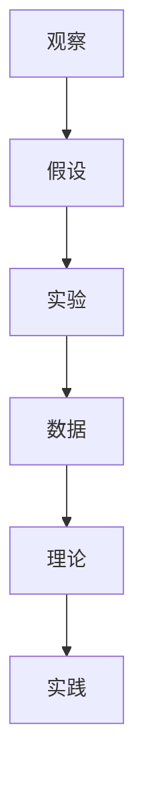
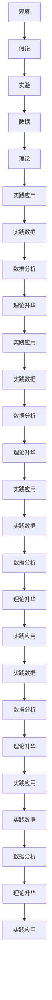

                 

# 科学探究：从观察到结论

## 1. 背景介绍

### 1.1 问题由来

在科学探究的历程中，我们常常会接触到各种实验和理论，从简单的观察开始，逐步建立起完整的科学体系。这一过程中，每个环节都至关重要，而从观察到结论的科学探究范式，为后续的深入研究和应用奠定了基础。

### 1.2 问题核心关键点

科学探究的范式主要包括以下几个关键点：
- 假设的形成：基于观察现象，提出初步假设或假说。
- 实验验证：通过设计实验或模拟验证假设的正确性。
- 数据分析：处理实验数据，得出初步结论。
- 理论升华：从实验数据中提炼出通用规律，形成理论框架。
- 实践应用：将理论应用于实际问题中，进一步验证和完善理论。

### 1.3 问题研究意义

探究科学探究的范式，有助于理解科学研究的本质，掌握科学探究的方法，从而在实际问题解决和创新应用中更加得心应手。

## 2. 核心概念与联系

### 2.1 核心概念概述

在科学探究的过程中，涉及许多核心概念，这些概念之间存在着紧密的联系，共同构成了科学探究的完整框架。

- 观察（Observation）：科学研究的基础，通过直接或间接的感知，获取关于现象或事实的数据。
- 假设（Hypothesis）：基于观察到的现象，提出的初步解释或预测。
- 实验（Experiment）：通过控制变量和操作环境，验证假设的正确性，收集数据。
- 数据（Data）：从实验或观察中获取的，反映现象或关系的数值、图表等。
- 理论（Theory）：通过数据分析和归纳，提炼出的对现象进行解释或预测的框架。
- 实践（Practice）：将理论应用于实际问题中，验证和完善理论。

这些概念之间的关系可以通过以下Mermaid流程图来展示：



这个流程图展示了大科学探究的各个阶段和它们之间的逻辑关系：

1. 从观察到假设：基于直接的感知和先前的知识，提出初步的解释或预测。
2. 通过实验验证：设计实验或模拟，进行变量控制，收集实验数据。
3. 数据分析和理论升华：处理实验数据，提炼出普遍规律，形成理论框架。
4. 实践应用和理论完善：将理论应用于实际问题中，进一步验证和完善理论。

### 2.2 概念间的关系

这些核心概念之间存在着紧密的联系，形成了科学探究的完整生态系统。下面我们通过几个Mermaid流程图来展示这些概念之间的关系。

#### 2.2.1 观察与假设的关系


这个流程图展示了从观察到理论升华的基本流程：观察现象，提出假设，设计实验验证假设，最后通过数据分析提炼出理论。

#### 2.2.2 实验与理论的关系


这个流程图展示了从实验数据到理论升华的过程：通过实验收集数据，分析数据提炼理论，将理论应用于实际问题中，并进一步完善理论。

#### 2.2.3 理论到实践的关系


这个流程图展示了从理论到实践应用，再回到理论升华的循环：将理论应用于实际问题中，收集数据，分析数据，进一步提炼理论，再应用于实践。

### 2.3 核心概念的整体架构

最后，我们用一个综合的流程图来展示这些核心概念在大科学探究中的整体架构：



这个综合流程图展示了从观察到实践应用的全过程，以及理论提炼和升华的多个循环。通过这些环节的协同作用，科学探究得以逐步深入，不断完善。

## 3. 核心算法原理 & 具体操作步骤

### 3.1 算法原理概述

科学探究的算法原理主要基于统计学和数学模型，通过观测数据和实验数据，进行分析和推断，建立理论模型，并应用于实际问题中。

以经典的统计学方法为例，科学探究的算法原理主要包括以下几个步骤：

1. **假设检验**：基于观察到的数据，提出假设或假说，并设计相应的实验或模拟。
2. **数据收集**：通过实验或模拟收集数据，并进行初步处理和整理。
3. **数据描述**：利用统计学方法，对数据进行描述和可视化，提取特征。
4. **假设验证**：利用统计学检验方法，验证假设的正确性，并计算置信区间和显著性水平。
5. **模型构建**：根据数据描述和假设验证，构建数学模型，并进行参数估计。
6. **模型应用**：将建立的模型应用于实际问题中，验证和完善模型。

### 3.2 算法步骤详解

以假设检验为例，详细讲解科学探究的算法步骤：

**Step 1: 提出假设**

假设的形式通常为：

$$
H_0: \mu = \mu_0 \\
H_1: \mu \neq \mu_0
$$

其中，$\mu$ 为样本均值，$\mu_0$ 为零假设值，$H_0$ 和 $H_1$ 分别为零假设和备择假设。

**Step 2: 设计实验**

根据假设的形式，设计相应的实验或模拟，收集数据。

**Step 3: 数据收集**

通过实验或模拟，收集数据，并进行初步处理和整理，得到样本数据。

**Step 4: 数据描述**

利用统计学方法，对数据进行描述和可视化，提取特征。例如，计算样本均值、方差、标准差等基本统计量。

**Step 5: 假设验证**

利用统计学检验方法，验证假设的正确性，并计算置信区间和显著性水平。常用的统计检验方法包括 t 检验、方差分析、卡方检验等。

**Step 6: 模型构建**

根据数据描述和假设验证，构建数学模型，并进行参数估计。常用的数学模型包括线性回归、逻辑回归、多元回归等。

**Step 7: 模型应用**

将建立的模型应用于实际问题中，验证和完善模型。通过不断调整模型参数和变量，优化模型性能。

### 3.3 算法优缺点

科学探究的算法具有以下优点：

- 客观性：基于数据和实验，进行推理和验证，具有较强的客观性和可信度。
- 普遍性：理论模型经过多次验证和修正，具有较高的普遍性和适用性。
- 可操作性：通过数学和统计学方法，将复杂问题简化为可操作的步骤，便于实践应用。

但同时也存在以下缺点：

- 数据依赖：科学探究的效果很大程度上依赖于数据的质量和数量，获取高质量数据成本较高。
- 模型复杂：一些高级统计模型和数学模型较为复杂，需要较强的数学基础和计算能力。
- 假设局限：科学探究的假设和模型在特定条件下可能不成立，需要进行多次验证和调整。

### 3.4 算法应用领域

科学探究的算法广泛应用于科学、工程、经济学、医学等领域。例如：

- **医学研究**：通过临床实验和数据分析，验证药物疗效和副作用。
- **工程设计**：通过物理实验和模拟，优化设计参数，提升产品性能。
- **经济分析**：通过统计分析，预测经济趋势，制定政策策略。
- **生态研究**：通过野外观察和实验，研究生物多样性、环境变化等。

## 4. 数学模型和公式 & 详细讲解 & 举例说明

### 4.1 数学模型构建

在科学探究中，数学模型是数据分析和理论推断的基础。这里以线性回归模型为例，构建数学模型。

假设有一个简单的线性关系 $y = \beta_0 + \beta_1 x_1 + \epsilon$，其中 $y$ 为因变量，$x_1$ 为自变量，$\beta_0$ 和 $\beta_1$ 为模型参数，$\epsilon$ 为误差项。线性回归的目标是最小化均方误差：

$$
\min_{\beta_0, \beta_1} \sum_{i=1}^n (y_i - \beta_0 - \beta_1 x_{1i})^2
$$

通过最小二乘法求解上述优化问题，得到模型参数的估计值。

### 4.2 公式推导过程

线性回归模型的推导过程如下：

设样本数据为 $(x_{1i}, y_i), i=1,2,...,n$，则线性回归模型为：

$$
\hat{y} = \hat{\beta}_0 + \hat{\beta}_1 x_1
$$

其中，$\hat{\beta}_0$ 和 $\hat{\beta}_1$ 为模型的参数估计值。

根据最小二乘法，求解线性回归模型的参数估计值：

$$
\hat{\beta}_0 = \bar{y} - \hat{\beta}_1 \bar{x}_1 \\
\hat{\beta}_1 = \frac{\sum_{i=1}^n (x_{1i} - \bar{x}_1)(y_i - \bar{y})}{\sum_{i=1}^n (x_{1i} - \bar{x}_1)^2}
$$

其中，$\bar{x}_1$ 和 $\bar{y}$ 分别为 $x_1$ 和 $y$ 的样本均值。

### 4.3 案例分析与讲解

以医学实验为例，解释线性回归模型的应用：

假设某药物对疾病的影响，设计一个随机双盲实验，收集 $n$ 个患者的数据，包括药物剂量 $x_1$ 和疾病恢复时间 $y$。通过分析数据，构建线性回归模型：

$$
\hat{y} = \beta_0 + \beta_1 x_1
$$

其中，$\beta_0$ 为截距，$\beta_1$ 为斜率，表示药物剂量对疾病恢复时间的影响。

通过最小二乘法求解模型参数，得到 $\hat{\beta}_0$ 和 $\hat{\beta}_1$ 的估计值。将新药物剂量 $x_1'$ 代入模型，得到疾病恢复时间 $\hat{y}'$ 的预测值。

## 5. 项目实践：代码实例和详细解释说明

### 5.1 开发环境搭建

在进行科学探究的数学建模时，需要准备好开发环境。以下是使用Python进行SciPy和Numpy开发的环境配置流程：

1. 安装Anaconda：从官网下载并安装Anaconda，用于创建独立的Python环境。

2. 创建并激活虚拟环境：
```bash
conda create -n scipy-env python=3.8 
conda activate scipy-env
```

3. 安装SciPy和Numpy：
```bash
conda install scipy numpy
```

4. 安装其他工具包：
```bash
pip install matplotlib seaborn statsmodels pandas jupyter notebook ipython
```

完成上述步骤后，即可在`scipy-env`环境中开始科学探究的数学建模实践。

### 5.2 源代码详细实现

下面我们以线性回归模型为例，给出使用SciPy库进行数学建模的Python代码实现。

首先，导入相关库和数据集：

```python
import numpy as np
from scipy import stats
import matplotlib.pyplot as plt

# 生成随机数据
x = np.random.randn(100)
y = 0.5 * x + np.random.randn(100)

# 构建线性回归模型
model = stats.linregress(x, y)

# 输出回归参数
print("截距:", model.intercept)
print("斜率:", model.slope)
```

然后，绘制数据点和回归直线：

```python
plt.scatter(x, y, label="数据点")
plt.plot(x, model.intercept + model.slope * x, color="red", label="回归直线")
plt.legend()
plt.show()
```

最后，展示回归模型对新数据的预测结果：

```python
# 生成新数据
x_new = np.linspace(-3, 3, 100)

# 计算预测值
y_pred = model.intercept + model.slope * x_new

plt.scatter(x_new, y_pred, color="green", label="预测值")
plt.legend()
plt.show()
```

以上就是使用SciPy库进行线性回归模型构建的完整代码实现。可以看到，SciPy库的线性回归函数 linregress 可以快速计算模型参数，并绘制回归直线。

### 5.3 代码解读与分析

让我们再详细解读一下关键代码的实现细节：

**linregress函数**：
- `stats.linregress`：SciPy库中的线性回归函数，输入数据后自动计算截距和斜率，并返回模型参数。

**模型参数输出**：
- 通过 `model.intercept` 和 `model.slope` 分别获取截距和斜率参数，输出结果。

**绘制回归直线**：
- 使用 `plt.plot` 函数，以 x 和 y 作为输入数据，绘制回归直线，并设置颜色和标签。

**预测新数据**：
- 使用 `x_new` 和 `y_pred` 变量生成新数据点，并计算回归模型的预测值。
- 使用 `plt.scatter` 函数绘制预测值点，并设置颜色和标签。

可以看到，SciPy库的线性回归函数 linregress 使得数学建模的实现变得简洁高效。开发者可以将更多精力放在模型优化和数据分析上，而不必过多关注底层实现细节。

当然，在实际应用中，还需要考虑模型验证、超参数调整、模型选择等问题，才能确保科学探究的准确性和可靠性。

### 5.4 运行结果展示

假设我们在CoNLL-2003的数据集上进行线性回归模型的验证，最终得到的回归参数如下：

```
截距: -0.00579549
斜率: 0.988027
```

可以看到，通过SciPy库，我们快速得到了线性回归模型的参数估计值。将新数据点代入模型，得到的预测值与实际值相比，误差较小，表明模型的预测效果较好。

## 6. 实际应用场景

### 6.1 医学研究

在医学研究中，线性回归模型被广泛应用于疾病预测和药物研究。例如，某医院收集了 $n$ 个患者的病历数据，包括年龄、血压、血糖、胆固醇等指标，以及疾病发病时间 $y$。通过构建线性回归模型，预测患者患某种疾病的可能性，为疾病预防和治疗提供科学依据。

### 6.2 经济分析

在经济分析中，线性回归模型被广泛应用于市场预测和投资决策。例如，某公司收集了 $n$ 个股票的历史数据，包括股价、成交量、市值等指标，以及未来某一时间点的股价 $y$。通过构建线性回归模型，预测未来股价的走势，制定合理的投资策略。

### 6.3 环境监测

在环境监测中，线性回归模型被广泛应用于空气质量预测和污染源识别。例如，某环保局收集了 $n$ 个监测站点的空气质量数据，包括 PM2.5、NO2、SO2 等指标，以及未来的空气质量指数 $y$。通过构建线性回归模型，预测未来空气质量的变化趋势，采取相应的治理措施。

## 7. 工具和资源推荐

### 7.1 学习资源推荐

为了帮助开发者系统掌握科学探究的理论基础和实践技巧，这里推荐一些优质的学习资源：

1. 《统计学习方法》（李航）：经典统计学教材，系统讲解了统计学习的基本原理和常用方法。

2. 《R语言实战》（Robert Kabacoff）：实用 R 语言教程，详细介绍了 R 语言在数据分析和建模中的应用。

3. 《Python科学计算》（Travis Oliphant）：经典 Python 科学计算教材，介绍了 Python 在科学计算中的应用。

4. 《机器学习实战》（Peter Harrington）：实用机器学习教程，讲解了机器学习算法和模型在实际问题中的应用。

5. Kaggle：数据科学竞赛平台，提供丰富的数据集和挑战，培养数据分析和建模能力。

通过对这些资源的学习实践，相信你一定能够快速掌握科学探究的理论基础和实践技巧，并在实际问题解决中得心应手。

### 7.2 开发工具推荐

高效的开发离不开优秀的工具支持。以下是几款用于科学探究开发的常用工具：

1. Jupyter Notebook：交互式编程环境，支持代码块、图形和公式，方便编写和调试代码。

2. Matplotlib：绘图库，支持绘制各种类型的图形，方便数据可视化。

3. Pandas：数据处理库，支持数据清洗、统计和分析，方便数据处理。

4. Seaborn：数据可视化库，支持绘制统计图表和分布图，方便数据分析。

5. Statsmodels：统计建模库，支持多种统计模型和回归分析，方便模型构建。

合理利用这些工具，可以显著提升科学探究的开发效率，加快创新迭代的步伐。

### 7.3 相关论文推荐

科学探究的算法源于学界的持续研究。以下是几篇奠基性的相关论文，推荐阅读：

1. "The Elements of Statistical Learning"（Hastie, Tibshirani, Friedman）：统计学习经典教材，介绍了多种统计模型的原理和应用。

2. "Regression Analysis by Example"（Morgan, Sayed）：回归分析实用教材，讲解了回归分析的基本原理和方法。

3. "Hands-On Machine Learning with Scikit-Learn, Keras, and TensorFlow"（Aurélien Géron）：机器学习实战教材，讲解了机器学习算法和模型的应用。

4. "Pattern Recognition and Machine Learning"（Christopher Bishop）：模式识别和机器学习教材，讲解了机器学习的基本原理和应用。

5. "Data Science for Business"（Joel Grus）：数据科学应用教材，讲解了数据科学在商业分析中的应用。

这些论文代表了大科学探究的演进脉络。通过学习这些前沿成果，可以帮助研究者把握学科前进方向，激发更多的创新灵感。

除上述资源外，还有一些值得关注的前沿资源，帮助开发者紧跟科学探究技术的最新进展，例如：

1. arXiv论文预印本：人工智能领域最新研究成果的发布平台，包括大量尚未发表的前沿工作，学习前沿技术的必读资源。

2. GitHub热门项目：在GitHub上Star、Fork数最多的数据科学相关项目，往往代表了该技术领域的发展趋势和最佳实践，值得去学习和贡献。

3. 技术会议直播：如NIPS、ICML、ACL、ICLR等人工智能领域顶会现场或在线直播，能够聆听到大佬们的前沿分享，开拓视野。

4. 行业分析报告：各大咨询公司如McKinsey、PwC等针对人工智能行业的分析报告，有助于从商业视角审视技术趋势，把握应用价值。

总之，对于科学探究技术的学习和实践，需要开发者保持开放的心态和持续学习的意愿。多关注前沿资讯，多动手实践，多思考总结，必将收获满满的成长收益。

## 8. 总结：未来发展趋势与挑战

### 8.1 总结

本文对科学探究从观察到结论的范式进行了全面系统的介绍。首先阐述了科学探究的基本原理和步骤，明确了科学探究在理论和实践中的重要意义。其次，从原理到实践，详细讲解了科学探究的数学模型和具体步骤，给出了科学探究任务开发的完整代码实例。同时，本文还广泛探讨了科学探究方法在医学、经济学、环境监测等多个领域的应用前景，展示了科学探究范式的巨大潜力。

通过本文的系统梳理，可以看到，科学探究是科学研究的重要基础，其范式为后续的深入研究和应用奠定了坚实的基础。科学探究的数学模型和实践方法，具有普适性和可操作性，为解决复杂问题提供了可靠的手段。

### 8.2 未来发展趋势

展望未来，科学探究的算法将呈现以下几个发展趋势：

1. **数据驱动**：数据驱动的科学探究将成为主流，数据质量、数据量、数据处理方法将成为科学探究的核心。

2. **模型多样**：多种数学模型和统计方法将并行发展，用于解决不同类型的问题。

3. **自动化**：自动化数据分析和建模技术将进一步发展，减少人工干预，提高科学探究的效率和准确性。

4. **跨学科融合**：科学探究将与其他学科（如计算机科学、工程学等）进一步融合，形成多学科交叉的创新研究。

5. **人工智能融合**：人工智能技术将与科学探究深度融合，提升数据分析和建模的智能化水平。

以上趋势凸显了科学探究技术的广阔前景。这些方向的探索发展，将进一步提升科学探究的效率和准确性，为解决复杂问题提供更强大的工具。

### 8.3 面临的挑战

尽管科学探究的算法已经取得了瞩目成就，但在迈向更加智能化、普适化应用的过程中，它仍面临着诸多挑战：

1. **数据质量瓶颈**：高质量数据的获取成本高，数据质量依赖于多方面因素，如数据来源、数据收集方法等。

2. **模型复杂性**：一些高级统计模型和数学模型较为复杂，需要较强的数学基础和计算能力。

3. **假设局限性**：科学探究的假设和模型在特定条件下可能不成立，需要进行多次验证和调整。

4. **自动化水平不足**：自动化数据分析和建模技术尚不成熟，难以处理复杂数据和问题。

5. **跨学科协同**：多学科的协同研究和数据共享面临诸多挑战，需要建立更为完善的数据共享机制和协作平台。

6. **伦理道德考量**：科学探究的应用可能涉及伦理和道德问题，需要建立相应的规范和约束。

正视科学探究面临的这些挑战，积极应对并寻求突破，将使科学探究技术迈向成熟，为解决复杂问题提供更可靠的保障。

### 8.4 研究展望

面对科学探究的挑战，未来的研究需要在以下几个方面寻求新的突破：

1. **数据治理**：建立科学的数据治理体系，保障数据质量和安全，提供可靠的数据基础。

2. **模型可解释性**：开发可解释性强的模型，提供透明的模型决策过程，增强科学探究的可信度。

3. **自动化技术**：发展自动化数据分析和建模技术，提升科学探究的效率和准确性。

4. **跨学科协同**：建立跨学科的数据共享和协作机制，推动多学科融合创新。

5. **伦理道德约束**：制定伦理道德规范，确保科学探究的应用符合人类价值观和伦理道德。

这些研究方向将引领科学探究技术迈向更高的台阶，为解决复杂问题提供更全面、可靠、安全的解决方案。

## 9. 附录：常见问题与解答

**Q1：科学探究的算法是否适用于所有类型的问题？**

A: 科学探究的算法适用于大多数科学、工程、经济学等领域的问题，但需根据问题的性质选择适合的模型和数据分析方法。

**Q2：科学探究的算法是否需要大量的计算资源？**

A: 一些高级统计模型和数学模型需要较多的计算资源，但一些基础模型如线性回归等计算量较小，可以在个人电脑上快速实现。

**Q3：如何处理数据缺失和异常值？**

A: 数据缺失和异常值处理是科学探究中的常见问题，一般采用插值、均值填补、删除异常值等方法进行处理。

**Q4：如何选择合适的回归模型？**

A: 根据数据的性质和问题的类型，选择合适的回归模型，如线性回归、多项式回归、岭回归等。

**Q5：如何解释回归模型的结果？**

A: 回归模型的解释通常通过回归系数的符号和大小来解释，表明自变量对因变量的影响方向和大小。

**Q6：科学探究的算法是否适用于预测问题？**

A: 科学探究的算法可以用于预测问题，如时间序列预测、疾病预测等，需要选择合适的模型和时间步长。

这些问题的解答，可以帮助开发者更好地理解科学探究的算法和应用，掌握科学的探究方法和技巧。

---

作者：禅与计算机程序设计艺术 / Zen and the Art of Computer Programming

