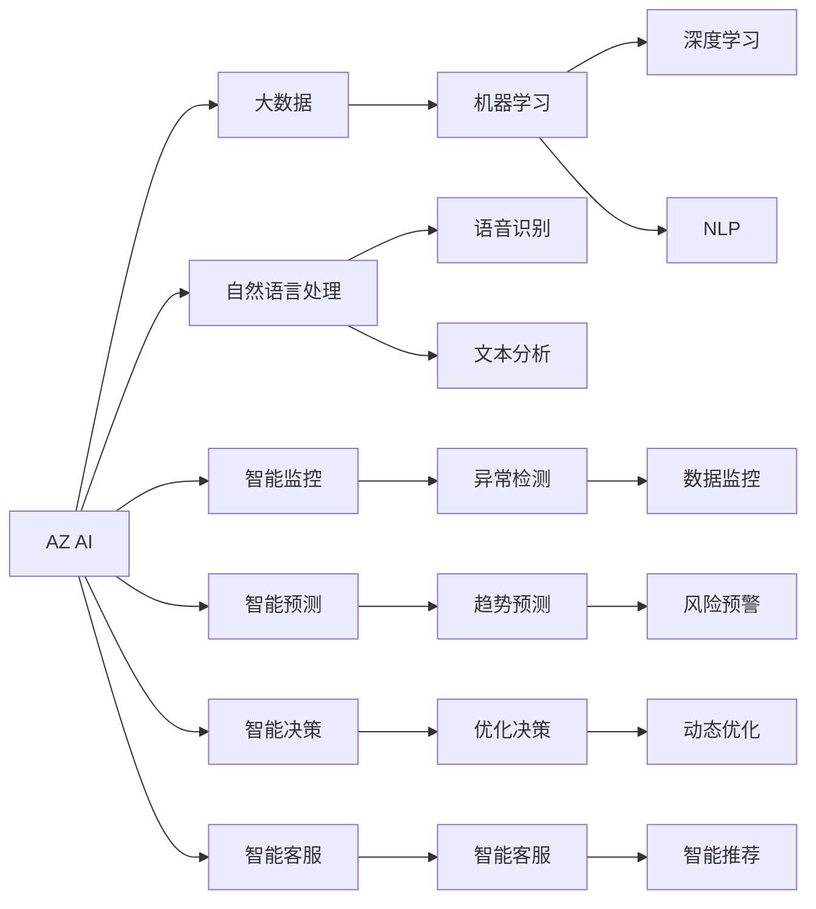

                 

# 科技创新：社会治理的新思路

## 1. 背景介绍

### 1.1 问题由来
随着科技的迅速发展，社会治理也面临着新的挑战。传统意义上的社会治理往往依赖于人工处理大量的事务性工作，效率低下，容易产生失误。然而，随着人工智能(AI)技术的崛起，我们有望利用科技的力量，提升社会治理的智能化水平，实现更加精准、高效、公平的社会管理。

社会治理的核心目标是维护社会秩序、保障公民权益、促进社会发展。其任务包括但不限于公共安全、城市管理、环境保护、公共卫生等。这些任务往往涉及多维度的数据和复杂的事务逻辑，传统的治理手段难以应对。利用科技，尤其是人工智能，可以更精准地分析数据，更高效地处理事务，从而提升社会治理的智能化水平。

### 1.2 问题核心关键点
本文聚焦于如何利用科技创新，特别是在人工智能技术的支持下，提升社会治理的智能化水平。具体来说，我们将探讨以下核心关键点：

- 人工智能技术在社会治理中的应用现状
- 科技创新如何优化社会治理的流程和工具
- 在社会治理中应用人工智能技术的优缺点
- 社会治理领域常见的人工智能技术
- 科技创新在社会治理中面临的挑战与解决策略

这些关键点将帮助我们理解科技创新在社会治理中的作用，以及未来发展的方向。

### 1.3 问题研究意义
研究科技创新在社会治理中的应用，对于推动社会治理现代化、提升社会治理能力、促进社会和谐发展具有重要意义：

1. **提升治理效率**：人工智能能够自动化处理大量事务性工作，提升社会治理的效率，减少人为错误。
2. **强化数据驱动**：利用大数据和人工智能技术，可以更好地分析和利用社会数据，提高决策的科学性和精确性。
3. **促进公平公正**：通过技术手段，可以更客观地处理事务，减少人为偏见，提升治理的公平性。
4. **推动治理创新**：科技创新为社会治理带来了新的工具和方法，能够应对日益复杂多变的环境和挑战。
5. **保障数据安全**：在处理敏感数据时，人工智能技术能够提供更好的安全保障，减少数据泄露和滥用的风险。

## 2. 核心概念与联系

### 2.1 核心概念概述

要深入理解科技创新在社会治理中的应用，首先需要了解几个关键概念：

- **人工智能(AI)**：一种能够模拟人类智能的计算机技术，包括学习、推理、感知、自然语言处理等能力。
- **大数据(Big Data)**：通过收集、存储、分析海量数据，挖掘其中的知识和价值。
- **机器学习(ML)**：通过数据训练模型，使其具备自我学习和优化能力。
- **深度学习(Deep Learning)**：一种基于神经网络的机器学习方法，具有强大的处理复杂数据的能力。
- **自然语言处理(NLP)**：利用计算机技术处理、理解和生成人类语言的技术。

这些概念共同构成了社会治理中科技创新的基础。

### 2.2 概念间的关系

这些核心概念之间存在着紧密的联系，形成了社会治理中科技创新的整体框架。以下是一个Mermaid流程图，展示了这些概念之间的关系：



这个流程图展示了AI在社会治理中的应用场景，以及各个技术之间的关联。人工智能技术通过大数据和机器学习，可以处理和分析复杂的社会数据，从而支持智能监控、智能预测、智能决策等多方面应用。

## 3. 核心算法原理 & 具体操作步骤

### 3.1 算法原理概述

社会治理中应用人工智能技术的核心算法原理，可以归纳为以下几个方面：

1. **数据预处理**：通过数据清洗、特征提取、数据标注等手段，为后续的模型训练做好准备。
2. **模型训练**：利用大数据和机器学习技术，训练出适合社会治理需求的模型，如分类模型、回归模型、序列模型等。
3. **模型部署**：将训练好的模型部署到实际应用中，实现对数据的实时处理和分析。
4. **模型评估**：定期评估模型性能，及时发现和修正问题，保证模型在实际应用中的有效性。

### 3.2 算法步骤详解

以下是利用机器学习进行社会治理应用的一般步骤：

**Step 1: 数据准备**
- 收集与治理相关的数据，如城市交通数据、公共卫生数据、环境监测数据等。
- 清洗数据，处理缺失值、异常值，去除噪声和冗余。
- 提取数据特征，如时间、地点、事件类型、参与人员等。
- 数据标注，为模型提供监督信号，如分类标签、回归目标值等。

**Step 2: 模型训练**
- 选择合适的机器学习算法，如随机森林、SVM、神经网络等。
- 划分训练集、验证集和测试集，确保模型在不同数据上的泛化能力。
- 使用训练集对模型进行迭代训练，不断优化模型参数。
- 在验证集上评估模型性能，防止过拟合。

**Step 3: 模型部署**
- 将训练好的模型集成到应用系统中，如智能监控系统、城市管理平台、公共卫生服务平台等。
- 部署模型到服务器、边缘设备或云平台，实现实时数据处理和分析。
- 定期更新模型，保持模型性能和鲁棒性。

**Step 4: 模型评估**
- 在测试集上评估模型性能，计算精度、召回率、F1分数等指标。
- 使用A/B测试等方法，对比新旧模型的效果。
- 收集用户反馈，持续改进模型。

### 3.3 算法优缺点

利用机器学习进行社会治理应用，具有以下优点：

- **高效性**：利用自动化处理能力，大幅提升社会治理效率，减少人为错误。
- **数据驱动**：通过大数据和机器学习，能够更好地利用和分析社会数据，提高决策的科学性和精确性。
- **可扩展性**：模型可以随时更新，适应新的数据和需求，具有很好的可扩展性。

同时，也存在一些缺点：

- **依赖高质量数据**：模型性能很大程度上取决于数据的质量和标注的准确性。
- **模型复杂性**：机器学习模型通常较为复杂，训练和部署需要较高的技术门槛。
- **资源消耗**：训练和部署模型需要大量的计算资源和时间，成本较高。

### 3.4 算法应用领域

机器学习在社会治理中的应用领域非常广泛，包括但不限于以下方面：

- **智能监控**：通过视频监控、传感器数据等，实现实时异常检测和预警。
- **智能预测**：利用历史数据，预测未来趋势，如交通流量、疾病传播等。
- **智能决策**：基于数据分析，辅助决策制定，如公共安全事件应对、资源配置等。
- **智能客服**：利用自然语言处理技术，实现智能问答和问题解答。
- **智能推荐**：推荐系统为用户提供个性化的服务，如公共服务、医疗健康等。

## 4. 数学模型和公式 & 详细讲解 & 举例说明

### 4.1 数学模型构建

在社会治理中，机器学习模型可以构建为多种形式，如分类模型、回归模型、序列模型等。以下以分类模型为例，说明数学模型的构建过程。

**分类模型**：假设治理任务为分类任务，如预测城市交通是否拥堵。模型输入为交通流量数据，输出为分类标签（拥堵/非拥堵）。

假设模型为逻辑回归模型，其形式为：

$$
P(y=1|x;\theta) = \sigma(\theta^T x)
$$

其中，$x$ 为输入特征向量，$\theta$ 为模型参数，$\sigma$ 为逻辑函数。

### 4.2 公式推导过程

逻辑回归模型的训练过程通常采用最大似然估计方法。假设训练集为 $D=\{(x_i,y_i)\}_{i=1}^N$，其中 $y_i \in \{0,1\}$ 表示第 $i$ 个样本的分类标签，$x_i \in \mathbb{R}^d$ 表示输入特征向量。模型的损失函数为交叉熵损失：

$$
L(\theta) = -\frac{1}{N}\sum_{i=1}^N[y_i\log P(y=1|x_i)+(1-y_i)\log P(y=0|x_i)]
$$

通过梯度下降算法更新参数 $\theta$：

$$
\theta \leftarrow \theta - \eta \nabla_{\theta}L(\theta)
$$

其中，$\eta$ 为学习率，$\nabla_{\theta}L(\theta)$ 为损失函数对参数 $\theta$ 的梯度。

### 4.3 案例分析与讲解

以智能监控为例，假设我们需要利用视频监控数据进行异常检测。可以构建一个二分类模型，输入为视频帧图像，输出为异常事件标签（发生/未发生）。模型训练过程如下：

1. **数据准备**：收集大量视频监控数据，标注出异常事件发生的时间、地点等信息。
2. **特征提取**：从视频帧中提取关键特征，如边缘信息、颜色直方图、运动轨迹等。
3. **模型训练**：使用随机森林、卷积神经网络等算法，训练分类模型。
4. **模型部署**：将训练好的模型集成到智能监控系统中，实现实时异常检测和预警。

## 5. 项目实践：代码实例和详细解释说明

### 5.1 开发环境搭建

在进行社会治理项目的开发前，需要先搭建好开发环境。以下是使用Python进行TensorFlow开发的简单流程：

1. 安装TensorFlow：从官网下载安装包，并按照说明进行安装。
2. 安装必要的依赖包，如numpy、pandas、scikit-learn等。
3. 搭建虚拟环境，保证开发环境与生产环境一致。
4. 配置开发工具，如Jupyter Notebook、PyCharm等。

### 5.2 源代码详细实现

以下以智能监控为例，展示如何使用TensorFlow进行异常检测的代码实现。

**数据准备**：

```python
import tensorflow as tf
import numpy as np
import pandas as pd

# 读取视频监控数据
data = pd.read_csv('video_data.csv')

# 提取关键特征
features = data[['edge', 'color_histogram', 'motion_traj']]

# 标注异常事件标签
labels = data['is_anomaly']

# 划分训练集和测试集
train_features, train_labels = features.iloc[:80%], labels.iloc[:80%]
test_features, test_labels = features.iloc[80%:], labels.iloc[80%:]
```

**模型训练**：

```python
# 定义模型
model = tf.keras.Sequential([
    tf.keras.layers.Dense(64, activation='relu', input_shape=(features.shape[1],)),
    tf.keras.layers.Dense(1, activation='sigmoid')
])

# 编译模型
model.compile(optimizer=tf.keras.optimizers.Adam(learning_rate=0.001),
              loss='binary_crossentropy',
              metrics=['accuracy'])

# 训练模型
model.fit(train_features, train_labels, epochs=10, batch_size=32)
```

**模型评估**：

```python
# 在测试集上评估模型
test_loss, test_acc = model.evaluate(test_features, test_labels)
print(f'Test loss: {test_loss}, Test accuracy: {test_acc}')

# 使用模型进行预测
predictions = model.predict(test_features)
```

**模型部署**：

```python
# 将模型导出为 SavedModel 格式
tf.saved_model.save(model, 'saved_model')

# 加载模型
loaded_model = tf.saved_model.load('saved_model')

# 使用模型进行实时预测
new_data = np.random.randn(10, features.shape[1])
new_predictions = loaded_model(new_data)
```

### 5.3 代码解读与分析

**数据准备**：

- 使用Pandas库读取视频文件数据，提取关键特征。
- 使用numpy库处理数据，确保数据格式正确。

**模型训练**：

- 使用TensorFlow的Sequential模型构建分类模型。
- 编译模型，设置损失函数和优化器。
- 训练模型，设置训练轮数和批次大小。

**模型评估**：

- 使用evaluate方法在测试集上评估模型性能。
- 使用predict方法进行新数据的预测。

**模型部署**：

- 使用save方法将模型保存为SavedModel格式。
- 使用load方法加载模型，进行实时预测。

以上代码展示了从数据准备到模型训练、评估和部署的完整流程，使用TensorFlow库简化了模型开发过程。

### 5.4 运行结果展示

假设在智能监控项目中，模型在测试集上的精度为95%，表明模型具有较高的异常检测能力。此外，实时预测结果也表明模型能够在实际应用中正常运行，提供准确的异常事件预测。

## 6. 实际应用场景

### 6.1 智慧城市治理

智慧城市治理是社会治理的重要组成部分，利用人工智能技术可以大幅提升城市管理的智能化水平。以下列举几个典型应用场景：

1. **智能交通管理**：利用视频监控和传感器数据，实现交通流量实时监测和异常检测，优化交通信号灯控制，减少拥堵。
2. **智能公共安全**：通过视频监控和智能分析，实现异常行为检测和预警，提升公共安全水平。
3. **智能环境监测**：利用传感器和无人机数据，监测环境污染情况，预警环境事件，促进环境保护。
4. **智能应急响应**：通过数据分析，预测自然灾害和公共安全事件，优化应急响应流程，提高灾害应对效率。

### 6.2 医疗健康治理

医疗健康治理是社会治理的重要领域，利用人工智能技术可以提升医疗服务的智能化水平，促进健康管理。以下列举几个典型应用场景：

1. **智能医疗诊断**：利用影像数据和病历数据，进行疾病诊断和预测，提升医疗诊断的准确性和效率。
2. **智能健康管理**：通过传感器和移动设备数据，监测健康状况，提供个性化的健康管理建议。
3. **智能疫情预警**：利用公共卫生数据和社交媒体数据，预测疫情传播趋势，提升疫情应对能力。
4. **智能药物研发**：通过数据分析和模拟，加速药物研发进程，提升新药开发效率。

### 6.3 教育治理

教育治理是社会治理的重要环节，利用人工智能技术可以提升教育服务的智能化水平，促进教育公平。以下列举几个典型应用场景：

1. **智能课堂辅助**：利用面部识别和情感分析技术，监测学生情绪和学习效果，提供个性化的教学建议。
2. **智能作业批改**：通过自然语言处理技术，自动批改学生作业，提升作业批改效率和质量。
3. **智能学习推荐**：根据学生的学习行为和兴趣，推荐适合的课程和学习资源，提升学习效果。
4. **智能考试评估**：通过数据分析，评估学生的考试成绩和知识点掌握情况，提供个性化的学习建议。

## 7. 工具和资源推荐

### 7.1 学习资源推荐

为了帮助开发者系统掌握社会治理中人工智能技术的应用，这里推荐一些优质的学习资源：

1. **《Python机器学习》书籍**：适合入门机器学习的书籍，涵盖机器学习的基础知识和常用算法。
2. **Coursera机器学习课程**：由斯坦福大学Andrew Ng教授主讲，是机器学习领域的经典课程。
3. **Kaggle竞赛**：参加Kaggle竞赛，可以锻炼实战能力，积累数据处理和模型优化的经验。
4. **TensorFlow官方文档**：TensorFlow的官方文档，提供了详细的API和使用示例。
5. **HuggingFace官方文档**：HuggingFace的官方文档，提供了丰富的预训练模型和微调样例。

### 7.2 开发工具推荐

以下是几款用于社会治理项目开发的常用工具：

1. **Jupyter Notebook**：Python的交互式开发工具，方便进行数据分析和模型训练。
2. **PyCharm**：Python的集成开发环境，提供代码调试、测试、部署等功能。
3. **TensorBoard**：TensorFlow的可视化工具，方便监控模型训练状态和结果。
4. **Scikit-learn**：Python的数据分析和机器学习库，提供丰富的算法和工具。
5. **NLTK**：自然语言处理工具包，提供文本预处理和分析功能。

### 7.3 相关论文推荐

社会治理中人工智能技术的发展得益于学界的持续研究。以下是几篇奠基性的相关论文，推荐阅读：

1. **《深度学习在城市智能交通中的应用》**：介绍深度学习在智能交通管理中的应用，包括交通流量预测和异常检测。
2. **《基于机器学习的公共安全事件预测》**：利用机器学习模型预测公共安全事件，提升应急响应能力。
3. **《医疗影像的深度学习诊断》**：介绍深度学习在医疗影像诊断中的应用，提高疾病诊断的准确性。
4. **《智能教育系统中的自然语言处理技术》**：讨论自然语言处理技术在智能教育中的应用，提升教育服务质量。

## 8. 总结：未来发展趋势与挑战

### 8.1 研究成果总结

本文对社会治理中人工智能技术的应用进行了全面系统的介绍。首先阐述了人工智能技术在社会治理中的应用现状，明确了社会治理中的科技创新需求。其次，从原理到实践，详细讲解了社会治理中机器学习的核心算法原理和操作步骤。最后，广泛探讨了科技创新在社会治理中的应用领域和未来发展方向。

### 8.2 未来发展趋势

展望未来，社会治理中人工智能技术将呈现以下几个发展趋势：

1. **智能化的全面覆盖**：随着AI技术的普及，社会治理将覆盖更多领域，包括医疗、教育、环保等。
2. **实时化的智能决策**：利用实时数据处理和分析，实现智能决策和动态优化，提升治理效率。
3. **多模态的融合应用**：将语音、图像、文本等多种模态数据结合，提升治理的全面性和准确性。
4. **泛化的智能模型**：开发跨领域、跨模态的智能模型，提升模型泛化能力和应用范围。
5. **数据驱动的智慧治理**：利用大数据和AI技术，实现数据驱动的智慧治理，提升决策科学性和透明度。

### 8.3 面临的挑战

尽管社会治理中人工智能技术已经取得了一定的成果，但在推广应用的过程中，仍面临诸多挑战：

1. **数据隐私和安全**：在处理敏感数据时，需要保证数据隐私和安全，防止数据泄露和滥用。
2. **模型的公平性和透明性**：需要确保模型的公平性和透明性，避免偏见和歧视。
3. **跨学科的协同合作**：社会治理涉及多个学科和领域，需要跨学科的协同合作，提升治理效果。
4. **技术的可靠性和稳定性**：需要确保AI技术的可靠性和稳定性，避免系统崩溃和误操作。
5. **公众的接受和信任**：需要提升公众对AI技术的接受和信任度，避免技术恐慌和抵触。

### 8.4 研究展望

面对社会治理中人工智能技术面临的挑战，未来的研究需要在以下几个方面寻求新的突破：

1. **数据隐私保护**：开发隐私保护技术，确保数据隐私和安全。
2. **模型公平性**：构建公平性评估指标，优化模型设计，消除偏见和歧视。
3. **跨学科协作**：加强多学科协作，提升治理效果和应用范围。
4. **技术可靠性**：优化模型架构和训练方法，提升AI技术的可靠性和稳定性。
5. **公众信任建设**：加强AI技术的普及和宣传，提升公众对AI技术的理解和信任。

## 9. 附录：常见问题与解答

**Q1：社会治理中人工智能技术有哪些应用场景？**

A: 社会治理中人工智能技术的应用场景非常广泛，涵盖智能交通、公共安全、环境保护、公共卫生、教育等领域。具体应用场景包括：

- 智能交通管理：利用视频监控和传感器数据，实现交通流量实时监测和异常检测，优化交通信号灯控制，减少拥堵。
- 智能公共安全：通过视频监控和智能分析，实现异常行为检测和预警，提升公共安全水平。
- 智能环境监测：利用传感器和无人机数据，监测环境污染情况，预警环境事件，促进环境保护。
- 智能应急响应：通过数据分析，预测自然灾害和公共安全事件，优化应急响应流程，提高灾害应对效率。
- 智能医疗诊断：利用影像数据和病历数据，进行疾病诊断和预测，提升医疗诊断的准确性和效率。
- 智能健康管理：通过传感器和移动设备数据，监测健康状况，提供个性化的健康管理建议。
- 智能疫情预警：利用公共卫生数据和社交媒体数据，预测疫情传播趋势，提升疫情应对能力。
- 智能教育推荐：根据学生的学习行为和兴趣，推荐适合的课程和学习资源，提升学习效果。

**Q2：社会治理中应用人工智能技术有哪些优点？**

A: 社会治理中应用人工智能技术具有以下优点：

- **高效性**：利用自动化处理能力，大幅提升社会治理效率，减少人为错误。
- **数据驱动**：通过大数据和机器学习，能够更好地利用和分析社会数据，提高决策的科学性和精确性。
- **可扩展性**：模型可以随时更新，适应新的数据和需求，具有很好的可扩展性。
- **实时性**：利用实时数据处理和分析，实现实时智能决策和动态优化，提升治理效率。

**Q3：社会治理中应用人工智能技术面临哪些挑战？**

A: 社会治理中应用人工智能技术面临以下挑战：

- **数据隐私和安全**：在处理敏感数据时，需要保证数据隐私和安全，防止数据泄露和滥用。
- **模型的公平性和透明性**：需要确保模型的公平性和透明性，避免偏见和歧视。
- **跨学科的协同合作**：社会治理涉及多个学科和领域，需要跨学科的协同合作，提升治理效果。
- **技术的可靠性和稳定性**：需要确保AI技术的可靠性和稳定性，避免系统崩溃和误操作。
- **公众的接受和信任**：需要提升公众对AI技术的接受和信任度，避免技术恐慌和抵触。

**Q4：如何提高社会治理中人工智能技术的公平性和透明性？**

A: 提高社会治理中人工智能技术的公平性和透明性，可以从以下几个方面入手：

- **数据清洗**：确保数据的公平性和代表性，避免数据偏见。
- **模型评估**：构建公平性评估指标，定期评估模型性能和公平性。
- **公开透明**：确保模型训练和决策过程的公开透明，便于公众监督和质疑。
- **多方参与**：邀请多方利益相关者参与模型设计和评估，提升模型的公平性和透明性。
- **伦理审查**：建立伦理审查机制，审查AI技术的应用，避免伦理风险。

**Q5：社会治理中应用人工智能技术有哪些未来发展方向？**

A: 社会治理中应用人工智能技术的未来发展方向包括：

- **智能化全面覆盖**：随着AI技术的普及，社会治理将覆盖更多领域，包括医疗、教育、环保等。
- **实时化智能决策**：利用实时数据处理和分析，实现智能决策和动态优化，提升治理效率。
- **多模态融合应用**：将语音、图像、文本等多种模态数据结合，提升治理的全面性和准确性。
- **泛化智能模型**：开发跨领域、跨模态的智能模型，提升模型泛化能力和应用范围。
- **数据驱动智慧治理**：利用大数据和AI技术，实现数据驱动的智慧治理，提升决策科学性和透明度。

---

作者：禅与计算机程序设计艺术 / Zen and the Art of Computer Programming

