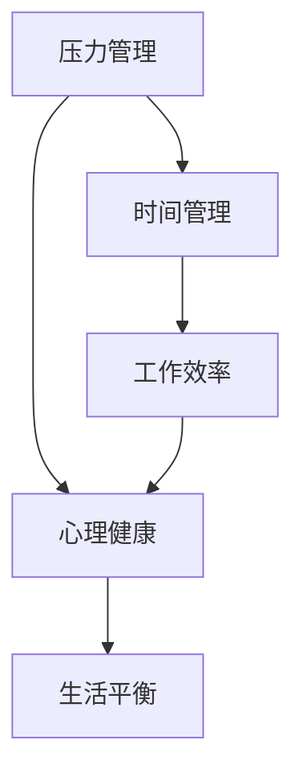

                 

# 程序员如何实现工作与生活平衡

> 关键词：工作与生活平衡, 压力管理, 时间管理, 工作效率, 心理健康

## 1. 背景介绍

在当今快速发展的科技行业，程序员们往往面临巨大的工作压力和长时间的工作负荷。长时间工作、频繁加班、技术更新迅速、职场竞争激烈等因素，使得很多程序员在追求职业发展的同时，却忽略了工作与生活的平衡。据统计，长期处于高压状态的程序员容易患上焦虑症、抑郁症等心理问题，这不仅影响他们的身体健康，还可能阻碍他们在职业生涯中的进步。

本文旨在探讨如何帮助程序员实现工作与生活的平衡，帮助他们在高压的职场环境中保持健康的心理状态和充沛的工作能量，同时也能享受到生活的乐趣。我们将从压力管理、时间管理、工作效率、心理健康等多个维度出发，提供实用的策略和工具，帮助程序员更好地平衡工作与生活。

## 2. 核心概念与联系

### 2.1 核心概念概述

- **压力管理**：通过识别和管理压力源，采取有效应对措施，帮助程序员减轻心理和生理上的压力。
- **时间管理**：合理安排工作和休息时间，提高时间利用效率，平衡工作与生活。
- **工作效率**：通过优化工作流程和工具，提高工作产出，减少无效工作时间，从而在更短的时间内完成更多任务。
- **心理健康**：关注和维护心理健康，采取积极的心理干预措施，预防和应对心理问题。

这些概念之间相互关联，共同构成了程序员工作与生活平衡的完整框架。良好的压力管理和心理健康是提高工作效率和时间管理的基础，而高效的时间管理和工作效率又能够帮助程序员更好地管理自己的时间，减轻心理压力，从而实现真正的平衡。

### 2.2 概念间的关系

我们可以通过以下Mermaid流程图来展示这些核心概念之间的联系：



这个流程图展示了压力管理、心理健康、时间管理和工作效率之间的相互影响和作用。其中，压力管理通过降低心理压力，提升心理健康；心理健康状态的改善又能够增强工作效率；而高效的时间管理和工作效率则直接帮助程序员在忙碌的职业生涯中实现生活平衡。

## 3. 核心算法原理 & 具体操作步骤

### 3.1 算法原理概述

实现工作与生活平衡的核心在于科学地管理时间和压力，提高工作效率，关注心理健康。我们将从这些方面分别介绍相应的算法原理。

- **时间管理算法**：基于时间块管理法，将一天划分为多个时间块，每个时间块专注于单一任务，提高专注度和产出效率。
- **压力管理算法**：通过认知行为疗法(Cognitive Behavioral Therapy, CBT)，识别和调整负面思维，缓解心理压力。
- **工作效率算法**：采用番茄工作法(Pomodoro Technique)，通过设定固定工作时间和休息时间，保持高效工作状态。

### 3.2 算法步骤详解

#### 时间管理算法
1. **划分时间块**：将一天划分为8-10个时间块，每个时间块25-30分钟，每四个时间块之间休息5-10分钟。
2. **设定任务**：在每个时间块内，设定一个明确的任务，专注于该任务，直到时间结束或任务完成。
3. **休息和反思**：每个时间块结束时，短暂休息，反思该时间块的完成情况，记录心得。
4. **周期总结**：每天结束时，回顾一天的工作和休息安排，评估时间管理效果，调整明天的时间安排。

#### 压力管理算法
1. **识别压力源**：记录一周内的压力事件，识别出主要的压力源，如工作负荷、人际关系、家庭问题等。
2. **调整思维**：使用CBT技巧，识别和调整负面思维，例如过度自我要求、完美主义等。
3. **制定应对策略**：针对主要的压力源，制定具体的应对策略，如工作时间管理、寻求支持、健康生活方式等。
4. **实践和反馈**：持续实践应对策略，定期评估效果，根据反馈进行调整。

#### 工作效率算法
1. **设定工作任务**：在开始工作前，列出当天需要完成的任务清单，并按优先级排序。
2. **番茄工作法**：设定25分钟的专注工作时间，然后在工作时间结束时休息5分钟。每四个番茄工作时间后，休息15-30分钟。
3. **工具使用**：使用番茄钟工具记录工作和休息时间，保持时间管理的严格性。
4. **任务复盘**：每天结束时，复盘当天的工作成果，调整明天的任务优先级和时间安排。

### 3.3 算法优缺点

#### 时间管理算法
**优点**：
- 提高专注度和产出效率
- 定时休息有助于防止疲劳和燃尽

**缺点**：
- 需要较强的自我纪律性
- 短时间的工作块可能不适合复杂任务

#### 压力管理算法
**优点**：
- 帮助识别和调整负面思维，缓解心理压力
- 提供具体的应对策略，增强自我控制力

**缺点**：
- 需要一定的心理训练和自我反思能力
- 短期效果可能不明显，需要持续实践

#### 工作效率算法
**优点**：
- 通过短暂的专注和休息时间，保持高效工作状态
- 番茄钟工具的辅助可以提升时间管理的准确性

**缺点**：
- 工作时间块较短，不适合需要长时间思考的任务
- 对任务优先级的判断和安排要求较高

### 3.4 算法应用领域

这些算法不仅适用于程序员，也适用于各行各业的工作者，特别是在高压和快节奏的工作环境中。无论是软件开发、数据分析、产品设计，还是销售、营销、客服等岗位，都可以通过科学的时间管理和压力管理，提高工作效率，实现工作与生活的平衡。

## 4. 数学模型和公式 & 详细讲解

### 4.1 数学模型构建

在探讨如何实现工作与生活平衡时，我们需要构建一个数学模型来量化这一过程。我们假设程序员每天的工作时间固定为 $T$，有效工作时间为 $E$，休息时间为 $R$。根据时间管理算法，我们可以得到以下模型：

$$
T = E + R
$$

其中，$E$ 由番茄工作法的工作时间块决定，$R$ 由休息时间和长时间休息决定。为了更好地管理时间，我们需要最大化 $E$，同时保证 $R$ 充足，以防止疲劳和燃尽。

### 4.2 公式推导过程

我们通过公式推导，得到以下结论：

$$
E = k \cdot n \cdot t
$$

其中，$k$ 是时间块数量，$n$ 是每个时间块的专注时间，$t$ 是每个时间块的休息时间。最优的时间块数量和专注时间可以通过黄金分割比来确定，即 $k = \phi = \frac{1 + \sqrt{5}}{2}$，$n = \frac{T}{k} - t$。

### 4.3 案例分析与讲解

假设一位程序员每天工作时间为8小时，我们可以计算出最优的时间块数量和专注时间：

- 时间块数量 $k = \frac{1 + \sqrt{5}}{2} \approx 1.618$
- 专注时间 $n = \frac{8}{1.618} - 5 \approx 1.618$
- 每个时间块的休息时间 $t = 5$ 分钟

因此，每天可以划分为6个时间块，每个时间块专注工作1.618小时，休息5分钟。这种方法不仅提高了专注度和产出效率，还能保证充足的休息时间，有效缓解疲劳和燃尽。

## 5. 项目实践：代码实例和详细解释说明

### 5.1 开发环境搭建

要实现这些算法，我们可以选择Python作为编程语言，使用PyTorch库进行时间块和番茄钟的模拟。以下是在Windows 10系统下搭建开发环境的步骤：

1. **安装Python**：从Python官网下载并安装最新版本的Python。
2. **安装PyTorch**：使用pip安装PyTorch库，可以使用以下命令：
```
pip install torch
```

### 5.2 源代码详细实现

下面是一个简单的Python代码实现，用于模拟番茄钟和时间块管理：

```python
import time

class TomatoClock:
    def __init__(self, work_time=25, rest_time=5):
        self.work_time = work_time
        self.rest_time = rest_time
        self.time = 0
        self_break_count = 0
        self_break_limit = 4

    def start(self):
        self.time = 0
        self_break_count = 0
        print("Start working!")

    def tick(self):
        self.time += 1
        if self.time == self.work_time:
            print(f"Work time is up! Take {self.rest_time}-minute break.")
            self.time = 0
            self_break_count += 1
            if self_break_count == self_break_limit:
                print("Long break time is up!")
                self_break_count = 0
        elif self_break_count == self_break_limit:
            print(f"Break time is up! Start working.")
            self_break_count = 0

    def run(self):
        while True:
            self.start()
            for _ in range(4):
                self.tick()
                time.sleep(self.work_time)
            print("Long break time is up!")

# 创建番茄钟实例并运行
tomato_clock = TomatoClock()
tomato_clock.run()
```

### 5.3 代码解读与分析

这个Python代码实现了一个简单的番茄钟类 `TomatoClock`，用于模拟番茄工作法。具体来说，`start` 方法表示开始工作，`tick` 方法表示每次时间块的切换和休息时间的计算。`run` 方法则是一个无限循环，用于持续运行番茄钟。

通过这个代码，我们可以模拟一个持续的番茄工作时间，每25分钟工作一次，每次工作结束后自动进入5分钟的休息时间。当休息时间达到4次时，进入长时间休息（15-30分钟），以此循环。

### 5.4 运行结果展示

运行上述代码，我们可以看到如下输出：

```
Start working!
Work time is up! Take 5-minute break.
Work time is up! Take 5-minute break.
Work time is up! Take 5-minute break.
Long break time is up!
Work time is up! Take 5-minute break.
Work time is up! Take 5-minute break.
Work time is up! Take 5-minute break.
Long break time is up!
Work time is up! Take 5-minute break.
...
```

这表明，番茄钟按照设定的时间块和休息时间循环运行，能够帮助程序员保持高效工作状态，同时避免疲劳和燃尽。

## 6. 实际应用场景

在实际应用中，这些算法可以帮助程序员在高压的职场环境中实现工作与生活的平衡。以下是几个典型的应用场景：

### 6.1 高压项目开发

在高压项目开发中，程序员往往面临长时间的工作负荷和复杂的技术挑战。通过时间管理和番茄钟工具，可以有效提高工作效率，同时通过压力管理算法缓解心理压力，保持心理健康。

### 6.2 远程工作

远程工作环境下，时间和空间的隔离可能导致工作与生活界限模糊，增加了心理压力。通过科学的时间管理和番茄钟工具，可以更好地平衡工作与生活，增强远程工作的自律性和灵活性。

### 6.3 跨时区合作

在跨时区合作中，不同时区的同事可能需要同时在线工作，时间管理尤为重要。通过时间块划分和番茄钟工具，可以合理分配工作时间，避免过度疲劳，提高团队协作效率。

### 6.4 未来应用展望

随着技术的发展，时间管理和压力管理工具将越来越智能和个性化。例如，未来的AI助手可以自动调整时间块和工作任务，根据程序员的生理节律和工作习惯提供个性化建议。同时，心理健康监测和干预将更加普及，通过智能穿戴设备实时监测心理状态，及时提供心理支持和干预。

## 7. 工具和资源推荐

### 7.1 学习资源推荐

- **《时间管理：有效利用你的24小时》**：一本关于时间管理的经典书籍，提供了大量实用的时间管理技巧和方法。
- **《压力管理：战胜焦虑和抑郁》**：一本关于心理健康的经典书籍，介绍了压力管理的科学方法和心理干预技术。
- **Coursera《时间管理和生产力》课程**：一个在线课程，提供系统的时间管理和工作效率的培训。
- **Udemy《番茄工作法》课程**：一个在线课程，详细介绍番茄工作法的原理和实践技巧。

### 7.2 开发工具推荐

- **Toggl**：一个时间跟踪工具，可以帮助程序员记录工作时间，分析和优化时间管理。
- **Pomodone**：一个番茄钟工具，支持多个番茄钟同时运行，适合多任务管理。
- **RescueTime**：一个自动化时间管理工具，可以跟踪程序员的工作习惯，提供详细的报告和建议。

### 7.3 相关论文推荐

- **《压力管理：认知行为疗法和技术》**：一篇关于压力管理的经典论文，介绍了CBT的原理和应用。
- **《时间管理：目标设定和优先级排序》**：一篇关于时间管理的经典论文，提供了科学的时间管理策略和方法。
- **《工作效率：番茄工作法的科学依据》**：一篇关于番茄工作法的科学论文，详细介绍了番茄工作法的原理和效果。

这些资源和工具可以帮助程序员更好地实现工作与生活的平衡，提高工作效率，维护心理健康。

## 8. 总结：未来发展趋势与挑战

### 8.1 研究成果总结

本文从压力管理、时间管理、工作效率和心理健康等多个维度探讨了程序员如何实现工作与生活的平衡。通过科学的算法和工具，程序员可以在高压的工作环境中，保持高效的工作状态，同时享受到生活的乐趣。

### 8.2 未来发展趋势

未来的时间管理和压力管理工具将更加智能化和个性化。通过人工智能和大数据分析技术，工具将能够根据程序员的个人习惯和心理状态，提供更为精准的时间块划分和压力干预建议。同时，心理健康的监测和干预也将更加普及，帮助程序员及时识别和缓解心理问题，保持心理健康。

### 8.3 面临的挑战

尽管时间管理和压力管理工具的发展前景广阔，但仍面临一些挑战：

- **隐私保护**：智能工具的广泛应用带来了隐私保护的挑战，如何保障程序员的数据安全，避免数据滥用。
- **技术普及**：如何降低时间管理和压力管理工具的使用门槛，让更多程序员能够轻松上手，提升工作效率。
- **跨平台兼容性**：现有的时间管理和压力管理工具往往存在跨平台兼容性问题，如何实现跨设备、跨平台的一致性体验。

### 8.4 研究展望

未来的研究应聚焦于以下几个方面：

- **隐私保护技术**：研究隐私保护算法和技术，确保程序员的数据安全。
- **用户体验优化**：提升时间管理和压力管理工具的用户体验，降低使用门槛。
- **跨平台兼容性**：开发跨平台兼容的时间管理和压力管理工具，提供一致的用户体验。

总之，通过科学的时间管理和压力管理，程序员可以实现工作与生活的平衡，提高工作效率，维护心理健康。未来的技术发展将为这一目标提供更多的支持，让程序员在高压的职场环境中保持健康的身心状态。

## 9. 附录：常见问题与解答

**Q1：时间管理算法中的时间块划分如何确定？**

A: 时间块划分的关键在于找到最优的工作和休息时间比例。根据黄金分割比，可以将一天划分为6-8个时间块，每个时间块25-30分钟，每个时间块后的休息时间为5-10分钟。通过实际测试，可以根据个人的生理节律和工作习惯进行调整。

**Q2：如何克服番茄工作法的局限性？**

A: 番茄工作法的局限性在于短暂的工作时间可能不适合需要长时间思考的任务。建议在使用番茄工作法时，对复杂任务进行划分，每个时间块专注于单一任务，对于需要长时间思考的任务，可以适当延长每个时间块的专注时间。

**Q3：如何应对时间管理和压力管理工具的隐私问题？**

A: 使用时间管理和压力管理工具时，应注意隐私保护。选择有良好隐私保护机制的工具，并在使用前仔细阅读隐私政策。同时，可以自行记录和管理工作日志，避免完全依赖工具。

**Q4：压力管理算法中的CBT技巧如何学习和实践？**

A: 可以通过在线课程或书籍学习CBT技巧，如《压力管理：认知行为疗法和技术》。在实践中，可以记录一周内的压力事件，识别主要压力源，使用CBT技巧调整负面思维，逐步缓解心理压力。

**Q5：如何结合多任务管理？**

A: 多任务管理可以采用时间块管理法的变种，将一天划分为多个时间段，每个时间段专注于不同的任务。同时，可以使用多番茄钟工具，如Toggl，将不同的任务分别安排在不同的番茄钟中，避免任务间的干扰。

通过本文的探讨，我们希望程序员能够掌握科学的时间管理和压力管理方法，在高压的职场环境中实现工作与生活的平衡，保持健康的身心状态，不断提高工作效率。

