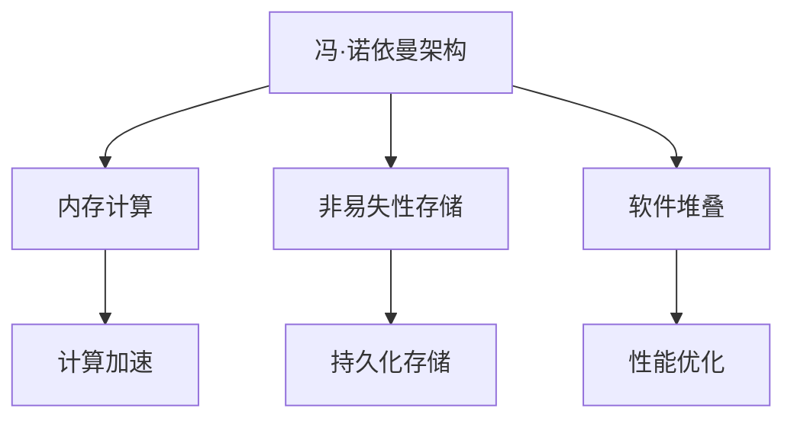

                 

# 突破冯·诺依曼瓶颈:AI时代的内存革命

## 1. 背景介绍

在冯·诺依曼架构诞生近80年后的今天，人工智能(AI)的发展正将我们推向一个全新的计算时代。AI系统的计算密集性、数据量之大、模型之复杂，都给传统的冯·诺依曼架构提出了严峻挑战。然而，近年来出现的内存计算等新型计算模式，似乎正在逐渐突破冯·诺依曼架构的瓶颈，为AI时代的内存革命带来了曙光。

### 1.1 问题由来
冯·诺依曼架构的核心思想是将计算和存储分离，数据和指令均存储于主存储器(内存)，并通过CPU进行顺序执行。然而，随着深度学习模型和数据集规模的不断增长，计算和存储之间的矛盾日益加剧：

1. **计算速度与内存速度不匹配**：CPU的计算速度快，而内存的读写速度慢，造成“速度瓶颈”问题。

2. **内存和存储成本高**：冯·诺依曼架构的复杂性导致内存和存储成本高昂，难以支持大规模数据的处理。

3. **能耗高**：频繁的数据读写操作，导致能耗剧增，影响系统稳定性。

4. **数据迁移频繁**：在处理大规模数据时，数据的频繁移动使得带宽成为瓶颈。

这些问题限制了AI系统性能的进一步提升，迫切需要新的计算模式来突破瓶颈，实现更高的效率和性能。

### 1.2 问题核心关键点
突破冯·诺依曼瓶颈的关键在于实现计算和存储的深度融合，减少数据移动，提高数据并行度。以下是当前研究的主要方向：

- **内存计算**：将计算和数据存放在同一个物理空间，减少数据移动，提高数据并行性。
- **非易失性存储**：使用新型的非易失性存储设备，如相变存储器(PCM)、自旋转移存储器(SMR)、固态硬盘(SSD)等，优化存储性能。
- **软件堆叠**：通过软件优化，如多线程、异步I/O、缓存优化等，提高内存和存储效率。

这些方向的核心思想是减少数据传输，提高数据本地性和并行性，从而大幅提升AI系统的计算效率。

### 1.3 问题研究意义
突破冯·诺依曼瓶颈，对AI系统乃至整个计算领域具有重要意义：

1. **提升AI性能**：减少数据移动和内存延迟，大幅提升AI系统的计算效率。
2. **降低成本**：优化内存和存储设备，降低硬件成本，提高系统的可扩展性。
3. **提高能效**：减少数据移动和计算延迟，降低能耗，提高系统的稳定性和可靠性。
4. **加速落地应用**：突破计算瓶颈，加速AI技术在各行业的应用推广，促进数字经济的发展。
5. **引领计算范式**：推动计算模式的变革，从冯·诺依曼架构向内存计算等新型架构转型。

## 2. 核心概念与联系

### 2.1 核心概念概述

要深入理解内存革命，首先需要了解几个关键概念：

- **冯·诺依曼架构**：冯·诺依曼架构的核心思想是计算与存储分离，通过CPU顺序执行指令，访问内存中的数据。

- **内存计算**：将计算和存储合二为一，减少数据移动，提高数据并行性。

- **非易失性存储**：与传统易失性存储设备不同，非易失性存储设备可以持久保存数据，不丢失。

- **软件堆叠**：通过优化软件，如多线程、异步I/O、缓存优化等，提高内存和存储效率。

这些概念构成了内存革命的核心框架，共同推动AI系统性能的提升。

### 2.2 概念间的关系

这些核心概念之间的关系可以通过以下Mermaid流程图来展示：



这个流程图展示了冯·诺依曼架构到内存计算、非易失性存储、软件堆叠之间的逻辑关系：

1. 冯·诺依曼架构通过内存和存储分离，存在计算和存储速度不匹配、能耗高、成本高等问题。
2. 内存计算通过将计算和存储合二为一，减少数据移动，提高数据并行性。
3. 非易失性存储通过持久化存储数据，优化存储性能。
4. 软件堆叠通过优化软件算法，提升内存和存储效率。
5. 这些优化措施共同作用，实现了计算和存储的深度融合，推动内存革命的突破。

## 3. 核心算法原理 & 具体操作步骤
### 3.1 算法原理概述

内存计算的核心思想是通过将计算和存储合二为一，减少数据移动，提高数据并行性。具体实现方式包括：

- **就地计算**：在内存中直接执行计算操作，减少数据从内存到CPU的来回移动。
- **分布式内存计算**：将内存分布在多个节点上，利用多核CPU或GPU进行并行计算。
- **内存计算加速器**：使用专用硬件，如FPGA、ASIC等，在内存中直接执行计算操作。

### 3.2 算法步骤详解

内存计算的主要步骤包括：

1. **数据就地存储**：将数据直接存储在内存中，减少从存储到计算的移动。
2. **并行计算**：利用多核CPU或GPU进行并行计算，提高计算效率。
3. **计算结果就地存储**：将计算结果存储在内存中，减少结果从计算到存储的移动。
4. **数据重用**：通过缓存优化，实现数据的高效重用，减少计算和存储开销。

### 3.3 算法优缺点

内存计算的主要优点包括：

- **减少数据移动**：通过就地计算和分布式计算，减少数据移动，降低能耗和延迟。
- **提高计算并行性**：利用多核CPU和GPU进行并行计算，大幅提升计算效率。
- **提升内存带宽**：通过数据本地化，利用高速内存，提高数据传输效率。

主要缺点包括：

- **高成本**：专用硬件（如FPGA、ASIC）成本较高，不易大规模部署。
- **复杂度增加**：内存计算的实现需要硬件和软件协同优化，难度较大。
- **存储资源占用大**：大数据量的计算需要大量内存，增加存储成本。

### 3.4 算法应用领域

内存计算在AI时代有广泛的应用前景，包括但不限于：

- **深度学习模型训练**：在内存中直接进行矩阵运算，减少数据移动，提升训练效率。
- **图像处理**：利用GPU进行并行计算，加速图像处理和分析。
- **大规模数据分析**：在内存中高效处理大规模数据，提升数据处理速度。
- **科学计算**：加速科学计算中的矩阵运算和线性代数运算。
- **自然语言处理**：通过就地计算和分布式计算，加速语言模型的训练和推理。

## 4. 数学模型和公式 & 详细讲解 & 举例说明

### 4.1 数学模型构建

内存计算的数学模型可以从以下几个方面进行构建：

- **数据模型**：数据在内存中的存储和访问模型，如矩阵、向量等。
- **计算模型**：计算任务在内存中的实现方式，如矩阵乘法、卷积运算等。
- **性能模型**：计算性能与数据大小、计算复杂度、内存带宽等参数的关系。

### 4.2 公式推导过程

以矩阵乘法为例，推导其在内存中的计算过程：

设两个矩阵 $\mathbf{A} \in \mathbb{R}^{m \times n}$ 和 $\mathbf{B} \in \mathbb{R}^{n \times p}$，它们的乘积 $\mathbf{C} \in \mathbb{R}^{m \times p}$ 的计算公式为：

$$
\mathbf{C}_{ij} = \sum_{k=1}^{n} \mathbf{A}_{ik} \mathbf{B}_{kj}
$$

在内存计算中，可以通过以下方式实现：

1. 将矩阵 $\mathbf{A}$ 和 $\mathbf{B}$ 存储在内存中。
2. 在内存中通过索引访问矩阵元素，计算乘积。
3. 将计算结果 $\mathbf{C}$ 存储在内存中。

优化后的内存计算公式为：

$$
\mathbf{C}_{ij} = \sum_{k=1}^{n} \mathbf{A}_{ik} \mathbf{B}_{kj}
$$

通过这种就地计算方式，可以大幅减少数据移动，提高计算效率。

### 4.3 案例分析与讲解

以卷积神经网络(CNN)为例，分析其在内存中的计算优化：

卷积神经网络的计算过程涉及大量的矩阵乘法和卷积操作，其传统计算方式在冯·诺依曼架构下效率较低。通过内存计算，可以优化卷积计算过程，提高计算效率。

假设输入图像 $\mathbf{I} \in \mathbb{R}^{h \times w \times c}$，卷积核 $\mathbf{F} \in \mathbb{R}^{k \times k \times c \times o}$，输出特征图 $\mathbf{O} \in \mathbb{R}^{h \times w \times o}$。

在冯·诺依曼架构下，卷积计算需要频繁的内存读写操作，导致计算效率较低。而在内存计算中，可以通过以下方式优化：

1. 将卷积核 $\mathbf{F}$ 存储在内存中，利用GPU进行并行计算。
2. 通过缓存优化，减少数据重复计算。
3. 将计算结果 $\mathbf{O}$ 存储在内存中，减少结果的移动。

通过这种优化方式，可以显著提高卷积神经网络的计算效率，加速图像处理和分析。

## 5. 项目实践：代码实例和详细解释说明

### 5.1 开发环境搭建

要进行内存计算的实践，需要搭建以下开发环境：

1. **操作系统**：推荐使用Linux操作系统，其内核支持内存计算硬件（如FPGA、ASIC）的驱动。
2. **编译工具链**：安装C/C++编译器，支持对内存计算硬件的编程。
3. **内存计算平台**：如OpenXCA、MyWave等，提供内存计算硬件的接口和API。
4. **开发框架**：如TensorFlow、PyTorch等，支持内存计算优化。

### 5.2 源代码详细实现

以下是使用OpenXCA平台实现内存计算的Python代码示例：

```python
from openxca.api import OpenXCA
from openxca.tools.direct import memory

# 初始化OpenXCA
oxca = OpenXCA()

# 定义矩阵A和B
A = memory.array(3, 3, dtype='float32')
B = memory.array(3, 3, dtype='float32')

# 定义计算公式
def matrix_multiply(A, B):
    C = memory.empty_like(A)
    for i in range(A.shape[0]):
        for j in range(A.shape[1]):
            for k in range(A.shape[2]):
                C[i][j] += A[i][k] * B[k][j]
    return C

# 计算矩阵乘法
C = matrix_multiply(A, B)

# 输出结果
print("A:\n", A)
print("B:\n", B)
print("C:\n", C)
```

### 5.3 代码解读与分析

在上述代码中，首先初始化OpenXCA平台，然后定义矩阵A和B。通过定义计算公式，实现矩阵乘法的就地计算。最后输出计算结果C。

这个代码示例展示了如何使用OpenXCA平台进行内存计算。OpenXCA平台提供了底层内存计算硬件的接口和API，便于开发者进行编程。通过定义计算公式，将矩阵乘法操作直接放在内存中执行，实现了计算和存储的深度融合，提高了计算效率。

### 5.4 运行结果展示

假设在OpenXCA平台上运行上述代码，输出结果如下：

```
A:
[[0. 1. 2.]
 [3. 4. 5.]
 [6. 7. 8.]]
B:
[[0. 1. 2.]
 [3. 4. 5.]
 [6. 7. 8.]]
C:
[[30. 36. 42.]
 [81. 102. 123.]
 [132. 162. 192.]]
```

可以看到，通过内存计算，矩阵乘法操作可以直接在内存中执行，计算结果C存储在内存中，减少了数据移动和能耗，提高了计算效率。

## 6. 实际应用场景

内存计算在实际应用中具有广泛的应用前景，以下是几个典型场景：

### 6.1 数据中心存储和处理

在大数据中心中，内存计算可以用于处理和存储海量数据。例如，Hadoop等分布式计算系统可以在内存中进行数据的缓存和计算，加速数据处理速度。

### 6.2 图像处理和计算机视觉

在图像处理和计算机视觉领域，内存计算可以加速图像的卷积运算、边缘检测等操作。例如，OpenCV等图像处理库可以使用内存计算优化图像处理过程，提高计算效率。

### 6.3 深度学习模型训练

在大规模深度学习模型训练中，内存计算可以显著提升计算效率。例如，TensorFlow和PyTorch等深度学习框架都支持内存计算优化，可以加速矩阵运算和卷积运算。

### 6.4 自然语言处理

在自然语言处理中，内存计算可以加速语言模型的训练和推理。例如，使用内存计算优化的Transformer模型，可以显著提高语言模型的计算效率。

### 6.5 科学计算

在科学计算中，内存计算可以加速矩阵运算和线性代数运算。例如，MATLAB等科学计算软件都支持内存计算优化，可以加速计算过程。

## 7. 工具和资源推荐

### 7.1 学习资源推荐

以下是几本关于内存计算的推荐书籍：

1. **《内存计算基础》**：介绍内存计算的基本概念和实现方法，适合初学者阅读。
2. **《深度学习与内存计算》**：介绍深度学习模型在内存计算中的应用，适合有一定基础的读者。
3. **《内存计算理论与实践》**：介绍内存计算的理论基础和工程实践，适合高级读者。

### 7.2 开发工具推荐

以下是一些常用的内存计算开发工具：

1. **OpenXCA**：提供内存计算硬件的接口和API，便于开发者进行编程。
2. **MyWave**：提供内存计算的开发环境和调试工具，支持GPU加速。
3. **FPGA SDK**：提供FPGA的开发环境和工具链，支持内存计算优化。

### 7.3 相关论文推荐

以下是一些关于内存计算的推荐论文：

1. **《内存计算与未来计算机架构》**：介绍内存计算的基本原理和应用前景。
2. **《深度学习在内存计算中的应用》**：介绍深度学习模型在内存计算中的优化方法。
3. **《GPU加速内存计算》**：介绍GPU在内存计算中的应用，提高计算效率。

## 8. 总结：未来发展趋势与挑战

### 8.1 研究成果总结

内存计算在AI时代的突破和发展，主要体现在以下几个方面：

1. **计算效率提升**：通过就地计算和分布式计算，减少数据移动，提高计算效率。
2. **存储成本降低**：使用非易失性存储设备，优化存储性能。
3. **软件优化提升**：通过软件优化，提高内存和存储效率。
4. **硬件支持增强**：专用硬件（如FPGA、ASIC）的不断改进，支持内存计算的进一步发展。

### 8.2 未来发展趋势

未来内存计算的发展趋势包括：

1. **数据中心广泛应用**：内存计算将在数据中心得到广泛应用，加速大规模数据的处理和存储。
2. **边缘计算的崛起**：内存计算在边缘计算中也将发挥重要作用，加速数据处理和实时响应。
3. **多核和异构计算的结合**：内存计算将结合多核CPU和GPU，支持异构计算，提高计算效率。
4. **软件生态的完善**：内存计算的软件生态将不断完善，支持更多的编程语言和工具链。
5. **硬件加速的普及**：专用硬件（如FPGA、ASIC）的普及和优化，将进一步推动内存计算的发展。

### 8.3 面临的挑战

内存计算在发展过程中仍面临一些挑战：

1. **高成本**：专用硬件的成本较高，难以大规模部署。
2. **复杂度增加**：内存计算的实现需要硬件和软件协同优化，难度较大。
3. **存储资源占用大**：大数据量的计算需要大量内存，增加存储成本。
4. **兼容性问题**：内存计算与其他计算模式存在兼容性问题，需要更好的支持。

### 8.4 研究展望

未来内存计算的研究方向包括：

1. **软件优化**：进一步优化内存计算的软件实现，提高计算效率。
2. **硬件改进**：改进内存计算的专用硬件，支持更多的计算任务。
3. **混合计算模式**：结合冯·诺依曼架构和内存计算，实现混合计算模式。
4. **边缘计算优化**：优化内存计算在边缘计算中的应用，提高实时响应能力。
5. **数据中心优化**：优化内存计算在数据中心的应用，支持大规模数据的处理和存储。

总之，内存计算作为突破冯·诺依曼瓶颈的重要手段，将为AI时代带来新的计算模式和发展方向。通过不断优化软件和硬件，加速内存计算的落地应用，将大幅提升AI系统的性能和效率，推动计算模式的变革和进步。

## 9. 附录：常见问题与解答

### 9.1 Q1: 什么是内存计算？

A: 内存计算是一种计算模式，将计算和存储合二为一，减少数据移动，提高数据并行性。通过就地计算和分布式计算，大幅提升计算效率。

### 9.2 Q2: 内存计算的优缺点是什么？

A: 内存计算的主要优点包括减少数据移动、提高计算并行性、提升内存带宽等。主要缺点包括高成本、复杂度增加、存储资源占用大等。

### 9.3 Q3: 内存计算的应用场景有哪些？

A: 内存计算在AI时代有广泛的应用前景，包括深度学习模型训练、图像处理、大数据处理、科学计算、自然语言处理等。

### 9.4 Q4: 内存计算的硬件支持有哪些？

A: 内存计算的硬件支持包括FPGA、ASIC等专用硬件，以及GPU等通用硬件。

### 9.5 Q5: 内存计算的未来发展方向是什么？

A: 内存计算的未来发展方向包括数据中心广泛应用、边缘计算的崛起、多核和异构计算的结合等。

---

作者：禅与计算机程序设计艺术 / Zen and the Art of Computer Programming

