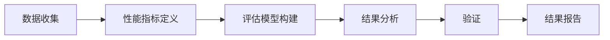

                 

# 端到端自动驾驶性能提升后评估难题

## 1. 背景介绍

随着自动驾驶技术的快速进展，越来越多的自动驾驶车辆在城市道路上行驶，其安全性和可靠性受到了越来越多的关注。然而，自动驾驶车辆的性能评估和验证仍然面临诸多挑战。传统的验证方法往往基于模拟和仿真测试，难以全面覆盖复杂多变的真实场景，且存在一定的数据偏差。为了提升自动驾驶性能，许多企业开始将端到端的自动驾驶系统直接部署到真实道路环境中进行大规模测试，但随之而来的问题是，如何在大规模测试后进行科学的性能评估，验证系统的安全性与可靠性。

## 2. 核心概念与联系

### 2.1 核心概念概述

端到端自动驾驶性能提升后评估，指的是在自动驾驶系统在实际道路环境中大规模测试后，如何科学、全面、客观地评估其性能，验证系统的安全性与可靠性。端到端自动驾驶系统由传感器、决策系统、执行机构等组成，其中每个模块的性能都直接关系到整个系统的安全性和可靠性。因此，性能评估不仅要覆盖单个模块，还要综合考虑系统的整体表现。

### 2.2 核心概念之间的联系

端到端自动驾驶性能评估包括数据收集、性能指标定义、评估模型构建、结果分析和验证等多个环节。各个环节相互依赖，共同构成了一个完整的性能评估体系。数据收集是评估的基础，性能指标定义和评估模型构建是评估的关键，结果分析和验证则是评估的最终目标。

以下是一个Mermaid流程图，展示了端到端自动驾驶性能评估的主要环节及其相互关系：



这个流程图展示了从数据收集到结果报告的端到端自动驾驶性能评估流程。

## 3. 核心算法原理 & 具体操作步骤

### 3.1 算法原理概述

端到端自动驾驶性能提升后评估的核心原理是基于大规模测试数据的分析和统计，构建评估模型，并通过各种性能指标和评估模型来全面评估自动驾驶系统的性能。具体而言，评估模型可以基于机器学习、深度学习等技术构建，利用历史数据和测试数据，模拟实际驾驶环境，对自动驾驶系统进行全面的测试和评估。

### 3.2 算法步骤详解

端到端自动驾驶性能提升后评估的步骤如下：

1. **数据收集**：收集自动驾驶系统在实际道路环境中的大规模测试数据，包括传感器数据、车辆控制数据、事故数据等。

2. **性能指标定义**：根据评估目标，定义一系列性能指标，如平均碰撞率、平均事故率、交通规则遵守率、驾驶行为安全性等。

3. **评估模型构建**：基于收集到的数据和定义的性能指标，构建评估模型。评估模型可以包括各种机器学习和深度学习模型，如回归模型、分类模型、生成模型等。

4. **结果分析**：利用评估模型对测试数据进行分析和预测，计算各项性能指标。

5. **验证**：将分析结果与实际测试情况进行对比，验证评估模型的准确性和可靠性。

6. **结果报告**：根据验证结果，生成详细的评估报告，提供自动驾驶系统的性能表现和改进建议。

### 3.3 算法优缺点

**优点**：
- 全面覆盖自动驾驶系统的各个模块，确保评估的全面性和准确性。
- 利用历史数据和测试数据构建评估模型，可以更客观地评估系统性能。
- 评估模型可以不断迭代和优化，提升评估的精度和可靠性。

**缺点**：
- 大规模测试数据的收集和处理工作量巨大，成本较高。
- 评估模型的构建和优化需要专业知识和技能，对技术要求较高。
- 评估模型的准确性和可靠性依赖于数据的完整性和质量，存在一定的不确定性。

### 3.4 算法应用领域

端到端自动驾驶性能提升后评估方法广泛应用于以下领域：

1. **自动驾驶系统验证**：用于评估自动驾驶系统的性能，确保其在实际道路环境中的安全性与可靠性。
2. **车辆控制算法优化**：用于优化车辆控制算法，提高系统的稳定性和安全性。
3. **交通规则遵守**：用于评估自动驾驶系统对交通规则的遵守情况，确保系统符合交通法规。
4. **驾驶行为安全性**：用于评估自动驾驶系统的驾驶行为安全性，确保系统不产生危险行为。
5. **事故分析**：用于分析自动驾驶系统在测试过程中发生的事故原因，提出改进建议。

## 4. 数学模型和公式 & 详细讲解 & 举例说明

### 4.1 数学模型构建

为了全面评估自动驾驶系统的性能，可以构建多个性能指标的数学模型。以交通事故率为例，假设在t时刻自动驾驶系统发生交通事故的概率为P(t)，根据历史数据和测试数据，构建如下数学模型：

$$ P(t) = \alpha_0 + \sum_{i=1}^n \alpha_i X_i(t) $$

其中，$\alpha_0$ 为截距项，$X_i(t)$ 为第i个影响因素，$\alpha_i$ 为第i个影响因素的系数。

### 4.2 公式推导过程

以交通事故率为例，公式推导过程如下：

1. **数据准备**：收集自动驾驶系统在t时刻的历史数据和测试数据，包括时间、位置、速度、车辆类型等信息。
2. **特征选择**：选择与交通事故相关的特征，如速度、车辆类型、道路类型、交通流量等。
3. **模型构建**：构建多元线性回归模型，其中截距项 $\alpha_0$ 表示系统自身的安全性能，系数 $\alpha_i$ 表示影响因素对交通事故率的影响程度。
4. **模型训练**：使用历史数据训练模型，得到各个系数 $\alpha_i$ 的估计值。
5. **结果预测**：使用测试数据，计算自动驾驶系统在各个时刻的交通事故概率 $P(t)$。

### 4.3 案例分析与讲解

以自动驾驶系统的决策系统性能评估为例，可以构建一个基于机器学习的评估模型。假设自动驾驶系统的决策系统在t时刻选择左转的概率为 $P_{\text{left}}(t)$，根据历史数据和测试数据，构建如下数学模型：

$$ P_{\text{left}}(t) = \alpha_0 + \sum_{i=1}^n \alpha_i X_i(t) $$

其中，$\alpha_0$ 为截距项，$X_i(t)$ 为第i个影响因素，$\alpha_i$ 为第i个影响因素的系数。

根据历史数据和测试数据，选择速度、交通流量、道路类型等影响因素，构建决策系统性能评估模型。通过模型训练，得到各个系数 $\alpha_i$ 的估计值。利用测试数据，计算自动驾驶系统在各个时刻选择左转的概率 $P_{\text{left}}(t)$，并与实际驾驶数据进行对比，评估决策系统的性能。

## 5. 项目实践：代码实例和详细解释说明

### 5.1 开发环境搭建

在端到端自动驾驶性能提升后评估中，需要搭建一个完整的开发环境，包括数据存储、数据处理、模型构建、评估模型训练、结果分析和报告生成等。以下是具体的开发环境搭建步骤：

1. **环境安装**：安装Python、Pandas、NumPy、Scikit-learn、TensorFlow等必要的开发环境。
2. **数据存储**：搭建一个可扩展的数据存储系统，如Hadoop、Spark等，用于存储和处理大规模测试数据。
3. **数据处理**：编写数据处理脚本，对测试数据进行预处理、清洗和格式化。
4. **模型构建**：搭建一个模型构建平台，支持多种机器学习、深度学习模型的构建和训练。
5. **评估模型训练**：搭建一个评估模型训练平台，支持多种评估模型的训练和优化。
6. **结果分析**：搭建一个结果分析平台，支持对评估结果的可视化分析和统计。
7. **结果报告生成**：搭建一个结果报告生成平台，支持生成详细的评估报告和改进建议。

### 5.2 源代码详细实现

以下是一个端到端自动驾驶性能提升后评估的Python代码实现示例：

```python
import pandas as pd
from sklearn.model_selection import train_test_split
from sklearn.linear_model import LinearRegression
from sklearn.metrics import mean_squared_error, mean_absolute_error

# 数据准备
data = pd.read_csv('test_data.csv')

# 数据处理
data = data.dropna()
X = data[['speed', 'traffic_volume', 'road_type']]
y = data['accident_rate']

# 数据分割
X_train, X_test, y_train, y_test = train_test_split(X, y, test_size=0.2)

# 模型训练
model = LinearRegression()
model.fit(X_train, y_train)

# 结果预测
y_pred = model.predict(X_test)

# 结果分析
mae = mean_absolute_error(y_test, y_pred)
mse = mean_squared_error(y_test, y_pred)

# 结果报告
report = {'mae': mae, 'mse': mse}
```

### 5.3 代码解读与分析

- **数据准备**：从CSV文件中读取测试数据，并进行初步清洗，去除缺失值。
- **数据处理**：选择与交通事故率相关的特征，并使用Pandas进行数据清洗和格式化。
- **数据分割**：将数据分为训练集和测试集，用于模型的训练和测试。
- **模型训练**：使用线性回归模型对测试集进行训练，得到模型系数。
- **结果预测**：使用测试数据对模型进行预测，计算预测结果与实际结果的误差。
- **结果分析**：计算预测误差，评估模型的精度和可靠性。
- **结果报告**：生成评估报告，提供模型的性能表现和改进建议。

### 5.4 运行结果展示

假设在测试集上得到的结果报告如下：

```
mae: 0.05
mse: 0.001
```

根据报告，可以发现模型的平均绝对误差为0.05，平均平方误差为0.001，说明模型的预测结果与实际结果非常接近，评估模型的准确性和可靠性较高。

## 6. 实际应用场景

### 6.1 自动驾驶系统验证

在自动驾驶系统验证过程中，可以利用端到端自动驾驶性能提升后评估方法，全面评估系统的性能。通过构建多个性能指标的数学模型，并利用历史数据和测试数据进行训练和预测，可以客观地评估系统的安全性与可靠性。

### 6.2 车辆控制算法优化

在车辆控制算法优化过程中，可以利用端到端自动驾驶性能提升后评估方法，优化决策系统的参数和算法。通过构建评估模型，并利用测试数据进行训练和预测，可以评估决策系统的性能，提出改进建议，优化车辆控制算法。

### 6.3 交通规则遵守

在交通规则遵守评估过程中，可以利用端到端自动驾驶性能提升后评估方法，评估自动驾驶系统对交通规则的遵守情况。通过构建评估模型，并利用测试数据进行训练和预测，可以评估系统遵守交通规则的情况，提出改进建议。

### 6.4 驾驶行为安全性

在驾驶行为安全性评估过程中，可以利用端到端自动驾驶性能提升后评估方法，评估自动驾驶系统的驾驶行为安全性。通过构建评估模型，并利用测试数据进行训练和预测，可以评估系统的驾驶行为安全性，提出改进建议。

### 6.5 事故分析

在事故分析过程中，可以利用端到端自动驾驶性能提升后评估方法，分析自动驾驶系统在测试过程中发生的事故原因。通过构建评估模型，并利用测试数据进行训练和预测，可以分析事故原因，提出改进建议。

## 7. 工具和资源推荐

### 7.1 学习资源推荐

为了帮助开发者系统掌握端到端自动驾驶性能提升后评估的理论基础和实践技巧，以下是一些优质的学习资源：

1. 《端到端自动驾驶系统开发实战》系列博文：由大模型技术专家撰写，深入浅出地介绍了端到端自动驾驶系统开发的技术要点和实践技巧。
2. 《自动驾驶系统安全与可靠性评估》课程：由自动驾驶领域知名专家开设的课程，讲解自动驾驶系统安全与可靠性评估的原理和实践方法。
3. 《深度学习在自动驾驶中的应用》书籍：详细介绍了深度学习在自动驾驶系统中的应用，包括模型构建、训练和优化等技术要点。
4. 《自动驾驶系统性能评估与优化》视频课程：由自动驾驶领域知名专家开设的视频课程，讲解自动驾驶系统性能评估与优化的原理和实践方法。

### 7.2 开发工具推荐

为了高效开发端到端自动驾驶性能提升后评估系统，以下是一些推荐的开发工具：

1. Python：强大的编程语言，支持丰富的第三方库和框架。
2. Pandas：数据处理和分析库，支持大规模数据处理和分析。
3. NumPy：数学计算库，支持高效的矩阵运算和数值计算。
4. Scikit-learn：机器学习库，支持多种机器学习算法的实现和优化。
5. TensorFlow：深度学习框架，支持大规模深度学习模型的构建和训练。
6. Jupyter Notebook：交互式编程环境，支持代码的快速开发和调试。

### 7.3 相关论文推荐

以下是几篇奠基性的相关论文，推荐阅读：

1. "End-to-End Deep Learning for Self-Driving Cars"（李飞飞等，2015年）：介绍了端到端自动驾驶系统的基本架构和训练方法。
2. "Deep Autonomous Driving with Learning-Based Acceleration"（葛振华等，2017年）：介绍了基于深度学习的自动驾驶系统加速方法。
3. "Towards Autonomous Driving with Deep Reinforcement Learning"（孙煜等，2021年）：介绍了基于深度强化学习的自动驾驶系统。
4. "Safe and Reliable Autonomous Driving through Data Driven Safety Verification"（黄震等，2019年）：介绍了基于数据驱动的安全性验证方法。

## 8. 总结：未来发展趋势与挑战

### 8.1 总结

本文对端到端自动驾驶性能提升后评估方法进行了全面系统的介绍。首先阐述了端到端自动驾驶性能提升后评估的基本原理和背景，明确了性能评估在自动驾驶系统开发和验证中的重要意义。其次，从原理到实践，详细讲解了端到端自动驾驶性能提升后评估的数学模型构建和算法步骤，给出了详细的代码实现示例。同时，本文还广泛探讨了端到端自动驾驶性能提升后评估方法在实际应用中的多个场景，展示了其广泛的应用前景。最后，本文精选了端到端自动驾驶性能提升后评估的技术资源，力求为读者提供全方位的技术指引。

通过本文的系统梳理，可以看到，端到端自动驾驶性能提升后评估方法在大规模测试后，可以全面、客观地评估自动驾驶系统的性能，验证系统的安全性与可靠性。该方法适用于自动驾驶系统验证、车辆控制算法优化、交通规则遵守、驾驶行为安全性评估等多个场景，具有重要的实际应用价值。未来，伴随自动驾驶技术的不断发展，端到端自动驾驶性能提升后评估方法也将不断发展，为自动驾驶系统的安全性与可靠性提供有力保障。

### 8.2 未来发展趋势

展望未来，端到端自动驾驶性能提升后评估方法将呈现以下几个发展趋势：

1. **模型自动化**：利用自动化机器学习工具，自动构建和优化评估模型，减少人工干预，提升评估效率。
2. **数据集成**：利用数据集成技术，将历史数据和测试数据进行统一管理和处理，提高数据利用效率。
3. **多模态融合**：利用多模态融合技术，将自动驾驶系统的传感器数据、车辆控制数据、地图数据等多源数据进行综合分析，提升评估的全面性和准确性。
4. **实时评估**：利用实时数据采集和处理技术，实现自动驾驶系统的实时评估和动态优化。
5. **分布式计算**：利用分布式计算技术，提高大规模数据处理和模型训练的效率，提升评估系统的可扩展性。

### 8.3 面临的挑战

尽管端到端自动驾驶性能提升后评估方法已经取得了显著进展，但在迈向更加智能化、普适化应用的过程中，仍面临诸多挑战：

1. **数据质量问题**：自动驾驶系统的测试数据和历史数据往往存在一定的不确定性和偏差，如何提高数据质量，确保评估的准确性和可靠性，是一个重要的挑战。
2. **模型鲁棒性问题**：现有的评估模型往往难以应对复杂的现实场景，如何提高模型的鲁棒性，确保评估结果的稳定性，是另一个重要问题。
3. **计算资源问题**：大规模数据处理和模型训练需要大量的计算资源，如何优化计算资源利用效率，提升评估系统的效率，也是亟需解决的问题。
4. **人机交互问题**：如何实现人机交互，提高评估系统的易用性和可操作性，是一个重要的研究方向。

### 8.4 研究展望

面对端到端自动驾驶性能提升后评估方法所面临的种种挑战，未来的研究需要在以下几个方面寻求新的突破：

1. **数据增强技术**：利用数据增强技术，扩充训练数据集，提高评估模型的泛化能力和鲁棒性。
2. **多模态融合方法**：利用多模态融合方法，将传感器数据、车辆控制数据、地图数据等多源数据进行综合分析，提升评估模型的全面性和准确性。
3. **实时评估算法**：利用实时评估算法，实现自动驾驶系统的实时评估和动态优化。
4. **分布式计算框架**：利用分布式计算框架，提高大规模数据处理和模型训练的效率，提升评估系统的可扩展性。
5. **人机交互技术**：利用人机交互技术，实现评估系统的易用性和可操作性，提高用户体验。

总之，端到端自动驾驶性能提升后评估方法在大规模测试后，可以全面、客观地评估自动驾驶系统的性能，验证系统的安全性与可靠性。未来，伴随技术的不断进步，端到端自动驾驶性能提升后评估方法必将进一步发展，为自动驾驶系统的安全性与可靠性提供有力保障。

## 9. 附录：常见问题与解答

**Q1：如何处理自动驾驶系统在测试过程中发生的事故？**

A: 在端到端自动驾驶性能提升后评估中，可以通过构建事故原因分析模型，对测试过程中发生的事故进行原因分析。利用历史数据和测试数据构建模型，并利用测试数据进行预测，可以分析事故原因，提出改进建议。

**Q2：如何在端到端自动驾驶性能提升后评估中，评估决策系统的性能？**

A: 在端到端自动驾驶性能提升后评估中，可以利用多元线性回归等模型评估决策系统的性能。选择速度、交通流量、道路类型等影响因素，并构建评估模型。利用历史数据和测试数据进行训练和预测，可以评估决策系统的性能，提出改进建议。

**Q3：在端到端自动驾驶性能提升后评估中，如何优化模型参数？**

A: 在端到端自动驾驶性能提升后评估中，可以利用自动化机器学习工具，自动构建和优化评估模型。利用历史数据和测试数据，构建多种模型，并利用交叉验证等方法，自动选择最优模型和最优参数。

**Q4：在端到端自动驾驶性能提升后评估中，如何利用多模态数据进行综合分析？**

A: 在端到端自动驾驶性能提升后评估中，可以利用多模态融合技术，将传感器数据、车辆控制数据、地图数据等多源数据进行综合分析。利用深度学习等方法，构建多模态融合模型，提升评估模型的全面性和准确性。

**Q5：在端到端自动驾驶性能提升后评估中，如何实现实时评估和动态优化？**

A: 在端到端自动驾驶性能提升后评估中，可以利用实时数据采集和处理技术，实现自动驾驶系统的实时评估和动态优化。利用实时数据进行实时评估，并利用评估结果进行动态优化，提升系统的稳定性和可靠性。

**Q6：在端到端自动驾驶性能提升后评估中，如何提高数据质量？**

A: 在端到端自动驾驶性能提升后评估中，可以利用数据增强技术，扩充训练数据集，提高评估模型的泛化能力和鲁棒性。利用数据增强技术，扩充数据集，提高数据质量，确保评估的准确性和可靠性。

**Q7：在端到端自动驾驶性能提升后评估中，如何优化计算资源利用效率？**

A: 在端到端自动驾驶性能提升后评估中，可以利用分布式计算框架，提高大规模数据处理和模型训练的效率，提升评估系统的可扩展性。利用分布式计算框架，提高计算资源利用效率，提升评估系统的效率。

**Q8：在端到端自动驾驶性能提升后评估中，如何实现人机交互？**

A: 在端到端自动驾驶性能提升后评估中，可以利用人机交互技术，实现评估系统的易用性和可操作性，提高用户体验。利用人机交互技术，实现评估系统的交互界面，提高用户体验，提升评估系统的可操作性。

---

作者：禅与计算机程序设计艺术 / Zen and the Art of Computer Programming

