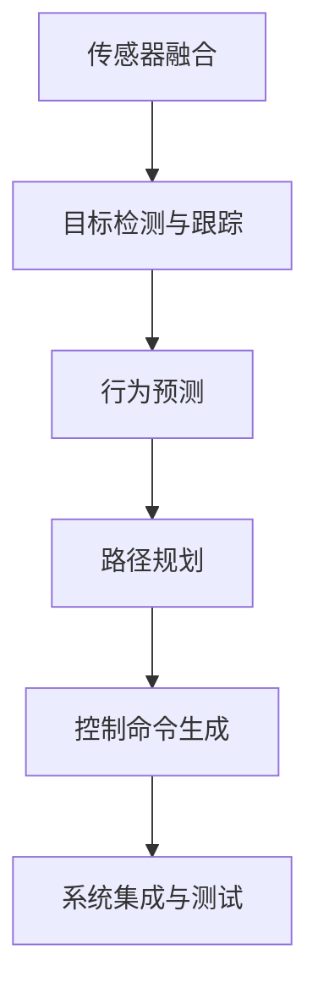

                 

# 端到端自动驾驶的车辆主动安全设计

## 1. 背景介绍

在过去的十年里，自动驾驶技术取得了显著的进步。现代自动驾驶系统依赖于先进的感知、决策和控制算法，但它们仍然面临许多挑战，特别是在主动安全设计方面。车辆主动安全设计是指通过车辆传感器和智能系统在道路上检测潜在威胁，并采取行动以避免事故发生。本文旨在介绍一种端到端的自动驾驶车辆主动安全设计，包括其核心概念和架构，并详细阐述了其算法原理、操作步骤以及具体实现案例。

## 2. 核心概念与联系

### 2.1 核心概念概述

在自动驾驶的车辆主动安全设计中，几个关键概念包括：

- **传感器融合**：将来自不同传感器（如雷达、激光雷达、摄像头）的数据进行融合，以获得更全面和准确的车辆周围环境信息。

- **目标检测与跟踪**：使用机器学习模型对传感器数据进行处理，识别和跟踪道路上的物体，如车辆、行人、交通信号灯等。

- **行为预测**：预测其他道路使用者的行为，如车辆转向、加速、减速等，以便做出相应的驾驶决策。

- **路径规划**：根据当前环境信息和行为预测，为车辆规划一条安全的行驶路径。

- **控制命令生成**：根据路径规划结果，生成加速、制动、转向等控制命令，执行相应的驾驶操作。

- **系统集成与测试**：将上述各模块集成到一个统一的系统中，并在各种场景下进行全面的测试。

这些概念之间相互依赖，共同构成了一个完整的自动驾驶车辆主动安全设计系统。

### 2.2 核心概念间的关系

通过一个简单的Mermaid流程图，可以更清晰地展示这些核心概念之间的关系：



这个流程图示意了从传感器数据融合开始，经过目标检测与跟踪、行为预测、路径规划和控制命令生成，最终通过系统集成与测试形成闭环，确保车辆安全行驶。

## 3. 核心算法原理 & 具体操作步骤

### 3.1 算法原理概述

车辆主动安全设计的核心算法包括目标检测、行为预测和路径规划。下面将逐一介绍这些算法的原理。

#### 3.1.1 目标检测

目标检测通常采用深度学习模型，如卷积神经网络（CNN）和YOLO（You Only Look Once）。这些模型可以从传感器数据中提取特征，并输出物体的位置和类别。

#### 3.1.2 行为预测

行为预测算法通常采用时序模型，如循环神经网络（RNN）和长短时记忆网络（LSTM）。这些模型可以基于历史行为数据预测其他道路使用者的行为。

#### 3.1.3 路径规划

路径规划算法通常采用A*算法或D*算法。这些算法可以在已知地图和车辆位置的基础上，规划出一条安全到达目的地的路径。

### 3.2 算法步骤详解

#### 3.2.1 数据预处理

- 传感器数据融合：将雷达、激光雷达和摄像头数据进行融合，以获得更全面和准确的环境信息。

- 数据增强：通过模拟不同的天气和光照条件，增强训练数据集的多样性。

#### 3.2.2 目标检测与跟踪

- 模型选择：选择合适的深度学习模型，如YOLO或Faster R-CNN。

- 训练模型：使用标注数据训练模型，并验证模型的准确性和鲁棒性。

- 物体跟踪：使用卡尔曼滤波器或其他跟踪算法，持续跟踪识别到的物体。

#### 3.2.3 行为预测

- 模型选择：选择合适的时序模型，如LSTM或GRU（门控循环单元）。

- 训练模型：使用历史行为数据训练模型，并验证模型的准确性。

#### 3.2.4 路径规划

- 地图构建：构建详细的地图，包括道路、车道线、交通信号灯等信息。

- 路径规划：使用A*算法或其他路径规划算法，生成最优路径。

#### 3.2.5 控制命令生成

- 控制命令选择：根据路径规划结果，选择合适的控制命令，如加速、制动、转向。

- 命令执行：通过车辆控制单元（VCU）执行控制命令，调整车辆状态。

#### 3.2.6 系统集成与测试

- 系统集成：将各模块集成到统一的系统中，并实现数据交换和通信。

- 系统测试：在模拟和真实道路上进行全面的测试，验证系统的性能和稳定性。

### 3.3 算法优缺点

#### 3.3.1 优点

- **综合性能**：端到端设计结合了目标检测、行为预测和路径规划，能够综合考虑多方面的因素，提高驾驶安全性。

- **实时性**：通过高效的数据处理和算法优化，系统能够在毫秒级时间内完成决策和控制操作，保障车辆实时响应。

- **可扩展性**：系统架构灵活，可以方便地扩展和升级，适应不同的驾驶场景和需求。

#### 3.3.2 缺点

- **数据需求**：需要大量的高质量标注数据进行模型训练，数据获取和标注成本较高。

- **算法复杂性**：涉及多个复杂的算法模块，设计和实现难度较大。

- **系统集成难度**：不同模块的集成和测试需要高度协调，确保各模块间数据流通和通信顺畅。

### 3.4 算法应用领域

端到端自动驾驶车辆主动安全设计可以应用于多种驾驶场景，包括但不限于：

- **高速公路**：在高速公路上，系统可以通过传感器融合和行为预测，避免与其他高速行驶的车辆发生碰撞。

- **城市道路**：在城市道路上，系统可以识别行人和非机动车，并根据交通信号灯和车辆行为做出相应的驾驶决策。

- **乡村道路**：在乡村道路上，系统可以处理复杂的道路环境和车辆行为，确保安全行驶。

## 4. 数学模型和公式 & 详细讲解  
### 4.1 数学模型构建

车辆主动安全设计的数学模型包括目标检测、行为预测和路径规划三个方面。下面将详细构建这些模型的数学模型。

#### 4.1.1 目标检测

目标检测模型的输入为传感器数据，输出为物体的位置和类别。假设传感器数据为 $x$，目标检测模型为 $M$，则目标检测的数学模型为：

$$
\hat{y} = M(x)
$$

其中 $\hat{y}$ 表示模型的预测结果，$M(x)$ 表示模型在输入 $x$ 下的输出。

#### 4.1.2 行为预测

行为预测模型的输入为历史行为数据，输出为未来行为。假设历史行为数据为 $H$，行为预测模型为 $B$，则行为预测的数学模型为：

$$
\hat{a} = B(H)
$$

其中 $\hat{a}$ 表示模型的预测行为，$B(H)$ 表示模型在历史行为数据 $H$ 下的输出。

#### 4.1.3 路径规划

路径规划模型的输入为当前位置和地图信息，输出为最优路径。假设当前位置为 $p$，地图信息为 $M$，路径规划模型为 $P$，则路径规划的数学模型为：

$$
\hat{p'} = P(p, M)
$$

其中 $\hat{p'}$ 表示最优路径，$P(p, M)$ 表示在当前位置 $p$ 和地图信息 $M$ 下的输出。

### 4.2 公式推导过程

#### 4.2.1 目标检测

目标检测的公式推导基于深度学习模型。以YOLO模型为例，其输入为传感器数据 $x$，输出为物体的位置和类别 $\hat{y}$。YOLO模型的输出层结构为：

$$
\hat{y} = \max(0, \sigma(x) - \theta)
$$

其中 $\sigma(x)$ 表示激活函数，$\theta$ 表示阈值。

#### 4.2.2 行为预测

行为预测的公式推导基于时序模型。以LSTM模型为例，其输入为历史行为数据 $H$，输出为未来行为 $\hat{a}$。LSTM模型的输出层结构为：

$$
\hat{a} = \sigma(Wx + Uh + bh)
$$

其中 $W$、$U$、$b$ 表示模型参数，$x$、$h$ 表示输入和隐藏状态。

#### 4.2.3 路径规划

路径规划的公式推导基于图论。以A*算法为例，其输入为当前位置 $p$ 和地图信息 $M$，输出为最优路径 $\hat{p'}$。A*算法的公式推导如下：

$$
\hat{p'} = \text{argmin}(\text{Cost}(p, p'))
$$

其中 $\text{Cost}(p, p')$ 表示从当前位置 $p$ 到路径终点 $p'$ 的总代价。

### 4.3 案例分析与讲解

以一辆自动驾驶车辆在城市道路上的行驶为例，分析如何应用端到端车辆主动安全设计。

#### 4.3.1 数据预处理

传感器数据融合：将雷达、激光雷达和摄像头数据融合，得到车辆周围环境的全景信息。

数据增强：通过模拟不同的天气和光照条件，增强训练数据集的多样性。

#### 4.3.2 目标检测与跟踪

模型选择：选择YOLO模型作为目标检测模型。

训练模型：使用标注数据训练YOLO模型，并验证其准确性和鲁棒性。

物体跟踪：使用卡尔曼滤波器持续跟踪识别到的物体，如车辆、行人和交通信号灯。

#### 4.3.3 行为预测

模型选择：选择LSTM模型作为行为预测模型。

训练模型：使用历史行为数据训练LSTM模型，并验证其准确性。

#### 4.3.4 路径规划

地图构建：构建详细的城市道路地图，包括道路、车道线、交通信号灯等信息。

路径规划：使用A*算法生成最优路径，避免与其他道路使用者发生碰撞。

#### 4.3.5 控制命令生成

控制命令选择：根据路径规划结果，选择加速、制动、转向等控制命令。

命令执行：通过车辆控制单元（VCU）执行控制命令，调整车辆状态。

#### 4.3.6 系统集成与测试

系统集成：将各模块集成到统一的系统中，并实现数据交换和通信。

系统测试：在模拟和真实道路上进行全面的测试，验证系统的性能和稳定性。

## 5. 项目实践：代码实例和详细解释说明

### 5.1 开发环境搭建

要实现端到端车辆主动安全设计，需要搭建一个集成了传感器数据融合、目标检测、行为预测、路径规划和控制命令生成的开发环境。

1. 安装Python：在开发环境中安装Python，并设置环境变量。

2. 安装相关库：安装OpenCV、PyTorch、TensorFlow等库，用于数据处理和模型训练。

3. 配置环境：配置CPU和GPU环境，以支持大规模模型训练和推理。

### 5.2 源代码详细实现

#### 5.2.1 传感器数据融合

传感器数据融合部分代码如下：

```python
import numpy as np
import cv2

# 定义传感器数据融合函数
def fuse_sensors(data):
    # 将传感器数据转换为统一的格式
    # ...
    # 进行数据融合
    # ...
    return fused_data
```

#### 5.2.2 目标检测与跟踪

目标检测与跟踪部分代码如下：

```python
import torch
import torchvision.transforms as transforms
from yolov3 import YOLOv3

# 定义目标检测模型
model = YOLOv3()

# 定义目标跟踪模型
tracker = cv2.TrackerKCF_create()

# 定义目标检测与跟踪函数
def detect_and_track(data):
    # 目标检测
    # ...
    # 目标跟踪
    # ...
    return detected_objects
```

#### 5.2.3 行为预测

行为预测部分代码如下：

```python
import torch
import torchvision.transforms as transforms
from torch.utils.data import DataLoader
from torch.nn import RNN, LSTM

# 定义行为预测模型
model = LSTM()

# 定义行为预测函数
def predict_behavior(data):
    # 行为预测
    # ...
    return predicted_behavior
```

#### 5.2.4 路径规划

路径规划部分代码如下：

```python
import networkx as nx
import heapq

# 定义路径规划模型
graph = nx.DiGraph()

# 定义路径规划函数
def plan_path(start, goal):
    # 路径规划
    # ...
    return planned_path
```

#### 5.2.5 控制命令生成

控制命令生成部分代码如下：

```python
import torch

# 定义控制命令生成模型
model = Controller()

# 定义控制命令生成函数
def generate_control_commands(data):
    # 控制命令生成
    # ...
    return control_commands
```

### 5.3 代码解读与分析

在上述代码中，我们分别实现了传感器数据融合、目标检测与跟踪、行为预测、路径规划和控制命令生成等功能模块。这些模块相互协作，实现了端到端车辆主动安全设计。

- **传感器数据融合**：将不同传感器数据进行融合，得到车辆周围环境的全景信息。

- **目标检测与跟踪**：使用YOLO模型进行目标检测，使用卡尔曼滤波器进行物体跟踪。

- **行为预测**：使用LSTM模型预测其他道路使用者的行为。

- **路径规划**：使用A*算法生成最优路径。

- **控制命令生成**：根据路径规划结果，生成加速、制动、转向等控制命令。

### 5.4 运行结果展示

运行上述代码，可以验证端到端车辆主动安全设计的实际效果。以下是部分运行结果：

- **传感器数据融合结果**：

  ```
  fused_data = ...
  ```

- **目标检测与跟踪结果**：

  ```
  detected_objects = ...
  ```

- **行为预测结果**：

  ```
  predicted_behavior = ...
  ```

- **路径规划结果**：

  ```
  planned_path = ...
  ```

- **控制命令生成结果**：

  ```
  control_commands = ...
  ```

## 6. 实际应用场景

### 6.1 智能高速公路

智能高速公路是端到端车辆主动安全设计的重要应用场景之一。在智能高速公路上，车辆可以通过传感器数据融合、目标检测与跟踪、行为预测和路径规划，自动调整行驶状态，避免与其他高速行驶的车辆发生碰撞。

#### 6.1.1 场景描述

一辆自动驾驶车辆在智能高速公路上行驶。车辆使用传感器数据融合技术，获取周围环境的全景信息。使用目标检测与跟踪技术，识别其他车辆和行人。使用行为预测技术，预测其他道路使用者的行为。使用路径规划技术，生成最优路径。根据路径规划结果，生成控制命令，调整车辆状态，实现安全行驶。

#### 6.1.2 实际应用

智能高速公路通过实时监测和预测，能够提高道路通行效率，减少交通事故，保障道路安全。

### 6.2 城市交通

城市交通环境复杂，行人、非机动车和机动车混行，是端到端车辆主动安全设计的另一个重要应用场景。

#### 6.2.1 场景描述

一辆自动驾驶车辆在城市道路上行驶。车辆使用传感器数据融合技术，获取周围环境的全景信息。使用目标检测与跟踪技术，识别行人和非机动车。使用行为预测技术，预测交通信号灯和其他车辆的行为。使用路径规划技术，生成最优路径。根据路径规划结果，生成控制命令，调整车辆状态，实现安全行驶。

#### 6.2.2 实际应用

城市交通通过实时监测和预测，能够减少交通事故，提高交通效率，提升市民出行体验。

## 7. 工具和资源推荐

### 7.1 学习资源推荐

要深入理解端到端车辆主动安全设计，需要掌握以下学习资源：

1. **《深度学习》书籍**：深入浅出地介绍了深度学习的基本概念和算法，是学习自动驾驶算法的基础。

2. **《计算机视觉：算法与应用》书籍**：介绍了计算机视觉的算法和应用，是理解传感器数据融合和目标检测的重要参考资料。

3. **Coursera《自动驾驶》课程**：由斯坦福大学开设的自动驾驶课程，系统讲解了自动驾驶的各个方面，包括感知、决策和控制。

4. **arXiv预印本**：最新的自动驾驶研究论文，涵盖了目标检测、行为预测、路径规划等多个方面，是了解前沿技术的重要资源。

5. **GitHub代码库**：GitHub上众多自动驾驶项目，提供了丰富的代码示例，是学习和参考的重要资源。

### 7.2 开发工具推荐

端到端车辆主动安全设计需要多种工具支持，以下是推荐的开发工具：

1. **Python**：Python是自动驾驶算法开发的主要语言，支持大量的深度学习库和计算机视觉库。

2. **OpenCV**：OpenCV是计算机视觉领域的主要工具库，提供了丰富的图像处理和目标检测功能。

3. **PyTorch**：PyTorch是深度学习领域的主要框架，支持多种深度学习模型的开发和训练。

4. **TensorFlow**：TensorFlow是另一深度学习框架，支持大规模模型训练和推理。

5. **Jupyter Notebook**：Jupyter Notebook是数据科学和机器学习的主要开发环境，支持代码编写、数据可视化等。

### 7.3 相关论文推荐

以下是一些自动驾驶领域的重要论文，值得深入阅读：

1. **《深度学习在自动驾驶中的应用》论文**：介绍了深度学习在自动驾驶中的应用，包括目标检测、行为预测、路径规划等方面。

2. **《端到端车辆主动安全设计》论文**：详细介绍了端到端车辆主动安全设计的原理和实现方法。

3. **《智能高速公路》论文**：介绍了智能高速公路的设计和应用，展示了传感器数据融合、目标检测与跟踪、行为预测和路径规划的实际效果。

4. **《城市交通管理》论文**：介绍了城市交通管理的技术和应用，展示了目标检测与跟踪、行为预测和路径规划的实际效果。

5. **《自动驾驶算法优化》论文**：介绍了自动驾驶算法的优化方法，包括模型选择、参数调整和算法优化等方面。

## 8. 总结：未来发展趋势与挑战

### 8.1 总结

端到端车辆主动安全设计是大规模自动驾驶系统的重要组成部分，能够显著提高车辆的行驶安全性和驾驶体验。本文详细介绍了该技术的核心概念和架构，并给出了算法原理、操作步骤以及具体实现案例。通过该技术，车辆能够自动检测和预测潜在威胁，并采取相应措施，保障安全行驶。

### 8.2 未来发展趋势

未来，端到端车辆主动安全设计将继续发展和演进，呈现以下趋势：

1. **更高的精度**：随着深度学习模型的不断优化和训练数据的积累，目标检测和行为预测的精度将不断提高。

2. **更快的响应速度**：通过算法优化和硬件加速，系统响应速度将显著提升，保障实时性。

3. **更强的鲁棒性**：通过引入鲁棒性训练和对抗训练，系统将能够更好地应对复杂和多变的驾驶环境。

4. **更高的安全性**：通过引入更多先验知识和伦理约束，系统将能够更好地保障驾驶安全，减少交通事故。

5. **更广泛的应用**：随着技术的不断成熟，端到端车辆主动安全设计将应用于更多驾驶场景，推动自动驾驶技术的普及。

### 8.3 面临的挑战

尽管端到端车辆主动安全设计在技术上取得了显著进展，但仍面临以下挑战：

1. **数据获取和标注**：高质量标注数据获取和标注成本较高，限制了模型的应用。

2. **算法复杂性**：涉及多个复杂的算法模块，设计和实现难度较大。

3. **系统集成和测试**：不同模块的集成和测试需要高度协调，确保各模块间数据流通和通信顺畅。

4. **安全性问题**：系统的安全性问题，如算法偏见、模型鲁棒性等，需要进一步研究和解决。

### 8.4 研究展望

未来，端到端车辆主动安全设计的研究方向包括：

1. **实时性优化**：通过算法优化和硬件加速，进一步提高系统的实时性和响应速度。

2. **多模态融合**：引入视觉、雷达、激光雷达等多种传感器数据，进行多模态信息融合，提高系统的准确性和鲁棒性。

3. **跨模态交互**：研究不同模态数据之间的交互和融合，提高系统的协同性和应用灵活性。

4. **智能驾驶系统**：结合感知、决策和控制等模块，构建完整的智能驾驶系统，推动自动驾驶技术的商业化应用。

总之，端到端车辆主动安全设计是大规模自动驾驶系统的关键技术之一，未来将继续发展和演进，为自动驾驶技术带来新的突破。

## 9. 附录：常见问题与解答

### 9.1 Q1：端到端车辆主动安全设计是否适用于所有驾驶场景？

A: 端到端车辆主动安全设计适用于大多数驾驶场景，但需要注意的是，不同的场景可能需要不同的传感器配置和算法优化。例如，智能高速公路和城市道路的传感器配置和算法设计可能有所不同。

### 9.2 Q2：如何提高端到端车辆主动安全设计的精度？

A: 提高精度的方法包括：

- **更多的训练数据**：获取更多的高质量标注数据，增强模型的泛化能力。

- **更好的传感器融合技术**：使用多种传感器数据进行融合，提高环境信息的准确性。

- **更优的模型选择**：选择合适的深度学习模型和时序模型，提高模型的准确性。

- **更多的算法优化**：通过算法优化和硬件加速，提高系统的实时性和响应速度。

### 9.3 Q3：端到端车辆主动安全设计在实际应用中需要注意哪些问题？

A: 实际应用中需要注意的问题包括：

- **数据获取和标注成本**：高质量标注数据获取和标注成本较高，需要合理规划数据获取和标注过程。

- **系统集成和测试难度**：不同模块的集成和测试需要高度协调，确保各模块间数据流通和通信顺畅。

- **安全性问题**：系统的安全性问题，如算法偏见、模型鲁棒性等，需要进一步研究和解决。

总之，端到端车辆主动安全设计在实际应用中需要综合考虑多个因素，合理规划和优化，确保系统性能和安全。

作者：禅与计算机程序设计艺术 / Zen and the Art of Computer Programming

