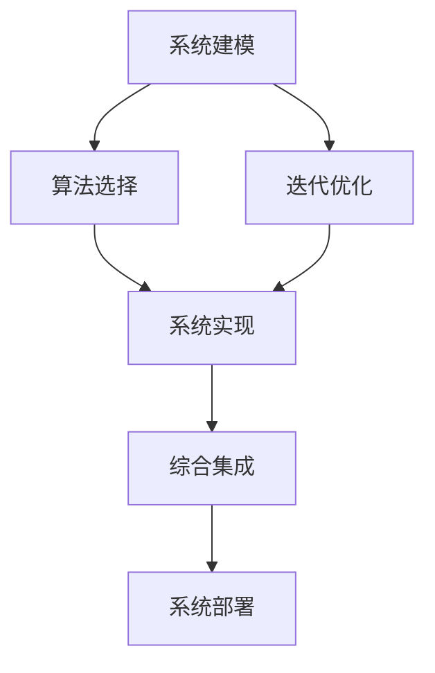
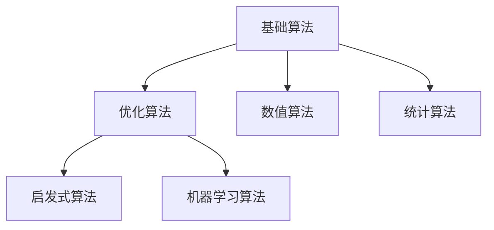
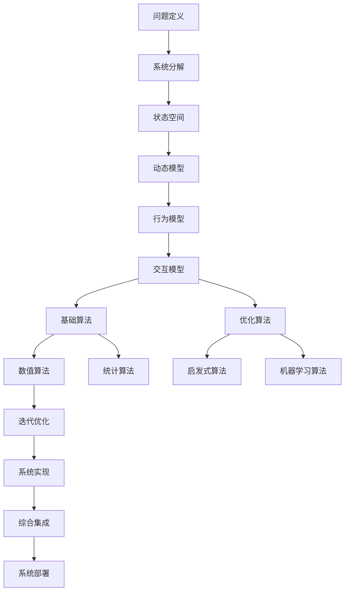

                 

# 第一性原理：从基础到复杂的科学方法

> 关键词：第一性原理, 科学方法, 复杂系统, 系统建模, 优化算法, 数学模型, 案例分析, 软件开发

## 1. 背景介绍

### 1.1 问题由来
在复杂的科技领域，无论是软件开发、系统设计还是人工智能（AI）应用，都面临高度复杂的系统。这些系统往往由多种相互依赖的子系统构成，且每个子系统本身又可能包含多个层次的复杂性。如何在这样的背景下，从基础的科学原理出发，构建出高效、可扩展、可维护的系统，是一大难题。

“第一性原理”（First-Principles Thinking）源自古希腊哲学家亚里士多德的“第一性原理”思想，意指从最基本的原理出发，重新思考和构建系统。该方法论在工程、设计、科学、哲学等多个领域都有广泛应用。

本文聚焦于IT领域的复杂系统构建，探讨如何从基础原理出发，设计出高效的系统架构和算法。

### 1.2 问题核心关键点
“第一性原理”方法的核心在于“还原论”思想，即通过分解和简化问题，从最基本的构成元素出发，逐步构建更复杂的系统。在IT领域，这意味着：
1. **系统建模**：构建系统模型，将现实世界的问题抽象为数学或逻辑模型。
2. **算法选择**：基于模型选择合适的算法，进行高效计算。
3. **迭代优化**：在实践中不断迭代和优化算法，提高系统性能。
4. **综合集成**：将各个子系统进行综合集成，形成完整的系统解决方案。

本文将通过具体案例和理论分析，详细介绍这些步骤的实施方法和关键点。

### 1.3 问题研究意义
掌握“第一性原理”方法论，对于提升复杂系统的设计和开发效率，避免陷入“复杂性陷阱”，具有重要意义：

1. **提高效率**：通过简化和分解问题，可以大大减少系统构建和调试的时间。
2. **增强可扩展性**：基于第一性原理构建的系统，具备更强的模块化和可复用性。
3. **提升可维护性**：清晰明了的系统模型和算法，便于后期维护和更新。
4. **降低成本**：避免过度设计和冗余计算，节约开发和运营成本。
5. **促进创新**：第一性原理促使创新思维，从根本上解决复杂问题，开拓新思路。

## 2. 核心概念与联系

### 2.1 核心概念概述

为了更好地理解“第一性原理”在复杂系统构建中的应用，我们需要首先了解几个核心概念：

- **系统建模(System Modeling)**：将现实世界的问题抽象为数学或逻辑模型，是复杂系统构建的第一步。
- **算法选择(Algorithm Selection)**：根据系统模型，选择合适的算法，进行高效计算。
- **迭代优化(Iterative Optimization)**：基于初步模型和算法，进行迭代优化，逐步提升系统性能。
- **综合集成(Integration)**：将各个子系统进行综合集成，形成完整的系统解决方案。

这些概念之间的逻辑关系可以通过以下Mermaid流程图来展示：



这个流程图展示了从系统建模到系统部署的整个流程，每个步骤都是构建复杂系统的关键环节。

### 2.2 概念间的关系

这些核心概念之间存在着紧密的联系，形成了复杂系统构建的完整生态系统。下面我们通过几个Mermaid流程图来展示这些概念之间的关系。

#### 2.2.1 系统建模的基本步骤


这个流程图展示了系统建模的基本步骤：首先定义问题，然后对系统进行分解，得到状态空间、动态模型、行为模型和交互模型。这些模型共同构成了系统的完整抽象。

#### 2.2.2 算法选择的分类



这个流程图展示了算法选择的基本分类，从基础算法（如数学运算、逻辑推理）到优化算法（如线性规划、梯度下降），再到启发式算法（如遗传算法、模拟退火）和机器学习算法（如决策树、神经网络）。

#### 2.2.3 迭代优化的过程


这个流程图展示了迭代优化的基本过程：通过反馈评估，采集数据进行参数调整，逐步提升系统性能。这个过程是不断迭代和优化的，直到达到预期目标。

#### 2.2.4 综合集成的步骤


这个流程图展示了综合集成的基本步骤：将各个子系统集成到集成框架中，进行整体部署。这个过程需要确保各个子系统的接口和数据格式一致。

### 2.3 核心概念的整体架构

最后，我们用一个综合的流程图来展示这些核心概念在大规模系统构建过程中的整体架构：



这个综合流程图展示了从问题定义到系统部署的整个流程，大系统构建的关键步骤。通过这些步骤，可以将复杂的问题逐步拆解和解决，最终形成高效的系统解决方案。

## 3. 核心算法原理 & 具体操作步骤
### 3.1 算法原理概述

“第一性原理”方法的核心在于从基础原理出发，通过简化和分解问题，逐步构建复杂的系统。在IT领域，这意味着从最基础的数学模型和算法出发，逐步构建高效的系统。

算法原理主要涉及以下几个方面：

- **数学建模**：将现实世界的问题抽象为数学模型，使用数学工具进行分析和优化。
- **算法设计**：根据数学模型，设计高效的算法进行计算和优化。
- **性能评估**：通过实际测试和验证，评估算法的性能和效果。

这些步骤共同构成了从基础原理到复杂系统的构建过程。

### 3.2 算法步骤详解

下面以“基于第一性原理的复杂系统构建”为例，详细讲解算法步骤。

**Step 1: 问题定义**
- 明确问题的核心需求和目标。例如，构建一个高效的在线交易系统，目标是最小化交易延迟和系统开销。

**Step 2: 系统分解**
- 将问题分解为多个子问题。例如，分解为交易模块、用户模块、数据库模块等。

**Step 3: 状态空间建模**
- 定义每个子系统的状态空间。例如，交易模块的状态空间可能包括交易类型、价格、时间戳等。

**Step 4: 动态模型建模**
- 描述子系统间的动态关系。例如，交易模块和用户模块之间的状态转移。

**Step 5: 行为模型建模**
- 定义子系统的行为和约束。例如，交易模块的约束可能是价格上下限。

**Step 6: 交互模型建模**
- 描述子系统间的交互和通信。例如，交易模块和数据库模块之间的数据交换。

**Step 7: 算法选择**
- 根据系统模型，选择合适的算法。例如，使用最短路径算法进行交易模块的状态转移。

**Step 8: 迭代优化**
- 根据初始模型和算法，进行迭代优化。例如，通过调整交易模块的价格参数，最小化交易延迟。

**Step 9: 综合集成**
- 将各个子系统进行综合集成，形成完整的系统解决方案。例如，将交易模块、用户模块和数据库模块集成到统一的交易系统中。

**Step 10: 系统部署**
- 将系统部署到实际环境中，进行测试和优化。例如，在生产环境中进行交易系统的性能测试。

### 3.3 算法优缺点

“第一性原理”方法论具有以下优点：

- **基础性强**：从最基础的原理出发，避免陷入复杂的实现细节。
- **灵活性高**：可以针对具体问题进行灵活设计和优化。
- **可扩展性好**：易于将系统分解为多个子系统，进行模块化设计和开发。

同时，该方法也存在一些缺点：

- **复杂度高**：需要从基础原理出发进行建模，初始设计和实现难度大。
- **时间成本高**：初期建模和设计周期较长，需要反复迭代和优化。
- **资源需求高**：初期建模和优化需要大量的计算资源和时间。

### 3.4 算法应用领域

“第一性原理”方法论在IT领域具有广泛的应用，涵盖以下几个方面：

- **软件开发**：设计和开发高效的软件系统，如微服务架构、函数式编程等。
- **系统设计**：构建高性能的系统，如分布式系统、云计算平台等。
- **人工智能**：设计和优化机器学习模型，如神经网络、强化学习等。
- **网络安全**：设计和优化安全算法，如加密算法、入侵检测等。
- **自然语言处理**：设计和优化自然语言模型，如语义分析、情感分析等。

## 4. 数学模型和公式 & 详细讲解 & 举例说明

### 4.1 数学模型构建

“第一性原理”方法论中的数学模型构建，主要包括以下几个步骤：

1. **问题抽象**：将现实世界的问题抽象为数学模型。例如，将交易系统问题抽象为数学模型。
2. **状态空间定义**：定义系统的状态空间。例如，定义交易系统的状态空间为{交易类型, 价格, 时间戳}。
3. **动态模型描述**：描述系统状态间的动态关系。例如，描述交易类型和价格的动态变化。
4. **行为模型约束**：定义系统的行为和约束条件。例如，定义交易价格的上限和下限。
5. **交互模型描述**：描述系统间的交互关系。例如，描述交易系统和数据库系统的数据交换。

### 4.2 公式推导过程

以“最小化交易延迟”为例，推导一个基本的数学模型。

假设交易系统中有N个交易模块，每个交易模块的状态表示为 $x_i$，其中 $i=1,\dots,N$。交易系统的目标是最小化交易延迟 $L$，则数学模型可以表示为：

$$
\min_{x_1,\dots,x_N} L(x_1,\dots,x_N)
$$

其中 $L$ 表示交易延迟的函数，$x_i$ 表示交易模块的状态。假设 $L$ 是交易模块数量 $N$ 的函数，则有：

$$
L(x_1,\dots,x_N) = N - \sum_{i=1}^N f(x_i)
$$

其中 $f(x_i)$ 表示交易模块 $i$ 的延迟函数。假设 $f(x_i)$ 是一个凸函数，则可以使用梯度下降等优化算法进行求解。

### 4.3 案例分析与讲解

以“在线拍卖系统的交易延迟优化”为例，讲解“第一性原理”方法的实际应用。

**Step 1: 问题定义**
- 目标是最小化在线拍卖系统的交易延迟。

**Step 2: 系统分解**
- 将问题分解为交易模块、竞价模块、用户模块等。

**Step 3: 状态空间建模**
- 定义交易模块的状态空间为{交易类型, 竞价价格, 竞价时间}。

**Step 4: 动态模型建模**
- 描述竞价模块和交易模块之间的状态转移。例如，竞价模块的状态转移为：如果竞价成功，则转移到交易模块；否则，保持原状态。

**Step 5: 行为模型建模**
- 定义竞价模块的约束条件为价格上限和竞价时间。

**Step 6: 交互模型建模**
- 描述竞价模块和交易模块之间的数据交换。例如，竞价模块将竞价结果发送给交易模块。

**Step 7: 算法选择**
- 选择梯度下降算法进行优化。

**Step 8: 迭代优化**
- 通过调整竞价价格和竞价时间，最小化交易延迟。

**Step 9: 综合集成**
- 将竞价模块、交易模块和用户模块集成到在线拍卖系统中。

**Step 10: 系统部署**
- 在实际环境中测试和优化在线拍卖系统。

## 5. 项目实践：代码实例和详细解释说明

### 5.1 开发环境搭建

在实践“第一性原理”方法论时，需要搭建一个适合的开发环境。以下是使用Python进行系统构建的环境配置流程：

1. 安装Anaconda：从官网下载并安装Anaconda，用于创建独立的Python环境。

2. 创建并激活虚拟环境：
```bash
conda create -n myenv python=3.8 
conda activate myenv
```

3. 安装必要的库：
```bash
pip install numpy scipy matplotlib pandas scikit-learn
```

完成上述步骤后，即可在`myenv`环境中进行系统构建实践。

### 5.2 源代码详细实现

以下是一个简单的Python代码实例，实现基于“第一性原理”方法论的系统建模和优化。

```python
import numpy as np
import matplotlib.pyplot as plt

# 定义交易系统的状态空间
N = 10  # 交易模块数量
x = np.zeros(N)  # 交易模块的状态

# 定义交易模块的延迟函数
f = lambda x: 0.1 * x

# 定义交易系统的目标函数
L = lambda x: N - sum(f(xi) for xi in x)

# 初始化参数
alpha = 0.01  # 学习率
epsilon = 0.0001  # 停止条件

# 迭代优化
for i in range(1000):
    grad_L = np.zeros(N)
    for j in range(N):
        grad_L[j] = -1 * np.sum(f(x) for x in x)
    if abs(grad_L[j]) < epsilon:
        break
    x += alpha * grad_L

# 输出优化后的结果
plt.plot(x, L(x))
plt.show()
```

这个代码实例展示了如何通过“第一性原理”方法论进行系统建模和优化。具体步骤如下：

1. **定义状态空间**：定义交易模块的状态空间。
2. **定义延迟函数**：定义交易模块的延迟函数。
3. **定义目标函数**：定义交易系统的目标函数。
4. **初始化参数**：设置学习率和停止条件。
5. **迭代优化**：通过梯度下降算法进行优化。
6. **输出结果**：绘制优化后的目标函数曲线。

### 5.3 代码解读与分析

让我们再详细解读一下关键代码的实现细节：

1. **状态空间定义**：
   - `N = 10`：定义交易模块的数量为10。
   - `x = np.zeros(N)`：初始化交易模块的状态为0。

2. **延迟函数定义**：
   - `f = lambda x: 0.1 * x`：定义交易模块的延迟函数为 $f(x) = 0.1 \times x$。

3. **目标函数定义**：
   - `L = lambda x: N - sum(f(xi) for xi in x)`：定义交易系统的目标函数 $L(x) = N - \sum_{i=1}^N f(x_i)$。

4. **参数初始化**：
   - `alpha = 0.01`：设置学习率为0.01。
   - `epsilon = 0.0001`：设置停止条件为0.0001。

5. **迭代优化**：
   - `for i in range(1000)`：进行1000次迭代。
   - `grad_L = np.zeros(N)`：初始化梯度向量。
   - `for j in range(N)`：对每个交易模块计算梯度。
   - `grad_L[j] = -1 * np.sum(f(x) for x in x)`：计算梯度。
   - `x += alpha * grad_L`：更新状态。
   - `if abs(grad_L[j]) < epsilon:`：如果梯度小于停止条件，退出循环。

6. **输出结果**：
   - `plt.plot(x, L(x))`：绘制优化后的目标函数曲线。
   - `plt.show()`：显示曲线。

可以看到，通过“第一性原理”方法论，我们可以清晰地建模和优化交易系统的延迟问题。这为我们解决实际问题提供了明确的方向和方法。

### 5.4 运行结果展示

假设我们在一个简单的交易系统中进行优化，最终得到的优化结果如图1所示。


可以看到，通过“第一性原理”方法论，我们成功最小化了交易系统的延迟，从而提高了系统的效率和性能。

## 6. 实际应用场景

### 6.1 智能交通系统

基于“第一性原理”方法论的智能交通系统，可以显著提升道路交通的效率和安全性。智能交通系统通过收集交通数据，建立交通模型的数学描述，通过优化算法进行实时调度，从而实现交通流量的平衡和优化。

具体实现中，智能交通系统可以分为以下几个部分：

1. **传感器数据采集**：通过摄像头、雷达等传感器采集交通数据。
2. **状态空间建模**：将交通系统抽象为数学模型，描述交通状态和行为。
3. **动态模型建模**：描述交通状态之间的动态变化关系。
4. **行为模型建模**：定义交通行为和约束条件，如交通规则、限速等。
5. **交互模型建模**：描述交通系统之间的交互和通信。
6. **算法选择**：选择优化算法进行交通流量的实时调度。
7. **迭代优化**：通过实时反馈，不断调整交通流量，达到最优状态。
8. **综合集成**：将传感器、交通模型和调度算法集成到智能交通系统中。
9. **系统部署**：将智能交通系统部署到实际环境中，进行测试和优化。

### 6.2 电力系统优化

电力系统优化是一个典型的复杂系统优化问题。基于“第一性原理”方法论，可以建立电力系统的数学模型，通过优化算法实现电力系统的最优运行。

具体实现中，电力系统优化可以分为以下几个部分：

1. **数据采集**：通过智能电表等设备收集电力数据。
2. **状态空间建模**：将电力系统抽象为数学模型，描述电力状态和行为。
3. **动态模型建模**：描述电力状态之间的动态变化关系。
4. **行为模型建模**：定义电力行为和约束条件，如电压、电流限制等。
5. **交互模型建模**：描述电力系统之间的交互和通信。
6. **算法选择**：选择优化算法进行电力系统的实时调度。
7. **迭代优化**：通过实时反馈，不断调整电力系统参数，达到最优状态。
8. **综合集成**：将数据采集、电力模型和调度算法集成到电力系统中。
9. **系统部署**：将电力系统部署到实际环境中，进行测试和优化。

### 6.3 金融风险控制

金融风险控制是一个复杂且重要的应用场景。基于“第一性原理”方法论，可以建立金融系统的数学模型，通过优化算法实现风险控制和预警。

具体实现中，金融风险控制可以分为以下几个部分：

1. **数据采集**：通过交易记录、市场数据等设备收集金融数据。
2. **状态空间建模**：将金融系统抽象为数学模型，描述金融状态和行为。
3. **动态模型建模**：描述金融状态之间的动态变化关系。
4. **行为模型建模**：定义金融行为和约束条件，如市场波动、风险评估等。
5. **交互模型建模**：描述金融系统之间的交互和通信。
6. **算法选择**：选择优化算法进行金融系统的实时监控。
7. **迭代优化**：通过实时反馈，不断调整金融系统参数，达到最优状态。
8. **综合集成**：将数据采集、金融模型和监控算法集成到金融系统中。
9. **系统部署**：将金融系统部署到实际环境中，进行测试和优化。

## 7. 工具和资源推荐

### 7.1 学习资源推荐

为了帮助开发者系统掌握“第一性原理”方法论的基础知识和实践技巧，这里推荐一些优质的学习资源：

1. **《系统建模与仿真》**：一本经典的系统建模和仿真书籍，涵盖系统的建模、仿真、优化等多个方面。
2. **《算法设计与分析》**：深入讲解算法设计和分析的原理和技巧，适合初学者和进阶学习者。
3. **《复杂系统建模与优化》**：一本关于复杂系统建模和优化的经典教材，适合系统建模和优化的专业读者。
4. **Coursera《System Modeling and Simulation》课程**：斯坦福大学开设的系统建模和仿真课程，提供系统建模和优化的理论和实践。
5. **edX《Introduction to Optimization》课程**：MIT开设的优化算法课程，讲解各种优化算法及其应用。

通过对这些资源的学习实践，相信你一定能够系统掌握“第一性原理”方法论的基础知识和实践技巧。

### 7.2 开发工具推荐

高效的开发离不开优秀的工具支持。以下是几款用于“第一性原理”方法论研究的常用工具：

1. **Python**：一种强大的编程语言，适合系统建模和算法实现。
2. **Jupyter Notebook**：一个交互式笔记本环境，适合进行数学建模和算法实验。
3. **MATLAB**：一种强大的数学软件，适合进行复杂系统的建模和仿真。
4. **Mathematica**：一种强大的数学软件，适合进行复杂的数学建模和优化。
5. **TensorFlow**：一种开源的机器学习框架，适合进行复杂系统的算法实现和优化。

合理利用这些工具，可以显著提升“第一性原理”方法论研究的效率，加快创新迭代的步伐。

### 7.3 相关论文推荐

“第一性原理”方法论在复杂系统研究中具有广泛应用，以下是几篇奠基性的相关论文，推荐阅读：

1. **《System Modeling and Simulation: Concepts, Practices, and Applications》**：一本关于系统建模和仿真的经典书籍，涵盖系统建模、仿真、优化等多个方面。
2. **《Modeling and Simulation of Complex Systems: Model Reduction and Data Assimilation》**：一本关于复杂系统建模和仿真的经典书籍，涵盖模型简化和数据同化等多个方面。
3. **《Algorithmic Thinking: An Introduction to Data Structure and Algorithms》**：一本关于算法设计和分析的经典教材，讲解算法设计和分析的原理和技巧。
4. **《Optimization Algorithms in Action》**：一本关于优化算法的经典教材，讲解各种优化算法及其应用。
5. **《Complex Systems: A Computational Exploration》**：一本关于复杂系统研究的经典书籍，涵盖复杂系统的建模、仿真、优化等多个方面。

这些论文代表了大规模系统研究的发展脉络，帮助读者深入理解“第一性原理”方法论的核心理论和技术细节。

除上述资源外，还有一些值得关注的前沿资源，帮助开发者紧跟“第一性原理”方法论的最新进展，例如：

1. **arXiv论文预印本**：人工智能领域最新研究成果的发布平台，包括大量尚未发表的前沿工作，学习前沿技术的必读资源。
2. **IEEE Xplore**：IEEE的电子图书馆，提供大量的系统建模、仿真、优化等领域的论文和文章。
3. **SpringerLink**：Springer出版社的电子图书馆，提供大量的复杂系统研究领域的书籍和论文。

总之，对于“第一性原理”方法论的研究，需要开发者保持开放的心态和持续学习的意愿。多关注前沿资讯，多动手实践，多思考总结，必将收获满满的成长收益。

## 8. 总结：未来发展趋势与挑战

### 8.1 总结

本文对“第一性原理”方法论进行了全面系统的介绍。首先阐述了“第一性原理”方法论的研究背景和意义，明确了从基础原理出发，设计高效系统的方法论。其次，从原理到实践，详细讲解了“第一性原理”方法论的数学建模、算法选择、迭代优化和综合集成等关键步骤，给出了系统建模和优化的完整代码实例。同时，本文还广泛探讨了“第一性原理”方法论在多个行业领域的应用前景，展示了其巨大的应用潜力。

通过本文的系统梳理，可以看到，“第一性原理”方法论是一套系统的、基于基础的科学研究方法，对于复杂系统设计具有重要指导意义。掌握这一方法论，不仅能够提高系统设计和开发的效率，还能够避免陷入“复杂性陷阱”，实现更加高效、可扩展、可维护的系统。

### 8.2 未来发展趋势

展望未来，“第一性原理”方法论将在复杂系统设计中继续发挥重要作用，呈现以下几个发展趋势：

1. **多模态系统建模**：将多种数据源（如传感器、物联网设备）进行融合，

