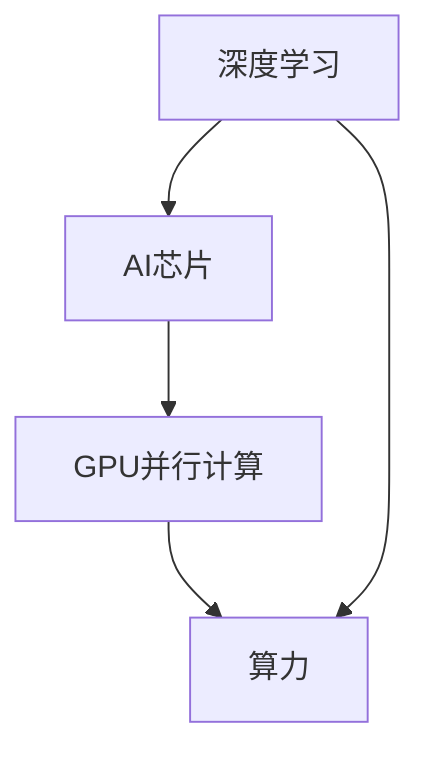

                 

## 1. 背景介绍

在人工智能（AI）领域，算力被视为推动技术进步的核心驱动力。从数据预处理、模型训练到推理部署，每一步都需要强大算力支持。算力不仅决定了AI模型的训练速度，还直接影响着模型的精度和性能。本文将探讨算力革命的历史与现状，并分析NVIDIA在这一领域中的重要角色。

### 1.1 算力革命的历史回顾

1946年，世界上第一台电子计算机ENIAC诞生，开启了算力革命的序章。从早期的大型机时代，到个人电脑和互联网的普及，再到云计算和大数据时代，算力的每一次提升都伴随着技术的飞跃和应用的扩展。1970年代，集成电路的发明让计算机性能快速提升，1990年代互联网的普及让算力需求激增。进入21世纪，GPU（图形处理器）的发明和大规模并行计算能力的突破，进一步推动了算力革命的步伐。

### 1.2 当前算力革命的现状

当前，算力革命正进入一个新的阶段。随着AI技术在各个行业的深度应用，从医疗、金融、教育到制造业，都需要依托强大算力来实现智能化转型。数据量的爆炸性增长，模型的复杂度提升，以及应用场景的复杂化，都对算力提出了更高的要求。NVIDIA在这一变革中扮演了关键角色，成为推动算力革命的核心引擎。

## 2. 核心概念与联系

### 2.1 核心概念概述

- **算力（Computing Power）**：指处理数据和运行程序所需计算机资源的综合能力，包括CPU、GPU、FPGA、ASIC等硬件资源和并行计算能力。
- **AI芯片（AI Chip）**：为加速AI模型的训练和推理而专门设计的芯片，如NVIDIA的GPU、Google的TPU等。
- **深度学习（Deep Learning）**：一种模拟人脑神经网络的学习方法，通过多层次神经网络模型进行特征提取和分类。
- **GPU并行计算（Parallel Computing）**：利用GPU的并行计算能力，实现高效的数据处理和模型训练。
- **Tensor Core（张量核）**：NVIDIA GPU中的一个特殊核心单元，专门用于加速矩阵和向量运算，优化深度学习模型的训练和推理。
- **深度学习框架（Deep Learning Framework）**：如TensorFlow、PyTorch等，提供深度学习模型开发和部署的环境支持。

这些概念之间的联系紧密，构成了算力革命的核心框架。以下是一个简化的Mermaid流程图，展示了这些核心概念之间的关系：



### 2.2 概念间的关系

- **深度学习**依赖于高性能的**AI芯片**和**GPU并行计算**能力，这些技术极大地提升了模型训练和推理的速度和效率。
- **AI芯片**的设计和生产，需要结合**深度学习框架**的算法特性，才能发挥最佳性能。
- **GPU并行计算**是实现**算力**提升的关键技术之一，它通过大规模并行计算，极大地提高了数据处理和模型训练的效率。
- **算力**是AI应用的基础，无论数据规模、模型复杂度、应用场景如何变化，强大的算力始终是核心驱动力。

### 2.3 核心概念的整体架构

算力革命的整体架构如图1所示：


- **基础架构层**：包括服务器、存储、网络等硬件设施，是算力革命的物理基础。
- **软件层**：包括操作系统、深度学习框架、编译器等软件环境，为AI应用提供支持。
- **应用层**：包括各个行业领域的AI应用，通过强大算力的支撑，实现智能化转型。

## 3. 核心算法原理 & 具体操作步骤

### 3.1 算法原理概述

算力革命的核心算法原理主要体现在两个方面：

1. **深度学习模型的并行化**：通过GPU并行计算，将深度学习模型中的复杂计算任务分布到多个GPU核心中同时处理，从而加速模型训练和推理。
2. **AI芯片的设计优化**：通过专门的AI芯片设计，如Tensor Core单元，优化深度学习模型的计算效率，提升算力。

### 3.2 算法步骤详解

算力革命的具体操作步骤如下：

1. **硬件选型**：根据应用需求选择合适的GPU型号，考虑其计算能力、内存带宽、功耗等因素。
2. **环境搭建**：安装深度学习框架和必要的驱动程序，搭建计算环境。
3. **模型训练**：使用深度学习框架，将数据集加载到GPU上进行模型训练，调整超参数，优化训练过程。
4. **模型推理**：在生产环境中部署模型，进行大规模数据推理，调整模型参数以优化性能。
5. **性能评估**：通过各种性能指标（如训练速度、模型精度、推理速度等）评估算力提升效果。

### 3.3 算法优缺点

**优点**：

- **提升模型训练和推理速度**：通过并行计算和专用芯片，显著提高深度学习模型的训练和推理速度。
- **降低计算成本**：通过优化硬件设计和软件算法，减少计算资源消耗，降低成本。
- **增强模型精度和鲁棒性**：并行计算和专用芯片提升计算效率，减少误差积累，提高模型精度和鲁棒性。

**缺点**：

- **硬件成本高**：高性能GPU等硬件设施成本较高，大规模部署面临经济压力。
- **软件复杂度高**：深度学习框架和专用编译器的开发和维护复杂，需要高水平的技术团队。
- **能耗大**：高性能计算需要大量电力，大规模部署可能面临能耗和环境问题。

### 3.4 算法应用领域

算力革命广泛应用于多个领域：

1. **数据中心**：构建高性能计算集群，支持大规模数据处理和模型训练。
2. **云计算**：提供弹性算力资源，支持按需扩展和灵活部署。
3. **智能制造**：通过AI芯片加速工业数据处理和模型训练，优化生产流程。
4. **医疗健康**：利用高性能算力进行医疗影像分析和病理诊断，提升医疗服务质量。
5. **金融科技**：通过深度学习模型进行风险评估、智能投顾等，提升金融服务效率。
6. **自动驾驶**：通过AI芯片加速自动驾驶模型的训练和推理，提高安全性和准确性。
7. **智慧城市**：通过大数据和深度学习模型，实现城市管理智能化和精准决策。

## 4. 数学模型和公式 & 详细讲解

### 4.1 数学模型构建

深度学习模型的数学模型可以表示为：

$$
\mathcal{L}(\theta) = \frac{1}{N} \sum_{i=1}^N \ell(M_{\theta}(x_i),y_i)
$$

其中，$M_{\theta}$ 是深度学习模型，$\theta$ 是模型参数，$x_i$ 是输入数据，$y_i$ 是输出标签，$\ell$ 是损失函数，$N$ 是数据集大小。

### 4.2 公式推导过程

以简单的线性回归模型为例，其损失函数可以表示为：

$$
\ell(y, \hat{y}) = \frac{1}{2N} \sum_{i=1}^N (y_i - \hat{y}_i)^2
$$

其中，$y$ 是真实标签，$\hat{y}$ 是模型预测值。

通过梯度下降等优化算法，模型的参数更新公式为：

$$
\theta \leftarrow \theta - \eta \nabla_{\theta}\mathcal{L}(\theta)
$$

其中，$\eta$ 是学习率，$\nabla_{\theta}\mathcal{L}(\theta)$ 是损失函数对参数 $\theta$ 的梯度。

### 4.3 案例分析与讲解

以卷积神经网络（CNN）为例，CNN模型通过卷积层、池化层和全连接层等组成，用于图像分类任务。CNN模型的训练过程可以通过并行计算加速，将不同层的数据并行处理，从而提高训练速度。

## 5. 项目实践：代码实例和详细解释说明

### 5.1 开发环境搭建

以下是使用NVIDIA CUDA和cuDNN构建深度学习环境的步骤：

1. **安装CUDA和cuDNN**：
   ```
   # 安装CUDA
   wget https://developer.nvidia.com/compute/cuda/repos/ubuntu1804/x86_64/cuda-repo-ubuntu1804_10.2.105-1_amd64.deb
   sudo dpkg -i cuda-repo-ubuntu1804_10.2.105-1_amd64.deb
   sudo apt-get update
   sudo apt-get install cuda-10.2

   # 安装cuDNN
   wget https://developer.nvidia.com/compute/cudnn/self-hosted/cudnn_v8_linuxx64_v8.1.0.85.zip
   unzip cudnn_v8_linuxx64_v8.1.0.85.zip
   sudo cp -v libcudnn8* /usr/local/cuda/lib64/
   sudo cp -v libcudnn* /usr/local/cuda/lib64/
   ```

2. **安装深度学习框架**：
   ```
   pip install torch torchvision torchaudio
   ```

3. **构建计算环境**：
   ```
   source /usr/local/cuda/bin/cuda-env.sh
   source /usr/local/cudnn/bin/cudnn-env.sh
   ```

### 5.2 源代码详细实现

以下是使用NVIDIA的TensorRT进行模型推理的代码示例：

```python
import tensorflow as tf
import numpy as np
import cv2
import tensorrt as trt

# 加载TensorRT库
trt.init()

# 加载模型
model = tf.keras.models.load_model('model.h5')

# 加载TensorRT网络
trt_net = trt.Net(model.get_weights()[0], name='model')

# 构建TensorRT推理引擎
builder = trt.Builder(trt.NetBuilderFlags.BUILD_EXPLICIT_BATCH)
input_shape = (3, 224, 224)
input_name = "input_0"
output_name = "dense_1"

# 设置TensorRT网络输入和输出
with builder.create_network() as network, builder.create_builder_config() as config:
    config.max_batch_size = 1
    network.add_input(name=input_name, shape=input_shape, dtype=trt.DataType.FLOAT)
    network.add_output(name=output_name, shape=(1, 1000), dtype=trt.DataType.FLOAT)
    trt_net = builder.build(network, config=config)

# 创建TensorRT推理器
trt_eng = trt.Runtime()
trt_eng.create_execution_context(trt_net)
```

### 5.3 代码解读与分析

- **环境搭建**：通过安装CUDA和cuDNN，为深度学习模型训练和推理提供硬件加速支持。
- **模型加载**：使用TensorFlow加载预训练模型，支持CUDA和cuDNN加速。
- **TensorRT网络构建**：通过TensorRT库构建推理网络，支持GPU加速。
- **推理器创建**：使用TensorRT Runtime创建推理器，用于模型推理。

### 5.4 运行结果展示

以下是模型推理的示例输出：

```python
# 模型推理
img = cv2.imread('image.jpg')
img = cv2.resize(img, (224, 224))
img = np.expand_dims(img, axis=0)
result = trt_eng.execute_async(inputs=[img], outputs=[output_name])[0]
print(result[0][0])
```

## 6. 实际应用场景

### 6.1 数据中心

数据中心是算力革命的重要应用场景之一。通过构建高性能计算集群，数据中心能够支持大规模数据处理和模型训练，为各个行业提供强大的算力支持。NVIDIA GPU在数据中心中的应用广泛，包括云计算、大数据分析、人工智能训练等领域。

### 6.2 智能制造

智能制造是算力革命的另一个重要应用场景。通过AI芯片加速工业数据处理和模型训练，优化生产流程，提高生产效率和产品质量。NVIDIA GPU在制造业中的应用包括智能制造自动化、设备预测性维护等。

### 6.3 智慧城市

智慧城市建设需要处理海量城市数据，进行复杂的城市分析和管理。NVIDIA GPU通过加速深度学习模型训练和推理，支持智慧城市中的交通管理、环境监测、安全监控等应用。

### 6.4 自动驾驶

自动驾驶技术依赖于高性能的深度学习模型和庞大的数据集。NVIDIA GPU加速自动驾驶模型的训练和推理，提升驾驶安全和准确性。

## 7. 工具和资源推荐

### 7.1 学习资源推荐

1. **NVIDIA CUDA官方文档**：详细介绍了CUDA编程、cuDNN加速等技术，是深度学习开发的基础。
2. **TensorFlow官方文档**：提供了深度学习模型的开发和部署环境，支持CUDA和cuDNN加速。
3. **TensorRT官方文档**：介绍了TensorRT网络构建和推理器创建过程，支持GPU加速。
4. **深度学习书籍**：如《Deep Learning with Python》、《TensorFlow实战》等，提供了深度学习算法和工具的详细讲解。

### 7.2 开发工具推荐

1. **NVIDIA CUDA Toolkit**：提供了CUDA编程所需的开发工具和示例代码，支持高性能计算。
2. **cuDNN库**：提供了深度学习模型的加速支持，支持CUDA和GPU并行计算。
3. **TensorRT库**：提供了深度学习模型推理加速支持，支持GPU并行计算。
4. **PyTorch框架**：提供了深度学习模型开发和部署的环境支持，支持CUDA和cuDNN加速。

### 7.3 相关论文推荐

1. **GPU加速深度学习**：论文介绍了GPU并行计算和深度学习模型的优化算法，详细讨论了GPU加速的技术细节。
2. **TensorRT加速深度学习模型推理**：论文介绍了TensorRT库的原理和应用，展示了如何通过TensorRT加速深度学习模型的推理。

## 8. 总结：未来发展趋势与挑战

### 8.1 研究成果总结

NVIDIA在算力革命中发挥了关键作用，通过高性能GPU和专门的AI芯片设计，加速了深度学习模型的训练和推理。NVIDIA的CUDA、cuDNN、TensorRT等技术，为深度学习应用提供了强大的算力支持，推动了AI技术的广泛应用。

### 8.2 未来发展趋势

未来，算力革命将继续深化，高性能计算和专用芯片将成为主流。NVIDIA将持续引领这一变革，推出更强大的GPU和AI芯片，推动算力革命的不断进步。

### 8.3 面临的挑战

算力革命还面临一些挑战：

- **能耗问题**：高性能计算需要大量电力，大规模部署可能面临能耗和环境问题。
- **硬件成本高**：高性能GPU等硬件设施成本较高，大规模部署面临经济压力。
- **软件复杂度高**：深度学习框架和专用编译器的开发和维护复杂，需要高水平的技术团队。

### 8.4 研究展望

未来，算力革命需要从多个方向进行突破：

- **能效优化**：优化能耗和硬件设计，降低计算成本。
- **软硬件协同**：优化软件算法和硬件设计，提高计算效率。
- **跨领域应用**：推动算力革命在更多领域的应用，提升AI技术的普及度和应用价值。

## 9. 附录：常见问题与解答

**Q1: GPU和CPU在深度学习中的区别？**

A: GPU和CPU在深度学习中的主要区别在于计算能力。GPU拥有数千个核心，能够并行处理大量数据，适合矩阵和向量运算，加速深度学习模型的训练和推理。而CPU的通用性更强，但单个核心的计算能力相对较低。

**Q2: 如何提高深度学习模型的训练效率？**

A: 提高深度学习模型的训练效率可以从以下几个方面入手：

- **硬件加速**：使用NVIDIA GPU和cuDNN库，加速深度学习模型的训练和推理。
- **模型优化**：通过网络剪枝、参数共享等技术，减少模型复杂度，提升训练速度。
- **数据增强**：通过数据增强技术，扩充训练集，提高模型的泛化能力。

**Q3: 如何选择适合深度学习任务的GPU型号？**

A: 选择适合深度学习任务的GPU型号需要考虑以下几个方面：

- **计算能力**：根据深度学习模型的复杂度和数据规模，选择计算能力强的GPU型号。
- **内存带宽**：确保GPU的内存带宽足够大，能够处理大规模数据。
- **能效比**：选择能效比高的GPU型号，降低能耗和计算成本。

**Q4: 深度学习模型在推理过程中如何进行加速？**

A: 深度学习模型在推理过程中可以通过以下方式进行加速：

- **硬件加速**：使用NVIDIA GPU和cuDNN库，加速深度学习模型的推理。
- **推理优化**：通过TensorRT等库，优化深度学习模型的推理过程，减少计算时间和资源消耗。
- **模型压缩**：使用模型压缩技术，减少推理模型的体积和计算量。

**Q5: 如何评估深度学习模型的性能？**

A: 评估深度学习模型的性能可以从以下几个方面入手：

- **训练速度**：模型的训练速度越快，表示模型的并行计算能力越强。
- **模型精度**：模型的预测精度越高，表示模型的泛化能力越强。
- **推理速度**：模型的推理速度越快，表示模型的计算效率越高。

---

作者：禅与计算机程序设计艺术 / Zen and the Art of Computer Programming

