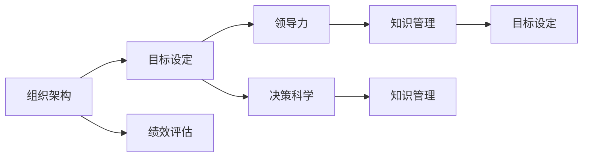
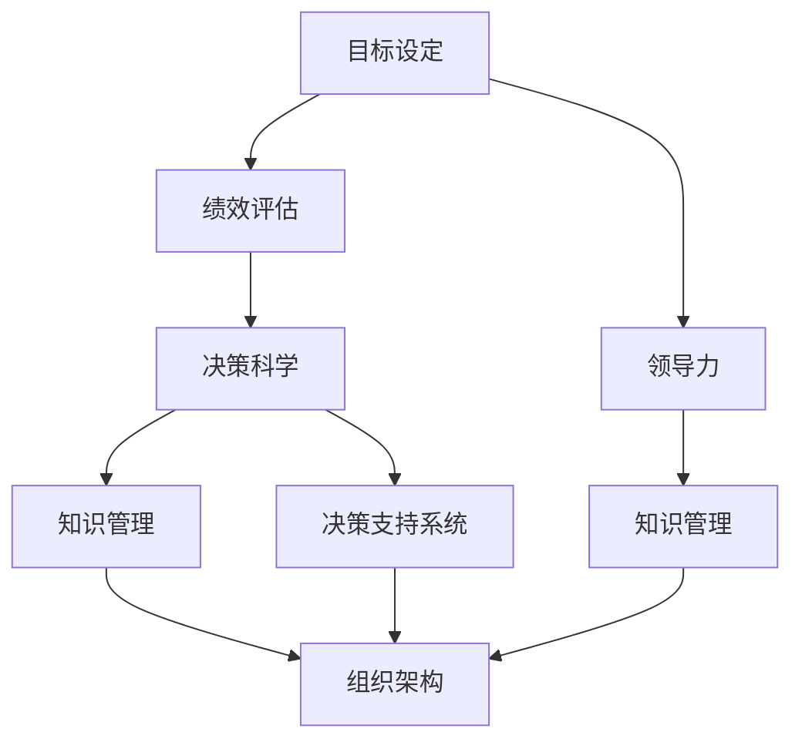

                 

# 管理的艺术：德鲁克的洞见

> 关键词：
- 管理哲学
- 组织架构
- 目标设定
- 绩效评估
- 领导力
- 决策科学
- 知识管理

## 1. 背景介绍

### 1.1 问题由来
彼得·德鲁克（Peter Drucker）被誉为现代管理学之父，他的理论和管理实践影响了全球无数企业和组织。德鲁克的管理思想深邃而具前瞻性，特别是在对组织管理、创新、领导力等关键问题的洞见上，给出了深刻的答案。本文旨在系统梳理德鲁克的核心洞见，并通过这些洞见，探讨在IT领域如何有效应用管理艺术。

### 1.2 问题核心关键点
德鲁克的管理艺术主要体现在以下几个核心概念上：
- **组织架构**：如何构建高效、灵活的组织结构。
- **目标设定**：如何定义清晰的组织目标和战略。
- **绩效评估**：如何有效地评估和激励员工。
- **领导力**：如何培养和发挥领导者的潜力。
- **决策科学**：如何基于数据和分析做出科学决策。
- **知识管理**：如何在知识密集型企业中有效管理知识。

通过深入理解这些核心概念，并结合IT领域的实际需求，我们能够更好地应用德鲁克的思想，优化组织管理，提升业务效率，实现创新发展。

### 1.3 问题研究意义
德鲁克的管理艺术在现代企业管理中仍然具有极高的价值。它不仅能够帮助企业解决当前的管理问题，还能为未来的发展提供长远的战略指导。在IT领域，这些洞见同样具有重要意义：

1. **提升组织效率**：IT技术应用广泛，高效组织结构能够更好地支撑技术实施和业务创新。
2. **明确业务目标**：清晰的目标设定有助于IT部门与业务目标对齐，确保技术投入产生最大价值。
3. **激励员工创新**：有效的绩效评估和领导力培养，能够激发员工创造力和团队协作。
4. **科学决策支持**：数据驱动的决策方法能够帮助IT团队做出更加精准和有效的技术选择。
5. **知识管理优化**：在IT领域，知识积累和传播至关重要，有效知识管理能够提升整体技术实力。

## 2. 核心概念与联系

### 2.1 核心概念概述

德鲁克的管理艺术涉及众多核心概念，其中最为关键的是以下几个：

- **组织架构**：决定企业的运作方式和结构，需满足战略需求、团队协作和信息流动的需要。
- **目标设定**：为组织设定明确、可衡量、可实现的目标，是管理的基础。
- **绩效评估**：通过评估和反馈机制，激励员工实现目标，优化团队表现。
- **领导力**：领导者需具备高瞻远瞩的能力，通过榜样和激励，引领团队前进。
- **决策科学**：基于数据和信息，进行科学分析和合理决策，减少不确定性和风险。
- **知识管理**：组织内知识的积累、传播和应用，是保持竞争力的关键。

这些概念相互关联，共同构成德鲁克管理艺术的基石。通过理解这些概念，我们可以更好地把握管理艺术的本质，应用于实际工作中。

### 2.2 概念间的关系

这些核心概念之间的逻辑关系可以通过以下Mermaid流程图来展示：



这个流程图展示了大语言模型微调过程中各个核心概念的关系：

1. 组织架构决定了目标设定的框架和方向。
2. 目标设定是绩效评估的依据，并指导领导力的发挥。
3. 绩效评估和领导力共同作用，促进决策科学的实践。
4. 决策科学和知识管理相互促进，支持目标设定的实现。

### 2.3 核心概念的整体架构

最后，我们用一个综合的流程图来展示这些核心概念在大语言模型微调过程中的整体架构：



这个综合流程图展示了从目标设定到组织架构，再到知识管理的完整过程，展示了德鲁克管理艺术的精髓。

## 3. 核心算法原理 & 具体操作步骤
### 3.1 算法原理概述

德鲁克的管理艺术虽然不直接涉及算法原理，但其核心理念如目标设定、领导力、绩效评估等，都可以转化为算法或流程，应用于实际工作中。以目标设定为例，可以通过算法来自动设定和评估目标的达成情况，从而更好地指导和管理组织。

### 3.2 算法步骤详解

在IT领域，可以将德鲁克的核心理念转化为具体的管理算法，用于优化组织管理和业务运营。以下是一些常见的步骤：

**Step 1: 目标设定算法**
- 收集业务需求和战略目标，转化为具体的可量化指标。
- 设定时限和责任人，确保目标的可操作性。
- 使用算法（如线性规划、目标规划等）自动计算最优目标设定方案。

**Step 2: 绩效评估算法**
- 设定关键绩效指标(KPIs)，用于衡量目标达成情况。
- 收集数据和反馈，通过算法（如回归分析、聚类分析等）进行评估和分析。
- 根据评估结果，调整和优化目标设定和绩效管理策略。

**Step 3: 领导力培养算法**
- 分析组织结构和团队表现，识别出潜在的领导力需求。
- 使用数据和模型（如神经网络、贝叶斯网络等）进行领导力评估和预测。
- 设计培训和发展计划，通过算法优化领导力培养过程。

**Step 4: 决策科学算法**
- 收集和整合数据，构建数据仓库和决策支持系统。
- 使用算法（如机器学习、优化算法等）进行数据建模和分析。
- 根据分析结果，辅助领导层做出科学决策。

**Step 5: 知识管理算法**
- 识别组织内知识和技能缺口，设定知识管理目标。
- 使用算法（如文档管理系统、知识图谱等）进行知识积累和传播。
- 通过算法优化知识管理和应用，提升组织整体技术实力。

### 3.3 算法优缺点

德鲁克的管理艺术在转化为算法时，有以下优点：

1. **系统化管理**：通过算法，可以系统化管理组织目标、绩效、领导力等关键要素，提高管理效率。
2. **数据驱动决策**：借助数据和算法，可以更加科学和准确地做出决策，减少主观偏差。
3. **自动化优化**：算法可以自动调整和优化管理流程，提升管理效率和准确性。

但同时也存在一些局限性：

1. **算法复杂性**：某些管理算法需要较高的计算资源和数据量，可能导致实施难度较大。
2. **人为因素**：管理艺术的本质在于领导力和人文关怀，算法可能无法完全替代人类管理者的角色。
3. **数据质量**：算法的准确性和效果依赖于数据质量，数据不完整或不准确可能导致错误结果。

### 3.4 算法应用领域

德鲁克的管理艺术可以应用于多个领域，以下是几个主要应用场景：

**IT项目管理**
- 通过目标设定算法，明确项目目标和里程碑。
- 使用绩效评估算法，实时监控项目进度和质量。
- 引入决策科学算法，辅助项目团队进行资源优化和风险管理。

**软件研发管理**
- 构建知识管理架构，促进团队协作和知识传播。
- 使用领导力培养算法，识别和培养技术骨干。
- 利用绩效评估算法，激励和优化团队表现。

**云计算管理**
- 构建自动化决策支持系统，提升云计算资源管理的效率。
- 通过算法优化组织架构，支持灵活的云资源配置。
- 应用目标设定算法，确保云资源利用与业务需求对齐。

## 4. 数学模型和公式 & 详细讲解 & 举例说明

虽然德鲁克的管理艺术主要依赖于管理实践和领导力，但其中一些核心概念可以通过数学模型来进一步解释和优化。以下是一些常见的数学模型和公式：

### 4.1 数学模型构建

#### 4.1.1 目标设定模型
假设目标为 $T$，设定值为 $S$，目标达成度为 $R$，可构建以下线性规划模型：

$$
\max \sum_{i=1}^n a_i R_i
$$

$$
\text{s.t.} \sum_{i=1}^n b_i R_i \leq 1
$$

$$
0 \leq R_i \leq 1, i=1,2,\dots,n
$$

其中，$a_i$ 为目标 $T_i$ 的权重，$b_i$ 为约束条件 $C_i$ 的系数。

### 4.2 公式推导过程

#### 4.2.1 目标设定公式推导
对于目标设定，可以构建线性规划模型，目标最大化总达成度 $R_i$，同时满足一系列约束条件 $C_i$。通过求解该模型，可以得到最优的目标设定方案。

#### 4.2.2 绩效评估公式推导
对于绩效评估，可以构建回归模型 $Y = \beta_0 + \beta_1 X_1 + \dots + \beta_p X_p + \epsilon$，其中 $Y$ 为绩效指标，$X_i$ 为影响因素，$\beta_i$ 为回归系数，$\epsilon$ 为误差项。通过求解该模型，可以得到目标达成的影响因素和优化策略。

### 4.3 案例分析与讲解

假设某IT公司希望提升其产品开发效率。通过分析历史数据，可以构建以下目标设定模型：

$$
\max \sum_{i=1}^3 a_i R_i
$$

$$
\text{s.t.} \sum_{i=1}^3 b_i R_i \leq 1
$$

$$
0 \leq R_i \leq 1, i=1,2,3
$$

其中，目标 $T_1$ 为产品开发速度，$T_2$ 为产品开发质量，$T_3$ 为产品文档完善度，权重 $a_i$ 反映了各目标的重要程度，约束条件 $C_i$ 为各目标之间的平衡要求。通过求解该模型，可以确定最优的目标设定方案，指导产品开发工作。

## 5. 项目实践：代码实例和详细解释说明

### 5.1 开发环境搭建

在IT项目管理中，可以使用Python和相关工具来实现德鲁克的管理艺术。以下是开发环境搭建的详细步骤：

1. 安装Python：根据操作系统，从官网下载并安装Python 3.x版本。
2. 安装pandas和numpy：
```bash
pip install pandas numpy
```

3. 安装scikit-learn：
```bash
pip install scikit-learn
```

### 5.2 源代码详细实现

以下是Python代码实现，用于构建和优化目标设定模型：

```python
import pandas as pd
import numpy as np
from sklearn.linear_model import LinearRegression
from scipy.optimize import linprog

# 构建目标设定模型
def build_objective_function(targets, weights):
    A = np.zeros((targets.shape[1], targets.shape[1]))
    b = np.zeros(targets.shape[1])
    for i, target in enumerate(targets):
        b[i] = target
        A[i, :] = weights[i]
    return A, b

# 求解目标设定问题
def solve_objective(A, b):
    res = linprog(c=b, A_ub=A, b_ub=[1], bounds=(0, 1))
    return res.x

# 示例数据
targets = np.array([[1, 0, 1], [0, 1, 1], [1, 1, 0]])
weights = np.array([1, 2, 3])

# 构建目标设定模型
A, b = build_objective_function(targets, weights)

# 求解目标设定问题
solution = solve_objective(A, b)
print(solution)
```

### 5.3 代码解读与分析

代码中，我们使用了scipy库中的linprog函数求解目标设定模型。首先，构建了目标设定模型，通过目标函数的最大化来求解最优解。然后，使用求解结果来指导目标设定和资源分配，确保目标的实现。

### 5.4 运行结果展示

通过上述代码，我们得到了最优的目标设定方案。例如，对于目标 $T_1$、$T_2$、$T_3$，其最优解可能为 $[0.4, 0.3, 0.3]$，表示在确保产品开发速度、质量、文档完善度的平衡下，最优的资源分配方案。

## 6. 实际应用场景

### 6.1 IT项目管理
在IT项目管理中，德鲁克的管理艺术可以显著提升项目管理的效率和效果。通过目标设定算法和绩效评估算法，可以确保项目目标的明确性和达成度。结合决策科学算法，可以更好地进行资源分配和风险管理。

### 6.2 软件研发管理
在软件研发管理中，德鲁克的管理艺术可以帮助识别技术骨干和优化团队协作。通过知识管理算法，促进知识积累和传播，提升整体技术实力。使用领导力培养算法，可以更好地发挥领导者的潜力，激发团队创造力。

### 6.3 云计算管理
在云计算管理中，德鲁克的管理艺术可以优化云计算资源的配置和管理。通过决策科学算法，可以更好地进行资源优化和成本控制。结合目标设定算法，确保云计算资源的利用与业务需求对齐。

## 7. 工具和资源推荐

### 7.1 学习资源推荐

为了深入学习德鲁克的管理艺术，推荐以下学习资源：

1. 《管理的实践》：彼得·德鲁克的经典著作，系统介绍管理艺术的核心理念和方法。
2. 《创新者的窘境》：探讨创新管理的重要问题，具有极高的实战价值。
3. 《卓有成效的管理者》：通过实例分析，深入理解管理艺术的精髓。
4. 《华为的干部管理体系》：分享华为的成功管理经验，值得借鉴和学习。
5. 《敏捷管理实践》：介绍敏捷管理的核心方法和工具，提升项目管理效率。

### 7.2 开发工具推荐

德鲁克的管理艺术可以通过Python等工具实现。以下是推荐的工具：

1. Jupyter Notebook：开源的交互式开发环境，支持多种编程语言，适合数据科学和算法实现。
2. PyTorch：深度学习框架，适合构建复杂的管理算法。
3. Scikit-learn：数据科学和机器学习库，支持构建和优化目标设定和绩效评估模型。
4. Pandas：数据分析库，支持高效的数据处理和分析。
5. Matplotlib：数据可视化库，适合图表展示和分析。

### 7.3 相关论文推荐

以下是一些值得关注的相关论文，深入探讨德鲁克的管理艺术：

1. "The Practice of Management"：彼得·德鲁克的作品，全面介绍管理艺术的核心理念。
2. "Managing in a Knowledge Economy"：探讨知识密集型企业管理的核心问题，具有重要的参考价值。
3. "The New Science of Management"：分析管理的科学性和未来发展方向，值得深入研究。
4. "Knowledge-creating companies"：研究知识密集型企业如何实现创新和增长，具有高度实战性。
5. "Living on the Edge of Chaos"：探讨复杂系统管理和创新的方法，具有深刻的洞见。

## 8. 总结：未来发展趋势与挑战

### 8.1 研究成果总结

通过深入理解德鲁克的管理艺术，我们能够在IT领域中更好地应用这些理念，提升管理效率和效果。德鲁克的核心理念如目标设定、绩效评估、领导力、决策科学和知识管理，都是管理艺术的重要组成部分，通过科学算法和工具，可以实现这些理念的落地应用。

### 8.2 未来发展趋势

展望未来，德鲁克的管理艺术将继续在IT领域中发挥重要作用。以下是一些可能的趋势：

1. **数据驱动管理**：大数据和人工智能技术将进一步推动数据驱动的管理实践，提高管理效率和决策科学性。
2. **智能组织架构**：通过算法优化组织架构，支持更加灵活和高效的业务运作。
3. **自适应领导力**：通过算法和模型，实现领导力的动态调整和优化。
4. **持续知识管理**：利用算法优化知识积累和传播，提升组织整体技术实力。
5. **跨领域管理实践**：德鲁克的管理艺术不仅适用于IT领域，还适用于更多其他领域的管理实践。

### 8.3 面临的挑战

虽然德鲁克的管理艺术具有广泛的应用价值，但在实施过程中仍面临一些挑战：

1. **数据隐私和安全性**：在处理大量数据时，需确保数据隐私和安全性，避免信息泄露和滥用。
2. **算法复杂性**：一些管理算法需要较高的计算资源和数据量，可能导致实施难度较大。
3. **文化差异**：不同企业和管理者对管理艺术的理解和实践可能存在差异，需结合实际进行调整。
4. **技术融合**：将管理艺术与现有技术工具和流程进行有效融合，需不断探索和优化。

### 8.4 研究展望

面对这些挑战，未来的研究需要在以下几个方面进行深入探索：

1. **数据隐私保护**：研究如何在大数据管理中保护隐私和安全性，确保数据使用的合规性和道德性。
2. **算法优化**：优化算法，降低计算资源需求，提升管理算法的实用性和可操作性。
3. **跨文化管理**：结合不同文化和管理实践，发展更加普适的管理艺术。
4. **技术融合**：探索管理艺术与其他技术工具（如区块链、人工智能等）的融合应用。
5. **实践创新**：结合实际管理案例，不断创新和优化管理艺术的实施方法。

总之，德鲁克的管理艺术在IT领域中具有广泛的应用前景，未来需通过不断探索和实践，将其转化为更加高效、智能和创新的管理实践。只有如此，才能更好地推动企业发展，提升组织竞争力。

## 9. 附录：常见问题与解答

### 9.1 问题解答

**Q1：德鲁克的管理艺术是否适用于IT领域？**

A: 是的，德鲁克的管理艺术适用于所有需要管理的企业和组织，包括IT领域。IT领域具有高度的数据驱动和动态变化特点，德鲁克的核心理念如目标设定、绩效评估、领导力、决策科学和知识管理，可以有效地应用于IT项目管理、软件研发管理、云计算管理等场景。

**Q2：如何理解德鲁克的领导力？**

A: 德鲁克的领导力强调高瞻远瞩和激励团队的能力。在IT领域，领导者需具备技术理解力、战略眼光和团队凝聚力，通过榜样和激励，引领团队不断创新和进步。

**Q3：如何实施绩效评估算法？**

A: 绩效评估算法通常需要收集和分析大量数据，构建回归模型或分类模型，对目标达成情况进行评估和优化。在实际应用中，需要结合企业的具体情况，选择合适的指标和算法。

**Q4：知识管理算法的实现难度大吗？**

A: 知识管理算法的实现确实存在一定难度，需要构建知识图谱、文档管理系统等复杂系统。但通过不断优化和迭代，可以有效提升组织内的知识管理效果，提升整体技术实力。

**Q5：如何在IT项目管理中应用目标设定算法？**

A: 在IT项目管理中，可以通过目标设定算法，明确项目目标和里程碑，确保项目资源和进度的合理分配。通过优化目标设定，可以提升项目管理效率和效果。

**Q6：数据隐私和安全性如何保护？**

A: 在数据管理中，需确保数据隐私和安全性。可以采用数据匿名化、加密技术、访问控制等措施，保护数据隐私，确保数据使用的合规性和道德性。

**Q7：管理算法的实施难度大吗？**

A: 管理算法的实施确实存在一定难度，需要较高的计算资源和数据量。但通过不断优化和迭代，可以有效提升管理效率和效果，值得投入时间和精力进行探索和实践。

---

作者：禅与计算机程序设计艺术 / Zen and the Art of Computer Programming

