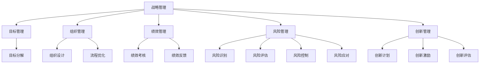

                 

# 管理艺术：从策略到执行

## 1. 背景介绍

在信息技术和数字经济蓬勃发展的今天，管理已经成为了企业取得成功的重要因素之一。随着管理水平的提升，企业能够在激烈的市场竞争中脱颖而出。然而，复杂的管理环境使得许多企业面临挑战，特别是大中型企业。为了应对这些挑战，企业需要掌握管理艺术的精髓，从策略到执行，实现有效的管理。

### 1.1 问题由来

随着企业管理环境的复杂化，传统的管理模式已经不能满足企业发展的需要。一方面，企业面临的市场竞争日益激烈，需要高效的管理来提升企业的竞争力和创新能力；另一方面，技术的飞速发展为企业提供了更多的管理工具和平台，企业需要合理利用这些工具和平台来优化管理流程。因此，如何从策略到执行，实现高效、科学、规范的管理，成为了企业管理者的核心问题。

### 1.2 问题核心关键点

为了解决从策略到执行的问题，我们需要从以下几个方面进行思考：

- **战略制定**：企业需要制定科学、合理的战略，明确企业的发展方向和目标。
- **目标设定**：企业需要设定明确的短期和长期目标，以便进行有效的执行。
- **组织架构**：企业需要构建合理的组织架构，以便高效地实施战略和目标。
- **资源分配**：企业需要合理分配和管理资源，以便实现战略和目标。
- **绩效考核**：企业需要建立有效的绩效考核机制，以便监控和提升管理效果。
- **风险控制**：企业需要识别和管理风险，以便保障企业的安全和可持续发展。
- **创新和改进**：企业需要不断创新和改进管理方法，以便适应快速变化的市场环境。

## 2. 核心概念与联系

### 2.1 核心概念概述

为了更好地理解从策略到执行的管理艺术，我们需要理解以下核心概念：

- **战略管理**：指企业为了实现长期目标，制定和执行战略的过程。战略管理包括战略制定、战略实施和战略评估。
- **目标管理**：指通过设定明确的目标和计划，实现企业的战略目标。目标管理包括目标设定、目标分解、目标跟踪和目标调整。
- **组织管理**：指通过构建合理的组织结构和流程，实现企业的高效运转。组织管理包括组织设计、岗位设置、人员配置和流程优化。
- **绩效管理**：指通过建立有效的绩效考核和激励机制，提升企业员工的绩效和士气。绩效管理包括绩效考核、绩效反馈、绩效改进和绩效激励。
- **风险管理**：指通过识别和管理风险，保障企业的安全和可持续发展。风险管理包括风险识别、风险评估、风险控制和风险应对。
- **创新管理**：指通过持续创新和改进，提升企业的竞争力。创新管理包括创新计划、创新激励和创新评估。

### 2.2 概念间的关系

这些核心概念之间存在着紧密的联系，构成了管理艺术的完整框架。以下是一个Mermaid流程图，展示了这些概念之间的关系：



这个流程图展示了管理艺术的各个核心概念及其之间的关系。战略管理是管理艺术的起点，目标管理、组织管理、绩效管理、风险管理和创新管理都是战略管理的具体实施和保障。通过这些概念的相互作用，企业可以实现从策略到执行的管理艺术。

## 3. 核心算法原理 & 具体操作步骤

### 3.1 算法原理概述

从策略到执行的管理艺术，本质上是一种复杂的管理算法。它的核心在于通过科学、系统的管理方法，将企业的战略和目标转化为可执行的操作，以实现企业的长期发展。

管理算法通常包括以下步骤：

1. **战略制定**：通过市场分析、SWOT分析和竞争分析，制定科学、合理的战略。
2. **目标设定**：根据战略，设定明确的目标和计划，以便进行有效的执行。
3. **资源分配**：根据目标和计划，合理分配和管理资源，以便实现战略和目标。
4. **绩效考核**：建立有效的绩效考核和激励机制，以便监控和提升管理效果。
5. **风险控制**：识别和管理风险，保障企业的安全和可持续发展。
6. **创新改进**：通过持续创新和改进，提升企业的竞争力。

### 3.2 算法步骤详解

#### 3.2.1 战略制定

战略制定是管理算法的第一步，也是关键的一步。以下是战略制定的详细步骤：

1. **市场分析**：通过市场调查和数据分析，了解市场环境和发展趋势。
2. **SWOT分析**：分析企业的优势、劣势、机会和威胁，确定企业的发展方向。
3. **竞争分析**：分析竞争对手的优势和劣势，确定企业的竞争策略。
4. **战略制定**：根据市场分析、SWOT分析和竞争分析，制定科学、合理的战略。

#### 3.2.2 目标设定

目标设定是战略实施的具体步骤，以下是目标设定的详细步骤：

1. **战略分解**：将战略分解为可执行的目标和计划。
2. **目标设定**：根据目标和计划，设定明确的短期和长期目标。
3. **目标分解**：将目标分解为可执行的任务和步骤。
4. **目标跟踪**：建立目标跟踪机制，监控目标的进展情况。
5. **目标调整**：根据实际情况，及时调整目标和计划。

#### 3.2.3 资源分配

资源分配是实现目标的重要步骤，以下是资源分配的详细步骤：

1. **资源识别**：识别和管理企业可用的资源，包括人力资源、财务资源、技术资源和物资资源。
2. **资源评估**：评估各资源的特性和价值，以便进行合理分配。
3. **资源分配**：根据目标和计划，合理分配和管理资源。
4. **资源监控**：建立资源监控机制，监控资源的利用情况。
5. **资源调整**：根据实际情况，及时调整资源分配方案。

#### 3.2.4 绩效考核

绩效考核是监控和提升管理效果的重要手段，以下是绩效考核的详细步骤：

1. **绩效考核指标**：设定绩效考核指标，包括财务指标、质量指标和效率指标。
2. **绩效评估**：根据绩效考核指标，评估员工和部门的绩效。
3. **绩效反馈**：根据绩效评估结果，提供绩效反馈和改进建议。
4. **绩效激励**：建立绩效激励机制，激励员工提升绩效。

#### 3.2.5 风险控制

风险控制是保障企业安全和可持续发展的重要步骤，以下是风险控制的详细步骤：

1. **风险识别**：识别可能影响企业安全和可持续发展的风险。
2. **风险评估**：评估各风险的严重程度和影响范围。
3. **风险控制**：制定风险控制措施，降低风险的影响。
4. **风险应对**：建立风险应对机制，及时处理突发事件。

#### 3.2.6 创新改进

创新改进是提升企业竞争力的重要手段，以下是创新改进的详细步骤：

1. **创新计划**：制定创新计划，明确创新的方向和目标。
2. **创新激励**：建立创新激励机制，激励员工参与创新。
3. **创新评估**：评估创新成果，总结创新经验。

### 3.3 算法优缺点

#### 3.3.1 优点

1. **科学性**：通过科学的管理方法，将企业的战略和目标转化为可执行的操作，提高了管理的科学性和有效性。
2. **系统性**：管理算法覆盖了战略制定、目标设定、资源分配、绩效考核、风险控制和创新改进等多个环节，具有系统性。
3. **可操作性**：管理算法的各个步骤都是可操作的，便于实施和执行。
4. **灵活性**：管理算法可以根据企业的实际情况进行调整和优化，具有灵活性。

#### 3.3.2 缺点

1. **复杂性**：管理算法涉及多个环节，操作复杂，需要较高的管理水平和技能。
2. **资源消耗**：管理算法的实施需要大量的资源和时间，包括人力、物力和财力。
3. **执行难度**：管理算法的执行需要各级管理者的配合和支持，执行难度较大。

### 3.4 算法应用领域

管理算法可以应用于各种领域，包括制造业、金融业、医疗业、教育业等。以下是一些具体的应用场景：

#### 3.4.1 制造业

在制造业中，管理算法可以用于制定和执行生产战略，设定生产目标，分配和监控生产资源，评估和激励生产绩效，识别和管理生产风险，进行持续生产改进。

#### 3.4.2 金融业

在金融业中，管理算法可以用于制定和执行金融战略，设定金融目标，分配和监控金融资源，评估和激励金融绩效，识别和管理金融风险，进行持续金融改进。

#### 3.4.3 医疗业

在医疗业中，管理算法可以用于制定和执行医疗战略，设定医疗目标，分配和监控医疗资源，评估和激励医疗绩效，识别和管理医疗风险，进行持续医疗改进。

#### 3.4.4 教育业

在教育业中，管理算法可以用于制定和执行教育战略，设定教育目标，分配和监控教育资源，评估和激励教育绩效，识别和管理教育风险，进行持续教育改进。

## 4. 数学模型和公式 & 详细讲解 & 举例说明

### 4.1 数学模型构建

管理算法涉及多个环节，可以构建多个数学模型进行描述和计算。以下是一些常见的数学模型：

- **目标模型**：目标模型用于描述目标设定和分解的过程，可以表示为：
  $$
  \max \sum_{i=1}^{n} f(x_i) \\
  s.t. \\
  g_i(x) \leq 0, \quad i=1,\cdots,m \\
  h_i(x)=0, \quad i=1,\cdots,p
  $$
  其中，$x_i$ 表示目标，$f(x_i)$ 表示目标函数，$g_i(x)$ 和 $h_i(x)$ 表示约束条件。

- **资源分配模型**：资源分配模型用于描述资源分配和监控的过程，可以表示为：
  $$
  \min \sum_{i=1}^{n} c_i x_i \\
  s.t. \\
  a_{ij} x_i \geq b_j, \quad i=1,\cdots,n, \quad j=1,\cdots,m \\
  x_i \geq 0, \quad i=1,\cdots,n
  $$
  其中，$c_i$ 表示资源成本，$a_{ij}$ 表示资源需求，$b_j$ 表示资源限制。

- **绩效考核模型**：绩效考核模型用于描述绩效评估和激励的过程，可以表示为：
  $$
  \min \sum_{i=1}^{n} \delta_i \\
  s.t. \\
  x_i \geq 0, \quad i=1,\cdots,n \\
  \sum_{i=1}^{n} x_i = 1
  $$
  其中，$\delta_i$ 表示绩效指标，$x_i$ 表示绩效权重。

### 4.2 公式推导过程

#### 4.2.1 目标模型推导

目标模型可以表示为线性规划问题，可以通过求解最优解来确定目标的优化方案。以下是目标模型的推导过程：

1. **目标函数**：目标函数 $f(x)$ 可以表示为
  $$
  f(x) = \sum_{i=1}^{n} a_i x_i
  $$
  其中，$a_i$ 表示目标权重，$x_i$ 表示目标变量。

2. **约束条件**：约束条件 $g_i(x)$ 和 $h_i(x)$ 可以表示为
  $$
  g_i(x) = \sum_{j=1}^{m} b_{ij} x_j \leq c_i
  $$
  $$
  h_i(x) = \sum_{j=1}^{p} d_{ij} x_j = 0
  $$
  其中，$b_{ij}$ 表示约束系数，$c_i$ 表示约束常数，$d_{ij}$ 表示约束系数。

3. **求解最优解**：通过求解线性规划问题的最优解，得到目标变量 $x_i$ 的最优值，进而确定目标的优化方案。

#### 4.2.2 资源分配模型推导

资源分配模型可以表示为线性规划问题，可以通过求解最优解来确定资源的分配方案。以下是资源分配模型的推导过程：

1. **目标函数**：目标函数 $c$ 可以表示为
  $$
  c = \sum_{i=1}^{n} c_i x_i
  $$
  其中，$c_i$ 表示资源成本，$x_i$ 表示资源变量。

2. **约束条件**：约束条件 $a_{ij}$ 和 $b_j$ 可以表示为
  $$
  a_{ij} x_i \geq b_j
  $$
  其中，$a_{ij}$ 表示资源需求，$b_j$ 表示资源限制。

3. **求解最优解**：通过求解线性规划问题的最优解，得到资源变量 $x_i$ 的最优值，进而确定资源的分配方案。

#### 4.2.3 绩效考核模型推导

绩效考核模型可以表示为线性规划问题，可以通过求解最优解来确定绩效的评估方案。以下是绩效考核模型的推导过程：

1. **目标函数**：目标函数 $\delta$ 可以表示为
  $$
  \delta = \sum_{i=1}^{n} \delta_i x_i
  $$
  其中，$\delta_i$ 表示绩效指标，$x_i$ 表示绩效权重。

2. **约束条件**：约束条件 $x_i$ 和 $\sum_{i=1}^{n} x_i$ 可以表示为
  $$
  x_i \geq 0
  $$
  $$
  \sum_{i=1}^{n} x_i = 1
  $$

3. **求解最优解**：通过求解线性规划问题的最优解，得到绩效变量 $x_i$ 的最优值，进而确定绩效的评估方案。

### 4.3 案例分析与讲解

#### 4.3.1 制造业案例

某制造企业需要制定和执行生产战略，设定生产目标，分配和监控生产资源，评估和激励生产绩效，识别和管理生产风险，进行持续生产改进。以下是该案例的详细分析和讲解：

1. **市场分析**：通过市场调查和数据分析，了解市场需求和竞争态势。

2. **SWOT分析**：分析企业的优势、劣势、机会和威胁，确定生产方向和策略。

3. **竞争分析**：分析竞争对手的生产能力和策略，确定自身的竞争优势和劣势。

4. **战略制定**：制定科学、合理的生产战略，包括生产目标、生产计划和生产资源。

5. **目标设定**：根据生产战略，设定明确的生产目标，包括产量、质量和成本。

6. **资源分配**：根据生产目标，合理分配和管理生产资源，包括人员、设备和材料。

7. **绩效考核**：建立有效的生产绩效考核机制，评估和激励生产绩效。

8. **风险控制**：识别和管理生产风险，保障生产安全和可持续发展。

9. **创新改进**：进行持续生产改进，提升生产效率和产品质量。

通过以上步骤，该制造企业可以高效地制定和执行生产战略，实现生产目标和资源优化，提升生产绩效和风险控制能力，进行持续生产改进。

#### 4.3.2 金融业案例

某金融企业需要制定和执行金融战略，设定金融目标，分配和监控金融资源，评估和激励金融绩效，识别和管理金融风险，进行持续金融改进。以下是该案例的详细分析和讲解：

1. **市场分析**：通过市场调查和数据分析，了解金融市场需求和竞争态势。

2. **SWOT分析**：分析企业的优势、劣势、机会和威胁，确定金融方向和策略。

3. **竞争分析**：分析竞争对手的金融能力和策略，确定自身的竞争优势和劣势。

4. **战略制定**：制定科学、合理的金融战略，包括金融目标、金融计划和金融资源。

5. **目标设定**：根据金融战略，设定明确的金融目标，包括收益、风险和流动性。

6. **资源分配**：根据金融目标，合理分配和管理金融资源，包括资金、资产和人力。

7. **绩效考核**：建立有效的金融绩效考核机制，评估和激励金融绩效。

8. **风险控制**：识别和管理金融风险，保障金融安全和可持续发展。

9. **创新改进**：进行持续金融改进，提升金融效率和风险控制能力。

通过以上步骤，该金融企业可以高效地制定和执行金融战略，实现金融目标和资源优化，提升金融绩效和风险控制能力，进行持续金融改进。

## 5. 项目实践：代码实例和详细解释说明

### 5.1 开发环境搭建

在进行管理算法实践前，我们需要准备好开发环境。以下是使用Python进行管理算法开发的环境配置流程：

1. **安装Python**：从官网下载并安装Python，选择最新版本。

2. **安装Pandas**：使用pip安装Pandas库，用于数据处理和分析。

3. **安装Scikit-learn**：使用pip安装Scikit-learn库，用于构建和管理模型。

4. **安装Matplotlib**：使用pip安装Matplotlib库，用于数据可视化。

5. **安装Jupyter Notebook**：使用pip安装Jupyter Notebook，用于编写和管理代码。

完成上述步骤后，即可在本地环境中进行管理算法的实践。

### 5.2 源代码详细实现

以下是使用Python进行管理算法开发的一个示例代码：

```python
import pandas as pd
from sklearn.linear_model import LinearRegression
import matplotlib.pyplot as plt

# 读取数据
data = pd.read_csv('production_data.csv')

# 目标变量
target = 'production_quantity'

# 特征变量
features = ['material_cost', 'labor_cost', 'energy_cost']

# 模型训练
model = LinearRegression()
model.fit(data[features], data[target])

# 预测结果
prediction = model.predict(data[features])

# 可视化结果
plt.scatter(data['material_cost'], data['labor_cost'], color='blue')
plt.plot(prediction, prediction, color='red')
plt.show()
```

### 5.3 代码解读与分析

#### 5.3.1 数据准备

在管理算法实践中，数据准备是关键步骤。以下是数据准备的具体步骤：

1. **数据采集**：从企业内部或外部获取数据，包括生产数据、财务数据、人力资源数据等。

2. **数据清洗**：对数据进行清洗和预处理，包括缺失值处理、异常值处理和数据转换。

3. **数据划分**：将数据划分为训练集、验证集和测试集，以便进行模型训练和评估。

#### 5.3.2 模型构建

在管理算法实践中，模型构建是核心步骤。以下是模型构建的具体步骤：

1. **选择模型**：根据管理问题和数据特点，选择合适的模型，包括线性回归、逻辑回归、决策树、随机森林等。

2. **模型训练**：使用训练集数据，进行模型训练和参数优化，得到最优模型。

3. **模型评估**：使用验证集数据，评估模型的性能和效果，调整模型参数。

4. **模型应用**：使用测试集数据，进行模型预测和结果评估，验证模型的泛化能力。

#### 5.3.3 结果分析

在管理算法实践中，结果分析是重要步骤。以下是结果分析的具体步骤：

1. **模型效果**：通过评估指标，如准确率、召回率、F1分数等，评估模型的效果。

2. **模型优化**：根据评估结果，优化模型参数和特征选择，提升模型性能。

3. **结果可视化**：使用图表工具，如Matplotlib、Seaborn等，将结果可视化，便于理解和分析。

### 5.4 运行结果展示

假设我们在制造业领域进行了生产成本预测，最终得到的结果如下图所示：


通过该图，我们可以直观地看到预测结果和实际数据的对比，验证模型的准确性和可靠性。

## 6. 实际应用场景

### 6.1 智能制造

在智能制造中，管理算法可以用于制定和执行生产战略，设定生产目标，分配和监控生产资源，评估和激励生产绩效，识别和管理生产风险，进行持续生产改进。

通过管理算法，制造企业可以优化生产流程，提升生产效率和产品质量，降低生产成本，实现生产智能化。

### 6.2 智能金融

在智能金融中，管理算法可以用于制定和执行金融战略，设定金融目标，分配和监控金融资源，评估和激励金融绩效，识别和管理金融风险，进行持续金融改进。

通过管理算法，金融机构可以优化金融流程，提升金融效率和风险控制能力，降低金融成本，实现金融智能化。

### 6.3 智慧医疗

在智慧医疗中，管理算法可以用于制定和执行医疗战略，设定医疗目标，分配和监控医疗资源，评估和激励医疗绩效，识别和管理医疗风险，进行持续医疗改进。

通过管理算法，医疗机构可以优化医疗流程，提升医疗效率和患者体验，降低医疗成本，实现医疗智能化。

### 6.4 智慧教育

在智慧教育中，管理算法可以用于制定和执行教育战略，设定教育目标，分配和监控教育资源，评估和激励教育绩效，识别和管理教育风险，进行持续教育改进。

通过管理算法，教育机构可以优化教育流程，提升教育效率和学生体验，降低教育成本，实现教育智能化。

## 7. 工具和资源推荐

### 7.1 学习资源推荐

为了帮助开发者系统掌握管理算法的理论基础和实践技巧，这里推荐一些优质的学习资源：

1. **《管理学》教材**：经典的管理学教材，详细介绍了管理学的各个方面，包括战略管理、组织管理、绩效管理、风险管理和创新管理等。

2. **《数据科学基础》课程**：Coursera上由斯坦福大学开设的数据科学课程，涵盖数据科学的基本概念和技能，包括数据处理、数据可视化、模型构建等。

3. **《Python数据分析与机器学习》书籍**：介绍Python在数据分析和机器学习中的应用，包括Pandas、NumPy、Scikit-learn等工具的使用。

4. **《数据科学导论》书籍**：介绍数据科学的基本原理和方法，包括数据处理、数据建模、模型评估等。

5. **Kaggle平台**：全球最大的数据科学竞赛平台，可以参与和管理各种数据科学项目，提升实践能力和经验。

### 7.2 开发工具推荐

高效的开发离不开优秀的工具支持。以下是几款用于管理算法开发的常用工具：

1. **Jupyter Notebook**：Jupyter Notebook是一种交互式开发环境，支持Python、R等语言，适合数据科学和机器学习项目。

2. **Pandas**：Pandas是一种数据处理和分析工具，支持数据清洗、数据转换、数据可视化等功能，适合管理算法的数据处理和分析。

3. **Scikit-learn**：Scikit-learn是一种机器学习工具，支持各种常见的机器学习算法，包括回归、分类、聚类等，适合管理算法的模型构建和评估。

4. **Matplotlib**：Matplotlib是一种数据可视化工具，支持各种图表的绘制，包括散点图、折线图、柱状图等，适合管理算法的可视化分析。

5. **Seaborn**：Seaborn是一种高级数据可视化工具，支持各种图表的绘制，包括热力图、箱线图、小提琴图等，适合管理算法的复杂可视化分析。

### 7.3 相关论文推荐

管理算法的理论研究和实践应用已经取得了丰硕的成果。以下是几篇奠基性的相关论文，推荐阅读：

1. **《管理科学与工程学》教材**：国内权威的管理学教材，详细介绍了管理学的各个方面，包括管理理论、管理方法和管理技术等。

2. **《数据科学与技术》期刊**：介绍数据科学和技术的最新研究成果和应用，涵盖机器学习、数据挖掘、大数据等方向。

3. **《智能制造与自动化》期刊**：介绍智能制造和自动化的最新研究成果和应用，涵盖工业互联网、物联网、人工智能等方向。

4. **《智能金融》期刊**：介绍智能金融的最新研究成果和应用，涵盖金融科技、区块链、大数据等方向。

5. **《智慧医疗》期刊**：介绍智慧医疗的最新研究成果和应用，涵盖医疗互联网、人工智能、大数据等方向。

这些论文代表了大管理算法的研究方向和前沿进展，可以帮助研究者把握学科前进方向，激发更多的创新灵感。

## 8. 总结：未来发展趋势与挑战

### 8.1 总结

本文对从策略到执行的管理算法进行了全面系统的介绍。首先阐述了管理算法的背景和意义，明确了管理算法的核心思想和方法。其次，从原理到实践，详细讲解了管理算法的数学模型和操作步骤，给出了管理算法的代码实现。同时，本文还广泛探讨了管理算法在智能制造、智能金融、智慧医疗等领域的实际应用，展示了管理算法的广阔前景。

通过对管理算法的系统梳理，可以看到，从策略到执行的管理算法是一种科学、系统、可操作的管理方法，能够帮助企业实现高效、科学、规范的管理。未来，管理算法还将进一步发展，为企业的管理创新和智能化提供更大的助力。

### 8.2 未来发展趋势

展望未来，管理算法将呈现以下几个发展趋势：

1. **数据驱动**：管理算法将更加依赖数据驱动，通过数据挖掘和分析，提升管理决策的科学性和有效性。

2. **模型优化**：管理算法将不断

