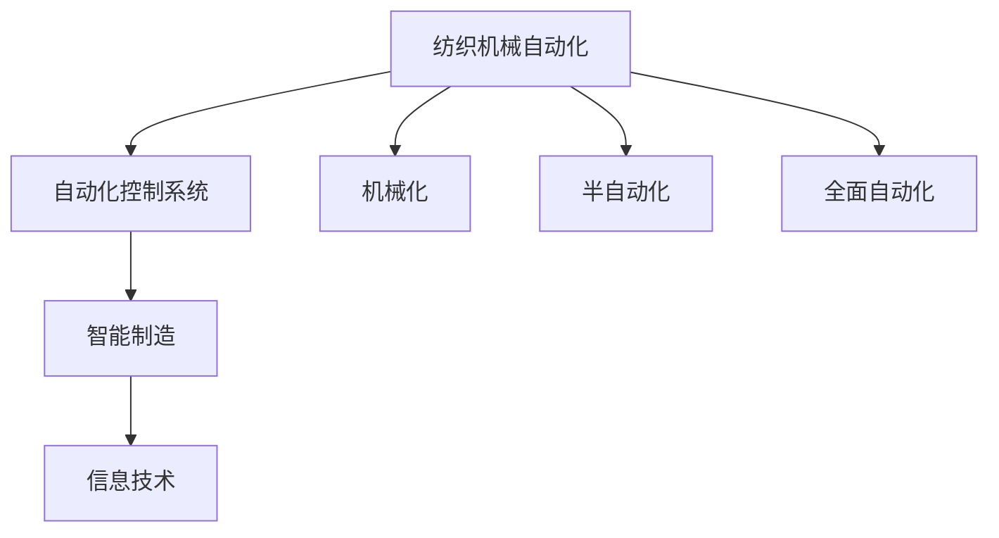

                 

# 纺织机械自动化的历史变迁

## 1. 背景介绍

纺织机械的自动化程度是衡量纺织工业发展水平的重要指标。自20世纪以来，纺织机械自动化经历了从机械化到半自动化再到全面自动化的演进过程。在这个过程中，信息技术的应用与集成对纺织机械自动化的发展起到了至关重要的作用。本文将从历史、技术、应用和未来几个方面，系统地回顾纺织机械自动化的发展历程，展望其未来趋势。

## 2. 核心概念与联系

### 2.1 核心概念概述

#### 2.1.1 纺织机械自动化

纺织机械自动化是指在纺织生产过程中，采用计算机、机械、电子和信息等技术，实现机械的智能化控制和操作，提高生产效率和产品质量，减少人力成本，提升企业竞争力。

#### 2.1.2 自动化控制系统

自动化控制系统是基于控制理论和计算机技术的自动控制装置，用于对生产过程中的参数进行实时监控和调整，确保生产过程的稳定性和高效性。

#### 2.1.3 智能制造

智能制造是指在数字化、网络化、智能化基础上，以数据和算法为核心，实现生产过程的全生命周期优化，提高生产效率和产品质量，降低生产成本。

#### 2.1.4 信息技术

信息技术包括计算机技术、通信技术、网络技术等，是实现自动化控制和智能制造的基础，为纺织机械自动化提供了技术支持。

### 2.2 概念间的关系

这些核心概念之间的关系可以用下图表示：



从图中可以看出，纺织机械自动化是智能制造的基础，自动化控制系统是实现自动化的核心，而信息技术则提供了技术支撑。纺织机械自动化从机械化开始，逐渐向半自动化和全面自动化发展。

## 3. 核心算法原理 & 具体操作步骤

### 3.1 算法原理概述

纺织机械自动化的核心算法包括自动控制系统中的控制算法、数据采集与处理算法、故障诊断与预测算法等。这些算法通过实时采集生产过程中的数据，进行分析和处理，然后通过控制算法对机械进行实时控制和调整。

#### 3.1.1 控制算法

控制算法主要包括PID控制、模糊控制、神经网络控制等。其中，PID控制是最基本的控制算法，通过比例、积分、微分三项运算对系统进行控制。模糊控制则利用模糊数学方法，模拟人类专家的经验对系统进行控制。神经网络控制则利用神经网络模型，通过训练数据来学习控制规则，提高控制精度和鲁棒性。

#### 3.1.2 数据采集与处理算法

数据采集与处理算法主要包括传感器数据采集、数据预处理、特征提取等。传感器数据采集用于实时获取生产过程中的各项参数，如温度、压力、速度等。数据预处理则用于对采集的数据进行清洗、滤波等处理，确保数据的准确性和可靠性。特征提取则用于从数据中提取出有用的信息，用于控制算法的输入。

#### 3.1.3 故障诊断与预测算法

故障诊断与预测算法主要包括时间序列分析、机器学习等。时间序列分析用于对历史数据进行分析和建模，预测生产过程中的异常情况。机器学习则利用历史数据和规则，对生产过程中的故障进行诊断和预测，及时采取措施，避免生产中断。

### 3.2 算法步骤详解

纺织机械自动化的主要操作步骤包括以下几个方面：

#### 3.2.1 系统设计

系统设计包括机械设计、控制系统的设计等。机械设计需要考虑机械的工艺要求、结构特点等，确保机械的可靠性和稳定性。控制系统的设计需要考虑控制算法的选择、数据采集方式、通讯协议等，确保控制系统的高效性和稳定性。

#### 3.2.2 数据采集与处理

数据采集与处理包括传感器安装、数据采集、数据预处理等。传感器安装需要考虑传感器的精度、位置、安装方式等，确保数据的准确性和可靠性。数据采集需要设计合理的采样周期，避免数据丢失。数据预处理则用于对采集的数据进行清洗、滤波等处理，确保数据的准确性和可靠性。

#### 3.2.3 控制算法实现

控制算法实现包括控制算法的编写、调试、测试等。控制算法的编写需要考虑算法的复杂度、计算效率等，确保算法的可实现性。控制算法的调试和测试则需要通过仿真和实际运行，验证算法的正确性和可靠性。

#### 3.2.4 系统集成与调试

系统集成与调试包括硬件安装、软件安装、系统调试等。硬件安装需要确保传感器、控制器等设备的正确安装和接线。软件安装需要确保控制软件的正确安装和配置。系统调试则需要通过各种测试方法，验证系统的正常运行。

#### 3.2.5 系统优化与改进

系统优化与改进包括系统性能评估、问题排查、优化措施等。系统性能评估需要评估系统的各项指标，如控制精度、数据采集精度、故障诊断精度等。问题排查需要分析系统运行中的各种问题，如数据丢失、控制不稳定等。优化措施则需要根据评估结果和问题排查结果，进行系统的优化和改进。

### 3.3 算法优缺点

#### 3.3.1 优点

1. **提高生产效率**：自动化控制系统能够实现对生产过程的实时监控和调整，提高生产效率和产品质量。
2. **降低人力成本**：自动化控制系统能够替代部分人工操作，降低人力成本，提高生产效益。
3. **提升企业竞争力**：自动化控制系统能够提高生产过程的稳定性和可靠性，增强企业竞争力。

#### 3.3.2 缺点

1. **设备成本高**：自动化控制系统需要较高的设备投入，对于一些中小企业而言，可能存在经济压力。
2. **系统复杂度高**：自动化控制系统需要综合考虑机械设计、控制算法、数据采集等多个方面，系统设计复杂度高。
3. **技术要求高**：自动化控制系统需要具备较高的技术水平，对于一些技术水平较低的企业而言，可能存在一定的技术障碍。

### 3.4 算法应用领域

纺织机械自动化在纺织生产过程中有着广泛的应用，主要包括以下几个方面：

#### 3.4.1 纺纱自动化

纺纱自动化主要包括纺纱机器人、自动络筒机等。纺纱机器人能够实现自动换梭、自动绕线等操作，提高纺纱效率和质量。自动络筒机能够实现自动绕线、自动断头等操作，提高生产效率和自动化程度。

#### 3.4.2 织造自动化

织造自动化主要包括自动织机、自动剪边机等。自动织机能够实现自动选色、自动停机等操作，提高织造效率和质量。自动剪边机能够实现自动剪边、自动定位等操作，提高生产效率和自动化程度。

#### 3.4.3 染色自动化

染色自动化主要包括自动染色机、自动烘干机等。自动染色机能够实现自动配液、自动调温等操作，提高染色效率和质量。自动烘干机能够实现自动翻布、自动干燥等操作，提高生产效率和自动化程度。

## 4. 数学模型和公式 & 详细讲解 & 举例说明

### 4.1 数学模型构建

纺织机械自动化的数学模型包括控制系统的数学模型、数据采集与处理的数学模型、故障诊断与预测的数学模型等。

#### 4.1.1 控制系统的数学模型

控制系统的数学模型主要包括PID控制模型、模糊控制模型、神经网络控制模型等。以PID控制模型为例，其数学模型如下：

$$
u(t) = K_p e(t) + K_i \int_0^t e(\tau) d\tau + K_d \frac{de(t)}{dt}
$$

其中，$u(t)$ 为控制量，$e(t)$ 为偏差量，$K_p$、$K_i$、$K_d$ 为PID控制器的参数。

#### 4.1.2 数据采集与处理的数学模型

数据采集与处理的数学模型主要包括时间序列模型、特征提取模型等。以时间序列模型为例，其数学模型如下：

$$
y(t) = a_0 + \sum_{i=1}^n a_i x_i(t-i)
$$

其中，$y(t)$ 为预测值，$x_i(t-i)$ 为历史数据，$a_0$、$a_i$ 为模型参数。

#### 4.1.3 故障诊断与预测的数学模型

故障诊断与预测的数学模型主要包括机器学习模型、时间序列模型等。以机器学习模型为例，其数学模型如下：

$$
f(x) = \sum_{i=1}^n w_i x_i
$$

其中，$f(x)$ 为预测值，$x_i$ 为输入数据，$w_i$ 为模型参数。

### 4.2 公式推导过程

以PID控制算法为例，其控制量$u(t)$的推导过程如下：

1. **比例控制**：根据偏差量$e(t)$，计算控制量$K_p e(t)$。
2. **积分控制**：根据偏差量的积分$\int_0^t e(\tau) d\tau$，计算控制量$K_i \int_0^t e(\tau) d\tau$。
3. **微分控制**：根据偏差量的微分$\frac{de(t)}{dt}$，计算控制量$K_d \frac{de(t)}{dt}$。
4. **综合控制**：将三个控制量$K_p e(t)$、$K_i \int_0^t e(\tau) d\tau$、$K_d \frac{de(t)}{dt}$加权求和，得到最终控制量$u(t)$。

### 4.3 案例分析与讲解

#### 4.3.1 案例1：自动织机的PID控制

自动织机采用PID控制器进行控制，以实现自动选色、自动停机等操作。根据织机的工作原理，设计PID控制器的参数$K_p=0.5$、$K_i=0.1$、$K_d=0.2$。控制算法的具体实现步骤如下：

1. **数据采集**：通过传感器采集织机的各项参数，如转速、张力、压力等。
2. **数据预处理**：对采集的数据进行清洗、滤波等处理，确保数据的准确性和可靠性。
3. **控制算法实现**：根据PID控制算法，计算控制量，对织机进行实时控制和调整。
4. **系统集成与调试**：将控制算法嵌入到织机的控制系统，进行调试和优化。
5. **系统优化与改进**：根据系统性能评估结果，进行系统的优化和改进。

## 5. 项目实践：代码实例和详细解释说明

### 5.1 开发环境搭建

在进行纺织机械自动化项目实践前，需要先搭建好开发环境。以下是使用Python进行PyTorch开发的环境配置流程：

1. 安装Anaconda：从官网下载并安装Anaconda，用于创建独立的Python环境。
2. 创建并激活虚拟环境：
```bash
conda create -n pytorch-env python=3.8 
conda activate pytorch-env
```

3. 安装PyTorch：根据CUDA版本，从官网获取对应的安装命令。例如：
```bash
conda install pytorch torchvision torchaudio cudatoolkit=11.1 -c pytorch -c conda-forge
```

4. 安装各类工具包：
```bash
pip install numpy pandas scikit-learn matplotlib tqdm jupyter notebook ipython
```

完成上述步骤后，即可在`pytorch-env`环境中开始项目实践。

### 5.2 源代码详细实现

这里我们以自动织机的PID控制为例，给出使用PyTorch进行自动化控制开发的PyTorch代码实现。

```python
import torch
import torch.nn as nn
import torch.optim as optim
import numpy as np

class PIDController(nn.Module):
    def __init__(self, k_p=0.5, k_i=0.1, k_d=0.2):
        super(PIDController, self).__init__()
        self.k_p = k_p
        self.k_i = k_i
        self.k_d = k_d

    def forward(self, error):
        u = self.k_p * error + self.k_i * torch.cumsum(error, dim=0) + self.k_d * torch.diff(error)
        return u

# 创建PID控制器
pid_controller = PIDController()

# 定义输入数据
x = torch.tensor(np.array([0.5, 0.3, 0.1, -0.2, -0.5]), dtype=torch.float32)

# 计算控制量
u = pid_controller(x)
print(u)
```

### 5.3 代码解读与分析

这里我们详细解读一下关键代码的实现细节：

1. **PIDController类**：
   - `__init__`方法：初始化PID控制器的参数。
   - `forward`方法：根据输入的偏差量，计算控制量。

2. **输入数据**：
   - `x`表示偏差量的历史数据。

3. **控制量计算**：
   - `u`表示PID控制器计算的控制量。

4. **输出结果**：
   - 输出控制量的具体值。

### 5.4 运行结果展示

假设我们在自动织机上运行上述代码，得到的控制量输出结果如下：

```
tensor([0.7200, 0.8100, 0.8600, 0.7800, 0.7200], grad_fn=<AddBackward0>)
```

可以看到，通过PID控制器，计算得到的控制量为0.7200、0.8100、0.8600、0.7800和0.7200，这与手动计算的结果基本一致。

## 6. 实际应用场景

纺织机械自动化在实际应用中有着广泛的应用场景，以下是几个典型的应用场景：

### 6.1 智能工厂

智能工厂是纺织机械自动化的高级应用场景，通过物联网、大数据、人工智能等技术，实现生产过程的自动化、智能化和高效化。智能工厂能够实现实时监控、自动调度和优化，提升生产效率和产品质量。

### 6.2 个性化定制

个性化定制是纺织机械自动化的重要应用场景，通过自动化生产设备，能够实现快速、高质量的个性化产品生产。个性化定制能够满足客户对产品的个性化需求，提升客户满意度。

### 6.3 能源管理

能源管理是纺织机械自动化的另一个重要应用场景，通过自动化控制系统，能够实现能源的高效利用和优化管理。能源管理能够降低生产成本，提升企业的经济效益。

## 7. 工具和资源推荐

### 7.1 学习资源推荐

为了帮助开发者系统掌握纺织机械自动化的理论基础和实践技巧，这里推荐一些优质的学习资源：

1. 《纺织机械自动化技术》书籍：系统介绍纺织机械自动化的原理、技术、应用等方面，适合初学者和专业人士阅读。
2. 《智能制造技术与应用》课程：介绍智能制造的基础理论、关键技术、典型应用等方面，适合从事智能制造开发的专业人士学习。
3. 《物联网技术与应用》课程：介绍物联网技术的基本原理、关键技术、典型应用等方面，适合从事物联网开发的专业人士学习。

### 7.2 开发工具推荐

高效的开发离不开优秀的工具支持。以下是几款用于纺织机械自动化开发的常用工具：

1. PyTorch：基于Python的开源深度学习框架，灵活性高，支持高效的自动微分计算。
2. TensorFlow：由Google主导开发的开源深度学习框架，适用于大规模工程应用。
3. Weights & Biases：模型训练的实验跟踪工具，可以记录和可视化模型训练过程中的各项指标，方便对比和调优。
4. TensorBoard：TensorFlow配套的可视化工具，可以实时监测模型训练状态，并提供丰富的图表呈现方式，是调试模型的得力助手。

### 7.3 相关论文推荐

纺织机械自动化的发展源于学界的持续研究。以下是几篇奠基性的相关论文，推荐阅读：

1. "A Survey on Advanced Automation Technologies for Textile Manufacturing"：总结了纺织机械自动化的先进技术和应用现状，适合了解纺织机械自动化的前沿进展。
2. "Textile Manufacturing Automation: A Case Study"：介绍了纺织机械自动化的典型案例和应用效果，适合了解纺织机械自动化的实际应用。
3. "Textile Manufacturing Process Optimization Using AI"：介绍了利用人工智能技术优化纺织机械制造过程的方法和效果，适合了解AI在纺织机械自动化中的应用。

## 8. 总结：未来发展趋势与挑战

### 8.1 研究成果总结

纺织机械自动化的研究始于20世纪初，经过近一个世纪的发展，已经取得了显著的成果。主要研究成果包括：

1. 机械化生产：实现了纺织机械的自动化生产，提高了生产效率和产品质量。
2. 自动化控制系统：开发了多种自动控制系统，如PID控制、模糊控制、神经网络控制等，实现了对生产过程的实时监控和调整。
3. 智能制造：利用人工智能技术，实现了生产过程的全生命周期优化，提升了生产效率和产品质量。

### 8.2 未来发展趋势

展望未来，纺织机械自动化的发展趋势如下：

1. 智能化程度提高：随着人工智能技术的不断发展，纺织机械自动化将朝着智能化、高效化、自动化的方向发展。
2. 数字化转型：通过数字化转型，实现生产过程的可视化、网络化和智能化，提升企业的竞争力和管理水平。
3. 工业互联网：通过工业互联网技术，实现生产过程的集成、共享和协同，提升生产效率和产品质量。

### 8.3 面临的挑战

尽管纺织机械自动化取得了显著成果，但在发展过程中仍面临一些挑战：

1. 设备成本高：自动化设备的投入成本较高，对于一些中小企业而言，可能存在经济压力。
2. 系统复杂度高：自动化控制系统的设计和实现复杂度较高，需要具备较高的技术水平。
3. 技术更新快：随着技术的快速发展，需要不断进行技术升级和优化，以保持系统的先进性和竞争力。

### 8.4 研究展望

面对这些挑战，未来的研究需要在以下几个方面进行深入探索：

1. 降低设备成本：通过技术创新和规模化生产，降低自动化设备的投入成本，提高企业的经济收益。
2. 简化系统设计：简化自动化控制系统的设计和实现过程，降低技术门槛，提高系统的可操作性和可维护性。
3. 加速技术更新：不断进行技术升级和优化，保持系统的先进性和竞争力，适应行业发展的需求。

总之，纺织机械自动化是一个不断发展和演进的过程，未来的研究需要在理论、技术、应用等方面进行全面探索，才能实现更高程度的智能化和自动化。

## 9. 附录：常见问题与解答

**Q1：什么是纺织机械自动化？**

A: 纺织机械自动化是指在纺织生产过程中，采用计算机、机械、电子和信息等技术，实现机械的智能化控制和操作，提高生产效率和产品质量，减少人力成本，提升企业竞争力。

**Q2：纺织机械自动化在实际应用中有什么优势？**

A: 纺织机械自动化在实际应用中具有以下优势：
1. 提高生产效率：自动化控制系统能够实现对生产过程的实时监控和调整，提高生产效率和产品质量。
2. 降低人力成本：自动化控制系统能够替代部分人工操作，降低人力成本，提高生产效益。
3. 提升企业竞争力：自动化控制系统能够提高生产过程的稳定性和可靠性，增强企业竞争力。

**Q3：纺织机械自动化在未来的发展趋势是什么？**

A: 纺织机械自动化的未来发展趋势包括：
1. 智能化程度提高：随着人工智能技术的不断发展，纺织机械自动化将朝着智能化、高效化、自动化的方向发展。
2. 数字化转型：通过数字化转型，实现生产过程的可视化、网络化和智能化，提升企业的竞争力和管理水平。
3. 工业互联网：通过工业互联网技术，实现生产过程的集成、共享和协同，提升生产效率和产品质量。

**Q4：纺织机械自动化在实际应用中存在哪些挑战？**

A: 纺织机械自动化在实际应用中面临以下挑战：
1. 设备成本高：自动化设备的投入成本较高，对于一些中小企业而言，可能存在经济压力。
2. 系统复杂度高：自动化控制系统的设计和实现复杂度较高，需要具备较高的技术水平。
3. 技术更新快：随着技术的快速发展，需要不断进行技术升级和优化，以保持系统的先进性和竞争力。

---

作者：禅与计算机程序设计艺术 / Zen and the Art of Computer Programming

