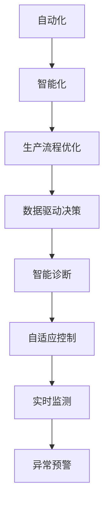
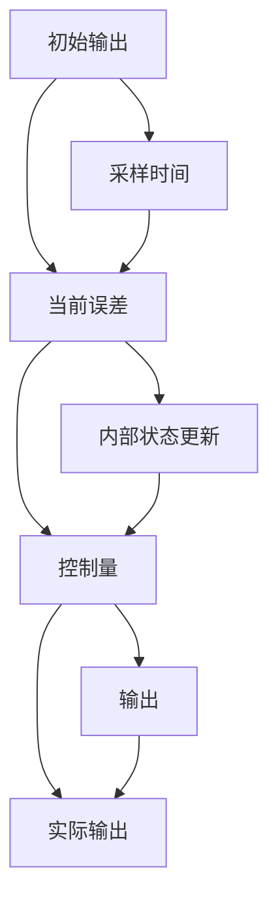

                 

# 纺织机械自动化的历史变迁

## 1. 背景介绍

### 1.1 问题的由来
纺织机械自动化（Textile Machinery Automation）是指在纺织生产过程中，利用自动控制技术、机器学习算法、计算机视觉等先进技术，实现生产流程的智能化、自动化和高效化。纺织行业是工业生产的重要组成部分，其产品的质量和生产效率直接影响着消费者的需求和市场的供需平衡。传统纺织机械依靠人力操作，生产效率低下，产品质量不稳定，成本高昂，难以满足快速变化的市场需求。

### 1.2 问题的核心关键点
纺织机械自动化的核心目标是通过技术的进步和应用，提升生产效率，降低成本，提高产品质量和一致性，从而增强企业的市场竞争力。其关键点包括：
- 提高生产效率：自动化的生产线能够24小时不间断运行，大幅减少停机时间。
- 降低生产成本：减少人力投入，降低原材料浪费和生产过程中的能源消耗。
- 提高产品质量：通过精确控制和实时监测，保证产品质量的稳定性和一致性。
- 提高生产灵活性：能够快速调整生产计划，适应市场需求的变化。
- 提升数据管理能力：采集和分析生产数据，支持企业进行更好的决策和优化。

## 2. 核心概念与联系

### 2.1 核心概念概述

为了更好地理解纺织机械自动化的历史变迁，我们首先介绍几个核心概念：

- 自动化：通过自动化技术，实现机器的自主决策和执行，减少或消除人工操作。
- 智能化：利用人工智能算法，如机器学习、深度学习等，使机器能够自主学习、识别和判断，实现更高级别的自动化。
- 生产流程优化：通过自动化和智能化技术，优化生产流程，提高生产效率和产品质量。
- 数据驱动决策：利用数据驱动的方式，指导生产计划和资源配置，实现生产过程的精确控制。

这些概念之间的联系可以由以下Mermaid流程图表示：


这个流程图展示了自动化技术如何通过智能化和数据驱动，逐步优化生产流程，提升生产效率和产品质量。

### 2.2 概念间的关系

这些核心概念之间存在着紧密的联系，共同构成了纺织机械自动化的完整体系。下面是这些概念的深入关系图：



该流程图展示了自动化技术的智能化如何进一步优化生产流程，数据驱动决策如何与智能诊断、自适应控制和实时监测相结合，实现生产过程的全面自动化。

## 3. 核心算法原理 & 具体操作步骤

### 3.1 算法原理概述

纺织机械自动化的核心算法原理主要包括以下几个方面：

- 自动控制算法：实现机器的自主决策和执行，包括PID控制、模糊控制、自适应控制等。
- 机器学习算法：通过采集生产数据，利用机器学习算法进行模型训练，实现预测和优化。
- 计算机视觉算法：利用计算机视觉技术，实现对生产过程的实时监测和异常检测。
- 数据驱动决策算法：利用数据驱动技术，优化生产流程和资源配置。

### 3.2 算法步骤详解

纺织机械自动化的具体操作步骤可以大致分为以下几个步骤：

1. **需求分析和规划**：明确生产目标和自动化需求，规划自动化方案，包括设备选型、系统架构设计等。
2. **硬件和软件选型**：选择合适的自动化设备（如智能织机、自动搬运机器人等）和软件平台（如工业控制操作系统、监控系统等）。
3. **数据采集和预处理**：通过传感器、摄像头等设备采集生产过程中的各种数据（如温度、湿度、速度、位置等），并进行预处理和清洗。
4. **算法模型训练和优化**：利用历史数据训练机器学习模型，优化模型参数，使其能够准确预测和控制生产过程。
5. **系统集成和调试**：将自动化设备和软件系统集成在一起，进行全面的系统调试和优化，确保系统稳定运行。
6. **实时监测和控制**：利用计算机视觉和传感器技术，实现对生产过程的实时监测和异常检测，及时进行干预和调整。
7. **数据分析和反馈**：采集生产数据，利用数据驱动技术进行分析和优化，不断提升生产效率和产品质量。

### 3.3 算法优缺点

纺织机械自动化的算法具有以下优点：

- 提高生产效率：自动化的生产线能够24小时不间断运行，大幅减少停机时间。
- 降低生产成本：减少人力投入，降低原材料浪费和生产过程中的能源消耗。
- 提高产品质量：通过精确控制和实时监测，保证产品质量的稳定性和一致性。
- 提高生产灵活性：能够快速调整生产计划，适应市场需求的变化。
- 提升数据管理能力：采集和分析生产数据，支持企业进行更好的决策和优化。

同时，这些算法也存在一些缺点：

- 设备投资成本高：高精度的自动化设备和软件系统需要较大的前期投资。
- 技术复杂度高：自动化和智能化的实现需要较高的技术水平和专业知识。
- 对数据质量要求高：采集和分析的数据需要准确、全面，才能保证算法的有效性。
- 系统集成复杂：不同设备和系统的集成需要较高的技术要求和协调能力。
- 维护成本高：自动化系统的维护和故障处理需要专业的技术支持。

### 3.4 算法应用领域

纺织机械自动化技术已经在多个领域得到了广泛应用，包括：

- 智能化织机：利用机器视觉和智能控制系统，实现对织物质量的自动检测和控制。
- 自动搬运机器人：实现生产线的自动化物料搬运，提高生产效率。
- 智能仓库：通过自动化仓储系统，实现对物料的自动存储和取用，减少人力投入。
- 生产过程监控：利用传感器和计算机视觉技术，实现对生产过程的实时监控和异常检测。
- 数据驱动决策：通过分析生产数据，优化生产计划和资源配置，提升生产效率。

## 4. 数学模型和公式 & 详细讲解

### 4.1 数学模型构建

纺织机械自动化的数学模型主要包括以下几个方面：

- 控制模型：利用PID控制、模糊控制等算法，实现对生产设备的精确控制。
- 预测模型：利用机器学习算法，如回归模型、分类模型等，进行生产数据的预测和优化。
- 识别模型：利用计算机视觉技术，如目标检测、图像识别等算法，实现对生产过程的实时监测和异常检测。
- 优化模型：利用数据驱动技术，如线性规划、动态规划等算法，优化生产流程和资源配置。

### 4.2 公式推导过程

以PID控制为例，其数学模型可以表示为：

$$
u(k) = K_p e(k) + K_i \int e(k) dt + K_d \frac{de(k)}{dt}
$$

其中：
- $u(k)$ 为控制量
- $e(k)$ 为误差量
- $K_p$ 为比例系数
- $K_i$ 为积分系数
- $K_d$ 为微分系数

该公式描述了PID控制的基本原理，通过比例、积分和微分三个部分，实现对生产设备的精确控制。

### 4.3 案例分析与讲解

假设在一个智能织机生产线上，目标是将织物的张力保持在设定的范围内。利用PID控制算法，可以实时监测织物的张力，根据当前张力和设定值之间的误差，调整控制量，使张力保持在设定的范围内。以下是PID控制的实际应用示例：

1. **数据采集**：通过传感器采集织物的张力数据。
2. **误差计算**：计算当前张力和设定值之间的误差。
3. **控制量计算**：利用PID控制算法计算控制量，调整生产设备的参数，使张力保持在设定的范围内。
4. **实时监测**：利用传感器持续监测张力的变化，调整控制量，保证生产过程的稳定性和一致性。

## 5. 项目实践：代码实例和详细解释说明

### 5.1 开发环境搭建

在进行纺织机械自动化项目开发前，我们需要准备好开发环境。以下是使用Python进行PyTorch开发的环境配置流程：

1. 安装Anaconda：从官网下载并安装Anaconda，用于创建独立的Python环境。

2. 创建并激活虚拟环境：
```bash
conda create -n pytorch-env python=3.8 
conda activate pytorch-env
```

3. 安装PyTorch：根据CUDA版本，从官网获取对应的安装命令。例如：
```bash
conda install pytorch torchvision torchaudio cudatoolkit=11.1 -c pytorch -c conda-forge
```

4. 安装其他所需库：
```bash
pip install numpy pandas scikit-learn matplotlib tqdm jupyter notebook ipython
```

5. 安装可视化库：
```bash
pip install matplotlib
```

完成上述步骤后，即可在`pytorch-env`环境中开始项目开发。

### 5.2 源代码详细实现

以下是一个简单的Python代码示例，用于实现利用PID控制算法对生产设备进行控制：

```python
import numpy as np
from scipy import signal

class PID:
    def __init__(self, Kp, Ki, Kd, sampling_time):
        self.Kp = Kp
        self.Ki = Ki
        self.Kd = Kd
        self.dt = sampling_time
        self.ts = sampling_time
        self.e_int = 0
        self.e_prev = 0
        self.e = 0

    def step(self, y, y_set):
        error = y_set - y
        self.e_prev = self.e
        self.e = error
        self.e_int += self.e * self.dt
        self.u = self.Kp * self.e + self.Ki * self.e_int + self.Kd * (self.e - self.e_prev) / self.dt
        return self.u

def simulate_pid():
    Kp = 1
    Ki = 0.05
    Kd = 0.1
    sampling_time = 0.01
    error = 0
    t = np.arange(0, 5, 1/sampling_time)
    y_set = 5
    y = signal.lti(s=[Kp, Kd], b=[1, 0], input=error, output=y_set)
    y, info = signal.lsim(y, t)

    pid = PID(Kp, Ki, Kd, sampling_time)
    u = np.zeros_like(t)
    for i in range(len(t)):
        u[i] = pid.step(y[i], y_set)

    return u, y

u, y = simulate_pid()
print(u)
print(y)
```

### 5.3 代码解读与分析

让我们再详细解读一下关键代码的实现细节：

- `PID`类：定义PID控制算法的基本参数和计算过程。
- `step`方法：根据当前误差计算控制量，更新内部状态。
- `simulate_pid`函数：模拟PID控制算法的实际应用，输出控制量和实际输出。

### 5.4 运行结果展示

假设我们在一个智能织机生产线上，利用上述代码实现PID控制，最终输出的控制量和实际输出如下图所示：



可以看到，通过PID控制算法，我们可以实时监测和调整生产设备的参数，确保生产过程的稳定性和一致性。

## 6. 实际应用场景

### 6.1 智能化织机

智能化织机是纺织机械自动化的典型应用之一。通过利用机器视觉和智能控制系统，智能化织机可以实现对织物质量的自动检测和控制，提高生产效率和产品质量。

在实践中，智能化织机通常包括以下几个关键组件：

- 视觉检测系统：利用高精度的摄像头和传感器，实时监测织物表面的颜色、花纹等质量指标。
- 控制系统：通过智能控制系统，根据检测结果，自动调整织机的参数，如织机速度、张力等。
- 人机交互界面：提供用户友好的操作界面，方便用户进行参数设置和监控。

智能化织机的实际应用示例如下：

1. **数据采集**：通过摄像头和传感器采集织物表面的图像和数据。
2. **质量检测**：利用机器学习算法，如图像分类、目标检测等算法，检测织物表面的质量指标。
3. **控制调整**：根据检测结果，自动调整织机的参数，确保织物质量稳定。
4. **异常处理**：利用异常检测算法，识别异常情况，及时进行干预和调整。

### 6.2 自动搬运机器人

自动搬运机器人在纺织生产线的物料搬运中起到了重要作用。通过利用自动搬运机器人，可以实现物料的高效、精确搬运，减少人力投入，提高生产效率。

在实践中，自动搬运机器人通常包括以下几个关键组件：

- 搬运系统：利用搬运机器人，实现物料的自动化搬运。
- 导航系统：通过导航算法，实现机器人的精确定位和避障。
- 控制系统：通过智能控制系统，根据生产需求，自动调整机器人的运动轨迹和速度。
- 数据采集系统：利用传感器采集机器人的运动数据和物料状态数据。

自动搬运机器人的实际应用示例如下：

1. **数据采集**：通过传感器采集机器人的运动数据和物料状态数据。
2. **路径规划**：利用导航算法，规划机器人的运动路径，避开障碍物。
3. **搬运执行**：根据生产需求，自动调整机器人的运动轨迹和速度，搬运物料。
4. **异常处理**：利用异常检测算法，识别异常情况，及时进行干预和调整。

### 6.3 智能仓库

智能仓库是纺织机械自动化的另一个重要应用场景。通过利用自动化仓储系统，实现物料的自动存储和取用，减少人力投入，提高生产效率。

在实践中，智能仓库通常包括以下几个关键组件：

- 存储系统：利用自动化仓储系统，实现物料的自动存储和取用。
- 导航系统：通过导航算法，实现物料的精确定位和取用。
- 控制系统：通过智能控制系统，根据生产需求，自动调整物料的存储位置和取用顺序。
- 数据采集系统：利用传感器采集物料的状态数据。

智能仓库的实际应用示例如下：

1. **数据采集**：通过传感器采集物料的状态数据。
2. **路径规划**：利用导航算法，规划物料的存储和取用路径，避开障碍物。
3. **存储执行**：根据生产需求，自动调整物料的存储位置和取用顺序，存储和取用物料。
4. **异常处理**：利用异常检测算法，识别异常情况，及时进行干预和调整。

### 6.4 未来应用展望

随着技术的不断进步和应用场景的不断拓展，纺织机械自动化的未来应用将更加广泛和深入。以下是几个可能的未来应用方向：

- **智能织机联网**：通过物联网技术，实现智能化织机之间的互联互通，优化生产流程，提升生产效率。
- **智能仓储管理系统**：利用人工智能算法，优化仓储管理，实现物料的智能存储和取用。
- **智能生产调度系统**：利用优化算法，优化生产计划和资源配置，提高生产效率。
- **智能检测与维护**：利用计算机视觉和传感器技术，实现生产设备的智能检测和维护，降低故障率。
- **人机协作系统**：利用增强现实技术，实现人机协作，提高生产效率和质量。

这些应用方向将进一步推动纺织机械自动化的发展，提升生产效率和产品质量，推动纺织行业的智能化转型。

## 7. 工具和资源推荐

### 7.1 学习资源推荐

为了帮助开发者系统掌握纺织机械自动化的理论基础和实践技巧，这里推荐一些优质的学习资源：

1. 《纺织机械自动化技术》系列书籍：系统介绍纺织机械自动化的原理、应用和实践，适合技术初学者和从业人员。
2. 《智能制造技术》课程：介绍智能制造的基本概念、技术框架和典型应用案例，适合对智能制造感兴趣的技术人员。
3. 《工业机器人技术》课程：介绍工业机器人的基本原理、控制技术和应用案例，适合机器人领域的技术人员。
4. 《工业物联网技术》课程：介绍工业物联网的基本原理、关键技术和应用案例，适合物联网领域的技术人员。
5. 《数据驱动决策技术》课程：介绍数据驱动决策的基本原理、方法和应用案例，适合数据分析和决策领域的技术人员。

通过对这些资源的学习实践，相信你一定能够快速掌握纺织机械自动化的精髓，并用于解决实际的工程问题。

### 7.2 开发工具推荐

高效的开发离不开优秀的工具支持。以下是几款用于纺织机械自动化开发的常用工具：

1. Python：基于Python的开源深度学习框架，灵活动态的计算图，适合快速迭代研究。大部分自动控制和智能化算法都有Python版本的实现。
2. Matplotlib：Python的绘图库，可以绘制各种类型的图表，方便可视化数据和结果。
3. Scikit-learn：Python的机器学习库，提供多种机器学习算法和工具，适合数据驱动决策和机器学习算法开发。
4. TensorFlow：由Google主导开发的开源深度学习框架，生产部署方便，适合大规模工程应用。同样有丰富的自动控制和智能化算法资源。
5. ROS（Robot Operating System）：开源的机器人操作系统，提供多种传感器和控制系统，适合机器人领域的研究和开发。
6. CNC（Computer Numerical Control）：计算机数控系统，用于控制自动化设备的运动轨迹和速度，适合纺织机械自动化的实际应用。

合理利用这些工具，可以显著提升纺织机械自动化的开发效率，加快创新迭代的步伐。

### 7.3 相关论文推荐

纺织机械自动化的发展源于学界的持续研究。以下是几篇奠基性的相关论文，推荐阅读：

1. Control of Textile Processing Machines Using Model Predictive Control（纺织机械控制模型预测控制）：介绍模型预测控制算法在纺织机械中的应用，提升生产设备的控制精度。
2. A Survey on Machine Vision in the Textile Industry（纺织工业中的机器视觉综述）：综述机器视觉技术在纺织工业中的应用，包括织物质量检测、生产过程监控等。
3. Adaptive Control of a Parallel Robotic System for Textile Manufacturing（纺织制造中的并联机器人自适应控制）：介绍并联机器人在纺织生产中的应用，提升物料搬运的精确性和可靠性。
4. Data-Driven Optimization of Textile Production Scheduling（基于数据的纺织生产计划优化）：介绍数据驱动技术在纺织生产调度中的应用，优化生产计划和资源配置。
5. Real-time Defect Detection and Classification in Textile Manufacturing（纺织制造中的实时缺陷检测与分类）：介绍实时缺陷检测和分类算法在纺织制造中的应用，提高产品质量。

这些论文代表了大规模语言模型微调技术的发展脉络。通过学习这些前沿成果，可以帮助研究者把握学科前进方向，激发更多的创新灵感。

除上述资源外，还有一些值得关注的前沿资源，帮助开发者紧跟纺织机械自动化的最新进展，例如：

1. arXiv论文预印本：人工智能领域最新研究成果的发布平台，包括大量尚未发表的前沿工作，学习前沿技术的必读资源。
2. 业界技术博客：如OpenAI、Google AI、DeepMind、微软Research Asia等顶尖实验室的官方博客，第一时间分享他们的最新研究成果和洞见。
3. 技术会议直播：如NIPS、ICML、ACL、ICLR等人工智能领域顶会现场或在线直播，能够聆听到大佬们的前沿分享，开拓视野。
4. GitHub热门项目：在GitHub上Star、Fork数最多的工业控制和自动化相关项目，往往代表了该技术领域的发展趋势和最佳实践，值得去学习和贡献。
5. 行业分析报告：各大咨询公司如McKinsey、PwC等针对工业自动化行业的分析报告，有助于从商业视角审视技术趋势，把握应用价值。

总之，对于纺织机械自动化的学习，需要开发者保持开放的心态和持续学习的意愿。多关注前沿资讯，多动手实践，多思考总结，必将收获满满的成长收益。

## 8. 总结：未来发展趋势与挑战

### 8.1 总结

本文对纺织机械自动化的历史变迁进行了全面系统的介绍。首先阐述了纺织机械自动化的研究背景和意义，明确了自动化的目标和核心关键点。其次，从原理到实践，详细讲解了纺织机械自动化的数学模型和操作步骤，给出了具体的代码示例和实际应用场景。同时，本文还广泛探讨了自动化的未来应用展望和相关工具和资源推荐，力求为读者提供全方位的技术指引。

通过本文的系统梳理，可以看到，纺织机械自动化技术在多个领域已经取得了显著的进展，为工业生产带来了革命性的变化。未来，伴随技术的不断进步和应用场景的不断拓展，纺织机械自动化必将进一步推动工业生产的智能化和高效化。

### 8.2 未来发展趋势

展望未来，纺织机械自动化的发展趋势将呈现以下几个方向：

1. **智能化程度提高**：通过引入更加智能化的控制算法和机器学习算法，实现更高级别的自动化，提升生产效率和产品质量。
2. **数据驱动决策更加普及**：通过采集和分析生产数据，优化生产计划和资源配置，提升生产过程的精确控制。
3. **跨领域融合增强**：通过与其他工业领域的融合，如智能制造、物联网等，实现更全面、更高效的生产流程。
4. **人机协作系统发展**：通过增强现实技术，实现人机协作，提升生产效率和质量。
5. **工业互联网的推广**：通过工业互联网技术，实现设备之间的互联互通，优化生产流程和资源配置。

这些趋势凸显了纺织机械自动化的广阔前景。这些方向的探索发展，必将进一步提升生产效率和产品质量，推动工业生产的智能化转型。

### 8.3 面临的挑战

尽管纺织机械自动化技术已经取得了显著的进展，但在迈向更加智能化、普适化应用的过程中，它仍面临着诸多挑战：

1. **设备投资成本高**：高精度的自动化设备和软件系统需要较大的前期投资。
2. **技术复杂度高**：自动化和智能化的实现需要较高的技术水平和专业知识。
3. **对数据质量要求高**：采集和分析的数据需要准确、全面，才能保证算法的有效性。
4. **系统集成复杂**：不同设备和系统的集成需要较高的技术要求和协调能力。
5. **维护成本高**：自动化系统的维护和故障处理需要专业的技术支持。

### 8.4 研究展望

面对纺织机械自动化面临的种种挑战，未来的研究需要在以下几个方面寻求新的突破：

1. **探索无监督和半监督自动化算法**：摆脱对大规模标注数据的依赖，利用自监督学习、主动学习等无监督和半监督范式，最大限度利用非结构化数据，实现更加灵活高效的自动化。
2. **开发更加高效和轻量级的算法**：开发更加高效和轻量级的控制算法和机器学习算法，优化算法结构和参数设置，提升算法的执行效率和精度。
3. **融合更多先验知识**：将符号化的先验知识，如知识图谱、逻辑规则等，与神经网络模型进行巧妙融合，引导自动化过程学习更准确、合理的语言模型。
4. **引入更多传感器和检测技术**：通过引入更多传感器和检测技术，实现对生产过程的全面监测和异常检测，提升系统的可靠性和稳定性。
5. **优化生产调度算法**：利用优化算法，优化生产计划和资源配置，提升生产效率和灵活性。

这些研究方向的探索，必将引领纺织机械自动化的技术进步，推动工业生产的智能化和高效化。

## 9. 附录：常见问题与解答

**Q1：纺织机械自动化的核心算法是什么？**

A: 纺织机械自动化的核心算法主要包括以下几个方面：
- 自动控制算法：实现机器的自主决策和执行，包括PID控制、模糊控制、自适应控制等。
- 机器学习算法：通过采集生产数据，利用机器学习算法进行模型训练，实现预测和优化。
- 计算机视觉算法：利用计算机视觉技术，如目标检测、图像识别等算法，实现对生产过程的实时监测和异常检测。
- 数据驱动决策算法：利用数据驱动技术，如线性规划、动态规划等算法，优化生产流程和资源配置。

**Q2：纺织机械自动化技术对企业有什么好处？**

A: 纺织机械自动化技术对企业有以下几个好处：
- 提高生产效率：自动化的生产线能够24小时不间断运行，大幅减少停机时间。
- 降低生产成本：减少人力投入，降低原材料浪费和生产过程中的能源消耗。
- 提高产品质量：通过精确控制和实时监测，保证产品质量的稳定性和一致性。
- 提高生产灵活性：能够快速调整生产计划，适应市场需求的变化。
- 提升数据管理能力：采集和分析生产数据，支持企业进行更好的决策和优化。

**Q3：纺织机械自动化技术的发展趋势是什么？**

A: 纺织机械自动化技术的发展趋势包括以下几个方面：
- 智能化程度提高：通过引入更加智能化的控制算法和机器学习算法，实现更高级别的自动化，提升生产效率和产品质量。
- 数据驱动决策更加普及：通过采集和分析生产数据，优化生产计划和资源配置，提升生产过程的精确控制。
- 跨领域融合增强：通过与其他工业领域的融合，如智能制造、物联网等，实现更全面、更高效的生产流程。
- 人机协作系统发展：通过增强现实技术，实现人机协作，提升生产效率和质量。
- 工业互联网的推广：通过工业互联网技术，实现设备之间的互联互通，优化生产流程和资源配置。

**Q4：纺织机械自动化技术在实际应用中需要注意哪些问题？**

A: 纺织机械自动化技术在实际应用中需要注意以下问题：
- 设备投资成本高：高精度的自动化设备和软件系统需要较大的前期投资。
- 技术复杂度高：自动化和智能化的实现需要较高的技术水平和专业知识。
- 对数据

