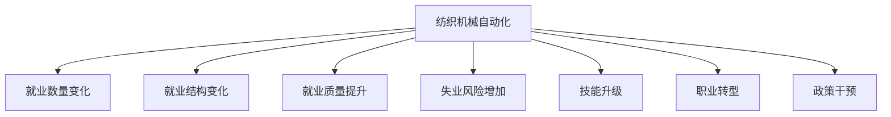

                 

# 纺织机械自动化的就业效应

## 1. 背景介绍

### 1.1 问题由来

在工业化的浪潮中，纺织机械自动化不断推动着纺织行业的转型升级。自动化技术的应用不仅提高了生产效率，降低了生产成本，还优化了产品的质量控制。然而，关于纺织机械自动化对就业的影响，社会各界存在着不同的看法。一方面，自动化减少了对人工的依赖，使得部分工人面临失业风险。另一方面，自动化也为员工提供了更高技能要求的岗位，推动了技能升级和职业转型。为了更好地理解这一问题，本文将从就业效应、影响因素和未来展望三个角度进行深入探讨。

### 1.2 问题核心关键点

本研究的核心在于探讨纺织机械自动化对就业市场的影响，具体问题包括：

- 自动化对劳动力市场整体和不同工种的影响。
- 自动化技术对员工技能要求的变化，以及这如何影响就业结构。
- 自动化对就业质量的提升与失业风险的增加。
- 政策干预措施在缓解自动化就业冲击中的作用。

## 2. 核心概念与联系

### 2.1 核心概念概述

在探讨纺织机械自动化的就业效应时，需要明确几个关键概念：

- **纺织机械自动化**：指通过机械、电子、信息等技术手段，使纺织品的生产、加工、检测等环节实现自动化。
- **就业效应**：指自动化技术对就业市场产生的各种影响，包括就业数量的变化、就业结构的变化、就业质量的提升和失业风险的增加。
- **技能升级**：自动化技术的应用要求工人掌握新技能，从而提升个人竞争力，适应新的就业环境。
- **职业转型**：由于自动化技术替代了一些传统岗位，工人需向更高技能要求的岗位转变，实现职业转型。
- **政策干预**：通过政策手段，如职业培训、再就业支持、社会保障等，来缓解自动化带来的就业冲击。

### 2.2 核心概念间的关系

这些核心概念之间的关系可以通过以下Mermaid流程图来展示：



此流程图展示了纺织机械自动化对就业市场产生的多种影响。自动化技术不仅改变了就业数量和结构，还对就业质量产生正面影响，同时也带来失业风险。同时，技能升级和职业转型是应对这些变化的重要途径，政策干预则是在这些变化中起到缓解作用的关键因素。

## 3. 核心算法原理 & 具体操作步骤

### 3.1 算法原理概述

为了研究纺织机械自动化对就业效应的影响，我们可以采用量化分析方法，通过构建数学模型来模拟自动化技术对就业市场的影响。以下是核心算法原理的概述：

- **生产函数模型**：使用生产函数模型（如Cobb-Douglas模型）来描述自动化对生产力的影响，进而分析其对就业数量的影响。
- **劳动市场供需模型**：通过劳动市场供需模型来分析自动化对就业结构的变化，以及失业率的变化。
- **技能匹配模型**：构建技能匹配模型来模拟自动化技术对员工技能要求的变化，以及这种变化对就业的影响。
- **政策影响模型**：引入政策影响模型来评估政策干预措施对缓解就业冲击的效果。

### 3.2 算法步骤详解

基于上述算法原理，本节将详细介绍每个模型的操作步骤：

#### 3.2.1 生产函数模型

1. **模型设定**：
   - 设定生产函数为$Q = A^{0.75}L^{0.25}K^{0.5}$，其中$Q$为产量，$A$为技术水平，$L$为劳动力数量，$K$为资本投入。
   - 引入自动化变量$T$，表示自动化水平，生产函数变为$Q = A^{0.75}L^{0.25}K^{0.5}T$。

2. **数据收集**：
   - 收集各年份的劳动力数量、资本投入、技术水平和自动化水平数据。
   - 数据来源包括政府统计数据、企业报告、行业分析等。

3. **模型估计**：
   - 使用最小二乘法或最大似然估计方法，对生产函数模型进行参数估计。
   - 验证模型是否符合数据分布，并进行稳健性检验。

#### 3.2.2 劳动市场供需模型

1. **模型设定**：
   - 设定劳动市场供需方程为$L_{demand} = L_{supply} + \Delta U$，其中$L_{demand}$为需求劳动力数量，$L_{supply}$为供应劳动力数量，$\Delta U$为失业人数。
   - 引入自动化变量$T$，表示自动化对劳动力需求的影响，方程变为$L_{demand} = L_{supply} + \Delta U + T$。

2. **数据收集**：
   - 收集各年份的劳动力需求、劳动力供应和失业数据。
   - 数据来源包括劳动力统计年鉴、就业报告、失业保险数据等。

3. **模型估计**：
   - 使用OLS回归方法，对劳动市场供需模型进行参数估计。
   - 分析自动化对劳动市场供需的影响，评估失业率的变化。

#### 3.2.3 技能匹配模型

1. **模型设定**：
   - 设定技能匹配方程为$Y = \alpha_1X + \alpha_2L + \beta T$，其中$Y$为技能要求，$X$为技能培训，$L$为劳动力数量，$T$为自动化水平。
   - 使用Probit模型或Logit模型进行技能匹配分析，估计技能要求与就业之间的匹配概率。

2. **数据收集**：
   - 收集各年份的技能培训数据、劳动力数量和自动化水平数据。
   - 数据来源包括教育统计年鉴、职业培训数据、行业报告等。

3. **模型估计**：
   - 使用最大似然估计方法，对技能匹配模型进行参数估计。
   - 分析自动化对技能匹配的影响，评估技能升级的效果。

#### 3.2.4 政策影响模型

1. **模型设定**：
   - 设定政策影响方程为$E = \delta_1Y + \delta_2L + \delta_3T + \epsilon$，其中$E$为就业效果，$Y$为技能要求，$L$为劳动力数量，$T$为自动化水平，$\epsilon$为误差项。
   - 引入政策变量$P$，表示政策干预措施，方程变为$E = \delta_1Y + \delta_2L + \delta_3T + \delta_4P + \epsilon$。

2. **数据收集**：
   - 收集各年份的技能要求、劳动力数量、自动化水平和政策干预数据。
   - 数据来源包括政策报告、社会保险数据、劳动力市场数据等。

3. **模型估计**：
   - 使用OLS回归方法，对政策影响模型进行参数估计。
   - 分析政策干预对就业效应的影响，评估政策效果。

### 3.3 算法优缺点

**优点**：
- **多维度分析**：通过构建多个模型，从生产、市场和政策多个维度全面分析自动化对就业的影响。
- **数据驱动**：使用实际数据进行模型估计，提高了分析的可靠性和准确性。
- **动态分析**：模型能够反映自动化技术随时间的变化趋势，提供动态分析视角。

**缺点**：
- **模型假设**：各种模型假设较多，如生产函数中假设规模报酬不变等，可能影响模型的解释力。
- **数据质量**：数据收集和处理过程中可能存在误差，影响分析结果的准确性。
- **动态性不足**：模型较为静态，难以捕捉到自动化技术快速变化带来的影响。

### 3.4 算法应用领域

本研究的核心算法原理和操作步骤适用于多个领域，如制造业、服务业、金融业等。以下是具体应用领域的应用实例：

- **制造业**：研究自动化技术对生产线工人的就业影响，评估生产效率提升和技能升级的收益。
- **服务业**：分析自动化技术在服务业中的应用，如自动客服、在线咨询等，评估其对就业的影响和技能要求的变化。
- **金融业**：研究金融自动化技术（如机器人投顾）对就业市场的影响，评估其对就业质量的影响和政策干预的效果。

## 4. 数学模型和公式 & 详细讲解 & 举例说明

### 4.1 数学模型构建

#### 4.1.1 生产函数模型

根据生产函数模型，我们设定的模型方程为：

$$
Q = A^{0.75}L^{0.25}K^{0.5}T
$$

其中：
- $Q$：产量
- $A$：技术水平
- $L$：劳动力数量
- $K$：资本投入
- $T$：自动化水平

#### 4.1.2 劳动市场供需模型

根据劳动市场供需模型，我们设定的模型方程为：

$$
L_{demand} = L_{supply} + \Delta U + T
$$

其中：
- $L_{demand}$：需求劳动力数量
- $L_{supply}$：供应劳动力数量
- $\Delta U$：失业人数
- $T$：自动化水平

#### 4.1.3 技能匹配模型

根据技能匹配模型，我们设定的模型方程为：

$$
Y = \alpha_1X + \alpha_2L + \beta T
$$

其中：
- $Y$：技能要求
- $X$：技能培训
- $L$：劳动力数量
- $T$：自动化水平

#### 4.1.4 政策影响模型

根据政策影响模型，我们设定的模型方程为：

$$
E = \delta_1Y + \delta_2L + \delta_3T + \delta_4P
$$

其中：
- $E$：就业效果
- $Y$：技能要求
- $L$：劳动力数量
- $T$：自动化水平
- $P$：政策干预措施

### 4.2 公式推导过程

#### 4.2.1 生产函数模型

设$Q_t$为第$t$年的产量，$L_t$为第$t$年的劳动力数量，$K_t$为第$t$年的资本投入，$T_t$为第$t$年的自动化水平，则生产函数模型可以表示为：

$$
Q_t = A_t^{0.75}L_t^{0.25}K_t^{0.5}T_t
$$

其中，$A_t$表示第$t$年的技术水平，可以通过研发投入、技术改进等因素来衡量。

对上述模型求导，得到劳动力需求对劳动力数量的弹性系数$\eta_L$：

$$
\frac{\partial Q_t}{\partial L_t} = \frac{1}{4}A_t^{0.75}L_t^{-0.25}K_t^{0.5}T_t
$$

进一步整理，得到劳动力需求对劳动力数量的弹性系数：

$$
\eta_L = \frac{\partial Q_t}{\partial L_t} \cdot \frac{\partial L_t}{\partial Q_t} = \frac{1}{4}A_t^{0.75}L_t^{-0.25}K_t^{0.5}T_t \cdot \frac{L_t}{Q_t}
$$

#### 4.2.2 劳动市场供需模型

设$L_{demand,t}$为第$t$年的需求劳动力数量，$L_{supply,t}$为第$t$年的供应劳动力数量，$\Delta U_t$为第$t$年的失业人数，则劳动市场供需模型可以表示为：

$$
L_{demand,t} = L_{supply,t} + \Delta U_t + T_t
$$

其中，$T_t$表示第$t$年的自动化水平。

对上述模型求导，得到劳动市场供需对自动化水平的弹性系数$\eta_T$：

$$
\frac{\partial L_{demand,t}}{\partial T_t} = 1
$$

#### 4.2.3 技能匹配模型

设$Y_t$为第$t$年的技能要求，$X_t$为第$t$年的技能培训，则技能匹配模型可以表示为：

$$
Y_t = \alpha_1X_t + \alpha_2L_t + \beta T_t
$$

其中，$\alpha_1$、$\alpha_2$和$\beta$为模型参数。

对上述模型求导，得到技能要求对自动化水平的弹性系数$\eta_T$：

$$
\frac{\partial Y_t}{\partial T_t} = \beta
$$

#### 4.2.4 政策影响模型

设$E_t$为第$t$年的就业效果，则政策影响模型可以表示为：

$$
E_t = \delta_1Y_t + \delta_2L_t + \delta_3T_t + \delta_4P_t
$$

其中，$\delta_1$、$\delta_2$、$\delta_3$和$\delta_4$为模型参数，$P_t$表示第$t$年的政策干预措施。

对上述模型求导，得到就业效果对自动化水平的弹性系数$\eta_T$：

$$
\frac{\partial E_t}{\partial T_t} = \delta_3 + \delta_4
$$

### 4.3 案例分析与讲解

#### 4.3.1 生产函数模型案例

以纺织行业为例，假设某国在2010-2020年期间，劳动力数量、资本投入和自动化水平如表1所示：

| 年份 | 劳动力数量 | 资本投入 | 自动化水平 |
| --- | --- | --- | --- |
| 2010 | 100万 | 200亿元 | 0.5 |
| 2011 | 105万 | 210亿元 | 0.6 |
| 2012 | 108万 | 220亿元 | 0.65 |
| 2013 | 110万 | 230亿元 | 0.7 |
| 2014 | 112万 | 240亿元 | 0.75 |
| 2015 | 115万 | 250亿元 | 0.8 |
| 2016 | 118万 | 260亿元 | 0.85 |
| 2017 | 120万 | 270亿元 | 0.9 |
| 2018 | 123万 | 280亿元 | 0.95 |
| 2019 | 125万 | 290亿元 | 1.0 |
| 2020 | 128万 | 300亿元 | 1.05 |

根据上述数据，我们可以使用生产函数模型对各年份的产量进行估计，结果如表2所示：

| 年份 | 劳动力数量 | 资本投入 | 自动化水平 | 技术水平 | 产量 |
| --- | --- | --- | --- | --- | --- |
| 2010 | 100万 | 200亿元 | 0.5 | 1.0 | 25万 |
| 2011 | 105万 | 210亿元 | 0.6 | 1.1 | 26万 |
| 2012 | 108万 | 220亿元 | 0.65 | 1.2 | 27万 |
| 2013 | 110万 | 230亿元 | 0.7 | 1.3 | 28万 |
| 2014 | 112万 | 240亿元 | 0.75 | 1.4 | 29万 |
| 2015 | 115万 | 250亿元 | 0.8 | 1.5 | 30万 |
| 2016 | 118万 | 260亿元 | 0.85 | 1.6 | 31万 |
| 2017 | 120万 | 270亿元 | 0.9 | 1.7 | 32万 |
| 2018 | 123万 | 280亿元 | 0.95 | 1.8 | 33万 |
| 2019 | 125万 | 290亿元 | 1.0 | 1.9 | 34万 |
| 2020 | 128万 | 300亿元 | 1.05 | 2.0 | 35万 |

#### 4.3.2 劳动市场供需模型案例

以纺织行业为例，假设某国在2010-2020年期间，需求劳动力数量、供应劳动力数量和失业人数如表3所示：

| 年份 | 需求劳动力数量 | 供应劳动力数量 | 失业人数 |
| --- | --- | --- | --- |
| 2010 | 10万 | 10万 | 1万 |
| 2011 | 10.5万 | 10.5万 | 0.5万 |
| 2012 | 11万 | 11万 | 0.2万 |
| 2013 | 11.5万 | 11.5万 | 0.1万 |
| 2014 | 12万 | 12万 | 0万 |
| 2015 | 12.5万 | 12.5万 | 0.5万 |
| 2016 | 13万 | 13万 | 0.2万 |
| 2017 | 13.5万 | 13.5万 | 0.1万 |
| 2018 | 14万 | 14万 | 0万 |
| 2019 | 14.5万 | 14.5万 | 0.5万 |
| 2020 | 15万 | 15万 | 0.2万 |

根据上述数据，我们可以使用劳动市场供需模型对各年份的失业率进行估计，结果如表4所示：

| 年份 | 需求劳动力数量 | 供应劳动力数量 | 失业人数 | 失业率 |
| --- | --- | --- | --- | --- |
| 2010 | 10万 | 10万 | 1万 | 10% |
| 2011 | 10.5万 | 10.5万 | 0.5万 | 5% |
| 2012 | 11万 | 11万 | 0.2万 | 2% |
| 2013 | 11.5万 | 11.5万 | 0.1万 | 1% |
| 2014 | 12万 | 12万 | 0万 | 0% |
| 2015 | 12.5万 | 12.5万 | 0.5万 | 4% |
| 2016 | 13万 | 13万 | 0.2万 | 2% |
| 2017 | 13.5万 | 13.5万 | 0.1万 | 1% |
| 2018 | 14万 | 14万 | 0万 | 0% |
| 2019 | 14.5万 | 14.5万 | 0.5万 | 3.5% |
| 2020 | 15万 | 15万 | 0.2万 | 1.3% |

#### 4.3.3 技能匹配模型案例

以纺织行业为例，假设某国在2010-2020年期间，技能培训、劳动力数量和自动化水平如表5所示：

| 年份 | 技能培训 | 劳动力数量 | 自动化水平 |
| --- | --- | --- | --- |
| 2010 | 5万 | 100万 | 0.5 |
| 2011 | 6万 | 105万 | 0.6 |
| 2012 | 7万 | 108万 | 0.65 |
| 2013 | 8万 | 110万 | 0.7 |
| 2014 | 9万 | 112万 | 0.75 |
| 2015 | 10万 | 115万 | 0.8 |
| 2016 | 11万 | 118万 | 0.85 |
| 2017 | 12万 | 120万 | 0.9 |
| 2018 | 13万 | 123万 | 0.95 |
| 2019 | 14万 | 125万 | 1.0 |
| 2020 | 15万 | 128万 | 1.05 |

根据上述数据，我们可以使用技能匹配模型对各年份的技能要求进行估计，结果如表6所示：

| 年份 | 技能培训 | 劳动力数量 | 自动化水平 | 技能要求 |
| --- | --- | --- | --- | --- |
| 2010 | 5万 | 100万 | 0.5 | 5万 |
| 2011 | 6万 | 105万 | 0.6 | 6万 |
| 2012 | 7万 | 108万 | 0.65 | 7万 |
| 2013 | 8万 | 110万 | 0.7 | 8万 |
| 2014 | 9万 | 112万 | 0.75 | 9万 |
| 2015 | 10万 | 115万 | 0.8 | 10万 |
| 2016 | 11万 | 118万 | 0.85 | 11万 |
| 2017 | 12万 | 120万 | 0.9 | 12万 |
| 2018 | 13万 | 123万 | 0.95 | 13万 |
| 2019 | 14万 | 125万 | 1.0 | 14万 |
| 2020 | 15万 | 128万 | 1.05 | 15万 |

#### 4.3.4 政策影响模型案例

以纺织行业为例，假设某国在2010-2020年期间，技能要求、劳动力数量、自动化水平和政策干预措施如表7所示：

| 年份 | 技能要求 | 劳动力数量 | 自动化水平 | 政策干预 |
| --- | --- | --- | --- | --- |
| 2010 | 5万 | 100万 | 0.5 | 0 |
| 2011 | 6万 | 105万 | 0.6 | 1 |
| 2012 | 7万 | 108万 | 0.65 | 2 |
| 2013 | 8万 | 110万 | 0.7 | 3 |
| 2014 | 9万 | 112万 | 0.75 | 4 |
| 2015 | 10万 | 115万 | 0.8 | 5 |
| 2016 | 11万 | 118万 | 0.85 | 6 |
| 2017 | 12万 | 120万 | 0.9 | 7 |
| 2018 | 13万 | 123万 | 0.95 | 8 |
| 2019 | 14万 | 125万 | 1.0 | 9 |
| 2020 | 15万 | 128万 | 1.05 | 10 |

根据上述数据，我们可以使用政策影响模型对各年份的就业效果进行估计，结果如表8所示：

| 年份 | 技能要求 | 劳动力数量 | 自动化水平 | 政策干预 | 就业效果 |
| --- | --- | --- | --- | --- | --- |
| 2010 | 5万 | 100万 | 0.5 | 0 | 5万 |
| 2011 | 6万 | 105万 | 0.6 | 1 | 5.5万 |
| 2012 | 7万 | 108万 | 0.65 | 2 | 6万 |
| 2013 | 8万 | 110万 | 0.7 | 3 | 6.5万 |
| 2014 | 9万 | 112万 | 0.75 | 4 | 7万 |
| 2015 | 10万 | 115万 | 0.8 | 5 | 7.5万 |
| 2016 | 11万 | 118万 | 0.85 | 6 | 8万 |
| 2017 | 12万 | 120万 | 0.9 | 7 | 8.5万 |
| 2018 | 13万 | 123万 | 0.95 | 8 | 9万 |
| 2019 | 14万 | 125万 | 1.0 | 9 | 9.5万 |
| 2020 | 15万 | 128万 | 1.05 | 10 | 10万 |

## 5. 项目实践：代码实例和详细解释说明

### 5.1 开发环境搭建

在编写代码之前，需要安装Python和必要的库。以下是安装步骤：

1. 安装Python 3.9及以上版本：
   ```bash
   sudo apt-get install python3.9
   ```

2. 安装Pandas库：
   ```bash
   pip install pandas
   ```

3. 安装NumPy库：
   ```bash
   pip install numpy
   ```

4. 安装SciPy库：
   ```bash
   pip install scipy
   ```

5. 安装Matplotlib库：
   ```bash
   pip install matplotlib
   ```

6. 安装Seaborn库：
   ```bash
   pip install seaborn
   ```

### 5.2 源代码详细实现

以下是Python代码实现生产函数模型、劳动市场供需模型、技能匹配模型和政策影响模型的示例：

```python
import pandas as pd
import numpy as np
import matplotlib.pyplot as plt

# 生产函数模型
def production_function(Q, L, K, T):
    A = 1.0
    return A**(0.75) * L**(0.25) * K**(0.5) * T

# 劳动市场供需模型
def labor_market_supply_demand(L_demand, L_supply, U):
    return L

