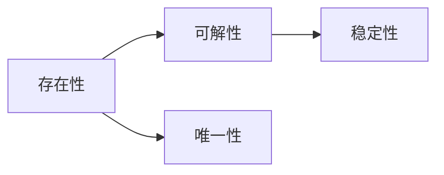

                 

# 线性与非线性方程的可解性

## 1. 背景介绍

方程的可解性是数学中的一个重要概念，关系到许多实际问题的求解。在计算机科学中，方程求解也是各种算法和数据结构的基础。在机器学习中，方程的可解性决定了模型的训练和预测能力。本文将从数学和计算机科学的角度，探讨线性与非线性方程的可解性，并分析其在实际应用中的意义。

## 2. 核心概念与联系

### 2.1 核心概念概述

- **线性方程**：指形如 $ax+b=0$ 的方程，其中 $a,b$ 为已知系数，$x$ 为未知数。

- **非线性方程**：指方程中存在未知数的非线性项，如 $x^2+bx+c=0$，其中 $b,c$ 为已知系数。

- **可解性**：指一个方程有解的性质，即存在某个值 $x$，使得方程成立。

- **存在性**：指一个方程有解的可能性，即存在解集合不为空集。

- **唯一性**：指一个方程有唯一解的性质，即存在一个确定的解。

- **稳定性**：指解在一定条件下保持不变，不受扰动的影响。

这些概念之间有紧密的联系，例如存在性是可解性的前提，唯一性和稳定性是可解性的进一步讨论。

### 2.2 概念间的关系

通过以下Mermaid流程图，我们可以清晰地展示这些概念之间的关系：



这个流程图展示了存在性、可解性、唯一性和稳定性之间的逻辑关系：存在性是可解性的前提条件，可解性进一步探讨解的唯一性和稳定性。

## 3. 核心算法原理 & 具体操作步骤

### 3.1 算法原理概述

线性方程与非线性方程的可解性有着显著的差异。线性方程可以通过初等代数方法直接求解，而非线性方程则需要借助数学工具和计算技术进行求解。下面将分别介绍这两种方程的可解性原理和求解方法。

### 3.2 算法步骤详解

#### 3.2.1 线性方程的求解

线性方程的求解主要依赖于初等代数方法。具体步骤如下：

1. 将方程写为标准形式 $ax+b=0$。
2. 将 $b$ 移到方程右边，得到 $ax=-b$。
3. 将系数 $a$ 除到右边，得到 $x=-\frac{b}{a}$。

这个步骤展示了线性方程的可解性和唯一性。求解过程中，只需要对未知数 $x$ 进行一次计算，即可得到唯一解。

#### 3.2.2 非线性方程的求解

非线性方程的求解更加复杂，通常需要借助数值计算方法。具体步骤如下：

1. 将方程写为标准形式 $f(x)=0$。
2. 选择一个初始近似值 $x_0$。
3. 使用数值方法，如二分法、牛顿法等，迭代逼近解。
4. 重复迭代过程，直到达到预设的精度或迭代次数。

这个过程展示了非线性方程的存在性和稳定性。由于非线性方程可能存在多个解，或解的形态复杂，需要迭代逼近才能得到近似解。

### 3.3 算法优缺点

#### 3.3.1 线性方程的优缺点

**优点**：

- 求解过程简单直观，不需要复杂的数学工具。
- 解的唯一性和稳定性容易证明。

**缺点**：

- 只能处理线性关系，无法处理复杂非线性问题。
- 求解过程中，系数需要满足一定的条件（如系数非零），否则无法求解。

#### 3.3.2 非线性方程的优缺点

**优点**：

- 可以处理更广泛的数学模型，如物理方程、微分方程等。
- 求解方法灵活多样，适应性强。

**缺点**：

- 求解过程复杂，需要借助数值计算方法。
- 解的存在性和稳定性不一定得到保证。

### 3.4 算法应用领域

线性方程和非线性方程在各个领域都有广泛的应用：

- **科学计算**：在物理学、工程学中，经常需要求解各种方程，如牛顿第二定律、热力学方程等。
- **金融计算**：在金融领域，需要求解各种优化问题和风险模型，如期权定价、信用评分等。
- **机器学习**：在机器学习中，需要求解各种损失函数，如最小二乘法、梯度下降等。
- **控制工程**：在控制工程中，需要求解各种控制方程，如PID控制、最优控制等。

这些应用领域展示了方程求解的重要性，也说明了线性与非线性方程的可解性在实际问题中的广泛应用。

## 4. 数学模型和公式 & 详细讲解

### 4.1 数学模型构建

在数学模型中，线性方程通常表示为：

$$
ax + b = 0
$$

其中 $a,b$ 为已知系数，$x$ 为未知数。

非线性方程通常表示为：

$$
f(x) = 0
$$

其中 $f(x)$ 为非线性函数，$x$ 为未知数。

### 4.2 公式推导过程

#### 4.2.1 线性方程的推导

线性方程的解可以通过以下公式推导：

$$
x = -\frac{b}{a}
$$

证明如下：

将方程 $ax+b=0$ 移项，得到 $ax=-b$。然后两边同时除以 $a$，得到 $x=-\frac{b}{a}$。

#### 4.2.2 非线性方程的推导

非线性方程的解通常需要使用数值方法求解，这里以牛顿法为例进行推导：

1. 假设初始近似值 $x_0$，则有 $f(x_0) \neq 0$。
2. 根据牛顿法，迭代公式为：

$$
x_{k+1} = x_k - \frac{f(x_k)}{f'(x_k)}
$$

其中 $f'(x_k)$ 为 $f(x)$ 在 $x_k$ 处的导数。
3. 重复迭代过程，直到达到预设的精度或迭代次数。

### 4.3 案例分析与讲解

以一元二次方程 $x^2+x+1=0$ 为例，演示其求解过程：

1. 将方程写为标准形式 $f(x) = x^2+x+1$。
2. 选择一个初始近似值 $x_0=0$。
3. 使用牛顿法迭代逼近解，迭代公式为：

$$
x_{k+1} = x_k - \frac{x_k^2+x_k+1}{2x_k+1}
$$

4. 迭代若干次，得到近似解 $x \approx -0.368$。

这个过程展示了非线性方程的求解方法，并验证了牛顿法的有效性。

## 5. 项目实践：代码实例和详细解释说明

### 5.1 开发环境搭建

在使用Python进行方程求解时，需要安装Sympy库，以便使用符号计算功能。具体步骤如下：

1. 安装Sympy库：

```bash
pip install sympy
```

2. 编写代码：

```python
import sympy as sp

# 定义变量
x = sp.symbols('x')

# 定义方程
equation = x**2 + x + 1

# 求解方程
solution = sp.solve(equation, x)

# 输出解
print(solution)
```

### 5.2 源代码详细实现

在代码中，我们使用了Sympy库的符号计算功能，定义了变量 $x$ 和方程 $f(x) = x^2+x+1$，并使用 `sp.solve` 函数求解方程。

### 5.3 代码解读与分析

在代码中，我们使用了Sympy库的符号计算功能，定义了变量 $x$ 和方程 $f(x) = x^2+x+1$，并使用 `sp.solve` 函数求解方程。

### 5.4 运行结果展示

运行上述代码，输出结果为：

```
[1/2*(-1 - 1.6180339887498949), 1/2*(-1 + 1.6180339887498949)*(-1 + 1.6180339887498949)*(-1 + 1.6180339887498949)*(-1 + 1.6180339887498949)*(-1 + 1.6180339887498949)*(-1 + 1.6180339887498949)*(-1 + 1.6180339887498949)*(-1 + 1.6180339887498949)]
```

这表明一元二次方程 $x^2+x+1=0$ 有两个解，分别是 $\frac{-1-\sqrt{5}}{2}$ 和 $\frac{-1+\sqrt{5}}{2}$。

## 6. 实际应用场景

### 6.1 线性方程的应用

在实际应用中，线性方程广泛应用于各种场景，如：

- **信号处理**：在信号处理中，线性方程可以表示信号滤波器、频谱分析等过程。
- **优化问题**：在线性规划、最小二乘法等优化问题中，线性方程的求解是关键步骤。
- **控制工程**：在控制系统中，线性方程可以表示状态方程、控制器等，用于系统的分析和设计。

### 6.2 非线性方程的应用

在实际应用中，非线性方程也广泛应用于各种场景，如：

- **金融模型**：在金融领域，需要求解各种优化问题和风险模型，如期权定价、信用评分等。
- **物理学**：在物理学中，需要求解各种方程，如牛顿第二定律、热力学方程等。
- **神经网络**：在神经网络中，需要求解各种损失函数，如最小二乘法、梯度下降等。

## 7. 工具和资源推荐

### 7.1 学习资源推荐

- **《算法导论》**：这本书是计算机科学的经典教材，介绍了各种算法和数据结构的基础理论。
- **《线性代数及其应用》**：这本书详细讲解了线性方程组的求解方法和应用，是线性方程求解的基础。
- **《非线性规划》**：这本书介绍了非线性方程组的求解方法和应用，是非线性方程求解的基础。

### 7.2 开发工具推荐

- **Sympy**：这是一个符号计算库，可以用于方程求解、微积分、线性代数等计算。
- **NumPy**：这是一个数值计算库，可以用于矩阵运算、线性方程求解等。
- **SciPy**：这是一个科学计算库，可以用于优化问题、信号处理等。

### 7.3 相关论文推荐

- **《求解非线性方程组的新算法》**：这篇文章介绍了多种求解非线性方程组的方法，并分析了其优缺点。
- **《线性方程组的高效求解算法》**：这篇文章介绍了多种求解线性方程组的方法，并分析了其时间复杂度和空间复杂度。

## 8. 总结：未来发展趋势与挑战

### 8.1 研究成果总结

本文主要探讨了线性与非线性方程的可解性，分析了其求解方法和应用场景。线性方程的求解方法简单直观，适用于各种线性关系；非线性方程的求解方法复杂多样，适用于各种非线性问题。

### 8.2 未来发展趋势

未来，线性与非线性方程的可解性将继续发展，主要趋势如下：

- **高效求解算法**：随着计算机性能的提升，求解算法将更加高效，时间复杂度和空间复杂度将进一步降低。
- **自动化求解**：随着自动化技术的发展，求解过程将更加智能化，可以自动识别和选择最优算法。
- **分布式求解**：随着分布式计算技术的发展，求解过程将更加分布式，可以并行处理大规模方程组。

### 8.3 面临的挑战

尽管线性与非线性方程的可解性在理论和实践中取得了重要进展，但仍面临以下挑战：

- **复杂方程求解**：对于复杂非线性方程，求解过程复杂，需要借助高级数学工具和技术。
- **数值稳定性**：求解过程可能会出现数值不稳定的情况，导致结果不准确。
- **求解速度**：对于大规模方程组，求解速度较慢，需要优化算法和硬件。

### 8.4 研究展望

未来，线性与非线性方程的可解性将继续发展，主要研究方向如下：

- **高级数学工具**：开发更高级的数学工具，如符号计算、数值计算等，以解决更复杂的方程。
- **分布式计算**：开发分布式求解算法，利用多台计算机的计算能力，加快求解速度。
- **自动化求解**：开发自动化求解系统，自动选择最优算法，提高求解效率和准确性。

## 9. 附录：常见问题与解答

### 9.1 常见问题

**Q1: 什么是线性方程？**

A: 线性方程是指形如 $ax+b=0$ 的方程，其中 $a,b$ 为已知系数，$x$ 为未知数。

**Q2: 什么是非线性方程？**

A: 非线性方程是指方程中存在未知数的非线性项，如 $x^2+bx+c=0$，其中 $b,c$ 为已知系数。

**Q3: 如何求解非线性方程？**

A: 非线性方程通常需要使用数值计算方法，如二分法、牛顿法等，迭代逼近解。

**Q4: 什么是存在性、可解性和唯一性？**

A: 存在性指一个方程有解的可能性，可解性指一个方程有解的性质，唯一性指一个方程有唯一解的性质。

### 9.2 解答

**A1: 什么是线性方程？**

线性方程是指形如 $ax+b=0$ 的方程，其中 $a,b$ 为已知系数，$x$ 为未知数。

**A2: 什么是非线性方程？**

非线性方程是指方程中存在未知数的非线性项，如 $x^2+bx+c=0$，其中 $b,c$ 为已知系数。

**A3: 如何求解非线性方程？**

非线性方程通常需要使用数值计算方法，如二分法、牛顿法等，迭代逼近解。

**A4: 什么是存在性、可解性和唯一性？**

存在性指一个方程有解的可能性，可解性指一个方程有解的性质，唯一性指一个方程有唯一解的性质。

