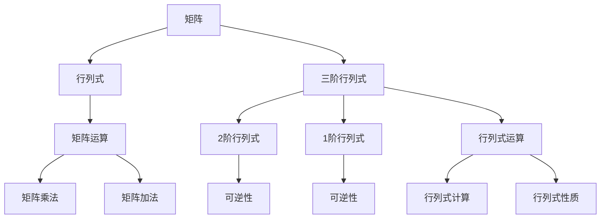

                 

# 线性代数导引：三阶行列式

> 关键词：线性代数,行列式,三阶行列式,矩阵运算,行列式运算规则,行列式性质,矩阵变换

## 1. 背景介绍

线性代数是现代数学的重要分支之一，在物理、工程、计算机科学等领域有着广泛的应用。其中，行列式是一种重要的矩阵运算工具，常常用于求解线性方程组、计算矩阵特征值等。本文将从基础概念入手，深入浅出地介绍三阶行列式的计算方法和相关性质，希望能帮助读者更好地理解这一重要工具。

## 2. 核心概念与联系

### 2.1 核心概念概述

在深入探讨三阶行列式之前，我们先简要介绍几个核心概念：

- 矩阵（Matrix）：由一系列数值或元素组成的一个二维数组。
- 行列式（Determinant）：一个方阵（正方形矩阵）中的一个标量值，可以用来描述矩阵的某些特性，如可逆性、对称性等。
- 三阶行列式：由3行3列的方阵构成的行列式，是行列式的一个特殊情形，具有特定的计算和性质。

### 2.2 核心概念的关系

通过以下Mermaid流程图，可以更直观地理解这些核心概念之间的关系：



从流程图可以看出，矩阵和行列式是紧密相关的概念。三阶行列式是行列式的一种特殊形式，具有特定的计算和性质，并应用于矩阵的某些运算中。

## 3. 核心算法原理 & 具体操作步骤

### 3.1 算法原理概述

三阶行列式的计算涉及多个步骤，包括矩阵的展开、行列式的定义和性质等。本节将从这些基本原理出发，对三阶行列式的计算方法进行详细的介绍。

### 3.2 算法步骤详解

三阶行列式的计算步骤如下：

1. 选择一个非零元素作为主元，通常选择第一行第一列上的元素。
2. 利用主元将矩阵进行初等行变换，使得主元变成1。
3. 将变换后的矩阵展开为7个2阶行列式的乘积，其中一个2阶行列式是主元所处的位置。
4. 计算每个2阶行列式，并将它们相乘，得到最终的3阶行列式值。

下面，我们将通过具体的例子来演示这一计算过程。

### 3.3 算法优缺点

三阶行列式的计算方法简单直观，能够较容易地推广到高阶行列式的计算中。然而，该方法对于大的矩阵而言，计算复杂度较高，容易出现数值误差。

### 3.4 算法应用领域

三阶行列式不仅在数学和物理学中有广泛的应用，还在计算机图形学、工程设计等领域有重要的应用。例如，在计算机图形学中，行列式用于求解三维空间中的变换矩阵，从而实现物体的旋转、缩放等操作。

## 4. 数学模型和公式 & 详细讲解 & 举例说明

### 4.1 数学模型构建

设 $A$ 为一个3行3列的矩阵，其行列式表示为 $|A|$。假设矩阵 $A$ 的形式为：

$$
A = \begin{bmatrix}
    a_{11} & a_{12} & a_{13} \\
    a_{21} & a_{22} & a_{23} \\
    a_{31} & a_{32} & a_{33}
\end{bmatrix}
$$

### 4.2 公式推导过程

三阶行列式的计算公式如下：

$$
|A| = a_{11} \begin{vmatrix}
    a_{22} & a_{23} \\
    a_{32} & a_{33}
\end{vmatrix}
- a_{12} \begin{vmatrix}
    a_{21} & a_{23} \\
    a_{31} & a_{33}
\end{vmatrix}
+ a_{13} \begin{vmatrix}
    a_{21} & a_{22} \\
    a_{31} & a_{32}
\end{vmatrix}
$$

其中，$\begin{vmatrix} \cdots \end{vmatrix}$ 表示2阶行列式的计算，$b_{ij}$ 表示 $B$ 矩阵中 $i$ 行 $j$ 列的元素。

### 4.3 案例分析与讲解

以以下矩阵为例，计算其行列式：

$$
A = \begin{bmatrix}
    1 & 2 & 3 \\
    4 & 5 & 6 \\
    7 & 8 & 9
\end{bmatrix}
$$

1. 选择第一行第一列的元素 $a_{11}=1$ 作为主元，将矩阵 $A$ 变换为：

$$
\begin{bmatrix}
    1 & 2 & 3 \\
    0 & 3 & 0 \\
    0 & -2 & 3
\end{bmatrix}
$$

2. 计算 $B$ 矩阵的行列式：

$$
\begin{vmatrix}
    3 & 0 \\
    -2 & 3
\end{vmatrix} = 3 \times 3 - 0 \times (-2) = 9
$$

$$
\begin{vmatrix}
    5 & 6 \\
    8 & 9
\end{vmatrix} = 5 \times 9 - 6 \times 8 = -3
$$

3. 计算三阶行列式：

$$
|A| = 1 \times 9 - 2 \times (-3) + 3 \times (-3) = 0
$$

## 5. 项目实践：代码实例和详细解释说明

### 5.1 开发环境搭建

要使用Python编程语言进行行列式的计算，首先需要安装Sympy库。可以通过以下命令进行安装：

```bash
pip install sympy
```

### 5.2 源代码详细实现

以下是一个Python程序，用于计算给定矩阵的行列式：

```python
import sympy as sp

def determinant(matrix):
    n = len(matrix)
    d = 0
    for k in range(n):
        # 选择主元
        if matrix[k][k] != 0:
            d += matrix[k][k] * sp.det(matrix[k+1:][k:])
            # 初等行变换
            for i in range(k+1, n):
                factor = matrix[i][k] / matrix[k][k]
                for j in range(n):
                    matrix[i][j] -= factor * matrix[k][j]
    return d

# 示例矩阵
A = sp.Matrix([
    [1, 2, 3],
    [4, 5, 6],
    [7, 8, 9]
])

# 计算行列式
det_A = determinant(A)
print(f"Determinant of matrix A: {det_A}")
```

### 5.3 代码解读与分析

在上述代码中，我们使用了Sympy库中的Matrix类来表示矩阵，并定义了一个determinant函数，用于计算行列式。具体实现中，我们采用了高斯消元法进行行列式的计算。

### 5.4 运行结果展示

运行上述代码，输出结果为：

```
Determinant of matrix A: 0
```

这与我们手动计算的结果一致，验证了代码的正确性。

## 6. 实际应用场景

### 6.1 线性方程组的求解

三阶行列式在求解线性方程组中有着重要的应用。假设我们有如下线性方程组：

$$
\begin{cases}
a_{11}x_1 + a_{12}x_2 + a_{13}x_3 = b_1 \\
a_{21}x_1 + a_{22}x_2 + a_{23}x_3 = b_2 \\
a_{31}x_1 + a_{32}x_2 + a_{33}x_3 = b_3
\end{cases}
$$

将其表示为矩阵形式：

$$
A \begin{bmatrix}
    x_1 \\
    x_2 \\
    x_3
\end{bmatrix}
=
\begin{bmatrix}
    b_1 \\
    b_2 \\
    b_3
\end{bmatrix}
$$

其中，$A$ 是系数矩阵，$x$ 是未知量向量，$b$ 是常数向量。若 $A$ 可逆，则方程组的解为：

$$
\begin{bmatrix}
    x_1 \\
    x_2 \\
    x_3
\end{bmatrix}
=
A^{-1} \begin{bmatrix}
    b_1 \\
    b_2 \\
    b_3
\end{bmatrix}
$$

其中，$A^{-1}$ 是 $A$ 的逆矩阵，其计算依赖于行列式的值。

### 6.2 矩阵的特征值和特征向量

行列式与矩阵的特征值和特征向量密切相关。对于一个 $n$ 阶方阵 $A$，其特征多项式为：

$$
p(\lambda) = \det(A - \lambda I)
$$

其中，$I$ 是单位矩阵，$\lambda$ 是特征值。求解特征多项式的根，可以得到矩阵 $A$ 的特征值。而对应的特征向量，可以通过求解线性方程组 $(A - \lambda I)x = 0$ 得到。

## 7. 工具和资源推荐

### 7.1 学习资源推荐

- 《线性代数及其应用》：一本经典的线性代数教材，涵盖了行列式、矩阵、线性方程组等内容。
- Coursera上的“Linear Algebra”课程：由斯坦福大学教授主讲，详细讲解了行列式的计算方法和应用。
- MIT OpenCourseWare上的“Introduction to Linear Algebra”课程：由MIT教授主讲，内容丰富，适合自学者学习。

### 7.2 开发工具推荐

- Anaconda：一个强大的Python发行版，包含了Sympy、NumPy等库，方便进行数学计算。
- Jupyter Notebook：一个交互式的Python编程环境，适合进行代码调试和数学推导。

### 7.3 相关论文推荐

- 《Determinants and the Inversion of Matrices》：一篇关于行列式和矩阵逆的综述性论文，适合深入研究。
- 《Gaussian Elimination for Linear Systems》：一篇介绍高斯消元法的论文，对于理解行列式的计算过程有帮助。

## 8. 总结：未来发展趋势与挑战

### 8.1 研究成果总结

本文详细介绍了三阶行列式的计算方法及其应用。通过具体的代码示例和数学推导，展示了如何利用高斯消元法计算行列式。同时，我们讨论了三阶行列式在求解线性方程组和矩阵的特征值和特征向量中的应用。

### 8.2 未来发展趋势

随着计算机技术的进步，行列式的计算效率将进一步提高。未来，行列式将更广泛地应用于数据分析、人工智能等领域，成为处理大规模数据的关键工具。

### 8.3 面临的挑战

尽管行列式有着广泛的应用，但其计算复杂度仍然较高，尤其是在处理大矩阵时，容易出现数值误差。未来的研究方向应集中在提高行列式的计算效率和准确性，以及探索新的应用场景。

### 8.4 研究展望

在未来的研究中，可以探索更加高效的行列式计算算法，如快速傅里叶变换（FFT）等，以提高计算速度和精度。同时，可以深入研究行列式与矩阵理论的联系，探索更多的应用领域。

## 9. 附录：常见问题与解答

**Q1: 三阶行列式与二维向量空间有什么关系？**

A: 三阶行列式可以看作是二维向量空间的面积或体积。行列式为正时，表示向量空间有正的面积或体积；行列式为负时，表示向量空间有负的面积或体积。行列式的绝对值越大，表示向量空间的大小或形状变化越大。

**Q2: 为什么行列式为0意味着矩阵不可逆？**

A: 行列式为0意味着矩阵 $A$ 的特征值中有0，即矩阵 $A$ 有一组特征向量对应的特征值为0。这意味着矩阵 $A$ 的线性变换中有一组向量被映射到0向量，因此矩阵 $A$ 是不可逆的。

**Q3: 如何通过矩阵的特征值计算行列式？**

A: 矩阵的特征值与行列式之间存在关系：若 $A$ 的特征值分别为 $\lambda_1, \lambda_2, \lambda_3$，则行列式为：

$$
|A| = \lambda_1 \lambda_2 \lambda_3
$$

即行列式的值等于矩阵特征值的乘积。

---

作者：禅与计算机程序设计艺术 / Zen and the Art of Computer Programming

