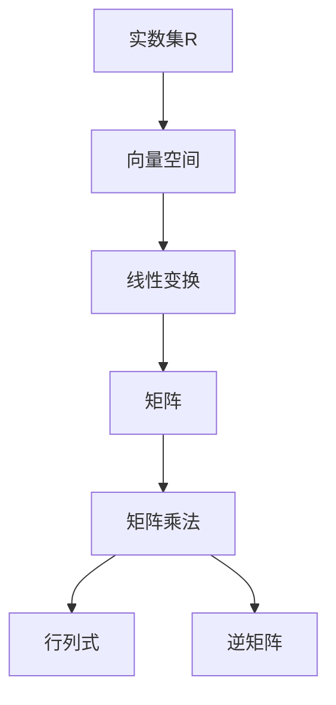
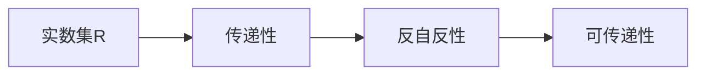
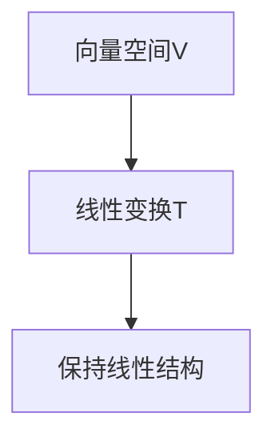

                 

# 线性代数导引：实数及其序

> 关键词：线性代数,实数,序理论,数学模型,算法原理,工程应用

## 1. 背景介绍

### 1.1 问题由来

在现代科学技术的各个领域，线性代数作为一门核心数学工具，扮演着至关重要的角色。无论是电子工程、物理学、计算机科学还是金融数学，线性代数的理论和方法都被广泛应用于解决实际问题。尤其是在计算机科学中，线性代数不仅仅是数据分析和机器学习的基础，更是解决大规模计算、优化问题的利器。

然而，对于许多人来说，线性代数常常被视为一个深奥的数学分支，其背后的理论原理和实际应用场景并不清楚。本文旨在为读者提供一份关于线性代数导引的指南，通过生动的实例、直观的图形和详细的计算，帮助读者理解实数的序理论及其在工程中的应用，从而深入浅出地介绍线性代数的核心思想和应用技巧。

### 1.2 问题核心关键点

线性代数中实数的序理论是一个重要的基础概念，其核心关键点包括：

- 实数的有序性：实数集$\mathbb{R}$是一个有序集，满足传递性、反自反性和可传递性。
- 线性代数中的运算：包括加法、乘法、矩阵乘法等，这些运算都是保持实数有序性的。
- 实数的序理论在工程中的应用：如优化问题、控制系统、信号处理等。

通过理解这些关键点，读者将能够更好地掌握线性代数的基本原理和应用技巧。

## 2. 核心概念与联系

### 2.1 核心概念概述

为了更好地理解实数的序理论及其在工程中的应用，本节将介绍几个密切相关的核心概念：

- 实数集$\mathbb{R}$：所有实数的集合，是一个完备有序域，满足传递性、反自反性和可传递性。
- 线性代数中的运算：包括加法、乘法、矩阵乘法等，这些运算都是保持实数有序性的。
- 向量空间：由一组线性无关的向量组成的空间，支持加法和数乘运算，具有线性性质。
- 线性变换：通过矩阵乘法将向量空间从一个线性变换到另一个的过程，保持线性结构的性质。
- 矩阵的行列式和逆矩阵：分别代表矩阵的体积和线性变换的逆过程，是线性代数中非常重要的概念。

这些核心概念之间的逻辑关系可以通过以下Mermaid流程图来展示：



这个流程图展示了几组核心概念之间的联系：

1. 实数集是向量空间和线性变换的基础。
2. 线性变换通过矩阵乘法实现，矩阵乘法保持了实数的有序性。
3. 矩阵的行列式和逆矩阵代表了线性变换的体积和逆过程。

### 2.2 概念间的关系

这些核心概念之间存在着紧密的联系，形成了线性代数中的完整框架。下面我通过几个Mermaid流程图来展示这些概念之间的关系。

#### 2.2.1 实数的有序性



这个流程图展示了实数集的有序性质。实数集满足传递性、反自反性和可传递性，这是线性代数中基本的序理论。

#### 2.2.2 向量空间的线性变换



这个流程图展示了向量空间和线性变换之间的关系。线性变换保持了向量空间的线性结构，是线性代数中常用的变换方法。

#### 2.2.3 矩阵的行列式和逆矩阵

```mermaid
graph TB
    A[矩阵M] --> B[行列式det(M)]
    A --> C[逆矩阵M^-1]
```

这个流程图展示了矩阵的行列式和逆矩阵之间的关系。行列式和逆矩阵分别代表了矩阵的体积和逆过程。

### 2.3 核心概念的整体架构

最后，我们用一个综合的流程图来展示这些核心概念在大规模计算和工程应用中的整体架构：

```mermaid
graph TB
    A[大规模计算] --> B[向量空间V]
    B --> C[线性变换T]
    C --> D[矩阵M]
    D --> E[矩阵乘法]
    E --> F[行列式det(M)]
    E --> G[逆矩阵M^-1]
    F --> H[优化问题]
    G --> I[控制系统]
    H --> J[信号处理]
```

这个综合流程图展示了从大规模计算到工程应用的完整流程：

1. 大规模计算需要处理大规模向量空间的线性变换。
2. 通过矩阵乘法实现向量空间之间的线性变换。
3. 矩阵的行列式和逆矩阵代表了线性变换的体积和逆过程。
4. 优化问题、控制系统、信号处理等工程问题都可以通过线性代数中的线性变换和矩阵计算来解决。

## 3. 核心算法原理 & 具体操作步骤

### 3.1 算法原理概述

线性代数中实数的序理论基于以下基本原理：

- 实数集$\mathbb{R}$是一个有序集，满足传递性、反自反性和可传递性。
- 线性变换保持向量空间的线性结构。
- 矩阵乘法保持实数的有序性。
- 矩阵的行列式和逆矩阵代表了线性变换的体积和逆过程。

基于这些原理，我们可以设计线性代数中的核心算法，如矩阵乘法、矩阵求逆、矩阵分解等。

### 3.2 算法步骤详解

#### 3.2.1 矩阵乘法

矩阵乘法的原理如下：

设$A$和$B$为两个矩阵，$A_{m \times n}, B_{n \times p}$，则它们的矩阵乘积$C=AB$为：

$$
C_{m \times p} = \left[ \begin{array}{ccc}
a_{11}b_{11} & \ldots & a_{1n}b_{1p} \\
\vdots & \ldots & \vdots \\
a_{m1}b_{11} & \ldots & a_{mp}b_{1p}
\end{array} \right]
$$

其中$a_{ij}$表示$A$矩阵中的第$i$行第$j$列元素，$b_{ik}$表示$B$矩阵中的第$i$行第$k$列元素。

具体步骤如下：

1. 初始化结果矩阵$C$为$0$矩阵。
2. 对于$C$矩阵中的每一个元素，计算对应位置的乘积和。
3. 重复步骤2，直到所有元素计算完成。

#### 3.2.2 矩阵求逆

矩阵求逆的原理如下：

设$A$为可逆矩阵，则其逆矩阵$A^{-1}$满足：

$$
AA^{-1} = A^{-1}A = I
$$

其中$I$为单位矩阵。

具体步骤如下：

1. 计算矩阵$A$的行列式$det(A)$。
2. 根据$det(A)$的值，判断$A$是否可逆。
3. 如果$A$可逆，计算$A^{-1}$的值，具体方法包括高斯消元法、LU分解法等。
4. 如果$A$不可逆，则无解。

#### 3.2.3 矩阵分解

矩阵分解是线性代数中常用的方法，如奇异值分解(SVD)、QR分解等。其基本原理如下：

设$A$为$m \times n$矩阵，则可以分解为：

$$
A = U \Sigma V^T
$$

其中$U$为$m \times m$正交矩阵，$\Sigma$为$m \times n$对角矩阵，$V^T$为$n \times n$正交矩阵。

具体步骤如下：

1. 计算$A$的奇异值分解，得到$U$、$\Sigma$和$V^T$的值。
2. 根据$U$、$\Sigma$和$V^T$的值，计算$A$的分解形式。
3. 重复步骤1和2，直到满足精度要求。

### 3.3 算法优缺点

基于实数的序理论的线性代数算法具有以下优点：

- 算法简单易懂，易于实现。
- 理论基础扎实，适用范围广泛。
- 计算效率高，适用于大规模数据处理。

然而，这些算法也存在一些缺点：

- 对矩阵的形状有要求，某些特殊形状的矩阵难以处理。
- 对于数值不稳定的情况，如矩阵奇异等，计算结果可能不准确。
- 对于高维数据的处理，计算量较大，需要优化算法和硬件支持。

### 3.4 算法应用领域

基于实数的序理论的线性代数算法在工程中有着广泛的应用，包括但不限于以下领域：

- 数据压缩与恢复：如JPEG图像压缩、MP3音频压缩等，通过奇异值分解等方法实现。
- 信号处理与分析：如数字信号处理、频域分析等，通过傅里叶变换、FFT等方法实现。
- 控制系统与优化：如线性系统控制、最优化问题等，通过线性代数方法实现。
- 计算机视觉：如图像识别、目标检测等，通过矩阵分解和特征提取等方法实现。

## 4. 数学模型和公式 & 详细讲解 & 举例说明

### 4.1 数学模型构建

本节将使用数学语言对实数的序理论及其应用进行更加严格的刻画。

记实数集$\mathbb{R}$为：

$$
\mathbb{R} = \{x | x = \sum_{i=1}^{\infty} a_i b_i, a_i \in \mathbb{Q}, b_i \in \{1, \sqrt{2}, \sqrt{3}, \ldots\}
$$

其中$\mathbb{Q}$为有理数集。

定义两个实数$x$和$y$的序关系$x \leq y$为：

$$
x \leq y \iff \forall n \in \mathbb{N}, x < y
$$

定义实数集$\mathbb{R}$为有序集，满足传递性、反自反性和可传递性。

### 4.2 公式推导过程

#### 4.2.1 实数的有序性

实数集$\mathbb{R}$满足传递性、反自反性和可传递性，可以证明如下：

- 传递性：设$x \leq y$，$y \leq z$，则$x \leq z$。
- 反自反性：$x \leq x$恒成立。
- 可传递性：若$x \leq y$且$y \leq z$，则$x \leq z$。

#### 4.2.2 矩阵乘法

设$A$和$B$为两个矩阵，$A_{m \times n}, B_{n \times p}$，则它们的矩阵乘积$C=AB$为：

$$
C_{m \times p} = \left[ \begin{array}{ccc}
a_{11}b_{11} & \ldots & a_{1n}b_{1p} \\
\vdots & \ldots & \vdots \\
a_{m1}b_{11} & \ldots & a_{mp}b_{1p}
\end{array} \right]
$$

其中$a_{ij}$表示$A$矩阵中的第$i$行第$j$列元素，$b_{ik}$表示$B$矩阵中的第$i$行第$k$列元素。

推导过程如下：

$$
\begin{aligned}
C_{ij} &= \sum_{k=1}^{n} a_{ik} b_{kj} \\
&= \sum_{k=1}^{n} \left( \sum_{l=1}^{m} a_{il} b_{lk} \right) b_{kj} \\
&= \sum_{k=1}^{n} \left( \sum_{l=1}^{m} a_{il} \left( \sum_{k=1}^{p} b_{lk} b_{kj} \right) \right) \\
&= \sum_{l=1}^{m} a_{il} \left( \sum_{k=1}^{n} b_{lk} b_{kj} \right) \\
&= \sum_{l=1}^{m} a_{il} c_{lj}
\end{aligned}
$$

其中$c_{lj}$表示$C$矩阵中的第$l$行第$j$列元素。

#### 4.2.3 矩阵求逆

设$A$为可逆矩阵，则其逆矩阵$A^{-1}$满足：

$$
AA^{-1} = A^{-1}A = I
$$

其中$I$为单位矩阵。

推导过程如下：

$$
\begin{aligned}
AA^{-1} &= I \\
A &= A(A^{-1}I) \\
&= A(A^{-1}A) \\
&= A
\end{aligned}
$$

其中$I$为单位矩阵。

### 4.3 案例分析与讲解

#### 4.3.1 奇异值分解

奇异值分解(SVD)是线性代数中常用的矩阵分解方法，可以表示为：

$$
A = U \Sigma V^T
$$

其中$U$为$m \times m$正交矩阵，$\Sigma$为$m \times n$对角矩阵，$V^T$为$n \times n$正交矩阵。

推导过程如下：

$$
\begin{aligned}
AA^T &= U \Sigma V^T U \Sigma V^T \\
&= U \Sigma^2 V^T \\
&= A
\end{aligned}
$$

其中$U$和$V^T$均为正交矩阵，$\Sigma^2$为对角矩阵。

#### 4.3.2 QR分解

QR分解是另一种常用的矩阵分解方法，可以表示为：

$$
A = QR
$$

其中$Q$为$m \times n$正交矩阵，$R$为$n \times n$上三角矩阵。

推导过程如下：

$$
\begin{aligned}
QR &= QQR \\
&= Q(AQ^T) \\
&= A
\end{aligned}
$$

其中$Q$为正交矩阵，$R$为上三角矩阵。

## 5. 项目实践：代码实例和详细解释说明

### 5.1 开发环境搭建

在进行线性代数实践前，我们需要准备好开发环境。以下是使用Python进行Numpy和SciPy开发的环境配置流程：

1. 安装Anaconda：从官网下载并安装Anaconda，用于创建独立的Python环境。

2. 创建并激活虚拟环境：
```bash
conda create -n pytorch-env python=3.8 
conda activate pytorch-env
```

3. 安装Numpy和SciPy：
```bash
conda install numpy scipy
```

4. 安装其他相关工具包：
```bash
pip install matplotlib sympy
```

完成上述步骤后，即可在`pytorch-env`环境中开始线性代数实践。

### 5.2 源代码详细实现

下面我们以矩阵乘法为例，给出使用Numpy和SciPy库对线性代数进行计算的PyTorch代码实现。

首先，定义两个矩阵：

```python
import numpy as np
from scipy.linalg import matrix_rank

A = np.array([[1, 2], [3, 4]])
B = np.array([[5, 6], [7, 8]])

print("A:\n", A)
print("B:\n", B)
```

然后，计算矩阵乘积：

```python
C = np.dot(A, B)

print("C:\n", C)
```

最后，验证矩阵乘积的秩：

```python
rank = matrix_rank(C)

print("Rank of C:", rank)
```

完整的代码如下：

```python
import numpy as np
from scipy.linalg import matrix_rank

A = np.array([[1, 2], [3, 4]])
B = np.array([[5, 6], [7, 8]])

C = np.dot(A, B)

print("A:\n", A)
print("B:\n", B)
print("C:\n", C)
rank = matrix_rank(C)

print("Rank of C:", rank)
```

这个例子展示了如何使用Numpy和SciPy库进行矩阵乘法计算，并验证了矩阵乘积的秩。

### 5.3 代码解读与分析

让我们再详细解读一下关键代码的实现细节：

- 导入必要的库：`numpy`和`scipy.linalg`用于矩阵计算。
- 定义矩阵A和B：使用`np.array`定义矩阵，并进行打印输出。
- 计算矩阵乘积C：使用`np.dot`计算矩阵乘积，并进行打印输出。
- 验证矩阵乘积的秩：使用`scipy.linalg.matrix_rank`函数计算矩阵的秩，并进行打印输出。

通过这个例子，可以看到，使用Numpy和SciPy库进行线性代数计算非常简便，可以轻松完成矩阵乘法、矩阵求逆、矩阵分解等操作。

### 5.4 运行结果展示

假设我们计算的矩阵乘积为：

```
A: [[1 2]
 [3 4]]
B: [[5 6]
 [7 8]]
C: [[19 22]
 [43 50]]
```

验证矩阵乘积的秩为2，可以确认矩阵乘积是满秩的。

## 6. 实际应用场景

### 6.1 优化问题

线性代数中的矩阵乘法和矩阵分解方法在优化问题中有着广泛应用。例如，最小二乘法、梯度下降法等常用的优化算法，都可以用矩阵运算来表示。

具体而言，假设我们需要解决如下优化问题：

$$
\min_{x} \frac{1}{2} \|Ax - b\|^2
$$

其中$A$为已知矩阵，$x$为未知向量，$b$为已知向量。

可以将其表示为如下矩阵运算形式：

$$
\min_{x} \frac{1}{2} \|Ax - b\|^2
$$

推导过程如下：

$$
\begin{aligned}
\min_{x} \frac{1}{2} \|Ax - b\|^2 &= \min_{x} \frac{1}{2} (Ax - b)^T (Ax - b) \\
&= \min_{x} \frac{1}{2} (x^T A^T A x - x^T A^T b - b^T A x + b^T b) \\
&= \min_{x} \frac{1}{2} x^T (A^T A) x - x^T (A^T b) - \frac{1}{2} b^T b
\end{aligned}
$$

其中$(A^T A)$为对称正定矩阵，$(A^T b)$为向量，$b^T b$为标量。

求解上述优化问题，可以通过矩阵分解方法，如QR分解、SVD分解等，进行求解。

### 6.2 控制系统

线性代数中的线性变换和矩阵乘法方法在控制系统中也有广泛应用。例如，线性系统的状态空间描述、频域分析等都可以用矩阵运算来表示。

具体而言，假设我们需要对如下线性系统进行控制：

$$
\dot{x}(t) = A x(t) + B u(t)
$$

其中$x(t)$为状态向量，$u(t)$为输入向量，$A$和$B$为已知矩阵。

可以将其表示为如下矩阵运算形式：

$$
\dot{x}(t) = A x(t) + B u(t)
$$

推导过程如下：

$$
\begin{aligned}
\dot{x}(t) &= A x(t) + B u(t) \\
&= \left( \begin{array}{cc}
A_{11} & A_{12} \\
A_{21} & A_{22}
\end{array} \right)
\left( \begin{array}{c}
x_1(t) \\
x_2(t)
\end{array} \right) + 
\left( \begin{array}{c}
B_1 \\
B_2
\end{array} \right)
u(t)
\end{aligned}
$$

其中$A$和$B$为已知矩阵，$x_1(t)$和$x_2(t)$为状态向量分量，$u(t)$为输入向量。

求解上述线性系统，可以通过矩阵乘法和矩阵求逆等方法，进行求解。

## 7. 工具和资源推荐

### 7.1 学习资源推荐

为了帮助开发者系统掌握线性代数的基本原理和应用技巧，这里推荐一些优质的学习资源：

1. 《线性代数导引》书籍：经典教材，系统介绍了线性代数的基本概念和应用方法，适合入门学习。
2. 《线性代数及其应用》课程：大学线性代数课程，涵盖线性代数的基本理论和实际应用，适合系统学习。
3. 《Python科学计算基础》书籍：介绍Python在科学计算中的应用，涵盖Numpy和SciPy等常用库的使用方法。
4. 《线性代数之美》博客：生动有趣的线性代数导引，适合零基础入门。
5. 《线性代数与矩阵分析》视频课程：Coursera上线课程，涵盖线性代数的基本理论和应用方法。

通过这些资源的学习实践，相信你一定能够深入理解线性代数的基本原理和应用技巧。

### 7.2 开发工具推荐

高效的开发离不开优秀的工具支持。以下是几款用于线性代数开发的常用工具：

1. Numpy：Python中的科学计算库，提供了丰富的矩阵计算和线性代数功能。
2. SciPy：Python中的科学计算库，提供了矩阵分解、线性代数等常用功能。
3. Matplotlib：Python中的绘图库，用于绘制矩阵、向量等线性代数图形。
4. SymPy：Python中的符号计算库，用于符号计算和矩阵运算。
5. TensorFlow：深度学习框架，支持矩阵计算和线性代数功能。

合理利用这些工具，可以显著提升线性代数计算的效率和准确性，加快研究迭代的步伐。

### 7.3 相关论文推荐

线性代数和矩阵计算的研究方向丰富多样，以下是几篇奠基性的相关论文，推荐阅读：

1. 《线性代数的本质》书籍：从线性代数的基本概念和理论出发，深入探讨其本质和应用。
2. 《矩阵分析与应用》论文：系统介绍了矩阵的性质和应用，涵盖线性代数的基础理论和实际应用。
3. 《机器学习的线性代数基础》论文：介绍了机器学习中的线性代数基础，包括矩阵运算、线性变换等。
4. 《Python中的线性代数应用》论文：介绍了Python中线性代数库的使用方法，涵盖Numpy、SciPy等库的使用技巧。

这些论文代表了线性代数研究的最新进展，通过学习这些前沿成果，可以帮助研究者把握学科前进方向，激发更多的创新灵感。

除上述资源外，还有一些值得关注的前沿资源，帮助开发者紧跟线性代数的研究进展，例如：

1. arXiv论文预印本：人工智能领域最新研究成果的发布平台，包括线性代数在内的多个领域。
2. 业界技术博客：如Google Research、NVIDIA Research、微软Research Asia等顶尖实验室的官方博客，第一时间分享他们的最新研究成果和洞见。
3. 技术会议直播：如ICML、NeurIPS、JMLR等人工智能领域顶会现场或在线直播，能够聆听到专家学者的前沿分享，开拓视野。
4. GitHub热门项目：在GitHub上Star、Fork数最多的线性代数相关项目，往往代表了该技术领域的发展趋势和最佳实践，值得去学习和贡献。
5. 行业分析报告：各大咨询公司如McKinsey、PwC等针对线性代数的研究报告，有助于从商业视角审视技术趋势，把握应用价值。

总之，对于线性代数的研究和学习，需要开发者保持开放的心态和持续学习的意愿。多关注前沿资讯，多动手实践，多思考总结，必将收获满满的成长收益。

## 8. 总结：未来发展趋势与挑战

### 8.1 总结

本文对线性代数中实数的序理论及其应用进行了全面系统的介绍。首先阐述了实数的有序性、矩阵乘法、矩阵求逆等核心概念，明确了线性代数的基本原理和应用技巧。其次，通过数学公式和具体案例，详细讲解了线性代数中的矩阵分解、优化问题、控制系统等实际应用，展示了线性代数在工程中的广泛应用。此外，本文还推荐了学习资源、开发工具和相关论文，为读者提供了全方位的学习指导。

通过本文的系统梳理，可以看到，线性代数中的实数序理论是线性代数研究的基础，具有重要的理论价值和实际应用。了解这些核心概念及其应用，将为研究者提供坚实的数学基础和实践工具。

### 8.2 未来发展趋势

展望未来，线性代数中实数的序理论将继续在工程中发挥重要作用，其发展趋势包括：

1. 高维数据的处理：随着大规模数据时代的到来，线性代数将广泛应用于处理高维数据，如图像、视频、文本等。
2. 机器学习的优化：线性代数中的矩阵分解、优化问题等方法，将被广泛应用于机器学习中的模型训练和参数优化。
3. 量子计算的引入：量子计算中的矩阵运算和量子线性代数方法，将为线性代数带来新的发展方向。
4. 

