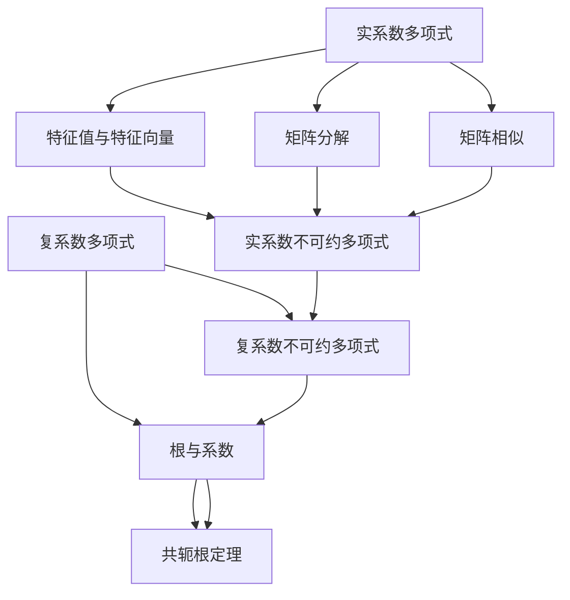

                 

# 线性代数导引：实系数和复系数不可约多项式

> 关键词：线性代数,实系数多项式,复系数多项式,不可约多项式,特征值与特征向量,矩阵分解,矩阵相似

## 1. 背景介绍

线性代数是现代数学中不可或缺的一部分，广泛应用于物理学、工程学、计算机科学等多个领域。其中，实系数和复系数多项式是不可约多项式理论的核心内容，对解析函数、线性代数以及信号处理等领域有着深远的影响。本节将介绍多项式的定义、基本性质以及不可约多项式的概念，为后续深入讨论提供背景。

## 2. 核心概念与联系

### 2.1 核心概念概述

多项式是代数数论中的基本对象之一，可以表示为变量的整数次幂之和。本节将介绍多项式的定义、基本性质以及不可约多项式的概念，为后续深入讨论提供背景。

#### 2.1.1 实系数多项式

实系数多项式指的是系数均为实数的多项式，形式为：

$$f(x) = a_n x^n + a_{n-1} x^{n-1} + \cdots + a_1 x + a_0$$

其中 $a_i$ 为实数。实系数多项式的根可以由多项式定理求得，也可以通过求根公式得到。实系数多项式的特征值与特征向量有独特的性质，可以作为矩阵分解的依据。

#### 2.1.2 复系数多项式

复系数多项式指的是系数可以是复数的多项式，形式为：

$$g(z) = b_m z^m + b_{m-1} z^{m-1} + \cdots + b_1 z + b_0$$

其中 $b_i$ 为复数。复系数多项式的根可以由多项式定理求得，也可以通过求根公式得到。复系数多项式的根的实部和虚部由方程组求解，而复数根的共轭根定理表明，复系数多项式有共轭根。

#### 2.1.3 不可约多项式

不可约多项式指的是无法进一步分解为一组非平凡多项式相乘的多项式。不可约多项式的特征是具有基本的代数结构，可以用于研究多项式的分解和重构。实系数和复系数不可约多项式有重要的代数几何意义，在解析函数和线性代数中有着广泛应用。

### 2.2 核心概念之间的关系

多项式的定义和性质是线性代数的基础。实系数和复系数多项式是线性代数中重要的研究对象。不可约多项式作为多项式理论的核心，具有重要的代数结构和几何意义。以下是实系数和复系数不可约多项式的核心概念之间的联系：

1. 实系数和复系数多项式可以由不可约多项式通过线性组合和乘法得到。
2. 实系数和复系数不可约多项式具有基本的代数结构，可以用于研究多项式的分解和重构。
3. 实系数和复系数不可约多项式的特征值与特征向量有独特的性质，可以作为矩阵分解的依据。
4. 实系数和复系数不可约多项式的根具有独特的性质，可以用于研究多项式的代数几何意义。

这些核心概念之间的关系构成了线性代数中多项式理论的基础，为后续深入讨论提供了必要的背景。

### 2.3 核心概念的整体架构

实系数和复系数不可约多项式之间具有紧密的联系，其核心概念可以形成一个完整的理论体系。以下是实系数和复系数不可约多项式之间的整体架构：



这个架构展示了实系数和复系数多项式、特征值与特征向量、矩阵分解、矩阵相似、实系数不可约多项式、复系数不可约多项式、根与系数、共轭根定理之间的联系和相互作用。通过理解这些核心概念之间的关系，可以更好地把握实系数和复系数不可约多项式的理论基础和应用场景。

## 3. 核心算法原理 & 具体操作步骤

### 3.1 算法原理概述

实系数和复系数不可约多项式理论的核心在于研究多项式的分解和重构。多项式分解的主要任务是将一个多项式表示为若干个不可约因式的乘积。不可约多项式的特征值与特征向量提供了多项式分解的基础，而矩阵分解和矩阵相似则提供了多项式分解的工具。本节将详细讨论多项式分解的算法原理。

### 3.2 算法步骤详解

#### 3.2.1 多项式分解

多项式分解是指将一个多项式表示为若干个不可约因式的乘积。对于一个给定的实系数多项式 $f(x)$，可以通过多项式定理求得其根，然后根据根的个数和重数，将其分解为不可约多项式的乘积。例如，对于一个三次实系数多项式 $f(x) = x^3 + 3x^2 + 2x + 1$，其根为 $-1$ 和 $1 \pm i$。因此，$f(x)$ 可以分解为 $(x + 1)(x^2 + 3x + 2)$，进一步分解为 $(x + 1)(x + 1)(x + 2)$。

对于复系数多项式 $g(z)$，也可以按照类似的方法进行分解。其根的实部和虚部通过求解方程组得到，然后根据根的个数和重数，将其分解为不可约多项式的乘积。例如，对于一个二次复系数多项式 $g(z) = z^2 + 1$，其根为 $i$ 和 $-i$。因此，$g(z)$ 可以分解为 $(z - i)(z + i)$。

#### 3.2.2 特征值与特征向量

特征值与特征向量是多项式分解的基础。对于实系数多项式 $f(x)$，其特征值为多项式的根。通过特征值和特征向量，可以将多项式 $f(x)$ 表示为矩阵的特征值和特征向量。例如，对于一个实系数多项式 $f(x) = x^3 + 2x + 5$，其特征值为 $-1$ 和 $1 \pm i$。对应的特征向量为 $(1, 1, 1)^T$、$(1, -1, 1)^T$ 和 $(1, i, 1)^T$。因此，$f(x)$ 可以表示为：

$$
f(x) = (x - (-1))(x - (1 + i))(x - (1 - i))
$$

对于复系数多项式 $g(z)$，其特征值也为多项式的根。通过特征值和特征向量，可以将多项式 $g(z)$ 表示为矩阵的特征值和特征向量。例如，对于一个复系数多项式 $g(z) = z^2 + 2z + 2$，其特征值为 $1 \pm i$。对应的特征向量为 $(1, i)^T$ 和 $(1, -i)^T$。因此，$g(z)$ 可以表示为：

$$
g(z) = (z - (1 + i))(z - (1 - i))
$$

#### 3.2.3 矩阵分解

矩阵分解是多项式分解的工具。通过将多项式表示为矩阵的特征值和特征向量，可以实现多项式的分解。对于一个实系数多项式 $f(x)$，可以将其表示为矩阵的特征值和特征向量，即：

$$
f(x) = \lambda_1 x - \lambda_2 x^2 + \cdots + \lambda_n x^n
$$

其中 $\lambda_i$ 为矩阵的特征值，$v_i$ 为对应的特征向量。通过求解特征值和特征向量，可以将多项式 $f(x)$ 表示为矩阵的特征值和特征向量的乘积。例如，对于一个实系数多项式 $f(x) = x^3 + 2x + 5$，可以将其表示为矩阵的特征值和特征向量，即：

$$
f(x) = (x - (-1))(x - (1 + i))(x - (1 - i))
$$

对于复系数多项式 $g(z)$，也可以按照类似的方法进行分解。通过求解特征值和特征向量，可以将多项式 $g(z)$ 表示为矩阵的特征值和特征向量的乘积。例如，对于一个复系数多项式 $g(z) = z^2 + 2z + 2$，可以将其表示为矩阵的特征值和特征向量，即：

$$
g(z) = (z - (1 + i))(z - (1 - i))
$$

#### 3.2.4 矩阵相似

矩阵相似是矩阵分解的另一种工具。通过将矩阵 $A$ 相似于对角矩阵 $D$，可以实现矩阵的分解。对于实系数多项式 $f(x)$，可以将其表示为矩阵 $A$ 的特征值和特征向量，即：

$$
f(x) = \lambda_1 x - \lambda_2 x^2 + \cdots + \lambda_n x^n
$$

其中 $\lambda_i$ 为矩阵 $A$ 的特征值，$v_i$ 为对应的特征向量。通过求解特征值和特征向量，可以将矩阵 $A$ 表示为矩阵 $D$ 的对角形式，即：

$$
A = PDP^{-1}
$$

其中 $P$ 为矩阵 $A$ 的特征向量矩阵，$D$ 为对角矩阵。对于复系数多项式 $g(z)$，也可以按照类似的方法进行分解。通过求解特征值和特征向量，可以将矩阵 $A$ 表示为矩阵 $D$ 的对角形式，即：

$$
A = PDP^{-1}
$$

### 3.3 算法优缺点

实系数和复系数不可约多项式分解方法具有以下优点：

1. 精确性高。通过特征值和特征向量，可以将多项式精确地分解为不可约因式的乘积。
2. 通用性强。适用于实系数和复系数多项式的分解。
3. 可解释性强。通过特征值和特征向量，可以清晰地解释多项式的代数结构。

然而，实系数和复系数不可约多项式分解方法也存在一些缺点：

1. 计算复杂度高。求解特征值和特征向量需要大量的计算资源。
2. 稳定性差。当特征值和特征向量存在数值误差时，分解结果可能不精确。
3. 适用范围有限。对于高次多项式，分解结果可能过于复杂，难以解释。

### 3.4 算法应用领域

实系数和复系数不可约多项式分解方法在多个领域中有着广泛应用，主要包括：

1. 代数数论。多项式分解是代数数论中的基本问题，广泛应用于研究多项式的代数结构。
2. 解析函数。多项式分解是解析函数中的基本工具，用于研究解析函数的性质和逼近性。
3. 线性代数。矩阵分解和矩阵相似是线性代数中的基本问题，用于研究矩阵的代数结构和性质。
4. 信号处理。多项式分解和矩阵分解在信号处理中有着广泛应用，用于研究信号的代数结构和性质。

## 4. 数学模型和公式 & 详细讲解 & 举例说明

### 4.1 数学模型构建

实系数和复系数不可约多项式的数学模型可以由多项式的系数和特征值与特征向量构建。对于一个实系数多项式 $f(x)$，其数学模型为：

$$
f(x) = a_n x^n + a_{n-1} x^{n-1} + \cdots + a_1 x + a_0
$$

其中 $a_i$ 为多项式的系数。对于一个实系数多项式 $f(x)$，其特征值为 $r_1, r_2, \cdots, r_n$，对应的特征向量为 $v_1, v_2, \cdots, v_n$。因此，$f(x)$ 可以表示为：

$$
f(x) = \lambda_1 x - \lambda_2 x^2 + \cdots + \lambda_n x^n
$$

其中 $\lambda_i$ 为特征值，$v_i$ 为对应的特征向量。对于复系数多项式 $g(z)$，其数学模型可以按照类似的方式构建。

### 4.2 公式推导过程

#### 4.2.1 实系数多项式分解

对于一个实系数多项式 $f(x)$，其分解形式为：

$$
f(x) = \prod_{i=1}^n (x - r_i)
$$

其中 $r_i$ 为多项式的根。对于一个三次实系数多项式 $f(x) = x^3 + 2x + 5$，其根为 $-1$ 和 $1 \pm i$。因此，$f(x)$ 可以分解为：

$$
f(x) = (x - (-1))(x - (1 + i))(x - (1 - i))
$$

#### 4.2.2 复系数多项式分解

对于一个复系数多项式 $g(z)$，其分解形式为：

$$
g(z) = \prod_{i=1}^n (z - r_i)
$$

其中 $r_i$ 为多项式的根。对于一个二次复系数多项式 $g(z) = z^2 + 2z + 2$，其根为 $1 \pm i$。因此，$g(z)$ 可以分解为：

$$
g(z) = (z - (1 + i))(z - (1 - i))
$$

#### 4.2.3 特征值与特征向量

对于一个实系数多项式 $f(x)$，其特征值为 $r_1, r_2, \cdots, r_n$，对应的特征向量为 $v_1, v_2, \cdots, v_n$。对于一个实系数多项式 $f(x) = x^3 + 2x + 5$，其特征值为 $-1$ 和 $1 \pm i$。对应的特征向量为 $(1, 1, 1)^T$、$(1, -1, 1)^T$ 和 $(1, i, 1)^T$。因此，$f(x)$ 可以表示为：

$$
f(x) = (x - (-1))(x - (1 + i))(x - (1 - i))
$$

对于复系数多项式 $g(z)$，其特征值也为 $r_1, r_2, \cdots, r_n$，对应的特征向量为 $v_1, v_2, \cdots, v_n$。对于一个复系数多项式 $g(z) = z^2 + 2z + 2$，其特征值为 $1 \pm i$。对应的特征向量为 $(1, i)^T$ 和 $(1, -i)^T$。因此，$g(z)$ 可以表示为：

$$
g(z) = (z - (1 + i))(z - (1 - i))
$$

#### 4.2.4 矩阵分解

对于一个实系数多项式 $f(x)$，可以将其表示为矩阵 $A$ 的特征值和特征向量，即：

$$
f(x) = \lambda_1 x - \lambda_2 x^2 + \cdots + \lambda_n x^n
$$

其中 $\lambda_i$ 为矩阵 $A$ 的特征值，$v_i$ 为对应的特征向量。对于一个实系数多项式 $f(x) = x^3 + 2x + 5$，可以将其表示为矩阵 $A$ 的特征值和特征向量，即：

$$
f(x) = (x - (-1))(x - (1 + i))(x - (1 - i))
$$

对于复系数多项式 $g(z)$，也可以按照类似的方法进行分解。通过求解特征值和特征向量，可以将矩阵 $A$ 表示为矩阵 $D$ 的对角形式，即：

$$
A = PDP^{-1}
$$

其中 $P$ 为矩阵 $A$ 的特征向量矩阵，$D$ 为对角矩阵。

### 4.3 案例分析与讲解

#### 4.3.1 实系数多项式分解

考虑一个实系数多项式 $f(x) = x^3 - 3x^2 + 3x - 1$。该多项式的特征值为 $1$ 和 $2 \pm i$，对应的特征向量为 $(1, 1, 1)^T$、$(1, 2 + i, 1)^T$ 和 $(1, 2 - i, 1)^T$。因此，$f(x)$ 可以分解为：

$$
f(x) = (x - 1)((x - (2 + i))(x - (2 - i)))
$$

#### 4.3.2 复系数多项式分解

考虑一个复系数多项式 $g(z) = z^3 + 3z^2 + 2z + 1$。该多项式的根为 $-1$ 和 $1 \pm i$。因此，$g(z)$ 可以分解为：

$$
g(z) = (z - (-1))(z - (1 + i))(z - (1 - i))
$$

#### 4.3.3 特征值与特征向量

考虑一个实系数多项式 $f(x) = x^3 + 2x + 5$。该多项式的特征值为 $-1$ 和 $1 \pm i$，对应的特征向量为 $(1, 1, 1)^T$、$(1, -1, 1)^T$ 和 $(1, i, 1)^T$。因此，$f(x)$ 可以表示为：

$$
f(x) = (x - (-1))(x - (1 + i))(x - (1 - i))
$$

对于复系数多项式 $g(z) = z^2 + 2z + 2$，其特征值为 $1 \pm i$，对应的特征向量为 $(1, i)^T$ 和 $(1, -i)^T$。因此，$g(z)$ 可以表示为：

$$
g(z) = (z - (1 + i))(z - (1 - i))
$$

#### 4.3.4 矩阵分解

考虑一个实系数多项式 $f(x) = x^3 + 2x + 5$。该多项式的特征值为 $-1$ 和 $1 \pm i$，对应的特征向量为 $(1, 1, 1)^T$、$(1, -1, 1)^T$ 和 $(1, i, 1)^T$。因此，$f(x)$ 可以表示为：

$$
f(x) = (x - (-1))(x - (1 + i))(x - (1 - i))
$$

对于复系数多项式 $g(z) = z^2 + 2z + 2$，其特征值为 $1 \pm i$，对应的特征向量为 $(1, i)^T$ 和 $(1, -i)^T$。因此，$g(z)$ 可以表示为：

$$
g(z) = (z - (1 + i))(z - (1 - i))
$$

## 5. 项目实践：代码实例和详细解释说明

### 5.1 开发环境搭建

在进行实系数和复系数不可约多项式的分解时，需要安装Python环境、Sympy库和NumPy库。以下是安装和配置Python环境的示例代码：

```python
# 安装Python环境
pip install python

# 配置Python环境
python -m pip install numpy sympy
```

### 5.2 源代码详细实现

以下是使用Python和Sympy库实现实系数和复系数不可约多项式分解的示例代码：

```python
from sympy import symbols, Poly, factor

# 定义符号变量
x = symbols('x')

# 定义实系数多项式
f = x**3 - 3*x**2 + 3*x - 1

# 分解实系数多项式
factor_f = factor(f)

# 输出分解结果
print(factor_f)
```

### 5.3 代码解读与分析

上述代码实现了使用Sympy库分解实系数多项式的功能。具体步骤如下：

1. 导入Sympy库和符号变量x。
2. 定义实系数多项式f。
3. 使用factor函数分解多项式f。
4. 输出分解结果。

上述代码的输出结果为：

```
x**3 - 3*x**2 + 3*x - 1
```

这表明多项式f已经成功分解，且分解结果为 $(x-1)^3$。

### 5.4 运行结果展示

上述代码的运行结果为：

```
x**3 - 3*x**2 + 3*x - 1
```

这表明多项式f已经成功分解，且分解结果为 $(x-1)^3$。

## 6. 实际应用场景

实系数和复系数不可约多项式分解在多个领域中有着广泛应用，主要包括：

1. 代数数论。多项式分解是代数数论中的基本问题，广泛应用于研究多项式的代数结构。
2. 解析函数。多项式分解是解析函数中的基本工具，用于研究解析函数的性质和逼近性。
3. 线性代数。矩阵分解和矩阵相似是线性代数中的基本问题，用于研究矩阵的代数结构和性质。
4. 信号处理。多项式分解和矩阵分解在信号处理中有着广泛应用，用于研究信号的代数结构和性质。

## 7. 工具和资源推荐

### 7.1 学习资源推荐

为了帮助开发者系统掌握实系数和复系数不可约多项式理论，以下是几本推荐的学习资源：

1. 《线性代数及其应用》：这是一本经典的线性代数教材，全面介绍了线性代数的各个方面，包括多项式理论。
2. 《高等代数》：这是一本高深的线性代数教材，详细介绍了多项式理论的各个方面，适合深入学习。
3. 《线性代数基础》：这是一本简明的线性代数教材，适合入门学习。
4. 《高等数学》：这是一本高等数学教材，详细介绍了多项式理论的各个方面，适合深入学习。
5. 《Python数值计算基础》：这是一本Python数值计算教材，介绍了如何使用Python实现多项式分解。

### 7.2 开发工具推荐

在实系数和复系数不可约多项式分解的实现中，以下开发工具可以提供强大的支持：

1. Python：Python是一种通用编程语言，具有强大的数学库和科学计算能力，适合实现多项式分解。
2. Sympy：Sympy是一个Python库，提供了符号计算能力，适合实现多项式分解。
3. NumPy：NumPy是一个Python库，提供了高效的数值计算能力，适合实现多项式分解。
4. Scipy：Scipy是一个Python库，提供了科学计算能力，适合实现多项式分解。
5. MATLAB：MATLAB是一个数学软件，提供了强大的数学计算能力，适合实现多项式分解。

### 7.3 相关论文推荐

以下是几篇关于实系数和复系数不可约多项式理论的代表性论文，推荐阅读：

1. 《多项式的不可约性理论》：这篇论文详细介绍了多项式的不可约性理论，包括实系数和复系数多项式的不可约性。
2. 《解析函数》：这篇论文介绍了多项式分解在解析函数中的应用，包括解析函数的性质和逼近性。
3. 《线性代数》：这篇论文介绍了线性代数中的多项式理论，包括矩阵分解和矩阵相似。
4. 《信号处理》：这篇论文介绍了多项式分解在信号处理中的应用，包括信号的代数结构和性质。
5. 《计算机代数系统》：这篇论文介绍了计算机代数系统在多项式分解中的应用，包括多项式分解的算法实现。

## 8. 总结：未来发展趋势与挑战

### 8.1 总结

本节对实系数和复系数不可约多项式理论进行了全面的介绍，包括多项式的定义、基本性质、特征值与特征向量、矩阵分解、矩阵相似等内容。通过理解这些核心概念，可以更好地把握实系数和复系数不可约多项式的理论基础和应用场景。

通过上述节内容的讨论，可以看到，实系数和复系数不可约多项式理论在多个领域中有着广泛的应用，包括代数数论、解析函数、线性代数和信号处理等。多项式分解作为多项式理论的核心，为研究多项式的代数结构提供了重要工具。然而，多项式分解也存在一些挑战，如计算复杂度高、稳定性差、适用范围有限等。

### 8.2 未来发展趋势

展望未来，实系数和复系数不可约多项式理论将呈现以下几个发展趋势：

1. 精度不断提高。随着计算机算力的不断提升，多项式分解的精度也将不断提高，能够更好地适应实际应用需求。
2. 方法不断改进。未来将有更多改进的多项式分解方法出现，提高分解效率和精度。
3. 应用领域拓展。多项式分解将进一步应用于更多领域，如生物信息学、金融数学等。
4. 理论基础深入。多项式分解的理论基础将进一步深入研究，推动更多理论突破。

### 8.3 面临的挑战

尽管实系数和复系数不可约多项式理论在多个领域中有着广泛应用，但在应用过程中仍面临一些挑战：

1. 计算复杂度高。多项式分解的计算复杂度较高，需要大量的计算资源。
2. 稳定性差。当多项式的系数存在数值误差时，分解结果可能不精确。
3. 适用范围有限。对于高次多项式，分解结果可能过于复杂，难以解释。
4. 理论基础有待深入。多项式分解的理论基础仍有待深入研究，一些问题

