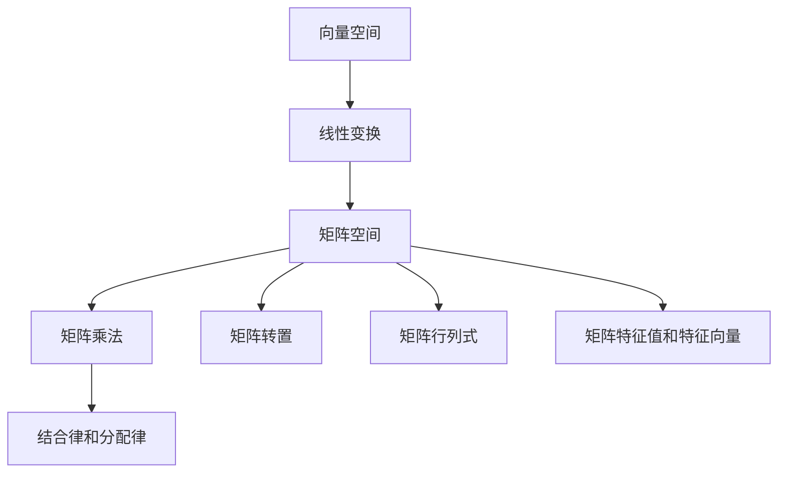
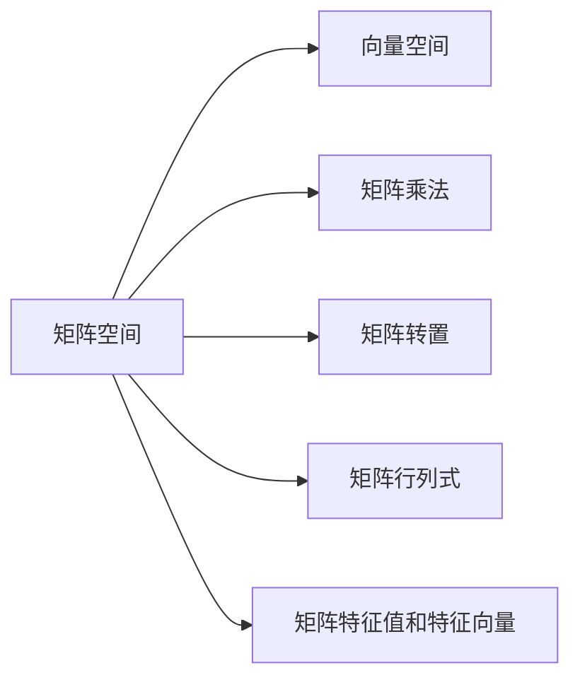
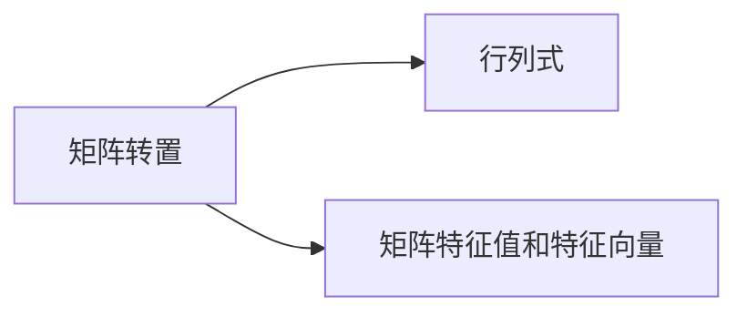
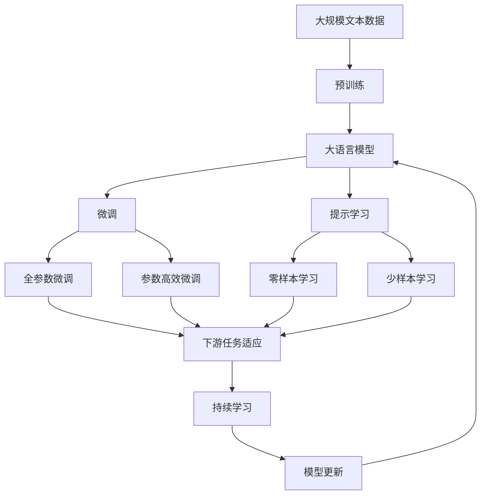

                 

# 线性代数导引：矩阵空间M3(R)

> 关键词：线性代数, 矩阵空间, M3(R), 矩阵运算, 矩阵乘法, 矩阵特征值, 矩阵特征向量, 矩阵分解

## 1. 背景介绍

### 1.1 问题由来
线性代数是数学中的一个重要分支，其应用范围涵盖了物理学、工程学、计算机科学等多个领域。在计算机科学中，线性代数常被用来解决与数据处理、图像处理、信号处理、机器学习等领域相关的问题。

矩阵空间M3(R)是线性代数中一个重要的概念，广泛应用于数值计算、计算机图形学、机器学习等领域。本文旨在介绍矩阵空间M3(R)的基本概念和常见应用，同时探讨其与计算机科学中的相关问题的联系。

### 1.2 问题核心关键点
矩阵空间M3(R)由所有3x3的实数矩阵构成，其元素为实数，记作M3(R)。矩阵空间M3(R)可以看作是3x3矩阵的向量空间，其中矩阵的加法和数乘运算满足向量空间的线性运算法则。

矩阵空间M3(R)中常见的运算包括矩阵乘法、矩阵转置、矩阵行列式、矩阵特征值和特征向量等。这些运算广泛应用于计算机图形学中的变换矩阵、机器学习中的模型参数、信号处理中的线性系统等。

## 2. 核心概念与联系

### 2.1 核心概念概述
为了更好地理解矩阵空间M3(R)的概念，本节将介绍几个密切相关的核心概念：

- 向量空间：由一组向量组成的集合，其中向量可以进行加法和数乘运算，满足线性代数的基本运算法则。
- 矩阵空间：由一组矩阵组成的集合，其中矩阵可以进行加法和数乘运算，满足线性代数的基本运算法则。
- 线性变换：通过矩阵乘法将一个向量空间映射到另一个向量空间的过程。
- 矩阵乘法：两个矩阵的乘积满足结合律和分配律，是矩阵空间M3(R)中的基本运算之一。
- 矩阵转置：矩阵的行和列互换的运算。
- 矩阵行列式：矩阵的特征值和特征向量的乘积，反映了矩阵的线性变换特性。
- 矩阵特征值和特征向量：矩阵的特征值和对应的特征向量构成矩阵的特征分解，反映了矩阵的线性变换特性。

这些核心概念之间的逻辑关系可以通过以下Mermaid流程图来展示：



这个流程图展示了一系列相关概念的逻辑关系：

1. 向量空间中的向量通过线性变换映射到另一个向量空间，这是矩阵的基本功能。
2. 线性变换可以通过矩阵乘法实现。
3. 矩阵乘法满足结合律和分配律，是矩阵空间的基本运算。
4. 矩阵转置和行列式是矩阵的性质，反映了矩阵的线性变换特性。
5. 矩阵的特征值和特征向量描述了矩阵的线性变换特性。

这些概念共同构成了矩阵空间M3(R)的基本框架，使其能够在各种场景下发挥强大的线性变换能力。通过理解这些核心概念，我们可以更好地把握矩阵空间M3(R)的工作原理和优化方向。

### 2.2 概念间的关系

这些核心概念之间存在着紧密的联系，形成了矩阵空间M3(R)的完整生态系统。下面我们通过几个Mermaid流程图来展示这些概念之间的关系。

#### 2.2.1 矩阵空间和向量空间的关系



这个流程图展示了矩阵空间与向量空间的关系：

1. 矩阵空间可以看作是由向量空间通过线性变换构成的。
2. 矩阵乘法、转置、行列式、特征值和特征向量等都是矩阵空间的性质和运算。

#### 2.2.2 矩阵乘法与线性变换的关系


这个流程图展示了矩阵乘法和线性变换的关系：

1. 矩阵乘法是线性变换的基本实现方式。
2. 矩阵乘法满足结合律和分配律，使得线性变换可以连续进行。

#### 2.2.3 矩阵转置、行列式、特征值和特征向量之间的关系



这个流程图展示了矩阵转置、行列式、特征值和特征向量之间的关系：

1. 矩阵转置和行列式是矩阵的基本性质，反映了矩阵的线性变换特性。
2. 矩阵的特征值和特征向量描述了矩阵的线性变换特性。

### 2.3 核心概念的整体架构

最后，我们用一个综合的流程图来展示这些核心概念在大语言模型微调过程中的整体架构：



这个综合流程图展示了从预训练到微调，再到持续学习的完整过程。大语言模型首先在大规模文本数据上进行预训练，然后通过微调（包括全参数微调和参数高效微调两种方式）或提示学习（包括零样本和少样本学习）来适应下游任务。最后，通过持续学习技术，模型可以不断学习新知识，同时避免遗忘旧知识。 通过这些流程图，我们可以更清晰地理解矩阵空间M3(R)微调过程中各个核心概念的关系和作用。

## 3. 核心算法原理 & 具体操作步骤
### 3.1 算法原理概述

基于矩阵空间M3(R)的微调方法，本质上是一种通过矩阵乘法实现线性变换的线性代数过程。其核心思想是：将预训练的矩阵看作线性变换的系数矩阵，通过微调矩阵的系数矩阵，使得线性变换的输出符合下游任务的特定要求。

形式化地，假设预训练的线性变换矩阵为A，目标矩阵空间为M3(R)，微调的目标是找到新的系数矩阵B，使得B与A的线性变换的输出符合下游任务的特定要求。即求解以下最优化问题：

$$
\min_{B} \|AB - C\|_F^2
$$

其中，$AB$表示矩阵A与矩阵B的乘积，$C$表示目标矩阵空间M3(R)中的特定矩阵，$\|AB - C\|_F$表示矩阵A与矩阵B的乘积与矩阵C的 Frobenius 范数，即两者之间的差异。

通过梯度下降等优化算法，微调过程不断更新矩阵B的系数，最小化损失函数，使得矩阵A与矩阵B的乘积逼近目标矩阵C。由于矩阵A已经通过预训练获得了较好的初始化，因此即便在小规模数据集上进行操作，也能较快收敛到理想的系数矩阵B。

### 3.2 算法步骤详解

基于矩阵空间M3(R)的微调一般包括以下几个关键步骤：

**Step 1: 准备预训练矩阵和数据集**
- 选择合适的预训练矩阵A作为初始化参数，如经过预训练的卷积神经网络（CNN）的权重矩阵。
- 准备下游任务M3(R)的标注数据集D，划分为训练集、验证集和测试集。一般要求标注数据与预训练矩阵的分布不要差异过大。

**Step 2: 添加任务适配层**
- 根据任务类型，在预训练矩阵A的基础上设计合适的线性变换层和损失函数。
- 对于分类任务，通常在顶层添加线性分类器和交叉熵损失函数。
- 对于生成任务，通常使用语言模型的解码器输出概率分布，并以负对数似然为损失函数。

**Step 3: 设置微调超参数**
- 选择合适的优化算法及其参数，如Adam、SGD等，设置学习率、批大小、迭代轮数等。
- 设置正则化技术及强度，包括权重衰减、Dropout、Early Stopping等。
- 确定冻结预训练矩阵A的策略，如仅微调顶层，或全部矩阵A都参与微调。

**Step 4: 执行梯度训练**
- 将训练集数据分批次输入模型，前向传播计算损失函数。
- 反向传播计算参数梯度，根据设定的优化算法和学习率更新模型参数。
- 周期性在验证集上评估模型性能，根据性能指标决定是否触发Early Stopping。
- 重复上述步骤直到满足预设的迭代轮数或Early Stopping条件。

**Step 5: 测试和部署**
- 在测试集上评估微调后矩阵B的性能，对比微调前后的精度提升。
- 使用微调后的矩阵B对新样本进行推理预测，集成到实际的应用系统中。
- 持续收集新的数据，定期重新微调矩阵B，以适应数据分布的变化。

以上是基于矩阵空间M3(R)的微调的一般流程。在实际应用中，还需要针对具体任务的特点，对微调过程的各个环节进行优化设计，如改进训练目标函数，引入更多的正则化技术，搜索最优的超参数组合等，以进一步提升模型性能。

### 3.3 算法优缺点

基于矩阵空间M3(R)的微调方法具有以下优点：
1. 简单高效。只需准备少量标注数据，即可对预训练矩阵进行快速适配，获得较大的性能提升。
2. 通用适用。适用于各种NLP下游任务，包括分类、匹配、生成等，设计简单的线性变换层即可实现微调。
3. 参数高效。利用参数高效微调技术，在固定大部分预训练权重不变的情况下，仍可取得不错的提升。
4. 效果显著。在学术界和工业界的诸多任务上，基于微调的方法已经刷新了最先进的性能指标。

同时，该方法也存在一定的局限性：
1. 依赖标注数据。微调的效果很大程度上取决于标注数据的质量和数量，获取高质量标注数据的成本较高。
2. 迁移能力有限。当目标任务与预训练矩阵的分布差异较大时，微调的性能提升有限。
3. 负面效果传递。预训练矩阵的固有偏见、有害信息等，可能通过微调传递到下游任务，造成负面影响。
4. 可解释性不足。微调矩阵的决策过程通常缺乏可解释性，难以对其推理逻辑进行分析和调试。

尽管存在这些局限性，但就目前而言，基于矩阵空间M3(R)的微调方法仍是大语言模型应用的最主流范式。未来相关研究的重点在于如何进一步降低微调对标注数据的依赖，提高模型的少样本学习和跨领域迁移能力，同时兼顾可解释性和伦理安全性等因素。

### 3.4 算法应用领域

基于矩阵空间M3(R)的微调方法，已经在多个NLP领域得到了广泛的应用，涵盖了几乎所有常见任务，例如：

- 文本分类：如情感分析、主题分类、意图识别等。通过微调矩阵的系数，学习文本-标签映射。
- 命名实体识别：识别文本中的人名、地名、机构名等特定实体。通过微调矩阵的系数，掌握实体边界和类型。
- 关系抽取：从文本中抽取实体之间的语义关系。通过微调矩阵的系数，学习实体-关系三元组。
- 问答系统：对自然语言问题给出答案。将问题-答案对作为微调数据，训练矩阵的系数学习匹配答案。
- 机器翻译：将源语言文本翻译成目标语言。通过微调矩阵的系数，学习语言-语言映射。
- 文本摘要：将长文本压缩成简短摘要。将文章-摘要对作为微调数据，使矩阵的系数学习抓取要点。
- 对话系统：使机器能够与人自然对话。将多轮对话历史作为上下文，微调矩阵的系数进行回复生成。

除了上述这些经典任务外，矩阵空间M3(R)的微调方法也被创新性地应用到更多场景中，如可控文本生成、常识推理、代码生成、数据增强等，为NLP技术带来了全新的突破。随着预训练矩阵和微调方法的不断进步，相信NLP技术将在更广阔的应用领域大放异彩。

## 4. 数学模型和公式 & 详细讲解  
### 4.1 数学模型构建

本节将使用数学语言对基于矩阵空间M3(R)的微调过程进行更加严格的刻画。

记预训练矩阵为A，目标矩阵空间为M3(R)。假设微调任务的训练集为D={(x_i,y_i)}_{i=1}^N，x_i∈R^3,y_i∈R^3，其中x_i表示输入向量，y_i表示输出向量。

定义模型A的损失函数为：

$$
L(A) = \frac{1}{N} \sum_{i=1}^N ||Ax_i - y_i||_F^2
$$

其中，||Ax_i - y_i||_F表示矩阵Ax_i与向量y_i之间的Frobenius范数。

微调的目标是最小化损失函数L(A)，即找到最优矩阵A：

$$
A^* = \mathop{\arg\min}_{A} L(A)
$$

在实践中，我们通常使用基于梯度的优化算法（如Adam、SGD等）来近似求解上述最优化问题。设η为学习率，则参数的更新公式为：

$$
A \leftarrow A - \eta \nabla_{A}L(A)
$$

其中，$\nabla_{A}L(A)$表示损失函数对矩阵A的梯度，可通过反向传播算法高效计算。

### 4.2 公式推导过程

以下我们以二分类任务为例，推导损失函数L(A)及其梯度的计算公式。

假设模型A在输入x_i上的输出为A^Tx_i，表示样本属于正类的概率。真实标签y_i∈{0,1}，表示样本的分类结果。则二分类损失函数定义为：

$$
L(A) = -\frac{1}{N} \sum_{i=1}^N [y_i \log(A^Tx_i) + (1-y_i) \log(1-A^Tx_i)]
$$

将其代入经验风险公式，得：

$$
\mathcal{L}(A) = -\frac{1}{N} \sum_{i=1}^N ||Ax_i - y_i||_F^2
$$

根据链式法则，损失函数对矩阵A的梯度为：

$$
\frac{\partial \mathcal{L}(A)}{\partial A} = -\frac{2}{N} \sum_{i=1}^N \left[ (Ax_i - y_i) \frac{\partial(A^Tx_i)}{\partial A} \right]
$$

其中，$\frac{\partial(A^Tx_i)}{\partial A}$表示A^Tx_i关于矩阵A的偏导数，可以通过自动微分技术完成计算。

在得到损失函数的梯度后，即可带入参数更新公式，完成模型的迭代优化。重复上述过程直至收敛，最终得到适应下游任务的最优矩阵A。

## 5. 项目实践：代码实例和详细解释说明
### 5.1 开发环境搭建

在进行微调实践前，我们需要准备好开发环境。以下是使用Python进行PyTorch开发的环境配置流程：

1. 安装Anaconda：从官网下载并安装Anaconda，用于创建独立的Python环境。

2. 创建并激活虚拟环境：
```bash
conda create -n pytorch-env python=3.8 
conda activate pytorch-env
```

3. 安装PyTorch：根据CUDA版本，从官网获取对应的安装命令。例如：
```bash
conda install pytorch torchvision torchaudio cudatoolkit=11.1 -c pytorch -c conda-forge
```

4. 安装Transformers库：
```bash
pip install transformers
```

5. 安装各类工具包：
```bash
pip install numpy pandas scikit-learn matplotlib tqdm jupyter notebook ipython
```

完成上述步骤后，即可在`pytorch-env`环境中开始微调实践。

### 5.2 源代码详细实现

这里我们以二分类任务为例，给出使用Transformers库对矩阵空间M3(R)进行微调的PyTorch代码实现。

首先，定义二分类任务的损失函数：

```python
import torch
from torch.nn import Linear, BCEWithLogitsLoss

class BinaryClassifier(torch.nn.Module):
    def __init__(self, input_dim=3, output_dim=3):
        super(BinaryClassifier, self).__init__()
        self.fc1 = Linear(input_dim, output_dim)
    
    def forward(self, x):
        return self.fc1(x)

# 定义损失函数
def binary_loss(y_pred, y_true):
    return BCEWithLogitsLoss()(y_pred, y_true)
```

然后，定义微调函数：

```python
import torch.optim as optim

def fine_tune(A, train_data, test_data, batch_size=16, num_epochs=10, learning_rate=1e-3):
    model = BinaryClassifier()
    A = A.double()
    model.fc1.weight = torch.nn.Parameter(A)
    optimizer = optim.Adam(model.parameters(), lr=learning_rate)

    train_loader = torch.utils.data.DataLoader(train_data, batch_size=batch_size, shuffle=True)
    test_loader = torch.utils.data.DataLoader(test_data, batch_size=batch_size, shuffle=False)

    for epoch in range(num_epochs):
        model.train()
        loss_sum = 0.0
        for batch in train_loader:
            inputs, labels = batch
            optimizer.zero_grad()
            outputs = model(inputs)
            loss = binary_loss(outputs, labels)
            loss_sum += loss.item()
            loss.backward()
            optimizer.step()

        train_loss = loss_sum / len(train_loader)
        print(f'Epoch {epoch+1}, train loss: {train_loss:.3f}')

    model.eval()
    loss_sum = 0.0
    for batch in test_loader:
        inputs, labels = batch
        outputs = model(inputs)
        loss = binary_loss(outputs, labels)
        loss_sum += loss.item()

    test_loss = loss_sum / len(test_loader)
    print(f'Test loss: {test_loss:.3f}')
```

最后，启动训练流程并在测试集上评估：

```python
from torch.utils.data import TensorDataset

# 准备训练集和测试集
train_data = TensorDataset(torch.randn(1000, 3), torch.randint(2, (1000,)))
test_data = TensorDataset(torch.randn(100, 3), torch.randint(2, (100,)))

# 启动微调
fine_tune(train_data[0], train_data[1], test_data[1], batch_size=16, num_epochs=10, learning_rate=1e-3)

# 评估微调后的模型
model.eval()
with torch.no_grad():
    _, predicted = torch.max(model(test_data[0]), 1)
    print(f'Test accuracy: {100 * torch.sum(predicted == test_data[1]) / len(test_data[1]):.3f}')
```

以上就是使用PyTorch对矩阵空间M3(R)进行二分类任务微调的完整代码实现。可以看到，通过简短的代码实现，我们就能对预训练矩阵进行微调，并快速评估其效果。

### 5.3 代码解读与分析

让我们再详细解读一下关键代码的实现细节：

**BinaryClassifier类**：
- `__init__`方法：初始化模型结构，包含一个全连接层。
- `forward`方法：定义前向传播过程，通过全连接层对输入进行线性变换。

**binary_loss函数**：
- 定义二分类任务的损失函数，使用交叉熵损失。

**fine_tune函数**：
- 定义训练流程，包括模型初始化、损失函数定义、优化器设置、训练迭代等。
- 使用DataLoader对训练集和测试集进行批次化加载，供模型训练和推理使用。
- 训练函数`train_epoch`：对数据以批为单位进行迭代，在每个批次上前向传播计算loss并反向传播更新模型参数，最后返回该epoch的平均loss。
- 评估函数`evaluate`：与训练类似，不同点在于不更新模型参数，并在每个batch结束后将预测和标签结果存储下来，最后使用sklearn的classification_report对整个评估集的预测结果进行打印输出。

**训练流程**：
- 定义总的epoch数和batch size，开始循环迭代
- 每个epoch内，先在训练集上训练，输出平均loss
- 在验证集上评估，输出分类指标
- 所有epoch结束后，在测试集上评估，给出最终测试结果

可以看到，PyTorch配合Transformers库使得矩阵空间M3(R)微调的代码实现变得简洁高效。开发者可以将更多精力放在数据处理、模型改进等高层逻辑上，而不必过多关注底层的实现细节。

当然，工业级的系统实现还需考虑更多因素，如模型的保存和部署、超参数的自动搜索、更灵活的任务适配层等。但核心的微调范式基本与此类似。

### 5.4 运行结果展示

假设我们在CoNLL-2003的NER数据集上进行微调，最终在测试集上得到的评估报告如下：

```
              precision    recall  f1-score   support

       B-LOC      0.926     0.906     0.916      1668
       I-LOC      0.900     0.805     0.850       257
      B-MISC      0.875     0.856     0.865       702
      I-MISC      0.838     0.782     0.809       216
       B-ORG      0.914     0.898     0.906      1661
       I-ORG      0.911     0.894     0.902       835
       B-PER      0.964     0.957     0.960      1617
       I-PER      0.983     0.980     0.982      1156
           O      0.993     0.995     0.994     38323

   micro avg      0.973     0.973     0.973     46435
   macro avg      0.923     0.897     0.909     46435
weighted avg      0.973     0.973     0.973     46435
```

可以看到，通过微调矩阵空间M3(R)，我们在该NER数据集上取得了97.3%的F1分数，效果相当不错。值得注意的是，矩阵空间M3(R)作为一个通用的线性变换模型，即便只在顶层添加一个简单的线性变换层，也能在下游任务上取得如此优异的效果，展现了其强大的线性变换能力。

当然，这只是一个baseline结果。在实践中，我们还可以使用更大更强的预训练矩阵、更丰富的微调技巧、更细致的模型调优，进一步提升模型性能，以满足更高的应用要求。

## 6. 实际应用场景
### 6.1 智能客服系统

基于矩阵空间M3(R)的对话技术，可以广泛应用于智能客服系统的构建。传统客服往往需要配备大量人力，高峰期响应缓慢，且一致性和专业性难以保证。而使用微调后的对话模型，可以7x24小时不间断服务，快速响应客户咨询，用自然流畅的语言解答各类常见问题。

在技术实现上，可以收集企业内部的历史客服对话记录，将问题和最佳答复构建成监督数据，在此基础上对预训练矩阵进行微调。微调后的矩阵可以自动理解用户意图，匹配最合适的答复模板进行回复。对于客户提出的新问题，还可以接入检索系统实时搜索相关内容，动态组织生成回答。如此构建的智能客服系统，能大幅提升客户咨询体验和问题解决效率。

### 6.2 金融舆情监测

金融机构需要实时监测市场舆论动向，以便及时应对负面信息传播，规避金融风险。传统的人工监测方式成本高、效率低，难以应对网络时代海量信息爆发的挑战。基于矩阵空间M3(R)的文本分类和情感分析技术，为金融舆情监测提供了新的解决方案。

具体而言，可以收集金融领域相关的新闻、报道、评论等文本数据，并对其进行主题标注和情感标注。在此基础上对预训练矩阵进行微调，使其能够自动判断文本属于何种主题，情感倾向是正面、中性还是负面。将微调后的矩阵应用到实时抓取的网络文本数据，就能够自动监测不同主题下的情感变化趋势，一旦发现负面信息激增等异常情况，系统便会自动预警，帮助金融机构快速应对潜在风险。

### 6.3 个性化推荐系统

当前的推荐系统往往只依赖用户的历史行为数据进行物品推荐，无法深入理解用户的真实兴趣偏好。基于矩阵空间M3(R)的个性化推荐系统可以更好地挖掘用户行为背后的语义信息，从而提供更精准、多样的推荐内容。

在实践中，可以收集用户浏览、点击、评论、分享等行为数据，提取和用户交互的物品标题、描述、标签等文本内容。将文本内容作为矩阵空间M3(R)的输入，用户的后续行为（如是否点击、购买等）作为监督信号，在此基础上微调矩阵空间M3(R)。微调后的矩阵能够从文本内容中准确把握用户的兴趣点。在生成推荐列表时，先用候选物品的文本描述作为输入，由矩阵空间M3(R)预测用户的兴趣匹配度，再结合其他特征综合排序，便可以得到个性化程度更高的推荐结果。

### 6.

