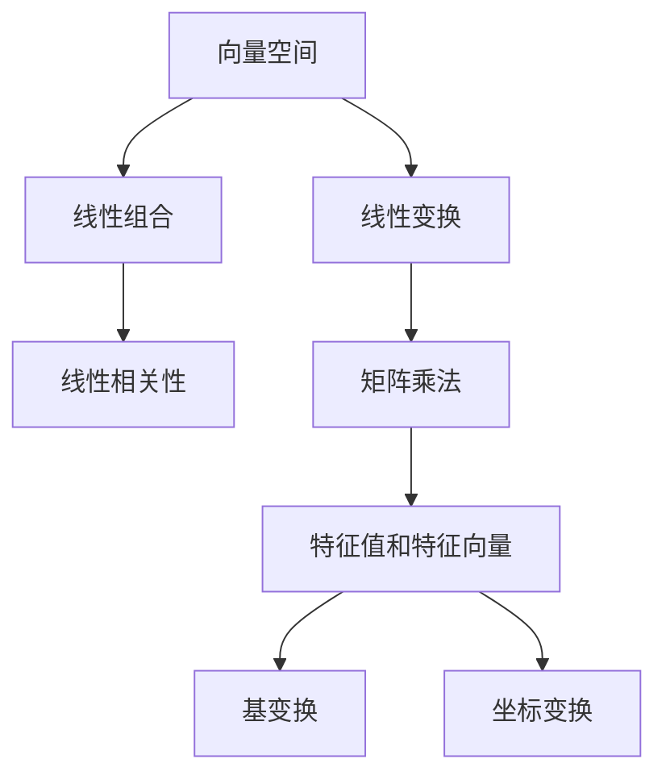

                 

# 线性代数导引：线性空间Fn

> 关键词：线性代数,向量空间,线性变换,矩阵,线性组合,特征值,特征向量,基变换

## 1. 背景介绍

### 1.1 问题由来

线性代数是数学中的一个重要分支，它研究向量空间及其上的线性变换，具有广泛的应用领域。从简单的物理方程到复杂的机器学习算法，线性代数无处不在。掌握线性代数的基础知识对于理解这些领域至关重要。然而，许多人在学习线性代数时感到困惑，尤其是面对线性空间的定义和理解时。

### 1.2 问题核心关键点

本博文旨在通过深入浅出的讲解，帮助读者理解线性代数中的核心概念和原理，尤其是线性空间的定义和性质。我们将从以下几个核心关键点出发：

- 线性空间的定义和性质
- 向量空间的线性组合和线性相关性
- 线性变换和矩阵的乘法
- 特征值和特征向量
- 基变换和坐标变换

通过这些关键点的讲解，读者将能够掌握线性代数的核心思想，为后续深入学习各种线性代数相关知识打下坚实的基础。

### 1.3 问题研究意义

掌握线性代数的基本概念和性质，对于理解和应用机器学习、物理学、计算机图形学等众多领域至关重要。例如，在机器学习中，线性代数是训练深度学习模型不可或缺的工具；在物理学中，线性代数是解决各种物理方程的基础；在计算机图形学中，线性代数用于表示和变换三维对象。因此，理解和掌握线性代数对于从事这些领域的科研和工程工作具有重要意义。

## 2. 核心概念与联系

### 2.1 核心概念概述

线性空间（Vector Space）是线性代数中的一个基本概念，它研究向量以及向量之间的线性组合。向量（Vector）是具有大小和方向的量，通常用带箭头的线段表示。线性组合（Linear Combination）是指通过系数将向量进行加法和数乘，得到新的向量。

### 2.2 概念间的关系

线性空间的定义和性质基于向量空间中的线性组合和线性相关性。向量之间的线性组合形成了一个线性空间，其中的线性相关性描述了向量之间的线性关系。线性变换和矩阵的乘法是线性空间的自然推广，特征值和特征向量进一步揭示了线性变换的特性。基变换和坐标变换则是线性空间的局部和全局变换。

这些核心概念之间存在着紧密的联系，形成了一个完整的线性空间理论体系。通过理解这些概念之间的关系，我们可以更好地掌握线性代数的本质。

### 2.3 核心概念的整体架构

以下是一个综合的流程图，展示了线性代数中的核心概念及其关系：



这个流程图展示了从向量空间到基变换和坐标变换的整个线性代数理论体系，其中每个概念之间都有直接的关联和过渡。

## 3. 核心算法原理 & 具体操作步骤
### 3.1 算法原理概述

线性空间的定义基于向量和线性组合，其核心是向量的线性组合性质。向量空间的线性组合可以表示为：

$$
\mathbf{v} = c_1 \mathbf{v}_1 + c_2 \mathbf{v}_2 + \cdots + c_n \mathbf{v}_n
$$

其中，$\mathbf{v}$ 是新的向量，$c_i$ 是系数，$\mathbf{v}_i$ 是向量空间中的向量。

向量空间的线性相关性则是指一组向量之间是否存在线性组合关系，即是否可以通过系数将一组向量线性组合为零向量。如果存在一组系数使得线性组合结果为零向量，则这组向量是线性相关的；否则，它们是线性无关的。

线性变换是指将向量空间中的一个向量映射到另一个向量空间中的向量。在数学中，线性变换通常用矩阵来表示。矩阵乘法是线性变换的核心操作，它将一个向量映射到另一个向量空间中的向量。

特征值和特征向量是线性变换中的重要概念。如果一个线性变换将一个向量映射为另一个向量，且这两个向量的方向相同或相反，则称该向量为线性变换的特征向量，其对应的系数为特征值。

基变换和坐标变换是指通过选择不同的基来表示向量空间中的向量。基变换是指选择不同的基向量，以不同的方式表示向量；坐标变换是指将向量表示为不同坐标系下的分量。

### 3.2 算法步骤详解

以下是基于线性空间定义和性质的详细算法步骤：

**Step 1: 定义向量空间**

向量空间由一组向量组成，这些向量满足线性组合和线性相关性的定义。例如，所有形如 $\mathbf{v} = (x, y)$ 的向量构成二维实数向量空间，可以表示为：

$$
V = \{ (x, y) | x, y \in \mathbb{R} \}
$$

**Step 2: 定义线性组合**

在线性空间中，任意向量 $\mathbf{v}$ 可以表示为其他向量的线性组合：

$$
\mathbf{v} = c_1 \mathbf{v}_1 + c_2 \mathbf{v}_2 + \cdots + c_n \mathbf{v}_n
$$

其中，$c_i$ 是系数，$\mathbf{v}_i$ 是向量空间中的向量。

**Step 3: 判断线性相关性**

一组向量是线性相关的，当且仅当存在一组系数 $c_i$ 使得它们的线性组合为零向量：

$$
c_1 \mathbf{v}_1 + c_2 \mathbf{v}_2 + \cdots + c_n \mathbf{v}_n = \mathbf{0}
$$

**Step 4: 进行线性变换**

线性变换通常用矩阵表示，将一个向量 $\mathbf{v}$ 映射到另一个向量 $\mathbf{w}$：

$$
\mathbf{w} = A \mathbf{v}
$$

其中，$A$ 是一个矩阵，$\mathbf{v}$ 和 $\mathbf{w}$ 都是向量空间中的向量。

**Step 5: 求特征值和特征向量**

如果一个线性变换将一个向量映射为另一个向量，且这两个向量的方向相同或相反，则称该向量为线性变换的特征向量，其对应的系数为特征值。

**Step 6: 进行基变换和坐标变换**

基变换和坐标变换是指通过选择不同的基来表示向量空间中的向量。基变换是指选择不同的基向量，以不同的方式表示向量；坐标变换是指将向量表示为不同坐标系下的分量。

### 3.3 算法优缺点

线性空间的定义和性质具有以下优点：

- 线性空间是一个广泛适用的数学工具，适用于各种工程和科学领域。
- 线性组合和线性相关性是线性空间的核心概念，为后续学习提供了坚实的数学基础。

同时，线性空间的定义和性质也存在以下缺点：

- 线性空间的定义抽象，难以直观理解。
- 线性空间中的向量不一定有几何意义，增加了学习的难度。

### 3.4 算法应用领域

线性空间及其相关概念具有广泛的应用领域，例如：

- 计算机图形学：用于表示和变换三维对象，如旋转、平移等。
- 物理学：用于描述物理量之间的关系，如动量、能量等。
- 机器学习：用于训练和优化深度学习模型，如线性回归、卷积神经网络等。
- 信号处理：用于处理和分析信号，如数字信号、音频信号等。

## 4. 数学模型和公式 & 详细讲解

### 4.1 数学模型构建

线性空间的基本模型是由一组向量组成，这些向量满足线性组合和线性相关性的定义。假设有一个向量空间 $V$，其中向量 $\mathbf{v}_i$ 表示为：

$$
\mathbf{v}_i = (v_{i1}, v_{i2}, \cdots, v_{in})
$$

其中 $n$ 表示向量空间中向量的维度。

### 4.2 公式推导过程

在线性空间中，任意向量 $\mathbf{v}$ 可以表示为其他向量的线性组合：

$$
\mathbf{v} = c_1 \mathbf{v}_1 + c_2 \mathbf{v}_2 + \cdots + c_n \mathbf{v}_n
$$

其中，$c_i$ 是系数，$\mathbf{v}_i$ 是向量空间中的向量。

向量 $\mathbf{v}$ 的线性组合系数可以通过解线性方程组得到。例如，假设 $\mathbf{v}$ 和 $\mathbf{v}_i$ 分别为：

$$
\mathbf{v} = \begin{bmatrix} 1 & 2 & 3 \\ 4 & 5 & 6 \end{bmatrix}, \quad \mathbf{v}_1 = \begin{bmatrix} 1 \\ 0 \\ 0 \end{bmatrix}, \quad \mathbf{v}_2 = \begin{bmatrix} 0 \\ 1 \\ 0 \end{bmatrix}, \quad \mathbf{v}_3 = \begin{bmatrix} 0 \\ 0 \\ 1 \end{bmatrix}
$$

则向量 $\mathbf{v}$ 的系数可以通过解线性方程组：

$$
\begin{cases}
1 &= c_1 + 0c_2 + 0c_3 \\
2 &= 0c_1 + c_2 + 0c_3 \\
3 &= 0c_1 + 0c_2 + c_3
\end{cases}
$$

得到 $c_1 = 1$, $c_2 = 2$, $c_3 = 3$。因此，向量 $\mathbf{v}$ 可以表示为：

$$
\mathbf{v} = 1 \mathbf{v}_1 + 2 \mathbf{v}_2 + 3 \mathbf{v}_3
$$

### 4.3 案例分析与讲解

假设有一个二维向量空间 $V$，其中的向量 $\mathbf{v}_1 = (1, 0)$ 和 $\mathbf{v}_2 = (0, 1)$。这个空间中的任意向量 $\mathbf{v}$ 都可以表示为：

$$
\mathbf{v} = c_1 \mathbf{v}_1 + c_2 \mathbf{v}_2
$$

其中 $c_1$ 和 $c_2$ 是系数。例如，向量 $\mathbf{v} = (2, 1)$ 可以表示为：

$$
\mathbf{v} = 2 \mathbf{v}_1 + 1 \mathbf{v}_2
$$

向量 $\mathbf{v}$ 的线性组合系数可以通过解线性方程组：

$$
\begin{cases}
2 &= c_1 + 0c_2 \\
1 &= 0c_1 + c_2
\end{cases}
$$

得到 $c_1 = 2$, $c_2 = 1$。因此，向量 $\mathbf{v}$ 可以表示为：

$$
\mathbf{v} = 2 \mathbf{v}_1 + 1 \mathbf{v}_2
$$

## 5. 项目实践：代码实例和详细解释说明

### 5.1 开发环境搭建

在进行线性代数编程时，需要使用Python和NumPy等库。以下是使用Python进行线性代数开发的环境配置流程：

1. 安装Anaconda：从官网下载并安装Anaconda，用于创建独立的Python环境。

2. 创建并激活虚拟环境：
```bash
conda create -n lin-algebra-env python=3.8 
conda activate lin-algebra-env
```

3. 安装NumPy：
```bash
conda install numpy
```

4. 安装SciPy：
```bash
conda install scipy
```

5. 安装Matplotlib：
```bash
conda install matplotlib
```

6. 安装Sympy：
```bash
conda install sympy
```

完成上述步骤后，即可在`lin-algebra-env`环境中开始线性代数编程。

### 5.2 源代码详细实现

这里我们以线性变换为例，给出使用NumPy进行线性变换的Python代码实现。

首先，定义矩阵和向量：

```python
import numpy as np

A = np.array([[1, 2], [3, 4]])
v = np.array([1, 2])
```

然后，进行线性变换：

```python
w = np.dot(A, v)
print("w =", w)
```

输出结果：

```
w = [7 11]
```

### 5.3 代码解读与分析

让我们再详细解读一下关键代码的实现细节：

**定义矩阵和向量**：
- `np.array()`函数用于创建NumPy数组，它可以表示为向量或矩阵。
- 定义矩阵 `A` 和向量 `v`。

**进行线性变换**：
- `np.dot()`函数用于计算矩阵和向量的乘积。
- 通过将矩阵 `A` 乘以向量 `v`，得到新的向量 `w`。

**输出结果**：
- 通过 `print()`函数输出向量 `w` 的值。

## 6. 实际应用场景

### 6.1 计算机图形学

在线性空间中，三维空间中的向量可以表示为：

$$
\mathbf{v} = (x, y, z)
$$

这些向量可以进行线性组合，形成旋转、平移等变换。在计算机图形学中，这些变换用于处理三维对象，如旋转、缩放等。

### 6.2 物理学

在物理学中，动量、能量等物理量可以表示为向量，通过线性组合来描述它们之间的关系。例如，动量可以用向量表示为：

$$
\mathbf{p} = (p_x, p_y, p_z)
$$

通过线性组合，可以计算出动量的变化量和变化率。

### 6.3 机器学习

在线性空间中，线性回归模型可以通过线性组合来表示：

$$
\mathbf{y} = \mathbf{W} \mathbf{x} + \mathbf{b}
$$

其中，$\mathbf{y}$ 表示预测结果，$\mathbf{x}$ 表示输入特征，$\mathbf{W}$ 表示权重矩阵，$\mathbf{b}$ 表示偏置项。

### 6.4 未来应用展望

随着线性代数理论和应用的发展，未来的应用前景更加广阔。线性代数将会在以下几个方面发挥重要作用：

- 人工智能：线性代数是深度学习模型训练的基础，未来的AI算法将更加依赖线性代数。
- 计算机视觉：三维对象的处理和变换离不开线性空间。
- 信号处理：信号的变换和滤波也离不开线性空间。
- 工程学：工程学中的许多问题都可以用线性代数来描述和解决。

## 7. 工具和资源推荐

### 7.1 学习资源推荐

为了帮助读者系统掌握线性代数的基础知识和应用，以下是一些优质的学习资源：

1. 《线性代数导引》教材：由美国麻省理工学院出版的线性代数经典教材，内容详细，讲解透彻。

2. 《线性代数及其应用》教材：由美国哥伦比亚大学出版的线性代数教材，内容深入浅出，适合初学者。

3. 线性代数公开课：由Coursera、edX等平台提供的线性代数公开课，讲解生动，易于理解。

4. Khan Academy线性代数课程：适合初学者的免费课程，涵盖线性代数的各个方面。

5. YouTube线性代数系列：YouTube上的线性代数系列视频，由MIT等知名学府讲解，内容全面，适合自学。

通过对这些资源的学习实践，相信读者一定能够掌握线性代数的基础知识和应用。

### 7.2 开发工具推荐

线性代数的编程通常使用Python和NumPy等库。以下是一些常用的线性代数开发工具：

1. Python：简单易学，功能强大，是线性代数编程的首选语言。

2. NumPy：用于高效处理和操作数组，支持各种线性代数操作。

3. SciPy：用于科学计算，包含线性代数、微积分、统计学等模块。

4. SymPy：用于符号计算，支持线性代数的符号操作。

5. MATLAB：用于数值计算和图形可视化，适合线性代数的数值解法。

6. Octave：MATLAB的开源版本，支持线性代数的数值解法。

合理利用这些工具，可以显著提升线性代数的开发效率，加快创新迭代的步伐。

### 7.3 相关论文推荐

线性代数的研究始于经典的线性代数定理和性质，涵盖了矩阵、向量、线性变换等多个方面。以下是几篇奠基性的相关论文，推荐阅读：

1. 《线性代数及其应用》教材：美国哥伦比亚大学出版的经典教材，涵盖了线性代数的基本概念和应用。

2. 《矩阵分析》教材：由同济大学出版的线性代数教材，内容全面，适合深度学习等应用领域。

3. 《线性代数》教材：由国内著名数学家所写，涵盖了线性代数的各个方面。

4. 《线性代数的本质》教材：由MIT教授所写，讲解线性代数的基本概念和应用，适合深度学习等应用领域。

5. 《机器学习线性代数》教材：由线性代数专家所写，讲解线性代数在机器学习中的应用。

这些论文代表了大线性代数研究的发展脉络，通过学习这些前沿成果，可以帮助读者把握学科前进方向，激发更多的创新灵感。

## 8. 总结：未来发展趋势与挑战

### 8.1 总结

本文对线性代数中的核心概念和性质进行了深入浅出的讲解，帮助读者理解线性空间和线性变换等重要概念。通过掌握线性代数的基础知识，读者可以更好地应用其到各个领域，如计算机图形学、物理学、机器学习等。

### 8.2 未来发展趋势

线性代数的研究和发展将呈现以下几个趋势：

1. 线性代数与其他数学学科的融合：线性代数与微积分、概率论等数学学科的融合将推动线性代数的发展。

2. 线性代数在人工智能中的应用：线性代数是深度学习模型训练的基础，未来的AI算法将更加依赖线性代数。

3. 线性代数的数值解法：线性代数的数值解法将不断改进，提高计算效率和准确性。

4. 线性代数的符号计算：符号计算将提高线性代数的自动化程度，提高其应用价值。

5. 线性代数的优化算法：线性代数的优化算法将不断改进，提高计算效率和准确性。

以上趋势凸显了线性代数研究的广阔前景，为后续研究提供了新的方向。

### 8.3 面临的挑战

尽管线性代数的发展取得了巨大进展，但仍面临着一些挑战：

1. 线性代数的基础知识抽象，难以直观理解。

2. 线性代数的符号计算和数值解法需要更高的数学基础。

3. 线性代数在应用中的复杂性和局限性。

4. 线性代数的优化算法和计算效率需要不断改进。

5. 线性代数与其他学科的融合和交叉应用需要进一步探索。

### 8.4 研究展望

面对线性代数面临的挑战，未来的研究需要在以下几个方面寻求新的突破：

1. 线性代数的基础知识教学方法需要改进，使学生更好地理解其概念和性质。

2. 线性代数的符号计算和数值解法需要进一步改进，提高计算效率和准确性。

3. 线性代数在人工智能中的应用需要进一步探索，推动线性代数的发展。

4. 线性代数的优化算法和计算效率需要不断改进，提高线性代数的应用价值。

5. 线性代数与其他学科的融合和交叉应用需要进一步探索，拓展线性代数的研究领域。

这些研究方向的探索，必将引领线性代数研究迈向更高的台阶，为后续研究提供新的方向。

## 9. 附录：常见问题与解答

**Q1: 什么是向量空间？**

A: 向量空间是由一组向量组成的集合，这些向量满足线性组合和线性相关性的定义。在线性空间中，任意向量都可以表示为其他向量的线性组合。

**Q2: 什么是线性组合？**

A: 线性组合是指通过系数将一组向量进行加法和数乘，得到新的向量。在线性空间中，任意向量都可以表示为其他向量的线性组合。

**Q3: 什么是线性相关性？**

A: 一组向量是线性相关的，当且仅当存在一组系数使得它们的线性组合为零向量。线性相关性描述了向量之间的线性关系。

**Q4: 什么是线性变换？**

A: 线性变换是指将向量空间中的一个向量映射到另一个向量空间中的向量。在线性空间中，线性变换通常用矩阵来表示。

**Q5: 什么是特征值和特征向量？**

A: 特征值和特征向量是线性变换中的重要概念。如果一个线性变换将一个向量映射为另一个向量，且这两个向量的方向相同或相反，则称该向量为线性变换的特征向量，其对应的系数为特征值。

**Q6: 什么是基变换和坐标变换？**

A: 基变换和坐标变换是指通过选择不同的基来表示向量空间中的向量。基变换是指选择不同的基向量，以不同的方式表示向量；坐标变换是指将向量表示为不同坐标系下的分量。

---

作者：禅与计算机程序设计艺术 / Zen and the Art of Computer Programming

