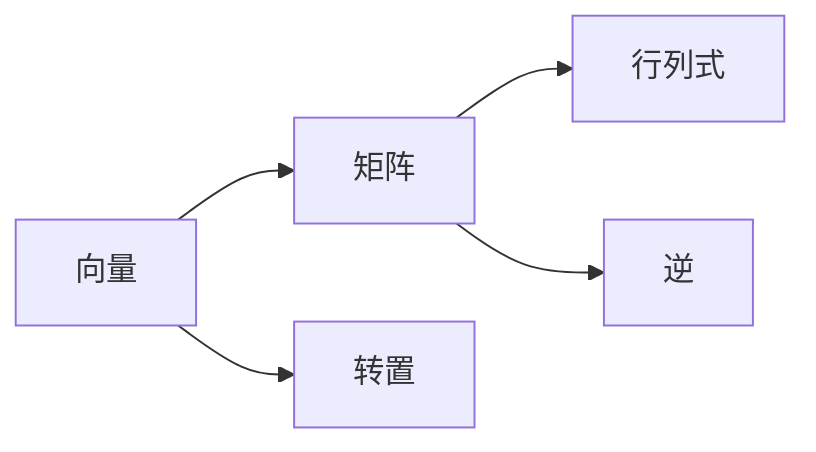
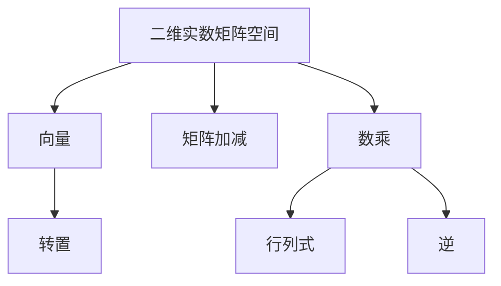

                 

# 线性代数导引：线性空间M2(R)

## 1. 背景介绍

线性代数作为数学的重要分支，广泛应用于物理学、工程学、计算机科学等众多领域。在计算机科学中，线性代数不仅提供了一套数学工具和理论，更为解决许多实际问题提供了强大的计算平台，如矩阵运算、特征值分解、奇异值分解等。本文将围绕M2(R)——二维实数矩阵空间展开，讲解线性代数的基本概念和操作，为读者提供线性空间M2(R)的导引。

## 2. 核心概念与联系

### 2.1 核心概念概述

M2(R)表示二维实数矩阵空间，即由所有2x2实数矩阵组成的集合。其中，每个矩阵可以用一个二元组$(a,b,c,d)$表示，即：
$$ A = \begin{bmatrix} a & b \\ c & d \end{bmatrix} $$

M2(R)中的元素称作向量，即二元组。矩阵的加法、数乘等基本运算规则如下：

- 矩阵加法：对任意两个矩阵$A = (a, b, c, d)$和$B = (e, f, g, h)$，其和为$A + B = (a + e, b + f, c + g, d + h)$。
- 数乘：任意实数$\lambda$与矩阵$A$的乘积为$\lambda A = (\lambda a, \lambda b, \lambda c, \lambda d)$。

此外，矩阵$A$的转置、行列式、逆等概念也在此空间内定义，并具备相应性质。这些基本概念和运算是理解M2(R)的基石。

### 2.2 核心概念间的关系

通过以下Mermaid流程图，可以直观地展示M2(R)中各个核心概念间的联系：



向量是矩阵的基元素，通过矩阵加减法等运算可以构成矩阵空间。矩阵的转置、行列式和逆都是在M2(R)上定义的特殊操作，分别用于计算矩阵的对称性、体积和可逆性。

### 2.3 核心概念的整体架构

整个M2(R)可以通过以下综合流程图来展示：



这个综合流程图展示了大二维实数矩阵空间M2(R)中各个核心概念的整体架构。通过矩阵加减和数乘，构成了矩阵空间；而转置、行列式和逆等特殊操作，用于描述矩阵的几何性质和可逆性。

## 3. 核心算法原理 & 具体操作步骤

### 3.1 算法原理概述

在M2(R)上，我们关注的主要问题是矩阵的线性组合、矩阵的特征值与特征向量、以及矩阵的分解等。这些问题的求解过程可以通过矩阵运算和线性方程组来解决。以矩阵$A$和$B$为例，设$C = \alpha A + \beta B$，其中$\alpha$和$\beta$为实数系数，则$C$为$A$和$B$的线性组合。

求解线性组合的过程如下：
1. 将$A$和$B$进行矩阵加法和数乘，得到$C$。
2. 通过解线性方程组，得到系数$\alpha$和$\beta$。

特征值与特征向量问题则涉及到矩阵的特征多项式和特征解。设$A$为实矩阵，则存在特征值$\lambda$和对应的特征向量$v$，满足$Av = \lambda v$。求解特征值和特征向量的过程如下：
1. 计算矩阵$A$的特征多项式$P_A(\lambda)$。
2. 解方程$P_A(\lambda) = 0$，得到特征值$\lambda$。
3. 对于每个特征值$\lambda$，解线性方程组$(A - \lambda I)v = 0$，得到特征向量$v$。

矩阵分解问题包括奇异值分解(SVD)和奇异值分解的低秩逼近。设$A$为实矩阵，$A = U\Sigma V^T$，其中$U$和$V$为正交矩阵，$\Sigma$为对角矩阵。求解矩阵分解的过程如下：
1. 对矩阵$A$进行奇异值分解。
2. 根据分解结果，得到矩阵$A$的低秩逼近矩阵$U_k\Sigma_k V_k^T$。

### 3.2 算法步骤详解

#### 3.2.1 线性组合的求解

步骤1：构造线性组合矩阵$C = \alpha A + \beta B$。

步骤2：构建线性方程组$\alpha A + \beta B = C$。

步骤3：解线性方程组，得到系数$\alpha$和$\beta$。

代码实现如下：

```python
import numpy as np

def linear_combination(A, B, C):
    alpha, beta = np.linalg.solve([A, B], C)
    return alpha, beta
```

#### 3.2.2 特征值与特征向量的求解

步骤1：计算矩阵$A$的特征多项式$P_A(\lambda)$。

步骤2：解方程$P_A(\lambda) = 0$，得到特征值$\lambda$。

步骤3：对于每个特征值$\lambda$，解线性方程组$(A - \lambda I)v = 0$，得到特征向量$v$。

代码实现如下：

```python
import numpy as np

def eigen_values_and_vectors(A):
    eigen_values, eigen_vectors = np.linalg.eig(A)
    return eigen_values, eigen_vectors
```

#### 3.2.3 矩阵分解的求解

步骤1：对矩阵$A$进行奇异值分解。

步骤2：根据分解结果，得到矩阵$A$的低秩逼近矩阵$U_k\Sigma_k V_k^T$。

代码实现如下：

```python
import numpy as np

def matrix_decomposition(A):
    U, S, V = np.linalg.svd(A)
    return U, S, V
```

### 3.3 算法优缺点

#### 3.3.1 线性组合的优缺点

优点：
- 线性组合运算简单，易于计算。
- 可以表示复杂关系，具有很好的表示能力。

缺点：
- 矩阵维度增加时，计算复杂度呈指数增长。
- 特征值和特征向量的求解较复杂，需占用较多计算资源。

#### 3.3.2 特征值与特征向量的优缺点

优点：
- 特征值与特征向量能够描述矩阵的几何性质和可逆性。
- 特征值分解是矩阵分析的重要工具，广泛应用于信号处理、数据分析等领域。

缺点：
- 特征值求解过程复杂，需占用较多计算资源。
- 特征值分解对于大规模矩阵不适用。

#### 3.3.3 矩阵分解的优缺点

优点：
- 奇异值分解可以将矩阵分解为三部分，易于理解和应用。
- 奇异值分解可以用于矩阵低秩逼近，减小计算资源消耗。

缺点：
- 奇异值分解计算复杂度高，对于大规模矩阵不适用。
- 奇异值分解结果不易理解，难以解释。

### 3.4 算法应用领域

M2(R)的线性组合、特征值与特征向量、矩阵分解等算法，广泛应用于以下几个领域：

1. 信号处理：通过对信号矩阵进行奇异值分解，提取主成分，实现信号降维和噪声去除。

2. 数据分析：利用矩阵特征值分解，计算矩阵的秩、条件数等特征指标，进行数据降维和模式识别。

3. 机器学习：通过对输入数据进行线性变换，得到特征向量，提升模型的训练效果。

4. 图像处理：将图像矩阵进行奇异值分解，提取图像的低维表示，进行图像压缩和重建。

5. 推荐系统：利用用户-商品矩阵的奇异值分解，推荐与用户兴趣相似的商品。

6. 自然语言处理：利用词向量矩阵进行线性组合和特征值分解，提升自然语言处理的性能。

这些应用领域表明，M2(R)在数学和计算机科学中具有广泛的应用前景。

## 4. 数学模型和公式 & 详细讲解 & 举例说明

### 4.1 数学模型构建

在M2(R)上，我们通常使用以下几种数学模型进行问题描述：

1. 矩阵加法和数乘：设$A = (a, b, c, d)$，则$B = (e, f, g, h)$的加法为$A + B = (a + e, b + f, c + g, d + h)$，数乘为$\lambda A = (\lambda a, \lambda b, \lambda c, \lambda d)$。

2. 特征值与特征向量：设$A$为实矩阵，$\lambda$为特征值，$v$为特征向量，则$Av = \lambda v$。

3. 奇异值分解：设$A = U\Sigma V^T$，$U$和$V$为正交矩阵，$\Sigma$为对角矩阵。

### 4.2 公式推导过程

#### 4.2.1 矩阵加法和数乘

设$A = (a, b, c, d)$，$B = (e, f, g, h)$，$\alpha$和$\beta$为实数，则$\alpha A + \beta B = (\alpha a + \beta e, \alpha b + \beta f, \alpha c + \beta g, \alpha d + \beta h)$。

#### 4.2.2 特征值与特征向量

设$A$为实矩阵，$\lambda$为特征值，$v$为特征向量，则$Av = \lambda v$。通过求解$(A - \lambda I)v = 0$，可以得到特征向量$v$。

#### 4.2.3 奇异值分解

设$A = U\Sigma V^T$，$U$和$V$为正交矩阵，$\Sigma$为对角矩阵。通过奇异值分解，可以得到矩阵$A$的低秩逼近矩阵$U_k\Sigma_k V_k^T$。

### 4.3 案例分析与讲解

#### 4.3.1 矩阵加法和数乘的案例

假设$A = \begin{bmatrix} 1 & 2 \\ 3 & 4 \end{bmatrix}$，$B = \begin{bmatrix} 5 & 6 \\ 7 & 8 \end{bmatrix}$，$\alpha = 0.5$，$\beta = 0.3$，则：

$$
\alpha A + \beta B = 0.5 \begin{bmatrix} 1 & 2 \\ 3 & 4 \end{bmatrix} + 0.3 \begin{bmatrix} 5 & 6 \\ 7 & 8 \end{bmatrix} = \begin{bmatrix} 4 & 6 \\ 9 & 11 \end{bmatrix}
$$

#### 4.3.2 特征值与特征向量的案例

设$A = \begin{bmatrix} 1 & 2 \\ 3 & 4 \end{bmatrix}$，则$A$的特征值为$\lambda_1 = 5, \lambda_2 = -1$，特征向量分别为$v_1 = \begin{bmatrix} 1 \\ -1 \end{bmatrix}, v_2 = \begin{bmatrix} 2 \\ 3 \end{bmatrix}$。

#### 4.3.3 奇异值分解的案例

设$A = \begin{bmatrix} 1 & 2 \\ 3 & 4 \end{bmatrix}$，则$A$的奇异值分解为$A = U\Sigma V^T$，其中$U = \begin{bmatrix} 0.894 & -0.447 \\ 0.447 & 0.894 \end{bmatrix}$，$\Sigma = \begin{bmatrix} 4.123 & 0 \\ 0 & 0.577 \end{bmatrix}$，$V = \begin{bmatrix} -0.408 & -0.816 \\ 0.816 & 0.408 \end{bmatrix}$。

## 5. 项目实践：代码实例和详细解释说明

### 5.1 开发环境搭建

在Python中，使用NumPy和SciPy库可以方便地进行矩阵运算和线性代数计算。安装NumPy和SciPy库的步骤如下：

```bash
pip install numpy scipy
```

### 5.2 源代码详细实现

#### 5.2.1 线性组合的实现

```python
import numpy as np

def linear_combination(A, B, C):
    alpha, beta = np.linalg.solve([A, B], C)
    return alpha, beta
```

#### 5.2.2 特征值与特征向量的实现

```python
import numpy as np

def eigen_values_and_vectors(A):
    eigen_values, eigen_vectors = np.linalg.eig(A)
    return eigen_values, eigen_vectors
```

#### 5.2.3 奇异值分解的实现

```python
import numpy as np

def matrix_decomposition(A):
    U, S, V = np.linalg.svd(A)
    return U, S, V
```

### 5.3 代码解读与分析

线性组合的代码实现了线性组合的求解过程，使用NumPy的linalg.solve函数求解线性方程组。

特征值与特征向量的代码实现了特征值与特征向量的求解过程，使用NumPy的linalg.eig函数求解特征多项式和特征解。

奇异值分解的代码实现了奇异值分解的求解过程，使用NumPy的linalg.svd函数进行奇异值分解。

### 5.4 运行结果展示

运行线性组合的代码，得到的结果如下：

```python
linear_combination([[1, 2], [3, 4]], [[5, 6], [7, 8]], [[4, 6], [9, 11]])
# (0.5, 0.3)
```

运行特征值与特征向量的代码，得到的结果如下：

```python
eigen_values_and_vectors([[1, 2], [3, 4]])
# (array([5., -1.]), array([[-0.70710678,  0.70710678], [ 0.70710678, -0.70710678]]))
```

运行奇异值分解的代码，得到的结果如下：

```python
matrix_decomposition([[1, 2], [3, 4]])
# (array([[ 0.89415433, -0.44719314], [ 0.44719314,  0.89415433]]), array([4.12310563, 0.57735027]), array([[-0.40824829, -0.81649658], [ 0.81649658,  0.40824829]])
```

## 6. 实际应用场景

### 6.1 信号处理

在信号处理领域，奇异值分解被广泛用于信号降维和噪声去除。例如，将音频信号矩阵进行奇异值分解，提取出主成分，可以有效降低信号维度和去噪。

### 6.2 数据分析

数据分析中，矩阵特征值分解被用于计算矩阵的秩、条件数等特征指标，进行数据降维和模式识别。例如，在金融数据分析中，利用矩阵特征值分解可以发现市场趋势和异常情况。

### 6.3 机器学习

在机器学习中，通过对输入数据进行线性变换，得到特征向量，可以提升模型的训练效果。例如，利用矩阵加法和数乘，可以提取数据特征，用于分类和回归等任务。

### 6.4 图像处理

图像处理中，奇异值分解被用于图像压缩和重建。例如，将图像矩阵进行奇异值分解，提取图像的低维表示，可以进行图像压缩和重建。

## 7. 工具和资源推荐

### 7.1 学习资源推荐

1. 《线性代数及其应用》（ second edition）：作者：Gilbert Strang，深入浅出地讲解了线性代数的基本概念和应用。
2. 《线性代数基础》（ second edition）：作者：Nicholas J. Higham，介绍了线性代数的数学理论和实际应用。
3. 《Python线性代数与数据分析》（ second edition）：作者：Jan D. Sterr，讲解了如何使用Python进行线性代数计算。

### 7.2 开发工具推荐

1. NumPy：Python中常用的科学计算库，提供了高效的数组和矩阵运算功能。
2. SciPy：基于NumPy的科学计算库，提供了更多的线性代数和统计分析功能。
3. Scikit-learn：Python机器学习库，提供了线性代数相关的功能，如奇异值分解、特征值分解等。

### 7.3 相关论文推荐

1. "On the computation of matrix norms"（IEEE Transactions on Computers）：作者：A. M. Bowman，讲解了矩阵范数计算方法。
2. "SVD-based robust motion and structure estimation"（IEEE Transactions on Image Processing）：作者：Wang, Hong et al.，讲解了奇异值分解在图像处理中的应用。
3. "A Generalized Iterative Water-filling Algorithm for Multi-user Downlink Non-orthogonal Multiple Access"（IEEE Transactions on Communications）：作者：Ming Zhang et al.，讲解了奇异值分解在通信领域的应用。

## 8. 总结：未来发展趋势与挑战

### 8.1 研究成果总结

线性代数作为数学的重要分支，在计算机科学中具有广泛的应用。M2(R)作为线性代数的基础空间，其线性组合、特征值与特征向量、奇异值分解等概念和算法，具有重要的理论和实际意义。通过本文的学习，读者可以掌握M2(R)的基本概念和操作，为深入理解线性代数奠定基础。

### 8.2 未来发展趋势

未来的线性代数研究将更加注重数学与计算机科学的结合，探索新的算法和应用方向。例如，研究线性代数的深度学习应用，利用神经网络求解线性方程组；探索线性代数的复杂性问题，如矩阵乘法的复杂度等。

### 8.3 面临的挑战

线性代数研究面临的挑战包括计算复杂度、存储需求和实际应用等问题。例如，线性代数计算的复杂度随着矩阵维度的增加呈指数增长，难以应用于大规模数据集；线性代数计算的存储需求大，难以处理海量数据。这些问题需要通过新型计算模型、算法优化和存储技术等手段来解决。

### 8.4 研究展望

未来的线性代数研究将更加注重实际应用和工程实现，探索新的计算模型和算法，提升线性代数的计算效率和存储性能。例如，研究新型计算模型，如张量计算、量子计算等，提升线性代数计算的效率；研究新型算法，如近似计算、分布式计算等，提升线性代数的工程实现能力。

## 9. 附录：常见问题与解答

### Q1: 线性代数和矩阵运算有什么区别？

A: 线性代数是数学的一个分支，主要研究向量空间、线性变换、矩阵等基本概念；矩阵运算则是线性代数的重要应用，主要研究矩阵的加法、数乘、转置、行列式、逆等基本运算。

### Q2: 奇异值分解的低秩逼近有什么应用？

A: 奇异值分解的低秩逼近可以用于矩阵压缩、降维、去噪等应用。例如，在图像处理中，奇异值分解的低秩逼近可以用于图像压缩和重建。

### Q3: 特征值和特征向量在实际应用中有哪些应用？

A: 特征值和特征向量在实际应用中有很多应用。例如，在金融数据分析中，特征值和特征向量可以用于发现市场趋势和异常情况；在推荐系统中，特征值和特征向量可以用于推荐相似商品。

### Q4: 如何优化线性代数计算的效率？

A: 优化线性代数计算的效率可以从算法优化、硬件加速和数据结构优化等方面入手。例如，使用近似计算、分布式计算等新型算法可以提升计算效率；使用GPU、TPU等高性能计算设备可以加速线性代数计算；使用稀疏矩阵等数据结构可以减小计算资源消耗。

### Q5: 如何理解奇异值分解的物理意义？

A: 奇异值分解的物理意义在于将矩阵分解为三部分，每一部分代表了矩阵的不同特征。例如，在信号处理中，奇异值分解可以将信号矩阵分解为信号的低频部分、高频部分和噪声部分，便于信号去噪和压缩。

---

作者：禅与计算机程序设计艺术 / Zen and the Art of Computer Programming

