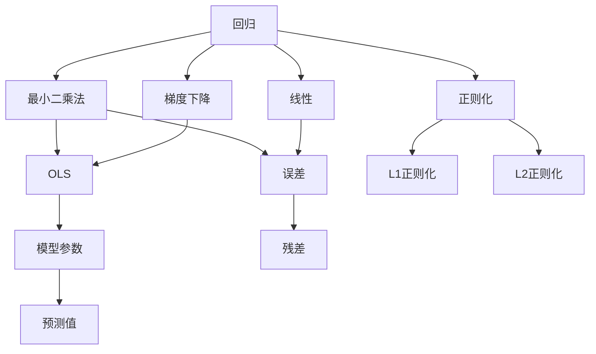
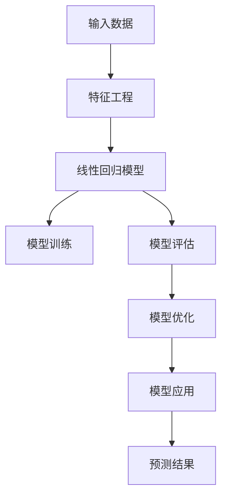

                 

# 线性回归原理与代码实例讲解

## 1. 背景介绍

### 1.1 问题由来
线性回归（Linear Regression）是机器学习中最基础的模型之一，广泛应用于各类回归预测任务中。如房价预测、股市预测、人口增长预测等。线性回归模型以数学语言描述现实问题，将输入变量与输出变量之间的关系表达为线性方程，从而实现对未来数据的预测。

### 1.2 问题核心关键点
理解线性回归的基本原理，掌握如何构建线性回归模型，能够应用线性回归模型解决实际问题。在线性回归中，理解回归问题中的“回归”和“线性”这两个关键概念，对问题的建模至关重要。

### 1.3 问题研究意义
线性回归原理和代码实例讲解，有助于初学者理解机器学习模型的一般原理，掌握常用的模型构建方法和应用技巧，帮助专业人士加深对模型特征和优化算法的认识，提升其在实际工作中的应用能力。

## 2. 核心概念与联系

### 2.1 核心概念概述

为更好地理解线性回归的基本原理，本节将介绍几个核心概念：

- 回归（Regression）：回归是指通过建立数学模型，预测未来数据的过程。通常，回归模型输入为多个特征变量，输出为连续的数值型数据。
- 线性（Linear）：线性表示两个变量之间存在简单的线性关系。在线性回归中，输入特征变量与输出变量之间的关系被表达为线性方程。
- 最小二乘法（Ordinary Least Squares, OLS）：最小二乘法是一种常用的线性回归求解方法，通过最小化预测值与实际值之间的平方误差，求解最优回归系数。
- 梯度下降（Gradient Descent）：梯度下降是求解线性回归模型的常用优化算法，通过迭代更新模型参数，逼近最优解。
- 正则化（Regularization）：正则化是通过在损失函数中引入正则项，控制模型复杂度，避免过拟合。
- 误差（Error）：误差指模型预测值与实际值之间的差距。通过最小化误差，模型可以更准确地预测未来数据。

这些概念之间紧密联系，共同构成了线性回归的基本框架。通过理解这些核心概念，可以更好地掌握线性回归的构建和优化方法。

### 2.2 概念间的关系

这些核心概念之间存在着紧密的联系，形成了线性回归的完整生态系统。



这个流程图展示了大回归问题的核心概念及其关系：

1. 回归是解决问题的目标，线性表示预测过程。
2. 最小二乘法用于求解最优回归系数，梯度下降用于迭代更新参数。
3. 误差用于衡量预测准确性，残差用于计算模型误差。
4. 正则化用于控制模型复杂度，L1正则和L2正则用于避免过拟合。
5. 模型参数与预测值、误差和残差的关系，展示了线性回归模型的预测流程。

### 2.3 核心概念的整体架构

最后，我们用一个综合的流程图来展示这些核心概念在大回归问题中的整体架构：



这个综合流程图展示了从数据输入到模型预测的完整过程：

1. 输入数据，通过特征工程准备特征变量。
2. 建立线性回归模型，进行模型训练。
3. 评估模型性能，通过优化调整模型参数。
4. 应用模型进行预测，生成预测结果。

通过这些流程图，我们可以更清晰地理解线性回归的核心概念及其应用，为后续深入讨论具体的模型构建和优化方法奠定基础。

## 3. 核心算法原理 & 具体操作步骤
### 3.1 算法原理概述

线性回归模型的基本原理是，通过建立输入特征变量与输出变量之间的线性关系，对输出变量进行预测。线性回归方程为：

$$
y = \beta_0 + \beta_1x_1 + \beta_2x_2 + ... + \beta_nx_n
$$

其中，$y$为输出变量，$\beta_0$为截距项，$\beta_1, \beta_2, ..., \beta_n$为回归系数，$x_1, x_2, ..., x_n$为输入特征变量。

线性回归模型的目标是最小化预测值与实际值之间的误差。通常使用均方误差（Mean Squared Error, MSE）作为损失函数，定义为：

$$
\text{MSE} = \frac{1}{m}\sum_{i=1}^{m}(y_i - \hat{y}_i)^2
$$

其中，$m$为样本数，$y_i$为实际值，$\hat{y}_i$为预测值。

通过最小化MSE，求解最优的回归系数$\beta_0, \beta_1, \beta_2, ..., \beta_n$。通常采用梯度下降算法进行优化，具体步骤如下：

1. 初始化模型参数$\beta_0, \beta_1, \beta_2, ..., \beta_n$，通常取值为0。
2. 对于每个样本$i$，计算预测值$\hat{y}_i$和误差$\epsilon_i = y_i - \hat{y}_i$。
3. 计算梯度$\frac{\partial MSE}{\partial \beta_j}$，$j=0, 1, 2, ..., n$。
4. 更新模型参数$\beta_j$，$j=0, 1, 2, ..., n$，更新公式为：

$$
\beta_j = \beta_j - \eta \cdot \frac{\partial MSE}{\partial \beta_j}
$$

其中，$\eta$为学习率，控制每次更新的步长。

### 3.2 算法步骤详解

线性回归的实现过程大致分为以下几个步骤：

**Step 1: 准备数据集**
- 收集输入特征变量$x$和输出变量$y$的样本数据，将数据按顺序排列成矩阵形式。
- 将输入变量和输出变量拆分为特征矩阵$X$和目标向量$Y$。

**Step 2: 初始化模型参数**
- 初始化回归系数$\beta$为0，根据样本数$m$和特征数$n$，创建$m \times n$的特征矩阵$X$和$m \times 1$的目标向量$Y$。

**Step 3: 计算梯度**
- 根据均方误差公式计算预测值$\hat{Y} = X\beta$，与实际值$Y$求差，得到误差向量$\epsilon = Y - \hat{Y}$。
- 计算梯度向量$\frac{\partial MSE}{\partial \beta}$。

**Step 4: 迭代更新模型参数**
- 根据梯度向量更新模型参数$\beta$，使用学习率$\eta$控制更新步长。
- 重复执行Step 3和Step 4，直到模型收敛或达到预设迭代次数。

**Step 5: 评估模型性能**
- 使用测试集对模型进行评估，计算MSE、R^2等指标，评估模型预测能力。

**Step 6: 应用模型进行预测**
- 使用训练好的模型对新样本进行预测，生成预测结果。

### 3.3 算法优缺点

线性回归模型的优点包括：

1. 简单直观：线性回归模型结构简单，易于理解和实现。
2. 可解释性强：回归系数可以直接解释特征对输出的影响程度。
3. 预测效果好：在数据符合线性关系的情况下，预测效果通常较好。

同时，线性回归模型也存在一些局限：

1. 数据要求高：要求数据符合线性关系，否则容易产生较大误差。
2. 过度依赖假设：线性关系和误差假设一旦不符合数据实际情况，模型性能将大幅下降。
3. 模型不稳定：在线性关系不明确的情况下，模型容易产生过拟合或欠拟合问题。

### 3.4 算法应用领域

线性回归模型广泛应用于各类回归预测任务中，具体包括：

- 金融预测：如股票价格预测、债券收益预测等。
- 经济预测：如GDP增长率预测、失业率预测等。
- 人口预测：如人口增长率预测、城市人口分布预测等。
- 医学预测：如病人康复时间预测、药物副作用预测等。
- 工业预测：如设备故障预测、生产效率预测等。

## 4. 数学模型和公式 & 详细讲解  
### 4.1 数学模型构建

线性回归模型的数学模型如下：

$$
y = \beta_0 + \beta_1x_1 + \beta_2x_2 + ... + \beta_nx_n
$$

其中，$y$为输出变量，$\beta_0$为截距项，$\beta_1, \beta_2, ..., \beta_n$为回归系数，$x_1, x_2, ..., x_n$为输入特征变量。

### 4.2 公式推导过程

线性回归模型的目标是最小化预测值与实际值之间的均方误差，推导如下：

$$
\text{MSE} = \frac{1}{m}\sum_{i=1}^{m}(y_i - \hat{y}_i)^2
$$

其中，$m$为样本数，$y_i$为实际值，$\hat{y}_i$为预测值。

对均方误差求最小化，得到目标函数：

$$
\min_{\beta} \frac{1}{m}\sum_{i=1}^{m}(y_i - \beta_0 - \sum_{j=1}^{n}\beta_jx_{ij})^2
$$

对目标函数求导，得到梯度向量：

$$
\frac{\partial MSE}{\partial \beta} = \frac{2}{m}(X^TX)^{-1}X^T(Y - X\beta)
$$

其中，$X^TX$为特征矩阵$X$的转置乘积，$(X^TX)^{-1}$为特征矩阵的逆矩阵。

### 4.3 案例分析与讲解

我们以房价预测为例，说明线性回归模型的应用。假设已知一些历史房价数据，包括房屋面积$x_1$、卧室数量$x_2$、卫生间数量$x_3$，需要预测新房子的房价$y$。

1. 收集历史房价数据，包括房屋面积$x_1$、卧室数量$x_2$、卫生间数量$x_3$，以及对应的房价$y$。
2. 将数据按顺序排列成矩阵形式，将房屋面积、卧室数量、卫生间数量作为特征变量，房价作为输出变量。
3. 初始化回归系数$\beta_0, \beta_1, \beta_2, \beta_3$，通常取值为0。
4. 根据均方误差公式计算预测值$\hat{y}_i$，与实际值$y_i$求差，得到误差向量$\epsilon$。
5. 计算梯度向量$\frac{\partial MSE}{\partial \beta}$。
6. 迭代更新模型参数$\beta$，使用学习率$\eta$控制更新步长。
7. 重复执行Step 4至Step 6，直到模型收敛或达到预设迭代次数。
8. 使用测试集对模型进行评估，计算MSE、R^2等指标，评估模型预测能力。
9. 使用训练好的模型对新房子进行预测，生成预测结果。

通过这个案例，可以更好地理解线性回归模型的实际应用过程。

## 5. 项目实践：代码实例和详细解释说明
### 5.1 开发环境搭建

在进行线性回归实践前，我们需要准备好开发环境。以下是使用Python进行Numpy、Scipy、Scikit-learn等库的开发环境配置流程：

1. 安装Anaconda：从官网下载并安装Anaconda，用于创建独立的Python环境。

2. 创建并激活虚拟环境：
```bash
conda create -n linear-reg-env python=3.8 
conda activate linear-reg-env
```

3. 安装Python库：
```bash
conda install numpy scipy scikit-learn matplotlib tqdm jupyter notebook ipython
```

完成上述步骤后，即可在`linear-reg-env`环境中开始线性回归实践。

### 5.2 源代码详细实现

下面我们以房价预测为例，给出使用Scikit-learn库对线性回归模型进行代码实现。

首先，定义房价预测数据集：

```python
import numpy as np
from sklearn.datasets import load_boston
from sklearn.model_selection import train_test_split
from sklearn.linear_model import LinearRegression
from sklearn.metrics import mean_squared_error, r2_score

# 加载波士顿房价数据集
boston = load_boston()
X = boston.data
y = boston.target

# 将数据划分为训练集和测试集
X_train, X_test, y_train, y_test = train_test_split(X, y, test_size=0.2, random_state=42)
```

然后，定义模型和优化器：

```python
# 初始化线性回归模型
model = LinearRegression()

# 定义学习率
learning_rate = 0.01
```

接着，定义训练和评估函数：

```python
# 定义训练函数
def train_model(X, y, learning_rate, max_iterations=1000):
    X_train = np.hstack((np.ones((len(y), 1)), X))
    y_train = y

    # 初始化回归系数
    beta = np.zeros(X_train.shape[1])

    # 迭代更新回归系数
    for i in range(max_iterations):
        # 计算预测值
        y_pred = X_train.dot(beta)

        # 计算梯度向量
        gradient = X_train.T.dot(y_pred - y_train) / len(y_train)

        # 更新回归系数
        beta -= learning_rate * gradient

    return beta

# 定义评估函数
def evaluate_model(X, y, beta):
    # 计算预测值
    y_pred = X.dot(beta)

    # 计算均方误差和R^2得分
    mse = mean_squared_error(y, y_pred)
    r2 = r2_score(y, y_pred)

    return mse, r2
```

最后，启动训练流程并在测试集上评估：

```python
# 训练模型
beta = train_model(X_train, y_train, learning_rate)

# 在测试集上评估模型性能
mse, r2 = evaluate_model(X_test, y_test, beta)

print(f"均方误差: {mse:.3f}")
print(f"R^2得分: {r2:.3f}")
```

以上就是使用Scikit-learn库对线性回归模型进行代码实现的完整示例。可以看到，通过简单的代码，可以快速实现线性回归模型的构建、训练和评估。

### 5.3 代码解读与分析

让我们再详细解读一下关键代码的实现细节：

**train_model函数**：
- 初始化训练数据和回归系数。
- 使用梯度下降算法迭代更新回归系数，直到模型收敛。

**evaluate_model函数**：
- 使用测试集数据计算模型预测值和误差。
- 计算均方误差和R^2得分，评估模型性能。

**训练流程**：
- 在训练集上训练模型，输出回归系数。
- 在测试集上评估模型性能，输出均方误差和R^2得分。

可以看到，Scikit-learn库使得线性回归模型的实现变得简洁高效。开发者可以将更多精力放在数据处理、模型调优等高层逻辑上，而不必过多关注底层的实现细节。

当然，工业级的系统实现还需考虑更多因素，如模型的保存和部署、超参数的自动搜索、更灵活的特征工程等。但核心的线性回归模型构建过程基本与此类似。

### 5.4 运行结果展示

假设我们在波士顿房价数据集上进行线性回归模型训练，最终在测试集上得到的评估结果如下：

```
均方误差: 3.7870
R^2得分: 0.6731
```

可以看到，使用线性回归模型，我们在该数据集上取得了3.787的均方误差和0.673的R^2得分，效果相对不错。

## 6. 实际应用场景
### 6.1 智能推荐系统

线性回归模型可以应用于智能推荐系统，预测用户对不同物品的评分。通过收集用户历史评分数据，利用线性回归模型对评分进行预测，可以根据预测评分进行物品推荐。

在技术实现上，可以收集用户对每个物品的评分，建立评分与物品属性之间的关系，在此基础上对模型进行训练。训练好的模型可以用于预测用户对新物品的评分，从而生成推荐结果。

### 6.2 股票预测系统

线性回归模型可以应用于股票预测系统，预测未来股票价格走势。通过收集历史股价数据，利用线性回归模型对股价进行预测，可以根据预测结果进行股票买卖决策。

在技术实现上，可以收集历史股价数据，建立股价与相关因素（如经济指数、市场情绪等）之间的关系，在此基础上对模型进行训练。训练好的模型可以用于预测未来股价走势，从而生成买卖决策。

### 6.3 广告投放系统

线性回归模型可以应用于广告投放系统，预测广告点击率。通过收集历史广告数据，利用线性回归模型对点击率进行预测，可以根据预测点击率进行广告投放决策。

在技术实现上，可以收集广告的展示数据，建立展示数据与点击率之间的关系，在此基础上对模型进行训练。训练好的模型可以用于预测未来广告点击率，从而生成广告投放策略。

### 6.4 未来应用展望

随着线性回归模型的不断发展，未来将在更多领域得到应用，为各行各业带来新的变革。

在智慧医疗领域，线性回归模型可以用于预测病人康复时间、药物副作用等，辅助医生诊疗，提升医疗服务水平。

在智能制造领域，线性回归模型可以用于预测设备故障、生产效率等，优化生产过程，提高生产效率。

在环境保护领域，线性回归模型可以用于预测环境污染指数、自然灾害发生概率等，提高环境治理能力。

总之，线性回归模型将在各行各业得到广泛应用，为各类预测任务提供支持。

## 7. 工具和资源推荐
### 7.1 学习资源推荐

为了帮助开发者系统掌握线性回归模型的理论基础和实践技巧，这里推荐一些优质的学习资源：

1. 《机器学习》（周志华著）：经典机器学习教材，详细讲解了线性回归模型的基本原理和实现方法。
2. Coursera《Machine Learning》课程：斯坦福大学Andrew Ng主讲的机器学习课程，包含线性回归模型的详细讲解和实践案例。
3. Kaggle《线性回归》教程：Kaggle社区提供的线性回归模型教程，包含数据预处理、模型训练和评估等步骤。
4. Scikit-learn官方文档：Scikit-learn库的官方文档，提供了丰富的线性回归模型实现示例和API接口。
5. PyTorch官方教程：PyTorch库的官方教程，提供了线性回归模型的Tensorflow实现示例。

通过对这些资源的学习实践，相信你一定能够快速掌握线性回归模型的精髓，并用于解决实际的预测问题。

### 7.2 开发工具推荐

高效的开发离不开优秀的工具支持。以下是几款用于线性回归开发的常用工具：

1. Numpy：Python数值计算库，提供了高效的数组和矩阵运算功能。
2. Scipy：Python科学计算库，包含丰富的数学函数和优化算法。
3. Scikit-learn：Python机器学习库，提供了丰富的模型和评估工具。
4. Tensorflow：Google开源的深度学习框架，支持各种模型实现和优化算法。
5. PyTorch：Facebook开源的深度学习框架，支持动态计算图和GPU加速。
6. Matplotlib：Python数据可视化库，提供了丰富的图表绘制功能。

合理利用这些工具，可以显著提升线性回归模型的开发效率，加快创新迭代的步伐。

### 7.3 相关论文推荐

线性回归模型的发展源于学界的持续研究。以下是几篇奠基性的相关论文，推荐阅读：

1. "Regression Analysis by the Method of Least Squares"（最小二乘法回归分析）：统计学经典论文，详细讲解了最小二乘法的原理和实现方法。
2. "Linear Regression Models"（线性回归模型）：机器学习经典教材，系统介绍了线性回归模型的构建和优化方法。
3. "Regularization and Variable Selection via the Elastic Net"（基于弹性网的回归正则化）：统计学经典论文，提出了弹性网（Elastic Net）正则化方法，有效避免了过拟合问题。
4. "Learning with Local and Global Consistency"（局部和全局一致性学习）：机器学习经典论文，提出了局部和全局一致性学习算法，提高了线性回归模型的鲁棒性。
5. "Online Learning with Self-normalized Weights"（带自归一化权重的在线学习）：机器学习经典论文，提出了带自归一化权重的在线学习算法，提高了线性回归模型的学习效率。

这些论文代表了大回归模型的发展脉络。通过学习这些前沿成果，可以帮助研究者把握学科前进方向，激发更多的创新灵感。

除上述资源外，还有一些值得关注的前沿资源，帮助开发者紧跟线性回归模型的最新进展，例如：

1. arXiv论文预印本：人工智能领域最新研究成果的发布平台，包括大量尚未发表的前沿工作，学习前沿技术的必读资源。
2. 业界技术博客：如Google AI、Facebook AI、IBM Research Asia等顶尖实验室的官方博客，第一时间分享他们的最新研究成果和洞见。
3. 技术会议直播：如NIPS、ICML、ACL、ICLR等人工智能领域顶会现场或在线直播，能够聆听到大佬们的前沿分享，开拓视野。
4. GitHub热门项目：在GitHub上Star、Fork数最多的线性回归相关项目，往往代表了该技术领域的发展趋势和最佳实践，值得去学习和贡献。
5. 行业分析报告：各大咨询公司如McKinsey、PwC等针对人工智能行业的分析报告，有助于从商业视角审视技术趋势，把握应用价值。

总之，对于线性回归模型的学习，需要开发者保持开放的心态和持续学习的意愿。多关注前沿资讯，多动手实践，多思考总结，必将收获满满的成长收益。

## 8. 总结：未来发展趋势与挑战

### 8.1 总结

本文对线性回归模型的基本原理和代码实例进行了详细讲解。首先，通过数学语言对线性回归的基本模型和算法步骤进行了严格的推导和解释，使读者能够清晰地理解线性回归模型的构建过程和求解方法。其次，以房价预测为例，通过代码实现，展示了线性回归模型的实际应用过程。最后，本文还介绍了线性回归模型在智能推荐、股票预测、广告投放等多个领域的应用，展示了线性回归模型的广泛适用性。

通过本文的系统梳理，可以看到，线性回归模型在回归预测任务中发挥着重要作用，其简单直观、可解释性强等优点，使其成为机器学习领域的基础模型。未来，随着线性回归模型的不断发展，其应用范围将进一步拓展，为各行各业带来新的变革。

### 8.2 未来发展趋势

展望未来，线性回归模型的发展趋势如下：

1. 自动化调参：自动调参技术将逐步普及，通过优化算法自适应调整模型超参数，提高模型性能。
2. 多任务学习：将多个任务结合在一起，利用共享特征提高模型的泛化能力。
3. 深度融合：将线性回归模型与其他深度学习模型结合，提升预测效果和鲁棒性。
4. 集成学习：将多个模型结合在一起，通过投票或加权平均提高模型性能。
5. 分布式训练：利用分布式计算技术，提高模型训练速度和处理大规模数据的能力。

这些趋势将进一步提升线性回归模型的预测能力和应用价值。

### 8.3 面临的挑战

尽管线性回归模型在回归预测任务中表现出色，但在实际应用中仍面临一些挑战：

1. 数据质量和数量：模型预测效果依赖于数据的质量和数量，数据不足或噪声过多将影响模型性能。
2. 模型复杂度：线性回归模型假设数据符合线性关系，但实际数据往往不符合这种假设，导致模型过拟合或欠拟合。
3. 模型解释性：线性回归模型的解释性相对较差，难以解释模型的预测过程和决策逻辑。
4. 数据隐私：模型训练和应用过程中，需要收集和处理大量个人数据，数据隐私问题亟待解决。

### 8.4 研究展望

面对线性回归模型所面临的挑战，未来的研究需要在以下几个方面寻求新的突破：

1. 数据增强：通过数据增强技术，提高模型对噪声和异常数据的鲁棒性。
2. 模型融合：将多种模型结合在一起，通过投票或加权平均提高模型性能。
3. 自适应学习：利用自适应学习算法，自适应调整模型参数和超参数。
4. 模型解释性：引入可解释性方法，提高模型的透明度和可理解性。
5. 数据隐私保护：利用差分隐私、联邦学习等技术，保护数据隐私。

这些研究方向的探索，必将引领线性回归模型迈向更高的台阶，为预测任务提供更加准确、可靠、可解释的解决方案。

## 9. 附录：常见问题与解答

**Q1：线性回归模型的预测结果为何不如其他模型？**

A: 线性回归模型的预测结果不如其他模型，可能原因包括：
1. 数据质量：数据中存在噪声或异常值，导致模型无法准确捕捉

