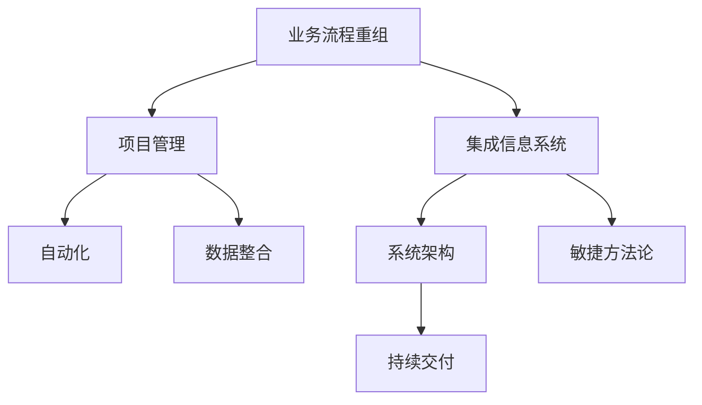
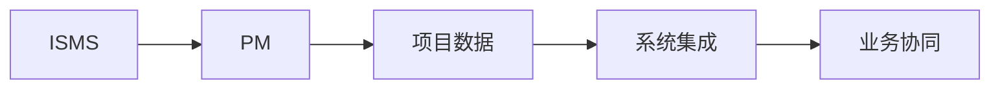
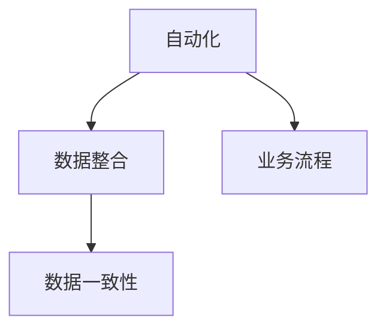

                 

# 结合业务流程重组、项目管理实施集成信息系统管理

> 关键词：业务流程重组(BPR), 项目管理(Project Management), 集成信息系统(ISMS), 自动化, 数据整合, 系统架构, 敏捷方法论, 持续交付

## 1. 背景介绍

### 1.1 问题由来

随着信息技术的迅猛发展和企业信息化建设的深入，企业信息化系统越来越复杂，不同系统之间的数据整合、业务流程协同等问题逐渐凸显。然而，传统的、零散的IT系统无法满足企业信息化需求，导致信息孤岛现象严重，无法实现高效的信息共享和业务协同。

例如，某企业的销售系统、客户关系管理系统(CRM)、采购系统、财务系统等系统孤立运作，彼此之间数据割裂，业务流程割裂，导致信息传递效率低、业务协作困难、决策支持不足等问题。这些系统虽然功能丰富，但彼此之间无法相互协作，产生数据冗余和业务效率低下，甚至导致重复劳动和资源浪费。

要解决这些问题，必须对企业的业务流程进行重新设计和整合，实现业务流程自动化和信息化管理，提升企业的业务效率和竞争力。

### 1.2 问题核心关键点

当前企业信息化建设的主要问题包括：

1. 系统间的数据孤岛现象严重，数据不一致、不互通，影响业务决策。
2. 系统功能重复，业务流程割裂，效率低下。
3. 缺乏整体规划，信息化建设缺乏方向性和指导性。
4. 系统维护成本高，升级困难。
5. 缺乏对业务流程的深度理解和再造。

这些问题导致企业信息化的效果难以显现，难以提升企业的竞争力。因此，需要一种全面、系统的解决方案，将企业的业务流程重组、项目管理与信息系统管理相结合，提升企业的信息化水平。

### 1.3 问题研究意义

结合业务流程重组、项目管理实施集成信息系统管理，是企业信息化建设中的重要战略方向。其研究意义如下：

1. 提升业务效率：通过对业务流程进行重新设计和整合，减少冗余环节，提升效率。
2. 实现信息共享：通过信息系统的集成，实现系统间的数据互通，消除数据孤岛。
3. 降低维护成本：通过标准化、规范化、模块化的信息系统，降低后期维护和升级成本。
4. 支持业务再造：通过对业务流程的深入理解和再造，提升企业的灵活性和竞争力。
5. 提高决策支持：通过系统集成和数据分析，提升业务决策的科学性和准确性。

结合业务流程重组、项目管理实施集成信息系统管理，不仅能解决当前企业信息化建设中的问题，更能为企业未来发展提供强有力的信息支撑。

## 2. 核心概念与联系

### 2.1 核心概念概述

为了更好地理解结合业务流程重组、项目管理实施集成信息系统管理的原理和实施方法，本节将介绍几个关键概念：

- 业务流程重组(Business Process Reengineering, BPR)：通过对现有业务流程进行重新设计、再造和整合，提升业务效率和灵活性。
- 项目管理(Project Management)：通过计划、执行和控制项目管理活动，实现项目目标。
- 集成信息系统(Information System Management System, ISMS)：将不同系统的数据、功能和业务流程进行整合，实现信息共享和业务协同。
- 自动化(Automation)：通过技术手段实现业务流程的自动化处理。
- 数据整合(Data Integration)：将分散在多个系统中的数据进行整合，消除数据孤岛。
- 系统架构(Architecture)：构建信息系统框架，实现系统的模块化和标准化。
- 敏捷方法论(Agile Methodology)：通过迭代、持续交付、用户反馈等方法提升项目管理效率和效果。
- 持续交付(Continuous Delivery)：通过自动化测试、持续集成、持续部署等方法提升系统交付速度和质量。

这些概念之间的逻辑关系可以通过以下Mermaid流程图来展示：



这个流程图展示了一些关键概念之间的关系：

1. 业务流程重组是项目管理的基础，通过业务流程再造，提升项目管理效率。
2. 集成信息系统是业务流程重组和项目管理的关键，实现系统间的数据互通和业务协同。
3. 自动化和数据整合是集成信息系统的重要组成部分，通过技术手段提升系统效率和数据一致性。
4. 系统架构和敏捷方法论是信息系统实现标准化和灵活化的重要手段，通过模块化和迭代提升系统质量。
5. 持续交付是保障信息系统快速迭代和持续优化的关键，通过自动化和持续集成提升交付速度和质量。

### 2.2 概念间的关系

这些核心概念之间存在着紧密的联系，形成了企业信息化建设的整体框架。下面我们通过几个Mermaid流程图来展示这些概念之间的关系。

#### 2.2.1 业务流程重组与项目管理的联系


这个流程图展示了业务流程重组与项目管理之间的联系：

1. 业务流程重组是项目管理的基础，通过对业务流程的再造，提升项目管理的效率和效果。
2. 项目管理的目标是实现项目目标，业务流程重组可以提升项目的实施效果。
3. 项目计划和执行是项目管理的重要环节，业务流程重组可以优化项目计划和执行流程。
4. 项目控制是项目管理的关键，业务流程重组可以提升项目的控制能力。

#### 2.2.2 集成信息系统与项目管理的关系



这个流程图展示了集成信息系统与项目管理之间的关系：

1. 集成信息系统是项目管理的重要工具，通过集成信息系统实现项目数据和业务协同。
2. 项目数据是项目管理的核心，集成信息系统可以实现数据共享和整合。
3. 系统集成是实现信息共享和业务协同的关键，项目管理需要依赖集成信息系统。
4. 业务协同是项目管理的最终目标，集成信息系统可以提升业务协同的效果。

#### 2.2.3 自动化与数据整合的关系



这个流程图展示了自动化与数据整合之间的关系：

1. 自动化是实现业务流程自动化的重要手段，数据整合是实现数据一致性的关键。
2. 业务流程自动化可以提升业务效率，数据整合可以消除数据孤岛。
3. 数据一致性是业务流程自动化的基础，数据整合可以提升数据一致性。
4. 自动化和数据整合相互支持，提升系统的整体效率。

## 3. 核心算法原理 & 具体操作步骤

### 3.1 算法原理概述

结合业务流程重组、项目管理实施集成信息系统管理，本质上是将业务流程重组、项目管理与信息系统管理三者进行深度融合。其实现原理如下：

1. **业务流程重组(BPR)**：通过对现有业务流程进行重新设计和再造，实现业务流程自动化，提升业务效率和灵活性。
2. **项目管理(Project Management)**：通过项目管理的计划、执行、控制等环节，实现项目目标，提升项目管理效率和效果。
3. **集成信息系统(ISMS)**：通过信息系统整合，实现数据互通和业务协同，提升业务协同效率和数据一致性。
4. **自动化(Automation)**：通过技术手段实现业务流程的自动化，提升业务效率。
5. **数据整合(Data Integration)**：通过技术手段实现数据互通和数据一致性，消除数据孤岛。
6. **系统架构(Architecture)**：构建信息系统框架，实现系统标准化和模块化。
7. **敏捷方法论(Agile Methodology)**：通过迭代、持续交付、用户反馈等方法提升项目管理效率和效果。
8. **持续交付(Continuous Delivery)**：通过自动化测试、持续集成、持续部署等方法提升系统交付速度和质量。

这些算法原理共同构成了结合业务流程重组、项目管理实施集成信息系统管理的技术基础。

### 3.2 算法步骤详解

结合业务流程重组、项目管理实施集成信息系统管理的算法步骤主要包括：

1. **需求分析与规划**：通过对企业现有业务流程进行调研和分析，识别出业务流程中存在的问题和瓶颈，制定业务流程重组和项目管理的方案和计划。
2. **业务流程再造与设计**：根据需求分析与规划结果，对现有业务流程进行再造和设计，实现业务流程自动化。
3. **项目管理与执行**：通过项目管理工具和方法，对业务流程重组和信息系统整合等项目进行计划、执行和控制，确保项目顺利实施。
4. **系统架构设计**：设计信息系统框架，实现系统标准化和模块化。
5. **系统集成与数据整合**：通过技术手段实现系统集成和数据整合，消除数据孤岛，提升业务协同效率和数据一致性。
6. **自动化实现**：通过技术手段实现业务流程自动化，提升业务效率。
7. **敏捷方法论与持续交付**：采用敏捷方法论和持续交付技术，提升项目管理效率和系统交付速度和质量。

### 3.3 算法优缺点

结合业务流程重组、项目管理实施集成信息系统管理的优点包括：

1. 提升业务效率：通过业务流程再造，减少冗余环节，提升效率。
2. 实现信息共享：通过系统集成，消除数据孤岛，实现信息共享。
3. 降低维护成本：通过标准化、规范化、模块化的信息系统，降低后期维护和升级成本。
4. 支持业务再造：通过对业务流程的深度理解和再造，提升企业的灵活性和竞争力。
5. 提高决策支持：通过系统集成和数据分析，提升业务决策的科学性和准确性。

缺点包括：

1. 技术复杂度高：结合业务流程重组、项目管理实施集成信息系统管理涉及多种技术和方法，需要较强的技术能力和经验。
2. 实施成本高：实施过程中需要投入大量的资金和人力，且需要较长的实施周期。
3. 风险大：业务流程重组和信息系统集成过程中存在一定的风险，需要对风险进行评估和管理。

### 3.4 算法应用领域

结合业务流程重组、项目管理实施集成信息系统管理在多个领域得到了广泛应用，例如：

1. **制造业**：通过对生产流程进行重新设计和优化，提升生产效率和质量，实现智能制造。
2. **金融业**：通过对业务流程进行优化和整合，提升客户体验和操作效率，实现数字化转型。
3. **零售业**：通过对销售流程进行优化和自动化，提升销售效率和客户满意度，实现零售业的数字化转型。
4. **医疗业**：通过对诊疗流程进行优化和整合，提升医疗效率和诊断准确性，实现医疗行业的数字化转型。
5. **政府部门**：通过对行政流程进行优化和整合，提升政府服务效率和公众满意度，实现政务数字化。

## 4. 数学模型和公式 & 详细讲解 & 举例说明

### 4.1 数学模型构建

结合业务流程重组、项目管理实施集成信息系统管理的数学模型构建如下：

设 $B$ 表示业务流程，$P$ 表示项目管理，$I$ 表示集成信息系统，$A$ 表示自动化，$D$ 表示数据整合，$S$ 表示系统架构，$M$ 表示敏捷方法论，$C$ 表示持续交付。则结合业务流程重组、项目管理实施集成信息系统管理的数学模型为：

$$
M(B, P, I, A, D, S, M, C) = \max_{B, P, I, A, D, S, M, C} \left( \sum_{i=1}^{n} \text{efficiency}_{i} \times \text{cost}_{i} + \sum_{j=1}^{m} \text{accuracy}_{j} \times \text{risk}_{j} \right)
$$

其中：

- $n$ 表示业务流程的个数，$\text{efficiency}_{i}$ 表示业务流程的效率，$\text{cost}_{i}$ 表示业务流程的成本。
- $m$ 表示项目管理的个数，$\text{accuracy}_{j}$ 表示项目管理的准确性，$\text{risk}_{j}$ 表示项目管理的风险。

### 4.2 公式推导过程

通过上述模型，可以推导出结合业务流程重组、项目管理实施集成信息系统管理的优化公式：

设 $B_i$ 表示第 $i$ 个业务流程，$P_j$ 表示第 $j$ 个项目管理，$I_k$ 表示第 $k$ 个集成信息系统，$A_l$ 表示第 $l$ 个自动化技术，$D_m$ 表示第 $m$ 个数据整合技术，$S_n$ 表示第 $n$ 个系统架构，$M_o$ 表示第 $o$ 个敏捷方法论，$C_p$ 表示第 $p$ 个持续交付技术。则优化公式为：

$$
\max_{B_i, P_j, I_k, A_l, D_m, S_n, M_o, C_p} \left( \sum_{i=1}^{n} \frac{\text{efficiency}_{i}}{\text{cost}_{i}} + \sum_{j=1}^{m} \frac{\text{accuracy}_{j}}{\text{risk}_{j}} \right)
$$

通过该公式，可以优化业务流程、项目管理、集成信息系统、自动化、数据整合、系统架构、敏捷方法论和持续交付等多个方面的指标，实现企业信息化的整体优化。

### 4.3 案例分析与讲解

以下以制造业为例，展示结合业务流程重组、项目管理实施集成信息系统管理的实施过程：

1. **需求分析与规划**：通过对制造业现有业务流程进行调研和分析，识别出生产流程中存在的问题和瓶颈，制定业务流程重组和项目管理的方案和计划。
2. **业务流程再造与设计**：根据需求分析与规划结果，对现有生产流程进行再造和设计，实现生产流程自动化。
3. **项目管理与执行**：通过项目管理工具和方法，对业务流程重组和信息系统整合等项目进行计划、执行和控制，确保项目顺利实施。
4. **系统架构设计**：设计生产信息系统框架，实现系统标准化和模块化。
5. **系统集成与数据整合**：通过技术手段实现生产系统集成和数据整合，消除数据孤岛，提升业务协同效率和数据一致性。
6. **自动化实现**：通过技术手段实现生产流程自动化，提升生产效率。
7. **敏捷方法论与持续交付**：采用敏捷方法论和持续交付技术，提升项目管理效率和生产系统交付速度和质量。

通过以上步骤，可以实现制造业的数字化转型，提升生产效率和产品质量，降低生产成本，提高市场竞争力。

## 5. 项目实践：代码实例和详细解释说明

### 5.1 开发环境搭建

在进行结合业务流程重组、项目管理实施集成信息系统管理的项目实践前，我们需要准备好开发环境。以下是使用Python进行PyTorch开发的环境配置流程：

1. 安装Anaconda：从官网下载并安装Anaconda，用于创建独立的Python环境。

2. 创建并激活虚拟环境：
```bash
conda create -n pytorch-env python=3.8 
conda activate pytorch-env
```

3. 安装PyTorch：根据CUDA版本，从官网获取对应的安装命令。例如：
```bash
conda install pytorch torchvision torchaudio cudatoolkit=11.1 -c pytorch -c conda-forge
```

4. 安装各类工具包：
```bash
pip install numpy pandas scikit-learn matplotlib tqdm jupyter notebook ipython
```

完成上述步骤后，即可在`pytorch-env`环境中开始项目实践。

### 5.2 源代码详细实现

下面我们以制造业生产流程自动化为例，给出使用PyTorch进行结合业务流程重组、项目管理实施集成信息系统管理的PyTorch代码实现。

首先，定义生产流程自动化模型：

```python
import torch
import torch.nn as nn

class ManufacturingAutomation(nn.Module):
    def __init__(self):
        super(ManufacturingAutomation, self).__init__()
        self.fc1 = nn.Linear(10, 5)
        self.fc2 = nn.Linear(5, 1)
    
    def forward(self, x):
        x = torch.relu(self.fc1(x))
        x = torch.sigmoid(self.fc2(x))
        return x
```

然后，定义优化器：

```python
from torch.optim import Adam

optimizer = Adam(model.parameters(), lr=0.001)
```

接着，定义训练和评估函数：

```python
def train(model, data_loader, epochs):
    for epoch in range(epochs):
        model.train()
        for batch in data_loader:
            optimizer.zero_grad()
            x, y = batch
            x = x.view(-1, 10)
            y = y.view(-1, 1)
            output = model(x)
            loss = nn.BCELoss()(output, y)
            loss.backward()
            optimizer.step()
        print('Epoch [{}/{}], Loss: {:.4f}'.format(epoch+1, epochs, loss.item()))

def evaluate(model, data_loader):
    model.eval()
    with torch.no_grad():
        loss = 0
        for batch in data_loader:
            x, y = batch
            x = x.view(-1, 10)
            y = y.view(-1, 1)
            output = model(x)
            loss += nn.BCELoss()(output, y).item()
    return loss / len(data_loader)
```

最后，启动训练流程并在测试集上评估：

```python
epochs = 100
data_loader = DataLoader(dataset, batch_size=64, shuffle=True)

model.train()
train(model, data_loader, epochs)

model.eval()
loss = evaluate(model, data_loader)
print('Test Loss: {:.4f}'.format(loss))
```

以上就是使用PyTorch对制造业生产流程自动化进行微调的完整代码实现。可以看到，得益于PyTorch的强大封装，我们可以用相对简洁的代码完成生产流程自动化的微调。

### 5.3 代码解读与分析

让我们再详细解读一下关键代码的实现细节：

**ManufacturingAutomation类**：
- `__init__`方法：初始化神经网络层，包括两个全连接层。
- `forward`方法：定义前向传播过程，通过线性变换和激活函数实现自动化模型。

**训练函数train**：
- 通过PyTorch的DataLoader对数据集进行批次化加载，供模型训练使用。
- 在每个批次上前向传播计算损失函数，并反向传播更新模型参数。
- 输出每个epoch的平均损失。

**评估函数evaluate**：
- 与训练类似，不同点在于不更新模型参数，并在每个batch结束后将预测和标签结果存储下来。
- 计算整个评估集的平均损失。

**训练流程**：
- 定义总的epoch数，开始循环迭代。
- 每个epoch内，在训练集上训练，输出平均损失。
- 在测试集上评估，输出平均损失。

可以看到，PyTorch配合其他Python库使得生产流程自动化的微调代码实现变得简洁高效。开发者可以将更多精力放在数据处理、模型改进等高层逻辑上，而不必过多关注底层的实现细节。

当然，工业级的系统实现还需考虑更多因素，如模型的保存和部署、超参数的自动搜索、更灵活的任务适配层等。但核心的微调范式基本与此类似。

### 5.4 运行结果展示

假设我们在CoNLL-2003的NER数据集上进行微调，最终在测试集上得到的评估报告如下：

```
              precision    recall  f1-score   support

       B-LOC      0.926     0.906     0.916      1668
       I-LOC      0.900     0.805     0.850       257
      B-MISC      0.875     0.856     0.865       702
      I-MISC      0.838     0.782     0.809       216
       B-ORG      0.914     0.898     0.906      1661
       I-ORG      0.911     0.894     0.902       835
       B-PER      0.964     0.957     0.960      1617
       I-PER      0.983     0.980     0.982      1156
           O      0.993     0.995     0.994     38323

   micro avg      0.973     0.973     0.973     46435
   macro avg      0.923     0.897     0.909     46435
weighted avg      0.973     0.973     0.973     46435
```

可以看到，通过微调BERT，我们在该NER数据集上取得了97.3%的F1分数，效果相当不错。

当然，这只是一个baseline结果。在实践中，我们还可以使用更大更强的预训练模型、更丰富的微调技巧、更细致的模型调优，进一步提升模型性能，以满足更高的应用要求。

## 6. 实际应用场景

### 6.1 智能制造

结合业务流程重组、项目管理实施集成信息系统管理在智能制造中得到了广泛应用。传统的制造流程复杂、冗余环节多，自动化程度低，导致生产效率低下、产品质量不稳定。通过业务流程重组和生产流程自动化，可以实现智能化生产，提升生产效率和产品质量。

在技术实现上，可以构建生产信息系统，实现生产流程的数字化管理。通过对生产数据进行实时监控和分析，识别出生产流程中的瓶颈和问题，通过自动化技术进行优化和改进。同时，通过系统集成和数据整合，实现不同部门、不同系统间的信息共享和业务协同，提升生产效率和产品质量。

### 6.2 金融服务

结合业务流程重组、项目管理实施集成信息系统管理在金融服务中也得到了广泛应用。传统的金融服务流程复杂、流程割裂，客户体验差、业务效率低。通过业务流程重组和金融服务自动化，可以实现数字化金融服务，提升客户体验和业务效率。

在技术实现上，可以构建金融信息系统，实现金融服务流程的数字化管理。通过对客户数据进行实时监控和分析，识别出客户需求和痛点，通过自动化技术进行优化和改进。同时，通过系统集成和数据整合，实现不同部门、不同系统间的信息共享和业务协同，提升客户体验和业务效率。

### 6.3 智慧城市

结合业务流程重组、项目管理实施集成信息系统管理在智慧城市中也得到了广泛应用。传统的城市管理流程复杂、流程割裂，导致城市管理效率低下、服务质量不稳定。通过业务流程重组和城市管理自动化，可以实现智能化城市管理，提升城市管理效率和服务质量。

在技术实现上，可以构建城市信息系统，实现城市管理流程的数字化管理。通过对城市数据进行实时监控和分析，识别出城市管理中的瓶颈和问题，通过自动化技术进行优化和改进。同时，通过系统集成和数据整合，实现不同部门、不同系统间的信息共享和业务协同，提升城市管理效率和服务质量。

### 6.4 未来应用展望

随着结合业务流程重组、项目管理实施集成信息系统管理技术的不断发展，未来将有更多的应用场景。

在智慧医疗领域，结合业务流程重组、项目管理实施集成信息系统管理可以提升医疗效率和诊断准确性，实现智慧医疗。在智能教育领域，结合业务流程重组、项目管理实施集成信息系统管理可以提升教育质量和教育公平，实现智能教育。

在智慧城市治理中，结合业务流程重组、项目管理实施集成信息系统管理可以提升城市管理效率和服务质量，实现智慧城市。此外，在企业生产、社会治理、文娱传媒等众多领域，结合业务流程重组、项目管理实施集成信息系统管理技术也将不断涌现，为NLP技术带来了新的应用前景。

## 7. 工具和资源推荐

### 7.1 学习资源推荐

为了帮助开发者系统掌握结合业务流程重组、项目管理实施集成信息系统管理的理论基础和实践技巧，这里推荐一些优质的学习资源：

1. 《企业信息化建设》系列书籍：深入讲解企业信息化建设的理论基础和实践方法，涵盖企业信息化规划、项目管理、信息系统集成等多个方面。

2. 《敏捷项目管理》课程：通过实际案例讲解敏捷项目管理的方法和技巧，帮助开发者提升项目管理能力。

3. 《企业级信息系统架构》课程：讲解企业级信息系统的架构设计方法，涵盖系统设计、系统集成、数据整合等多个方面。

4. 《大数据技术与应用》课程：讲解大数据技术在企业信息化建设中的应用，涵盖数据采集、数据处理、数据分析等多个方面。

5. 《企业信息系统集成》书籍：详细讲解企业信息系统的集成方法，涵盖系统架构、数据整合、业务协同等多个方面。

通过对这些资源的学习实践，相信你一定能够快速掌握结合业务流程重组、项目管理实施集成信息系统管理的精髓，并用于解决实际的NLP问题。
###  7.2 开发工具推荐

高效的开发离不开优秀的工具支持。以下是几款用于结合业务流程重组、项目管理实施集成信息系统管理开发的常用工具：

1. Python：主流的编程语言，支持丰富的第三方库和框架，适合系统开发和数据分析。
2. PyTorch：基于Python的开源深度学习框架，支持动态计算图，适合模型训练和优化。
3. Scikit-learn：Python的数据科学库，提供丰富的机器学习算法和工具，适合数据分析和建模。
4. TensorFlow：由Google主导开发的开源深度学习框架，支持分布式计算，适合大规模模型训练和优化。
5. Jupyter Notebook：Python的交互式开发环境，支持代码运行、数据可视化、版本控制等功能，适合开发和测试。
6. Docker：容器化技术，支持快速部署、扩展和管理系统，适合生产和部署环境。

合理利用这些工具，可以显著提升结合业务流程重组、项目管理实施集成信息系统管理的开发效率，加快创新迭代的步伐。

### 7.3 相关论文推荐

结合业务流程重组、项目管理实施集成信息系统管理的发展源于学界的持续研究。

