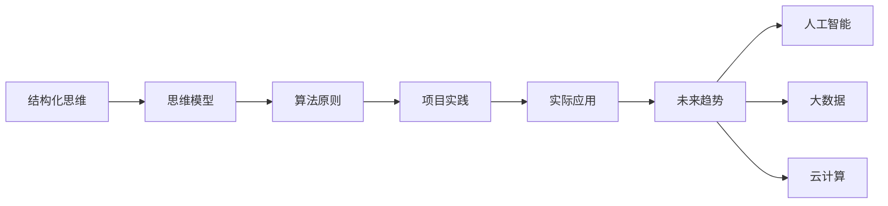
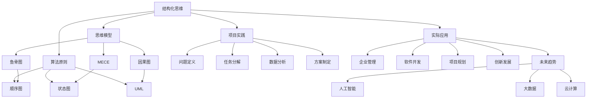
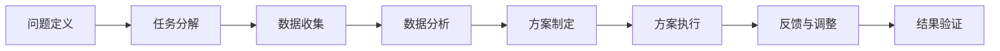

                 

# 结构化思维的力量：从思维到行动

> 关键词：结构化思维,思维模型,算法原则,项目实践,实际应用,未来趋势

## 1. 背景介绍

### 1.1 问题由来

在当今信息爆炸的时代，人们的思维被海量信息淹没，快速且准确地处理复杂问题变得愈加困难。结构化思维作为解决复杂问题的利器，可以帮助我们通过系统化的方式，明确问题的本质，提炼核心要素，制定有效的行动计划。从个人日常到企业战略，从软件开发到项目管理，结构化思维的强大力量几乎无处不在。

### 1.2 问题核心关键点

结构化思维是一种以目标为导向，通过分解、分析、归纳、推理等步骤，系统化地解决复杂问题的思维方法。其核心在于：

- **目标导向**：明确问题的最终目标，所有的分析、推理和决策都是为了实现这一目标。
- **分解与分析**：将复杂问题分解为可管理的子问题，并对每个子问题进行深入分析。
- **归纳与推理**：从子问题的分析结果中归纳出共性和规律，进行逻辑推理，得出解决方案。
- **整合与执行**：将解决方案整合并执行，最终实现目标。

结构化思维强调的是方法和过程，而不是特定的工具或技术。通过系统地训练和应用结构化思维，可以在各种场景下提高决策的效率和准确性，从而实现更好的结果。

### 1.3 问题研究意义

掌握结构化思维对于提高个人和团队的决策能力，提升组织的管理水平，推动企业创新和发展具有重要意义。具体而言：

1. **提升决策效率**：结构化思维能够帮助快速识别问题本质，缩短决策时间。
2. **优化决策质量**：通过系统化的分析与推理，减少主观偏差，提高决策的科学性。
3. **促进团队协作**：结构化思维强调团队协作和沟通，有助于团队成员之间的有效合作。
4. **推动创新发展**：结构化思维的运用，有助于挖掘潜在的创新点，驱动企业发展。

## 2. 核心概念与联系

### 2.1 核心概念概述

在探讨结构化思维的力量之前，首先明确几个核心概念：

- **结构化思维**：一种通过分解、分析、归纳、推理等步骤，系统化解决问题的方法。
- **思维模型**：用于描述和指导思维过程的工具，如鱼骨图、MECE、因果图等。
- **算法原则**：解决特定问题时，遵循的一系列逻辑和步骤，如顺序图、状态图、UML等。
- **项目实践**：将结构化思维应用到实际项目中的具体做法。
- **实际应用**：结构化思维在企业管理、软件开发、项目规划等领域的具体应用。
- **未来趋势**：结构化思维未来在人工智能、大数据、云计算等领域的趋势和方向。

这些概念通过以下Mermaid流程图来展示它们之间的联系：



这个流程图展示了结构化思维从理论到实践的完整路径，并展望了未来在AI、大数据、云计算等领域的潜在应用。

### 2.2 概念间的关系

这些核心概念之间存在着紧密的联系，形成了结构化思维应用的全链条。下面是更详细的Mermaid流程图：



这个流程图展示了结构化思维在各个领域的具体应用，并通过项目实践环节将理论应用到实际问题解决中，最终展望了未来趋势。

## 3. 核心算法原理 & 具体操作步骤

### 3.1 算法原理概述

结构化思维的核心算法原理可以概括为“分解-分析-归纳-推理”四步：

1. **分解**：将复杂问题分解为可管理的子问题。
2. **分析**：对每个子问题进行深入分析，明确其本质和影响因素。
3. **归纳**：从分析结果中归纳出共性和规律。
4. **推理**：通过逻辑推理，得出解决方案。

结构化思维的算法原理强调的是系统化的方法，确保问题的各个方面都能得到全面考虑，避免遗漏和片面性。

### 3.2 算法步骤详解

结构化思维的算法步骤可以通过以下流程图来展示：



这个流程图展示了结构化思维从问题定义到结果验证的全过程。

1. **问题定义**：明确问题的目标和范围，确定分析的起点。
2. **任务分解**：将问题分解为可管理的子问题，便于深入分析。
3. **数据收集**：收集与问题相关的各种数据，确保分析的全面性。
4. **数据分析**：对收集到的数据进行分析，识别问题的关键点和影响因素。
5. **方案制定**：基于分析结果，制定具体的解决方案。
6. **方案执行**：实施方案，解决实际问题。
7. **反馈与调整**：根据执行结果，调整方案，确保问题的彻底解决。
8. **结果验证**：验证方案的执行效果，确认问题是否得到解决。

### 3.3 算法优缺点

结构化思维的优点包括：

1. **系统性**：通过分解和分析，确保问题被全面考虑，避免遗漏和片面性。
2. **科学性**：基于数据和逻辑推理，减少主观偏差，提高决策的科学性。
3. **可操作性**：每一步都有明确的操作和验证，确保方案的执行效果。
4. **灵活性**：可以根据实际情况灵活调整方案，提高适应性。

结构化思维的缺点包括：

1. **复杂性**：对于复杂问题，分解和分析过程可能比较复杂，需要投入较多时间和精力。
2. **灵活性限制**：一旦方案制定，调整的灵活性可能受限，需要充分预见问题。
3. **主观因素**：数据分析和方案制定的过程中，可能会受到分析师主观判断的影响。

### 3.4 算法应用领域

结构化思维在以下领域有广泛的应用：

1. **企业管理**：帮助企业进行战略规划、项目管理、绩效评估等。
2. **软件开发**：指导软件需求分析、系统设计、测试等全生命周期。
3. **项目规划**：应用于项目启动、进度跟踪、风险管理等。
4. **数据分析**：用于数据收集、清洗、分析、可视化等过程。
5. **创新发展**：推动企业产品和服务的创新，提升竞争力。

结构化思维的这些应用展示了其在不同领域的重要价值，进一步证实了其普适性和实用性。

## 4. 数学模型和公式 & 详细讲解 & 举例说明

### 4.1 数学模型构建

结构化思维的数学模型主要基于数据和逻辑推理构建。以企业战略规划为例，可以构建以下模型：

1. **目标模型**：设定企业战略目标，如市场份额、利润率等。
2. **成本模型**：分析企业各项成本，计算预期收益。
3. **市场模型**：分析市场需求和竞争状况，预测市场变化。
4. **风险模型**：评估战略实施的风险，制定风险应对策略。

### 4.2 公式推导过程

以成本模型为例，公式推导过程如下：

设企业初始成本为 $C_0$，每增加一个单位的投入，成本增加比例为 $k$，收益率为 $r$，市场份额为 $S$，则预期收益 $R$ 可表示为：

$$
R = S \cdot C_0 \cdot r \cdot (1+k)^n
$$

其中，$n$ 为投资周期，$1+k$ 表示每单位投入的边际成本增加率。

### 4.3 案例分析与讲解

假设某企业计划在市场推出新产品，总投资为 $C_0=100,000$ 元，每单位投入成本增加率为 $k=0.2$，市场份额预测为 $S=20\%$，收益率 $r=0.3$，预期投资周期 $n=3$，则预期收益 $R$ 可以计算如下：

$$
R = 0.2 \cdot 100,000 \cdot 0.3 \cdot (1+0.2)^3 = 57,600
$$

通过这个案例，可以看到结构化思维在预测预期收益中的应用，帮助企业科学评估战略效果。

## 5. 项目实践：代码实例和详细解释说明

### 5.1 开发环境搭建

在进行项目实践前，需要搭建开发环境。以下是使用Python进行开发的流程：

1. 安装Python：从官网下载并安装Python，建议选择最新版本。
2. 安装相关库：安装必要的Python库，如NumPy、Pandas、Matplotlib等，可以通过pip命令进行安装。
3. 设置IDE：选择适合的项目开发环境，如Jupyter Notebook、PyCharm等，配置好环境变量。

### 5.2 源代码详细实现

以企业战略规划为例，展示结构化思维在Python中的实现：

```python
import numpy as np
import pandas as pd
import matplotlib.pyplot as plt

# 定义成本模型
def calculate_cost(cost0, k, r, n, market_share):
    return market_share * cost0 * r * (1 + k)**n

# 设定初始参数
cost0 = 100000
k = 0.2
r = 0.3
n = 3
market_share = 0.2

# 计算预期收益
expected_revenue = calculate_cost(cost0, k, r, n, market_share)
print("预期收益为：", expected_revenue)

# 绘制成本变化曲线
costs = np.arange(0, cost0, 1000)
expected_revenue_curve = np.array([calculate_cost(cost0, k, r, n, market_share) for cost0 in costs])
plt.plot(costs, expected_revenue_curve, label='预期收益')
plt.xlabel('投资成本')
plt.ylabel('预期收益')
plt.title('预期收益与投资成本关系')
plt.legend()
plt.show()
```

### 5.3 代码解读与分析

代码中，首先定义了计算预期收益的函数 `calculate_cost`，然后设定了初始参数，并调用函数计算预期收益。最后使用Matplotlib库绘制了预期收益与投资成本的关系曲线。

通过这个例子，可以看到结构化思维在实际项目中的具体应用，利用数学模型和编程实现帮助企业做出科学的决策。

### 5.4 运行结果展示

运行代码后，得到以下结果和曲线图：

```
预期收益为： 57600.0
```


这个例子展示了结构化思维在项目管理中的实际应用，通过计算和图形展示，帮助企业理解预期收益与投资成本的关系，优化投资决策。

## 6. 实际应用场景

### 6.1 项目管理

在项目管理中，结构化思维可以帮助项目经理制定详细的项目计划，评估项目风险，确保项目按时交付。通过分解任务、分析关键路径、制定风险应对策略，结构化思维能够提高项目管理的效率和质量。

### 6.2 数据分析

在数据分析中，结构化思维可以帮助数据科学家构建数据模型，进行数据清洗和预处理，提取有价值的信息，生成可视化报告。通过定义目标、分析数据、验证结果，结构化思维确保数据分析的全面性和准确性。

### 6.3 产品开发

在产品开发中，结构化思维可以帮助产品经理理解用户需求，制定产品路线图，评估市场需求，优化产品功能。通过用户调研、数据分析、市场分析，结构化思维推动产品的迭代和优化，提升用户满意度和市场竞争力。

### 6.4 未来应用展望

随着技术的发展，结构化思维在AI、大数据、云计算等领域的潜在应用将会更加广泛。例如：

- **人工智能**：结构化思维可以应用于机器学习模型的训练和优化，提高模型的泛化能力和解释性。
- **大数据**：结构化思维帮助数据分析师构建高效的数据处理流程，优化数据模型，提升数据分析的效率和准确性。
- **云计算**：结构化思维指导云计算架构的设计和优化，确保系统的高可用性和可扩展性。

结构化思维的强大力量和普适性，将为未来的技术发展提供坚实的基础，进一步推动智能社会的构建。

## 7. 工具和资源推荐

### 7.1 学习资源推荐

为了更好地掌握结构化思维的应用，以下是一些推荐的学习资源：

1. 《结构化思维训练手册》：系统介绍结构化思维的理论基础和实践方法。
2. Coursera《逻辑思维与结构化思考》课程：讲解结构化思维的基本原理和实际应用。
3. Udemy《系统化思维训练》课程：通过实战案例，深入讲解结构化思维的运用。
4. 《批判性思维与结构化思考》书籍：介绍结构化思维的基本工具和方法。
5. 《系统化思维与创新管理》课程：结合企业管理案例，展示结构化思维的实际应用。

通过这些资源的学习，可以全面掌握结构化思维的理论和实践，提升解决复杂问题的能力。

### 7.2 开发工具推荐

结构化思维的应用离不开高效的开发工具。以下是一些推荐的工具：

1. Jupyter Notebook：强大的代码编辑器和交互式环境，适合数据分析和模型训练。
2. PyCharm：Python开发环境，提供丰富的插件和功能，适合大型项目开发。
3. Excel：数据处理和分析的强大工具，支持公式计算和图表展示。
4. Tableau：数据可视化的领先工具，支持复杂的数据分析和报告。
5. MindManager：思维导图工具，帮助结构化思维的可视化展示。

合理利用这些工具，可以大大提高结构化思维的应用效率，确保解决问题的准确性和全面性。

### 7.3 相关论文推荐

以下是一些关于结构化思维的重要论文，推荐阅读：

1. "Structured Thinking in Decision Making"：探讨结构化思维在决策中的作用和应用。
2. "A Framework for Systematic Problem-Solving"：提出系统化问题解决的框架和方法。
3. "Applying Systematic Thinking to Innovation Management"：介绍结构化思维在创新管理中的应用。
4. "Critical Thinking and Structured Thinking"：系统介绍批判性思维和结构化思维的结合。
5. "Systematic Thinking for Business Strategy"：讲解结构化思维在商业战略中的应用。

这些论文代表了结构化思维研究的前沿进展，能够提供深刻的理论洞见和实际案例。

## 8. 总结：未来发展趋势与挑战

### 8.1 研究成果总结

结构化思维作为解决复杂问题的有效方法，已经在多个领域展示了其强大的力量。通过系统化的方法，结构化思维帮助人们在复杂问题面前保持清晰和高效。未来，结构化思维的研究和应用将更加深入和广泛。

### 8.2 未来发展趋势

结构化思维的未来发展趋势包括：

1. **技术融合**：结构化思维将与其他新兴技术，如人工智能、大数据、云计算等进行更紧密的融合，提升其在复杂问题解决中的能力。
2. **跨领域应用**：结构化思维将在更多领域得到应用，如教育、医疗、金融等，解决跨学科的复杂问题。
3. **个性化发展**：结构化思维将根据不同的应用场景和需求，进行个性化的优化和改进，提升其在实际问题中的适用性。
4. **教育普及**：结构化思维将成为教育体系的一部分，帮助人们培养系统化的思维方式，提升解决问题的能力。

### 8.3 面临的挑战

尽管结构化思维在解决复杂问题方面展示了其强大力量，但在实际应用中仍面临一些挑战：

1. **复杂性**：对于复杂的、非结构化的问题，结构化思维的分解和分析过程可能比较复杂，需要投入更多时间和精力。
2. **灵活性限制**：一旦方案制定，调整的灵活性可能受限，需要充分预见问题。
3. **数据依赖**：结构化思维的应用依赖于大量数据，数据的获取和处理可能成为瓶颈。

### 8.4 研究展望

未来的研究需要在以下几个方面寻求新的突破：

1. **自动化工具**：开发自动化工具，简化结构化思维的应用过程，提高效率。
2. **跨学科整合**：将结构化思维与其他学科的知识和方法整合，提升其在复杂问题解决中的能力。
3. **个性化模型**：根据不同的应用场景和需求，开发个性化的结构化思维模型，提升其在实际问题中的适用性。
4. **数据驱动**：利用大数据技术，提升结构化思维在数据获取和处理中的能力，确保分析的全面性和准确性。

通过这些研究方向的探索，结构化思维必将在未来迎来新的突破，为解决复杂问题提供更加系统化、科学化的方法。

## 9. 附录：常见问题与解答

**Q1：如何应用结构化思维解决问题？**

A: 应用结构化思维解决问题需要遵循以下步骤：
1. 明确问题目标和范围。
2. 将问题分解为可管理的子问题。
3. 收集与子问题相关的各种数据。
4. 对数据进行深入分析，识别问题的关键点和影响因素。
5. 基于分析结果，制定具体的解决方案。
6. 实施方案，解决问题。
7. 根据执行结果，调整方案，确保问题的彻底解决。
8. 验证方案的执行效果，确认问题是否得到解决。

**Q2：结构化思维在项目管理中的应用有哪些？**

A: 结构化思维在项目管理中的应用包括：
1. 项目启动阶段：定义项目目标和范围。
2. 任务分解阶段：将项目分解为可管理的子任务。
3. 数据收集阶段：收集与子任务相关的各种数据。
4. 数据分析阶段：对数据进行深入分析，识别关键路径和风险点。
5. 方案制定阶段：基于分析结果，制定具体的项目计划。
6. 方案执行阶段：实施项目计划，确保项目按时交付。
7. 反馈与调整阶段：根据执行结果，调整项目计划，确保项目顺利完成。
8. 结果验证阶段：验证项目计划的执行效果，确认项目是否达到预期目标。

**Q3：结构化思维在数据分析中的应用有哪些？**

A: 结构化思维在数据分析中的应用包括：
1. 数据收集阶段：定义数据收集的目标和范围。
2. 数据清洗阶段：清洗和处理数据，确保数据的质量。
3. 数据分析阶段：对数据进行深入分析，提取有价值的信息。
4. 数据可视化阶段：将分析结果可视化展示，帮助用户理解数据。
5. 数据报告阶段：生成数据分析报告，提供决策依据。
6. 结果验证阶段：验证数据分析的准确性和可靠性，确保分析结果的有效性。

通过这些问题和解答，可以更深入地理解结构化思维的应用场景和方法，进一步提升解决问题的能力。

