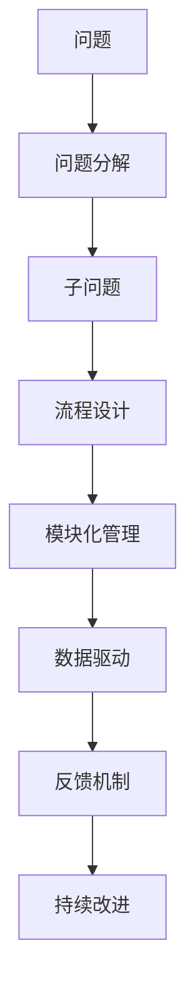
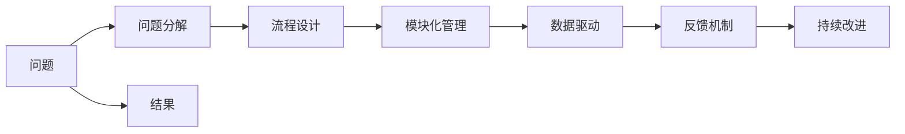

                 

# 结构化思维的应用：从理论到实践

## 1. 背景介绍

### 1.1 问题由来

在当今快速变化的技术和商业环境中，结构化思维（Structured Thinking）的应用显得尤为重要。它是一种系统化、规范化的方法，能够帮助个人和企业应对复杂多变的问题，从而在竞争激烈的市场中脱颖而出。结构化思维的应用范围涵盖了从产品开发、项目管理到市场营销等多个领域，成为组织和个人提高效率和决策能力的关键工具。

### 1.2 问题核心关键点

结构化思维的核心关键点在于其系统性和规范性，通过将复杂问题拆分为可控的小模块，使用标准化的流程和方法来解决，从而降低决策风险，提升解决问题的效率和效果。这种思维方法具有以下几个特点：

- **系统性**：将问题分解为多个可管理的部分，避免遗漏重要细节。
- **规范性**：遵循标准化的流程和方法，确保一致性和可靠性。
- **可控性**：通过模块化管理，逐步推进，降低复杂性。
- **灵活性**：根据具体情况调整流程和方法，适应不同的环境和需求。

结构化思维的应用不仅能提高解决问题的效率，还能促进团队协作，优化资源配置，提升组织创新能力。

### 1.3 问题研究意义

结构化思维的广泛应用，对个人和企业的发展具有重要意义：

1. **提升决策质量**：通过系统化的方法，减少决策中的主观偏差，提高决策的科学性和准确性。
2. **优化资源利用**：规范化流程可以更高效地利用资源，避免资源浪费。
3. **增强团队协作**：结构化思维提供了一套通用的方法和工具，便于团队成员理解和协作。
4. **促进创新发展**：通过规范化的方法，可以不断积累经验，形成知识库，促进创新。
5. **提升组织能力**：结构化思维的应用，有助于建立标准化的流程，提升组织整体能力。

## 2. 核心概念与联系

### 2.1 核心概念概述

结构化思维的应用涉及多个核心概念，下面将逐一介绍：

- **问题分解（Problem Decomposition）**：将复杂问题拆分为多个可管理的子问题，以便逐步解决。
- **流程设计（Process Design）**：设计标准化的流程和方法，确保问题解决的一致性和可靠性。
- **模块化管理（Modular Management）**：将问题解决过程模块化，便于管理和优化。
- **数据驱动（Data-Driven）**：通过收集和分析数据，指导决策和改进流程。
- **反馈机制（Feedback Mechanism）**：建立持续的反馈机制，及时调整和改进流程。

### 2.2 核心概念原理和架构的 Mermaid 流程图



这个流程图展示了结构化思维的基本流程，从问题分解开始，经过流程设计、模块化管理、数据驱动和反馈机制，最终实现持续改进。

### 2.3 核心概念的整体架构

通过将结构化思维的关键概念整合，形成一个完整的框架，如下所示：



这个综合图表展示了结构化思维从问题定义到结果输出的整体架构，各个步骤相互关联，形成一个闭环系统。

## 3. 核心算法原理 & 具体操作步骤

### 3.1 算法原理概述

结构化思维的应用原理基于系统化的流程和方法，通过将复杂问题拆分为多个子问题，使用标准化的步骤和工具来逐步解决。这种系统化的流程和方法，能够确保问题解决的一致性和可靠性，降低决策风险，提高效率和效果。

### 3.2 算法步骤详解

结构化思维的应用步骤主要包括以下几个环节：

1. **问题定义**：明确问题的核心目标和范围，识别关键因素和假设条件。
2. **问题分解**：将问题拆分为多个可管理的子问题，以便逐步解决。
3. **流程设计**：设计标准化的流程和方法，确保问题解决的一致性和可靠性。
4. **模块化管理**：将问题解决过程模块化，便于管理和优化。
5. **数据驱动**：通过收集和分析数据，指导决策和改进流程。
6. **反馈机制**：建立持续的反馈机制，及时调整和改进流程。
7. **持续改进**：根据反馈结果，持续优化流程和方法，不断提高解决问题的能力。

### 3.3 算法优缺点

结构化思维具有以下优点：

- **系统性和规范性**：通过将问题拆分为多个子问题，并使用标准化的流程和方法，能够确保问题解决的一致性和可靠性。
- **可控性和灵活性**：模块化管理使问题解决过程更具可控性，同时也能根据具体情况调整流程和方法，提高适应性。
- **效率和效果**：通过系统化的方法，降低决策风险，提高解决问题的效率和效果。

但同时也存在一些缺点：

- **复杂性**：结构化思维的流程和方法相对复杂，需要一定的专业知识和经验。
- **灵活性受限**：标准化流程可能不够灵活，难以应对非常规问题。
- **资源消耗**：设计和实施结构化流程需要一定的时间和资源投入。

### 3.4 算法应用领域

结构化思维在多个领域都有广泛应用，包括但不限于以下几方面：

1. **产品开发**：通过系统化的流程，确保产品开发的各个环节高效有序，提高产品质量和市场竞争力。
2. **项目管理**：规范化的项目管理流程，确保项目按时按质完成，减少资源浪费。
3. **市场营销**：结构化思维帮助企业设计市场营销策略，提高广告投放的精准度和效果。
4. **数据分析**：通过数据驱动的方法，优化数据分析流程，提高数据质量和分析结果的可靠性。
5. **创新管理**：结构化思维促进创新，通过规范化的方法积累经验，形成知识库，支持持续创新。

## 4. 数学模型和公式 & 详细讲解 & 举例说明

### 4.1 数学模型构建

结构化思维的数学模型主要基于系统化的流程和方法，通过将问题拆分为多个子问题，使用标准化的步骤和工具来逐步解决。这种系统化的流程和方法，能够确保问题解决的一致性和可靠性，降低决策风险，提高效率和效果。

### 4.2 公式推导过程

以项目管理为例，项目管理中常用的甘特图（Gantt Chart）和关键路径法（Critical Path Method, CPM）可以用于结构化思维的应用。

- **甘特图**：将项目管理任务按时间顺序排列，直观地展示各个任务的开始和结束时间，以及依赖关系。
- **关键路径法**：通过分析任务依赖关系，找出关键路径，即对项目工期影响最大的路径，从而优化项目安排。

### 4.3 案例分析与讲解

假设某公司要开发一款新产品，可以使用结构化思维的流程来指导项目开发：

1. **问题定义**：明确产品开发的目标和范围，确定产品的关键特性和功能。
2. **问题分解**：将产品开发任务分解为多个子任务，如市场调研、需求分析、技术实现、测试等。
3. **流程设计**：设计各子任务的标准化流程和方法，如市场调研问卷设计、需求分析用户访谈等。
4. **模块化管理**：将各子任务模块化，确保各个环节高效有序。
5. **数据驱动**：通过收集和分析市场调研数据和用户反馈，指导产品开发和改进。
6. **反馈机制**：建立持续的反馈机制，及时调整和改进产品开发流程。
7. **持续改进**：根据市场和用户反馈，持续优化产品功能和用户体验。

## 5. 项目实践：代码实例和详细解释说明

### 5.1 开发环境搭建

结构化思维的应用实践涉及多个工具和环境，以下是一套典型的开发环境搭建流程：

1. **项目管理工具**：如JIRA、Trello等，用于任务管理和进度跟踪。
2. **代码托管平台**：如GitHub、GitLab等，用于版本控制和协作开发。
3. **数据管理系统**：如SQLite、MySQL等，用于数据存储和分析。
4. **协作工具**：如Slack、Microsoft Teams等，用于团队沟通和协作。
5. **数据采集和处理工具**：如Python中的Pandas、Scikit-learn等，用于数据收集和预处理。
6. **项目管理模板**：如敏捷开发框架Scrum和Kanban，用于规范项目管理流程。

### 5.2 源代码详细实现

以项目管理工具JIRA为例，展示如何使用JIRA进行项目管理的代码实现。

```python
from jira import JIRA

# 初始化JIRA客户端
jira = JIRA('https://jira.example.com', username='username', password='password')

# 创建新项目
project = jira.create_project('SPRINT-1', 'Sprint Project')
print(f'Project ID: {project.key}')

# 创建任务
issue = jira.create_issue(project={'key': 'SPRINT-1'}, summary='Task 1', description='Task description')
print(f'Issue ID: {issue.key}')

# 分配任务
jira.update_issues(issue_id=issue.key, fields={'assignee': {'value': 'user1'}})
print(f'Task assigned to user1')

# 更新任务状态
jira.update_issues(issue_id=issue.key, fields={'status': {'value': 'Done'}})
print(f'Task marked as Done')
```

### 5.3 代码解读与分析

以上代码展示了如何使用JIRA进行项目管理和任务分配。首先，通过初始化JIRA客户端，连接到JIRA系统。然后，创建新的项目和任务，并分配给特定的用户。最后，更新任务状态，完成项目进度。

### 5.4 运行结果展示

假设以上代码成功执行，可以得到以下结果：

- **创建项目成功**：打印出项目ID。
- **创建任务成功**：打印出任务ID。
- **分配任务成功**：打印出任务已分配给用户1。
- **更新任务状态成功**：打印出任务标记为Done。

## 6. 实际应用场景

### 6.1 智能制造

结构化思维在智能制造中的应用，通过系统化的流程管理，确保生产过程的规范性和高效性，提高产品质量和生产效率。例如，通过结构化思维设计的生产流程图，可以清晰地展示各个环节的顺序和依赖关系，确保生产过程的顺畅和一致性。

### 6.2 金融服务

在金融服务领域，结构化思维帮助金融机构设计风险管理和客户服务流程，提高服务质量和风险控制能力。例如，通过结构化思维设计的风险评估模型，可以系统化地分析客户信用风险，制定科学的贷款审批策略。

### 6.3 医疗健康

结构化思维在医疗健康领域的应用，通过规范化流程，确保医疗服务的规范性和一致性，提高医疗质量和患者满意度。例如，通过结构化思维设计的患者护理流程，可以系统化地管理患者的护理任务，确保护理工作的有序性和高效性。

### 6.4 未来应用展望

随着技术的发展和应用场景的拓展，结构化思维的应用前景更加广阔：

1. **自动化和智能化**：结合人工智能技术，自动化地进行问题分析和解决方案设计。
2. **跨领域应用**：结构化思维的原理和方法可以跨领域应用，如智慧城市、智慧农业等。
3. **实时监控和反馈**：通过实时监控和反馈机制，持续优化流程和方法。
4. **持续学习**：结构化思维的学习机制，不断积累经验，形成知识库，支持持续改进。
5. **多学科融合**：结构化思维与其他学科知识的融合，如数据科学、人工智能等，形成跨学科的知识体系。

## 7. 工具和资源推荐

### 7.1 学习资源推荐

为了帮助开发者深入理解结构化思维的理论和实践，以下推荐一些优质的学习资源：

1. **《结构化思维》书籍**：介绍结构化思维的基本原理和方法，适合初学者和进阶者。
2. **Coursera《结构化思维》课程**：由顶尖大学开设的课程，提供系统的结构化思维培训。
3. **MindTools网站**：提供丰富的结构化思维工具和方法，适合实际应用。
4. **TED Talks《结构化思维的力量》**：通过演讲和实例，展示结构化思维的实际应用。
5. **《金字塔原理》书籍**：介绍结构化表达和沟通的技巧，提高沟通效率。

### 7.2 开发工具推荐

结构化思维的开发和应用涉及多个工具和环境，以下推荐一些常用的开发工具：

1. **项目管理工具**：如JIRA、Trello、Asana等，用于任务管理和进度跟踪。
2. **代码托管平台**：如GitHub、GitLab等，用于版本控制和协作开发。
3. **数据管理系统**：如SQLite、MySQL等，用于数据存储和分析。
4. **协作工具**：如Slack、Microsoft Teams等，用于团队沟通和协作。
5. **数据采集和处理工具**：如Python中的Pandas、Scikit-learn等，用于数据收集和预处理。
6. **项目管理模板**：如敏捷开发框架Scrum和Kanban，用于规范项目管理流程。

### 7.3 相关论文推荐

结构化思维的研究涉及多个领域，以下推荐几篇具有代表性的相关论文：

1. **《结构化思维在项目管理中的应用》**：探讨结构化思维在项目管理中的实际应用，提出优化项目管理流程的方法。
2. **《基于结构化思维的产品开发流程设计》**：介绍结构化思维在产品开发中的应用，提出系统化的产品开发流程。
3. **《结构化思维与数据驱动决策》**：探讨结构化思维与数据驱动决策的结合，提出基于数据驱动的结构化思维方法。
4. **《结构化思维在智能制造中的应用》**：介绍结构化思维在智能制造中的应用，提出智能制造的规范化流程。
5. **《结构化思维与跨学科融合》**：探讨结构化思维与其他学科知识的融合，提出跨学科的知识体系。

## 8. 总结：未来发展趋势与挑战

### 8.1 总结

本文对结构化思维的基本原理和应用进行了系统介绍。通过将复杂问题拆分为多个可管理的子问题，使用标准化的流程和方法逐步解决，结构化思维能够降低决策风险，提高解决问题的效率和效果。本文不仅详细介绍了结构化思维的原理和步骤，还提供了具体的实践案例和代码实现，帮助读者更好地理解结构化思维的应用。

### 8.2 未来发展趋势

结构化思维的应用前景广阔，未来将呈现以下几个发展趋势：

1. **自动化和智能化**：结构化思维将与人工智能技术结合，实现自动化的问题分析和解决方案设计。
2. **跨领域应用**：结构化思维的原理和方法可以跨领域应用，如智慧城市、智慧农业等。
3. **实时监控和反馈**：通过实时监控和反馈机制，持续优化流程和方法。
4. **持续学习**：结构化思维的学习机制，不断积累经验，形成知识库，支持持续改进。
5. **多学科融合**：结构化思维与其他学科知识的融合，如数据科学、人工智能等，形成跨学科的知识体系。

### 8.3 面临的挑战

尽管结构化思维的应用前景广阔，但在实际应用中仍面临一些挑战：

1. **复杂性**：结构化思维的流程和方法相对复杂，需要一定的专业知识和经验。
2. **灵活性受限**：标准化流程可能不够灵活，难以应对非常规问题。
3. **资源消耗**：设计和实施结构化流程需要一定的时间和资源投入。
4. **数据依赖**：结构化思维依赖于数据的质量和可用性，数据不足或数据质量差会影响流程设计。
5. **组织文化**：组织内部的文化和习惯会影响结构化思维的推广和应用。

### 8.4 研究展望

为了应对上述挑战，未来的研究需要在以下几个方面进行探索：

1. **简化流程设计**：简化结构化思维的流程设计，提高易用性和可操作性。
2. **增强灵活性**：设计更加灵活的结构化思维方法，应对非常规问题。
3. **优化资源配置**：优化结构化思维的资源配置，提高效率和效果。
4. **提升数据质量**：提高数据的收集和分析质量，支持结构化思维的应用。
5. **改善组织文化**：通过培训和教育，改变组织内部的文化和习惯，支持结构化思维的应用。

总之，结构化思维的应用需要从多个维度进行优化和提升，才能更好地适应复杂多变的技术和商业环境，为组织和个人带来更大的价值。

## 9. 附录：常见问题与解答

**Q1: 结构化思维和传统项目管理有什么区别？**

A: 结构化思维是一种系统化的思维方法，通过将复杂问题拆分为多个可管理的子问题，使用标准化的流程和方法逐步解决。传统项目管理更侧重于具体的项目管理和执行，而不是系统的思维方法。结构化思维有助于系统性地解决复杂问题，提高决策的科学性和效果。

**Q2: 结构化思维如何应对非常规问题？**

A: 结构化思维的主要挑战在于标准化流程可能不够灵活，难以应对非常规问题。应对非常规问题的方法包括：
1. **灵活调整流程**：根据具体情况调整流程和方法，增强灵活性。
2. **引入创新思维**：结合其他创新思维方法，如设计思维、创新工坊等，解决非常规问题。
3. **多学科融合**：与其他学科知识结合，形成跨学科的知识体系，解决复杂问题。

**Q3: 结构化思维在跨领域应用中需要注意什么？**

A: 结构化思维在跨领域应用中需要注意以下几点：
1. **了解领域知识**：熟悉目标领域的专业知识，结合结构化思维方法，进行有效应用。
2. **结合领域工具**：使用领域内成熟的工具和方法，结合结构化思维，提升应用效果。
3. **持续学习和改进**：在实际应用中不断积累经验，优化流程和方法，支持持续改进。

总之，结构化思维的应用需要结合具体场景和领域特点，灵活调整和优化，才能更好地发挥其系统化和规范化的优势。

---

作者：禅与计算机程序设计艺术 / Zen and the Art of Computer Programming

