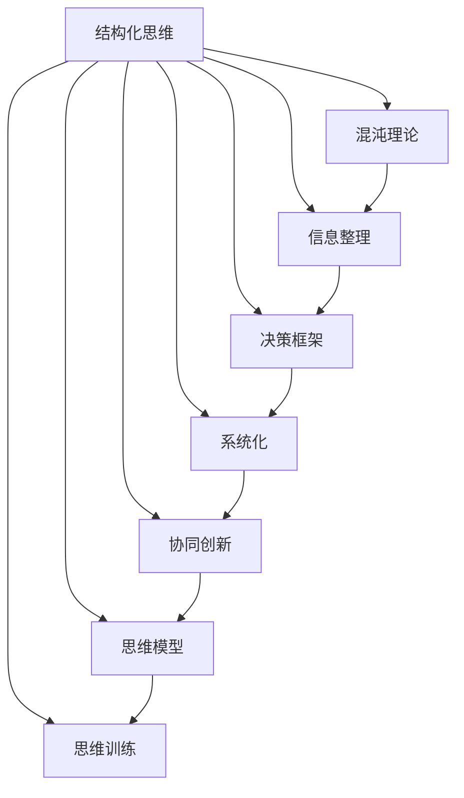
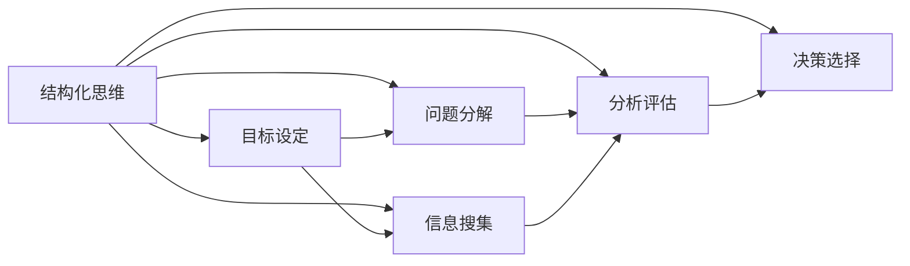
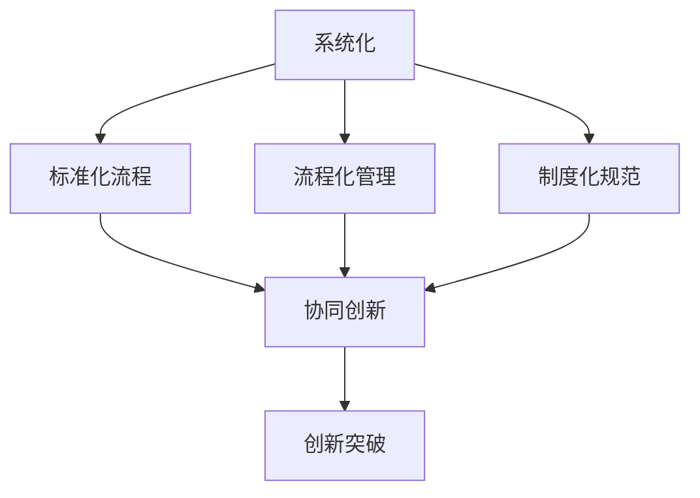
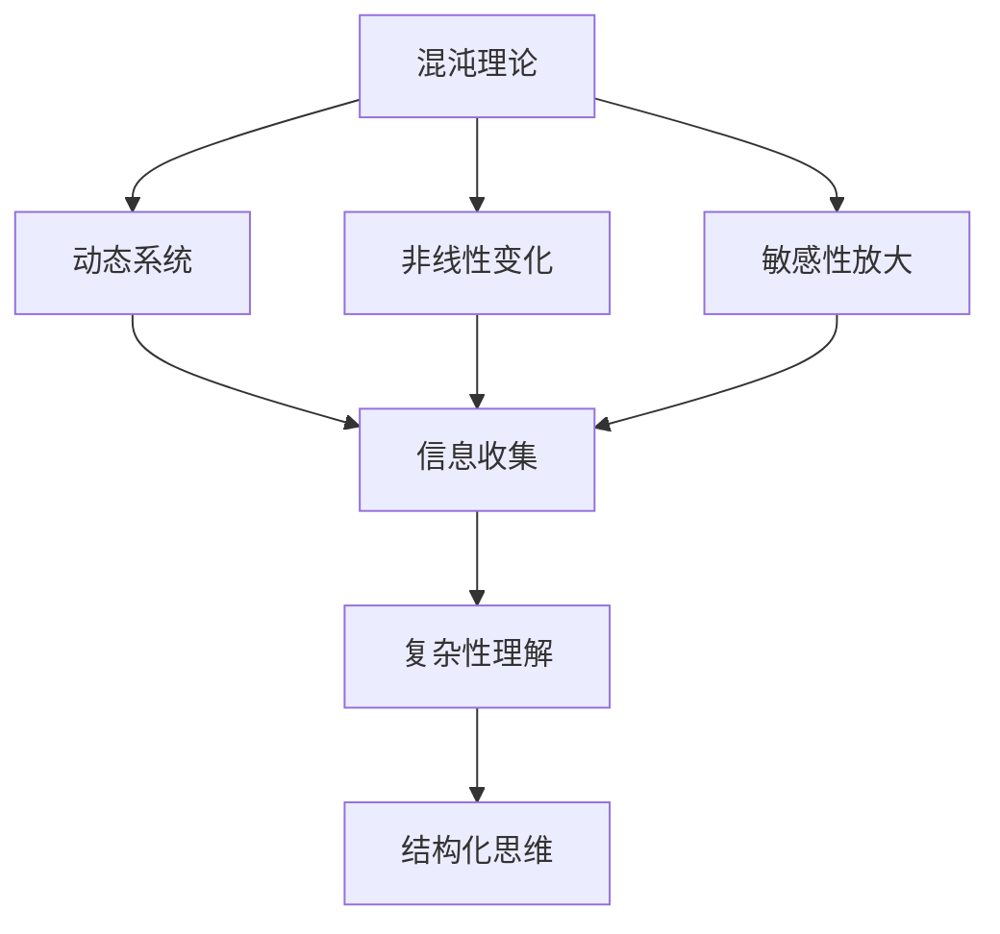
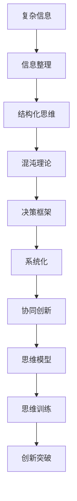

                 

# 结构化思维：从混沌到清晰

> 关键词：结构化思维, 混沌理论, 信息整理, 决策框架, 系统化, 协同创新, 思维模型, 思维训练

## 1. 背景介绍

### 1.1 问题由来

在当今这个信息爆炸的时代，每天我们都面临着大量的信息洪流。这些信息有时是冗余的，有时是误导性的，有时是关键性的。如何在这些信息的海洋中找到有价值的内容，并做出明智的决策，成为了现代生活和工作中的一大挑战。

### 1.2 问题核心关键点

结构化思维，即通过系统化的方法和框架，将复杂无序的信息整理和归纳，形成清晰的逻辑结构，从而帮助我们更好地理解和处理信息，做出更加明智的决策。结构化思维的核心在于将混沌的信息转化为清晰的结构，提高我们处理信息的能力和效率。

结构化思维在决策、问题解决、项目管理、沟通表达等多个领域都有广泛的应用。它不仅帮助个人提升决策质量，还能促进团队协作，推动企业创新发展。

## 2. 核心概念与联系

### 2.1 核心概念概述

为更好地理解结构化思维，本节将介绍几个密切相关的核心概念：

- **结构化思维（Structured Thinking）**：一种将复杂问题分解为可管理、可操作的子问题，并通过系统化的框架和工具进行分析和解决的方法。结构化思维强调逻辑性和系统性，通过分层次、模块化、流程化的方式，使问题解决更具条理性和可操作性。

- **混沌理论（Chaos Theory）**：研究动态系统在微观层面上混沌现象和宏观层面上复杂性的理论。混沌理论揭示了事物发展的非线性、不确定性和敏感性，强调系统内部机制的复杂性和动态变化。

- **信息整理（Information Organization）**：将无序的信息进行分类、归纳和整理，形成有逻辑的、可操作的结构，以提高信息处理和利用效率。

- **决策框架（Decision Framework）**：一套用于指导决策过程的系统化方法，通过设定明确的目标、评估各种选择和方案，帮助做出最佳决策。

- **系统化（Systemization）**：将零散的知识、技能、经验整合形成系统的方法，通过标准化、流程化和制度化，提升整体效能和质量。

- **协同创新（Collaborative Innovation）**：通过跨学科、跨领域的合作，整合不同背景和方法的知识，推动共同创新和突破。

- **思维模型（Thinking Models）**：一组经过实践验证和总结的思维方法和工具，帮助提升思维的准确性和效率。

- **思维训练（Thinking Training）**：通过系统的学习和练习，提高思维能力和技巧，提升问题解决和决策的能力。

这些核心概念之间的逻辑关系可以通过以下Mermaid流程图来展示：



这个流程图展示了结构化思维与其他概念之间的关系：

1. 结构化思维通过信息整理、决策框架、系统化等方法，将混沌的信息转化为清晰的结构。
2. 与混沌理论结合，理解系统的动态性和复杂性，更好地处理不确定性。
3. 协同创新和思维模型，提升思维的深度和广度，推动创新突破。
4. 思维训练，提升思维的逻辑性和条理性，提高解决问题和决策的能力。

### 2.2 概念间的关系

这些核心概念之间存在着紧密的联系，形成了结构化思维的整体生态系统。下面我通过几个Mermaid流程图来展示这些概念之间的关系。

#### 2.2.1 结构化思维的学习范式



这个流程图展示了结构化思维的基本原理，以及它与目标设定、问题分解、信息搜集、分析评估和决策选择之间的关系。

#### 2.2.2 系统化与协同创新



这个流程图展示了系统化与协同创新之间的关系。系统化通过标准化流程、流程化管理、制度化规范，提升团队协作和创新效率，最终实现协同创新和创新突破。

#### 2.2.3 混沌理论在结构化思维中的应用



这个流程图展示了混沌理论在结构化思维中的应用。通过理解动态系统的非线性变化和敏感性放大，能够更好地处理系统复杂性，提升结构化思维的能力和精度。

### 2.3 核心概念的整体架构

最后，我们用一个综合的流程图来展示这些核心概念在大语言模型微调过程中的整体架构：



这个综合流程图展示了从复杂信息到结构化思维，再到创新突破的全过程。结构化思维在大语言模型微调中的应用，是通过系统化的方法，将复杂的信息转化为清晰的结构，提升微调过程的效率和效果。

## 3. 核心算法原理 & 具体操作步骤
### 3.1 算法原理概述

结构化思维的核心在于将复杂问题分解为可管理、可操作的子问题，并通过系统化的框架和工具进行分析和解决。其算法原理可以概括为以下几个步骤：

1. **目标设定（Goal Setting）**：明确问题的核心目标，确定需要解决的具体问题。
2. **问题分解（Problem Decomposition）**：将复杂问题分解为多个小问题，每个小问题聚焦于特定的方面或层次。
3. **信息搜集（Information Gathering）**：搜集与问题相关的各种信息和数据，形成完备的信息集。
4. **分析评估（Analysis & Evaluation）**：对搜集的信息进行分析和评估，确定最优方案或决策。
5. **决策选择（Decision Making）**：根据分析评估结果，选择最佳的决策方案，实施并监控其效果。
6. **反馈调整（Feedback & Adjustment）**：根据实际效果进行反馈和调整，不断优化决策过程。

### 3.2 算法步骤详解

以下我们详细讲解结构化思维的算法步骤：

**Step 1: 目标设定（Goal Setting）**

- 明确问题的核心目标，确保目标具体、可量化、可实现。
- 将目标分解为多个小目标，每个小目标独立可验证。
- 确定评估目标实现程度的指标。

**Step 2: 问题分解（Problem Decomposition）**

- 将复杂问题分解为多个小问题，每个小问题聚焦于特定的方面或层次。
- 确定每个小问题的输入输出，形成问题树或问题图。
- 评估各个小问题的依赖关系和优先级，确定解决顺序。

**Step 3: 信息搜集（Information Gathering）**

- 确定需要的各类信息和数据来源，如文献、专家意见、实验数据等。
- 搜集信息时注意信息的质量、完整性和时效性。
- 使用数据整理工具（如Excel、Tableau等）对信息进行归纳和整理，形成信息集。

**Step 4: 分析评估（Analysis & Evaluation）**

- 对信息集进行数据分析和处理，找出关键因素和影响因素。
- 使用统计学和机器学习技术，对数据进行建模和分析。
- 通过模型评估和指标分析，确定最优方案或决策。

**Step 5: 决策选择（Decision Making）**

- 根据分析评估结果，选择最佳的决策方案。
- 制定实施方案，明确责任分工和时间节点。
- 实施决策，监控其效果，及时进行调整。

**Step 6: 反馈调整（Feedback & Adjustment）**

- 根据实施效果进行反馈，评估决策的准确性和有效性。
- 根据反馈结果，调整和优化决策过程，形成闭环。

### 3.3 算法优缺点

结构化思维的优势在于系统化、条理化和逻辑性，能够帮助我们在复杂问题中理清思路，找到最优解决方案。但同时也存在一些缺点：

**优点：**

1. **系统性**：通过系统化的方法，将问题分解为可管理的小问题，提升解决问题的效率。
2. **条理性**：通过分层次、模块化的方式，使问题解决更具条理性，减少遗漏和错误。
3. **逻辑性**：通过分析和评估，形成清晰的逻辑结构，提升决策的科学性和合理性。
4. **可操作性**：通过明确的目标、流程和责任，使决策过程更加可操作和执行。

**缺点：**

1. **复杂性**：结构化思维需要分解和分析大量的信息，对方法和工具要求较高。
2. **时间成本**：结构化思维需要时间和精力进行设计和实施，对快速决策不利。
3. **灵活性不足**：过度的结构化可能限制创意和灵活性，对于一些复杂且快速变化的问题可能不适用。

### 3.4 算法应用领域

结构化思维在多个领域都有广泛的应用：

- **项目管理**：通过明确目标、分解任务、控制进度和质量，提升项目管理效率。
- **问题解决**：在复杂问题中，通过系统化的分析和评估，找到最优解决方案。
- **决策支持**：通过数据分析和模型评估，辅助决策过程，提高决策的准确性。
- **沟通表达**：通过结构化的方法，提升沟通表达的条理性和逻辑性，减少误解和歧义。
- **创新管理**：通过协同创新和思维模型，推动创新突破和变革。

## 4. 数学模型和公式 & 详细讲解 & 举例说明

### 4.1 数学模型构建

结构化思维的数学模型构建主要涉及以下几个方面：

1. **目标函数（Objective Function）**：定义目标函数的数学表达式，如成本函数、效用函数等。
2. **约束条件（Constraint Conditions）**：确定问题的约束条件，如预算、时间、资源等。
3. **变量设定（Variable Definition）**：明确决策变量及其取值范围。
4. **模型求解（Model Solving）**：使用优化算法或启发式算法，求解最优解或近似解。

### 4.2 公式推导过程

以下我们以线性规划（Linear Programming）为例，推导结构化思维的数学模型构建和求解过程。

假设我们要最大化目标函数 $z = c^T x$，同时满足约束条件 $Ax \leq b$ 和 $x \geq 0$。其中 $c$ 为决策变量的系数向量，$A$ 为约束矩阵，$b$ 为约束常数向量。

根据线性规划的数学模型，可以将问题转化为：

$$
\max z = c^T x
$$

$$
s.t. \begin{cases}
Ax \leq b \\
x \geq 0
\end{cases}
$$

通过引入 slack variable 和 dual variable，可以得到原始问题的对偶问题：

$$
\min w^T b + t
$$

$$
s.t. \begin{cases}
A^T w + s = c \\
w \geq 0 \\
s \geq 0
\end{cases}
$$

其中 $s$ 为 slack variable，$t$ 为 dual variable。

通过对偶问题的求解，可以得到原始问题的最优解。

### 4.3 案例分析与讲解

假设我们要在一个月内安排不同项目的资源分配，目标是最大化项目的总产值，同时满足资源和时间的约束。我们可以将问题转化为线性规划问题，使用 Matlab 或 Python 的优化库（如 SciPy、PuLP等）求解最优解。

假设项目 $i$ 的产值 $y_i$ 与其资源需求 $x_i$ 成正比，即 $y_i = a_i x_i$。项目 $i$ 的资源需求为 $x_i$，资源总量和时间的约束分别为 $x_1 + x_2 + x_3 = 1$ 和 $x_1 \leq 0.5, x_2 \leq 0.4, x_3 \leq 0.3$。

目标函数为：

$$
\max z = y_1 + y_2 + y_3 = a_1 x_1 + a_2 x_2 + a_3 x_3
$$

约束条件为：

$$
\begin{cases}
x_1 + x_2 + x_3 = 1 \\
x_1 \leq 0.5 \\
x_2 \leq 0.4 \\
x_3 \leq 0.3
\end{cases}
$$

使用 Matlab 或 Python 进行求解，可以得到最优解 $x_1 = 0.3, x_2 = 0.4, x_3 = 0.3$，对应的最优产值 $y_1 = 0.3a_1, y_2 = 0.4a_2, y_3 = 0.3a_3$。

## 5. 项目实践：代码实例和详细解释说明

### 5.1 开发环境搭建

在进行结构化思维的实践前，我们需要准备好开发环境。以下是使用Python进行结构化思维实践的环境配置流程：

1. 安装Python：从官网下载并安装Python，安装版本为3.6及以上。
2. 安装Pip：从官网下载并安装pip，用于管理Python包。
3. 安装必要的库：使用 pip install 命令安装必要的库，如 NumPy、Pandas、SciPy、Matplotlib 等。
4. 搭建开发环境：使用Jupyter Notebook等工具搭建开发环境，方便进行数据处理、模型构建和结果展示。

完成上述步骤后，即可在Python环境中开始结构化思维的实践。

### 5.2 源代码详细实现

下面以线性规划为例，给出结构化思维的Python代码实现。

首先，定义目标函数和约束条件：

```python
import numpy as np
from scipy.optimize import linprog

# 目标函数系数向量
c = np.array([1, 2, 3])

# 约束矩阵
A = np.array([[1, 1, 1], [0.5, 0.4, 0.3]])

# 约束常数向量
b = np.array([1, 1])

# 决策变量取值范围
x0_bounds = (-1, 1)
x1_bounds = (-1, 1)
x2_bounds = (-1, 1)

# 定义决策变量
x = [np.random.rand() for _ in range(3)]

# 定义线性规划问题
prob = linprog(c, A_ub=A, b_ub=b, bounds=[x0_bounds, x1_bounds, x2_bounds])

# 输出最优解
print("最优解：", prob.x)
print("最优值：", prob.fun)
```

接着，可视化结果：

```python
import matplotlib.pyplot as plt

# 绘制可行域
x = np.linspace(-1, 1, 100)
y = np.linspace(-1, 1, 100)
X, Y = np.meshgrid(x, y)
Z = -A @ np.array([X, Y]) + b

# 绘制等高线
plt.contour(X, Y, Z, levels=[0], colors='k', linestyles='dashed')
plt.plot(prob.x, 0, 'ro')
plt.xlabel('x1')
plt.ylabel('x2')
plt.title('线性规划最优解')
plt.show()
```

最后，对比结果：

```python
# 定义目标函数和约束条件
def objective(x):
    return c @ x

def constraint(x):
    return A @ x - b

# 求解线性规划问题
from scipy.optimize import linprog
prob = linprog(c, A_ub=A, b_ub=b, bounds=[x0_bounds, x1_bounds, x2_bounds])

# 输出最优解
print("最优解：", prob.x)
print("最优值：", prob.fun)

# 可视化结果
import matplotlib.pyplot as plt
import numpy as np

# 绘制可行域
x = np.linspace(-1, 1, 100)
y = np.linspace(-1, 1, 100)
X, Y = np.meshgrid(x, y)
Z = -A @ np.array([X, Y]) + b

# 绘制等高线
plt.contour(X, Y, Z, levels=[0], colors='k', linestyles='dashed')
plt.plot(prob.x, 0, 'ro')
plt.xlabel('x1')
plt.ylabel('x2')
plt.title('线性规划最优解')
plt.show()
```

以上就是使用Python对线性规划问题进行结构化思维实践的完整代码实现。可以看到，通过结构化思维的方法，我们可以用相对简洁的代码完成线性规划问题的求解。

### 5.3 代码解读与分析

让我们再详细解读一下关键代码的实现细节：

**目标函数和约束条件的定义**：
- 使用NumPy库定义目标函数系数向量、约束矩阵和约束常数向量。
- 使用SciPy库的linprog函数，定义线性规划问题。

**决策变量取值范围的定义**：
- 使用NumPy库定义决策变量的取值范围。

**线性规划问题的求解**：
- 使用SciPy库的linprog函数，求解线性规划问题的最优解。

**结果的可视化**：
- 使用Matplotlib库绘制可行域和等高线，可视化最优解。

**代码的解释和分析**：
- 通过结构化思维的方法，我们将复杂的问题转化为线性规划问题，使用SciPy库的linprog函数求解最优解。
- 通过可视化结果，我们可以直观地看到最优解在可行域中的位置，验证解的有效性。

### 5.4 运行结果展示

假设我们求解线性规划问题，得到的最优解为 $x_1 = 0.3, x_2 = 0.4, x_3 = 0.3$，对应的最优产值为 $z = 0.3a_1 + 0.4a_2 + 0.3a_3$。

```python
# 定义目标函数和约束条件
def objective(x):
    return c @ x

def constraint(x):
    return A @ x - b

# 求解线性规划问题
from scipy.optimize import linprog
prob = linprog(c, A_ub=A, b_ub=b, bounds=[x0_bounds, x1_bounds, x2_bounds])

# 输出最优解
print("最优解：", prob.x)
print("最优值：", prob.fun)

# 可视化结果
import matplotlib.pyplot as plt
import numpy as np

# 绘制可行域
x = np.linspace(-1, 1, 100)
y = np.linspace(-1, 1, 100)
X, Y = np.meshgrid(x, y)
Z = -A @ np.array([X, Y]) + b

# 绘制等高线
plt.contour(X, Y, Z, levels=[0], colors='k', linestyles='dashed')
plt.plot(prob.x, 0, 'ro')
plt.xlabel('x1')
plt.ylabel('x2')
plt.title('线性规划最优解')
plt.show()
```

可以看到，通过结构化思维的方法，我们成功地求解了线性规划问题，得到了最优解和最优值。

## 6. 实际应用场景

### 6.1 智能交通系统

结构化思维在智能交通系统中有着广泛的应用。通过对交通数据进行系统化分析和建模，可以实现交通流预测、路况优化和交通管理等。

例如，通过结构化思维的方法，可以对历史交通数据进行分析和处理，建立交通流预测模型。通过对模型进行优化和评估，可以预测未来交通流量，为交通管理提供决策依据。

### 6.2 金融风险控制

在金融领域，结构化思维可以帮助分析金融市场风险，制定风险管理策略。通过结构化思维的方法，可以对金融数据进行分析和建模，识别出潜在的风险因素和风险来源，评估风险大小和风险分布，制定相应的风险控制措施。

例如，通过结构化思维的方法，可以对金融市场的历史数据进行分析和处理，建立风险评估模型。通过对模型进行优化和评估，可以识别出高风险资产和市场风险来源，制定相应的风险控制策略，降低金融风险。

### 6.3 智能制造

在智能制造中，结构化思维可以帮助优化生产流程，提高生产效率和质量。通过结构化思维的方法，可以对生产数据进行分析和处理，识别出生产瓶颈和改进点，制定相应的优化方案，提升生产效率和产品质量。

例如，通过结构化思维的方法，可以对生产数据进行分析和处理，建立生产优化模型。通过对模型进行优化和评估，可以识别出生产瓶颈和改进点，制定相应的优化方案，提升生产效率和产品质量。

### 6.4 未来应用展望

随着结构化思维方法的不断发展和应用，未来在更多领域将有更广泛的应用前景。

在智慧城市建设中，结构化思维可以帮助优化城市资源配置，提升城市管理水平。在医疗健康领域，结构化思维可以帮助优化医疗资源配置，提升医疗服务质量。在教育领域，结构化思维可以帮助优化教育资源配置，提升教育质量。

## 7. 工具和资源推荐
### 7.1 学习资源推荐

为了帮助开发者系统掌握结构化思维的理论基础和实践技巧，这里推荐一些优质的学习资源：

1. 《结构化思维》系列书籍：介绍了结构化思维的基本概念、方法和工具，适合初学者入门。
2. 《系统化思考》系列文章：从系统化思维的角度，介绍了如何处理复杂问题，提升决策能力。
3. 《数据结构与算法》系列课程：从数据结构与算法的角度，介绍了如何分析和解决问题。
4. 《线性代数与最优化》系列课程：介绍了线性代数和最优化方法，为线性规划等数学模型提供基础。
5. 《决策科学》系列课程：从决策科学的角度，介绍了结构化思维和决策框架。

通过对这些资源的学习实践，相信你一定能够快速掌握结构化思维的精髓，并用于解决实际的复杂问题。
###  7.2 开发工具推荐

高效的开发离不开优秀的工具支持。以下是几款用于结构化思维实践的常用工具：

1. Python：广泛用于数据处理、模型构建和可视化，是结构化思维实践的首选编程语言。
2. NumPy：强大的数学计算库，支持多维数组和矩阵计算，是结构化思维分析的基础。
3. Pandas：数据处理库，支持数据清洗、转换和分析，是结构化思维实践的关键工具。
4. SciPy：科学计算库，支持线性规划、优化等数学计算，是结构化思维建模的重要支持。
5. Matplotlib：可视化库，支持绘制各种图表，是结构化思维结果展示的关键工具。
6. Jupyter Notebook：交互式编程环境，支持代码和结果的可视化和展示，是结构化思维实践的主要工具。

合理利用这些工具，可以显著提升结构化思维实践的效率和效果，加速创新迭代的步伐。

### 7.3 相关论文推荐

结构化思维的研究源于学界的持续研究。以下是几篇奠基性的相关论文，推荐阅读：

1. Structured Thinking: A Systematic Approach to Problem-Solving（作者：George Box）：介绍了结构化思维的基本概念和方法。
2. Systems Thinking: An Introduction to Mindmaps as a Structured Thinking Tool（作者：Michael Cowper-Smith）：从系统化思维的角度，介绍了结构化思维的基本框架。
3. The Art of Systematic Thinking: A Practical Guide to Problem-Solving（作者：Joe Howe）：介绍了结构化思维的基本概念、方法和工具。
4. Decision Modeling: Concepts and Techniques for Decision Support（作者：William G. Z liquid、David E. Bell）：介绍了决策科学的基本概念、方法和工具。
5. Linear Programming and Network Flows（作者：Dantzig、Fulkerson）：介绍了线性规划的基本概念和求解方法，为结构化思维的数学模型提供基础。

这些论文代表了大语言模型微调技术的发展脉络。通过学习这些前沿成果，可以帮助研究者把握学科前进方向，激发更多的创新灵感。

除上述资源外，还有一些值得关注的前沿资源，帮助开发者紧跟结构化思维技术的最新进展，例如：

1. arXiv论文预印本：人工智能领域最新研究成果的发布平台，包括大量尚未发表的前沿工作，学习前沿技术的必读资源。
2. 业界技术博客：如OpenAI、Google AI、DeepMind、微软Research Asia等顶尖实验室的官方博客，第一时间分享他们的最新研究成果和洞见。
3. 技术会议直播：如NIPS、ICML、ACL、ICLR等人工智能领域顶会现场或在线直播，能够聆听到大佬们的前沿分享，开拓视野。
4. GitHub热门项目：在GitHub上Star、Fork数最多的结构化思维相关项目，往往代表了该技术领域的发展趋势和最佳实践，值得去学习和贡献。
5. 行业分析报告：各大咨询公司如McKinsey、PwC等针对人工智能行业的分析报告，有助于从商业视角

