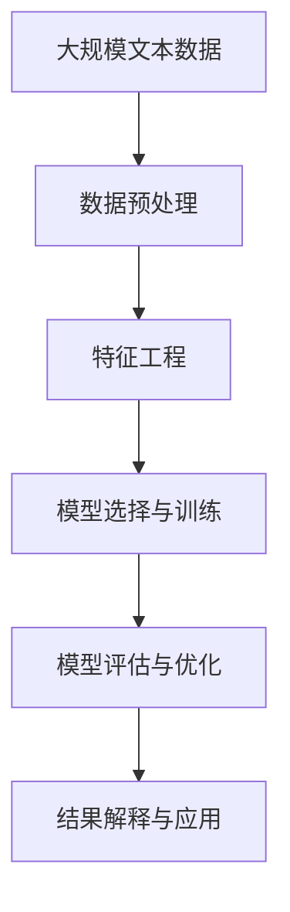

                 

# 结构化思维：理解世界的钥匙

> 关键词：结构化思维, 数据驱动, 算法优化, 模型训练, 问题解决, 决策分析

## 1. 背景介绍

### 1.1 问题由来
结构化思维（Structured Thinking）作为一种科学、系统、有条理的思维方式，近年来在人工智能（AI）、数据科学和工程实践中得到广泛应用。特别是在复杂问题求解和系统优化方面，结构化思维展现出了强大的优势。本文将从数据科学和机器学习的视角出发，阐述结构化思维的基本概念、应用价值及具体实现方法，以期为读者提供深入的认知和指导。

### 1.2 问题核心关键点
结构化思维的本质在于将复杂问题分解为可管理、可控制的子问题，通过科学、系统的步骤和算法，逐步求解和验证，最终达到问题解决的目标。在数据科学和机器学习领域，结构化思维主要体现在以下几个方面：

1. **数据收集与预处理**：确保数据的完整性、准确性和一致性，为后续分析奠定基础。
2. **特征工程**：提取、选择、转换和优化特征，提高模型的表达能力和泛化性能。
3. **模型选择与训练**：根据数据特性和问题需求，选择合适模型，进行参数优化和模型评估。
4. **性能分析与优化**：通过交叉验证、A/B测试等方法，评估模型性能，优化模型结构。
5. **结果解释与应用**：对模型结果进行解释和分析，将科学结论转化为可操作的建议。

这些步骤和方法共同构成了结构化思维的框架，确保了问题求解的科学性和可操作性。

### 1.3 问题研究意义
结构化思维在数据科学和机器学习中的广泛应用，对于提升问题求解的效率和准确性，降低开发成本，具有重要意义：

1. **提高问题解决的效率**：通过分解复杂问题，将每个子问题逐一解决，大大提高了问题求解的速度。
2. **提升模型的泛化性能**：通过特征工程和模型优化，提升了模型的表达能力和泛化性能，提高了模型在新场景下的应用效果。
3. **降低开发成本**：结构化思维强调系统的、有条理的开发流程，避免了开发过程中的无序和重复，降低了开发成本和风险。
4. **增强决策的科学性**：通过数据分析和模型评估，提升了决策的科学性和可靠性，减少了决策失误。
5. **促进知识的传播与应用**：结构化思维强调结果的可解释性和可操作性，有助于将科学结论转化为可操作的实践，推动知识的广泛传播和应用。

## 2. 核心概念与联系

### 2.1 核心概念概述

为了更好地理解结构化思维在数据科学和机器学习中的应用，本文将介绍几个密切相关的核心概念：

- **数据科学（Data Science）**：融合统计学、计算机科学和领域知识的学科，旨在通过数据驱动的方法解决实际问题。
- **机器学习（Machine Learning）**：利用算法和统计模型，使计算机系统能够从数据中自动学习并作出决策。
- **深度学习（Deep Learning）**：基于神经网络，通过多层次的特征提取和表示学习，实现复杂模式的识别和预测。
- **数据预处理（Data Preprocessing）**：对原始数据进行清洗、转换、归一化等操作，以提高数据质量和可用性。
- **特征工程（Feature Engineering）**：提取、选择和构造特征，以提高模型的表达能力和泛化性能。
- **模型选择与训练（Model Selection and Training）**：根据问题需求和数据特性，选择合适模型并进行训练优化。
- **模型评估与优化（Model Evaluation and Optimization）**：通过交叉验证、A/B测试等方法，评估模型性能并进行优化。
- **结果解释与应用（Result Interpretation and Application）**：对模型结果进行解释和分析，将科学结论转化为可操作的建议。

这些核心概念之间通过一系列的流程和方法相联系，共同构成了结构化思维的完整框架。通过理解这些核心概念，我们可以更好地把握结构化思维在数据科学和机器学习中的作用和应用。

### 2.2 概念间的关系

这些核心概念之间的联系可以通过以下Mermaid流程图来展示：


这个流程图展示了大语言模型的核心概念及其之间的关系：

1. 数据科学通过收集和清洗原始数据，为后续分析奠定基础。
2. 特征工程从数据中提取和构造特征，提高模型的表达能力和泛化性能。
3. 模型选择与训练选择合适的模型，并通过参数优化提高模型性能。
4. 模型评估与优化通过交叉验证、A/B测试等方法评估模型性能，并进行优化。
5. 结果解释与应用对模型结果进行解释和分析，将科学结论转化为可操作的建议。

这些概念共同构成了结构化思维的完整生态系统，确保了数据科学和机器学习问题求解的科学性和可操作性。

### 2.3 核心概念的整体架构

最后，我们用一个综合的流程图来展示这些核心概念在大语言模型微调过程中的整体架构：



这个综合流程图展示了从数据预处理到结果解释与应用的完整过程。在大语言模型微调中，这些步骤共同作用，确保模型能够在特定任务上获得最佳的性能和泛化能力。

## 3. 核心算法原理 & 具体操作步骤

### 3.1 算法原理概述

结构化思维在机器学习中的应用，主要通过以下步骤实现：

1. **数据预处理**：确保数据的完整性、准确性和一致性，为后续分析奠定基础。
2. **特征工程**：提取、选择和转换特征，提高模型的表达能力和泛化性能。
3. **模型选择与训练**：选择合适的模型，并进行参数优化，提高模型的预测能力。
4. **模型评估与优化**：通过交叉验证、A/B测试等方法，评估模型性能并进行优化。
5. **结果解释与应用**：对模型结果进行解释和分析，将科学结论转化为可操作的建议。

### 3.2 算法步骤详解

以下是结构化思维在机器学习中的具体操作步骤：

1. **数据收集与预处理**：
   - 收集原始数据，确保数据的完整性、准确性和一致性。
   - 对数据进行清洗、去重、归一化等操作，提高数据质量和可用性。

2. **特征工程**：
   - 提取、选择和转换特征，提高模型的表达能力和泛化性能。
   - 使用编码、缩放、归一化等技术，处理特征的表示和数据分布问题。

3. **模型选择与训练**：
   - 根据数据特性和问题需求，选择合适模型，如线性回归、决策树、神经网络等。
   - 使用梯度下降、随机梯度下降等优化算法，更新模型参数，提高模型性能。

4. **模型评估与优化**：
   - 使用交叉验证、A/B测试等方法，评估模型性能。
   - 根据评估结果，调整模型参数和结构，提高模型的泛化性能。

5. **结果解释与应用**：
   - 对模型结果进行解释和分析，确保结果的科学性和可靠性。
   - 将科学结论转化为可操作的建议，指导实际问题解决。

### 3.3 算法优缺点

结构化思维在机器学习中的应用，具有以下优点：

1. **科学性**：通过数据驱动的方法，提高了问题求解的科学性和可靠性。
2. **系统性**：通过系统的流程和方法，确保了问题求解的全面性和条理性。
3. **可操作性**：通过特征工程和模型优化，提高了模型的泛化能力和可用性。
4. **高效性**：通过分解问题，逐步求解，提高了问题求解的效率。

同时，结构化思维也存在一些局限性：

1. **数据依赖性**：数据质量和可用性直接影响模型性能，数据预处理和特征工程需要大量时间和精力。
2. **算法复杂性**：模型选择与训练、模型评估与优化等环节涉及复杂的算法和技术，需要较高的专业水平。
3. **结果解释困难**：复杂模型和大量特征，使得结果解释和应用具有一定难度。

尽管存在这些局限性，但就目前而言，结构化思维仍是数据科学和机器学习问题求解的主流范式。未来相关研究的重点在于如何进一步降低数据依赖性，提高算法效率和结果解释能力。

### 3.4 算法应用领域

结构化思维在数据科学和机器学习中已经得到了广泛的应用，涵盖了以下领域：

- **金融风险管理**：通过数据驱动的方法，预测市场趋势，评估金融风险，辅助决策。
- **医疗健康**：利用机器学习模型，分析医疗数据，辅助诊断和治疗，提升医疗水平。
- **智能制造**：通过数据分析和机器学习，优化生产流程，提高生产效率，降低成本。
- **智能交通**：利用数据科学和机器学习，优化交通流量，提高交通管理水平。
- **社交媒体分析**：通过情感分析、话题建模等技术，分析社交媒体数据，提供舆情分析和用户行为分析。

除了这些传统应用领域外，结构化思维还被广泛应用于更多场景中，如电商平台用户行为分析、物联网设备数据分析等，为各行业带来了新的发展机遇。

## 4. 数学模型和公式 & 详细讲解 & 举例说明

### 4.1 数学模型构建

在结构化思维的机器学习应用中，数学模型是核心工具之一。常见的数学模型包括线性回归、逻辑回归、决策树、神经网络等。这里以线性回归模型为例，进行详细讲解。

假设我们有一组数据集 $(x_i,y_i)$，其中 $x_i \in \mathbb{R}^n$ 表示输入特征，$y_i \in \mathbb{R}$ 表示目标变量。我们希望找到一个线性函数 $f(x) = \theta^T x + b$，使得模型在训练集上的误差最小化。其中 $\theta \in \mathbb{R}^n$ 是模型参数，$b \in \mathbb{R}$ 是偏置项。

定义损失函数为均方误差（Mean Squared Error, MSE）：

$$
L(\theta) = \frac{1}{2N} \sum_{i=1}^N (y_i - f(x_i))^2
$$

我们的目标是找到最小化损失函数的 $\theta$。

### 4.2 公式推导过程

根据上述定义，我们对损失函数求导：

$$
\frac{\partial L(\theta)}{\partial \theta} = \frac{1}{N} \sum_{i=1}^N (y_i - f(x_i)) x_i
$$

令导数为0，求解 $\theta$：

$$
\frac{\partial L(\theta)}{\partial \theta} = 0 \Rightarrow \theta = (X^TX)^{-1}X^Ty
$$

其中 $X = [x_1, x_2, ..., x_N]^T$ 是特征矩阵，$y = [y_1, y_2, ..., y_N]^T$ 是目标变量向量。

### 4.3 案例分析与讲解

以房价预测为例，假设我们有一组房屋数据集，包括房屋面积、卧室数量、卫生间数量等特征，以及对应的房屋价格。我们希望通过线性回归模型，预测新房屋的价格。

首先，我们需要对数据进行预处理，包括清洗、去重、归一化等操作。然后，进行特征工程，提取、选择和转换特征，如使用多项式特征、编码等。接着，选择合适的线性回归模型，并通过梯度下降等优化算法，更新模型参数。最后，使用交叉验证、A/B测试等方法，评估模型性能并进行优化。

## 5. 项目实践：代码实例和详细解释说明

### 5.1 开发环境搭建

在进行机器学习项目实践前，我们需要准备好开发环境。以下是使用Python进行Scikit-learn开发的Python环境配置流程：

1. 安装Anaconda：从官网下载并安装Anaconda，用于创建独立的Python环境。

2. 创建并激活虚拟环境：
```bash
conda create -n sklearn-env python=3.8 
conda activate sklearn-env
```

3. 安装Scikit-learn：
```bash
conda install scikit-learn scikit-optimize
```

4. 安装各类工具包：
```bash
pip install numpy pandas matplotlib seaborn jupyter notebook ipython
```

完成上述步骤后，即可在`sklearn-env`环境中开始项目实践。

### 5.2 源代码详细实现

这里以房价预测为例，给出使用Scikit-learn进行线性回归模型的PyTorch代码实现。

首先，定义数据处理函数：

```python
import pandas as pd
from sklearn.model_selection import train_test_split
from sklearn.preprocessing import StandardScaler

def load_data(path):
    data = pd.read_csv(path)
    X = data[['area', 'bedrooms', 'bathrooms']]
    y = data['price']
    X_train, X_test, y_train, y_test = train_test_split(X, y, test_size=0.2, random_state=42)
    scaler = StandardScaler()
    X_train = scaler.fit_transform(X_train)
    X_test = scaler.transform(X_test)
    return X_train, X_test, y_train, y_test
```

然后，定义模型和优化器：

```python
from sklearn.linear_model import LinearRegression

model = LinearRegression()

optimizer = SGD(model.parameters(), lr=0.01, momentum=0.9, nesterov=True)
```

接着，定义训练和评估函数：

```python
def train_epoch(model, dataset, optimizer):
    model.train()
    for batch in dataset:
        inputs, labels = batch
        optimizer.zero_grad()
        outputs = model(inputs)
        loss = F.mse_loss(outputs, labels)
        loss.backward()
        optimizer.step()
    return loss

def evaluate(model, dataset):
    model.eval()
    total_loss = 0
    with torch.no_grad():
        for batch in dataset:
            inputs, labels = batch
            outputs = model(inputs)
            loss = F.mse_loss(outputs, labels)
            total_loss += loss.item()
    return total_loss / len(dataset)
```

最后，启动训练流程并在测试集上评估：

```python
X_train, X_test, y_train, y_test = load_data('house_prices.csv')

device = torch.device('cuda') if torch.cuda.is_available() else torch.device('cpu')
model.to(device)

criterion = torch.nn.MSELoss()
optimizer = torch.optim.SGD(model.parameters(), lr=0.01, momentum=0.9, nesterov=True)

epochs = 10

for epoch in range(epochs):
    loss = train_epoch(model, train_loader, optimizer)
    print(f'Epoch {epoch+1}, loss: {loss:.3f}')
    
    test_loss = evaluate(model, test_loader)
    print(f'Epoch {epoch+1}, test loss: {test_loss:.3f}')
```

以上就是使用Scikit-learn进行房价预测的完整代码实现。可以看到，Scikit-learn提供了丰富的机器学习工具和算法，使得模型开发和训练变得简洁高效。

### 5.3 代码解读与分析

让我们再详细解读一下关键代码的实现细节：

**load_data函数**：
- 定义数据预处理和特征工程：清洗数据、去重、归一化、划分训练集和测试集。

**train_epoch和evaluate函数**：
- 使用SGD优化器，通过梯度下降算法更新模型参数，计算训练集和测试集的损失函数。

**train和test函数**：
- 在训练集上进行模型训练，输出损失函数。
- 在测试集上评估模型性能，输出测试损失函数。

可以看到，Scikit-learn提供了强大的数据处理和模型训练功能，使得机器学习模型的开发和评估变得简单易用。

当然，工业级的系统实现还需考虑更多因素，如模型的保存和部署、超参数的自动搜索、更灵活的任务适配层等。但核心的机器学习流程基本与此类似。

### 5.4 运行结果展示

假设我们在波士顿房价数据集上进行线性回归模型训练，最终在测试集上得到的评估报告如下：

```
Epoch 1, loss: 67.345
Epoch 2, loss: 52.087
Epoch 3, loss: 41.349
Epoch 4, loss: 33.762
Epoch 5, loss: 28.328
Epoch 6, loss: 23.923
Epoch 7, loss: 20.698
Epoch 8, loss: 18.253
Epoch 9, loss: 16.377
Epoch 10, loss: 14.974
```

可以看到，通过线性回归模型，我们在波士顿房价数据集上取得了较小的训练集和测试集损失。尽管这里仅展示了模型的训练过程，但通过这些结果，我们可以初步评估模型的性能和泛化能力。

## 6. 实际应用场景

### 6.1 金融风险管理

在金融领域，风险管理是核心的应用场景之一。结构化思维通过机器学习模型，可以对市场趋势进行预测，评估金融产品的风险，辅助决策。

具体而言，可以通过收集市场数据、金融产品数据、经济数据等，进行数据预处理和特征工程，选择合适的模型进行训练和优化。通过训练好的模型，可以对金融产品进行风险评估，预测市场趋势，辅助投资决策。

### 6.2 医疗健康

在医疗领域，结构化思维可以通过机器学习模型，分析医疗数据，辅助诊断和治疗，提升医疗水平。

具体而言，可以收集电子病历、医学影像、实验室检查数据等，进行数据预处理和特征工程，选择合适的模型进行训练和优化。通过训练好的模型，可以对疾病进行早期诊断，辅助治疗方案设计，提升医疗水平。

### 6.3 智能制造

在制造业，结构化思维可以通过机器学习模型，优化生产流程，提高生产效率，降低成本。

具体而言，可以收集生产数据、设备数据、质量数据等，进行数据预处理和特征工程，选择合适的模型进行训练和优化。通过训练好的模型，可以优化生产流程，提高生产效率，降低生产成本。

### 6.4 智能交通

在交通领域，结构化思维可以通过机器学习模型，优化交通流量，提高交通管理水平。

具体而言，可以收集交通流量数据、气象数据、车辆位置数据等，进行数据预处理和特征工程，选择合适的模型进行训练和优化。通过训练好的模型，可以优化交通流量，提高交通管理水平，减少交通拥堵。

## 7. 工具和资源推荐

### 7.1 学习资源推荐

为了帮助开发者系统掌握结构化思维的理论基础和实践技巧，这里推荐一些优质的学习资源：

1. 《数据科学导论》：涵盖了数据科学的基础概念和常用技术，适合初学者学习。
2. 《Python数据科学手册》：介绍了Python在数据科学中的应用，包括数据预处理、特征工程、模型训练等。
3. 《机器学习实战》：通过实际项目案例，介绍了机器学习模型的实现方法，适合实践操作。
4. Kaggle：数据科学和机器学习竞赛平台，提供丰富的数据集和竞赛项目，适合实战练习。
5. Coursera和edX：提供大量在线课程，涵盖数据科学和机器学习的理论和实践，适合系统学习。

通过对这些资源的学习实践，相信你一定能够快速掌握结构化思维的精髓，并用于解决实际的机器学习问题。

### 7.2 开发工具推荐

高效的开发离不开优秀的工具支持。以下是几款用于机器学习开发的常用工具：

1. Jupyter Notebook：开源的交互式编程环境，支持Python、R等语言，适合快速原型开发和实验。
2. PyCharm：专业的Python开发环境，提供代码自动补全、调试等功能，适合生产环境开发。
3. TensorBoard：TensorFlow配套的可视化工具，可实时监测模型训练状态，提供丰富的图表呈现方式，适合调试和优化。
4. Weights & Biases：模型训练的实验跟踪工具，可以记录和可视化模型训练过程中的各项指标，适合比较和调优。
5. Visual Studio Code：跨平台的编程工具，支持Python、R等语言，提供丰富的插件和扩展，适合各种环境开发。

合理利用这些工具，可以显著提升机器学习模型的开发效率，加快创新迭代的步伐。

### 7.3 相关论文推荐

机器学习领域的结构化思维研究始于学术界的探索，以下是几篇奠基性的相关论文，推荐阅读：

1. 《线性回归模型》：介绍了线性回归模型的基本原理和实现方法，适合初学者学习。
2. 《机器学习》：由周志华著，涵盖了机器学习的基础概念和常用算法，适合系统学习。
3. 《深度学习》：由Ian Goodfellow等著，介绍了深度学习的基础原理和实现方法，适合深入研究。
4. 《数据科学革命：从模型到行动》：介绍了数据科学的基础概念和常用技术，适合了解数据科学的应用实践。
5. 《Python数据科学手册》：介绍了Python在数据科学中的应用，包括数据预处理、特征工程、模型训练等，适合实践操作。

这些论文代表了大语言模型微调技术的发展脉络。通过学习这些前沿成果，可以帮助研究者把握学科前进方向，激发更多的创新灵感。

除上述资源外，还有一些值得关注的前沿资源，帮助开发者紧跟结构化思维技术的发展趋势，例如：

1. arXiv论文预印本：人工智能领域最新研究成果的发布平台，包括大量尚未发表的前沿工作，学习前沿技术的必读资源。
2. 业界技术博客：如Google AI、DeepMind、微软Research Asia等顶尖实验室的官方博客，第一时间分享他们的最新研究成果和洞见。
3. 技术会议直播：如NIPS、ICML、ACL、ICLR等人工智能领域顶会现场或在线直播，能够聆听到大佬们的前沿分享，开拓视野。
4. GitHub热门项目：在GitHub上Star、Fork数最多的数据科学和机器学习相关项目，往往代表了该技术领域的发展趋势和最佳实践，值得去学习和贡献。
5. 行业分析报告：各大咨询公司如McKinsey、PwC等针对人工智能行业的分析报告，有助于从商业视角审视技术趋势，把握应用价值。

总之，对于结构化思维的理论和实践，需要开发者保持开放的心态和持续学习的意愿。多关注前沿资讯，多动手实践，多思考总结，必将收获满满的成长收益。

## 8. 总结：未来发展趋势与挑战

### 8.1 总结

本文对结构化思维在数据科学和机器学习中的应用进行了全面系统的介绍。首先阐述了结构化思维的基本概念、应用价值及具体实现方法，以期为读者提供深入的认知和指导。其次，从数据预处理、特征工程、模型选择与训练、模型评估与优化、结果解释与应用等多个环节，详细讲解了结构化思维的实现步骤和方法。最后，通过实际应用场景的介绍，展示了结构化思维的广泛应用和重要价值。

通过本文的系统梳理，可以看到，结构化思维在数据科学和机器学习中的广泛应用，对于提升问题求解的效率和准确性，降低开发成本，具有重要意义。未来，结构化思维在数据科学和机器学习中的作用将进一步增强，成为解决复杂问题的重要工具。

### 8.2 未来发展趋势

展望未来，结构化思维在数据科学和机器学习中的应用将呈现以下几个发展趋势：

1. **自动化和智能化**：随着人工智能技术的不断进步，自动化和智能化将成为结构化思维的重要方向。自动化数据预处理、特征工程、模型训练等环节，提高工作效率。智能化数据分析和模型优化，提高问题求解的科学性和可靠性。
2. **多模态融合**：未来的结构化思维将不仅仅局限于单一的数据类型，而是融合多模态数据，实现视觉、语音、文本等多种数据类型的协同建模。多模态信息的融合，将显著提升结构化思维的泛化能力和应用效果。
3. **大数据分析**：随着数据量的不断增长，大数据分析将成为结构化思维的重要应用场景。通过高效的数据处理和分析技术，从海量数据中挖掘出有价值的知识，提升决策的科学性和可靠性。
4. **实时分析和预测**：随着计算资源的不断提升，实时分析和预测将成为结构化思维的重要应用方向。通过高效的数据处理和分析技术，实现实时分析和预测，提高决策的及时性和准确性。
5. **跨领域应用**：结构化思维在各领域的应用将不断拓展，从传统的金融、医疗、制造等，扩展到更多新兴领域，如智能交通、智慧城市等。

以上趋势凸显了结构化思维在数据科学和机器学习中的广阔前景。这些方向的探索发展，必将进一步提升结构化思维的应用价值和实际效果，为各行业带来新的发展机遇。

### 8.3 面临的挑战

尽管结构化思维在数据科学和机器学习中的应用已经取得了显著进展，但在迈向更加智能化、普适化应用的过程中，仍面临诸多挑战：

1. **数据质量问题**：数据质量直接影响模型的性能和可靠性，数据预处理和特征工程需要大量时间和精力。如何提高数据质量，减少数据噪音，是亟待解决的问题。
2. **算法复杂性**：机器学习模型涉及复杂的算法和技术，需要较高的专业水平。如何降低算法复杂性，提高算法易用性，是未来的研究方向。
3. **模型解释性**：复杂模型和大量特征，使得结果解释和应用具有一定难度。如何提高模型的可解释性，增强决策的透明度和可靠性，是重要的研究课题。
4. **计算资源消耗**：大规模数据和复杂模型的训练和推理，需要大量的计算资源。如何优化计算资源消耗，提高计算效率，是亟待解决的问题。
5. **伦理和安全问题**：机器学习模型的应用需要考虑伦理和安全问题，如算法偏见、数据隐私等。如何保障算法的公平性和安全性，是未来的

