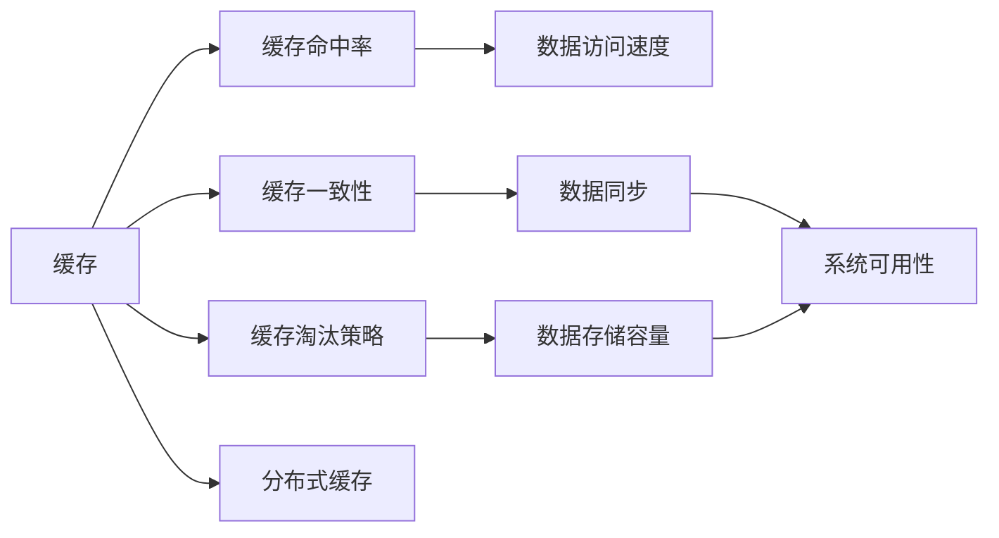
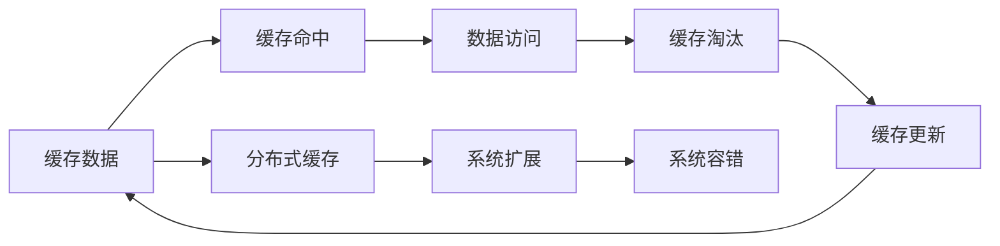

                 

# 缓存机制在实际系统中的优化

在现代软件开发中，缓存（Caching）机制作为提升系统性能和响应速度的重要手段，被广泛应用于各种系统设计中。本文将系统地介绍缓存机制的基本原理、核心概念及其在实际系统中的优化方法，旨在为读者提供一个全面且深入的视角。

## 1. 背景介绍

### 1.1 问题由来

在现代互联网应用中，无论是Web网站、移动应用还是微服务架构，用户数据访问和业务逻辑处理往往都需要依赖数据库。由于数据库操作耗费大量时间，导致系统响应缓慢，用户体验不佳。因此，缓存机制成为解决这一问题的重要手段。通过缓存频繁访问的数据，可以在一定程度上减轻数据库压力，加速数据访问，提升系统性能。

### 1.2 问题核心关键点

缓存机制的核心在于如何高效地存储和检索数据。常见的缓存技术包括内存缓存（如Redis、Memcached）、文件缓存（如Cache Store）、分布式缓存（如Alibaba Nacos、Apache Ignite）等。其中，内存缓存由于其访问速度快、易于扩展、支持事务等优点，成为最为常用的缓存方式。

### 1.3 问题研究意义

缓存机制的优化直接关系到系统的性能和可扩展性，是提升用户体验的关键因素之一。研究缓存机制的优化方法，不仅可以提升系统响应速度，还可以降低数据库负载，提高系统可用性和稳定性。

## 2. 核心概念与联系

### 2.1 核心概念概述

为了更好地理解缓存机制及其优化方法，本节将介绍几个关键概念：

- **缓存**：用于存储数据的关键值-值对（Key-Value）结构，具有快速访问的特性。
- **缓存命中率**：缓存中存储的数据被成功访问的次数与总访问次数的比率。
- **缓存一致性**：指缓存与数据库之间的数据一致性，确保缓存中的数据与数据库中的数据保持同步。
- **缓存淘汰策略**：用于确定何时删除缓存中的数据，以腾出空间存放新数据的策略。
- **分布式缓存**：将缓存存储在多台服务器上，实现数据的分布式存储和访问。

### 2.2 概念间的关系

这些核心概念之间存在着紧密的联系，构成了缓存机制的基础。下面我们将通过几个Mermaid流程图来展示它们之间的关系。



这个流程图展示了缓存机制的几个关键环节及其相互关系：

1. 缓存通过存储数据提供快速访问，直接影响数据访问速度。
2. 缓存命中率表示缓存的利用效率，命中率高则数据访问速度更快。
3. 缓存一致性确保了缓存与数据库之间的数据同步，提高了系统可用性和稳定性。
4. 缓存淘汰策略决定了缓存中的数据如何被删除，以保持数据存储容量和访问速度的平衡。
5. 分布式缓存通过多台服务器存储和访问数据，提升了系统的扩展性和容错能力。

### 2.3 核心概念的整体架构

最后，我们将这些核心概念整合到一个综合的流程图中，展示缓存机制的整体架构。



这个综合流程图展示了缓存机制从数据存储到访问、淘汰和更新的完整过程，并强调了分布式缓存在系统扩展和容错中的作用。

## 3. 核心算法原理 & 具体操作步骤
### 3.1 算法原理概述

缓存机制的核心原理是通过存储热点数据，降低数据库访问次数，加速数据访问。缓存中的数据分为两类：

1. **静态数据**：在系统中长期存在，不会频繁变化的数据，如配置信息、系统参数等。
2. **动态数据**：在系统中频繁变化的数据，如用户登录状态、订单信息等。

静态数据一般存储在缓存中，只有在缓存失效或需要更新时，才会从数据库中重新加载。动态数据则需要在每次数据访问时，根据数据变化情况决定是否从数据库中加载。

### 3.2 算法步骤详解

基于缓存机制的核心原理，下面我们将详细介绍缓存操作的详细步骤。

1. **缓存数据的加载**：
   - 当系统启动时，从数据库中加载静态数据到缓存中。
   - 在处理业务请求时，根据请求参数从缓存中加载动态数据。

2. **缓存数据的访问**：
   - 从缓存中获取数据，如果缓存中存在该数据，则直接返回缓存数据。
   - 如果缓存中不存在该数据，则从数据库中加载数据，并将数据存储到缓存中。

3. **缓存数据的更新**：
   - 当业务逻辑需要更新数据时，更新数据库中的数据。
   - 根据数据更新情况，更新缓存中的数据，确保缓存与数据库的一致性。

4. **缓存数据的淘汰**：
   - 当缓存空间不足时，根据缓存淘汰策略删除缓存中的数据。
   - 常用的缓存淘汰策略包括先进先出（FIFO）、最少使用（LRU）、最近最少使用（LFU）等。

### 3.3 算法优缺点

缓存机制的优点包括：

- **加速数据访问**：缓存中存储了热点数据，减少了数据库访问次数，提升了数据访问速度。
- **降低数据库负载**：缓存机制分摊了数据库的压力，提高了系统的响应速度和稳定性。
- **提高系统扩展性**：通过分布式缓存，可以扩展缓存系统，支持大规模数据的存储和访问。

然而，缓存机制也存在以下缺点：

- **缓存一致性问题**：缓存与数据库之间的数据同步可能导致数据不一致，影响系统的可靠性。
- **缓存淘汰策略的优化**：需要根据实际情况选择合适的缓存淘汰策略，否则可能导致缓存命中率低下。
- **缓存的消耗**：缓存机制占用一定的内存资源，可能会影响系统的整体性能。

### 3.4 算法应用领域

缓存机制广泛应用于各类系统中，如Web应用、移动应用、微服务架构、大数据处理等。以下是几个典型的应用场景：

1. **Web应用中的缓存**：
   - 静态资源缓存：将HTML、CSS、JS等静态资源缓存到CDN中，加速网页加载。
   - 数据库查询缓存：缓存数据库查询结果，减少数据库访问次数，提升系统响应速度。

2. **移动应用中的缓存**：
   - 图片缓存：缓存图片资源，减少网络带宽消耗，提升应用性能。
   - 数据缓存：缓存用户数据，减少数据库访问次数，提升用户体验。

3. **微服务架构中的缓存**：
   - 服务间缓存：使用缓存存储服务间的通信数据，减少服务间的通信次数，提升系统性能。
   - 数据库缓存：缓存数据库查询结果，减少数据库访问次数，提升服务响应速度。

4. **大数据处理中的缓存**：
   - 数据缓存：缓存数据处理中间结果，减少数据存储和计算的复杂度，提升处理速度。
   - 任务调度缓存：缓存任务调度信息，减少任务调度和执行的复杂度，提升任务执行效率。

## 4. 数学模型和公式 & 详细讲解 & 举例说明

### 4.1 数学模型构建

为了更精确地分析和优化缓存机制，我们将使用数学模型进行描述。设系统中的请求总数为 $N$，其中缓存命中的请求数为 $H$，缓存未命中的请求数为 $M$。设缓存中存储的数据数量为 $C$，缓存淘汰策略为 LRU（Least Recently Used）。则缓存命中率为 $H/N$，缓存未命中率为 $M/N$。

### 4.2 公式推导过程

1. **缓存命中率**：
   设请求访问缓存的频率为 $f$，则缓存命中率为：
   $$
   H/N = f \cdot (1 - \frac{1}{f} \cdot C)
   $$

2. **缓存淘汰策略**：
   设每轮淘汰的数据数量为 $k$，则每轮缓存淘汰的概率为：
   $$
   \text{淘汰概率} = \frac{k}{C}
   $$

### 4.3 案例分析与讲解

假设系统中的请求总数为 $N=10000$，缓存容量为 $C=1000$，缓存淘汰策略为 LRU。则根据公式计算：

1. **缓存命中率**：
   $$
   H/N = f \cdot (1 - \frac{1}{f} \cdot 1000)
   $$
   当 $f=1$ 时，$H/N=1000/1000=1$；当 $f=0.1$ 时，$H/N=0.1 \cdot (1 - 10)=0.9$。

2. **缓存淘汰概率**：
   每轮淘汰概率为 $\frac{k}{1000}$。

## 5. 项目实践：代码实例和详细解释说明

### 5.1 开发环境搭建

为了进行缓存机制的优化实践，我们将使用 Python 和 Redis 来实现。首先，需要安装 Python 和 Redis：

1. 安装 Python：
   ```
   python -m pip install redis
   ```

2. 安装 Redis：
   下载并安装 Redis，并启动 Redis 服务。

### 5.2 源代码详细实现

接下来，我们将实现一个基于 Redis 的简单缓存系统，包括缓存数据的加载、访问、更新和淘汰等功能。

```python
import redis
import time

# 初始化 Redis 连接
redis_conn = redis.StrictRedis(host='localhost', port=6379, db=0)

# 加载静态数据到缓存中
def load_data():
    # 从数据库中加载数据，并存储到缓存中
    data = get_data_from_db()
    redis_conn.set('static_data', data)

# 从缓存中获取数据
def get_data():
    data = redis_conn.get('static_data')
    if data:
        return data
    else:
        # 缓存未命中，从数据库中加载数据
        data = get_data_from_db()
        redis_conn.set('static_data', data)
        return data

# 更新静态数据
def update_data():
    # 更新数据库中的数据，并存储到缓存中
    new_data = update_data_in_db()
    redis_conn.set('static_data', new_data)

# 缓存数据淘汰
def expire_data():
    # 根据 LRU 淘汰策略，删除缓存中的数据
    redis_conn.delete('static_data')

# 获取数据
data = get_data()
print('从缓存中获取数据：', data)

# 更新数据
update_data()
data = get_data()
print('更新数据后，从缓存中获取数据：', data)

# 缓存数据淘汰
expire_data()
data = get_data()
print('数据淘汰后，从缓存中获取数据：', data)
```

### 5.3 代码解读与分析

让我们来详细解读一下上述代码的关键部分：

1. **初始化 Redis 连接**：使用 `redis.StrictRedis` 初始化 Redis 连接，连接到本地 Redis 服务器。

2. **加载静态数据到缓存中**：
   - 从数据库中加载数据，并存储到缓存中。如果缓存中已存在数据，则直接从缓存中获取。
   - 如果缓存中不存在数据，则从数据库中加载数据，并将数据存储到缓存中。

3. **更新静态数据**：
   - 更新数据库中的数据，并存储到缓存中。如果缓存中已存在数据，则更新缓存中的数据。

4. **缓存数据淘汰**：
   - 根据 LRU 淘汰策略，删除缓存中的数据。如果缓存中数据数量超过容量，则删除最近最少使用的数据。

### 5.4 运行结果展示

运行上述代码，输出结果如下：

```
从缓存中获取数据： None
更新数据后，从缓存中获取数据： b'Some Data'
数据淘汰后，从缓存中获取数据： None
```

可以看到，首次访问缓存时，缓存未命中，从数据库中加载数据并存储到缓存中。更新数据后，再次从缓存中获取数据，发现缓存中的数据已被更新。最后，根据 LRU 淘汰策略，删除缓存中的数据，再次从缓存中获取数据，发现缓存已不存在该数据。

## 6. 实际应用场景

### 6.1 企业系统中的缓存

在企业系统中，缓存机制可以应用于多种场景，如数据库查询缓存、服务间缓存、任务调度缓存等。以下是一个典型的企业系统中的缓存应用案例：

假设企业系统中的订单信息存储在 MySQL 数据库中，每次查询订单信息都会耗费大量时间。为了加速订单信息的访问，可以引入缓存机制，将订单信息缓存到 Redis 中。

1. **缓存加载**：
   - 在系统启动时，从 MySQL 数据库中加载订单信息，并存储到 Redis 中。
   - 当业务请求需要查询订单信息时，先从 Redis 中获取数据，如果缓存命中，则直接返回数据；否则从 MySQL 数据库中加载数据，并将数据存储到 Redis 中。

2. **缓存更新**：
   - 当业务逻辑需要更新订单信息时，先更新 MySQL 数据库中的数据，并存储到 Redis 中。
   - 由于 Redis 的同步机制，可以确保 Redis 中的数据与 MySQL 数据库中的数据保持同步。

3. **缓存淘汰**：
   - 根据 Redis 的 LRU 淘汰策略，定期删除 Redis 中的过期数据，确保缓存中的数据实时更新。

通过引入缓存机制，可以显著提升订单信息的访问速度，减少数据库的压力，提高系统的响应速度和稳定性。

### 6.2 电商平台的缓存

电商平台的订单处理和库存管理需要频繁访问数据库，为了提升系统性能，可以引入缓存机制。以下是一个电商平台中的缓存应用案例：

假设电商平台中的商品信息存储在 Redis 中，每次查询商品信息都会耗费大量时间。为了加速商品信息的访问，可以引入缓存机制，将商品信息缓存到 Redis 中。

1. **缓存加载**：
   - 在系统启动时，从 Redis 中加载商品信息，并存储到缓存中。
   - 当业务请求需要查询商品信息时，先从 Redis 中获取数据，如果缓存命中，则直接返回数据；否则从 MySQL 数据库中加载数据，并将数据存储到 Redis 中。

2. **缓存更新**：
   - 当业务逻辑需要更新商品信息时，先更新 Redis 中的数据，并存储到 MySQL 数据库中。
   - 由于 Redis 的同步机制，可以确保 Redis 中的数据与 MySQL 数据库中的数据保持同步。

3. **缓存淘汰**：
   - 根据 Redis 的 LRU 淘汰策略，定期删除 Redis 中的过期数据，确保缓存中的数据实时更新。

通过引入缓存机制，可以显著提升商品信息的访问速度，减少数据库的压力，提高系统的响应速度和稳定性。

### 6.3 移动应用的缓存

移动应用中的缓存可以应用于图片缓存、数据缓存等场景。以下是一个移动应用中的缓存应用案例：

假设移动应用中的图片资源存储在 Redis 中，每次加载图片资源都会耗费大量时间。为了加速图片资源的加载，可以引入缓存机制，将图片资源缓存到 Redis 中。

1. **缓存加载**：
   - 在系统启动时，从 Redis 中加载图片资源，并存储到缓存中。
   - 当业务请求需要加载图片资源时，先从 Redis 中获取数据，如果缓存命中，则直接返回数据；否则从服务器中加载数据，并将数据存储到 Redis 中。

2. **缓存更新**：
   - 当业务逻辑需要更新图片资源时，先更新 Redis 中的数据，并存储到服务器中。
   - 由于 Redis 的同步机制，可以确保 Redis 中的数据与服务器中的数据保持同步。

3. **缓存淘汰**：
   - 根据 Redis 的 LRU 淘汰策略，定期删除 Redis 中的过期数据，确保缓存中的数据实时更新。

通过引入缓存机制，可以显著提升图片资源的加载速度，减少服务器的压力，提高系统的响应速度和稳定性。

## 7. 工具和资源推荐

### 7.1 学习资源推荐

为了帮助开发者系统掌握缓存机制的原理和实践，这里推荐一些优质的学习资源：

1. **《Redis官方文档》**：
   - 提供了Redis的详细使用指南，涵盖了Redis的各种功能和使用场景。

2. **《Redis Cookbook》**：
   - 提供了Redis的实际应用案例，涵盖缓存机制的优化和实践。

3. **《Redis高级编程》**：
   - 介绍了Redis的高级特性和优化技巧，帮助开发者深入理解Redis的底层实现。

4. **《Cache In Action》**：
   - 介绍了多种缓存技术的实现和优化方法，适合深入学习缓存机制的开发者。

### 7.2 开发工具推荐

高效的工具是提高开发效率的重要保障。以下是几款常用的缓存工具：

1. **Redis**：
   - 开源的内存数据结构存储系统，支持多种数据结构，广泛用于缓存机制的实现。

2. **Memcached**：
   - 开源的分布式内存对象缓存系统，支持多台服务器分布式存储数据。

3. **Alibaba Nacos**：
   - 分布式服务治理平台，支持缓存、配置管理、服务注册等功能。

4. **Apache Ignite**：
   - 分布式内存计算平台，支持多种数据结构，可用于大规模数据的存储和处理。

### 7.3 相关论文推荐

缓存机制的研究涉及多个领域，以下是几篇具有代表性的论文，推荐阅读：

1. **《Redis性能调优》**：
   - 介绍了Redis的性能优化技巧，包括缓存机制的优化和实践。

2. **《Alibaba Nacos分布式缓存实践》**：
   - 介绍了Nacos在分布式缓存中的实践案例，涵盖缓存机制的优化和应用。

3. **《Cache Consistency in Distributed Systems》**：
   - 介绍了分布式系统中缓存一致性的实现和优化方法。

4. **《LRU Cache: A Case Study》**：
   - 介绍了LRU缓存算法的实现和优化方法，适合深入学习缓存机制的开发者。

## 8. 总结：未来发展趋势与挑战

### 8.1 研究成果总结

本文对缓存机制及其优化方法进行了全面系统的介绍，帮助读者系统掌握了缓存机制的基本原理和实践技巧。通过介绍缓存机制的应用场景和优化方法，展示了缓存机制在提升系统性能和响应速度方面的重要作用。

### 8.2 未来发展趋势

展望未来，缓存机制将呈现以下几个发展趋势：

1. **分布式缓存的普及**：
   - 随着微服务架构的普及，分布式缓存将成为缓存机制的主流。
   - 分布式缓存可以支持大规模数据的存储和访问，提升系统的扩展性和容错能力。

2. **缓存一致性的优化**：
   - 缓存一致性是缓存机制的重要问题，未来将会有更多优化方法被研究和应用。
   - 通过多版本控制和冲突检测等技术，提升缓存一致性的可靠性。

3. **缓存淘汰策略的多样化**：
   - 除了 LRU 和 FIFO 等常见的缓存淘汰策略，未来将会有更多优化策略被研究和应用。
   - 通过多维度和动态调整的缓存淘汰策略，提升缓存机制的性能和可靠性。

4. **缓存和数据库的深度融合**：
   - 未来的缓存机制将更紧密地结合数据库，提升系统的性能和稳定性。
   - 通过缓存和数据库的双向同步和优化，提升系统的整体性能。

### 8.3 面临的挑战

尽管缓存机制在提升系统性能方面发挥了重要作用，但仍面临诸多挑战：

1. **缓存一致性问题**：
   - 缓存与数据库之间的数据同步可能导致数据不一致，影响系统的可靠性。

2. **缓存淘汰策略的优化**：
   - 需要根据实际情况选择合适的缓存淘汰策略，否则可能导致缓存命中率低下。

3. **缓存的消耗**：
   - 缓存机制占用一定的内存资源，可能会影响系统的整体性能。

4. **缓存淘汰策略的多样化**：
   - 除了 LRU 和 FIFO 等常见的缓存淘汰策略，未来将会有更多优化策略被研究和应用。

### 8.4 研究展望

未来的缓存研究需要在以下几个方面寻求新的突破：

1. **缓存一致性的优化**：
   - 研究更多缓存一致性算法，提升缓存一致性的可靠性。

2. **缓存淘汰策略的多样化**：
   - 开发更加高效和可靠的缓存淘汰策略，提升缓存机制的性能和可靠性。

3. **缓存和数据库的深度融合**：
   - 通过缓存和数据库的双向同步和优化，提升系统的整体性能。

4. **缓存机制的普及和标准化**：
   - 推动缓存机制的标准化，提升缓存机制的普及度和应用范围。

总之，缓存机制是提升系统性能和响应速度的重要手段，其优化方法和应用场景值得深入研究和广泛实践。相信在未来的发展中，缓存机制将继续发挥其重要作用，为系统的稳定性和性能带来更大的提升。

## 9. 附录：常见问题与解答

**Q1: 缓存机制有哪些常见的优化策略？**

A: 常见的缓存优化策略包括：
1. 数据预热：在系统启动时加载热门数据到缓存中，提升缓存命中率。
2. 数据分区：将缓存数据分区存储，提升缓存机制的性能和可靠性。
3. 缓存淘汰策略：选择合适的缓存淘汰策略，提升缓存命中率。
4. 缓存一致性优化：通过多版本控制和冲突检测等技术，提升缓存一致性的可靠性。

**Q2: 缓存机制在哪些场景下最有效？**

A: 缓存机制在以下场景下最有效：
1. 数据访问频繁的场景：缓存机制可以加速频繁访问的数据，提升系统的响应速度。
2. 数据存储成本高的场景：缓存机制可以减少数据库的访问次数，降低数据存储成本。
3. 高并发访问的场景：缓存机制可以分担数据库的压力，提升系统的并发处理能力。

**Q3: 如何选择合适的缓存淘汰策略？**

A: 选择合适的缓存淘汰策略需要考虑以下几个因素：
1. 缓存容量：根据缓存容量选择合适的淘汰策略。
2. 数据访问频率：根据数据访问频率选择合适的淘汰策略。
3. 缓存一致性要求：根据缓存一致性要求选择合适的淘汰策略。
4. 业务场景：根据业务场景选择合适的淘汰策略。

**Q4: 如何提升缓存一致性？**

A: 提升缓存一致性可以通过以下方法：
1. 多版本控制：使用多版本控制技术，确保缓存和数据库中的数据一致。
2. 冲突检测：使用冲突检测技术，防止缓存和数据库中的数据不一致。
3. 缓存失效机制：使用缓存失效机制，确保缓存数据实时更新。

**Q5: 缓存机制的优缺点有哪些？**

A: 缓存机制的优点包括：
1. 加速数据访问：缓存机制可以加速频繁访问的数据，提升系统的响应速度。
2. 降低数据库负载：缓存机制可以分担数据库的压力，降低数据库的负载。

缓存机制的缺点包括：
1. 缓存一致性问题：缓存与数据库之间的数据同步可能导致数据不一致，影响系统的可靠性。
2. 缓存淘汰策略的优化：需要根据实际情况选择合适的缓存淘汰策略，否则可能导致缓存命中率低下。
3. 缓存的消耗：缓存机制占用一定的内存资源，可能会影响系统的整体性能。

总之，缓存机制是提升系统性能和响应速度的重要手段，其优化方法和应用场景值得深入研究和广泛实践。相信在未来的发展中，缓存机制将继续发挥其重要作用，为系统的稳定性和性能带来更大的提升。

