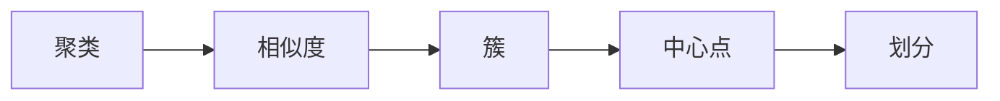

                 

# 聚类算法 原理与代码实例讲解

> 关键词：聚类算法, K-means, DBSCAN, 层次聚类, 密度聚类, 最小化误差平方和, 最小化簇内平方和, 计算效率, 应用领域

## 1. 背景介绍

### 1.1 问题由来

聚类分析(Clustering Analysis)是一种数据挖掘技术，旨在将数据对象划分为若干个具有特定特征的群组或子集，使得同一组内的对象彼此相似度高，而不同组间的对象相似度低。聚类分析在商业智能、市场细分、图像处理、生物信息学、信号处理等多个领域有广泛的应用。

聚类算法的核心是如何在数据中发现自然存在的群集，而不是事前定义好群组来划分数据。这类算法在数据分析和模型建立中占据重要地位。常见的聚类算法有K-means、DBSCAN、层次聚类、密度聚类等。每种算法都有其特定的优势和适用场景。

### 1.2 问题核心关键点

聚类算法有两大关键点：
1. **相似度度量**：确定数据对象之间的相似性或距离，这是聚类算法的核心。
2. **聚类准则**：选择合适的准则来定义聚类结果，如最大化组内一致性、最小化误差平方和等。

## 2. 核心概念与联系

### 2.1 核心概念概述

1. **聚类(Clonustering)**：将数据对象分组，使得同一组内的对象彼此相似度高，不同组间的对象相似度低。
2. **簇(Cluster)**：聚类算法产生的同一组内的数据对象集合。
3. **相似度(Similarity)**：衡量两个数据对象之间相似程度的指标，如欧式距离、余弦相似度等。
4. **中心点(Center Point)**：簇中的代表点，如K-means算法中的簇中心。
5. **划分(Hierarchical Clustering)**：层次聚类的一种形式，按照一定的层次结构进行聚类。

这些核心概念构成了聚类算法的理论基础，通过理解这些概念，可以更好地掌握聚类算法的原理和应用。

### 2.2 概念间的关系

聚类算法通过相似度度量和聚类准则，将数据对象划分为若干个簇。核心概念之间的关系可以通过以下Mermaid流程图来展示：



这个流程图展示了聚类算法的核心流程：首先确定相似度度量，再根据相似度划分簇，每个簇有一个代表中心点。层次聚类等变种算法会按照一定的层次结构进行聚类。

## 3. 核心算法原理 & 具体操作步骤
### 3.1 算法原理概述

聚类算法的基本原理是通过度量数据对象之间的相似度，将相似度高的数据对象划分为同一簇，而相似度低的数据对象划分到不同簇。具体来说，聚类算法可分为以下两大类：

1. **划分算法**：如K-means、K-modes等，通过最小化误差平方和或簇内平方和，将数据划分为若干个簇。
2. **非划分算法**：如DBSCAN、层次聚类等，通过密度等准则确定聚类结构。

聚类算法的目标是最小化簇内差异，即尽可能地让同一簇内的数据对象相似度最大化。在实际操作中，为了提高计算效率和算法稳定性，通常采用迭代优化的方法，逐步调整数据对象之间的相似度度量和聚类准则。

### 3.2 算法步骤详解

以K-means算法为例，详细介绍其算法步骤：

**Step 1: 初始化聚类中心**
选择一个随机的聚类中心点，可以是数据中的任意点。

**Step 2: 分配数据对象到最近的簇**
计算每个数据对象与所有聚类中心的距离，将其分配到距离最近的簇。

**Step 3: 更新聚类中心**
根据当前分配的结果，计算每个簇的中心点。

**Step 4: 重复执行Step 2和Step 3**
直到聚类中心不再变化，或达到预设的迭代次数。

### 3.3 算法优缺点

K-means算法的优缺点如下：

**优点**：
1. 简单易用，计算效率高。
2. 算法稳定，适用于大规模数据集。
3. 可以通过参数调节控制聚类数量。

**缺点**：
1. 对初始聚类中心敏感，可能导致聚类结果不稳定。
2. 需要预先指定聚类数量，可能需要多次运行以获得较好的结果。
3. 对噪声和异常值敏感，影响聚类效果。

### 3.4 算法应用领域

K-means算法广泛应用于市场细分、图像分割、生物信息学、模式识别等多个领域。

1. **市场细分**：将消费者按照购买行为、兴趣等特征分为不同群组，进行针对性的营销。
2. **图像分割**：将图像中具有相似特征的像素划分到同一区域，用于图像处理、图像检索等。
3. **生物信息学**：对基因序列、蛋白质序列等生物数据进行聚类，识别基因家族、蛋白质功能等。
4. **模式识别**：对传感器数据进行聚类，识别异常模式，用于故障诊断、安全监控等。

## 4. 数学模型和公式 & 详细讲解
### 4.1 数学模型构建

K-means算法的数学模型为：

$$
\min_{\mu_k, x_i} \sum_{i=1}^{n} \sum_{k=1}^{K} (d(x_i,\mu_k))^2
$$

其中，$\mu_k$ 表示簇中心点，$d(x_i,\mu_k)$ 表示数据对象 $x_i$ 与簇中心 $\mu_k$ 之间的距离，$K$ 为聚类数量。

### 4.2 公式推导过程

以欧式距离为例，计算距离公式如下：

$$
d(x_i,\mu_k) = \sqrt{\sum_{j=1}^{d} (x_{ij} - \mu_{kj})^2}
$$

其中，$d$ 为数据维度，$x_{ij}$ 表示数据对象 $x_i$ 的第 $j$ 个特征，$\mu_{kj}$ 表示簇中心点 $\mu_k$ 的第 $j$ 个特征。

### 4.3 案例分析与讲解

以K-means算法应用于图像分割为例：

1. **数据准备**：将图像转换为像素矩阵，每个像素点表示为向量形式。

2. **初始化聚类中心**：随机选择若干像素点作为初始聚类中心。

3. **分配像素到簇**：计算每个像素与所有聚类中心的欧式距离，将其分配到距离最近的簇。

4. **更新聚类中心**：计算每个簇中所有像素的平均值，更新簇中心点。

5. **重复执行**：重复步骤3和步骤4，直到聚类中心不再变化或达到预设的迭代次数。

下图展示了K-means算法应用于图像分割的示意图：


## 5. 项目实践：代码实例和详细解释说明
### 5.1 开发环境搭建

要进行聚类算法的实践，需要准备开发环境。以下是Python环境下的主要步骤：

1. 安装Python：确保Python环境版本为3.7或以上。

2. 安装相关库：安装numpy、scikit-learn、matplotlib等常用库。

```bash
pip install numpy scikit-learn matplotlib
```

### 5.2 源代码详细实现

以下是一个使用K-means算法进行图像分割的Python代码实现：

```python
import numpy as np
import matplotlib.pyplot as plt
from sklearn.cluster import KMeans
from sklearn.metrics import silhouette_score

# 读取图像数据
img = plt.imread('image.png')
img = img.reshape((-1, 3))

# 初始化聚类中心
kmeans = KMeans(n_clusters=3, random_state=42)
kmeans.fit(img)

# 分配像素到簇
labels = kmeans.predict(img)
centers = kmeans.cluster_centers_

# 绘制聚类结果
plt.imshow(img)
plt.scatter(np.where(labels == 0)[0], np.where(labels == 0)[1], c='r')
plt.scatter(np.where(labels == 1)[0], np.where(labels == 1)[1], c='g')
plt.scatter(np.where(labels == 2)[0], np.where(labels == 2)[1], c='b')
plt.scatter(centers[:, 0], centers[:, 1], marker='x', s=200, c='k')
plt.show()

# 计算轮廓系数
silhouette_score(img, labels)
```

### 5.3 代码解读与分析

代码的主要部分为：

1. 读取图像数据并将其转换为像素矩阵。

2. 初始化K-means模型并指定聚类数量为3。

3. 使用K-means模型进行聚类，得到每个像素所属的簇标签。

4. 计算聚类中心点。

5. 将聚类结果可视化。

6. 计算聚类效果的轮廓系数，用于评估聚类质量。

### 5.4 运行结果展示

运行代码后，可以观察到图像被分割成三个区域，每个区域使用不同的颜色表示。聚类中心点使用黑色叉号标记，轮廓系数用于评估聚类效果。


## 6. 实际应用场景
### 6.1 商业智能

商业智能(Business Intelligence, BI)是企业决策支持系统的重要组成部分。通过聚类算法，可以将大量的客户数据、销售数据、市场数据等进行划分，识别出具有相同特征的客户群体或市场细分，帮助企业制定针对性的营销策略。

### 6.2 图像处理

聚类算法在图像处理中也有广泛应用。通过将图像像素进行聚类，可以识别出图像中的不同区域，进行图像分割、图像识别、图像检索等操作。

### 6.3 生物信息学

在生物信息学领域，聚类算法用于对基因序列、蛋白质序列等生物数据进行聚类，识别出基因家族、蛋白质功能等。这对于基因组学、蛋白质组学等研究具有重要意义。

### 6.4 未来应用展望

未来，聚类算法将在更多领域得到应用，如医疗、金融、交通等。通过聚类算法，可以分析海量数据，发现潜在的模式和趋势，支持科学决策和智能化管理。

## 7. 工具和资源推荐
### 7.1 学习资源推荐

为了学习聚类算法，以下资源是推荐的：

1. 《机器学习》（周志华著）：详细介绍了聚类算法的基本原理和算法实现。
2. 《模式识别与机器学习》（Christopher Bishop著）：深入讲解了聚类算法的理论基础和应用实例。
3. 《Python数据科学手册》（Jake VanderPlas著）：介绍了使用Python进行数据处理和聚类分析的实用技巧。
4. Coursera上的《机器学习基础》课程：由斯坦福大学Andrew Ng教授主讲，详细讲解了聚类算法和实际应用。

### 7.2 开发工具推荐

1. Python：作为数据科学和机器学习的通用语言，具有丰富的科学计算库和可视化工具。

2. NumPy：用于数值计算和科学计算，提供了高效的多维数组和矩阵计算功能。

3. Matplotlib：用于绘制各种静态、动态、交互式图表，适合于数据可视化。

4. Scikit-learn：提供了各种聚类算法的实现，包括K-means、DBSCAN等，并提供了评估指标和参数调整工具。

### 7.3 相关论文推荐

1. "K-Means: Algorithms for Vector Quantization" (MacQueen, 1967)：介绍了K-means算法的理论基础和实现细节。

2. "DBSCAN: A density-based algorithm for discovering clusters in large spatial databases with noise" (Ester et al., 1996)：详细介绍了DBSCAN算法及其应用。

3. "A Density-Based Algorithm for Discovering Clusters in Large Spatial Databases with Noise" (Ester et al., 1996)：讨论了DBSCAN算法的理论基础和应用细节。

## 8. 总结：未来发展趋势与挑战
### 8.1 研究成果总结

聚类算法在数据挖掘和模型建立中具有重要地位。通过将数据对象划分为若干个簇，可以发现数据中的潜在模式和结构，支持决策支持系统。

### 8.2 未来发展趋势

未来聚类算法的发展趋势如下：

1. **自动化聚类**：通过自动化技术，自动识别合适的聚类数量和算法参数，提高聚类效率。
2. **多模态聚类**：将多种数据源（如文本、图像、时间序列等）进行联合聚类，提升聚类效果。
3. **深度聚类**：将深度学习技术引入聚类算法，提高聚类精度和计算效率。
4. **增量聚类**：对大规模数据进行增量式聚类，实时更新聚类结果，满足实时性要求。

### 8.3 面临的挑战

聚类算法面临的挑战如下：

1. **聚类质量评估**：如何评估聚类结果的质量，仍然是一个未解决的问题。
2. **聚类算法泛化性**：如何在不同数据集和应用场景中保持聚类算法的稳定性和泛化性。
3. **聚类效率**：如何在保证聚类效果的前提下，提高聚类算法的计算效率。

### 8.4 研究展望

未来的研究应重点关注以下几个方面：

1. **自动化聚类技术**：开发自动化聚类算法，减少对人工干预的依赖。
2. **多模态聚类方法**：探索将多模态数据进行联合聚类的方法，提升聚类效果。
3. **增量聚类算法**：开发增量式聚类算法，适应实时性和数据更新要求。
4. **聚类算法优化**：改进现有聚类算法的计算效率和稳定性，提升聚类质量。

## 9. 附录：常见问题与解答

**Q1: 聚类算法的基本原理是什么？**

A: 聚类算法的基本原理是通过度量数据对象之间的相似度，将相似度高的数据对象划分为同一簇，而相似度低的数据对象划分到不同簇。

**Q2: K-means算法和DBSCAN算法的主要区别是什么？**

A: K-means算法需要预先指定聚类数量，将数据划分为固定数量的簇；而DBSCAN算法不需要预先指定聚类数量，可以自动识别数据中的自然聚类。

**Q3: 聚类算法有哪些应用场景？**

A: 聚类算法广泛应用于市场细分、图像处理、生物信息学、模式识别等多个领域。

**Q4: 聚类算法如何应对噪声和异常值？**

A: 可以使用如孤立值检测、基于密度的算法（如DBSCAN）等方法，将噪声和异常值排除在聚类过程之外。

**Q5: 如何选择聚类算法？**

A: 根据数据特性和应用场景选择聚类算法。例如，对于图像处理，可以使用K-means算法；对于密度聚类，可以使用DBSCAN算法。

