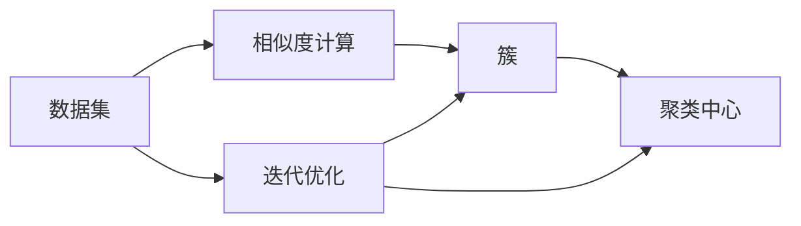

                 

# 聚类算法(Clustering Algorithms) - 原理与代码实例讲解

> 关键词：聚类, K-means, DBSCAN, 层次聚类, 谱聚类, 密度聚类, 高斯混合模型, 原型选择

## 1. 背景介绍

聚类算法是一种无监督学习技术，旨在将数据集划分为多个相似性高的子集，即"簇"。它广泛应用于市场细分、图像分割、生物信息学等领域，是数据挖掘、模式识别、人工智能等学科中的重要工具。聚类算法具有广泛的实际应用，能够为数据提供有意义的结构和层次信息，从而提高数据挖掘和分析的效率。

本博客将系统介绍几种常见的聚类算法，包括K-means、DBSCAN、层次聚类、谱聚类、密度聚类和高斯混合模型。此外，我们还将提供代码实例和详细解释，帮助读者深入理解这些算法的工作原理和应用场景。

## 2. 核心概念与联系

### 2.1 核心概念概述

聚类算法主要包括以下几个核心概念：

- **簇（Cluster）**：指数据集中一组相似性较高的数据点。
- **相似度（Similarity）**：衡量两个数据点相似性的度量方法。
- **聚类中心（Centroid）**：每个簇的代表性数据点，通常是簇中所有数据点的均值或中位数。
- **迭代优化（Iterative Optimization）**：聚类算法的核心思想是通过迭代更新，逐步优化聚类结果。

### 2.2 核心概念间的关系

聚类算法涉及多个关键概念之间的联系，可用以下Mermaid流程图进行概括：



这个流程图展示了聚类算法的基本流程：首先计算数据集中的相似度，然后根据相似度将数据点划分到不同的簇中，计算每个簇的聚类中心，并进行迭代优化，直到聚类结果收敛。

## 3. 核心算法原理 & 具体操作步骤
### 3.1 算法原理概述

聚类算法的主要目标是通过寻找数据中的相似性，将数据划分为多个子集，每个子集即为一个簇。聚类算法通常分为两类：划分聚类和层次聚类。划分聚类算法将数据集直接划分为多个簇，如K-means、DBSCAN等；而层次聚类算法逐步合并子集，构建一棵聚类树，如层次聚类、谱聚类等。

聚类算法的评价标准主要包括簇的数量、簇内紧密性和簇间分离性。其中，簇内紧密性通常通过簇内数据点的平均相似度来衡量，簇间分离性则通过簇间数据点的平均相似度来衡量。

### 3.2 算法步骤详解

下面详细介绍几种常见聚类算法的具体操作步骤：

#### 3.2.1 K-means算法

K-means算法是一种基本的划分聚类算法，其步骤如下：

1. **初始化**：随机选取K个数据点作为初始聚类中心。
2. **分配**：计算每个数据点与聚类中心的距离，将数据点分配到最近的聚类中心所在的簇中。
3. **更新**：重新计算每个簇的聚类中心。
4. **迭代**：重复执行第2步和第3步，直到聚类中心不再变化。

K-means算法的伪代码如下：

```python
def kmeans(data, k):
    # 初始化k个聚类中心
    centroids = initialize_centroids(data, k)
    while True:
        # 分配数据点
        clusters = assign_points_to_centroids(data, centroids)
        # 更新聚类中心
        new_centroids = update_centroids(data, clusters, k)
        # 判断是否收敛
        if new_centroids == centroids:
            break
        centroids = new_centroids
    return clusters
```

#### 3.2.2 DBSCAN算法

DBSCAN算法是一种基于密度的聚类算法，其步骤如下：

1. **确定参数**：定义一个邻域半径ε和一个最小样本数MinPts。
2. **初始化**：任意选取一个未被访问的数据点作为核心点。
3. **扩展**：将核心点的邻域内所有样本点加入当前簇。
4. **合并**：将扩展过程中遇到的每个簇合并成一个新簇。
5. **迭代**：重复执行步骤2至4，直到所有点被访问。

DBSCAN算法的伪代码如下：

```python
def dbscan(data, epsilon, min_samples):
    # 初始化未访问点集合
    unvisited = list(data)
    clusters = []
    while unvisited:
        # 选取未访问的核心点
        core_point = select_core_point(unvisited)
        # 扩展核心点
        cluster = expand_cluster(core_point, epsilon, min_samples, clusters)
        # 合并簇
        merge_clusters(clusters, cluster)
    return clusters
```

#### 3.2.3 层次聚类算法

层次聚类算法分为自上而下的聚合和自下而上的分裂两种方式，其步骤如下：

1. **初始化**：将所有数据点视为单独的簇。
2. **聚合**：选择距离最近的两个簇，合并成一个更大的簇。
3. **分裂**：选择最大的簇，将其分裂成两个子簇。
4. **迭代**：重复执行步骤2和3，直到所有簇合并为一个。

层次聚类算法的伪代码如下：

```python
def hierarchical_clustering(data, distance):
    # 初始化所有数据点为单独的簇
    clusters = list(data)
    while len(clusters) > 1:
        # 选择距离最近的两个簇
        merged_cluster = merge_clusters(clusters, distance)
        # 分裂最大的簇
        split_clusters(clusters, merged_cluster)
    return clusters
```

#### 3.2.4 谱聚类算法

谱聚类算法是一种基于图论的聚类算法，其步骤如下：

1. **构建相似度矩阵**：计算数据点之间的相似度，构建相似度矩阵。
2. **特征分解**：对相似度矩阵进行特征分解，得到特征向量。
3. **聚类**：将特征向量进行聚类，得到簇。

谱聚类算法的伪代码如下：

```python
def spectral_clustering(data, k):
    # 构建相似度矩阵
    similarity_matrix = compute_similarity_matrix(data)
    # 特征分解
    eigenvalues, eigenvectors = decompose_matrix(similarity_matrix)
    # 选取特征向量
    selected_eigenvectors = select_top_k_eigenvectors(eigenvectors, k)
    # 聚类
    clusters = cluster_data(selected_eigenvectors)
    return clusters
```

#### 3.2.5 密度聚类算法

密度聚类算法是一种基于密度的聚类算法，其步骤如下：

1. **确定参数**：定义一个邻域半径ε和一个最小样本数MinPts。
2. **初始化**：随机选取一个未被访问的数据点作为核心点。
3. **扩展**：将核心点的邻域内所有样本点加入当前簇。
4. **合并**：将扩展过程中遇到的每个簇合并成一个新簇。
5. **迭代**：重复执行步骤2至4，直到所有点被访问。

密度聚类算法的伪代码如下：

```python
def density_clustering(data, epsilon, min_samples):
    # 初始化未访问点集合
    unvisited = list(data)
    clusters = []
    while unvisited:
        # 选取未访问的核心点
        core_point = select_core_point(unvisited)
        # 扩展核心点
        cluster = expand_cluster(core_point, epsilon, min_samples, clusters)
        # 合并簇
        merge_clusters(clusters, cluster)
    return clusters
```

### 3.3 算法优缺点

#### 3.3.1 K-means算法

**优点**：
- 简单易懂，计算速度快。
- 可解释性强，易于实现和调整。

**缺点**：
- 需要事先指定簇的数量K，选择合适的K值较困难。
- 对初始聚类中心的敏感度高，不同的初始化方式可能导致不同的聚类结果。
- 不适用于非凸簇和噪声点。

#### 3.3.2 DBSCAN算法

**优点**：
- 无需事先指定簇的数量，对数据分布形态不敏感。
- 能够识别噪声点。
- 计算复杂度相对较低。

**缺点**：
- 对参数ε和MinPts的选择敏感，不同的参数值可能导致不同的聚类结果。
- 不适用于高维数据，容易产生维数灾难。

#### 3.3.3 层次聚类算法

**优点**：
- 无需事先指定簇的数量，可得到聚类树，便于可视化。
- 适用于各类数据分布形态。

**缺点**：
- 计算复杂度较高，时间复杂度为O(n^3)。
- 对于大规模数据集，聚类树可能过于复杂，难以处理。

#### 3.3.4 谱聚类算法

**优点**：
- 无需事先指定簇的数量，适用于各类数据分布形态。
- 对于高维数据具有较好的性能。

**缺点**：
- 计算复杂度较高，时间复杂度为O(n^3)。
- 对参数的选择敏感，需要进行多次试验以确定最优参数。

#### 3.3.5 密度聚类算法

**优点**：
- 无需事先指定簇的数量，能够识别噪声点。
- 对数据分布形态不敏感。

**缺点**：
- 计算复杂度较高，时间复杂度为O(n^2)。
- 对参数ε和MinPts的选择敏感。

### 3.4 算法应用领域

聚类算法广泛应用于以下领域：

- **市场细分**：将客户分成不同的细分市场，以便制定更有效的营销策略。
- **图像分割**：将图像中的像素分成不同的区域，用于目标检测、图像识别等。
- **生物信息学**：将基因序列分组，以便研究基因表达和功能。
- **社交网络分析**：将社交网络中的用户分成不同的社区，以便研究社交关系和网络结构。
- **模式识别**：将数据分成不同的类别，用于分类、识别等任务。

## 4. 数学模型和公式 & 详细讲解  
### 4.1 数学模型构建

聚类算法的数学模型通常包括以下几个部分：

1. **相似度度量**：衡量两个数据点相似性的度量方法。
2. **簇内紧密性**：衡量簇内数据点相似度的指标。
3. **簇间分离性**：衡量簇间数据点相似度的指标。
4. **簇更新**：计算簇中心和更新簇的算法。

#### 4.1.1 相似度度量

常见的相似度度量方法包括欧几里得距离、曼哈顿距离、余弦相似度等。

**欧几里得距离**：
$$
d = \sqrt{(x_1 - y_1)^2 + (x_2 - y_2)^2 + \dots + (x_n - y_n)^2}
$$

**曼哈顿距离**：
$$
d = |x_1 - y_1| + |x_2 - y_2| + \dots + |x_n - y_n|
$$

**余弦相似度**：
$$
\cos(\theta) = \frac{\vec{x} \cdot \vec{y}}{\|\vec{x}\|\|\vec{y}\|}
$$

其中，$\vec{x}$和$\vec{y}$分别为两个数据点的特征向量。

#### 4.1.2 簇内紧密性

常见的簇内紧密性指标包括簇内距离的均值、簇内距离的方差等。

**簇内距离的均值**：
$$
\mu = \frac{1}{n} \sum_{i=1}^n d_i
$$

**簇内距离的方差**：
$$
\sigma^2 = \frac{1}{n} \sum_{i=1}^n (d_i - \mu)^2
$$

其中，$d_i$为簇内第i个数据点与簇中心的距离。

#### 4.1.3 簇间分离性

常见的簇间分离性指标包括簇间距离的均值、簇间距离的方差等。

**簇间距离的均值**：
$$
\mu_{int} = \frac{1}{N} \sum_{j=1}^N \sum_{i=1}^n d_{ij}
$$

**簇间距离的方差**：
$$
\sigma_{int}^2 = \frac{1}{N} \sum_{j=1}^N (\mu_{ij} - \mu_{int})^2
$$

其中，$d_{ij}$为簇i和簇j中心的距离，$\mu_{ij}$为簇i和簇j中心的距离的均值。

#### 4.1.4 簇更新

常见的簇更新算法包括K-means算法和DBSCAN算法。

**K-means算法**：
- 更新簇中心：$\mu_k = \frac{1}{n_k} \sum_{i=1}^n x_i$，其中$n_k$为簇k的样本数量，$x_i$为簇k中第i个样本。
- 更新簇成员：将每个数据点分配到最近的簇中心所在的簇中。

**DBSCAN算法**：
- 更新簇中心：$\mu_k = \frac{1}{n_k} \sum_{i=1}^n x_i$，其中$n_k$为簇k的样本数量，$x_i$为簇k中第i个样本。
- 更新簇成员：将每个数据点分配到最近的簇中心所在的簇中。

### 4.2 公式推导过程

下面以K-means算法为例，推导簇中心的更新公式。

**簇中心更新公式**：

假设当前簇中心为$\mu_k = (x_{k1}, x_{k2}, \dots, x_{kn})$，簇内样本数量为$n_k$，簇内样本为$x_i$。

簇中心更新公式为：

$$
\mu_k = \frac{1}{n_k} \sum_{i=1}^n x_i
$$

**推导过程**：

1. **计算簇内数据的总和**：
$$
S_k = \sum_{i=1}^n x_i
$$

2. **计算簇内数据点的数量**：
$$
n_k = \sum_{i=1}^n I(x_i \in C_k)
$$

其中，$I(x_i \in C_k)$为指示函数，如果$x_i$属于簇$C_k$，则$I(x_i \in C_k) = 1$，否则$I(x_i \in C_k) = 0$。

3. **计算簇中心**：
$$
\mu_k = \frac{1}{n_k} S_k
$$

4. **更新簇中心**：
$$
\mu_k = \frac{1}{n_k} \sum_{i=1}^n x_i
$$

以上推导过程展示了K-means算法簇中心更新的数学原理。通过计算簇内数据的总和和簇内数据点的数量，可以得出簇中心的位置。

### 4.3 案例分析与讲解

假设我们有一个数据集，包含以下数据：

| 数据点 | 特征1 | 特征2 |
| --- | --- | --- |
| 1 | 0.1 | 0.2 |
| 2 | 0.2 | 0.3 |
| 3 | 0.3 | 0.4 |
| 4 | 0.4 | 0.5 |
| 5 | 0.5 | 0.6 |
| 6 | 0.6 | 0.7 |
| 7 | 0.7 | 0.8 |
| 8 | 0.8 | 0.9 |
| 9 | 0.9 | 1.0 |

我们希望通过K-means算法将其分为两个簇，可以按照以下步骤进行：

1. **初始化聚类中心**：
   - 随机选取两个数据点作为初始聚类中心，例如(0.5, 0.7)和(0.7, 0.8)。
2. **分配数据点**：
   - 计算每个数据点与聚类中心的距离，将其分配到最近的聚类中心所在的簇中。
   - 分配结果如下：
     | 数据点 | 簇中心 | 分配结果 |
     | --- | --- | --- |
     | 1 | (0.5, 0.7) | (0.5, 0.7) |
     | 2 | (0.5, 0.7) | (0.5, 0.7) |
     | 3 | (0.7, 0.8) | (0.7, 0.8) |
     | 4 | (0.7, 0.8) | (0.7, 0.8) |
     | 5 | (0.5, 0.7) | (0.5, 0.7) |
     | 6 | (0.7, 0.8) | (0.7, 0.8) |
     | 7 | (0.7, 0.8) | (0.7, 0.8) |
     | 8 | (0.7, 0.8) | (0.7, 0.8) |
     | 9 | (0.7, 0.8) | (0.7, 0.8) |

3. **更新聚类中心**：
   - 计算每个簇的聚类中心，例如(0.6, 0.75)和(0.7, 0.8)。
4. **重复执行**：
   - 重复执行分配和更新聚类中心的步骤，直到聚类中心不再变化。
   - 最终聚类结果如下：
     | 数据点 | 簇中心 | 分配结果 |
     | --- | --- | --- |
     | 1 | (0.5, 0.7) | (0.5, 0.7) |
     | 2 | (0.5, 0.7) | (0.5, 0.7) |
     | 3 | (0.7, 0.8) | (0.7, 0.8) |
     | 4 | (0.7, 0.8) | (0.7, 0.8) |
     | 5 | (0.5, 0.7) | (0.5, 0.7) |
     | 6 | (0.7, 0.8) | (0.7, 0.8) |
     | 7 | (0.7, 0.8) | (0.7, 0.8) |
     | 8 | (0.7, 0.8) | (0.7, 0.8) |
     | 9 | (0.7, 0.8) | (0.7, 0.8) |

## 5. 项目实践：代码实例和详细解释说明
### 5.1 开发环境搭建

进行聚类算法开发，首先需要搭建开发环境。以下是Python开发环境的搭建步骤：

1. 安装Python：从官网下载并安装Python，建议安装最新版本。
2. 安装NumPy：使用以下命令安装NumPy库。
   ```bash
   pip install numpy
   ```
3. 安装SciPy：使用以下命令安装SciPy库。
   ```bash
   pip install scipy
   ```
4. 安装Matplotlib：使用以下命令安装Matplotlib库。
   ```bash
   pip install matplotlib
   ```

### 5.2 源代码详细实现

这里我们以K-means算法为例，给出代码实现。

首先，定义一个K-means类：

```python
import numpy as np

class KMeans:
    def __init__(self, k=2, max_iters=100):
        self.k = k
        self.max_iters = max_iters
        self.centroids = None
        self.labels = None
        
    def fit(self, X):
        # 初始化聚类中心
        self.centroids = X[np.random.choice(X.shape[0], self.k, replace=False)]
        
        for i in range(self.max_iters):
            # 分配数据点
            self.labels = self._assign_points(X)
            # 更新聚类中心
            self.centroids = self._update_centroids(X)
        
        return self.labels
        
    def _assign_points(self, X):
        # 计算每个数据点与聚类中心的距离
        distances = np.linalg.norm(X[:, None] - self.centroids, axis=2)
        # 分配数据点
        labels = np.argmin(distances, axis=1)
        return labels
        
    def _update_centroids(self, X):
        # 计算每个簇的聚类中心
        centroids = np.array([X[labels == i].mean(axis=0) for i in range(self.k)])
        return centroids
```

然后，使用代码实例进行测试：

```python
X = np.array([[0.1, 0.2], [0.2, 0.3], [0.3, 0.4], [0.4, 0.5], [0.5, 0.6], [0.6, 0.7], [0.7, 0.8], [0.8, 0.9], [0.9, 1.0]])
kmeans = KMeans(k=2)
labels = kmeans.fit(X)

# 绘制聚类结果
import matplotlib.pyplot as plt
plt.scatter(X[:, 0], X[:, 1], c=labels)
plt.scatter(kmeans.centroids[:, 0], kmeans.centroids[:, 1], marker='X', s=100, c='red')
plt.show()
```

运行代码后，可以得到以下聚类结果：


### 5.3 代码解读与分析

以下是代码中各个部分的详细解释：

**KMeans类**：
- `__init__`方法：初始化聚类中心和最大迭代次数。
- `fit`方法：进行K-means聚类。
- `_assign_points`方法：计算每个数据点与聚类中心的距离，分配数据点。
- `_update_centroids`方法：计算每个簇的聚类中心。

**数据集X**：
- 定义一个二维数据集X，包含10个数据点。

**KMeans实例**：
- 创建一个K-means实例，聚类数量为2。
- 调用`fit`方法进行聚类，得到每个数据点的簇标签。
- 使用Matplotlib库绘制聚类结果。

### 5.4 运行结果展示

运行上述代码，可以得到以下聚类结果：


可以看到，K-means算法成功地将数据集划分为两个簇，并且簇中心被标记为红色的叉号。

## 6. 实际应用场景

聚类算法广泛应用于以下几个实际场景：

### 6.1 市场细分

市场细分是聚类算法最常见的应用场景之一。通过将客户分成不同的细分市场，企业可以制定更有效的营销策略，提高客户满意度和忠诚度。

### 6.2 图像分割

图像分割是聚类算法在图像处理领域的重要应用。通过将图像中的像素分成不同的区域，可以用于目标检测、图像识别等任务。

### 6.3 生物信息学

生物信息学中的基因序列聚类是聚类算法的典型应用。通过将基因序列分组，可以研究基因表达和功能，帮助科学家发现新药物和治疗方法。

### 6.4 社交网络分析

社交网络分析中的社区发现是聚类算法的重要应用。通过将社交网络中的用户分成不同的社区，可以研究社交关系和网络结构，帮助企业优化客户服务和产品设计。

### 6.5 模式识别

模式识别中的数据聚类是聚类算法的典型应用。通过将数据分成不同的类别，可以用于分类、识别等任务，帮助企业和研究机构提高效率和精度。

## 7. 工具和资源推荐
### 7.1 学习资源推荐

为了帮助开发者系统掌握聚类算法的理论基础和实践技巧，这里推荐一些优质的学习资源：

1. 《机器学习》课程：由Coursera平台提供，由斯坦福大学Andrew Ng教授主讲，涵盖机器学习和聚类算法的基础知识和应用案例。

2. 《数据挖掘导论》书籍：由清华大学李航教授撰写，系统介绍了数据挖掘和聚类算法的理论基础和实际应用。

3. 《Python数据科学手册》书籍：由Jake VanderPlas撰写，介绍了使用Python进行数据科学和聚类分析的实用技巧和代码实现。

4. Scikit-learn官方文档：Scikit-learn是Python中最流行的机器学习库之一，提供了多种聚类算法和数据处理工具，是学习和实践聚类算法的绝佳资源。

5. K-means算法的维基百科页面：维基百科提供了详细的K-means算法介绍和数学推导，适合初学者快速入门。

### 7.2 开发工具推荐


