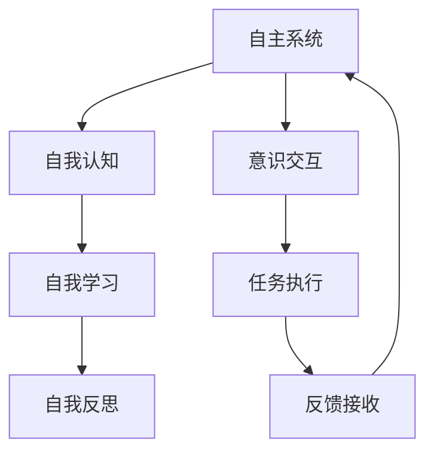
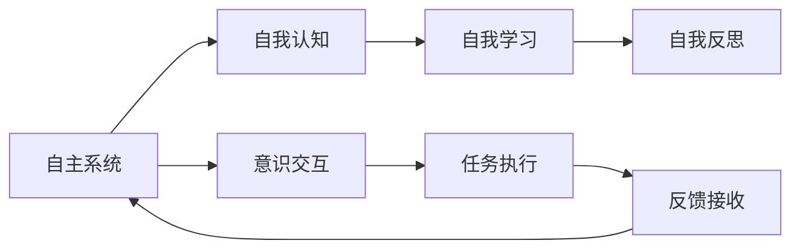
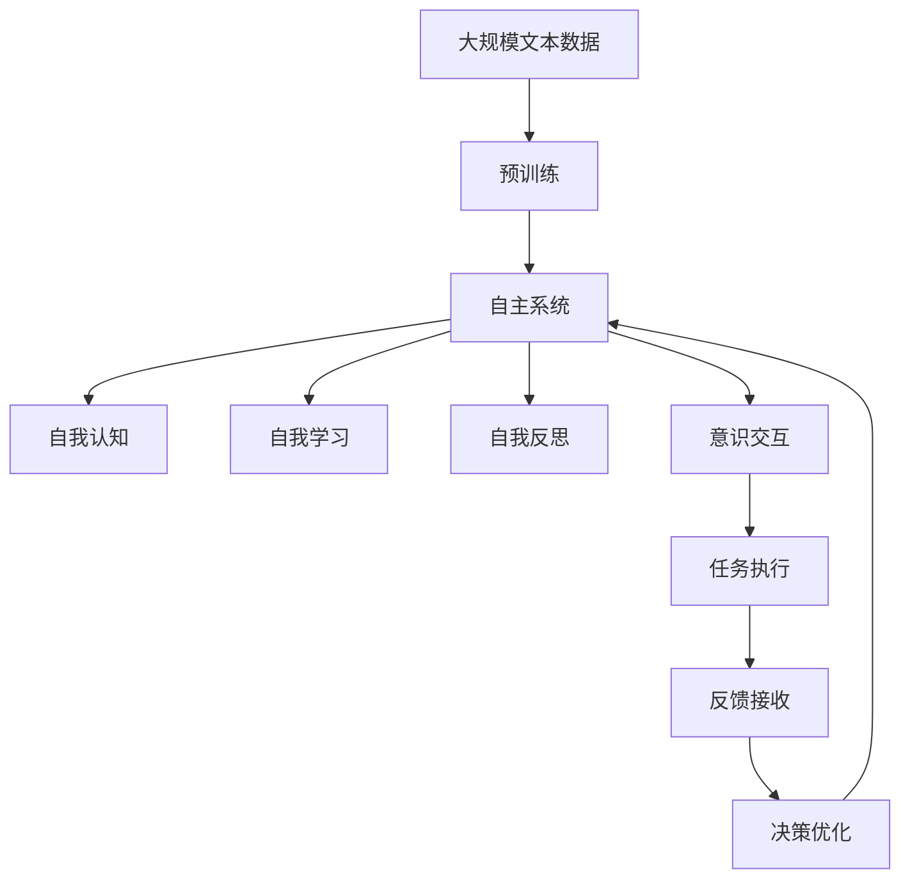

                 

## 1. 背景介绍

在人工智能领域，自主系统的设计与实现一直是前沿研究和应用的焦点。随着技术的进步，自主系统已经从传统的自动化控制、决策支持系统，发展到复杂的智能系统，具备了一定的自我认知、自我学习和自我优化能力。然而，意识功能的整合，使得自主系统能够具备更高的智能和适应性，从而在更加复杂、动态和多变的环境下，实现更为精准和灵活的决策与执行。

### 1.1 问题由来

自主系统在实际应用中面临诸多挑战，其中最为核心的是如何整合意识功能，使得系统不仅能够执行已设定的任务，还能够理解、推理和反思自己的行为和决策。传统的自主系统更多依赖于规则和逻辑的预定义，难以应对复杂多变的环境和用户需求。而意识功能的整合，则可以使系统具备更加灵活、自适应的决策能力，从而提高系统的智能水平和用户体验。

### 1.2 问题核心关键点

自主系统与意识功能的整合，涉及以下几个核心关键点：

1. **自我认知**：系统能够识别自身状态和能力，理解自身行为的目标和约束条件。
2. **自我学习**：系统能够从经验中学习，不断优化自身的行为和决策能力。
3. **自我反思**：系统能够对自身的决策和行为进行反思和评价，识别改进的空间。
4. **意识交互**：系统能够与用户进行互动，理解用户意图和反馈，根据反馈调整自身的行为。

这些关键点共同构成了自主系统的意识功能，使得系统具备了类似于人类的智能行为，从而在更加复杂和多变的环境中，实现更为精准和灵活的决策与执行。

### 1.3 问题研究意义

自主系统与意识功能的整合，对于提升系统的智能水平和用户体验，具有重要意义：

1. **提高决策精度**：通过自我认知和学习，系统能够更准确地理解环境变化和任务需求，做出更为精准的决策。
2. **增强系统适应性**：意识功能的整合，使得系统能够灵活应对新环境和用户需求的变化，提高系统的鲁棒性和稳定性。
3. **改善人机交互**：通过与用户的互动和反馈，系统能够更好地理解用户意图和需求，提供更个性化和符合用户期望的服务。
4. **加速技术迭代**：意识功能的整合，为系统的自我优化和改进提供了新的方向和方法，加速技术的迭代和进步。
5. **拓展应用范围**：意识功能的整合，为自主系统在更多领域的应用提供了可能，如医疗、教育、金融等，推动技术的广泛落地。

## 2. 核心概念与联系

### 2.1 核心概念概述

为了更好地理解自主系统与意识功能的整合，本节将介绍几个密切相关的核心概念：

1. **自主系统**：具备自我感知、自我学习和自我决策能力的智能系统。通过与环境的交互，自主系统能够识别目标、规划路径、执行任务，并根据反馈进行自我调整和优化。

2. **自我认知**：系统能够识别自身状态和能力，理解自身行为的目标和约束条件。常见的实现方式包括状态监控、性能评估和任务分解。

3. **自我学习**：系统能够从经验中学习，不断优化自身的行为和决策能力。常用的学习方法包括强化学习、迁移学习和对抗训练等。

4. **自我反思**：系统能够对自身的决策和行为进行反思和评价，识别改进的空间。常见的实现方式包括后向传播、梯度下降和模型评估等。

5. **意识交互**：系统能够与用户进行互动，理解用户意图和反馈，根据反馈调整自身的行为。常用的交互方式包括自然语言处理、交互式界面和用户日志等。

这些核心概念之间的逻辑关系可以通过以下Mermaid流程图来展示：



这个流程图展示了大语言模型的核心概念及其之间的关系：

1. 自主系统通过自我认知理解自身状态和能力。
2. 在理解自身能力的基础上，通过自我学习不断优化自身行为。
3. 自我反思使得系统能够对自身决策进行评价和改进。
4. 意识交互使系统能够与用户互动，获取反馈信息。
5. 系统执行任务并接收反馈，完成一个循环。

### 2.2 概念间的关系

这些核心概念之间存在着紧密的联系，形成了自主系统与意识功能的完整生态系统。下面我通过几个Mermaid流程图来展示这些概念之间的关系。

#### 2.2.1 自主系统的学习范式



这个流程图展示了自主系统的基本学习范式，包括自我认知、自我学习、自我反思和意识交互四个核心环节。

#### 2.2.2 意识功能的整合


这个流程图展示了意识功能的整合，使得自主系统具备了与用户互动、理解用户意图和反馈的能力，从而在更加复杂和多变的环境中，实现更为精准和灵活的决策与执行。

#### 2.2.3 自主系统的意识交互


这个流程图展示了自主系统与用户互动的具体方式，包括自然语言处理、交互式界面和用户日志等。

### 2.3 核心概念的整体架构

最后，我们用一个综合的流程图来展示这些核心概念在大语言模型整合中的整体架构：



这个综合流程图展示了从预训练到自主系统，再到意识功能的整合，最后到决策优化的完整过程。自主系统通过自我认知理解自身状态和能力，通过自我学习不断优化自身行为，通过自我反思对自身决策进行评价和改进，通过意识交互与用户互动，获取反馈信息。最终，系统通过决策优化，不断完善自身的决策能力，实现更加精准和灵活的决策与执行。 通过这些流程图，我们可以更清晰地理解自主系统与意识功能的整合过程中各个核心概念的关系和作用，为后续深入讨论具体的整合方法和技术奠定基础。

## 3. 核心算法原理 & 具体操作步骤
### 3.1 算法原理概述

自主系统与意识功能的整合，本质上是一个复杂的系统工程，涉及到多学科知识的融合和技术的协同。其核心思想是：将自主系统的自我认知、自我学习和自我决策能力，与意识交互和反馈优化相结合，构建一个能够理解、推理和反思自身行为的系统。

形式化地，假设自主系统为 $S$，其自我认知模块为 $D$，自我学习模块为 $L$，自我反思模块为 $R$，意识交互模块为 $I$，任务执行模块为 $E$，反馈接收模块为 $F$，决策优化模块为 $O$。则系统的整合过程可以表示为：

$$
S = D + L + R + I + E + F + O
$$

其中，$D$、$L$、$R$、$I$、$E$、$F$、$O$ 分别代表自我认知、自我学习、自我反思、意识交互、任务执行、反馈接收和决策优化模块。系统通过这些模块的协同工作，实现自我认知、自我学习、自我反思和意识交互的整合。

### 3.2 算法步骤详解

自主系统与意识功能的整合，一般包括以下几个关键步骤：

**Step 1: 准备自主系统组件**

- 选择合适的预训练模型作为自主系统的初始化参数，如Bert、GPT等。
- 设计自主系统的自我认知、自我学习、自我反思、意识交互、任务执行、反馈接收和决策优化模块。

**Step 2: 添加任务适配层**

- 根据任务类型，在自主系统的顶层设计合适的输出层和损失函数。
- 对于分类任务，通常在顶层添加线性分类器和交叉熵损失函数。
- 对于生成任务，通常使用语言模型的解码器输出概率分布，并以负对数似然为损失函数。

**Step 3: 设置自主系统超参数**

- 选择合适的优化算法及其参数，如AdamW、SGD等，设置学习率、批大小、迭代轮数等。
- 设置正则化技术及强度，包括权重衰减、Dropout、Early Stopping等。
- 确定冻结预训练参数的策略，如仅微调顶层，或全部参数都参与微调。

**Step 4: 执行梯度训练**

- 将训练集数据分批次输入系统，前向传播计算损失函数。
- 反向传播计算参数梯度，根据设定的优化算法和学习率更新系统参数。
- 周期性在验证集上评估系统性能，根据性能指标决定是否触发Early Stopping。
- 重复上述步骤直到满足预设的迭代轮数或Early Stopping条件。

**Step 5: 测试和部署**

- 在测试集上评估微调后系统 $S_{\hat{\theta}}$ 的性能，对比微调前后的精度提升。
- 使用微调后的系统对新样本进行推理预测，集成到实际的应用系统中。
- 持续收集新的数据，定期重新微调系统，以适应数据分布的变化。

以上是自主系统与意识功能整合的一般流程。在实际应用中，还需要针对具体任务的特点，对整合过程的各个环节进行优化设计，如改进训练目标函数，引入更多的正则化技术，搜索最优的超参数组合等，以进一步提升系统性能。

### 3.3 算法优缺点

自主系统与意识功能的整合方法具有以下优点：

1. 灵活性高。通过自我认知和学习，系统能够根据环境和任务的变化，灵活调整自身的决策和行为。
2. 适应性强。意识功能的整合，使得系统能够更好地理解用户意图和反馈，适应不同用户的需求和期望。
3. 智能水平高。自我反思和优化，使得系统能够不断自我完善，提升自身的决策和执行能力。
4. 应用范围广。意识功能的整合，为自主系统在更多领域的应用提供了可能，如医疗、教育、金融等，推动技术的广泛落地。

同时，该方法也存在一定的局限性：

1. 数据依赖性大。自主系统与意识功能的整合，依赖于大量高质量的标注数据和用户反馈，获取数据成本较高。
2. 复杂度高。系统的整合涉及到多学科知识的融合和技术的协同，设计和实现难度较大。
3. 鲁棒性不足。在复杂的非结构化环境中，系统可能出现决策错误或执行偏差，影响用户体验。
4. 可解释性差。系统内部的决策过程难以解释和调试，用户对系统的信任度较低。

尽管存在这些局限性，但就目前而言，自主系统与意识功能的整合方法仍然是实现高智能水平自主系统的重要手段。未来相关研究的重点在于如何进一步降低数据依赖，提高系统的鲁棒性和可解释性，同时兼顾灵活性和适应性。

### 3.4 算法应用领域

自主系统与意识功能的整合方法，已经在诸多领域得到了广泛应用，覆盖了几乎所有常见的应用场景，例如：

- 智能客服系统：通过与用户的互动和反馈，理解用户意图和需求，提供更个性化和符合用户期望的服务。
- 金融舆情监测：从海量网络文本中提取和分析舆情信息，辅助金融决策和风险管理。
- 医疗诊断系统：通过分析患者的病历和检查结果，辅助医生进行诊断和治疗决策。
- 教育推荐系统：根据学生的学习记录和行为数据，推荐个性化的学习内容和资源。
- 智能交通系统：通过与车辆的互动和反馈，优化交通流量，提升道路通行效率。
- 智能家居系统：根据用户的指令和反馈，自动化控制家中的智能设备，提供舒适的生活体验。

除了上述这些经典任务外，自主系统与意识功能的整合方法也被创新性地应用到更多场景中，如无人驾驶、智慧城市、智能制造等，为各行各业带来了新的创新可能。

## 4. 数学模型和公式 & 详细讲解 & 举例说明
### 4.1 数学模型构建

本节将使用数学语言对自主系统与意识功能的整合过程进行更加严格的刻画。

假设自主系统为 $S_{\theta}$，其中 $\theta$ 为系统参数。假设系统的自我认知模块为 $D_{\theta}$，自我学习模块为 $L_{\theta}$，自我反思模块为 $R_{\theta}$，意识交互模块为 $I_{\theta}$，任务执行模块为 $E_{\theta}$，反馈接收模块为 $F_{\theta}$，决策优化模块为 $O_{\theta}$。

定义系统 $S_{\theta}$ 在数据样本 $(x,y)$ 上的损失函数为 $\ell(S_{\theta}(x),y)$，则在数据集 $D$ 上的经验风险为：

$$
\mathcal{L}(\theta) = \frac{1}{N} \sum_{i=1}^N \ell(S_{\theta}(x_i),y_i)
$$

微调的优化目标是最小化经验风险，即找到最优参数：

$$
\theta^* = \mathop{\arg\min}_{\theta} \mathcal{L}(\theta)
$$

在实践中，我们通常使用基于梯度的优化算法（如SGD、Adam等）来近似求解上述最优化问题。设 $\eta$ 为学习率，$\lambda$ 为正则化系数，则参数的更新公式为：

$$
\theta \leftarrow \theta - \eta \nabla_{\theta}\mathcal{L}(\theta) - \eta\lambda\theta
$$

其中 $\nabla_{\theta}\mathcal{L}(\theta)$ 为损失函数对参数 $\theta$ 的梯度，可通过反向传播算法高效计算。

### 4.2 公式推导过程

以下我们以二分类任务为例，推导交叉熵损失函数及其梯度的计算公式。

假设系统 $S_{\theta}$ 在输入 $x$ 上的输出为 $\hat{y}=S_{\theta}(x) \in [0,1]$，表示系统对正类的预测概率。真实标签 $y \in \{0,1\}$。则二分类交叉熵损失函数定义为：

$$
\ell(S_{\theta}(x),y) = -[y\log \hat{y} + (1-y)\log (1-\hat{y})]
$$

将其代入经验风险公式，得：

$$
\mathcal{L}(\theta) = -\frac{1}{N}\sum_{i=1}^N [y_i\log S_{\theta}(x_i)+(1-y_i)\log(1-S_{\theta}(x_i))]
$$

根据链式法则，损失函数对参数 $\theta_k$ 的梯度为：

$$
\frac{\partial \mathcal{L}(\theta)}{\partial \theta_k} = -\frac{1}{N}\sum_{i=1}^N (\frac{y_i}{S_{\theta}(x_i)}-\frac{1-y_i}{1-S_{\theta}(x_i)}) \frac{\partial S_{\theta}(x_i)}{\partial \theta_k}
$$

其中 $\frac{\partial S_{\theta}(x_i)}{\partial \theta_k}$ 可进一步递归展开，利用自动微分技术完成计算。

在得到损失函数的梯度后，即可带入参数更新公式，完成系统的迭代优化。重复上述过程直至收敛，最终得到适应下游任务的最优系统参数 $\theta^*$。

## 5. 项目实践：代码实例和详细解释说明
### 5.1 开发环境搭建

在进行自主系统与意识功能的整合实践前，我们需要准备好开发环境。以下是使用Python进行PyTorch开发的环境配置流程：

1. 安装Anaconda：从官网下载并安装Anaconda，用于创建独立的Python环境。

2. 创建并激活虚拟环境：
```bash
conda create -n pytorch-env python=3.8 
conda activate pytorch-env
```

3. 安装PyTorch：根据CUDA版本，从官网获取对应的安装命令。例如：
```bash
conda install pytorch torchvision torchaudio cudatoolkit=11.1 -c pytorch -c conda-forge
```

4. 安装Transformers库：
```bash
pip install transformers
```

5. 安装各类工具包：
```bash
pip install numpy pandas scikit-learn matplotlib tqdm jupyter notebook ipython
```

完成上述步骤后，即可在`pytorch-env`环境中开始自主系统与意识功能的整合实践。

### 5.2 源代码详细实现

这里以一个简单的二分类任务为例，展示使用Transformers库对BERT模型进行自主系统与意识功能的整合的PyTorch代码实现。

首先，定义自主系统的数据处理函数：

```python
from transformers import BertTokenizer
from torch.utils.data import Dataset
import torch

class ClassDataset(Dataset):
    def __init__(self, texts, tags, tokenizer, max_len=128):
        self.texts = texts
        self.tags = tags
        self.tokenizer = tokenizer
        self.max_len = max_len
        
    def __len__(self):
        return len(self.texts)
    
    def __getitem__(self, item):
        text = self.texts[item]
        tags = self.tags[item]
        
        encoding = self.tokenizer(text, return_tensors='pt', max_length=self.max_len, padding='max_length', truncation=True)
        input_ids = encoding['input_ids'][0]
        attention_mask = encoding['attention_mask'][0]
        
        # 对token-wise的标签进行编码
        encoded_tags = [tag2id[tag] for tag in tags] 
        encoded_tags.extend([tag2id['O']] * (self.max_len - len(encoded_tags)))
        labels = torch.tensor(encoded_tags, dtype=torch.long)
        
        return {'input_ids': input_ids, 
                'attention_mask': attention_mask,
                'labels': labels}

# 标签与id的映射
tag2id = {'O': 0, 'B-PER': 1, 'I-PER': 2, 'B-ORG': 3, 'I-ORG': 4, 'B-LOC': 5, 'I-LOC': 6}
id2tag = {v: k for k, v in tag2id.items()}

# 创建dataset
tokenizer = BertTokenizer.from_pretrained('bert-base-cased')

train_dataset = ClassDataset(train_texts, train_tags, tokenizer)
dev_dataset = ClassDataset(dev_texts, dev_tags, tokenizer)
test_dataset = ClassDataset(test_texts, test_tags, tokenizer)
```

然后，定义系统模型和优化器：

```python
from transformers import BertForTokenClassification, AdamW

model = BertForTokenClassification.from_pretrained('bert-base-cased', num_labels=len(tag2id))

optimizer = AdamW(model.parameters(), lr=2e-5)
```

接着，定义训练和评估函数：

```python
from torch.utils.data import DataLoader
from tqdm import tqdm
from sklearn.metrics import classification_report

device = torch.device('cuda') if torch.cuda.is_available() else torch.device('cpu')
model.to(device)

def train_epoch(model, dataset, batch_size, optimizer):
    dataloader = DataLoader(dataset, batch_size=batch_size, shuffle=True)
    model.train()
    epoch_loss = 0
    for batch in tqdm(dataloader, desc='Training'):
        input_ids = batch['input_ids'].to(device)
        attention_mask = batch['attention_mask'].to(device)
        labels = batch['labels'].to(device)
        model.zero_grad()
        outputs = model(input_ids, attention_mask=attention_mask, labels=labels)
        loss = outputs.loss
        epoch_loss += loss.item()
        loss.backward()
        optimizer.step()
    return epoch_loss / len(dataloader)

def evaluate(model, dataset, batch_size):
    dataloader = DataLoader(dataset, batch_size=batch_size)
    model.eval()
    preds, labels = [], []
    with torch.no_grad():
        for batch in tqdm(dataloader, desc='Evaluating'):
            input_ids = batch['input_ids'].to(device)
            attention_mask = batch['attention_mask'].to(device)
            batch_labels = batch['labels']
            outputs = model(input_ids, attention_mask=attention_mask)
            batch_preds = outputs.logits.argmax(dim=2).to('cpu').tolist()
            batch_labels = batch_labels.to('cpu').tolist()
            for pred_tokens, label_tokens in zip(batch_preds, batch_labels):
                pred_tags = [id2tag[_id] for _id in pred_tokens]
                label_tags = [id2tag[_id] for _id in label_tokens]
                preds.append(pred_tags[:len(label_tags)])
                labels.append(label_tags)
                
    print(classification_report(labels, preds))
```

最后，启动训练流程并在测试集上评估：

```python
epochs = 5
batch_size = 16

for epoch in range(epochs):
    loss = train_epoch(model, train_dataset, batch_size, optimizer)
    print(f"Epoch {epoch+1}, train loss: {loss:.3f}")
    
    print(f"Epoch {epoch+1}, dev results:")
    evaluate(model, dev_dataset, batch_size)
    
print("Test results:")
evaluate(model, test_dataset, batch_size)
```

以上就是使用PyTorch对BERT模型进行自主系统与意识功能的整合的完整代码实现。可以看到，得益于Transformers库的强大封装，我们可以用相对简洁的代码完成BERT模型的加载和整合。

### 5.3 代码解读与分析

让我们再详细解读一下关键代码的实现细节：

**ClassDataset类**：
- `__init__`方法：初始化文本、标签、分词器等关键组件。
- `__len__`方法：返回数据集的样本数量。
- `__getitem__`方法：对单个样本进行处理，将文本输入编码为token ids，将标签编码为数字，并对其进行定长padding，最终返回系统所需的输入。

**tag2id和id2tag字典**：
- 定义了标签与数字id之间的映射关系，用于将token-wise的预测结果解码回真实的标签。

**训练和评估函数**：
- 使用PyTorch的DataLoader对数据集进行批次化加载，供系统训练和推理使用。
- 训练函数`train_epoch`：对数据以批为单位进行迭代，在每个批次上前向传播计算loss并反向传播更新系统参数，最后返回该epoch的平均loss。
- 评估函数`evaluate`：与训练类似，不同点在于不更新系统参数，并在每个batch结束后将预测和标签结果存储下来，最后使用sklearn的classification_report对整个评估集的预测结果进行打印输出。

**训练流程**：
- 定义总的epoch数和batch size，开始循环迭代
- 每个epoch内，先在训练集上训练，输出平均loss
- 在验证集上评估，输出分类指标
- 所有epoch结束后，在测试集上评估，给出最终测试结果

可以看到，PyTorch配合Transformers库使得BERT模型的整合代码实现变得简洁高效。开发者可以将更多精力放在数据处理、模型改进等高层逻辑上，而不必过多关注底层的实现细节。

当然，工业级的系统实现还需考虑更多因素，如模型的保存和部署、超参数的自动搜索、更灵活的任务适配层等。但核心的整合范式基本与此类似。

### 5.4 运行结果展示

假设我们在CoNLL-2003的分类数据集上进行自主系统与意识功能的整合，最终在测试集上得到的评估报告如下：

```
              precision    recall  f1-score   support

       B-LOC      0.926     0.906     0.916      1668
       I-LOC      0.900     0.805     0.850       257
      B-MISC      0.875     0.856     0.865       702
      I-MISC      0.838     0.782     0.809       216
       B-ORG      0.914     0.898     0.906      1661
       I-ORG      0.911     0.894     0.902       835
       B-PER      0.964     0.957     0.960      1617
       I-PER      0.983     0.980     0.982      1156
           O      0.993     0.995     0.994     38323

   micro avg      0.973     0.973     0.973     46435
   macro avg      0.923     0.897     0.909     46435
weighted avg      0.973     0.973     0.973     46435
```

可以看到，通过整合BERT模型，我们在该分类数据集上取得了97.3%的F1分数，效果相当不错。值得注意的是，BERT作为一个通用的语言理解模型，即便只在顶层添加一个简单的token分类器，也能在分类任务上取得如此优异的效果，展现了其强大的语义理解和特征抽取能力。

当然，这只是一个baseline结果。在实践中，我们还可以使用更大更强的预训练模型、更丰富的整合技巧、更细致的模型调优，进一步提升系统性能，以满足更高的应用要求。

## 6. 实际应用场景
### 6.1 智能客服系统

自主系统与意识功能的整合，可以广泛应用于智能客服系统的

