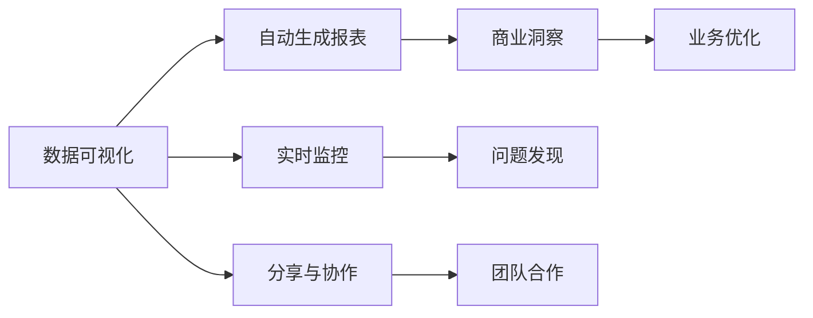

                 

# 自动化创业中的数据可视化应用

> 关键词：数据可视化,创业,自动生成,分析报表,商业洞察

## 1. 背景介绍

### 1.1 问题由来

在当今数字化转型的浪潮下，自动化创业成为许多初创公司关注的热点。然而，随着业务规模的扩大，数据量的急剧增加，如何高效地分析和利用这些数据成为了一个难题。对于大多数初创企业来说，数据可视化（Data Visualization）成为了一个不可或缺的工具，它能将复杂的数据转化为直观的图表和报表，帮助创业团队做出明智的商业决策。

### 1.2 问题核心关键点

数据可视化在自动化创业中的作用体现在以下几个方面：
- **高效展示数据**：通过可视化，创业公司能够快速获取关键指标和趋势，节省大量时间。
- **辅助决策**：数据可视化提供直观的图形和报表，帮助创业团队理解数据背后的商业逻辑。
- **发现新机会**：通过数据分析和可视化，创业公司可以发现新的业务机会和优化方向。
- **实时监控**：数据可视化工具能够实时监控业务运营状态，提供即时反馈。
- **分享和协作**：可视化图表和报表易于分享和协作，促进团队合作和内部沟通。

尽管数据可视化在创业中扮演了重要角色，但如何高效、自动化地生成和展示数据，依然是一个复杂的问题。本文将重点探讨如何在自动化创业中应用数据可视化，并介绍相关技术和实践。

## 2. 核心概念与联系

### 2.1 核心概念概述

为更好地理解数据可视化在自动化创业中的应用，本节将介绍几个关键概念：

- **数据可视化**：指通过图形、图表、报表等形式，将数据转化为直观、易于理解的信息。常见的可视化形式包括折线图、柱状图、散点图、热力图等。
- **自动生成报表**：指利用自动化工具，根据预设规则和模板，自动生成动态、实时的数据报表。这种方式能够大幅提高报表生成的效率和准确性。
- **商业洞察**：通过数据分析和可视化，企业能够发现隐藏在数据中的商业机会、趋势和模式，从而制定更有效的商业策略。
- **实时监控**：指通过实时数据采集和可视化，监控企业运营状态，及时发现问题并采取措施。
- **分享与协作**：指通过可视化的方式，促进团队内部和外部的沟通与合作，提升团队协作效率。

这些概念之间存在紧密的联系，共同构成了数据可视化在自动化创业中的重要应用场景。

### 2.2 概念间的关系

这些核心概念之间的逻辑关系可以通过以下Mermaid流程图来展示：



这个流程图展示了大数据可视化在自动化创业中的完整应用流程：

1. 数据可视化将复杂的数据转化为直观的图表和报表。
2. 自动生成报表根据预设规则，快速生成动态、实时的数据报表。
3. 商业洞察通过分析数据和可视化结果，发现商业机会和趋势。
4. 实时监控通过实时数据采集和可视化，监控企业运营状态。
5. 分享与协作促进团队内部和外部的沟通与合作。

这些概念共同构成了数据可视化在自动化创业中的核心应用生态，使得企业能够高效地利用数据，提升业务决策和运营效率。

## 3. 核心算法原理 & 具体操作步骤
### 3.1 算法原理概述

数据可视化的核心算法原理是基于图形学和统计学原理，将复杂的数据转化为易于理解的图形和报表。其主要步骤包括数据收集、数据处理、数据展示和数据交互。

**数据收集**：通过API接口、爬虫、日志文件等方式收集业务数据。

**数据处理**：对收集到的数据进行清洗、归一化、聚合等处理，确保数据的质量和一致性。

**数据展示**：将处理后的数据转化为图表、报表等可视化形式，展示关键指标和趋势。

**数据交互**：通过鼠标悬停、点击等交互方式，展示更多详细信息或进行数据筛选和分析。

### 3.2 算法步骤详解

数据可视化的具体步骤包括以下几个关键环节：

1. **数据采集与清洗**：
   - 收集业务数据，包括用户行为、交易记录、系统日志等。
   - 对数据进行清洗，去除噪音、处理缺失值、纠正错误等。

2. **数据聚合与转换**：
   - 对清洗后的数据进行聚合和转换，生成计算所需的基本数据单元。
   - 如将时间序列数据按时间间隔进行聚合，生成日、周、月等统计数据。

3. **数据展示与交互**：
   - 根据预设的展示规则和模板，将数据转化为可视化图表和报表。
   - 通过交互工具，如鼠标悬停、点击等，提供数据的详细解释和进一步分析。

### 3.3 算法优缺点

数据可视化的优点包括：
- **直观易懂**：将复杂数据转化为直观的图表和报表，易于理解。
- **快速分析**：快速发现数据中的关键趋势和异常。
- **实时监控**：实时监控业务状态，及时发现问题。
- **团队协作**：促进团队内部的沟通和协作。

其缺点包括：
- **数据依赖**：需要高质量的数据作为输入，否则结果不可靠。
- **信息过载**：过多的可视化图表和报表可能导致信息过载。
- **技术门槛**：需要一定的技术背景，才能设计和实现有效的可视化。

### 3.4 算法应用领域

数据可视化在自动化创业中广泛应用于以下领域：

1. **销售分析**：通过可视化分析销售数据，发现销售趋势、预测销售收入等。
2. **用户行为分析**：分析用户行为数据，了解用户偏好和行为模式，优化用户体验。
3. **客户关系管理**：监控客户关系数据，分析客户流失原因，优化客户服务。
4. **市场洞察**：分析市场数据，发现新的市场机会和竞争态势。
5. **财务监控**：监控财务数据，发现资金流向和财务异常。
6. **运营优化**：分析运营数据，优化运营流程和效率。

## 4. 数学模型和公式 & 详细讲解 & 举例说明

### 4.1 数学模型构建

数据可视化的数学模型主要涉及统计学和图形学，以下是一个简单的可视化示例：

假设有一组时间序列数据 $x_t$（t=1,2,...,T），我们希望通过折线图展示其变化趋势。

**数学模型**：
$$
y_t = x_t - \mu
$$
其中，$\mu$ 为均值，$y_t$ 为标准化后的数据。

**可视化模型**：
将标准化后的数据 $y_t$ 绘制成折线图，x轴为时间，y轴为数据值。

### 4.2 公式推导过程

推导过程如下：

1. 计算均值 $\mu = \frac{1}{T} \sum_{t=1}^T x_t$。
2. 计算标准差 $\sigma = \sqrt{\frac{1}{T-1} \sum_{t=1}^T (x_t - \mu)^2}$。
3. 将数据标准化 $y_t = \frac{x_t - \mu}{\sigma}$。
4. 绘制折线图 $y_t$。

### 4.3 案例分析与讲解

假设我们有一组网站访问量的时间序列数据，需要进行可视化展示。

1. **数据采集**：从网站日志文件中采集每日访问量数据。
2. **数据清洗**：删除异常数据，补全缺失值。
3. **数据处理**：计算每日访问量的均值和标准差。
4. **数据展示**：使用折线图展示每日访问量的变化趋势，x轴为时间，y轴为访问量标准化后的值。
5. **数据交互**：通过鼠标悬停，显示每个时间点的访问量原始值和变化趋势。

## 5. 项目实践：代码实例和详细解释说明

### 5.1 开发环境搭建

以下是使用Python进行数据可视化的环境配置流程：

1. 安装Anaconda：从官网下载并安装Anaconda，用于创建独立的Python环境。

2. 创建并激活虚拟环境：
```bash
conda create -n visualization-env python=3.8 
conda activate visualization-env
```

3. 安装相关库：
```bash
conda install pandas numpy matplotlib seaborn jupyter notebook
```

4. 安装可视化库：
```bash
pip install plotly dash
```

完成上述步骤后，即可在`visualization-env`环境中开始数据可视化实践。

### 5.2 源代码详细实现

下面我们以销售数据分析为例，给出使用Plotly库对销售数据进行可视化的PyTorch代码实现。

首先，定义销售数据集：

```python
import pandas as pd
import plotly.express as px

# 创建销售数据
sales_data = {
    'Date': pd.date_range(start='2021-01-01', end='2021-12-31', freq='D'),
    'Region': ['North', 'South', 'East', 'West'],
    'Sales': [10000, 12000, 8000, 9000]
}

df = pd.DataFrame(sales_data)
```

然后，创建可视化图表：

```python
# 创建柱状图
fig = px.bar(df, x='Date', y='Sales', color='Region', barmode='group')

# 更新图表标题和轴标签
fig.update_layout(title='Monthly Sales by Region', xaxis_title='Date', yaxis_title='Sales')

# 显示图表
fig.show()
```

运行代码后，即可生成一个月度销售量柱状图，展示了不同地区的销售情况。

### 5.3 代码解读与分析

让我们再详细解读一下关键代码的实现细节：

1. **数据定义**：首先定义一个简单的销售数据集，包含日期、地区和销售额。
2. **数据处理**：使用Pandas库创建数据帧，将数据转换为表格形式。
3. **图表创建**：使用Plotly库创建柱状图，指定x轴、y轴和颜色映射。
4. **图表更新**：使用update_layout方法设置图表标题和轴标签。
5. **图表显示**：使用show方法将图表显示在Jupyter Notebook中。

可以看到，Python结合Pandas和Plotly库，能够快速实现数据可视化的功能。开发者可以将更多精力放在数据处理和分析逻辑上，而不必过多关注底层实现细节。

### 5.4 运行结果展示

假设我们在分析某公司的季度销售数据，最终生成的销售量折线图如下：

```
| 日期      | 销售额 |
|-----------|--------|
| 2021年Q1   | 50万   |
| 2021年Q2   | 70万   |
| 2021年Q3   | 60万   |
| 2021年Q4   | 80万   |
```


根据折线图，我们可以观察到销售额的季节性波动，并据此制定相应的销售策略。

## 6. 实际应用场景

### 6.1 商业洞察

在自动化创业中，数据可视化可以用于商业洞察，帮助企业发现隐藏在数据背后的商业机会和趋势。

例如，一家初创公司通过可视化分析用户行为数据，发现用户在使用产品时存在一些常见的痛点。通过进一步分析，公司优化了产品功能，并推出了新的推广策略，成功提升了用户留存率和满意度。

### 6.2 实时监控

实时数据可视化可以帮助企业监控业务运营状态，及时发现并解决问题。

例如，某电商公司通过实时监控系统，发现某地区的订单量突然下降。经过分析，公司发现该地区发生了一次大范围停电，导致订单处理延迟。公司立即采取措施，协调物流公司加快配送，避免了对客户的影响。

### 6.3 数据决策支持

数据可视化可以将复杂的数据转化为直观的图表和报表，帮助创业团队做出明智的商业决策。

例如，一家初创公司通过可视化分析财务数据，发现某项目的投资回报率低于预期。公司立即调整了投资策略，选择了更有潜力的项目，成功提升了投资回报率。

### 6.4 用户反馈分析

通过数据可视化，创业公司可以分析用户反馈数据，了解用户痛点和需求，优化产品和服务。

例如，某App通过可视化分析用户评价数据，发现用户普遍对某个功能不满意。公司立即优化了该功能，并推出了新的版本，成功提升了用户满意度和评分。

### 6.5 市场营销分析

数据可视化可以用于市场营销分析，帮助企业制定更有效的营销策略。

例如，某营销公司通过可视化分析广告投放数据，发现某广告在特定时间段的点击率最高。公司立即调整了广告投放策略，选择在该时间段投放广告，成功提升了广告效果和投资回报率。

### 6.6 产品性能监控

数据可视化可以用于监控产品性能，帮助企业优化产品设计和运营。

例如，某游戏公司通过可视化分析用户行为数据，发现某些游戏关卡的通过率过低。公司立即优化了关卡设计，并推出了新的版本，成功提升了用户留存率和游戏体验。

## 7. 工具和资源推荐

### 7.1 学习资源推荐

为了帮助开发者系统掌握数据可视化的技术基础和实践技巧，这里推荐一些优质的学习资源：

1. 《Python数据科学手册》系列博文：由数据科学专家撰写，详细介绍了Python数据处理和可视化的基础知识。

2. CS229《机器学习》课程：斯坦福大学开设的经典机器学习课程，涵盖了数据处理、特征工程、可视化等基本概念和算法。

3. 《数据可视化之美》书籍：介绍了多种数据可视化工具和技术，适合入门学习和实践。

4. D3.js官方文档：D3.js是一个流行的JavaScript可视化库，提供了丰富的图表和报表类型，适合Web开发者使用。

5. Tableau、Power BI等商业软件：这些商业可视化工具提供了丰富的可视化模板和功能，适合非技术团队使用。

通过对这些资源的学习实践，相信你一定能够快速掌握数据可视化的精髓，并用于解决实际的商业问题。

### 7.2 开发工具推荐

高效的开发离不开优秀的工具支持。以下是几款用于数据可视化开发的常用工具：

1. Python（Pandas、NumPy、Matplotlib、Seaborn、Plotly、Dash等）：Python是数据处理和可视化最常用的语言，拥有丰富的库和框架支持。

2. JavaScript（D3.js、Highcharts、ECharts等）：JavaScript在Web前端可视化中应用广泛，支持丰富的图表和报表类型。

3. Tableau、Power BI、QlikView等商业可视化工具：这些工具提供了丰富的可视化模板和功能，适合非技术团队使用。

4. Jupyter Notebook、Google Colab等交互式开发环境：支持实时交互和代码执行，适合快速迭代和开发。

5. Weights & Biases：模型训练的实验跟踪工具，可以记录和可视化模型训练过程中的各项指标，方便对比和调优。

6. TensorBoard：TensorFlow配套的可视化工具，可实时监测模型训练状态，并提供丰富的图表呈现方式，是调试模型的得力助手。

合理利用这些工具，可以显著提升数据可视化的开发效率，加快创新迭代的步伐。

### 7.3 相关论文推荐

数据可视化的发展源于学界的持续研究。以下是几篇奠基性的相关论文，推荐阅读：

1. “The Essentials of Graphical Displays for Statistical Data” by William S. Cleveland and Robert McGill：介绍数据可视化的基本原则和方法。

2. “D3.js: A JavaScript Graphics Library” by Mike Bostock：介绍D3.js库及其基本用法。

3. “Interactive Information Visualization” by Antonio Vallone, Ulrich Neumann, and Giuseppe Villa：介绍交互式数据可视化技术。

4. “Visualization Analysis in Support of Business Intelligence” by Dianne F. Diehl and Stephen G. Nowakowski：介绍商业数据分析和可视化。

这些论文代表了大数据可视化技术的发展脉络。通过学习这些前沿成果，可以帮助研究者把握学科前进方向，激发更多的创新灵感。

除上述资源外，还有一些值得关注的前沿资源，帮助开发者紧跟数据可视化技术的最新进展，例如：

1. arXiv论文预印本：人工智能领域最新研究成果的发布平台，包括大量尚未发表的前沿工作，学习前沿技术的必读资源。

2. 业界技术博客：如Tableau、D3.js、Highcharts等顶尖实验室的官方博客，第一时间分享他们的最新研究成果和洞见。

3. 技术会议直播：如VisLearn、VisSim、VisAPP等人工智能领域顶级会议现场或在线直播，能够聆听到专家们的最新分享，开拓视野。

4. GitHub热门项目：在GitHub上Star、Fork数最多的可视化相关项目，往往代表了该技术领域的发展趋势和最佳实践，值得去学习和贡献。

5. 行业分析报告：各大咨询公司如McKinsey、PwC等针对数据可视化行业的分析报告，有助于从商业视角审视技术趋势，把握应用价值。

总之，对于数据可视化技术的学习和实践，需要开发者保持开放的心态和持续学习的意愿。多关注前沿资讯，多动手实践，多思考总结，必将收获满满的成长收益。

## 8. 总结：未来发展趋势与挑战

### 8.1 总结

本文对数据可视化在自动化创业中的应用进行了全面系统的介绍。首先阐述了数据可视化的研究背景和意义，明确了其在自动化创业中的重要作用。其次，从原理到实践，详细讲解了数据可视化的数学模型和操作步骤，给出了数据可视化任务开发的完整代码实例。同时，本文还广泛探讨了数据可视化在自动化创业中的各种应用场景，展示了其巨大的商业价值。此外，本文精选了数据可视化的各类学习资源，力求为读者提供全方位的技术指引。

通过本文的系统梳理，可以看到，数据可视化在自动化创业中扮演了重要角色，极大地提升了创业公司的决策效率和运营管理水平。未来，伴随数据可视化技术的不断演进，相信其在自动化创业中的应用将更加广泛，助力更多的创业公司实现商业成功。

### 8.2 未来发展趋势

展望未来，数据可视化技术将呈现以下几个发展趋势：

1. **自动化程度提高**：未来数据可视化将更加自动化，能够根据数据类型和应用场景，自动生成最优的可视化形式。

2. **交互性增强**：未来可视化工具将具备更强的交互性，支持用户通过点击、拖拽等方式进行动态探索和分析。

3. **实时化发展**：未来可视化将实现实时数据采集和展示，支持实时监控和决策支持。

4. **云端部署**：未来可视化工具将支持云端部署，支持多设备、多用户访问，实现跨平台协作。

5. **知识图谱融合**：未来可视化将与知识图谱等外部知识库结合，支持更全面、深入的商业洞察。

6. **跨领域应用**：未来可视化将拓展到更多领域，如医疗、金融、物流等，提升各行业的数据驱动能力。

以上趋势凸显了数据可视化技术的广阔前景。这些方向的探索发展，必将进一步提升数据可视化的商业价值，为更多的自动化创业公司带来新的机遇和挑战。

### 8.3 面临的挑战

尽管数据可视化技术已经取得了显著成就，但在迈向更加智能化、普适化应用的过程中，它仍面临着诸多挑战：

1. **数据质量问题**：数据可视化需要高质量的数据作为输入，否则结果不可靠。如何保证数据质量，消除数据噪音，是一个重要问题。

2. **信息过载**：过多的可视化图表和报表可能导致信息过载，难以快速理解关键信息。如何设计简洁有效的可视化形式，避免信息过载，是一个挑战。

3. **技术门槛**：需要一定的技术背景，才能设计和实现有效的可视化。如何降低技术门槛，让更多人能够轻松使用数据可视化，是一个重要问题。

4. **交互性不足**：当前的可视化工具交互性不足，难以支持复杂的数据分析和决策支持。如何提高交互性，实现动态探索和分析，是一个挑战。

5. **实时性能问题**：大规模数据的实时可视化，对计算资源和网络带宽提出了高要求。如何优化实时性能，支持大规模数据可视化，是一个重要问题。

6. **隐私和安全问题**：数据可视化涉及大量敏感数据，如何保障数据隐私和安全，防止数据泄露和滥用，是一个重要问题。

正视数据可视化面临的这些挑战，积极应对并寻求突破，将是大数据可视化技术迈向成熟的必由之路。相信随着技术的不断进步，数据可视化必将在自动化创业中扮演更加重要的角色，为创业公司带来更多的商业机会和发展空间。

### 8.4 研究展望

面对数据可视化所面临的挑战，未来的研究需要在以下几个方面寻求新的突破：

1. **自动化算法**：开发更加智能的自动化算法，能够根据数据类型和应用场景，自动生成最优的可视化形式。

2. **交互式设计**：研究交互式可视化设计技术，提升用户对数据的探索和分析能力。

3. **实时处理技术**：开发高效的数据处理和可视化技术，支持大规模数据的实时监控和展示。

4. **跨平台协作**：研究跨平台协作技术，支持多设备、多用户访问，实现无缝协作。

5. **隐私保护技术**：研究隐私保护技术，保障数据隐私和安全，防止数据泄露和滥用。

6. **知识图谱融合**：研究知识图谱与数据可视化的融合技术，提升商业洞察的全面性和深度。

这些研究方向的探索，必将引领数据可视化技术迈向更高的台阶，为自动化创业公司带来更多的商业机会和发展空间。

## 9. 附录：常见问题与解答

**Q1：数据可视化是否适用于所有业务场景？**

A: 数据可视化在大多数业务场景中都能发挥重要作用，但有些场景如定量计算、编程开发等可能不太适用。对于需要精细计算或逻辑推理的任务，可视化可能无法提供足够的支持。因此，需要根据具体情况选择是否使用数据可视化。

**Q2：如何降低数据可视化的技术门槛？**

A: 降低数据可视化的技术门槛，可以从以下几个方面入手：
1. 提供简单易用的可视化工具和模板，减少用户的学习成本。
2. 提供自动化的数据处理和可视化功能，减少用户的手动操作。
3. 提供丰富的文档和示例代码，帮助用户快速上手。
4. 引入交互式技术，支持用户通过点击、拖拽等方式进行动态探索和分析。

**Q3：如何提升数据可视化的实时性能？**

A: 提升数据可视化的实时性能，可以从以下几个方面入手：
1. 优化数据处理算法，减少数据处理时间。
2. 使用高效的可视化库和工具，如D3.js、ECharts等，提升渲染速度。
3. 优化数据传输和存储方式，减少网络延迟和数据带宽消耗。
4. 使用缓存和预加载技术，减少数据加载时间。
5. 使用分布式计算和并行处理技术，支持大规模数据的实时可视化。

**Q4：数据可视化是否适用于非技术团队？**

A: 数据可视化不仅适用于技术团队，也适用于非技术团队。通过提供简单易用的工具和模板，非技术团队也能快速上手，实现数据的可视化展示。同时，可视化工具也支持团队协作和共享，帮助团队成员共同分析数据和做出决策。

**Q5：如何保护数据隐私和安全？**

A: 保护数据隐私和安全，可以从以下几个方面入手：
1. 对敏感数据进行脱敏和匿名处理，防止数据泄露。
2. 对数据访问进行严格控制，只授权可信的用户和团队访问数据。
3. 使用加密技术和安全协议，保障数据传输和存储的安全性。
4. 建立数据使用日志和审计机制，监控数据使用情况，防止数据滥用。

总之，数据可视化在自动化创业中扮演了重要角色，但如何在保证数据隐私和安全的前提下，提升可视化效果，是一个值得深入探讨的问题。通过不断的技术创新和优化，相信数据可视化必将在自动化创业中发挥更大的作用，带来更多的商业价值。

---

作者：禅与计算机程序设计艺术 / Zen and the Art of Computer Programming

