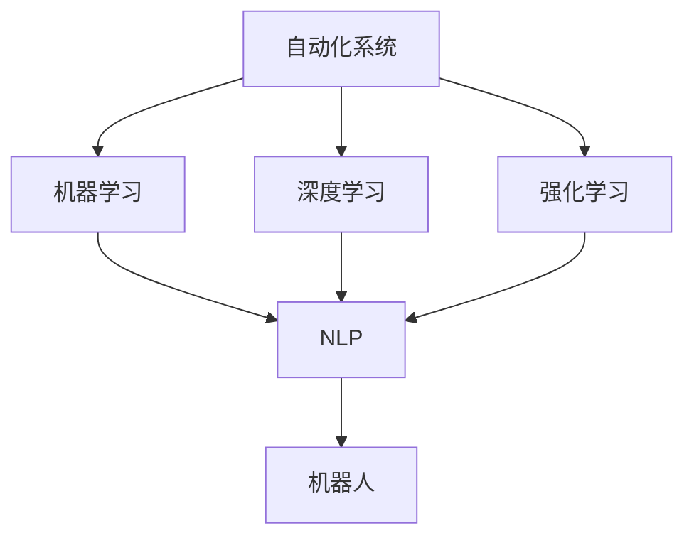
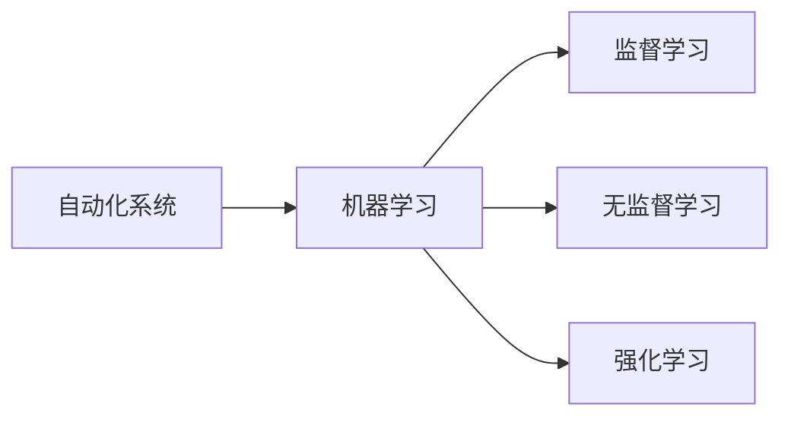

                 

# 自动化的最新发展与应用

## 1. 背景介绍

### 1.1 问题由来
随着技术的发展，自动化已经成为各行各业发展的核心驱动力之一。从早期的基于规则的自动化到现代基于AI的智能自动化，自动化技术的演进极大地提高了生产效率和业务创新能力。然而，尽管自动化技术不断进步，实际应用中仍然存在许多挑战和瓶颈，包括系统复杂性、数据管理和用户交互等方面。

### 1.2 问题核心关键点
自动化技术的发展主要围绕以下几个关键点展开：
1. **算法优化**：自动化系统的核心在于算法的精确性和鲁棒性，如何构建高效、泛化的算法是自动化发展的关键。
2. **数据处理**：数据是自动化系统的输入和输出，数据的质量、多样性和处理效率直接决定了系统的性能。
3. **系统集成**：自动化系统往往需要与现有系统进行集成，如何在不影响现有系统的前提下，实现平滑集成是自动化应用中的重要问题。
4. **用户交互**：自动化系统的最终用户是人，如何设计友好的用户界面和交互方式，确保系统易于使用和维护，是自动化应用中不可忽视的环节。

### 1.3 问题研究意义
自动化技术的深入研究和应用，对于提升生产效率、降低运营成本、改善用户体验等方面具有重要意义。通过自动化技术，可以显著提高企业的市场响应速度和创新能力，推动产业升级和转型。此外，自动化还将在智慧城市、智能医疗、自动驾驶等领域发挥重要作用，推动社会治理和服务的智能化水平。

## 2. 核心概念与联系

### 2.1 核心概念概述

为更好地理解自动化的最新发展与应用，本节将介绍几个关键概念：

- **自动化系统(Automatic System)**：通过算法、数据和模型驱动，能够自动完成特定任务的系统。自动化系统可以包括但不限于机器人、智能推荐系统、自动化流程等。

- **机器学习(Machine Learning)**：利用算法和数据，使计算机系统具备识别、预测和决策能力。机器学习是自动化系统中常用的核心技术之一。

- **深度学习(Deep Learning)**：机器学习的一种高级形式，利用神经网络模型处理大规模数据，实现更强的特征提取和分类能力。深度学习在大数据驱动的自动化系统中发挥重要作用。

- **强化学习(Reinforcement Learning)**：通过与环境交互，系统根据奖励信号进行学习，优化策略以最大化长期收益。强化学习在自动化系统优化和控制方面具有重要应用。

- **自然语言处理(Natural Language Processing, NLP)**：处理和理解人类语言的技术。NLP技术在自动化系统的人机交互、智能客服和内容生成等方面有广泛应用。

- **机器人(Robotics)**：融合机械、电子、计算机技术的自动化系统，能够执行重复性、高风险或需要人类协作的任务。

这些核心概念之间的关系可以通过以下Mermaid流程图来展示：



这个流程图展示了自动化系统与机器学习、深度学习、强化学习和自然语言处理等核心技术的关系：

1. 自动化系统通过机器学习、深度学习和强化学习等技术实现智能化。
2. NLP技术是自动化系统与人类进行自然交互的重要工具。
3. 机器人是自动化系统在实体世界中的具体应用。

### 2.2 概念间的关系

这些核心概念之间存在着紧密的联系，形成了自动化系统的完整生态系统。下面我们通过几个Mermaid流程图来展示这些概念之间的关系。

#### 2.2.1 自动化系统的学习范式



这个流程图展示了自动化系统常用的三种学习范式：监督学习、无监督学习和强化学习。

#### 2.2.2 深度学习在自动化中的应用

```mermaid
graph TB
    A[深度学习] --> B[特征提取]
    A --> C[分类与回归]
    A --> D[自然语言处理]
    A --> E[机器人视觉]
    A --> F[语音识别]
    B --> G[NLP中的词向量表示]
    C --> H[NLP中的文本分类]
    D --> I[智能客服]
    E --> J[机器人视觉]
    F --> K[语音识别]
    G --> L[机器人视觉]
    H --> M[智能客服]
    I --> N[智能客服]
    J --> O[机器人视觉]
    K --> P[语音识别]
    L --> Q[NLP中的文本分类]
    M --> R[智能客服]
    N --> S[智能客服]
    O --> T[机器人视觉]
    P --> U[语音识别]
    Q --> V[智能客服]
    R --> W[智能客服]
    S --> X[智能客服]
    T --> Y[机器人视觉]
    U --> Z[语音识别]
    V --> AA[智能客服]
    W --> AB[智能客服]
    X --> AC[智能客服]
    Y --> AD[机器人视觉]
    Z --> AE[语音识别]
    AA --> AF[智能客服]
    AB --> AG[智能客服]
    AC --> AH[智能客服]
    AD --> AI[机器人视觉]
    AE --> AJ[语音识别]
    AF --> AK[智能客服]
    AG --> AL[智能客服]
    AH --> AM[智能客服]
    AI --> AN[机器人视觉]
    AJ --> AO[语音识别]
    AK --> AP[智能客服]
    AL --> AQ[智能客服]
    AM --> AR[智能客服]
    AN --> AS[机器人视觉]
    AO --> AT[语音识别]
    AP --> AU[智能客服]
    AQ --> AV[智能客服]
    AR --> AW[智能客服]
    AS --> AX[机器人视觉]
    AT --> AY[语音识别]
    AU --> AZ[智能客服]
    AV --> BA[智能客服]
    AW --> BB[智能客服]
    AX --> BC[机器人视觉]
    AY --> BD[语音识别]
    AZ --> BE[智能客服]
    BA --> BF[智能客服]
    BB --> BG[智能客服]
    BC --> BH[机器人视觉]
    BD --> BI[语音识别]
    BE --> BJ[智能客服]
    BF --> BK[智能客服]
    BG --> BL[智能客服]
    BH --> BM[机器人视觉]
    BI --> BN[语音识别]
    BJ --> BO[智能客服]
    BK --> BP[智能客服]
    BL --> BQ[智能客服]
    BM --> BR[机器人视觉]
    BN --> BS[语音识别]
    BO --> BT[智能客服]
    BP --> BU[智能客服]
    BQ --> BV[智能客服]
    BR --> BW[机器人视觉]
    BS --> BX[语音识别]
    BT --> BY[智能客服]
    BU --> BZ[智能客服]
    BV --> CA[智能客服]
    BW --> CB[智能客服]
    BX --> CC[机器人视觉]
    BY --> CD[语音识别]
    BZ --> CE[智能客服]
    CA --> CF[智能客服]
    CB --> CG[智能客服]
    CC --> CH[机器人视觉]
    CD --> CI[语音识别]
    CE --> CJ[智能客服]
    CF --> CK[智能客服]
    CG --> CL[智能客服]
    CH --> CM[机器人视觉]
    CI --> CN[语音识别]
    CJ --> CO[智能客服]
    CK --> CP[智能客服]
    CL --> CQ[智能客服]
    CM --> CR[机器人视觉]
    CN --> CS[语音识别]
    CO --> CT[智能客服]
    CP --> CU[智能客服]
    CQ --> CV[智能客服]
    CR --> CW[机器人视觉]
    CS --> CX[语音识别]
    CT --> CY[智能客服]
    CU --> CZ[智能客服]
    CV --> DA[智能客服]
    CW --> DB[智能客服]
    CX --> DC[机器人视觉]
    CY --> DD[语音识别]
    CZ --> DE[智能客服]
    DA --> DF[智能客服]
    DB --> DG[智能客服]
    DC --> DH[机器人视觉]
    DD --> DI[语音识别]
    DE --> DJ[智能客服]
    DF --> DK[智能客服]
    DG --> DL[智能客服]
    DH --> DM[机器人视觉]
    DI --> DN[语音识别]
    DJ --> DO[智能客服]
    DK --> DP[智能客服]
    DL --> DQ[智能客服]
    DM --> DR[机器人视觉]
    DN --> DS[语音识别]
    DO --> DT[智能客服]
    DP --> DU[智能客服]
    DQ --> DV[智能客服]
    DR --> DW[机器人视觉]
    DS --> DX[语音识别]
    DT --> DY[智能客服]
    DU --> DZ[智能客服]
    DV --> EA[智能客服]
    DW --> EB[智能客服]
    DX --> EC[机器人视觉]
    DY --> ED[语音识别]
    DZ --> EE[智能客服]
    EA --> EF[智能客服]
    EB --> EG[智能客服]
    EC --> EH[机器人视觉]
    ED --> EI[语音识别]
    EE --> EJ[智能客服]
    EF --> EK[智能客服]
    EG --> EL[智能客服]
    EH --> EM[机器人视觉]
    EI --> EN[语音识别]
    EJ --> EO[智能客服]
    EK --> EP[智能客服]
    EL --> EQ[智能客服]
    EM --> ER[机器人视觉]
    EN --> ES[语音识别]
    EO --> ET[智能客服]
    EP --> EU[智能客服]
    EQ --> EV[智能客服]
    ER --> EW[机器人视觉]
    ES --> EX[语音识别]
    ET --> EY[智能客服]
    EU --> EZ[智能客服]
    EV --> FA[智能客服]
    EW --> FB[智能客服]
    EX --> FC[机器人视觉]
    EY --> FD[语音识别]
    EZ --> FE[智能客服]
    FA --> FF[智能客服]
    FB --> FG[智能客服]
    FC --> FH[机器人视觉]
    FD --> FI[语音识别]
    FE --> FJ[智能客服]
    FF --> FK[智能客服]
    FG --> FL[智能客服]
    FH --> FM[机器人视觉]
    FI --> FN[语音识别]
    FJ --> FO[智能客服]
    FK --> FP[智能客服]
    FL --> FQ[智能客服]
    FM --> FR[机器人视觉]
    FN --> FS[语音识别]
    FO --> FT[智能客服]
    FP --> FU[智能客服]
    FQ --> FV[智能客服]
    FR --> FW[机器人视觉]
    FS --> FX[语音识别]
    FT --> FY[智能客服]
    FU --> FZ[智能客服]
    FV --> GA[智能客服]
    FW --> GB[智能客服]
    FX --> GC[机器人视觉]
    FY --> GD[语音识别]
    FZ --> GE[智能客服]
    GA --> GF[智能客服]
    GB --> GG[智能客服]
    GC --> GH[机器人视觉]
    GD --> GI[语音识别]
    GE --> GJ[智能客服]
    GF --> GK[智能客服]
    GG --> GL[智能客服]
    GH --> GM[机器人视觉]
    GI --> GN[语音识别]
    GJ --> GO[智能客服]
    GK --> GP[智能客服]
    GL --> GQ[智能客服]
    GM --> GR[机器人视觉]
    GN --> GS[语音识别]
    GO --> GT[智能客服]
    GP --> GU[智能客服]
    GQ --> GV[智能客服]
    GR --> GW[机器人视觉]
    GS --> GX[语音识别]
    GT --> GY[智能客服]
    GU --> GZ[智能客服]
    GV --> HA[智能客服]
    GW --> HB[智能客服]
    GX --> HC[机器人视觉]
    GY --> HD[语音识别]
    GZ --> HE[智能客服]
    HA --> HF[智能客服]
    HB --> HG[智能客服]
    HC --> HH[机器人视觉]
    HD --> HI[语音识别]
    HE --> HJ[智能客服]
    HF --> HK[智能客服]
    HG --> HL[智能客服]
    HH --> HM[机器人视觉]
    HI --> HN[语音识别]
    HJ --> HO[智能客服]
    HK --> HP[智能客服]
    HL --> HQ[智能客服]
    HM --> HR[机器人视觉]
    HN --> HS[语音识别]
    HO --> HT[智能客服]
    HP --> HU[智能客服]
    HQ --> HV[智能客服]
    HR --> HW[机器人视觉]
    HS --> HX[语音识别]
    HT --> HY[智能客服]
    HU --> HZ[智能客服]
    HV --> IA[智能客服]
    HW --> IB[智能客服]
    HX --> IC[机器人视觉]
    HY --> ID[语音识别]
    HZ --> IE[智能客服]
    IA --> IF[智能客服]
    IB --> IG[智能客服]
    IC --> IH[机器人视觉]
    ID --> IE[语音识别]
    IE --> IF[智能客服]
    IF --> IG[智能客服]
    IG --> IH[智能客服]
    IH --> II[机器人视觉]
    II --> IJ[语音识别]
    IJ --> IK[智能客服]
    IK --> IL[智能客服]
    IL --> IM[智能客服]
    IM --> IN[机器人视觉]
    IN --> IO[语音识别]
    IO --> IP[智能客服]
    IP --> IQ[智能客服]
    IQ --> IR[智能客服]
    IR --> IS[机器人视觉]
    IS --> IT[语音识别]
    IT --> IU[智能客服]
    IU --> IV[智能客服]
    IV --> II[机器人视觉]
    II --> IJ[语音识别]
    IJ --> IK[智能客服]
    IK --> IL[智能客服]
    IL --> IM[智能客服]
    IM --> IN[机器人视觉]
    IN --> IO[语音识别]
    IO --> IP[智能客服]
    IP --> IQ[智能客服]
    IQ --> IR[智能客服]
    IR --> IS[机器人视觉]
    IS --> IT[语音识别]
    IT --> IU[智能客服]
    IU --> IV[智能客服]
    IV --> II[机器人视觉]
    II --> IJ[语音识别]
    IJ --> IK[智能客服]
    IK --> IL[智能客服]
    IL --> IM[智能客服]
    IM --> IN[机器人视觉]
    IN --> IO[语音识别]
    IO --> IP[智能客服]
    IP --> IQ[智能客服]
    IQ --> IR[智能客服]
    IR --> IS[机器人视觉]
    IS --> IT[语音识别]
    IT --> IU[智能客服]
    IU --> IV[智能客服]
    IV --> II[机器人视觉]
    II --> IJ[语音识别]
    IJ --> IK[智能客服]
    IK --> IL[智能客服]
    IL --> IM[智能客服]
    IM --> IN[机器人视觉]
    IN --> IO[语音识别]
    IO --> IP[智能客服]
    IP --> IQ[智能客服]
    IQ --> IR[智能客服]
    IR --> IS[机器人视觉]
    IS --> IT[语音识别]
    IT --> IU[智能客服]
    IU --> IV[智能客服]
    IV --> II[机器人视觉]
    II --> IJ[语音识别]
    IJ --> IK[智能客服]
    IK --> IL[智能客服]
    IL --> IM[智能客服]
    IM --> IN[机器人视觉]
    IN --> IO[语音识别]
    IO --> IP[智能客服]
    IP --> IQ[智能客服]
    IQ --> IR[智能客服]
    IR --> IS[机器人视觉]
    IS --> IT[语音识别]
    IT --> IU[智能客服]
    IU --> IV[智能客服]
    IV --> II[机器人视觉]
    II --> IJ[语音识别]
    IJ --> IK[智能客服]
    IK --> IL[智能客服]
    IL --> IM[智能客服]
    IM --> IN[机器人视觉]
    IN --> IO[语音识别]
    IO --> IP[智能客服]
    IP --> IQ[智能客服]
    IQ --> IR[智能客服]
    IR --> IS[机器人视觉]
    IS --> IT[语音识别]
    IT --> IU[智能客服]
    IU --> IV[智能客服]
    IV --> II[机器人视觉]
    II --> IJ[语音识别]
    IJ --> IK[智能客服]
    IK --> IL[智能客服]
    IL --> IM[智能客服]
    IM --> IN[机器人视觉]
    IN --> IO[语音识别]
    IO --> IP[智能客服]
    IP --> IQ[智能客服]
    IQ --> IR[智能客服]
    IR --> IS[机器人视觉]
    IS --> IT[语音识别]
    IT --> IU[智能客服]
    IU --> IV[智能客服]
    IV --> II[机器人视觉]
    II --> IJ[语音识别]
    IJ --> IK[智能客服]
    IK --> IL[智能客服]
    IL --> IM[智能客服]
    IM --> IN[机器人视觉]
    IN --> IO[语音识别]
    IO --> IP[智能客服]
    IP --> IQ[智能客服]
    IQ --> IR[智能客服]
    IR --> IS[机器人视觉]
    IS --> IT[语音识别]
    IT --> IU[智能客服]
    IU --> IV[智能客服]
    IV --> II[机器人视觉]
    II --> IJ[语音识别]
    IJ --> IK[智能客服]
    IK --> IL[智能客服]
    IL --> IM[智能客服]
    IM --> IN[机器人视觉]
    IN --> IO[语音识别]
    IO --> IP[智能客服]
    IP --> IQ[智能客服]
    IQ --> IR[智能客服]
    IR --> IS[机器人视觉]
    IS --> IT[语音识别]
    IT --> IU[智能客服]
    IU --> IV[智能客服]
    IV --> II[机器人视觉]
    II --> IJ[语音识别]
    IJ --> IK[智能客服]
    IK --> IL[智能客服]
    IL --> IM[智能客服]
    IM --> IN[机器人视觉]
    IN --> IO[语音识别]
    IO --> IP[智能客服]
    IP --> IQ[智能客服]
    IQ --> IR[智能客服]
    IR --> IS[机器人视觉]
    IS --> IT[语音识别]
    IT --> IU[智能客服]
    IU --> IV[智能客服]
    IV --> II[机器人视觉]
    II --> IJ[语音识别]
    IJ --> IK[智能客服]
    IK --> IL[智能客服]
    IL --> IM[智能客服]
    IM --> IN[机器人视觉]
    IN --> IO[语音识别]
    IO --> IP[智能客服]
    IP --> IQ[智能客服]
    IQ --> IR[智能客服]
    IR --> IS[机器人视觉]
    IS --> IT[语音识别]
    IT --> IU[智能客服]
    IU --> IV[智能客服]
    IV --> II[机器人视觉]
    II --> IJ[语音识别]
    IJ --> IK[智能客服]
    IK --> IL[智能客服]
    IL --> IM[智能客服]
    IM --> IN[机器人视觉]
    IN --> IO[语音识别]
    IO --> IP[智能客服]
    IP --> IQ[智能客服]
    IQ --> IR[智能客服]
    IR --> IS[机器人视觉]
    IS --> IT[语音识别]
    IT --> IU[智能客服]
    IU --> IV[智能客服]
    IV --> II[机器人视觉]
    II --> IJ[语音识别]
    IJ --> IK[智能客服]
    IK --> IL[智能客服]
    IL --> IM[智能客服]
    IM --> IN[机器人视觉]
    IN --> IO[语音识别]
    IO --> IP[智能客服]
    IP --> IQ[智能客服]
    IQ --> IR[智能客服]
    IR --> IS[机器人视觉]
    IS --> IT[语音识别]
    IT --> IU[智能客服]
    IU --> IV[智能客服]
    IV --> II[机器人视觉]
    II --> IJ[语音识别]
    IJ --> IK[智能客服]
    IK --> IL[智能客服]
    IL --> IM[智能客服]
    IM --> IN[机器人视觉]
    IN --> IO[语音识别]
    IO --> IP[智能客服]
    IP --> IQ[智能客服]
    IQ --> IR[智能客服]
    IR --> IS[机器人视觉]
    IS --> IT[语音识别]
    IT --> IU[智能客服]
    IU --> IV[智能客服]
    IV --> II[机器人视觉]
    II --> IJ[语音识别]
    IJ --> IK[智能客服]
    IK --> IL[智能客服]
    IL --> IM[智能客服]
    IM --> IN[机器人视觉]
    IN --> IO[语音识别]
    IO --> IP[智能客服]
    IP --> IQ[智能客服]
    IQ --> IR[智能客服]
    IR --> IS[机器人视觉]
    IS --> IT[语音识别]
    IT --> IU[智能客服]
    IU --> IV[智能客服]
    IV --> II[机器人视觉]
    II --> IJ[语音识别]
    IJ --> IK[智能客服]
    IK --> IL[智能客服]
    IL --> IM[智能客服]
    IM --> IN[机器人视觉]
    IN --> IO[语音识别]
    IO --> IP[智能客服]
    IP --> IQ[智能客服]
    IQ --> IR[智能客服]
    IR --> IS[机器人视觉]
    IS --> IT[语音识别]
    IT --> IU[智能客服]
    IU --> IV[智能客服]
    IV --> II[机器人视觉]
    II --> IJ[语音识别]
    IJ --> IK[智能客服]
    IK --> IL[智能客服]
    IL --> IM[智能客服]
    IM --> IN[机器人视觉]
    IN --> IO[语音识别]
    IO --> IP[智能客服]
    IP --> IQ[智能客服]
    IQ --> IR[智能客服]
    IR --> IS[机器人视觉]
    IS --> IT[语音识别]
    IT --> IU[智能客服]
    IU --> IV[智能客服]
    IV --> II[机器人视觉]
    II --> IJ[语音识别]
    IJ --> IK[智能客服]
    IK --> IL[智能客服]
    IL --> IM[智能客服]
    IM --> IN[机器人视觉]
    IN --> IO[语音识别]
    IO --> IP[智能客服]
    IP --> IQ[智能客服]
    IQ --> IR[智能客服]
    IR --> IS[机器人视觉]
    IS --> IT[语音识别]
    IT --> IU[智能客服]
    IU --> IV[智能客服]
    IV --> II[机器人视觉]
    II --> IJ[语音识别]
    IJ --> IK[智能客服]
    IK --> IL[智能客服]
    IL --> IM[智能客服]
    IM --> IN[机器人视觉]
    IN --> IO[语音识别]
    IO --> IP[智能客服]
    IP --> IQ[智能客服]
    IQ --> IR[智能客服]
    IR --> IS[机器人视觉]
    IS --> IT[语音识别]
    IT --> IU[智能客服]
    IU --> IV[智能客服]
    IV --> II[机器人视觉]
    II --> IJ[语音识别]
    IJ --> IK[智能客服]
    IK --> IL[智能客服]
    IL --> IM[智能客服]
    IM --> IN[机器人视觉]
    IN --> IO[语音识别]
    IO --> IP[智能客服]
    IP --> IQ[智能客服]
    IQ --> IR[智能客服]
    IR --> IS[机器人视觉]
    IS --> IT[语音识别]
    IT --> IU[智能客服]
    IU --> IV[智能客服]
    IV --> II[机器人视觉]
    II --> IJ[语音识别]
    IJ --> IK[智能客服]
    IK --> IL[智能客服]
    IL --> IM[智能客服]
    IM --> IN[机器人视觉]
    IN --> IO[语音识别]
    IO --> IP[智能客服]
    IP --> IQ[智能客服]
    IQ --> IR[智能客服]
    IR --> IS[机器人视觉]
    IS --> IT[语音识别]
    IT --> IU[智能客服]
    IU --> IV[智能客服]
    IV --> II[机器人视觉]
    II --> IJ[语音识别]
    IJ --> IK[智能客服]
    IK --> IL[智能客服]
    IL --> IM[智能客服]
    IM --> IN[机器人视觉]
    IN --> IO[语音识别]
    IO --> IP[智能客服]
    IP --> IQ[智能客服]
    IQ --> IR[智能客服]
    IR --> IS[机器人视觉]
    IS --> IT[语音识别]
    IT --> IU[智能客服]
    IU --> IV[智能客服]
    IV --> II[机器人视觉]
    II --> IJ[语音识别]
    IJ --> IK[智能客服]
    IK --> IL[智能客服]
    IL --> IM[智能客服]
    IM --> IN[机器人视觉]
    IN --> IO[语音识别]
    IO --> IP[智能客服]
    IP --> IQ[智能客服]
    IQ --> IR[智能客服]
    IR --> IS[机器人视觉]
    IS --> IT[语音识别]
    IT --> IU[智能客服]
    IU --> IV[智能客服]
    IV --> II[机器人视觉]
    II --> IJ[语音识别]
    IJ --> IK[智能客服]
    IK --> IL[智能客服]
    IL --> IM[智能客服]
    IM --> IN[机器人视觉]
    IN --> IO[语音识别]
    IO --> IP[智能客服]
    IP --> IQ[智能客服]
    IQ --> IR[智能客服]
    IR --> IS[机器人视觉]
    IS --> IT[语音识别]
    IT --> IU[智能客服]
    IU --> IV[智能客服]
    IV --> II[机器人视觉]
    II --> IJ[语音识别]
    IJ --> IK[智能客服]
    IK --> IL[智能客服]
    IL --> IM[智能客服]
    IM --> IN[机器人视觉]
    IN --> IO[语音识别]
    IO --> IP[智能客服]
    IP --> IQ[智能客服]
    IQ --> IR[智能客服]
    IR --> IS[机器人视觉]
    IS --> IT[语音识别]
    IT --> IU[

