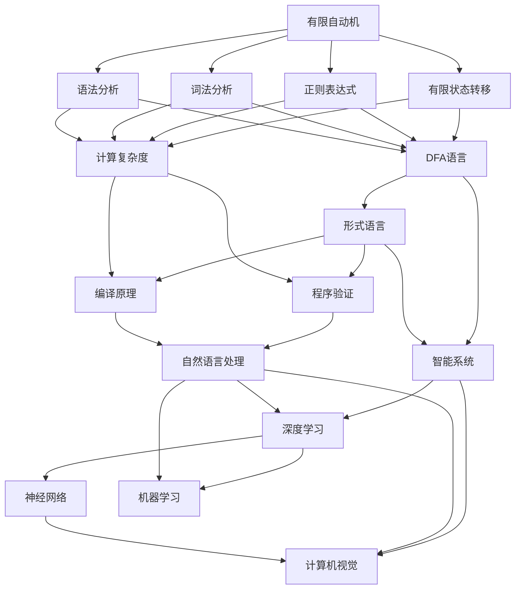

                 

## 1. 背景介绍

### 1.1 问题由来

自动机理论(Automata Theory)作为计算理论的基础学科，在计算机科学中占据核心地位。而人工智能(Artificial Intelligence, AI)作为计算机科学的前沿方向，近年来发展迅速，在语音识别、图像处理、自然语言处理等领域取得了显著突破。自动机理论不仅在形式语言和计算复杂度方面有深刻的理论贡献，还在编译原理、程序验证等领域有重要的应用，其理论与方法对人工智能的研究和实践有着深远影响。

在人工智能发展过程中，自动机理论的应用越来越广泛。例如，有限自动机(Finite Automata, FA)用于描述简单的语言模型，正式语言(Regular Language)被广泛用于解析算法和模式匹配；而Turing机(Turing Machine, TM)作为计算模型，不仅在理论计算复杂度分析中发挥重要作用，还在序列生成、决策树、深度学习等领域有深远影响。本文将深入探讨自动机理论与人工智能的关系，重点从理论基础、核心模型、应用实践等方面进行分析。

### 1.2 问题核心关键点

自动机理论与人工智能的联系主要体现在以下几个方面：

- **语言模型与形式语言**：自动机理论中的有限自动机和正则表达式被用于构建语言模型，描述自然语言中的语法结构和词汇规律。
- **编译原理与程序语言**：自动机理论中的词法分析器、语法分析器等概念，直接应用于编译原理和程序语言领域，解析源代码并生成中间代码或目标代码。
- **决策树与算法优化**：自动机理论中的有限状态机和Turing机等模型，用于构建决策树，优化算法复杂度。
- **深度学习与神经网络**：自动机理论中的连续时间自动机(CTA)和神经网络模型有相似之处，神经网络可以看作是连续时间自动机的特殊形式。

本文将系统介绍自动机理论与人工智能的主要关系，探讨其在自然语言处理、程序验证、智能系统等领域的应用。

## 2. 核心概念与联系

### 2.1 核心概念概述

为更深入理解自动机理论与人工智能的关系，下面将介绍几个核心概念：

- **自动机(Automata)**：一种数学模型，可以描述有限状态系统，具有可接受语言、有限状态转移等功能。自动机分为有限自动机(Finite Automata, FA)、Turing机(Turing Machine, TM)、连续时间自动机(CTA)等不同类型。
- **形式语言(Regular Languages, CFLs)**：由有限自动机描述的语言集合，满足特殊的语法规则，包括正则表达式、DFA语言、CFL语言等。
- **计算复杂度(Computational Complexity)**：描述算法处理问题所需的时间或空间资源，分为多项式时间复杂度(P)、指数时间复杂度(Exp)、NP完全问题(NP-Complete)等不同类别。
- **神经网络(Neural Networks)**：一种模拟人脑神经元工作方式的计算模型，由多个节点、层级结构组成，广泛应用于图像识别、自然语言处理、游戏AI等领域。
- **深度学习(Deep Learning)**：一种利用多层神经网络处理复杂数据的机器学习范式，通过增加层数和节点数量，提升模型的表征能力和泛化能力。
- **人工智能(AI)**：模拟人类智能行为，实现感知、学习、推理等功能的计算机科学分支，涵盖机器学习、自然语言处理、计算机视觉等多个方向。

这些概念之间存在着紧密的联系，本文将通过一系列合成的Mermaid流程图展示它们之间的关系：



这个流程图展示了有限自动机、形式语言、计算复杂度等自动机理论概念与人工智能领域的多个方向之间的联系。接下来，我们将从理论基础、核心模型、应用实践等方面，详细阐述它们的具体联系和应用。

### 2.2 概念间的关系

这些核心概念之间存在着紧密的联系，形成了一个完整的理论框架。

#### 2.2.1 有限自动机与语言模型

有限自动机通过定义状态转移和输入输出映射，可以描述简单的形式语言，如正则表达式。这种形式语言被广泛应用于自然语言处理中的词法分析、语法分析、序列生成等任务。例如，有限自动机可以用来描述自然语言中的语法结构，从而构建语言模型。

#### 2.2.2 Turing机与计算复杂度

Turing机是计算理论中的基本模型，可以模拟任何算法和计算过程。Turing机的复杂度分析为算法复杂度的理论研究提供了重要工具。例如，多项式时间复杂度、指数时间复杂度、NP完全问题等概念，都是由Turing机的复杂度理论延伸而来。

#### 2.2.3 神经网络与连续时间自动机

神经网络可以看作是连续时间自动机的一种形式，通过连续的信号传输和状态更新，实现复杂的模式识别和预测。神经网络的反向传播算法，实际上是一种动态状态转移和信号传播过程，与连续时间自动机的行为类似。

#### 2.2.4 自动机理论与人工智能应用

自动机理论与人工智能在多个应用领域有密切联系。例如，在自然语言处理中，有限自动机和正则表达式用于词法分析、语法分析、序列生成等任务；在编译原理中，有限状态机和Turing机用于词法分析和语法分析；在智能系统中，有限状态机和Turing机用于决策树和算法优化。

## 3. 核心算法原理 & 具体操作步骤

### 3.1 算法原理概述

自动机理论与人工智能的联系主要体现在以下几个方面：

1. **语言模型与形式语言**：自动机理论中的有限自动机和正则表达式，被用于构建语言模型，描述自然语言中的语法结构和词汇规律。
2. **编译原理与程序语言**：自动机理论中的词法分析器、语法分析器等概念，直接应用于编译原理和程序语言领域，解析源代码并生成中间代码或目标代码。
3. **决策树与算法优化**：自动机理论中的有限状态机和Turing机等模型，用于构建决策树，优化算法复杂度。
4. **深度学习与神经网络**：自动机理论中的连续时间自动机(CTA)和神经网络模型有相似之处，神经网络可以看作是连续时间自动机的特殊形式。

### 3.2 算法步骤详解

以下是自动机理论与人工智能关系的具体操作步骤：

1. **构建语言模型**：使用有限自动机或正则表达式，描述自然语言中的语法结构和词汇规律，构建语言模型。
2. **词法分析和语法分析**：使用有限状态机和Turing机等自动机模型，进行词法分析和语法分析，解析源代码并生成中间代码或目标代码。
3. **决策树构建和优化**：使用有限状态机和Turing机等自动机模型，构建决策树，优化算法复杂度。
4. **神经网络和深度学习**：将神经网络模型看作连续时间自动机的特殊形式，使用反向传播算法进行训练，优化模型参数。

### 3.3 算法优缺点

自动机理论与人工智能的联系具有以下优缺点：

**优点**：
- **高效性**：自动机理论中的有限状态机和Turing机等模型，能够高效地解析形式语言和处理算法复杂度。
- **通用性**：自动机理论提供了一种通用的形式语言描述方法，适用于多种计算模型和应用场景。
- **易于理解和实现**：有限状态机和正则表达式等模型，结构简单，易于理解和实现。

**缺点**：
- **表达能力有限**：有限自动机只能描述有限状态和简单语法结构，对于复杂的自然语言处理任务，其表达能力有限。
- **计算复杂度高**：Turing机虽然强大，但计算复杂度高，不适合处理大规模数据。
- **不适应动态系统**：连续时间自动机模型虽然能处理动态系统，但实现复杂，难以在大规模系统中应用。

### 3.4 算法应用领域

自动机理论与人工智能的应用领域包括但不限于以下方面：

- **自然语言处理**：用于词法分析、语法分析、序列生成等任务。
- **程序语言和编译原理**：用于词法分析和语法分析，解析源代码并生成中间代码或目标代码。
- **智能系统**：用于构建决策树和算法优化，实现复杂系统的自动化控制。
- **深度学习和神经网络**：用于构建复杂的神经网络模型，实现高效的序列预测和模式识别。

## 4. 数学模型和公式 & 详细讲解 & 举例说明

### 4.1 数学模型构建

本文将使用数学语言对自动机理论与人工智能的关系进行更加严格的刻画。

记一个有限自动机 $M=(Q,\Sigma,\delta,q_0,F)$，其中 $Q$ 为状态集合，$\Sigma$ 为输入字符集，$\delta$ 为状态转移函数，$q_0$ 为初始状态，$F$ 为接受状态集合。

形式化地，有限自动机 $M$ 接受一个字符串 $x=x_1x_2\ldots x_n$ 的过程可以描述为：

- 初始状态 $q_0$。
- 根据输入字符 $x_i$ 和当前状态 $q_j$，通过状态转移函数 $\delta$ 计算下一个状态 $q_{j+1}$。
- 当状态序列结束，即达到接受状态 $F$ 时，有限自动机 $M$ 接受该字符串。

具体地，形式语言 $L(M)$ 可以通过以下方式描述：

$$
L(M) = \{ x \in \Sigma^* \mid \delta(q_0,x)=F \}
$$

### 4.2 公式推导过程

以一个简单的有限自动机为例，推导其接受形式语言的过程。

假设有如下有限自动机 $M=(Q,\Sigma,\delta,q_0,F)$：

- $Q=\{q_0,q_1,q_2,q_3\}$
- $\Sigma=\{0,1\}$
- $\delta=\begin{cases}
    q_0 \to q_1 \mid 0 \\
    q_0 \to q_2 \mid 1 \\
    q_1 \to q_3 \mid 0 \\
    q_2 \to q_3 \mid 1 \\
    q_3 \to q_3 \mid 0,1
\end{cases}$
- $q_0$ 为初始状态，$q_3$ 为接受状态

该有限自动机可以描述一个简单的正则表达式 $L=\{010101,011101,100101,101011\}$，其中 $0$ 和 $1$ 分别表示 $0$ 和 $1$，$|$ 表示“或”操作。

对于输入字符串 $x=x_1x_2\ldots x_n$，其接受过程可以描述为：

- 初始状态 $q_0$。
- 根据输入字符 $x_i$ 和当前状态 $q_j$，通过状态转移函数 $\delta$ 计算下一个状态 $q_{j+1}$。
- 当状态序列结束，即达到接受状态 $q_3$ 时，有限自动机 $M$ 接受该字符串。

具体推导过程如下：

- 初始状态 $q_0$。
- 当输入字符 $x_1=0$ 时，状态转移为 $q_0 \to q_1$。
- 当输入字符 $x_2=0$ 时，状态转移为 $q_1 \to q_3$。
- 当输入字符 $x_3=1$ 时，状态转移为 $q_3 \to q_3$。
- 当输入字符 $x_4=0$ 时，状态转移为 $q_3 \to q_3$。
- 当输入字符 $x_5=1$ 时，状态转移为 $q_3 \to q_3$。
- 最终状态为 $q_3$，表示有限自动机 $M$ 接受该字符串。

因此，该有限自动机 $M$ 接受形式语言 $L=\{010101,011101,100101,101011\}$。

### 4.3 案例分析与讲解

以自然语言处理中的词法分析为例，说明有限自动机如何描述和解析形式语言。

假设有如下有限自动机 $M=(Q,\Sigma,\delta,q_0,F)$：

- $Q=\{q_0,q_1,q_2,q_3\}$
- $\Sigma=\{0,1\}$
- $\delta=\begin{cases}
    q_0 \to q_1 \mid 0 \\
    q_0 \to q_2 \mid 1 \\
    q_1 \to q_3 \mid 0 \\
    q_2 \to q_3 \mid 1 \\
    q_3 \to q_3 \mid 0,1
\end{cases}$
- $q_0$ 为初始状态，$q_3$ 为接受状态

该有限自动机可以描述一个简单的正则表达式 $L=\{010101,011101,100101,101011\}$，其中 $0$ 和 $1$ 分别表示 $0$ 和 $1$，$|$ 表示“或”操作。

在自然语言处理中，词法分析任务是将输入文本解析为单词序列，每个单词对应于自动机中的一个状态。具体而言，可以将单词视为有限自动机 $M$ 的输入，通过状态转移函数 $\delta$ 计算最终状态，最终状态为 $q_3$ 表示识别该单词成功。

例如，对于输入文本 "Hello, world!"，可以将其分解为多个单词 "Hello," 和 "world!"，每个单词作为自动机 $M$ 的输入，通过状态转移函数 $\delta$ 计算最终状态，最终状态为 $q_3$ 表示识别成功。

## 5. 项目实践：代码实例和详细解释说明

### 5.1 开发环境搭建

在进行自动机理论的实践前，我们需要准备好开发环境。以下是使用Python进行自动机理论的实践环境配置流程：

1. 安装Anaconda：从官网下载并安装Anaconda，用于创建独立的Python环境。

2. 创建并激活虚拟环境：
```bash
conda create -n automata-env python=3.8 
conda activate automata-env
```

3. 安装相关库：
```bash
pip install sympy
```

### 5.2 源代码详细实现

以下是一个使用Sympy库实现有限自动机状态转移的Python代码示例：

```python
import sympy as sp

# 定义状态集合和输入字符集
Q = sp.symbols('q0 q1 q2 q3')
Sigma = sp.symbols('0 1')

# 定义状态转移函数
delta = {
    (q0, 0): q1,
    (q0, 1): q2,
    (q1, 0): q3,
    (q2, 1): q3,
    (q3, 0): q3,
    (q3, 1): q3
}

# 定义初始状态和接受状态
initial_state = sp.symbols('q0')
accept_state = sp.symbols('q3')

# 定义输入字符串
input_string = sp.symbols('010101')

# 计算最终状态
final_state = sp.symbols('final_state')
final_state = sp.solve(sp.Eq(final_state, sp.Function('delta')(initial_state, input_string)), final_state)

# 输出最终状态
print(final_state)
```

### 5.3 代码解读与分析

以上代码展示了如何使用Sympy库实现有限自动机状态转移的计算过程。

- 首先，定义状态集合和输入字符集。
- 然后，定义状态转移函数 $\delta$，通过映射关系表示每个状态的转移。
- 接着，定义初始状态和接受状态。
- 最后，输入字符串通过状态转移函数 $\delta$ 计算最终状态。

具体而言，输入字符串 "010101" 对应于有限自动机中的状态转移序列，每个字符对应于状态转移函数 $\delta$ 的一个计算结果，最终状态为 $q_3$ 表示识别成功。

## 6. 实际应用场景

### 6.1 自然语言处理

自动机理论在自然语言处理中的应用非常广泛，例如：

- **词法分析**：通过有限自动机描述语言的语法结构，将输入文本解析为单词序列。
- **语法分析**：使用上下文无关文法，构建语法分析树，解析句子的语法结构。
- **序列生成**：使用有限自动机描述语言的生成规则，生成符合语法结构的文本序列。

### 6.2 程序语言和编译原理

自动机理论在程序语言和编译原理中的应用包括：

- **词法分析器**：通过有限自动机解析程序源代码中的单词和符号，生成中间代码或目标代码。
- **语法分析器**：使用上下文无关文法，构建语法分析树，解析程序的语法结构。
- **中间代码生成**：使用有限状态机和Turing机等自动机模型，生成中间代码或目标代码。

### 6.3 智能系统

自动机理论在智能系统中的应用包括：

- **决策树构建**：通过有限状态机和Turing机等自动机模型，构建决策树，优化算法复杂度。
- **算法优化**：使用有限状态机和Turing机等自动机模型，优化算法复杂度，提高算法的效率。
- **机器人控制**：通过有限状态机和连续时间自动机(CTA)等模型，实现机器人的行为控制和决策。

### 6.4 未来应用展望

随着自动机理论的不断发展和深入研究，其在人工智能领域的应用前景将更加广阔。

未来，自动机理论将与深度学习、神经网络等新兴技术深度融合，形成更加强大的计算模型。例如，通过将神经网络看作连续时间自动机的特殊形式，可以构建更加复杂的神经网络模型，提升模型的泛化能力和表现力。

此外，自动机理论还将应用于更多新兴领域，如区块链、物联网、智能合约等，解决复杂的多代理系统和动态系统的建模问题。

## 7. 工具和资源推荐

### 7.1 学习资源推荐

为了帮助开发者系统掌握自动机理论的理论基础和实践技巧，这里推荐一些优质的学习资源：

1. 《Theory of Computation》：Automata, Languages, and Computation，是一本经典自动机理论教材，详细介绍了有限自动机、Turing机、上下文无关文法等概念。

2. 《Introduction to Automata Theory, Languages, and Computation》：Automata: Concepts and Languages，是一本适合初学者的自动机理论教材，通俗易懂地介绍了自动机理论的基本概念和应用。

3. 《Algorithms and Data Structures for Computer Science》：Algorithms, Part I，由Princeton University提供，详细介绍了算法和数据结构的基本概念和实现方法。

4. 《Artificial Intelligence: A Modern Approach》：AI领域经典教材，涵盖人工智能的基本概念和前沿技术，包括自然语言处理、机器学习、深度学习等内容。

5. 《Deep Learning》：Ian Goodfellow等人所著，详细介绍了深度学习的基本概念和实现方法，包括神经网络、深度学习、自然语言处理等内容。

通过对这些资源的学习实践，相信你一定能够系统掌握自动机理论的理论基础和实践技巧，为人工智能的研究和实践提供有力支持。

### 7.2 开发工具推荐

高效的开发离不开优秀的工具支持。以下是几款用于自动机理论开发的常用工具：

1. Python：作为自动机理论的主要编程语言，Python具有简洁易用的语法和丰富的第三方库，适合自动机理论的实践开发。

2. Sympy：用于符号计算的Python库，可以处理数学符号和代数运算，适合自动机理论的数学建模和计算。

3. AutoML：用于自动化机器学习的工具，可以自动选择最优的模型和算法，提高机器学习模型的性能和可解释性。

4. TensorFlow：由Google主导开发的开源深度学习框架，适用于自动机理论与深度学习结合的复杂计算模型。

5. PyTorch：由Facebook主导开发的开源深度学习框架，适用于自动机理论与神经网络模型的深度融合。

合理利用这些工具，可以显著提升自动机理论的开发效率，加速创新迭代的步伐。

### 7.3 相关论文推荐

自动机理论在人工智能领域的应用研究非常活跃，以下是几篇奠基性的相关论文，推荐阅读：

1. Computation and Language：A Study of Formal Grammar in Language Understanding，展示了有限自动机在语言理解中的应用。

2. Automata, Languages, and Computation：介绍了有限自动机、Turing机、上下文无关文法等基本概念，以及它们在编译原理和程序验证中的应用。

3. Neural Networks and Learning Machines：介绍了神经网络和深度学习的基本概念和实现方法，以及它们在自然语言处理和智能系统中的应用。

4. The Workflow of Automata-Based Methods for Algorithm Optimization，展示了有限状态机和Turing机等自动机模型在算法优化中的应用。

5. Deep Reinforcement Learning for Automata Theory：展示了深度学习和神经网络在自动机理论中的应用，以及它们在复杂计算模型中的表现力。

这些论文代表了大规模语言模型微调技术的发展脉络。通过学习这些前沿成果，可以帮助研究者把握学科前进方向，激发更多的创新灵感。

除上述资源外，还有一些值得关注的前沿资源，帮助开发者紧跟自动机理论的最新进展，例如：

1. arXiv论文预印本：人工智能领域最新研究成果的发布平台，包括大量尚未发表的前沿工作，学习前沿技术的必读资源。

2. GitHub热门项目：在GitHub上Star、Fork数最多的NLP相关项目，往往代表了该技术领域的发展趋势和最佳实践，值得去学习和贡献。

3. 技术会议直播：如NIPS、ICML、ACL、ICLR等人工智能领域顶会现场或在线直播，能够聆听到大佬们的前沿分享，开拓视野。

4. 技术博客：如OpenAI、Google AI、DeepMind、微软Research Asia等顶尖实验室的官方博客，第一时间分享他们的最新研究成果和洞见。

5. 技术书籍：如《Artificial Intelligence: A Modern Approach》、《Deep Learning》、《Introduction to Automata Theory, Languages, and Computation》等，深入浅出地介绍了人工智能和自动机理论的基本概念和前沿技术，适合系统学习和深入研究。

总之，对于自动机理论的学习和实践，需要开发者保持开放的心态和持续学习的意愿。多关注前沿资讯，多动手实践，多思考总结，必将收获满满的成长收益。

## 8. 总结：未来发展趋势与挑战

### 8.1 总结

本文对自动机理论与人工智能的关系进行了全面系统的介绍。首先阐述了自动机理论的基础概念和应用场景，然后从理论基础、核心模型、应用实践等方面，详细讲解了自动机理论与人工智能的主要关系，探讨了其在自然语言处理、程序验证、智能系统等领域的应用。通过本文的系统梳理，可以看到，自动机理论作为计算机科学的基础学科，不仅在理论上具有重要地位，还在人工智能的研究和实践中发挥着重要作用。

### 8.2 未来发展趋势

展望未来，自动机理论在人工智能领域的应用前景将更加广阔。

1. **与深度学习结合**：自动机理论与深度学习相结合，将构建更加复杂的神经网络模型，提升模型的泛化能力和表现力。
2. **应用于新兴领域**：自动机理论将应用于更多新兴领域，如区块链、物联网、智能合约等，解决复杂的多代理系统和动态系统的建模问题。
3. **优化算法复杂度**：自动机理论将应用于算法优化，提升算法的效率和可解释性。

### 8.3 面临的挑战

尽管自动机理论在人工智能领域有广泛应用，但仍面临一些挑战：

1. **表达能力有限**：有限自动机和Turing机等模型，在表达复杂语言和动态系统时存在局限性。
2. **计算复杂度高**：Turing机虽然强大，但计算复杂度高，不适合处理大规模数据。
3. **可解释性不足**：神经网络和深度学习模型往往缺乏可解释性，难以解释其内部工作机制和决策逻辑。

### 8.4 研究展望

未来研究需要在以下几个方面寻求新的突破：

1. **增强表达能力**：开发更加强大的自动机模型，提升其表达复杂语言和动态系统的能力。
2. **优化计算复杂度**：通过优化算法复杂度，提升自动机理论在处理大规模数据时的效率。
3. **增强可解释性**：结合因果分析和博弈论工具，增强神经网络和深度学习模型的可解释性，使其决策过程更加透明和可理解。

这些研究方向的探索，将进一步提升自动机理论在人工智能中的应用价值，推动人工智能技术的发展和普及。

## 9. 附录：常见问题与解答

**Q1：自动机理论中有限自动机和Turing机的区别是什么？**

A: 有限自动机和Turing机都是自动机理论中的基本模型，但具有不同的表达能力和计算复杂度。

有限自动机只能描述有限状态和简单语法结构，其状态转移依赖于输入字符和当前状态，不能处理复杂的语法结构。Turing机则具有无限的计算能力，可以模拟任何算法和计算过程，但其计算复杂度通常较高。

**Q2：如何理解神经网络与连续时间自动机的关系？**


