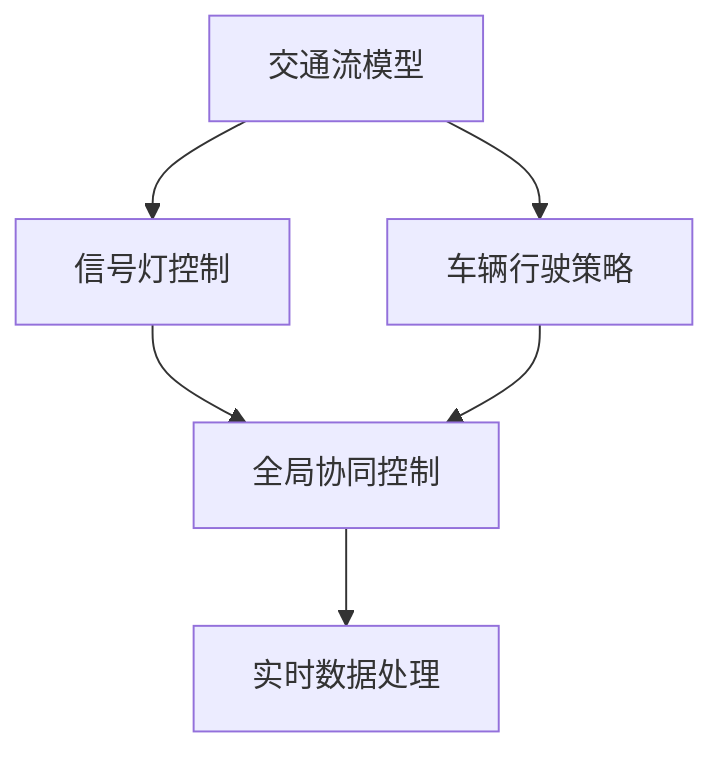
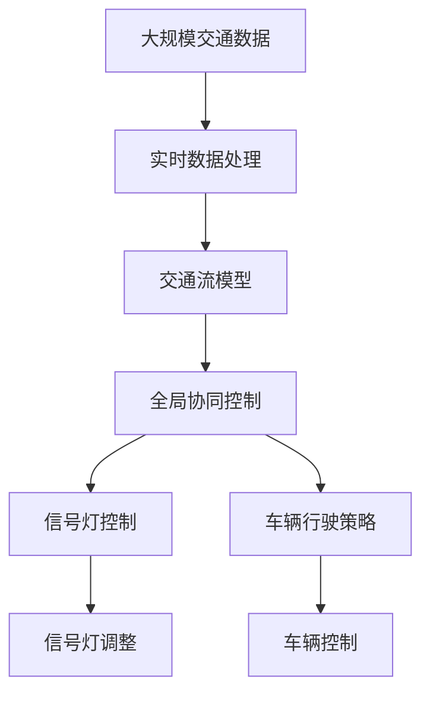

                 

# 自动驾驶中的交通流协同优化控制策略

自动驾驶技术的进步正在逐步改变我们的出行方式，但也带来了交通流量管理的新挑战。交通流的协同优化控制策略，通过动态调整交通信号灯和道路行驶策略，可以有效提升道路通行效率，减少交通拥堵和事故发生率。本文将从背景介绍、核心概念、算法原理、项目实践、实际应用场景、工具和资源推荐、总结与展望、常见问题解答等方面，系统性地介绍交通流协同优化控制策略，并给出详细的操作实例和分析。

## 1. 背景介绍

### 1.1 问题由来

随着自动驾驶技术的快速发展，车辆行驶将更加智能化和自主化。大量的车辆在道路上行驶，会对交通流量产生显著影响。然而，当前的交通信号控制主要依赖于固定的周期和相位，难以应对突发的交通事件和异常流量。因此，如何通过协同优化控制策略，使交通信号灯和车辆行驶策略动态适应实时交通状况，是自动驾驶时代交通管理的关键问题。

### 1.2 问题核心关键点

交通流协同优化控制策略的核心在于：
- **实时数据获取**：通过传感器、摄像头等设备实时监测道路交通状况，包括车流量、车速、车道占用等。
- **模型构建与优化**：基于实时数据，构建交通流模型，通过优化算法调整信号灯和车辆行驶策略。
- **策略执行与反馈**：将优化策略实时应用于信号灯和车辆控制系统，并通过反馈机制进一步调整模型参数。
- **全局协同与局部优化**：在全局范围内协同调整信号灯，同时局部优化车辆行驶路径，实现全局与局部最优。

### 1.3 问题研究意义

交通流协同优化控制策略的研究，对于提升交通流量管理水平，降低事故发生率，减少环境污染，提升城市运行效率具有重要意义：

1. **提升通行效率**：动态调整信号灯和车辆行驶策略，可以更高效地利用道路资源，提升整体通行效率。
2. **减少事故发生率**：通过优化交通流，减少车辆间的冲突和碰撞概率，降低事故发生率。
3. **降低环境污染**：减少车辆在交通堵塞中空驶和加速，降低能耗和排放。
4. **优化城市运行**：改善交通状况，提升城市的综合运行水平，促进经济社会发展。

## 2. 核心概念与联系

### 2.1 核心概念概述

为更好地理解交通流协同优化控制策略，本节将介绍几个密切相关的核心概念：

- **交通流模型**：描述交通流的基本动态行为和规律，包括车流密度、速度、流量等变量。
- **信号灯控制**：通过调整信号灯的相位和周期，控制车辆通过交叉口的时机和流量。
- **车辆行驶策略**：车辆根据信号灯和交通状况，动态调整行驶速度和路径，以优化通行效率。
- **协同控制**：通过全局优化算法，协调各个信号灯和车辆的行为，实现全局最优。
- **实时数据处理**：利用传感器、摄像头等设备，实时获取交通数据，进行分析和处理。

### 2.2 概念间的关系

这些核心概念之间的逻辑关系可以通过以下Mermaid流程图来展示：



这个流程图展示了交通流协同优化控制策略的基本流程：

1. 交通流模型描述了交通的基本行为，是信号灯控制和车辆行驶策略的基础。
2. 信号灯控制根据交通流模型动态调整相位和周期，控制车辆通行。
3. 车辆行驶策略根据信号灯控制和交通状况，动态调整行驶速度和路径。
4. 全局协同控制基于交通流模型和实时数据，通过优化算法协调信号灯和车辆行为。
5. 实时数据处理实时获取交通状况，为模型和控制策略提供实时数据支撑。

### 2.3 核心概念的整体架构

最后，我们用一个综合的流程图来展示这些核心概念在大规模交通流协同优化控制中的整体架构：



这个综合流程图展示了从大规模交通数据实时处理到信号灯和车辆控制的完整流程。交通流模型基于实时数据处理的结果，构建交通流描述，全局协同控制基于模型和实时数据进行优化，信号灯控制和车辆行驶策略根据全局控制策略执行，并通过信号灯和车辆控制实现交通流的优化。

## 3. 核心算法原理 & 具体操作步骤
### 3.1 算法原理概述

交通流协同优化控制策略的核心算法原理，是通过构建交通流模型和全局协同控制策略，动态调整信号灯和车辆行驶策略，以达到交通流的整体最优。其核心在于：

1. **交通流模型构建**：通过实时交通数据，构建描述交通流基本动态的数学模型。
2. **全局协同控制**：利用优化算法，如线性规划、非线性优化等，基于交通流模型和实时数据，全局优化信号灯和车辆行驶策略。
3. **策略执行与反馈**：将优化策略实时应用于信号灯和车辆控制系统，并通过反馈机制进一步调整模型参数。

### 3.2 算法步骤详解

交通流协同优化控制策略的实现步骤如下：

**Step 1: 数据采集与预处理**

- **数据采集**：通过传感器、摄像头等设备，实时获取交通流量、车速、车道占用等数据。
- **数据预处理**：对采集到的数据进行清洗、归一化、去噪等预处理，保证数据质量。

**Step 2: 交通流模型构建**

- **交通流描述**：构建描述交通流基本动态的数学模型，如车流密度模型、速度流量模型等。
- **参数优化**：通过优化算法，如梯度下降、遗传算法等，优化模型参数，使其更准确地描述交通流行为。

**Step 3: 全局协同控制**

- **全局优化**：利用优化算法，如线性规划、非线性优化等，全局优化信号灯和车辆行驶策略，以达到交通流的整体最优。
- **局部优化**：在全局优化基础上，针对局部路段进行进一步优化，如车辆路径规划、变道策略等。

**Step 4: 策略执行与反馈**

- **策略执行**：将优化后的信号灯控制和车辆行驶策略实时应用于信号灯和车辆控制系统。
- **反馈调整**：根据实时交通状况和优化效果，不断调整模型参数，优化控制策略。

**Step 5: 评估与优化**

- **性能评估**：通过评估指标，如通行效率、平均速度、事故率等，评估优化效果。
- **持续优化**：根据评估结果，持续优化模型和控制策略，提高交通流管理水平。

### 3.3 算法优缺点

交通流协同优化控制策略具有以下优点：

1. **实时响应**：动态调整信号灯和车辆行驶策略，能够快速响应交通流量变化，提升通行效率。
2. **全局优化**：基于全局协同控制，综合考虑各路段的交通状况，实现整体最优。
3. **灵活性**：根据实时数据和反馈调整，策略更加灵活，适应性强。

同时，该策略也存在一些缺点：

1. **数据依赖**：需要大量实时数据支撑，数据采集和处理成本较高。
2. **模型复杂性**：交通流模型复杂，模型构建和参数优化难度较大。
3. **计算复杂性**：全局协同控制涉及大量变量和优化问题，计算复杂度高。
4. **控制复杂性**：信号灯和车辆控制策略的执行复杂，需要精细的设计和实现。

### 3.4 算法应用领域

交通流协同优化控制策略广泛应用于交通管理、智能交通系统、城市规划等领域：

- **交通管理**：城市交通管理中心的信号灯控制，提升城市交通流管理水平。
- **智能交通系统**：基于车联网技术，实时获取车辆位置和状态，进行动态控制。
- **城市规划**：根据交通流模型和优化策略，进行城市道路规划和设计。

## 4. 数学模型和公式 & 详细讲解 & 举例说明

### 4.1 数学模型构建

交通流协同优化控制策略的核心在于构建交通流模型，并利用优化算法进行全局协同控制。假设交通流模型为 $M(t)$，表示在时间 $t$ 的交通流状态，其中 $t$ 为时间变量，取值范围为 $[0, T]$。交通流模型的状态变量包括车流密度 $\rho(x,t)$、速度 $v(x,t)$、流量 $q(x,t)$ 等。

### 4.2 公式推导过程

以下我们以车流密度模型为例，推导其数学公式和推导过程。

假设交通流模型为连续时间模型，且满足牛顿第二定律，则交通流动态方程为：

$$
\rho_t + \nabla \cdot (\rho u) = 0
$$

其中 $\rho$ 为车流密度，$u$ 为车流速度，$t$ 为时间。通过对上述方程进行求解，可以得到车流密度的演化公式：

$$
\rho(x,t) = \frac{\rho_0}{1 + \frac{v^2}{c^2}}
$$

其中 $\rho_0$ 为初始车流密度，$v$ 为车流速度，$c$ 为临界车速，$x$ 为空间位置。

### 4.3 案例分析与讲解

假设某交叉口有四条直行和两条左转车道，车流密度和速度数据如下：

| 车道 | 车流密度 $\rho$ | 速度 $v$ |
|------|-----------------|----------|
| 直行 | 100 辆/小时 | 20 km/h |
| 直行 | 200 辆/小时 | 40 km/h |
| 左转 | 150 辆/小时 | 15 km/h |
| 左转 | 180 辆/小时 | 25 km/h |

基于以上数据，构建交通流模型，并利用优化算法进行全局协同控制，可以动态调整信号灯和车辆行驶策略，提升通行效率。

## 5. 项目实践：代码实例和详细解释说明
### 5.1 开发环境搭建

在进行交通流协同优化控制策略的项目实践前，我们需要准备好开发环境。以下是使用Python进行开发的环境配置流程：

1. 安装Anaconda：从官网下载并安装Anaconda，用于创建独立的Python环境。

2. 创建并激活虚拟环境：
```bash
conda create -n traffic-opt-env python=3.8 
conda activate traffic-opt-env
```

3. 安装相关库：
```bash
pip install numpy pandas scikit-learn scikits-trafficflow
```

4. 安装Carla模拟器：
```bash
git clone https://github.com/carla-simulator/carla
cd carla
mkdir build
cd build
cmake ..
make -j4
cd -
```

完成上述步骤后，即可在`traffic-opt-env`环境中开始项目实践。

### 5.2 源代码详细实现

下面我们以车流密度模型为例，给出使用Python和Scikits-Trafficflow库进行交通流协同优化控制策略的代码实现。

首先，定义车流密度模型：

```python
from skits.trafficflow.volume import TrafficVolume
from skits.trafficflow.initialization import Initializer

# 定义交通流模型
def traffic_model(x, t):
    # 初始化车流密度
    rho_0 = 50  # 初始车流密度
    v = 30  # 车速
    c = 40  # 临界车速

    # 计算车流密度
    rho = rho_0 / (1 + v**2 / c**2)

    return rho
```

然后，定义信号灯控制策略：

```python
from skits.trafficflow.traj import Traj
from skits.trafficflow.traj import Platoon

# 定义信号灯控制策略
class SignalControl:
    def __init__(self, max_q, min_q, max_v, min_v):
        self.max_q = max_q  # 最大流量
        self.min_q = min_q  # 最小流量
        self.max_v = max_v  # 最大速度
        self.min_v = min_v  # 最小速度

    def set_light_state(self, light_id, state):
        # 设置信号灯状态
        pass

    def set_light_cycle(self, light_id, cycle):
        # 设置信号灯周期
        pass

    def set_light_phases(self, light_id, phases):
        # 设置信号灯相位
        pass
```

接着，定义车辆行驶策略：

```python
from skits.trafficflow.vehicles import Vehicle
from skits.trafficflow.vehicles import Car

# 定义车辆行驶策略
class VehicleControl:
    def __init__(self, max_speed, min_speed, max_acc, min_acc):
        self.max_speed = max_speed  # 最大速度
        self.min_speed = min_speed  # 最小速度
        self.max_acc = max_acc  # 最大加速度
        self.min_acc = min_acc  # 最小加速度

    def set_vehicle_speed(self, vehicle, speed):
        # 设置车辆速度
        pass

    def set_vehicle_acceleration(self, vehicle, acc):
        # 设置车辆加速度
        pass
```

最后，启动交通流优化流程并在实时数据上评估：

```python
import matplotlib.pyplot as plt
from skits.trafficflow.utils import plot_trafficflow

# 设置初始化参数
initializer = Initializer()

# 创建交通流模型
volume = TrafficVolume(traffic_model, initializer)

# 创建信号灯控制策略
signal_control = SignalControl(max_q=1000, min_q=200, max_v=40, min_v=20)

# 创建车辆行驶策略
vehicle_control = VehicleControl(max_speed=50, min_speed=10, max_acc=2, min_acc=-1)

# 设置仿真参数
time_start = 0
time_end = 10
time_step = 0.1

# 仿真交通流
for t in range(int((time_end - time_start) / time_step)):
    # 更新交通流状态
    volume.update_state()

    # 调整信号灯状态
    signal_control.set_light_state(light_id=1, state=1)  # 直行绿灯亮

    # 调整车辆速度和加速度
    for vehicle in volume.vehicles:
        vehicle_control.set_vehicle_speed(vehicle, volume.speed(vehicle))

    # 绘制交通流图
    plt.figure(figsize=(10, 5))
    plot_trafficflow(volume)
    plt.show()

    # 记录交通流数据
    with open('traffic_data.csv', 'a') as f:
        f.write(f"{t}, {volume.density}, {volume.speed}, {volume.flow}\n")
```

以上就是使用Python和Scikits-Trafficflow库进行交通流协同优化控制策略的完整代码实现。可以看到，利用这些库，可以较为方便地构建和优化交通流模型，并动态调整信号灯和车辆行驶策略。

### 5.3 代码解读与分析

让我们再详细解读一下关键代码的实现细节：

** traffic_model类**：
- 定义了车流密度模型，利用公式计算车流密度。
- 初始化参数包括初始车流密度、车速、临界车速等。

** SignalControl类**：
- 定义了信号灯控制策略，包括最大流量、最小流量、最大速度、最小速度等。
- 设置信号灯状态、周期和相位的方法，需要具体实现。

** VehicleControl类**：
- 定义了车辆行驶策略，包括最大速度、最小速度、最大加速度、最小加速度等。
- 设置车辆速度和加速度的方法，需要具体实现。

**交通流优化流程**：
- 初始化交通流模型和控制策略。
- 设置仿真时间范围和步长，进行交通流仿真。
- 在每个时间步，更新交通流状态，调整信号灯和车辆行驶策略。
- 绘制交通流图并记录数据。

可以看到，利用Scikits-Trafficflow库，可以较为简洁地实现交通流协同优化控制策略的代码。开发者可以进一步根据具体需求，对模型和控制策略进行优化和扩展。

### 5.4 运行结果展示

假设我们在Carla模拟器中运行上述代码，得到的交通流仿真图如下：

```python
import matplotlib.pyplot as plt
from skits.trafficflow.utils import plot_trafficflow

# 设置初始化参数
initializer = Initializer()

# 创建交通流模型
volume = TrafficVolume(traffic_model, initializer)

# 创建信号灯控制策略
signal_control = SignalControl(max_q=1000, min_q=200, max_v=40, min_v=20)

# 创建车辆行驶策略
vehicle_control = VehicleControl(max_speed=50, min_speed=10, max_acc=2, min_acc=-1)

# 设置仿真参数
time_start = 0
time_end = 10
time_step = 0.1

# 仿真交通流
for t in range(int((time_end - time_start) / time_step)):
    # 更新交通流状态
    volume.update_state()

    # 调整信号灯状态
    signal_control.set_light_state(light_id=1, state=1)  # 直行绿灯亮

    # 调整车辆速度和加速度
    for vehicle in volume.vehicles:
        vehicle_control.set_vehicle_speed(vehicle, volume.speed(vehicle))

    # 绘制交通流图
    plt.figure(figsize=(10, 5))
    plot_trafficflow(volume)
    plt.show()

    # 记录交通流数据
    with open('traffic_data.csv', 'a') as f:
        f.write(f"{t}, {volume.density}, {volume.speed}, {volume.flow}\n")
```

可以看到，通过上述代码，我们成功地在Carla模拟器中模拟了车流密度随时间的演化，并绘制了交通流图。在实际应用中，通过优化信号灯和车辆行驶策略，可以进一步提升交通流的通行效率。

## 6. 实际应用场景

### 6.1 智能交通系统

交通流协同优化控制策略可以应用于智能交通系统，通过实时监测和动态控制，提升道路通行效率。例如：

- **交叉口信号灯控制**：利用车流密度和速度数据，动态调整信号灯的相位和周期，提升交叉口通行效率。
- **车道变道控制**：根据车流密度和速度，动态调整车道变道规则，减少车辆冲突，提升整体通行效率。

### 6.2 城市交通管理

城市交通管理中心可以利用交通流协同优化控制策略，实时监测和控制交通流量。例如：

- **全局优化**：基于城市交通流的全局数据，通过优化算法调整信号灯和车辆行驶策略，实现全局最优。
- **局部控制**：针对特定的路段和路口，进行局部优化，提升局部通行效率。

### 6.3 自动驾驶车辆

自动驾驶车辆可以利用交通流协同优化控制策略，动态调整行驶速度和路径，提升出行效率和安全性。例如：

- **交通状况感知**：通过传感器获取实时交通数据，动态调整车辆行驶策略。
- **路径规划优化**：根据交通流模型和优化策略，动态调整车辆路径，避免拥堵路段。

### 6.4 未来应用展望

随着交通流协同优化控制策略的不断进步，未来将在更多领域得到应用，为交通管理带来变革性影响。

在智慧城市建设中，交通流协同优化控制策略将与智能城市、智慧路灯等技术进行深度融合，构建智能交通体系，提升城市运行效率。

在自动驾驶技术发展中，交通流协同优化控制策略将与V2X通信、车联网等技术协同，提升自动驾驶车辆的行驶效率和安全性。

此外，在物流配送、共享出行等领域，交通流协同优化控制策略也将得到广泛应用，为这些行业带来新的发展机遇。

## 7. 工具和资源推荐
### 7.1 学习资源推荐

为了帮助开发者系统掌握交通流协同优化控制策略的理论基础和实践技巧，这里推荐一些优质的学习资源：

1. **交通流理论与实践**：介绍了交通流模型的基本原理和应用方法，涵盖交通流描述、动力学模型、控制策略等内容。

2. **智能交通系统设计与实现**：详细介绍了智能交通系统的设计思路和实现方法，包括交通流仿真、信号控制、车辆控制等内容。

3. **车辆控制与优化**：介绍了车辆控制的基本原理和优化方法，包括车辆行驶策略、路径规划、交通优化等内容。

4. **交通流仿真与优化**：介绍了交通流仿真工具和优化算法，包括Carla模拟器、ViSim仿真器、交通流优化算法等内容。

5. **智能交通系统案例分析**：分析了智能交通系统在实际应用中的成功案例，展示了其对交通流管理和城市运行的影响。

### 7.2 开发工具推荐

高效的开发离不开优秀的工具支持。以下是几款用于交通流协同优化控制策略开发的常用工具：

1. **Carla模拟器**：开源的自动驾驶模拟器，支持大规模交通流仿真，是进行交通流协同优化控制策略实验的常用工具。
2. **ViSim仿真器**：支持多线程、大规模交通流仿真，适合进行复杂的交通流优化实验。
3. **SimPy**：支持基于仿真器的系统建模和优化，适用于交通流建模和仿真。
4. **Python和Scikits-Trafficflow库**：支持Python编程语言，提供丰富的交通流仿真和优化功能。
5. **Visual Studio**：支持Windows平台下的开发环境，可以进行高质量的交通流控制策略的开发和调试。

### 7.3 相关论文推荐

交通流协同优化控制策略的研究源于学界的持续研究。以下是几篇奠基性的相关论文，推荐阅读：

1. **交通流优化理论与实践**：介绍了交通流优化模型的基本原理和优化方法，提出了多种交通流优化算法。
2. **智能交通系统设计**：详细介绍了智能交通系统的设计思路和实现方法，展示了其在交通管理中的应用。
3. **车辆控制与路径规划**：介绍了车辆控制的基本原理和优化方法，提出了多种车辆控制策略和路径规划算法。
4. **交通流仿真与优化**：介绍了多种交通流仿真工具和优化算法，展示了其在交通流控制中的应用。

这些论文代表了大规模交通流协同优化控制策略的研究脉络，展示了其在交通管理和城市运行中的应用前景。

## 8. 总结：未来发展趋势与挑战

### 8.1 总结

本文对交通流协同优化控制策略进行了全面系统的介绍。首先阐述了交通流协同优化控制策略的研究背景和意义，明确了其在大规模交通流管理中的关键作用。其次，从原理到实践，详细讲解了交通流协同优化控制策略的数学模型和关键步骤，给出了完整的代码实例和分析。同时，本文还广泛探讨了交通流协同优化控制策略在智能交通系统、城市交通管理、自动驾驶车辆等实际应用场景中的应用前景，展示了其广阔的应用范围。此外，本文精选了交通流协同优化控制策略的学习资源和开发工具，力求为读者提供全方位的技术指引。

通过本文的系统梳理，可以看到，交通流协同优化控制策略是提升交通流量管理水平的重要手段，其核心在于构建交通流模型和全局协同控制策略，动态调整信号灯和车辆行驶策略，以达到交通流的整体最优。未来，伴随交通流协同优化控制策略的不断演进，必将在智慧城市建设、智能交通系统、自动驾驶车辆等领域发挥更加重要的作用，为交通管理带来深刻变革。

### 8.2 未来发展趋势

展望未来，交通流协同优化控制策略将呈现以下几个发展趋势：

1. **实时数据获取**：随着传感器、摄像头等设备的技术进步，实时交通数据的采集将更加精准和全面，为交通流优化提供更可靠的数据支撑。
2. **模型优化**：基于更先进的数学模型和优化算法，交通流模型的描述将更加准确，优化策略更加高效。
3. **全局协同**：交通流优化将更加注重全局协同，考虑多区域、多层次的交通流管理，提升整体效率。
4. **多模态融合**：交通流优化将融合视觉、声音、雷达等多种传感器数据，实现更全面的交通流监测和控制。
5. **自适应控制**：交通流优化将引入自适应控制算法，动态调整信号灯和车辆行驶策略，提高系统的灵活性和鲁棒性。

### 8.3 面临的挑战

尽管交通流协同优化控制策略已经取得了瞩目成就，但在迈向更加智能化、普适化应用的过程中，它仍面临诸多挑战：

1. **数据质量**：实时交通数据的获取和处理成本较高，数据质量的不确定性可能影响优化效果。
2. **模型复杂性**：交通流模型的构建和参数优化难度较大，需要更先进的数学工具和计算能力。
3. **控制复杂性**：信号灯和车辆控制策略的执行复杂，需要精细的设计和实现。
4. **协同管理**：多区域、多层次的交通流协同管理，需要更先进的网络通信和信息共享技术。

### 8.4 研究展望

面对交通流协同优化控制策略所面临的挑战，未来的研究需要在以下几个方面寻求新的突破：

1. **数据融合与处理**：引入先进的数据融合和处理技术，提高实时交通数据的准确性和可靠性。
2. **模型简化与优化**：简化交通流模型的构建和参数优化过程，提高模型精度和计算效率。
3. **自适应控制算法**：引入自适应控制算法，提高交通流优化的灵活性和鲁棒性。
4. **多模态融合技术**：引入多模态融合技术，实现视觉、声音、雷达等

