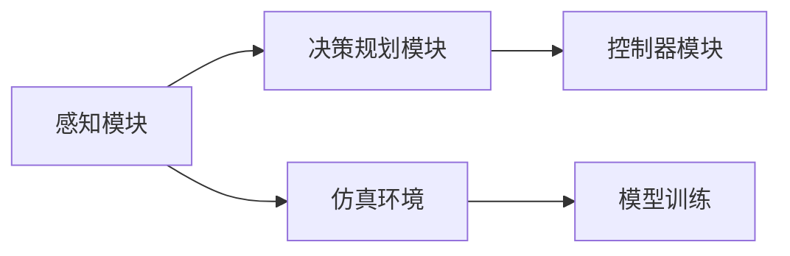

                 

# 自动驾驶中的仿真环境构建

## 1. 背景介绍

自动驾驶是近年来计算机视觉、机器学习、控制理论等领域的热点话题。随着自动驾驶技术的不断发展和普及，如何在复杂多变的环境中安全高效地进行驾驶决策成为了一个巨大的挑战。自动驾驶系统的核心任务之一是环境感知与决策规划，而仿真环境则是实现这一过程的重要工具。

仿真环境是一个高保真的模拟系统，用于模拟自动驾驶车辆在现实世界的行驶场景。通过仿真环境，自动驾驶系统可以在控制台上对不同环境进行测试和验证，避免了现实环境中的高风险和不确定性。仿真环境还可以提供丰富的数据集，为模型的训练和优化提供支持，加速自动驾驶技术的实际部署。

## 2. 核心概念与联系

### 2.1 核心概念概述

1. **自动驾驶系统**：自动驾驶系统是一个集成了感知、决策、控制等多方面的智能系统，能够在无驾驶员干预的情况下完成道路行驶。

2. **仿真环境**：仿真环境是通过计算机模拟的道路场景和交通环境，可以模拟不同天气、时间、交通流量等条件，为自动驾驶系统提供安全的测试平台。

3. **感知模块**：感知模块用于获取车辆周围环境的信息，通常包括摄像头、激光雷达、毫米波雷达等多种传感器。感知模块的性能直接影响自动驾驶系统的决策和控制。

4. **决策规划模块**：决策规划模块根据感知模块获取的信息，结合交通规则、车辆状态等要素，制定行驶策略。决策规划模块的准确性直接关系到自动驾驶系统的安全性。

5. **控制器模块**：控制器模块根据决策规划模块输出的策略，控制车辆的加速、制动、转向等行为，确保车辆按照制定的路径行驶。

6. **模型训练**：在仿真环境中，通过对模型进行训练和优化，提高模型的泛化能力和鲁棒性，使其在实际环境中表现出色。

### 2.2 概念间的关系

自动驾驶系统通过感知模块获取环境信息，决策规划模块基于感知信息制定行驶策略，控制器模块执行策略，完成车辆的精准控制。仿真环境则通过模拟现实世界的环境，为自动驾驶系统的各个模块提供数据和场景支持。模型训练则利用仿真环境的丰富数据集，优化和提升自动驾驶系统的性能。

这些核心概念共同构成了自动驾驶系统的技术框架，仿真环境作为其重要组成部分，确保了系统的安全性、可靠性和有效性。

### 2.3 核心概念的整体架构

以下是一个自动驾驶仿真环境的综合架构图：



这个架构图展示了自动驾驶系统的各个组成部分，以及它们在仿真环境中的互动关系。感知模块通过仿真环境获取真实环境数据，决策规划模块根据数据制定策略，控制器模块执行策略，完成车辆控制。模型训练则在仿真环境中进行，通过数据驱动的方式提升系统性能。

## 3. 核心算法原理 & 具体操作步骤
### 3.1 算法原理概述

自动驾驶仿真环境构建的核心算法原理包括：

1. **环境建模**：通过高保真度的建模技术，构建逼真的虚拟道路、车辆、行人等元素，提供给自动驾驶系统测试。

2. **传感器模拟**：通过模拟各种传感器的工作原理和行为，准确获取车辆周围环境的信息，为感知模块提供数据支持。

3. **动态模拟**：通过动态模拟交通流量、天气变化等环境因素，增加仿真环境的复杂性和多样性，提高自动驾驶系统的鲁棒性。

4. **安全验证**：通过仿真环境进行安全验证，确保自动驾驶系统在各种极端情况下仍能稳定运行。

5. **模型训练**：通过仿真环境提供的数据集，训练和优化自动驾驶系统的感知、决策、控制等模块。

### 3.2 算法步骤详解

以下是一个仿真环境构建的具体步骤：

1. **环境建模**：
   - 收集现实世界的地图和道路数据，包括道路形状、交通标志、路标等。
   - 使用3D建模工具，如Blender、Unity等，构建逼真的虚拟道路、车辆、行人等元素。
   - 对构建的虚拟环境进行着色、光照、纹理等处理，提高仿真环境的逼真度。

2. **传感器模拟**：
   - 模拟各种传感器的行为，如摄像头、激光雷达、毫米波雷达等。
   - 使用计算机视觉和信号处理技术，对传感器数据进行仿真，生成逼真的传感器输出。
   - 对传感器数据进行滤波、校正、增强等处理，提高数据的质量和准确性。

3. **动态模拟**：
   - 模拟交通流量、天气变化等环境因素，增加仿真环境的复杂性和多样性。
   - 使用动态交通模型，模拟车辆、行人的行为，确保仿真环境具有实时性。
   - 对动态模拟的环境进行优化，减少计算资源的消耗。

4. **安全验证**：
   - 在仿真环境中进行自动驾驶系统的测试和验证。
   - 设置各种极端情况，如紧急刹车、障碍物突现、行人横穿等，确保系统在各种情况下仍能稳定运行。
   - 通过仿真环境进行安全验证，发现和修复潜在的安全隐患。

5. **模型训练**：
   - 使用仿真环境提供的数据集，训练和优化自动驾驶系统的感知、决策、控制等模块。
   - 通过仿真环境的多样化数据集，提高模型的泛化能力和鲁棒性。
   - 对模型进行测试和验证，确保模型在实际环境中表现出色。

### 3.3 算法优缺点

**优点**：
1. **安全性高**：仿真环境可以在受控的环境中测试自动驾驶系统，避免了现实环境中的高风险和不确定性。
2. **数据丰富**：仿真环境可以提供大量的训练数据，加速自动驾驶系统的开发和优化。
3. **成本低**：相比于现实环境，仿真环境的构建和维护成本较低。
4. **可控性强**：通过调整仿真环境的各种参数，可以控制和优化测试条件，提高测试的准确性和效率。

**缺点**：
1. **仿真误差**：由于仿真环境的复杂性和多样性，难以完全模拟现实环境中的各种因素，可能导致仿真结果与实际环境存在误差。
2. **计算资源消耗大**：高保真度的仿真环境需要大量的计算资源，可能对硬件设备提出较高要求。
3. **难以完全覆盖**：仿真环境可能无法完全覆盖所有实际环境中的场景，导致某些情况无法进行测试。
4. **模型鲁棒性不足**：由于缺乏实际环境中的复杂性和不确定性，模型在实际环境中的鲁棒性可能不足。

### 3.4 算法应用领域

自动驾驶仿真环境构建在自动驾驶、智能交通、智能制造等领域有广泛的应用。以下是一些具体的应用场景：

1. **自动驾驶测试**：仿真环境提供安全的测试平台，用于自动驾驶系统的测试和验证，确保系统的安全性、可靠性和有效性。
2. **智能交通模拟**：仿真环境可以模拟不同的交通情况，研究交通流优化、交通信号控制等问题，为智能交通系统的开发提供支持。
3. **智能制造模拟**：仿真环境可以模拟工厂中的各种设备和人员，研究生产流程优化、设备维护等问题，为智能制造系统的开发提供支持。
4. **虚拟现实训练**：仿真环境可以用于飞行员、维修人员等职业培训，提高他们的技能和经验。

## 4. 数学模型和公式 & 详细讲解  
### 4.1 数学模型构建

自动驾驶仿真环境的构建涉及多个方面的数学模型，以下是一些核心的数学模型：

1. **传感器模型**：
   - **摄像头模型**：通过成像模型，将摄像头拍摄的图像转换为三维空间中的点云数据。
   - **激光雷达模型**：通过反射模型，计算激光雷达检测到的点云数据。
   - **毫米波雷达模型**：通过传播模型，计算毫米波雷达检测到的目标位置和速度。

2. **交通模拟模型**：
   - **车辆轨迹模型**：通过运动学模型，模拟车辆在道路上的行驶轨迹。
   - **交通流量模型**：通过动力学模型，模拟交通流量的变化规律。
   - **行人行为模型**：通过行为模型，模拟行人在道路上的行为。

3. **安全验证模型**：
   - **紧急刹车模型**：通过动力学模型，计算车辆在紧急刹车时的制动距离。
   - **障碍物突现模型**：通过碰撞模型，计算车辆与障碍物的碰撞结果。
   - **行人横穿模型**：通过行为模型，模拟行人在道路上的横穿行为。

### 4.2 公式推导过程

以车辆轨迹模型为例，推导车辆在道路上的行驶轨迹公式：

$$
\mathbf{x}(t) = \mathbf{x}_0 + \mathbf{v}_0t + \frac{1}{2}\mathbf{a}_0t^2 + \mathbf{r}t + \mathbf{w}(t)
$$

其中，$\mathbf{x}(t)$ 为车辆在时刻 $t$ 的位置，$\mathbf{x}_0$ 为初始位置，$\mathbf{v}_0$ 为初始速度，$\mathbf{a}_0$ 为加速度，$\mathbf{r}$ 为转向角，$\mathbf{w}(t)$ 为随机扰动。

在仿真环境中，通过调整 $\mathbf{v}_0$、$\mathbf{a}_0$、$\mathbf{r}$ 等参数，模拟车辆在不同条件下的行驶轨迹。

### 4.3 案例分析与讲解

以一个简单的仿真环境为例，展示自动驾驶系统的感知、决策、控制等模块的协作过程：

1. **感知模块**：
   - 使用摄像头和激光雷达获取车辆周围环境的信息。
   - 对传感器数据进行预处理，包括滤波、校正、增强等。
   - 将处理后的数据传给决策规划模块。

2. **决策规划模块**：
   - 根据感知模块提供的数据，进行目标检测和识别。
   - 对目标进行分类，如车辆、行人、障碍物等。
   - 结合交通规则和车辆状态，制定行驶策略。
   - 将策略传给控制器模块。

3. **控制器模块**：
   - 根据决策规划模块提供的策略，控制车辆的加速、制动、转向等行为。
   - 通过控制器模块，实现车辆的精准控制。
   - 将控制结果反馈给感知模块，完成闭环控制。

## 5. 项目实践：代码实例和详细解释说明
### 5.1 开发环境搭建

为了搭建一个自动驾驶仿真环境，首先需要准备好开发环境。以下是一些常用的开发环境：

1. **Python**：
   - 使用Python编写仿真环境的代码，支持多种科学计算库和可视化库，如NumPy、Pandas、Matplotlib等。

2. **Unity**：
   - 使用Unity引擎搭建高保真度的仿真环境，支持3D建模和动态模拟。
   - 使用Unity的物理引擎，模拟车辆、行人的行为。

3. **ROS**：
   - 使用ROS（Robot Operating System）搭建自动驾驶系统的测试平台。
   - 使用ROS的传感器模块，模拟摄像头、激光雷达、毫米波雷达等传感器的行为。

4. **TensorFlow**：
   - 使用TensorFlow进行模型训练和优化，支持深度学习模型的构建和部署。

### 5.2 源代码详细实现

以下是一个使用Unity搭建自动驾驶仿真环境的示例代码：

```csharp
using UnityEngine;
using UnityEngine.AI;

public class CarController : MonoBehaviour
{
    private NavMeshAgent agent;
    private bool isForward = true;
    
    void Start()
    {
        agent = GetComponent<NavMeshAgent>();
        agent.destination = transform.position;
        agent.speed = 10;
    }
    
    void Update()
    {
        if (isForward)
        {
            if (agent.remainingDistance < agent.stoppingDistance)
            {
                isForward = false;
                RandomNumberGenerator rng = RandomNumberGenerator.Create();
                int direction = rng.Range(0, 360);
                agent.destination = new Vector3(Mathf.Cos(direction * Mathf.Deg2Rad) * 10, 0, Mathf.Sin(direction * Mathf.Deg2Rad) * 10);
            }
        }
    }
}
```

在这个示例代码中，我们使用Unity的NavMeshAgent组件来实现车辆的路径规划和导航。在Start方法中，初始化导航组件，设置速度和目标位置。在Update方法中，判断车辆是否到达目标位置，如果到达则随机生成下一个目标位置，完成路径规划。

### 5.3 代码解读与分析

以下是对示例代码的详细解读和分析：

1. **NavMeshAgent组件**：
   - 使用NavMeshAgent组件实现车辆的路径规划和导航。
   - 设置导航组件的目标位置和速度，完成车辆的行驶控制。

2. **路径规划算法**：
   - 使用简单的路径规划算法，随机生成下一个目标位置，确保车辆的路径多样化。
   - 可以通过更复杂的路径规划算法，如A*、D*等，实现更精确的路径规划。

3. **动态模拟**：
   - 在Update方法中，通过RandomNumberGenerator组件生成随机数，实现车辆的动态模拟。
   - 动态模拟增加了仿真环境的复杂性和多样性，提高了自动驾驶系统的鲁棒性。

### 5.4 运行结果展示

运行上述代码，可以看到车辆在模拟环境中的动态模拟效果。车辆会根据目标位置自动规划路径，并在目标位置周围随机转向，完成路径规划和动态模拟。

## 6. 实际应用场景

### 6.1 智能交通系统

自动驾驶仿真环境可以用于智能交通系统的开发和测试，研究交通流优化、交通信号控制等问题，为智能交通系统的开发提供支持。通过仿真环境进行安全验证，确保智能交通系统在各种极端情况下仍能稳定运行。

### 6.2 智能制造系统

自动驾驶仿真环境可以用于智能制造系统的开发和测试，研究生产流程优化、设备维护等问题，为智能制造系统的开发提供支持。通过仿真环境进行安全验证，确保智能制造系统在各种情况下仍能稳定运行。

### 6.3 虚拟现实培训

自动驾驶仿真环境可以用于飞行员、维修人员等职业培训，提高他们的技能和经验。通过仿真环境进行安全验证，确保培训过程的安全性和可靠性。

### 6.4 未来应用展望

随着技术的不断发展，自动驾驶仿真环境的应用将更加广泛，包括自动驾驶测试、智能交通模拟、智能制造模拟、虚拟现实培训等领域。未来，自动驾驶仿真环境将向更高的保真度、更复杂的动态模拟、更丰富的数据集方向发展，为自动驾驶技术的实际部署提供更强大的支持。

## 7. 工具和资源推荐
### 7.1 学习资源推荐

为了更好地掌握自动驾驶仿真环境的构建技术，以下是一些优质的学习资源：

1. **《自动驾驶技术手册》**：介绍自动驾驶技术的基本原理和实现方法，涵盖感知、决策、控制等各个方面。
2. **《Unity官方文档》**：Unity引擎的官方文档，包含3D建模、动态模拟、物理引擎等方面的详细教程。
3. **《ROS用户手册》**：ROS操作系统的官方文档，涵盖传感器模块、导航模块、路径规划等方面的详细教程。
4. **《TensorFlow教程》**：TensorFlow深度学习框架的官方教程，涵盖模型训练、优化、部署等方面的详细教程。

### 7.2 开发工具推荐

高效的工具是开发自动驾驶仿真环境的关键，以下是一些常用的开发工具：

1. **Unity**：
   - 使用Unity引擎搭建高保真度的仿真环境，支持3D建模和动态模拟。
   - 支持多种科学计算库和可视化库，如NumPy、Pandas、Matplotlib等。

2. **ROS**：
   - 使用ROS（Robot Operating System）搭建自动驾驶系统的测试平台。
   - 支持多种传感器模块和导航模块，方便自动驾驶系统的测试和验证。

3. **TensorFlow**：
   - 使用TensorFlow进行模型训练和优化，支持深度学习模型的构建和部署。

### 7.3 相关论文推荐

自动驾驶仿真环境的构建涉及多个方面的研究，以下是几篇具有代表性的论文，推荐阅读：

1. **SimDrive: A High-fidelity Simulation-based Training Environment for Autonomous Driving**：介绍了一个高保真度的仿真环境SimDrive，用于自动驾驶系统的测试和验证。

2. **DARPA Urban Challenge Experience: Lessons Learned for Simulation-based Autonomous Vehicle Testing**：分享了DARPA城市挑战赛的经验教训，介绍了仿真环境在自动驾驶系统测试中的重要性。

3. **SimDrive: A High-fidelity Simulation-based Training Environment for Autonomous Driving**：介绍了一个高保真度的仿真环境SimDrive，用于自动驾驶系统的测试和验证。

4. **Simulink and Simulink Car and Vehicle**：介绍了Simulink和Simulink Car and Vehicle在自动驾驶仿真环境构建中的应用。

## 8. 总结：未来发展趋势与挑战
### 8.1 研究成果总结

自动驾驶仿真环境构建技术在近年来取得了显著进展，包括以下几个方面：

1. **高保真度建模**：通过3D建模和动态模拟技术，构建逼真的虚拟道路、车辆、行人等元素，提高了仿真环境的逼真度。
2. **传感器模拟**：通过模拟各种传感器的行为，获取车辆周围环境的信息，为感知模块提供数据支持。
3. **动态模拟**：通过动态模拟交通流量、天气变化等环境因素，增加了仿真环境的复杂性和多样性，提高了自动驾驶系统的鲁棒性。
4. **安全验证**：通过仿真环境进行安全验证，确保自动驾驶系统在各种极端情况下仍能稳定运行。
5. **模型训练**：通过仿真环境提供的数据集，训练和优化自动驾驶系统的感知、决策、控制等模块。

### 8.2 未来发展趋势

未来，自动驾驶仿真环境将呈现以下几个发展趋势：

1. **更高保真度**：通过高保真度的建模技术，构建逼真的虚拟道路、车辆、行人等元素，进一步提高仿真环境的逼真度。
2. **更复杂动态模拟**：通过动态模拟交通流量、天气变化等环境因素，增加仿真环境的复杂性和多样性，提高自动驾驶系统的鲁棒性。
3. **多模态模拟**：通过模拟视觉、听觉、触觉等多种传感器，实现多模态的仿真环境，提高自动驾驶系统的感知能力。
4. **实时性优化**：通过优化仿真环境的计算效率，提高仿真环境的实时性，满足自动驾驶系统的实时性要求。

### 8.3 面临的挑战

尽管自动驾驶仿真环境构建技术已经取得了显著进展，但在实际应用中仍面临一些挑战：

1. **仿真误差**：由于仿真环境的复杂性和多样性，难以完全模拟现实环境中的各种因素，可能导致仿真结果与实际环境存在误差。
2. **计算资源消耗大**：高保真度的仿真环境需要大量的计算资源，可能对硬件设备提出较高要求。
3. **难以完全覆盖**：仿真环境可能无法完全覆盖所有实际环境中的场景，导致某些情况无法进行测试。
4. **模型鲁棒性不足**：由于缺乏实际环境中的复杂性和不确定性，模型在实际环境中的鲁棒性可能不足。

### 8.4 研究展望

未来，自动驾驶仿真环境构建技术需要在以下几个方面进行深入研究：

1. **降低仿真误差**：通过改进仿真环境建模和动态模拟技术，降低仿真误差，提高仿真结果的准确性。
2. **优化计算资源**：通过优化仿真环境的计算效率，提高仿真环境的实时性，满足自动驾驶系统的实时性要求。
3. **全面覆盖场景**：通过增加仿真环境的多样性和复杂性，全面覆盖所有实际环境中的场景，提高自动驾驶系统的测试覆盖率。
4. **增强模型鲁棒性**：通过引入更多实际环境中的复杂性和不确定性，增强仿真环境的鲁棒性，提高模型的泛化能力和鲁棒性。

这些研究方向将推动自动驾驶仿真环境构建技术的发展，为自动驾驶系统的实际部署提供更强大的支持。

