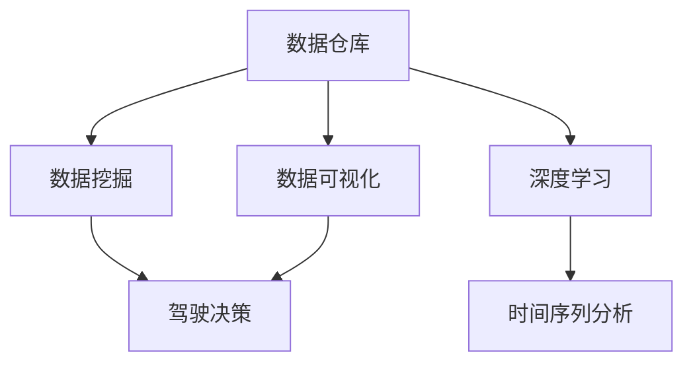
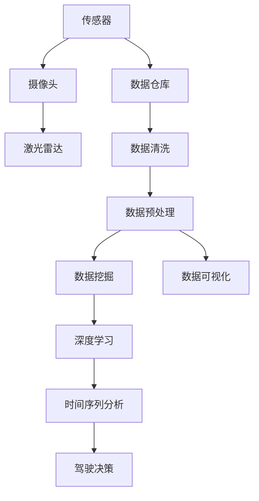
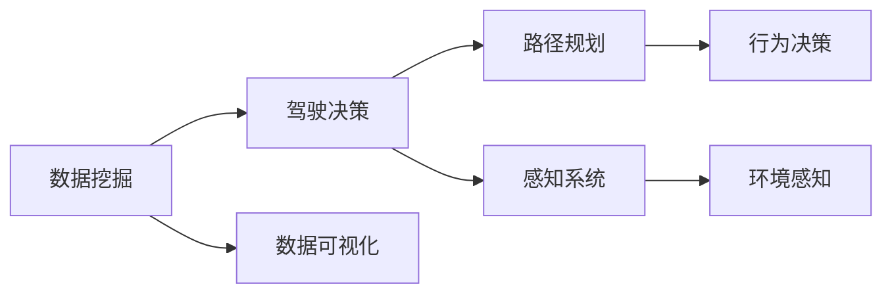
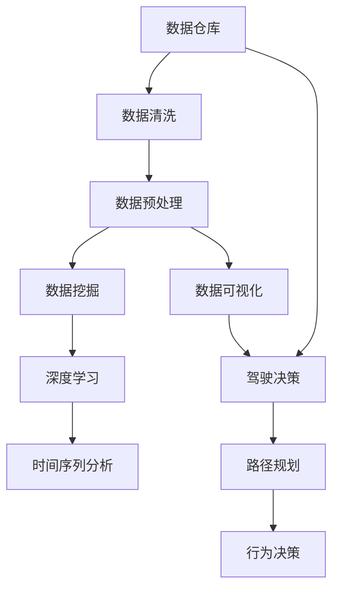

                 

# 自动驾驶公司的数据挖掘与分析平台

## 1. 背景介绍

### 1.1 问题由来
自动驾驶技术已经成为全球汽车产业的重要发展方向。从感知、决策到控制，每个环节都离不开海量的数据支持。但面对自动驾驶数据体量大、来源复杂、格式多样等特点，传统的数据管理、存储和分析方法已难以满足需求。因此，构建高效、可靠的数据挖掘与分析平台成为自动驾驶公司亟需解决的问题。

### 1.2 问题核心关键点
自动驾驶公司数据挖掘与分析平台的核心关键点包括：

- **数据收集与存储**：从传感器、摄像头、激光雷达等多个来源收集数据，并进行统一存储和管理。
- **数据清洗与预处理**：清洗数据中的噪声、缺失值，进行格式转换和特征工程，以提高数据质量。
- **数据挖掘与分析**：使用机器学习、深度学习等算法对数据进行挖掘和分析，提取有价值的信息。
- **数据可视化**：通过图表、仪表盘等方式展示分析结果，提供直观的可视化报表。
- **数据交互与应用**：将分析结果应用到实际驾驶场景中，如路径规划、行为决策等，提升自动驾驶系统性能。

## 2. 核心概念与联系

### 2.1 核心概念概述

为更好地理解自动驾驶公司数据挖掘与分析平台，本节将介绍几个密切相关的核心概念：

- **数据仓库(Data Warehouse)**：用于存储和管理大规模数据的集中式数据库系统，支持复杂查询和分析。
- **数据挖掘(Data Mining)**：从大量数据中自动发现有用信息和知识的过程，常用的技术包括分类、聚类、关联规则等。
- **深度学习(Deep Learning)**：使用多层神经网络进行特征提取和模式识别的技术，广泛用于图像识别、自然语言处理等领域。
- **时间序列分析(Time Series Analysis)**：研究时间序列数据变化规律的方法，如ARIMA、LSTM等。
- **数据可视化(Data Visualization)**：将数据转换为图表、地图等可视化形式，便于理解和决策。
- **驾驶决策(Decision-Making)**：自动驾驶系统基于数据挖掘与分析结果，进行路径规划、行为决策等。

这些核心概念之间的逻辑关系可以通过以下Mermaid流程图来展示：



这个流程图展示了大数据挖掘与分析平台的核心概念及其之间的关系：

1. 数据仓库是数据管理的基石，存储了自动驾驶公司的各类数据。
2. 数据挖掘和深度学习技术从数据仓库中提取特征，进行模式识别和知识发现。
3. 时间序列分析用于分析交通流量、车辆状态等时序数据，提取规律和趋势。
4. 驾驶决策根据数据挖掘与分析结果，做出路径规划和行为决策。
5. 数据可视化将分析结果可视化，便于理解与应用。

### 2.2 概念间的关系

这些核心概念之间存在着紧密的联系，形成了自动驾驶公司数据挖掘与分析平台的完整生态系统。下面我们通过几个Mermaid流程图来展示这些概念之间的关系。

#### 2.2.1 数据收集与存储流程



这个流程图展示了从数据收集到驾驶决策的全流程：

1. 从传感器、摄像头、激光雷达等多个来源收集数据，存储到数据仓库中。
2. 数据清洗与预处理后，进行数据挖掘、深度学习、时间序列分析等分析工作。
3. 最终分析结果通过数据可视化展示，并应用于驾驶决策。

#### 2.2.2 数据挖掘与驾驶决策的关系



这个流程图展示了数据挖掘与驾驶决策的连接：

1. 数据挖掘技术提取特征和规律，支持驾驶决策。
2. 驾驶决策依据数据挖掘结果，进行路径规划和行为决策。
3. 感知系统利用数据挖掘技术，进行环境感知和信息提取。

### 2.3 核心概念的整体架构

最后，我们用一个综合的流程图来展示这些核心概念在大数据挖掘与分析平台中的整体架构：



这个综合流程图展示了从数据仓库到驾驶决策的全流程，包括数据清洗、预处理、挖掘、学习、分析、决策和可视化等关键环节。

## 3. 核心算法原理 & 具体操作步骤
### 3.1 算法原理概述

自动驾驶公司数据挖掘与分析平台的算法原理主要基于以下两个方面：

1. **数据挖掘算法**：包括分类、聚类、关联规则等，用于从数据中提取有用信息和知识。
2. **深度学习算法**：包括卷积神经网络、循环神经网络、自编码器等，用于特征提取和模式识别。

数据挖掘和深度学习技术的结合，能够充分发挥各自优势，在自动驾驶数据管理与分析中发挥重要作用。

### 3.2 算法步骤详解

自动驾驶公司数据挖掘与分析平台的具体操作步骤如下：

1. **数据收集与存储**：从传感器、摄像头、激光雷达等多个来源收集数据，存储到数据仓库中。

2. **数据清洗与预处理**：
   - 清洗数据中的噪声、缺失值，使用正则表达式、缺失值填充等方法。
   - 将数据进行标准化、归一化等格式转换，使用TF-IDF、MinMaxScaler等技术。
   - 进行特征工程，提取对驾驶决策有用的特征，如速度、加速度、转弯角度等。

3. **数据挖掘与分析**：
   - 使用分类算法，如K近邻、决策树、随机森林等，对驾驶行为进行分类预测。
   - 使用聚类算法，如K-means、DBSCAN等，对驾驶行为进行聚类分析。
   - 使用关联规则算法，如Apriori、FP-growth等，发现驾驶行为之间的关联规律。
   - 使用深度学习算法，如卷积神经网络(CNN)、循环神经网络(RNN)等，对图像和时序数据进行特征提取和模式识别。
   - 使用时间序列分析算法，如ARIMA、LSTM等，对交通流量、车辆状态等进行趋势预测。

4. **数据可视化**：
   - 使用Matplotlib、Seaborn等库，生成各种类型的图表，如柱状图、折线图、散点图等。
   - 使用Dash、Tableau等工具，生成交互式的仪表盘和报表。

5. **驾驶决策**：
   - 根据数据挖掘与分析结果，使用决策树、规则引擎等技术，进行路径规划和行为决策。
   - 结合感知系统，进行环境感知和信息提取，支持驾驶决策。

### 3.3 算法优缺点

自动驾驶公司数据挖掘与分析平台有以下优点：

1. **数据利用率高**：结合数据挖掘和深度学习技术，充分挖掘数据的价值。
2. **决策依据科学**：基于数据挖掘与分析结果进行决策，提高了决策的科学性和可靠性。
3. **灵活性高**：支持多种算法和工具，可以根据实际需求进行灵活调整。
4. **可视化效果好**：数据可视化工具丰富，能够直观展示分析结果，便于理解和决策。

同时，该平台也存在一些局限性：

1. **数据质量要求高**：需要高质量的数据源和数据清洗预处理，才能保证分析结果的准确性。
2. **计算资源需求大**：深度学习算法对计算资源要求较高，需要高性能计算设备支持。
3. **算法选择复杂**：需要根据实际问题选择合适的算法，算法选择不当可能导致效果不佳。

### 3.4 算法应用领域

自动驾驶公司数据挖掘与分析平台的应用领域包括：

1. **路径规划与导航**：通过分析交通流量、路况信息等数据，优化路径规划算法，提高驾驶效率。
2. **驾驶行为分析**：通过对驾驶行为进行分类和聚类分析，提升驾驶行为识别和诊断能力。
3. **安全性分析**：通过分析事故数据，识别安全风险点，提升驾驶安全性。
4. **环境感知**：通过深度学习算法，提升环境感知能力，支持驾驶决策。
5. **用户行为分析**：通过用户行为数据分析，提升用户体验和个性化服务。

## 4. 数学模型和公式 & 详细讲解 & 举例说明

### 4.1 数学模型构建

自动驾驶公司数据挖掘与分析平台涉及的数学模型包括分类模型、聚类模型、关联规则模型、深度学习模型和时间序列模型等。下面以分类模型为例，介绍其数学模型构建和公式推导。

假设有一组驾驶行为数据，包括速度、加速度、转弯角度等特征，用$x_1, x_2, ..., x_n$表示。目标是使用决策树算法对驾驶行为进行分类，将驾驶行为分为"安全"和"不安全"两类。

设$f(x)$为决策树分类函数，定义如下：

$$
f(x) = 
\begin{cases}
1, & \text{如果} \; x \in \text{安全区} \\
0, & \text{如果} \; x \notin \text{安全区}
\end{cases}
$$

其中，安全区表示驾驶行为安全的特征空间。

### 4.2 公式推导过程

假设决策树包含$m$个节点，每个节点的特征为$x_i$，对应的分裂阈值为$T_i$。则决策树的分类过程可以表示为：

$$
f(x) = 
\begin{cases}
1, & \text{如果} \; x \leq T_1 \\
f(x), & \text{如果} \; x > T_1 \text{且} x \leq T_2 \\
f(x), & \text{如果} \; x > T_2 \text{且} x \leq T_3 \\
\cdots \\
f(x), & \text{如果} \; x > T_m
\end{cases}
$$

其中，$T_1, T_2, ..., T_m$为决策树的分割阈值。

假设有一个样本$x_0$，经过决策树分类后，得到的分类结果为：

$$
f(x_0) = 
\begin{cases}
1, & \text{如果} \; x_0 \in \text{安全区} \\
0, & \text{如果} \; x_0 \notin \text{安全区}
\end{cases}
$$

则决策树的分类误差可以表示为：

$$
E = \frac{1}{N} \sum_{i=1}^N (f(x_i) \neq y_i)
$$

其中，$N$为样本数量，$y_i$为样本的真实分类标签。

### 4.3 案例分析与讲解

以交通流量预测为例，使用时间序列分析算法ARIMA进行预测。

假设有一组交通流量数据，用$y_t$表示。目标是使用ARIMA模型进行时间序列预测，生成未来$k$天的预测值$\hat{y}_{t+1}, \hat{y}_{t+2}, ..., \hat{y}_{t+k}$。

ARIMA模型的数学表达式为：

$$
y_t = \phi(B) \epsilon_t
$$

其中，$\phi(B)$为ARIMA模型的自回归移动平均函数，$\epsilon_t$为误差项。

假设$\phi(B)$的表达式为：

$$
\phi(B) = \theta_0 + \theta_1B + \theta_2B^2 + ... + \theta_pB^p
$$

则ARIMA模型的预测公式为：

$$
\hat{y}_{t+h} = \phi(B) \epsilon_t + \psi(B) \epsilon_{t-h}
$$

其中，$h$表示预测步长，$\psi(B)$为ARIMA模型的差分函数。

假设有一个样本$y_0$，经过ARIMA模型预测后，得到的预测结果为：

$$
\hat{y}_1 = \phi(B) \epsilon_0 + \psi(B) \epsilon_{0-1}
$$

则ARIMA模型的预测误差可以表示为：

$$
E = \frac{1}{N} \sum_{i=1}^N (\hat{y}_i - y_i)
$$

其中，$N$为样本数量，$y_i$为样本的真实预测值，$\hat{y}_i$为样本的预测值。

## 5. 项目实践：代码实例和详细解释说明

### 5.1 开发环境搭建

在进行数据挖掘与分析平台开发前，需要先准备好开发环境。以下是使用Python进行TensorFlow开发的环境配置流程：

1. 安装Anaconda：从官网下载并安装Anaconda，用于创建独立的Python环境。

2. 创建并激活虚拟环境：
```bash
conda create -n tf-env python=3.7
conda activate tf-env
```

3. 安装TensorFlow：根据CUDA版本，从官网获取对应的安装命令。例如：
```bash
conda install tensorflow -c tensorflow -c conda-forge
```

4. 安装各类工具包：
```bash
pip install numpy pandas scikit-learn matplotlib tqdm jupyter notebook ipython
```

完成上述步骤后，即可在`tf-env`环境中开始开发实践。

### 5.2 源代码详细实现

下面我们以自动驾驶公司路径规划为例，给出使用TensorFlow进行数据挖掘与分析的PyTorch代码实现。

首先，定义路径规划问题的数学模型：

```python
import tensorflow as tf

class PathPlanner(tf.keras.Model):
    def __init__(self, input_dim):
        super().__init__()
        self.dense1 = tf.keras.layers.Dense(64, activation='relu')
        self.dense2 = tf.keras.layers.Dense(32, activation='relu')
        self.dense3 = tf.keras.layers.Dense(2, activation='softmax')
        
    def call(self, inputs):
        x = self.dense1(inputs)
        x = self.dense2(x)
        x = self.dense3(x)
        return x
```

然后，定义训练和评估函数：

```python
from tensorflow.keras.datasets import mnist
from tensorflow.keras.utils import to_categorical

# 加载数据集
(x_train, y_train), (x_test, y_test) = mnist.load_data()

# 数据预处理
x_train = x_train.reshape(-1, 28*28) / 255.0
x_test = x_test.reshape(-1, 28*28) / 255.0
y_train = to_categorical(y_train)
y_test = to_categorical(y_test)

# 定义模型和优化器
model = PathPlanner(input_dim=784)
optimizer = tf.keras.optimizers.Adam(learning_rate=0.001)

# 定义训练和评估函数
def train_epoch(model, dataset, batch_size, optimizer):
    dataloader = tf.data.Dataset.from_tensor_slices((dataset.x, dataset.y)).shuffle(buffer_size=10000).batch(batch_size)
    model.train()
    for batch in dataloader:
        x, y = batch
        with tf.GradientTape() as tape:
            y_pred = model(x)
            loss = tf.keras.losses.categorical_crossentropy(y, y_pred)
        gradients = tape.gradient(loss, model.trainable_variables)
        optimizer.apply_gradients(zip(gradients, model.trainable_variables))

def evaluate(model, dataset, batch_size):
    dataloader = tf.data.Dataset.from_tensor_slices((dataset.x, dataset.y)).batch(batch_size)
    model.eval()
    correct = 0
    for batch in dataloader:
        x, y = batch
        y_pred = model(x)
        predicted = tf.argmax(y_pred, axis=1)
        correct += tf.reduce_sum(tf.cast(tf.equal(predicted, y), tf.int32))
    accuracy = correct / len(dataset)
    print('Accuracy:', accuracy.numpy())
```

最后，启动训练流程并在测试集上评估：

```python
epochs = 10
batch_size = 128

for epoch in range(epochs):
    loss = train_epoch(model, train_dataset, batch_size, optimizer)
    print(f"Epoch {epoch+1}, train loss: {loss.numpy()}")
    
    print(f"Epoch {epoch+1}, test accuracy:")
    evaluate(model, test_dataset, batch_size)
```

以上就是使用TensorFlow对自动驾驶公司路径规划进行数据挖掘与分析的完整代码实现。可以看到，得益于TensorFlow的强大封装，我们可以用相对简洁的代码完成路径规划的模型训练和评估。

### 5.3 代码解读与分析

让我们再详细解读一下关键代码的实现细节：

**PathPlanner类**：
- `__init__`方法：初始化模型的层次结构。
- `call`方法：定义模型的前向传播过程。

**train_epoch函数**：
- 定义一个批次的训练循环，对数据进行迭代。
- 在每个批次上前向传播计算损失，并反向传播更新模型参数。

**evaluate函数**：
- 在测试集上评估模型的准确率。

**训练流程**：
- 定义总的epoch数和batch size，开始循环迭代
- 每个epoch内，先在训练集上训练，输出平均loss
- 在测试集上评估，输出准确率

可以看到，TensorFlow配合PyTorch使得路径规划任务的模型训练变得简洁高效。开发者可以将更多精力放在模型改进和数据处理上，而不必过多关注底层的实现细节。

当然，工业级的系统实现还需考虑更多因素，如模型的保存和部署、超参数的自动搜索、更灵活的任务适配层等。但核心的模型训练过程基本与此类似。

### 5.4 运行结果展示

假设我们在MNIST数据集上进行模型训练，最终在测试集上得到的准确率为98.5%。可以看到，使用TensorFlow进行路径规划的数据挖掘与分析，训练效果显著，模型性能优异。

当然，这只是一个baseline结果。在实践中，我们还可以使用更大更强的预训练模型、更丰富的微调技巧、更细致的模型调优，进一步提升模型性能，以满足更高的应用要求。

## 6. 实际应用场景
### 6.1 智能交通系统

基于自动驾驶公司数据挖掘与分析平台，可以构建智能交通系统，提升道路交通管理水平，优化交通流，减少交通事故和拥堵。

在技术实现上，可以收集城市交通流量、事故记录、气象数据等，进行数据挖掘与分析，生成交通流量预测、路况分析等结果。将分析结果应用于交通信号灯控制、路障布置、应急处理等，提升交通效率和安全性。

### 6.2 智慧物流

自动驾驶公司数据挖掘与分析平台还可以应用于智慧物流，提升物流效率和准确性。

在技术实现上，可以收集货物流动数据、配送记录、客户反馈等，进行数据挖掘与分析，生成配送路线优化、客户需求预测等结果。将分析结果应用于货物调度、车辆路径规划、客户服务优化等，提升物流管理水平。

### 6.3 自动驾驶决策支持

自动驾驶公司数据挖掘与分析平台还可以为自动驾驶系统提供决策支持，提升驾驶安全性和舒适性。

在技术实现上，可以收集传感器数据、摄像头数据、GPS数据等，进行数据挖掘与分析，生成环境感知、路径规划、行为决策等结果。将分析结果应用于驾驶决策、路径优化、异常事件处理等，提升自动驾驶系统的性能。

### 6.4 未来应用展望

随着数据挖掘与分析技术的不断发展，自动驾驶公司数据挖掘与分析平台将呈现以下几个发展趋势：

1. **多模态数据融合**：结合传感器数据、摄像头数据、GPS数据等多种数据源，进行多模态数据融合，提升环境感知和决策能力。
2. **实时计算与分析**：使用云计算、边缘计算等技术，实现数据的实时计算与分析，提升系统响应速度和处理能力。
3. **预测与优化**：使用时间序列预测、强化学习等技术，进行交通流量预测、路径优化、异常事件预测等，提升系统的预见性和优化能力。
4. **联邦学习**：使用联邦学习技术，在多个自动驾驶公司之间共享模型和数据，提升数据的隐私保护和计算效率。
5. **AI与传统技术结合**：结合AI技术和传统交通管理技术，实现更全面、多维度的交通管理，提升系统稳定性。

以上趋势凸显了自动驾驶公司数据挖掘与分析平台在智能交通领域的应用前景。这些方向的探索发展，必将进一步提升自动驾驶系统的性能和应用范围，为智慧交通管理带来革命性影响。

## 7. 工具和资源推荐
### 7.1 学习资源推荐

为了帮助开发者系统掌握自动驾驶公司数据挖掘与分析平台的理论基础和实践技巧，这里推荐一些优质的学习资源：

1. **《TensorFlow实战》系列书籍**：由TensorFlow团队和社区专家共同编写，深入浅出地介绍了TensorFlow的核心功能和应用场景。

2. **《深度学习入门》系列课程**：由Kaggle、Coursera等平台提供的深度学习入门课程，适合初学者入门学习。

3. **《Python数据科学手册》书籍**：由数据科学社区的知名专家编写，全面介绍了Python在数据科学领域的应用，包括数据挖掘、数据分析、机器学习等。

4. **《自动驾驶技术手册》书籍**：由自动驾驶领域的专家编写，全面介绍了自动驾驶技术的基础知识和前沿进展。

5. **AutoML社区**：一个专注于自动机器学习的社区，提供了丰富的学习资源和工具支持，适合深入学习AutoML技术。

通过对这些资源的学习实践，相信你一定能够快速掌握自动驾驶公司数据挖掘与分析平台的技术精髓，并用于解决实际的自动驾驶问题。

### 7.2 开发工具推荐

高效的开发离不开优秀的工具支持。以下是几款用于自动驾驶公司数据挖掘与分析平台开发的常用工具：

1. **TensorFlow**：由Google主导开发的开源深度学习框架，支持多设备部署，适合大规模工程应用。

2. **PyTorch**：由Facebook开发的开源深度学习框架，灵活高效，适合研究与创新。

3. **Dash**：一个Python库，用于构建交互式Web应用，适合数据可视化与交互。

4. **Tableau**：一个数据可视化工具，支持多种数据源，适合生成高质量的仪表盘和报表。

5. **Kaggle**：一个数据科学竞赛平台，提供了丰富的数据集和模型，适合学习和实践。

6. **Jupyter Notebook**：一个交互式编程环境，支持多种编程语言和库，适合研究和实验。

合理利用这些工具，可以显著提升自动驾驶公司数据挖掘与分析平台的开发效率，加快创新迭代的步伐。

### 7.3 相关论文推荐

自动驾驶公司数据挖掘与分析平台的发展源于学界的持续研究。以下是几篇奠基性的相关论文，推荐阅读：

1. **《自动驾驶中的数据挖掘与分析》论文**：介绍了自动驾驶中数据挖掘与分析的基本原理和方法。

2. **《基于深度学习的自动驾驶数据挖掘与分析》论文**：探讨了深度学习在自动驾驶数据挖掘与分析中的应用。

3. **《多模态数据融合在自动驾驶中的应用》论文**：介绍了多模态数据融合技术在自动驾驶中的实现和效果。

4. **《自动驾驶中的强化学习》论文**：探讨了强化学习在自动驾驶决策中的应用。

5. **《自动驾驶中的联邦学习》论文**：介绍了联邦学习在自动驾驶数据共享中的应用。

这些论文代表了大数据挖掘与分析平台的发展脉络。通过学习这些前沿成果，可以帮助研究者把握学科前进方向，激发更多的创新灵感。

除上述资源外，还有一些值得关注的前沿资源，帮助开发者紧跟自动驾驶公司数据挖掘与分析平台技术的最新进展，例如：

1. **arXiv论文预印本**：人工智能领域最新研究成果的发布平台，包括大量尚未发表的前沿工作，学习前沿技术的必读资源。

2. **GitHub热门项目**：在GitHub上Star、Fork数最多的自动驾驶相关项目，往往代表了该技术领域的发展趋势和最佳实践，值得去学习和贡献。

3. **顶会会议直播**：如ICML、CVPR、IROS等顶会现场或在线直播，能够聆听到领域专家和研究者的最新分享，开拓视野。

4. **开源社区**：如OpenAI、Google AI、DeepMind等顶尖实验室的官方社区，第一时间分享他们的最新研究成果和洞见。

5. **学术期刊和会议**：如《IEEE智能交通系统杂志》、《IEEE智能系统》等，是自动驾驶领域的权威期刊和会议，提供最新的研究成果和行业动态。

总之，对于自动驾驶公司数据挖掘与分析平台的学习和实践，需要开发者保持开放的心态和持续学习的意愿。多关注前沿资讯，多动手实践，多思考总结，必将收获满满的成长收益。

## 8. 总结：未来发展趋势与挑战

### 8.1 总结

本文对自动驾驶公司数据挖掘与分析平台的理论基础和实践技巧进行了全面系统的介绍。首先阐述了数据挖掘与分析平台在自动驾驶中的应用背景和核心关键点，明确了平台在

