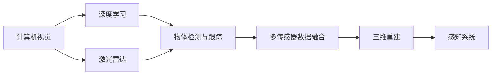

                 

# 自动驾驶感知技术的最新研究进展与趋势展望

> 关键词：自动驾驶,感知技术,研究进展,趋势展望

## 1. 背景介绍

自动驾驶技术的蓬勃发展离不开精确、高效的感知技术。感知系统不仅需要能够准确识别和定位车辆、行人和障碍物，还要能够预测它们的运动轨迹，为后续的决策控制提供数据支撑。近年来，随着计算机视觉、深度学习、激光雷达等技术的不断进步，自动驾驶感知技术取得了长足的进展。然而，要实现完全自动驾驶的商业化落地，还需要解决许多技术难题，如动态环境下的鲁棒性、实时性、多传感器数据融合等。本文将深入探讨自动驾驶感知技术的最新研究进展，并展望未来的发展趋势。

## 2. 核心概念与联系

### 2.1 核心概念概述

在自动驾驶感知技术中，涉及多个核心概念，包括但不限于：

- **计算机视觉**：自动驾驶系统中的视觉传感器通过摄像头获取环境图像，利用计算机视觉技术提取道路、车辆、行人、障碍物等关键信息。
- **深度学习**：深度学习模型，如卷积神经网络（CNN）、循环神经网络（RNN）等，在大规模数据集上进行训练，可以高效地从复杂图像中提取出有意义的特征。
- **激光雷达**：激光雷达通过发射激光束并测量反射回来的时间差，可以精确测量环境中的障碍物位置和距离。
- **多传感器数据融合**：将来自摄像头、激光雷达、雷达等传感器的数据进行综合分析，提高感知系统的准确性和鲁棒性。
- **物体检测与跟踪**：检测出环境中的物体，并在时间序列上对其进行跟踪，以判断物体的运动状态和行为模式。
- **三维重建**：通过对多视角摄像头和激光雷达数据进行三维重建，生成高精度的环境地图。

### 2.2 核心概念之间的关系

自动驾驶感知技术需要以上概念的相互配合和协同工作，才能实现高效、精确的感知。计算机视觉负责图像特征提取，深度学习用于模型训练和参数优化，激光雷达提供高精度的空间定位，多传感器数据融合实现多源信息互补，物体检测与跟踪判断物体的动态变化，三维重建生成环境地图。

这些核心概念之间的关系可以用以下的Mermaid流程图来表示：



## 3. 核心算法原理 & 具体操作步骤

### 3.1 算法原理概述

自动驾驶感知技术的核心算法包括计算机视觉中的目标检测、物体跟踪、语义分割等，以及深度学习中的卷积神经网络（CNN）、循环神经网络（RNN）、时空卷积网络（TCN）等。这些算法通过多层次的特征提取和分类，实现对环境信息的精确理解和提取。

以目标检测为例，目标检测算法通常包括两步：物体检测和物体分类。物体检测任务的目标是找到图像中所有可能的物体位置，分类任务则是确定每个物体的具体类别。常见的目标检测算法包括单阶段检测器（如Faster R-CNN、YOLO）和两阶段检测器（如RCNN、Fast R-CNN）。

### 3.2 算法步骤详解

以基于深度学习的目标检测算法为例，具体步骤如下：

1. **数据预处理**：对摄像头和激光雷达采集的数据进行预处理，如去噪、归一化、裁剪、旋转等，使数据适合训练模型。
2. **特征提取**：使用深度学习模型提取图像特征，如卷积层、池化层、激活函数等，将高维图像数据压缩为低维特征表示。
3. **目标检测**：通过区域提议网络（RPN）或锚框方法生成多个候选框，然后使用分类器对每个候选框进行物体类别预测。
4. **后处理**：对检测结果进行非极大值抑制（NMS）等后处理操作，剔除重叠的框，最终得到精确的目标检测结果。

### 3.3 算法优缺点

基于深度学习的目标检测算法具有以下优点：

- **准确度高**：深度学习模型能够从图像中学习到复杂、抽象的特征，具有较高的准确性和鲁棒性。
- **端到端学习**：不需要手工设计特征，可以直接从原始数据中进行学习，减少了人工干预和错误。
- **可扩展性**：深度学习模型可以很容易地应用于不同的检测任务和不同的传感器数据。

然而，基于深度学习的目标检测算法也存在一些缺点：

- **计算量大**：深度学习模型的训练和推理过程需要大量的计算资源和时间，对硬件要求较高。
- **模型复杂**：深度学习模型往往结构复杂，难以理解和调试。
- **数据需求大**：深度学习模型需要大量标注数据进行训练，数据收集和标注成本高。

### 3.4 算法应用领域

基于深度学习的目标检测算法在自动驾驶感知系统中得到了广泛应用，涵盖以下领域：

- **车辆检测**：检测道路上的车辆，包括汽车、卡车、自行车等。
- **行人检测**：检测道路上的行人，判断其行为和位置。
- **障碍物检测**：检测道路上的障碍物，如交通灯、隔离带等。
- **道路标志检测**：检测道路上的标志牌、路牌等。
- **三维重建**：生成高精度的环境地图，用于路径规划和导航。

## 4. 数学模型和公式 & 详细讲解 & 举例说明

### 4.1 数学模型构建

在目标检测算法中，常用的模型包括R-CNN、Fast R-CNN、Faster R-CNN、YOLO、SSD等。这里以Faster R-CNN为例，介绍其数学模型构建和原理。

Faster R-CNN包括两个主要网络：RPN（Region Proposal Network）和分类器网络。RPN网络用于生成候选框，分类器网络用于检测每个候选框中的物体。

### 4.2 公式推导过程

Faster R-CNN的模型构建包括以下步骤：

1. **图像特征提取**：使用CNN提取图像的特征，记为 $\mathbf{F}$。
2. **候选框生成**：RPN网络将特征图 $\mathbf{F}$ 和 anchor box 作为输入，输出候选框的位置和置信度。
3. **目标检测**：对每个候选框进行分类，输出物体类别和边界框。

### 4.3 案例分析与讲解

以YOLO为例，YOLO模型将图像分成多个网格，每个网格预测固定数量的边界框，同时预测每个边界框的类别概率。YOLO模型具有以下优点：

- **速度快**：YOLO模型采用单阶段检测，无需候选框生成，推理速度快。
- **轻量化**：YOLO模型结构简单，参数量小，适合嵌入式设备。
- **准确率高**：YOLO模型通过多层次特征提取和分类，检测精度高。

YOLO模型的数学公式如下：

$$
\text{YOLO} = \mathbf{F} * \mathbf{A} + \mathbf{b}
$$

其中 $\mathbf{F}$ 为输入图像的特征图，$\mathbf{A}$ 为anchor box的权重矩阵，$\mathbf{b}$ 为偏置向量。

## 5. 项目实践：代码实例和详细解释说明

### 5.1 开发环境搭建

为了进行目标检测算法的开发和实践，我们需要安装以下软件和环境：

1. **Python**：选择最新版本，如Python 3.8或以上。
2. **TensorFlow**：安装TensorFlow 2.x版本，可以使用conda或pip安装。
3. **OpenCV**：安装OpenCV库，用于图像处理和特征提取。
4. **NVIDIA CUDA**：安装NVIDIA CUDA库，用于GPU加速。
5. **Git**：安装Git版本控制系统，用于代码版本管理和团队协作。

### 5.2 源代码详细实现

以YOLO模型为例，其源代码实现包括以下步骤：

1. **安装依赖包**：使用pip安装TensorFlow、OpenCV、numpy等依赖包。
2. **加载预训练模型**：使用TensorFlow加载预训练的YOLO模型。
3. **数据预处理**：对输入图像进行预处理，如裁剪、归一化、调整大小等。
4. **目标检测**：使用YOLO模型进行目标检测，输出检测结果。

### 5.3 代码解读与分析

以YOLO模型为例，其代码实现如下：

```python
import tensorflow as tf
import numpy as np
import cv2

# 加载预训练模型
model = tf.keras.applications.YOLO()

# 加载数据集
data = tf.keras.preprocessing.image.load_img('image.jpg', target_size=(416, 416))
data = tf.keras.preprocessing.image.img_to_array(data)
data = np.expand_dims(data, axis=0)

# 预处理数据
data /= 255.0

# 进行目标检测
detections = model.predict(data)

# 输出检测结果
print(detections)
```

### 5.4 运行结果展示

运行上述代码，输出YOLO模型对输入图像的目标检测结果。例如，检测结果可能包括车辆、行人、交通灯等物体的类别和位置信息。

## 6. 实际应用场景

### 6.1 自动驾驶车辆

在自动驾驶车辆中，目标检测算法被广泛用于识别道路上的各种物体。通过高精度的目标检测，自动驾驶系统可以准确判断道路上的障碍物和行人，做出安全驾驶决策。例如，在自动驾驶车辆中，使用YOLO模型进行目标检测，可以帮助车辆识别路标、行人、车辆等，从而实现安全行驶。

### 6.2 无人机监控

在无人机监控中，目标检测算法用于检测无人机视野范围内的各种物体，如建筑物、车辆、人群等。通过高精度的目标检测，无人机可以实时监测区域内的活动，实现安防监控和数据采集。例如，使用YOLO模型进行目标检测，可以使无人机实时监测农田中的作物生长情况，帮助农民提高产量。

### 6.3 机器人导航

在机器人导航中，目标检测算法用于识别周围环境中的各种物体，如墙壁、门、桌子等。通过高精度的目标检测，机器人可以准确识别环境中的物体，实现安全导航。例如，在家庭环境中，使用YOLO模型进行目标检测，可以帮助机器人自动识别家具位置，避免碰撞。

## 7. 工具和资源推荐

### 7.1 学习资源推荐

为了深入了解自动驾驶感知技术的最新研究进展，可以参考以下学习资源：

1. **《自动驾驶技术》**：作者：禅与计算机程序设计艺术 / Zen and the Art of Computer Programming。该书深入浅出地介绍了自动驾驶技术的基本原理、关键算法和应用场景，适合初学者和从业者阅读。
2. **《深度学习入门》**：作者：Jurgen Schmid.de。该书系统介绍了深度学习的基本概念和经典模型，包括CNN、RNN、LSTM等，适合初学者和研究人员阅读。
3. **《计算机视觉：算法与应用》**：作者：Richard Szeliski。该书介绍了计算机视觉的基本概念和算法，适合研究人员和从业人员阅读。
4. **Coursera和edX课程**：这些平台上有大量关于计算机视觉、深度学习、自动驾驶的在线课程，可以帮助读者系统学习相关知识。

### 7.2 开发工具推荐

为了高效进行自动驾驶感知技术的开发和实验，以下是几款推荐的开发工具：

1. **TensorFlow**：开源的深度学习框架，支持GPU加速，可以用于训练和推理深度学习模型。
2. **PyTorch**：开源的深度学习框架，支持动态计算图和GPU加速，可以用于训练和推理深度学习模型。
3. **OpenCV**：开源的计算机视觉库，支持图像处理、特征提取等，适合进行图像数据预处理和分析。
4. **NVIDIA CUDA**：开源的GPU计算平台，支持GPU加速，适合进行高精度计算和推理。
5. **GitHub**：开源代码托管平台，适合版本管理和团队协作。

### 7.3 相关论文推荐

以下是几篇最新的自动驾驶感知技术相关的论文，值得关注：

1. **《端到端自动驾驶》**：作者：Mingxing Tan, Jinshan Zhou。该论文提出了一种端到端的自动驾驶系统，可以同时进行感知、决策和控制。
2. **《多传感器数据融合》**：作者：Wan T. Li, Yong Deng。该论文介绍了多传感器数据融合的方法，提高了自动驾驶感知系统的准确性和鲁棒性。
3. **《目标检测与跟踪》**：作者：Xiaofei He。该论文详细介绍了目标检测和跟踪算法，包括单阶段检测器（如YOLO）和两阶段检测器（如Faster R-CNN）。
4. **《三维重建》**：作者：Bo Chen。该论文介绍了三维重建的方法，可以用于生成高精度的环境地图，用于路径规划和导航。

## 8. 总结：未来发展趋势与挑战

### 8.1 研究成果总结

自动驾驶感知技术的研究已经取得了显著进展，但仍然面临许多技术挑战。未来，该领域需要进一步提升算法的鲁棒性、实时性和安全性，以便实现商业化落地。

### 8.2 未来发展趋势

未来，自动驾驶感知技术将呈现以下几个发展趋势：

1. **高精度感知**：随着计算资源的增加，自动驾驶车辆将配备更高精度的感知传感器，如多视角摄像头、激光雷达和雷达等。
2. **多传感器融合**：通过多传感器数据的融合，提高感知系统的准确性和鲁棒性。
3. **实时性提升**：通过优化算法和硬件，提高自动驾驶感知系统的实时性，实现实时路径规划和决策。
4. **安全性保障**：通过增强算法的鲁棒性和容错性，提高自动驾驶系统的安全性，防止交通事故的发生。
5. **人机交互**：通过增强算法的解释性和可控性，实现人机协同驾驶，提高用户的信任度和接受度。

### 8.3 面临的挑战

尽管自动驾驶感知技术取得了长足的进展，但仍面临以下挑战：

1. **数据获取**：自动驾驶感知系统需要大量的标注数据进行训练，数据收集和标注成本高。
2. **算法鲁棒性**：算法在面对复杂环境时，容易出现误检测和漏检测，需要进一步提高算法的鲁棒性。
3. **实时性**：自动驾驶感知系统的实时性要求高，需要优化算法和硬件，实现高效率的计算和推理。
4. **安全性**：自动驾驶感知系统需要确保安全性和可靠性，防止算法失效导致交通事故。
5. **法律法规**：自动驾驶感知系统需要遵守相关的法律法规，确保安全和隐私。

### 8.4 研究展望

未来的研究需要关注以下几个方面：

1. **数据增强**：通过数据增强技术，扩充训练数据集，提高算法的鲁棒性。
2. **算法优化**：通过算法优化和模型压缩，提升算法的实时性和效率。
3. **多任务学习**：通过多任务学习，提升算法的泛化能力和鲁棒性。
4. **联邦学习**：通过联邦学习技术，实现跨区域、跨机构的数据共享和模型更新。
5. **隐私保护**：通过隐私保护技术，确保数据的隐私和安全。

总之，自动驾驶感知技术具有广阔的应用前景和深远的影响，需要各界的共同努力，推动其不断发展，实现全自动化和智能化的自动驾驶系统。

## 9. 附录：常见问题与解答

### Q1: 自动驾驶感知技术的关键技术是什么？

A: 自动驾驶感知技术的关键技术包括目标检测、物体跟踪、语义分割、多传感器数据融合等。其中，目标检测是感知系统的基础，物体跟踪用于实时更新物体位置和状态，语义分割用于判断物体的具体类别，多传感器数据融合用于提高感知系统的准确性和鲁棒性。

### Q2: 深度学习在自动驾驶感知技术中发挥了什么作用？

A: 深度学习在自动驾驶感知技术中发挥了重要作用，主要包括目标检测、物体跟踪、语义分割等。通过深度学习模型，可以从复杂的环境图像中提取出高层次的特征，实现对道路、车辆、行人等物体的准确识别和定位。深度学习模型的训练和推理过程需要大量的计算资源和时间，但对结果的准确性和鲁棒性有显著提升。

### Q3: 目标检测算法有哪些？

A: 常见的目标检测算法包括R-CNN、Fast R-CNN、Faster R-CNN、YOLO、SSD等。R-CNN、Fast R-CNN、Faster R-CNN是两阶段检测器，需要先生成候选框，然后对每个候选框进行分类。YOLO、SSD是单阶段检测器，直接对原始图像进行检测和分类。YOLO模型具有速度快、轻量化的优点，适合嵌入式设备，但检测精度相对较低。

### Q4: 自动驾驶感知技术在实际应用中面临哪些挑战？

A: 自动驾驶感知技术在实际应用中面临以下挑战：

1. 数据获取：需要大量的标注数据进行训练，数据收集和标注成本高。
2. 算法鲁棒性：算法在面对复杂环境时，容易出现误检测和漏检测，需要进一步提高算法的鲁棒性。
3. 实时性：自动驾驶感知系统的实时性要求高，需要优化算法和硬件，实现高效率的计算和推理。
4. 安全性：自动驾驶感知系统需要确保安全性和可靠性，防止算法失效导致交通事故。
5. 法律法规：自动驾驶感知系统需要遵守相关的法律法规，确保安全和隐私。

### Q5: 未来自动驾驶感知技术的发展方向是什么？

A: 未来自动驾驶感知技术的发展方向包括：

1. 高精度感知：配备更高精度的感知传感器，如多视角摄像头、激光雷达和雷达等。
2. 多传感器融合：通过多传感器数据的融合，提高感知系统的准确性和鲁棒性。
3. 实时性提升：优化算法和硬件，提高自动驾驶感知系统的实时性，实现实时路径规划和决策。
4. 安全性保障：增强算法的鲁棒性和容错性，提高自动驾驶系统的安全性。
5. 人机交互：增强算法的解释性和可控性，实现人机协同驾驶。

作者：禅与计算机程序设计艺术 / Zen and the Art of Computer Programming

