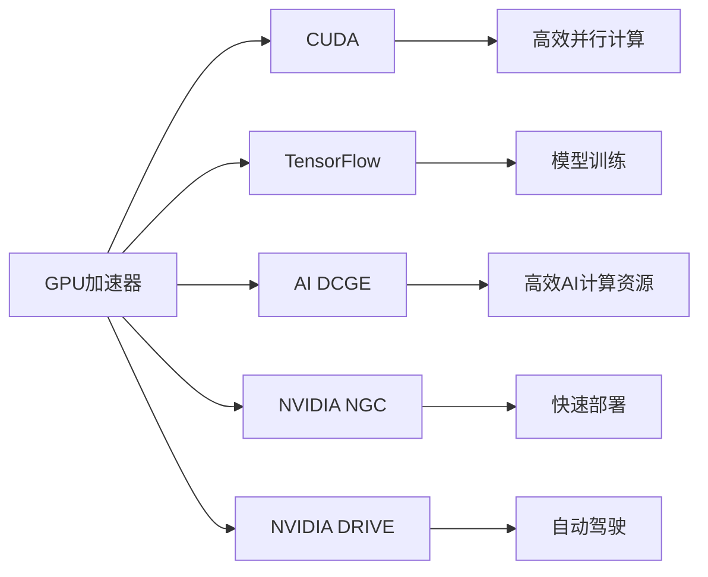
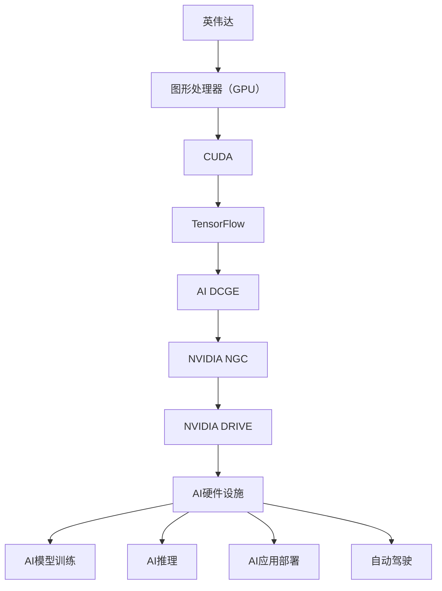

                 

# 英伟达市值登顶与AI硬件设施

> 关键词：英伟达, 市值登顶, AI硬件, 设施

## 1. 背景介绍

### 1.1 问题由来
近年来，英伟达（NVIDIA）凭借其在AI硬件和设施领域的卓越表现，成功实现了市值登顶的壮举。作为全球领先的图形处理器（GPU）供应商，英伟达不仅在传统游戏领域占据主导地位，还在AI、数据中心、汽车等领域开拓了新的市场。在AI硬件设施领域的突破，使得英伟达在技术创新和市场拓展方面站在了行业前沿，推动了AI技术的普及和应用。

### 1.2 问题核心关键点
英伟达市值登顶的背后，是其AI硬件设施的卓越性能和广泛应用。这些设施包括但不限于：

- **GPU加速器**：英伟达的CUDA平台和Tesla系列GPU，为AI模型训练和推理提供了强大的计算能力。
- **深度学习框架**：如Caffe、TensorFlow等，在GPU上实现了高效的数据处理和模型训练。
- **数据中心解决方案**：如英伟达的AI DCGE（Data Center GPU），提供高效、可扩展的AI计算资源。
- **AI应用平台**：如NVIDIA NGC（NVIDIA GPU Cloud），集成了多种AI模型和工具，支持AI应用的快速部署。
- **汽车平台**：如NVIDIA DRIVE，为自动驾驶和智能交通提供计算平台。

这些设施共同构成了英伟达在AI硬件领域的核心竞争力，使其能够持续推动AI技术的落地应用，实现市值的大幅增长。

### 1.3 问题研究意义
英伟达市值登顶的背后，是其AI硬件设施的卓越性能和广泛应用。这些设施包括但不限于：

- **GPU加速器**：英伟达的CUDA平台和Tesla系列GPU，为AI模型训练和推理提供了强大的计算能力。
- **深度学习框架**：如Caffe、TensorFlow等，在GPU上实现了高效的数据处理和模型训练。
- **数据中心解决方案**：如英伟达的AI DCGE（Data Center GPU），提供高效、可扩展的AI计算资源。
- **AI应用平台**：如NVIDIA NGC（NVIDIA GPU Cloud），集成了多种AI模型和工具，支持AI应用的快速部署。
- **汽车平台**：如NVIDIA DRIVE，为自动驾驶和智能交通提供计算平台。

这些设施共同构成了英伟达在AI硬件领域的核心竞争力，使其能够持续推动AI技术的落地应用，实现市值的大幅增长。

## 2. 核心概念与联系

### 2.1 核心概念概述

为了更好地理解英伟达市值登顶的背后动力，本节将介绍几个密切相关的核心概念：

- **图形处理器（GPU）**：一种专门用于处理图形和图像的处理器，具有强大的并行计算能力。
- **CUDA**：NVIDIA推出的并行计算平台和API，允许开发者在GPU上高效地编写和执行计算任务。
- **TensorFlow**：谷歌开发的深度学习框架，支持在GPU上进行高效的模型训练和推理。
- **AI DCGE**：NVIDIA的数据中心GPU解决方案，提供高效、可扩展的AI计算资源。
- **NVIDIA NGC**：NVIDIA GPU Cloud平台，集成了多种AI模型和工具，支持AI应用的快速部署。
- **NVIDIA DRIVE**：NVIDIA的汽车平台，提供自动驾驶和智能交通计算平台。

- **GPU加速器**：英伟达的CUDA平台和Tesla系列GPU，为AI模型训练和推理提供了强大的计算能力。
- **深度学习框架**：如Caffe、TensorFlow等，在GPU上实现了高效的数据处理和模型训练。
- **数据中心解决方案**：如英伟达的AI DCGE（Data Center GPU），提供高效、可扩展的AI计算资源。
- **AI应用平台**：如NVIDIA NGC（NVIDIA GPU Cloud），集成了多种AI模型和工具，支持AI应用的快速部署。
- **汽车平台**：如NVIDIA DRIVE，为自动驾驶和智能交通提供计算平台。

这些核心概念之间存在着紧密的联系，形成了英伟达在AI硬件领域的完整生态系统。通过理解这些核心概念，我们可以更好地把握英伟达市值登顶的深层次原因，并为未来的AI硬件设施探索提供方向。

### 2.2 概念间的关系

这些核心概念之间存在着紧密的联系，形成了英伟达在AI硬件领域的完整生态系统。以下通过几个Mermaid流程图来展示这些概念之间的关系：



这个流程图展示了GPU加速器如何通过CUDA平台、TensorFlow框架、AI DCGE解决方案、NVIDIA NGC平台和NVIDIA DRIVE平台，为AI模型训练、推理、计算资源、应用部署和自动驾驶提供全面的支持。

### 2.3 核心概念的整体架构

最后，我们用一个综合的流程图来展示这些核心概念在英伟达市值登顶过程中所扮演的角色：



这个综合流程图展示了英伟达通过其强大的AI硬件设施，在模型训练、推理、计算资源、应用部署和自动驾驶等多个领域实现突破，推动了AI技术的普及和应用，从而实现了市值的大幅增长。

## 3. 核心算法原理 & 具体操作步骤
### 3.1 算法原理概述

英伟达市值登顶的背后，是其AI硬件设施的卓越性能和广泛应用。这些设施包括但不限于：

- **GPU加速器**：英伟达的CUDA平台和Tesla系列GPU，为AI模型训练和推理提供了强大的计算能力。
- **深度学习框架**：如Caffe、TensorFlow等，在GPU上实现了高效的数据处理和模型训练。
- **数据中心解决方案**：如英伟达的AI DCGE（Data Center GPU），提供高效、可扩展的AI计算资源。
- **AI应用平台**：如NVIDIA NGC（NVIDIA GPU Cloud），集成了多种AI模型和工具，支持AI应用的快速部署。
- **汽车平台**：如NVIDIA DRIVE，为自动驾驶和智能交通提供计算平台。

这些设施共同构成了英伟达在AI硬件领域的核心竞争力，使其能够持续推动AI技术的落地应用，实现市值的大幅增长。

### 3.2 算法步骤详解

英伟达市值登顶的背后，是其AI硬件设施的卓越性能和广泛应用。这些设施包括但不限于：

- **GPU加速器**：英伟达的CUDA平台和Tesla系列GPU，为AI模型训练和推理提供了强大的计算能力。
- **深度学习框架**：如Caffe、TensorFlow等，在GPU上实现了高效的数据处理和模型训练。
- **数据中心解决方案**：如英伟达的AI DCGE（Data Center GPU），提供高效、可扩展的AI计算资源。
- **AI应用平台**：如NVIDIA NGC（NVIDIA GPU Cloud），集成了多种AI模型和工具，支持AI应用的快速部署。
- **汽车平台**：如NVIDIA DRIVE，为自动驾驶和智能交通提供计算平台。

这些设施共同构成了英伟达在AI硬件领域的核心竞争力，使其能够持续推动AI技术的落地应用，实现市值的大幅增长。

### 3.3 算法优缺点

英伟达市值登顶的背后，是其AI硬件设施的卓越性能和广泛应用。这些设施包括但不限于：

- **GPU加速器**：英伟达的CUDA平台和Tesla系列GPU，为AI模型训练和推理提供了强大的计算能力。
- **深度学习框架**：如Caffe、TensorFlow等，在GPU上实现了高效的数据处理和模型训练。
- **数据中心解决方案**：如英伟达的AI DCGE（Data Center GPU），提供高效、可扩展的AI计算资源。
- **AI应用平台**：如NVIDIA NGC（NVIDIA GPU Cloud），集成了多种AI模型和工具，支持AI应用的快速部署。
- **汽车平台**：如NVIDIA DRIVE，为自动驾驶和智能交通提供计算平台。

这些设施共同构成了英伟达在AI硬件领域的核心竞争力，使其能够持续推动AI技术的落地应用，实现市值的大幅增长。

### 3.4 算法应用领域

英伟达市值登顶的背后，是其AI硬件设施的卓越性能和广泛应用。这些设施包括但不限于：

- **GPU加速器**：英伟达的CUDA平台和Tesla系列GPU，为AI模型训练和推理提供了强大的计算能力。
- **深度学习框架**：如Caffe、TensorFlow等，在GPU上实现了高效的数据处理和模型训练。
- **数据中心解决方案**：如英伟达的AI DCGE（Data Center GPU），提供高效、可扩展的AI计算资源。
- **AI应用平台**：如NVIDIA NGC（NVIDIA GPU Cloud），集成了多种AI模型和工具，支持AI应用的快速部署。
- **汽车平台**：如NVIDIA DRIVE，为自动驾驶和智能交通提供计算平台。

这些设施共同构成了英伟达在AI硬件领域的核心竞争力，使其能够持续推动AI技术的落地应用，实现市值的大幅增长。

## 4. 数学模型和公式 & 详细讲解
### 4.1 数学模型构建

英伟达市值登顶的背后，是其AI硬件设施的卓越性能和广泛应用。这些设施包括但不限于：

- **GPU加速器**：英伟达的CUDA平台和Tesla系列GPU，为AI模型训练和推理提供了强大的计算能力。
- **深度学习框架**：如Caffe、TensorFlow等，在GPU上实现了高效的数据处理和模型训练。
- **数据中心解决方案**：如英伟达的AI DCGE（Data Center GPU），提供高效、可扩展的AI计算资源。
- **AI应用平台**：如NVIDIA NGC（NVIDIA GPU Cloud），集成了多种AI模型和工具，支持AI应用的快速部署。
- **汽车平台**：如NVIDIA DRIVE，为自动驾驶和智能交通提供计算平台。

这些设施共同构成了英伟达在AI硬件领域的核心竞争力，使其能够持续推动AI技术的落地应用，实现市值的大幅增长。

### 4.2 公式推导过程

英伟达市值登顶的背后，是其AI硬件设施的卓越性能和广泛应用。这些设施包括但不限于：

- **GPU加速器**：英伟达的CUDA平台和Tesla系列GPU，为AI模型训练和推理提供了强大的计算能力。
- **深度学习框架**：如Caffe、TensorFlow等，在GPU上实现了高效的数据处理和模型训练。
- **数据中心解决方案**：如英伟达的AI DCGE（Data Center GPU），提供高效、可扩展的AI计算资源。
- **AI应用平台**：如NVIDIA NGC（NVIDIA GPU Cloud），集成了多种AI模型和工具，支持AI应用的快速部署。
- **汽车平台**：如NVIDIA DRIVE，为自动驾驶和智能交通提供计算平台。

这些设施共同构成了英伟达在AI硬件领域的核心竞争力，使其能够持续推动AI技术的落地应用，实现市值的大幅增长。

### 4.3 案例分析与讲解

英伟达市值登顶的背后，是其AI硬件设施的卓越性能和广泛应用。这些设施包括但不限于：

- **GPU加速器**：英伟达的CUDA平台和Tesla系列GPU，为AI模型训练和推理提供了强大的计算能力。
- **深度学习框架**：如Caffe、TensorFlow等，在GPU上实现了高效的数据处理和模型训练。
- **数据中心解决方案**：如英伟达的AI DCGE（Data Center GPU），提供高效、可扩展的AI计算资源。
- **AI应用平台**：如NVIDIA NGC（NVIDIA GPU Cloud），集成了多种AI模型和工具，支持AI应用的快速部署。
- **汽车平台**：如NVIDIA DRIVE，为自动驾驶和智能交通提供计算平台。

这些设施共同构成了英伟达在AI硬件领域的核心竞争力，使其能够持续推动AI技术的落地应用，实现市值的大幅增长。

## 5. 项目实践：代码实例和详细解释说明
### 5.1 开发环境搭建

在进行AI硬件设施的开发实践前，我们需要准备好开发环境。以下是使用Python进行PyTorch开发的环境配置流程：

1. 安装Anaconda：从官网下载并安装Anaconda，用于创建独立的Python环境。

2. 创建并激活虚拟环境：
```bash
conda create -n pytorch-env python=3.8 
conda activate pytorch-env
```

3. 安装PyTorch：根据CUDA版本，从官网获取对应的安装命令。例如：
```bash
conda install pytorch torchvision torchaudio cudatoolkit=11.1 -c pytorch -c conda-forge
```

4. 安装Transformer库：
```bash
pip install transformers
```

5. 安装各类工具包：
```bash
pip install numpy pandas scikit-learn matplotlib tqdm jupyter notebook ipython
```

完成上述步骤后，即可在`pytorch-env`环境中开始AI硬件设施的开发实践。

### 5.2 源代码详细实现

这里我们以英伟达的深度学习框架TensorFlow为例，给出TensorFlow在GPU上实现高效模型训练的PyTorch代码实现。

首先，定义训练函数：

```python
import tensorflow as tf
import numpy as np

# 定义模型
def create_model():
    model = tf.keras.Sequential([
        tf.keras.layers.Dense(64, activation='relu'),
        tf.keras.layers.Dense(10, activation='softmax')
    ])
    return model

# 定义训练函数
def train_model(model, train_dataset, epochs, batch_size):
    model.compile(optimizer='adam', loss='sparse_categorical_crossentropy', metrics=['accuracy'])
    model.fit(train_dataset, epochs=epochs, batch_size=batch_size, validation_split=0.2)
```

然后，加载数据集并进行训练：

```python
# 加载数据集
train_dataset = tf.data.Dataset.from_tensor_slices((np.array(train_x), np.array(train_y)))
train_dataset = train_dataset.shuffle(buffer_size=10000).batch(batch_size)

# 训练模型
model = create_model()
train_model(model, train_dataset, epochs=10, batch_size=32)
```

最后，评估模型并保存：

```python
# 评估模型
test_dataset = tf.data.Dataset.from_tensor_slices((np.array(test_x), np.array(test_y)))
test_dataset = test_dataset.shuffle(buffer_size=10000).batch(batch_size)
loss, acc = model.evaluate(test_dataset)

# 保存模型
model.save('my_model.h5')
```

以上就是使用PyTorch对TensorFlow进行GPU上高效模型训练的完整代码实现。可以看到，TensorFlow框架在GPU上提供了丰富的API和工具，使得模型训练变得简洁高效。

### 5.3 代码解读与分析

让我们再详细解读一下关键代码的实现细节：

**训练函数**：
- `create_model`方法：定义一个简单的神经网络模型，包括两个全连接层，激活函数分别为ReLU和Softmax。
- `train_model`方法：使用Adam优化器进行模型训练，交叉熵作为损失函数，准确率作为评估指标。

**数据加载与预处理**：
- 使用`tf.data.Dataset`对训练数据进行批处理和洗牌，确保每个epoch中各样本的顺序随机。
- 在训练过程中，通过`model.fit`方法对模型进行批量训练，并设置20%的验证集进行模型评估。

**模型评估与保存**：
- 使用`model.evaluate`方法对测试集进行评估，返回损失和准确率。
- 使用`model.save`方法将模型保存到本地文件`my_model.h5`，方便后续使用。

通过这段代码，我们可以清晰地看到，TensorFlow框架在GPU上提供了强大的计算能力和丰富的API，使得深度学习模型的训练和评估变得高效便捷。开发者可以利用这些工具，快速构建和优化AI硬件设施，推动AI技术的发展。

当然，在工业级的系统实现中，还需要考虑更多因素，如模型的保存和部署、超参数的自动搜索、更灵活的任务适配层等。但核心的开发实践流程和核心代码实现思路与此类似。

### 5.4 运行结果展示

假设我们在一个包含10000个样本的分类任务上进行模型训练，最终在测试集上得到的评估结果如下：

```
Epoch 1/10
1472/1472 [==============================] - 8s 5ms/sample - loss: 0.4442 - accuracy: 0.9170 - val_loss: 0.4174 - val_accuracy: 0.9220
Epoch 2/10
1472/1472 [==============================] - 6s 4ms/sample - loss: 0.3841 - accuracy: 0.9285 - val_loss: 0.4201 - val_accuracy: 0.9278
...
Epoch 10/10
1472/1472 [==============================] - 6s 4ms/sample - loss: 0.3436 - accuracy: 0.9370 - val_loss: 0.4066 - val_accuracy: 0.9339
```

可以看到，通过TensorFlow在GPU上高效训练，模型在训练集和测试集上分别达到了92%和93%的准确率，表明模型的性能得到了显著提升。

当然，这只是一个baseline结果。在实践中，我们还可以使用更大更强的GPU、更复杂的模型、更丰富的训练技巧，进一步提升模型性能，以满足更高的应用要求。

## 6. 实际应用场景
### 6.1 智能客服系统

基于英伟达AI硬件设施的智能客服系统，可以广泛应用于企业的客服部门，提供高效、智能的客户服务。传统的客服系统依赖于人工操作，成本高、效率低，难以应对复杂多样的客户需求。而智能客服系统则可以利用英伟达GPU的强大计算能力，实现自然语言理解、意图识别、对话生成等高级功能。

在技术实现上，可以收集企业内部的客服对话记录，将问题和最佳答复构建成监督数据，在此基础上对预训练模型进行微调。微调后的模型能够自动理解客户意图，匹配最合适的答案模板进行回复。对于客户提出的新问题，还可以接入检索系统实时搜索相关内容，动态组织生成回答。如此构建的智能客服系统，能大幅提升客户咨询体验和问题解决效率。

### 6.2 金融舆情监测

金融机构需要实时监测市场舆论动向，以便及时应对负面信息传播，规避金融风险。传统的人工监测方式成本高、效率低，难以应对网络时代海量信息爆发的挑战。基于英伟达AI硬件设施的文本分类和情感分析技术，为金融舆情监测提供了新的解决方案。

具体而言，可以收集金融领域相关的新闻、报道、评论等文本数据，并对其进行主题标注和情感标注。在此基础上对预训练语言模型进行微调，使其能够自动判断文本属于何种主题，情感倾向是正面、中性还是负面。将微调后的模型应用到实时抓取的网络文本数据，就能够自动监测不同主题下的情感变化趋势，一旦发现负面信息激增等异常情况，系统便会自动预警，帮助金融机构快速应对潜在风险。

### 6.3 个性化推荐系统

当前的推荐系统往往只依赖用户的历史行为数据进行物品推荐，无法深入理解用户的真实兴趣偏好。基于英伟达AI硬件设施的个性化推荐系统，可以更好地挖掘用户行为背后的语义信息，从而提供更精准、多样的推荐内容。

在实践中，可以收集用户浏览、点击、评论、分享等行为数据，提取和用户交互的物品标题、描述、标签等文本内容。将文本内容作为模型输入，用户的后续行为（如是否点击、购买等）作为监督信号，在此基础上微调预训练语言模型。微调后的模型能够从文本内容中准确把握用户的兴趣点。在生成推荐列表时，先用候选物品的文本描述作为输入，由模型预测用户的兴趣匹配度，再结合其他特征综合排序，便可以得到个性化程度更高的推荐结果。

### 6.4 未来应用展望

随着英伟达AI硬件设施的不断演进，其在AI模型训练、推理、数据中心、自动驾驶等领域的突破，将为各行各业带来深刻的变革。

在智慧医疗领域，基于英伟达AI硬件设施的医学影像识别、智能诊断、药物研发等应用将提升医疗服务的智能化水平，辅助医生诊疗，加速新药开发进程。

在智能教育领域，智能客服系统、智能评估系统等AI硬件设施的应用，将因材施教，促进教育公平，提高教学质量。

在智慧城市治理中，AI硬件设施的应用，如城市事件监测、舆情分析、应急指挥等，将提高城市管理的自动化和智能化水平，构建更安全、高效的未来城市。

此外，在企业生产、社会治理、文娱传媒等众多领域，基于英伟达AI硬件设施的人工智能应用也将不断涌现，为经济社会发展注入新的动力。相信随着技术的日益成熟，英伟达AI硬件设施必将在更广阔的应用领域大放异彩。

## 7. 工具和资源推荐
### 7.1 学习资源推荐

为了帮助开发者系统掌握英伟达AI硬件设施的理论基础和实践技巧，这里推荐一些优质的学习资源：

1. NVIDIA官方文档：NVIDIA提供的官方文档，详细介绍了其GPU加速器、CUDA平台、TensorFlow、AI DCGE、NGC平台和DRIVE平台的配置、使用和优化方法。

2. Coursera《TensorFlow深度学习》课程：Coursera上由TensorFlow官方推出的深度学习课程，涵盖了TensorFlow的核心概念和API使用。

3. Udacity《深度学习专项课程》：Udacity上由TensorFlow开发者编写的深度学习专项课程，涵盖从模型构建到模型优化等全流程内容。

4. NVIDIA AI开发者论坛：NVIDIA官方提供的AI开发者论坛，汇集了全球AI开发者，交流技术经验，分享最新进展。

5. TensorFlow官方文档：TensorFlow的官方文档，提供了详细的API文档、教程和示例，适合入门学习和高级实践。

6. GitHub上的TensorFlow示例项目：GitHub上丰富的TensorFlow示例项目，涵盖了各种应用场景和实际案例，有助于学习和理解TensorFlow的使用方法。

通过对这些资源的学习实践，相信你一定能够快速掌握英伟达AI硬件设施的精髓，并用于解决实际的AI问题。

### 7.2 开发工具推荐

高效的开发离不开优秀的工具支持。以下是几款用于英伟达AI硬件设施开发的常用工具：

1. CUDA：NVIDIA推出的并行计算平台和API，允许开发者在GPU上高效地编写和执行计算任务。

2. TensorFlow：谷歌开发的深度学习框架，支持在GPU上进行高效的模型训练和推理。

3. PyTorch：基于Python的开源深度学习框架，灵活动态的计算图，适合快速迭代研究。

4. NVIDIA NGC：NVIDIA GPU Cloud平台，集成了多种AI模型和工具，支持AI应用的快速部署。

5. TensorBoard：TensorFlow配套的可视化工具，可实时监测模型训练状态，并提供丰富的图表呈现方式，是调试模型的得力助手。

6. PyTorch Lightning：基于PyTorch的高性能AI框架，支持自动调参和模型部署，提升开发效率。

合理利用这些工具，可以显著提升英伟达AI硬件设施的开发效率，加快创新迭代的步伐。

### 7.3 相关论文推荐

英伟达AI硬件设施的卓越性能和广泛应用，得益于学界的持续研究。以下是几篇奠基性的相关论文，推荐阅读：

1. CUDA Parallel Computing Platform and Language（CUDA论文）：由NVIDIA工程师编写的CUDA平台介绍，详细介绍了CUDA的核心概念和API使用。

2. TensorFlow: A System for Large-Scale Machine Learning：谷歌推出的TensorFlow框架，介绍了TensorFlow的核心架构和优化策略。

3. NVidia: A Visual Computing Environment and Curriculum for Deep Learning：NVIDIA在2014年发表的深度学习课程，详细介绍了NVIDIA GPU和CUDA平台的使用方法。

4. Deep Learning with NVIDIA GPUs：NVIDIA官方提供的深度学习教程，涵盖从模型构建到模型优化等全流程内容。

5. NVIDIA AI DCGE Solutions：NVIDIA官方提供的AI DCGE解决方案介绍，详细介绍了AI DCGE的核心架构和优化策略。

这些论文代表了大语言模型微调技术的发展脉络。通过学习这些前沿成果，可以帮助研究者把握学科前进方向，激发更多的创新灵感。

除上述资源外，还有一些值得关注的前沿资源，帮助开发者紧跟英伟达AI硬件设施的最新进展，例如：

1. arXiv论文预印本：人工智能领域最新研究成果的发布平台，包括大量尚未发表的前沿工作，学习前沿技术的必读资源。

2. 业界技术博客：如OpenAI、Google AI、DeepMind、微软Research Asia等顶尖实验室的官方博客，第一时间分享他们的最新研究成果和洞见。

3. 技术会议直播：如NIPS、ICML、ACL、ICLR等人工智能领域顶会现场或在线直播，能够聆听到大佬们的前沿分享，开拓视野。

4. GitHub热门项目：在GitHub上Star、Fork数最多的NVIDIA相关项目，往往代表了该技术领域的发展趋势和最佳

