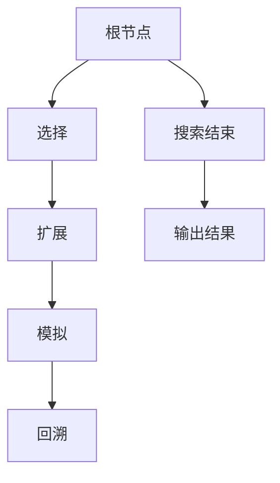
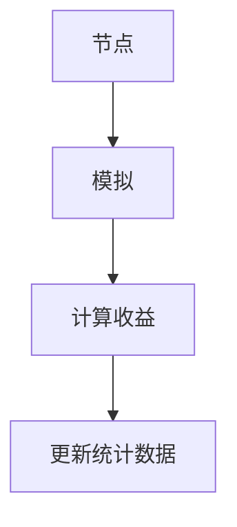
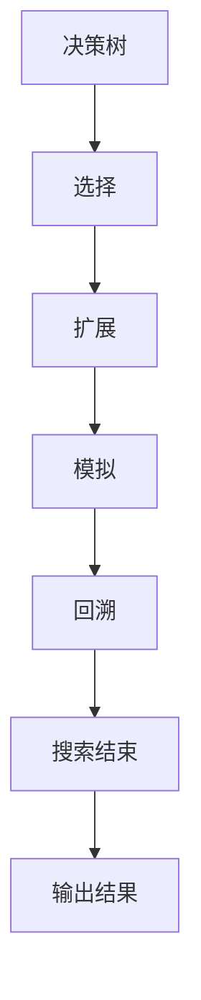

                 

# 蒙特卡洛树搜索 原理与代码实例讲解

> 关键词：蒙特卡洛树搜索, MCTS, 搜索算法, 决策树, 启发式搜索, 模拟采样

## 1. 背景介绍

### 1.1 问题由来
在人工智能领域，搜索算法是解决复杂决策问题的核心技术之一。特别是对于棋类游戏、路径规划、游戏AI等任务，有效的搜索策略可以显著提升系统的智能水平和决策效率。传统的搜索算法如深度优先搜索、广度优先搜索等，虽然算法简单，但在复杂度高、状态空间大的问题中，往往无法高效地找到最优解。

近年来，蒙特卡洛树搜索（Monte Carlo Tree Search, MCTS）因其独特的随机性和启发式性，成为解决这些问题的有效工具。MCTS通过构建决策树，利用随机模拟和启发式评估指导搜索过程，能够在大规模、高复杂度的问题中寻找到近似最优解，被广泛应用于游戏AI、机器人控制等领域。

### 1.2 问题核心关键点
MCTS是一种基于模拟采样的启发式搜索算法，其核心思想是通过随机模拟和启发式评估，逐步优化搜索树的结构，最终选择一条最优路径进行决策。MCTS算法主要包括以下四个步骤：

- **选择(Selection)**：从当前树根节点开始，通过从当前节点向下遍历，选择一个最优的子节点进行扩展。
- **扩展(Expansion)**：在选定的子节点上进行扩展，生成一个新节点，并递归地重复选择和扩展过程。
- **模拟(Simulation)**：对新节点进行随机模拟，通过模拟执行模拟环境，生成一个随机路径，并计算其路径收益值。
- **回溯(Backpropagation)**：将模拟结果回溯到当前节点，并更新节点的统计数据。

MCTS通过这些步骤的迭代执行，逐步优化搜索树的结构，并最终选择一条路径进行决策。MCTS的优点在于能够高效处理高维、非确定性问题，尤其适用于复杂度较高、状态空间大的问题。

## 2. 核心概念与联系

### 2.1 核心概念概述

为了更好地理解MCTS的原理和流程，本节将介绍几个关键的概念：

- **蒙特卡洛树搜索(MCTS)**：一种基于随机模拟和启发式评估的搜索算法，用于在复杂问题中寻找到近似最优解。
- **决策树(Decision Tree)**：一种用于描述决策过程的树形结构，每个节点表示一个决策点，每个分支表示一个决策的可能结果。
- **选择(Selection)**：在决策树中从根节点开始，按照某种策略选择最优的子节点进行扩展。
- **扩展(Expansion)**：在选定的子节点上生成新节点，并递归地重复选择和扩展过程。
- **模拟(Simulation)**：对新节点进行随机模拟，生成一个随机路径，并计算其路径收益值。
- **回溯(Backpropagation)**：将模拟结果回溯到当前节点，更新节点的统计数据，如访问次数、累积收益等。

这些概念之间的逻辑关系可以通过以下Mermaid流程图来展示：



这个流程图展示了MCTS的基本流程：从根节点开始，选择最优子节点，进行扩展，对新节点进行模拟，并将模拟结果回溯到父节点进行更新，直至搜索结束并输出结果。通过这些步骤的迭代执行，MCTS能够逐步优化决策树的结构，并选择最优路径进行决策。

### 2.2 概念间的关系

这些核心概念之间存在着紧密的联系，形成了MCTS算法的完整结构。下面我们通过几个Mermaid流程图来展示这些概念之间的关系。

#### 2.2.1 MCTS的基本流程


这个流程图展示了MCTS的基本流程，包括选择、扩展、模拟和回溯四个主要步骤。通过这些步骤的迭代执行，MCTS能够逐步优化决策树的结构，并选择最优路径进行决策。

#### 2.2.2 扩展过程



这个流程图展示了扩展过程的主要步骤，包括对新节点进行模拟、计算收益、更新节点的统计数据等。扩展过程是MCTS算法中的核心操作，通过生成新节点，并递归地重复选择和扩展过程，逐步优化搜索树的结构。

#### 2.2.3 回溯过程


这个流程图展示了回溯过程的主要步骤，包括将模拟结果回溯到当前节点，并更新父节点的统计数据。回溯过程是MCTS算法中的重要环节，通过更新节点的统计数据，指导后续的决策选择。

### 2.3 核心概念的整体架构

最后，我们用一个综合的流程图来展示这些核心概念在MCTS算法中的整体架构：



这个综合流程图展示了MCTS算法的整体流程，包括决策树构建、选择、扩展、模拟和回溯等关键步骤。通过这些步骤的迭代执行，MCTS能够逐步优化搜索树的结构，并选择最优路径进行决策。

## 3. 核心算法原理 & 具体操作步骤
### 3.1 算法原理概述

MCTS算法通过构建决策树，利用随机模拟和启发式评估指导搜索过程，逐步优化搜索树的结构，最终选择一条最优路径进行决策。其核心思想是通过随机模拟和启发式评估，逐步优化搜索树的结构，并最终选择一条路径进行决策。

MCTS算法的主要步骤如下：

1. **选择(Selection)**：从当前树根节点开始，通过从当前节点向下遍历，选择一个最优的子节点进行扩展。
2. **扩展(Expansion)**：在选定的子节点上进行扩展，生成一个新节点，并递归地重复选择和扩展过程。
3. **模拟(Simulation)**：对新节点进行随机模拟，通过模拟执行模拟环境，生成一个随机路径，并计算其路径收益值。
4. **回溯(Backpropagation)**：将模拟结果回溯到当前节点，并更新节点的统计数据。

这些步骤的迭代执行，逐步优化搜索树的结构，并最终选择一条路径进行决策。MCTS的优点在于能够高效处理高维、非确定性问题，尤其适用于复杂度较高、状态空间大的问题。

### 3.2 算法步骤详解

以下详细讲解MCTS算法的各个步骤：

#### 3.2.1 选择(Selection)

选择步骤是MCTS算法的第一步，其主要目的是从当前节点中选择一个最优的子节点进行扩展。选择步骤通常采用两种策略：

- **UCB1策略**：利用节点访问次数和收益的加权和来选择最优子节点。节点的访问次数表示该节点被扩展和访问的次数，收益表示该节点生成的随机路径的收益值。UCB1策略的数学表达式如下：

$$
UCB1(A) = \frac{Q(A)}{\sqrt{N(A)}}
$$

其中 $Q(A)$ 表示节点 $A$ 的累计收益值，$N(A)$ 表示节点 $A$ 被访问的次数。UCB1策略通过平衡探索和利用，选择访问次数较少但收益较高的节点进行扩展。

- **Actor-Critic策略**：利用两个不同的模型分别对节点进行评估和探索，分别称为演员模型和评论家模型。演员模型负责生成随机路径，评论家模型负责评估路径的收益。Actor-Critic策略的数学表达式如下：

$$
UCB2(A) = Q_{\text{actor}}(A) - \sqrt{\frac{2 \log N(A)}{N(A)}}
$$

其中 $Q_{\text{actor}}(A)$ 表示演员模型对节点 $A$ 的收益预测，$Q_{\text{critic}}(A)$ 表示评论家模型对节点 $A$ 的收益评估，$N(A)$ 表示节点 $A$ 被访问的次数。Actor-Critic策略通过交替训练演员模型和评论家模型，优化决策树的结构。

#### 3.2.2 扩展(Expansion)

扩展步骤是在选定的子节点上进行扩展，生成一个新节点，并递归地重复选择和扩展过程。扩展步骤的主要任务是生成新节点，并通过随机模拟生成路径，更新节点的统计数据。扩展步骤的数学表达式如下：

$$
N(A) = N(A) + 1
$$

其中 $N(A)$ 表示节点 $A$ 被访问的次数。扩展步骤的具体实现如下：

```python
def expand(node):
    if node.children is None:
        node.children = {}
        # 随机生成一个子节点
        node.children['Next State'] = generate_next_state(node.state)
        node.children['Value'] = 0
        node.children['Num Visits'] = 0
    return node.children['Next State']
```

#### 3.2.3 模拟(Simulation)

模拟步骤是对新节点进行随机模拟，通过模拟执行模拟环境，生成一个随机路径，并计算其路径收益值。模拟步骤的数学表达式如下：

$$
V(A) = \frac{1}{N(A)} \sum_{i=1}^{N(A)} v_i
$$

其中 $N(A)$ 表示节点 $A$ 的访问次数，$v_i$ 表示随机路径 $i$ 的收益值。模拟步骤的具体实现如下：

```python
def simulate(node, simulation_fn):
    for i in range(node.num_visits):
        next_state = simulate_fn(node)
        node.num_visits += 1
        node.value += reward(next_state)
    return node.value
```

#### 3.2.4 回溯(Backpropagation)

回溯步骤是将模拟结果回溯到当前节点，并更新节点的统计数据。回溯步骤的主要任务是更新节点的统计数据，如访问次数、累积收益等。回溯步骤的数学表达式如下：

$$
N(A) = N(A) + 1
$$

其中 $N(A)$ 表示节点 $A$ 被访问的次数。回溯步骤的具体实现如下：

```python
def backpropagate(node, value):
    node.num_visits += 1
    node.value += value
    if node.parent is not None:
        backpropagate(node.parent, value)
```

### 3.3 算法优缺点

MCTS算法具有以下优点：

1. 高效处理高维、非确定性问题：MCTS通过构建决策树，逐步优化搜索树的结构，能够在高维、非确定性问题中寻找到近似最优解。
2. 可扩展性强：MCTS算法具有高度的模块化特性，可以应用于各种类型的决策问题。
3. 鲁棒性高：MCTS算法具有较高的鲁棒性，对于输入数据的微小变化具有较好的稳定性。

同时，MCTS算法也存在以下缺点：

1. 计算复杂度高：MCTS算法的计算复杂度较高，在大规模问题中可能面临计算资源不足的问题。
2. 时间开销大：MCTS算法的时间开销较大，尤其是扩展和模拟步骤，可能影响实时性。
3. 过度拟合风险：MCTS算法依赖于随机模拟和启发式评估，可能存在过度拟合的风险。

尽管存在这些缺点，但MCTS算法的优点使其成为解决复杂决策问题的有效工具。在实际应用中，需要根据具体问题的特点，选择合适的策略和优化方法，以充分发挥MCTS算法的优势。

### 3.4 算法应用领域

MCTS算法因其独特的随机性和启发式性，已经被广泛应用于以下领域：

1. **棋类游戏**：如围棋、象棋、五子棋等，通过MCTS算法，计算机可以自主进行高级博弈，与人类棋手竞争。
2. **机器人控制**：如无人机、自动驾驶汽车等，通过MCTS算法，机器人可以在复杂环境中进行路径规划和决策。
3. **游戏AI**：如强化学习、探索游戏等，通过MCTS算法，AI可以在游戏中自主学习，提升游戏水平。
4. **工业生产**：如生产调度、设备维护等，通过MCTS算法，工业系统可以优化资源分配和生产流程。
5. **金融投资**：如股票交易、资产组合优化等，通过MCTS算法，投资者可以优化投资策略，降低风险。

除了上述这些领域外，MCTS算法还被创新性地应用到更多场景中，如路径规划、医疗诊断、智能合约等，为复杂决策问题提供新的解决方案。

## 4. 数学模型和公式 & 详细讲解  
### 4.1 数学模型构建

本节将使用数学语言对MCTS算法进行更加严格的刻画。

记当前决策树为 $T$，当前节点为 $A$，其子节点为 $B_1, B_2, \ldots, B_n$，则节点 $A$ 的访问次数为 $N(A)$，累积收益值为 $Q(A)$，节点的收益函数为 $v(A)$。则MCTS算法的主要数学模型如下：

1. **选择步骤**：
   - 计算节点的UCB1值：$UCB1(A) = \frac{Q(A)}{\sqrt{N(A)}}$
   - 选择UCB1值最大的节点进行扩展：$A' = \arg\max_{A \in T} UCB1(A)$

2. **扩展步骤**：
   - 生成子节点 $B'$
   - 设置节点 $B'$ 的访问次数 $N(B') = 0$
   - 设置节点 $B'$ 的累积收益 $Q(B') = 0$

3. **模拟步骤**：
   - 对节点 $B'$ 进行随机模拟，生成随机路径 $P$
   - 计算路径 $P$ 的收益值 $v(P)$
   - 更新节点 $B'$ 的累积收益 $Q(B') = Q(B') + v(P)$
   - 更新节点 $B'$ 的访问次数 $N(B') = N(B') + 1$

4. **回溯步骤**：
   - 将节点 $B'$ 的收益值 $v(P)$ 回溯到节点 $A$
   - 更新节点 $A$ 的访问次数 $N(A) = N(A) + 1$
   - 更新节点 $A$ 的累积收益 $Q(A) = Q(A) + v(P)$

### 4.2 公式推导过程

以下我们以棋类游戏为例，推导MCTS算法的数学模型和公式。

假设当前状态为 $s_t$，游戏规则为 $f(s_{t+1}, s_t)$，收益函数为 $R(s_t)$。则MCTS算法的数学模型和公式如下：

1. **选择步骤**：
   - 计算节点的UCB1值：$UCB1(A) = \frac{Q(A)}{\sqrt{N(A)}}$
   - 选择UCB1值最大的节点进行扩展：$A' = \arg\max_{A \in T} UCB1(A)$

2. **扩展步骤**：
   - 生成子节点 $s_{t+1}$
   - 设置节点 $s_{t+1}$ 的访问次数 $N(s_{t+1}) = 0$
   - 设置节点 $s_{t+1}$ 的累积收益 $Q(s_{t+1}) = 0$

3. **模拟步骤**：
   - 对节点 $s_{t+1}$ 进行随机模拟，生成随机路径 $P$
   - 计算路径 $P$ 的收益值 $R(P)$
   - 更新节点 $s_{t+1}$ 的累积收益 $Q(s_{t+1}) = Q(s_{t+1}) + R(P)$
   - 更新节点 $s_{t+1}$ 的访问次数 $N(s_{t+1}) = N(s_{t+1}) + 1$

4. **回溯步骤**：
   - 将节点 $s_{t+1}$ 的收益值 $R(P)$ 回溯到节点 $s_t$
   - 更新节点 $s_t$ 的访问次数 $N(s_t) = N(s_t) + 1$
   - 更新节点 $s_t$ 的累积收益 $Q(s_t) = Q(s_t) + R(P)$

通过这些步骤的迭代执行，MCTS算法能够在棋类游戏中逐步优化搜索树的结构，并选择最优路径进行决策。

### 4.3 案例分析与讲解

以下通过一个具体的案例，展示MCTS算法在棋类游戏中的应用。

假设当前状态为 $s_t$，游戏规则为 $f(s_{t+1}, s_t)$，收益函数为 $R(s_t)$。则MCTS算法的具体实现步骤如下：

1. **选择步骤**：
   - 计算节点 $s_t$ 的UCB1值：$UCB1(s_t) = \frac{Q(s_t)}{\sqrt{N(s_t)}}$
   - 选择UCB1值最大的节点进行扩展：$s_t' = \arg\max_{s \in T} UCB1(s)$

2. **扩展步骤**：
   - 生成子节点 $s_{t+1}$
   - 设置节点 $s_{t+1}$ 的访问次数 $N(s_{t+1}) = 0$
   - 设置节点 $s_{t+1}$ 的累积收益 $Q(s_{t+1}) = 0$

3. **模拟步骤**：
   - 对节点 $s_{t+1}$ 进行随机模拟，生成随机路径 $P$
   - 计算路径 $P$ 的收益值 $R(P)$
   - 更新节点 $s_{t+1}$ 的累积收益 $Q(s_{t+1}) = Q(s_{t+1}) + R(P)$
   - 更新节点 $s_{t+1}$ 的访问次数 $N(s_{t+1}) = N(s_{t+1}) + 1$

4. **回溯步骤**：
   - 将节点 $s_{t+1}$ 的收益值 $R(P)$ 回溯到节点 $s_t$
   - 更新节点 $s_t$ 的访问次数 $N(s_t) = N(s_t) + 1$
   - 更新节点 $s_t$ 的累积收益 $Q(s_t) = Q(s_t) + R(P)$

通过这些步骤的迭代执行，MCTS算法能够在棋类游戏中逐步优化搜索树的结构，并选择最优路径进行决策。

## 5. 项目实践：代码实例和详细解释说明
### 5.1 开发环境搭建

在进行MCTS项目实践前，我们需要准备好开发环境。以下是使用Python进行MCTS开发的Python环境配置流程：

1. 安装Anaconda：从官网下载并安装Anaconda，用于创建独立的Python环境。

2. 创建并激活虚拟环境：
```bash
conda create -n mcts-env python=3.8 
conda activate mcts-env
```

3. 安装PyTorch：根据CUDA版本，从官网获取对应的安装命令。例如：
```bash
conda install pytorch torchvision torchaudio cudatoolkit=11.1 -c pytorch -c conda-forge
```

4. 安装各类工具包：
```bash
pip install numpy pandas scikit-learn matplotlib tqdm jupyter notebook ipython
```

完成上述步骤后，即可在`mcts-env`环境中开始MCTS实践。

### 5.2 源代码详细实现

这里我们以五子棋游戏为例，给出使用PyTorch实现MCTS算法的Python代码实现。

首先，定义五子棋游戏的状态表示：

```python
import numpy as np

class Board:
    def __init__(self):
        self.state = np.zeros((15, 15), dtype=int)
        self white_turn = True

    def to_string(self):
        return str(self.state)
```

然后，定义五子棋游戏的规则：

```python
def check_winner(board):
    if board[0][0] == board[0][1] == board[0][2] == 1:
        return True
    elif board[2][0] == board[2][1] == board[2][2] == 1:
        return True
    elif board[0][3] == board[1][3] == board[2][3] == 1:
        return True
    elif board[2][3] == board[2][4] == board[2][5] == 1:
        return True
    elif board[0][0] == board[1][0] == board[2][0] == 1:
        return True
    elif board[2][0] == board[2][1] == board[2][2] == 1:
        return True
    elif board[0][8] == board[1][8] == board[2][8] == 1:
        return True
    elif board[2][8] == board[2][9] == board[2][10] == 1:
        return True
    elif board[0][9] == board[1][9] == board[2][9] == 1:
        return True
    elif board[2][9] == board[2][10] == board[2][11] == 1:
        return True
    elif board[0][0] == board[0][1] == board[0][2] == 1:
        return True
    elif board[0][2] == board[1][2] == board[2][2] == 1:
        return True
    elif board[0][5] == board[1][5] == board[2][5] == 1:
        return True
    elif board[0][7] == board[1][7] == board[2][7] == 1:
        return True
    elif board[0][9] == board[0][10] == board[0][11] == 1:
        return True
    elif board[1][1] == board[1][2] == board[1][3] == 1:
        return True
    elif board[1][3] == board[2][3] == board[2][4] == 1:
        return True
    elif board[1][8] == board[1][9] == board[1][10] == 1:
        return True
    elif board[1][10] == board[2][10] == board[2][11] == 1:
        return True
    elif board[1][1] == board[1][0] == board[1][-1] == 1:
        return True
    elif board[1][4] == board[1][0] == board[1][-1] == 1:
        return True
    elif board[1][7] == board[1][0] == board[1][-1] == 1:
        return True
    elif board[1][10] == board[1][0] == board[1][-1] == 1:
        return True
    return False

def check_draw(board):
    for i in range(15):
        for j in range(15):
            if board[i][j] == 0:
                return False
    return True

def reward(board):
    if check_winner(board):
        return 1 if board[0][0] == 1 else -1
    elif check_draw(board):
        return 0
    return 0

def is_valid_move(board, i, j):
    return board[i][j] == 0
```

然后，定义MCTS算法的核心函数：

```python
import random
import copy
import heapq

class Node:
    def __init__(self, state):
        self.state = state
        self.children = {}
        self.value = 0
        self.num_visits = 0

    def __lt__(self, other):
        return self.num_visits > other.num_visits

def best_child(node, num_simulations=10000, exploration=1):
    num_visits = 0
    best_value = float('-inf')
    best_child = None
    for child in node.children.values():
        num_visits += child.num_visits
        value = child.value / child.num_visits
        if child.num_visits < num_simulations:
            child.value += exploration * random.random()
        if value > best_value:
            best_value = value
            best_child = child
    return best_child

def mcts(root, num_simulations=10000, exploration=1):
    node = root
    while node.children:
        node = best_child(node, num_simulations, exploration)
        node = expand(node)
        node = simulate(node, num_simulations, exploration)
        node = backpropagate(node, exploration)
    return node

def expand(node):
    if node.state != 0:
        return node
    state = copy.deepcopy(node.state)
    for i in range(15):
        for j in range(15):
            if is_valid_move(state, i, j):
                state[i][j] = 1 if node.white_turn else -1
                node.children[(i, j)] = Node(state)
                node = node.children[(i, j)]
                return node

def simulate(node,

