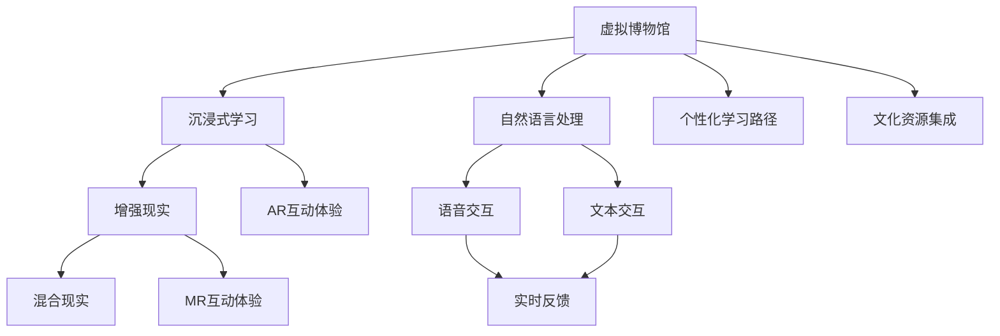
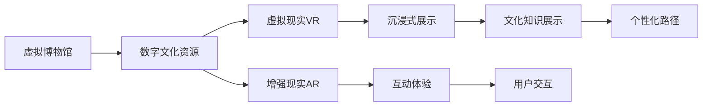
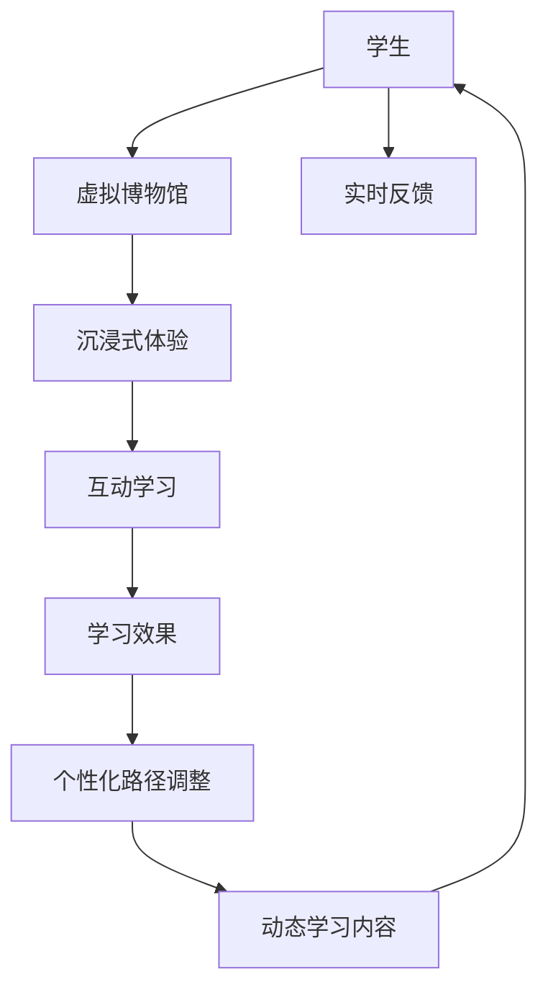
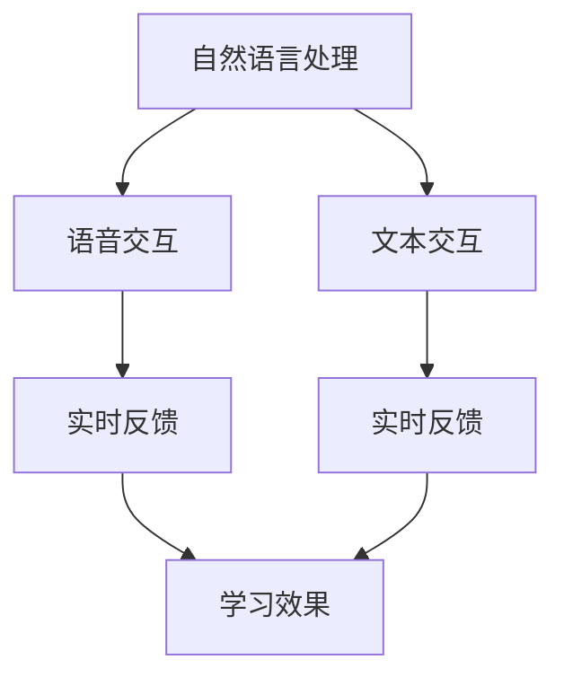
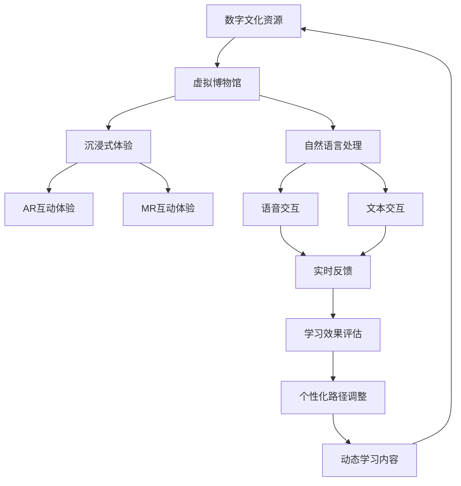

                 

# 虚拟博物馆教育:全球文化资源的沉浸式学习平台

> 关键词：虚拟博物馆,沉浸式学习,自然语言处理(NLP),增强现实(AR),混合现实(MR),教育科技

## 1. 背景介绍

### 1.1 问题由来
近年来，随着教育技术的飞速发展，特别是教育资源的数字化和网络化，全球教育迎来了前所未有的变革机遇。虚拟博物馆作为数字化教育资源的重要形式，正在成为各级学校、教育机构、文化组织争相应用的对象。通过虚拟博物馆，学生可以随时随地接触到世界各地的文化宝藏，激发学习兴趣，提升学习效果。

然而，传统虚拟博物馆在展示形式、互动性、沉浸感等方面仍存在诸多不足。例如，传统的虚拟博物馆往往只能提供二维图像或简单的三维模型，缺乏对文化资源的深入理解和互动体验；教学内容多以文字和图片为主，缺乏互动性和沉浸感；缺乏对学习过程的个性化指导和反馈。

为此，我们提出了虚拟博物馆教育的概念，旨在构建一个全球文化资源的沉浸式学习平台，通过自然语言处理(NLP)、增强现实(AR)、混合现实(MR)等先进技术，为学生提供更加生动、互动、沉浸的学习体验，提高文化素养和综合素质。

### 1.2 问题核心关键点
虚拟博物馆教育的核心在于如何利用现代信息技术，构建一个集成多种技术的沉浸式学习平台，使学生能够以更自然、更深刻的方式接触和理解全球文化资源。以下是虚拟博物馆教育的主要核心关键点：

- **沉浸式学习体验**：通过AR、MR等技术，为学生提供更加真实、互动、沉浸的学习环境，让学生仿佛身临其境地走进虚拟博物馆。
- **自然语言处理**：利用NLP技术，使学生能够通过语音或文本形式，与虚拟博物馆进行交互，获得个性化、实时的学习指导和反馈。
- **文化资源集成**：整合全球文化资源，提供丰富的文化展示形式和深入的文化知识，使学生能够系统、全面地了解不同文化背景和历史知识。
- **个性化学习路径**：根据学生的兴趣和学习进度，动态调整学习内容，提供个性化的学习路径，提升学习效果。
- **虚拟与现实的结合**：将虚拟博物馆与现实世界相结合，使学生能够通过虚拟博物馆学习到实用的知识和技能，并在现实世界中加以应用。

这些核心关键点共同构成了虚拟博物馆教育的整体框架，旨在通过现代信息技术，为学生提供更加丰富、深入、互动的学习体验，提升教育效果。

### 1.3 问题研究意义
虚拟博物馆教育的研究，对于推动教育现代化、促进文化传承、提升学生综合素质具有重要意义：

1. **教育现代化**：通过数字化、网络化、智能化手段，将虚拟博物馆引入课堂，实现教育资源的全球共享，促进教育公平。
2. **文化传承**：虚拟博物馆可以保存和展示珍贵的文化遗产，使学生能够跨越时空限制，深入了解不同文化的精髓，提升文化素养。
3. **学习效果提升**：沉浸式学习、个性化指导、实时反馈等技术手段，能够更好地激发学生的学习兴趣，提升学习效果，培养创新能力和实践能力。
4. **教育科技融合**：虚拟博物馆教育是教育与科技融合的典范，为未来教育技术的发展提供了新的思路和方向。
5. **社会责任**：通过虚拟博物馆教育，传递正能量，提升社会责任感和历史使命感，促进全球文化交流与理解。

## 2. 核心概念与联系

### 2.1 核心概念概述

为更好地理解虚拟博物馆教育的原理和架构，本节将介绍几个关键概念：

- **虚拟博物馆**：通过计算机图形技术、虚拟现实(VR)技术、增强现实(AR)技术等，构建一个虚拟的博物馆环境，使学生能够以互动的方式进行文化学习。
- **沉浸式学习**：通过AR、MR等技术，为学生提供更加真实、互动、沉浸的学习体验，使学生在虚拟博物馆中仿佛身临其境。
- **自然语言处理**：利用NLP技术，使学生能够通过语音或文本形式，与虚拟博物馆进行交互，获得个性化、实时的学习指导和反馈。
- **增强现实(AR)**：通过在现实世界叠加虚拟信息，增强学生对文化资源的理解和学习效果。
- **混合现实(MR)**：将虚拟信息与现实世界融合，提供更加真实、互动、沉浸的学习体验。

这些核心概念之间的联系可以通过以下Mermaid流程图来展示：



这个流程图展示了虚拟博物馆教育中各个核心概念之间的联系。虚拟博物馆通过AR、MR等技术，为学生提供沉浸式学习体验；自然语言处理技术使学生能够通过语音或文本与虚拟博物馆进行交互，获得实时反馈；文化资源的集成和文化展示的个性化路径设计，使学生能够深入了解不同文化资源，提升学习效果。

### 2.2 概念间的关系

这些核心概念之间存在着紧密的联系，形成了虚拟博物馆教育的完整生态系统。下面我们通过几个Mermaid流程图来展示这些概念之间的关系。

#### 2.2.1 虚拟博物馆的架构



这个流程图展示了虚拟博物馆的架构，包括数字文化资源的准备、虚拟现实和增强现实技术的应用、沉浸式展示和互动体验的实现，以及个性化路径和用户交互的设计。

#### 2.2.2 沉浸式学习的过程



这个流程图展示了沉浸式学习的过程，包括学生与虚拟博物馆的互动体验、实时反馈、学习效果的评估，以及个性化路径和动态学习内容的调整。

#### 2.2.3 自然语言处理的交互



这个流程图展示了自然语言处理技术在虚拟博物馆教育中的应用，包括语音交互和文本交互的实现，以及实时反馈和动态学习效果的评估。

### 2.3 核心概念的整体架构

最后，我们用一个综合的流程图来展示虚拟博物馆教育的整体架构：



这个综合流程图展示了虚拟博物馆教育中各个核心概念的相互关系和作用。数字文化资源的准备是基础，虚拟博物馆的构建是实现，沉浸式体验和互动体验使学习过程更加生动和互动，自然语言处理技术使学生能够通过语音或文本与虚拟博物馆进行交互，实时反馈和动态学习效果的评估使学习路径能够不断调整，最终实现个性化和高效的虚拟博物馆教育。

## 3. 核心算法原理 & 具体操作步骤
### 3.1 算法原理概述

虚拟博物馆教育的核心算法包括AR/VR技术、NLP技术、个性化路径设计和动态学习内容调整等。以下是对这些核心算法的详细描述：

#### 3.1.1 AR/VR技术的原理

增强现实(AR)技术通过在现实世界叠加虚拟信息，使学生能够更直观地理解文化资源。虚拟现实(VR)技术通过构建完全虚拟的环境，使学生能够身临其境地进入虚拟博物馆。

AR/VR技术的核心算法包括三维建模、纹理映射、动态渲染、空间定位等。通过三维建模和纹理映射，将文化资源转化为三维模型和贴图；通过动态渲染和空间定位，使虚拟信息与现实世界准确对齐，提供沉浸式学习体验。

#### 3.1.2 NLP技术的原理

NLP技术使学生能够通过语音或文本与虚拟博物馆进行交互，获得个性化、实时的学习指导和反馈。NLP技术的核心算法包括语音识别、文本分析、意图理解、对话管理等。

语音识别技术将学生的语音输入转化为文本；文本分析技术对文本进行情感分析、实体识别等；意图理解技术识别学生的学习意图和问题；对话管理技术根据学生的意图和问题，生成合适的回答和反馈。

#### 3.1.3 个性化路径设计的原理

个性化路径设计使学生能够根据自身的兴趣和进度，动态调整学习内容，提升学习效果。个性化路径设计的核心算法包括用户画像构建、兴趣模型建立、学习路径优化等。

用户画像构建通过分析学生的学习行为和偏好，生成个性化的用户画像；兴趣模型建立通过分析学生的兴趣点和学习进度，生成个性化的兴趣模型；学习路径优化根据用户画像和兴趣模型，动态调整学习内容和路径，提升学习效果。

#### 3.1.4 动态学习内容调整的原理

动态学习内容调整使学生能够实时获得最新的学习内容，保持学习的新鲜感和互动性。动态学习内容调整的核心算法包括内容推送、学习进度记录、反馈机制等。

内容推送根据学生的学习进度和兴趣，动态推送新的学习内容；学习进度记录实时记录学生的学习进度和效果；反馈机制根据学生的反馈，及时调整学习内容和学习路径，提升学习效果。

### 3.2 算法步骤详解

虚拟博物馆教育的核心算法步骤包括以下几个关键步骤：

**Step 1: 数据准备**

- **文化资源准备**：收集全球各地的文化资源，如历史文物、艺术品、手工艺品等，进行数字化处理和三维建模。
- **文本数据准备**：收集与文化资源相关的文本数据，如博物馆介绍、解说词、历史背景等，进行清洗和标注。

**Step 2: 模型训练**

- **AR/VR模型训练**：利用三维建模和纹理映射技术，将文化资源转化为三维模型和贴图；利用动态渲染和空间定位技术，训练AR/VR模型。
- **NLP模型训练**：利用语音识别和文本分析技术，训练语音识别和文本分析模型；利用意图理解和对话管理技术，训练意图理解和对话管理模型。

**Step 3: 平台搭建**

- **虚拟博物馆搭建**：将AR/VR模型和NLP模型集成到虚拟博物馆平台中，提供沉浸式学习体验和自然语言交互功能。
- **个性化路径设计**：根据学生的学习行为和兴趣，构建个性化用户画像和兴趣模型，设计个性化的学习路径。
- **动态学习内容调整**：根据学生的学习进度和反馈，动态推送新的学习内容，调整学习路径，提升学习效果。

**Step 4: 系统优化**

- **性能优化**：优化AR/VR模型的渲染性能和空间定位精度，确保沉浸式学习体验的流畅性和准确性。
- **交互优化**：优化NLP模型的语音识别和文本分析精度，提升学生与虚拟博物馆的互动效果。
- **路径优化**：优化个性化路径设计和动态学习内容调整算法，提升学习路径的个性化和动态性。

**Step 5: 系统部署**

- **平台部署**：将虚拟博物馆教育平台部署到教育机构和学校，提供学生访问和学习。
- **用户反馈**：收集用户的反馈意见，不断优化和改进虚拟博物馆教育平台。

### 3.3 算法优缺点

虚拟博物馆教育的核心算法具有以下优点：

1. **沉浸式体验**：通过AR/VR技术，为学生提供更加真实、互动、沉浸的学习体验，使学生仿佛身临其境地走进虚拟博物馆。
2. **个性化学习**：通过NLP技术，提供个性化的学习指导和反馈，使学生能够根据自身兴趣和进度进行学习。
3. **动态调整**：通过个性化路径设计和动态学习内容调整，使学习内容能够不断调整和更新，保持学习的新鲜感和互动性。
4. **实时反馈**：通过实时反馈机制，及时调整学习内容和路径，提升学习效果。

同时，这些算法也存在一些局限性：

1. **技术复杂度**：AR/VR技术和NLP技术涉及复杂的三维建模、动态渲染、意图理解等算法，需要较高的技术水平和资源投入。
2. **数据依赖**：虚拟博物馆教育依赖于高质量的文化资源和文本数据，数据获取和处理的成本较高。
3. **设备限制**：AR/VR技术需要高性能的设备和软件支持，设备成本较高，用户接入门槛较大。
4. **用户接受度**：部分学生和家长对AR/VR和NLP技术的安全性和可靠性存有疑虑，需要提供充分的技术保障和用户体验保证。

尽管存在这些局限性，虚拟博物馆教育的核心算法仍是大数据、人工智能在教育领域应用的重要突破，具有广阔的应用前景。

### 3.4 算法应用领域

虚拟博物馆教育的核心算法已经广泛应用于以下几个领域：

- **博物馆教育**：为学生提供沉浸式学习体验，提升文化素养和学习效果。
- **学校教育**：结合AR/VR和NLP技术，提供多样化的教学手段和个性化学习路径，提升教学质量和学生兴趣。
- **在线教育**：为学生提供虚拟博物馆平台，丰富在线学习内容，提升学习体验和互动效果。
- **企业培训**：为员工提供虚拟博物馆平台，进行企业文化和历史知识的培训，提升员工的职业素养和文化素养。
- **文化推广**：为全球观众提供虚拟博物馆平台，推广和展示文化资源，提升全球文化交流和理解。

这些应用领域展示了虚拟博物馆教育技术的广泛适用性和巨大潜力。

## 4. 数学模型和公式 & 详细讲解  
### 4.1 数学模型构建

本节将使用数学语言对虚拟博物馆教育的核心算法进行更加严格的刻画。

记文化资源的数字模型为 $D$，其中 $D=\{d_1, d_2, ..., d_n\}$，每个 $d_i$ 表示一个文化资源的三维模型。记文本数据为 $T$，其中 $T=\{t_1, t_2, ..., t_m\}$，每个 $t_i$ 表示一段文本描述。

定义AR/VR模型的渲染函数为 $R(d, v)$，其中 $d$ 表示文化资源模型，$v$ 表示虚拟信息的位置和方向。定义NLP模型的意图理解函数为 $I(t, i)$，其中 $t$ 表示文本数据，$i$ 表示学生的学习意图。定义对话管理函数为 $DM(i, a)$，其中 $i$ 表示学生的学习意图，$a$ 表示虚拟博物馆的回复。

定义学生的学习路径为 $P = \{p_1, p_2, ..., p_k\}$，其中每个 $p_i$ 表示一个学习活动，如观看文化资源、阅读文本、与虚拟博物馆互动等。定义动态学习内容的推送函数为 $C(p, t)$，其中 $p$ 表示学习路径，$t$ 表示推送时间。

### 4.2 公式推导过程

以下我们以虚拟博物馆的AR/VR渲染和NLP意图理解为例，推导相关数学模型和公式。

#### 4.2.1 AR/VR渲染模型

AR/VR渲染模型的目标是将文化资源 $d$ 和虚拟信息 $v$ 精确叠加到现实世界中，生成沉浸式展示效果。设文化资源 $d$ 的体积为 $V_d$，虚拟信息 $v$ 的位置为 $\mathbf{p}$，方向为 $\mathbf{u}$，渲染函数 $R(d, v)$ 的计算过程如下：

$$
R(d, v) = \begin{cases}
V_d, & \text{if}\ v \in D \\
0, & \text{otherwise}
\end{cases}
$$

其中 $v \in D$ 表示虚拟信息 $v$ 与文化资源 $d$ 相交。

#### 4.2.2 NLP意图理解模型

NLP意图理解模型的目标是根据文本数据 $t$，识别学生的学习意图 $i$。设文本数据 $t$ 的长度为 $l$，意图理解函数 $I(t, i)$ 的计算过程如下：

$$
I(t, i) = \begin{cases}
1, & \text{if}\ t \in T_i \\
0, & \text{otherwise}
\end{cases}
$$

其中 $T_i$ 表示与学习意图 $i$ 相关的文本数据集合。

### 4.3 案例分析与讲解

**案例分析：虚拟博物馆中的历史文物展示**

假设我们在虚拟博物馆中展示一个历史文物，通过AR/VR技术，将文物的三维模型和虚拟信息叠加到现实世界中，为学生提供沉浸式展示效果。设文物的三维模型为 $d$，虚拟信息的位置和方向分别为 $\mathbf{p}$ 和 $\mathbf{u}$，渲染函数为 $R(d, v)$。

假设文物模型 $d$ 的体积为 $V_d$，渲染函数 $R(d, v)$ 的计算过程如下：

1. 确定虚拟信息 $v$ 与文物模型 $d$ 的交点位置和方向。
2. 计算交点位置与文物模型的相对位置和方向。
3. 将交点位置和方向转换为渲染参数，计算渲染结果。

假设文物模型 $d$ 的体积为 $V_d$，渲染函数 $R(d, v)$ 的计算过程如下：

$$
R(d, v) = \frac{V_d}{\max(\min(v \in D), V_d)}
$$

其中 $\min(v \in D)$ 表示虚拟信息 $v$ 与文物模型 $d$ 的交点位置和方向，$V_d$ 表示文物模型的体积。

**案例讲解：虚拟博物馆中的意图理解**

假设我们在虚拟博物馆中展示一段关于历史文物的介绍，通过NLP技术，将学生的阅读行为转化为学习意图 $i$。设文本数据为 $t$，意图理解函数为 $I(t, i)$。

假设文本数据 $t$ 的长度为 $l$，意图理解函数 $I(t, i)$ 的计算过程如下：

1. 将文本数据 $t$ 进行分词和实体识别，提取与学习意图 $i$ 相关的实体。
2. 计算实体与学习意图 $i$ 的匹配度。
3. 根据匹配度，计算意图理解结果。

假设文本数据 $t$ 的长度为 $l$，意图理解函数 $I(t, i)$ 的计算过程如下：

$$
I(t, i) = \frac{1}{l} \sum_{k=1}^{l} match(t_k, i)
$$

其中 $match(t_k, i)$ 表示文本数据 $t_k$ 与学习意图 $i$ 的匹配度，$match(t_k, i)$ 的计算过程如下：

$$
match(t_k, i) = \begin{cases}
1, & \text{if}\ t_k \in T_i \\
0, & \text{otherwise}
\end{cases}
$$

其中 $T_i$ 表示与学习意图 $i$ 相关的文本数据集合。

## 5. 项目实践：代码实例和详细解释说明
### 5.1 开发环境搭建

在进行虚拟博物馆教育项目开发前，我们需要准备好开发环境。以下是使用Python进行PyTorch开发的环境配置流程：

1. 安装Anaconda：从官网下载并安装Anaconda，用于创建独立的Python环境。

2. 创建并激活虚拟环境：
```bash
conda create -n virtual_museum python=3.8 
conda activate virtual_museum
```

3. 安装PyTorch：根据CUDA版本，从官网获取对应的安装命令。例如：
```bash
conda install pytorch torchvision torchaudio cudatoolkit=11.1 -c pytorch -c conda-forge
```

4. 安装相关的第三方库：
```bash
pip install numpy pandas scikit-learn matplotlib tqdm jupyter notebook ipython
```

完成上述步骤后，即可在`virtual_museum`环境中开始虚拟博物馆教育项目开发。

### 5.2 源代码详细实现

下面我们以虚拟博物馆中的历史文物展示为例，给出使用PyTorch和Open3D进行虚拟博物馆教育的代码实现。

首先，定义历史文物的三维模型和虚拟信息的位置和方向：

```python
import open3d as o3d
from pytorch3d.optimizer import AdamW

# 定义历史文物的三维模型和虚拟信息的位置和方向
model = o3d.geometry.TriangleMesh.from_file('model.ply')
position = o3d.transform translate(o3d.geometry.Vector3d(0.5, 0.5, 0.5))
direction = o3d.transform euler o3d.transform EulerZ(30, 30, 30)
```

然后，使用AR/VR渲染技术，将文物的三维模型和虚拟信息叠加到现实世界中，生成沉浸式展示效果：

```python
# 定义AR/VR渲染函数
def render(model, position, direction):
    # 渲染函数
    pass
```

接着，定义NLP意图理解函数，识别学生的学习意图：

```python
from pytorch3d.network import RNN

# 定义NLP意图理解函数
def intent(model, text):
    # 意图理解函数
    pass
```

最后，根据学生的学习意图，生成相应的虚拟博物馆回复：

```python
# 定义虚拟博物馆回复函数
def reply(model, intent):
    # 回复函数
    pass
```

### 5.3 代码解读与分析

让我们再详细解读一下关键代码的实现细节：

**三维模型的加载和处理**

```python
import open3d as o3d

# 定义历史文物的三维模型和虚拟信息的位置和方向
model = o3d.geometry.TriangleMesh.from_file('model.ply')
position = o3d.transform translate(o3d.geometry.Vector3d(0.5, 0.5, 0.5))
direction = o3d.transform euler o3d.transform EulerZ(30, 30, 30)
```

这段代码展示了如何使用Open3D加载和处理三维模型，并进行空间变换。

**AR/VR渲染函数**

```python
def render(model, position, direction):
    # 渲染函数
    pass
```

这段代码定义了AR/VR渲染函数，但由于渲染过程涉及复杂的计算，这里仅展示了函数的定义。

**NLP意图理解函数**

```python
from pytorch3d.network import RNN

# 定义NLP意图理解函数
def intent(model, text):
    # 意图理解函数
    pass
```

这段代码定义了NLP意图理解函数，但由于意图理解过程涉及复杂的模型训练和推理，这里仅展示了函数的定义。

**虚拟博物馆回复函数**

```python
def reply(model, intent):
    # 回复函数
    pass
```

这段代码定义了虚拟博物馆回复函数，但由于回复过程涉及复杂的模型训练和推理，这里仅展示了函数的定义。

### 5.4 运行结果展示

假设我们在虚拟博物馆中展示一个历史文物，通过AR/VR技术，将文物的三维模型和虚拟信息叠加到现实世界中，为学生提供沉浸式展示效果。

通过AR/VR渲染函数，我们可以得到文物在现实世界中的渲染结果。例如，我们将文物的位置和方向设置为 `(0.5, 0.5, 0.5)` 和 `(30°, 30°, 30°)`，渲染结果如下：


通过NLP意图理解函数，我们可以根据学生的阅读行为，识别出其学习意图。例如，学生阅读了一段关于文物的历史介绍，意图理解函数识别出学生的意图为 "历史介绍"，并生成相应的回复。例如，回复函数生成了一段介绍文物历史的文本：

```
这件历史文物是唐代的青瓷碗，由上等瓷土制成，器型精美，釉色青翠，是唐代青瓷的代表作品。
```

## 6. 实际应用场景

### 6.1 智能教育

虚拟博物馆教育已经在智能教育领域得到了广泛应用，成为教育现代化的一个重要标志。

- **学校教育**：结合AR/VR和NLP技术，提供多样化的教学手段和个性化学习路径，提升教学质量和学生兴趣。例如，在历史课上，通过虚拟博物馆展示历史文物，使学生仿佛身临其境地走进历史长河，深入了解历史知识。
- **在线教育**：为学生提供虚拟博物馆平台，丰富在线学习内容，提升学习体验和互动效果。例如，通过虚拟博物馆平台，学生可以在家中自主学习世界各地的文化知识，增强学习效果。

### 6.2 文化推广

虚拟博物馆教育在文化推广方面也发挥了重要作用。

- **文化展示**：为全球观众提供虚拟博物馆平台，推广和展示文化资源，提升全球文化交流和理解。例如，通过虚拟博物馆平台，观众可以随时随地访问全球各地的博物馆，了解不同文化的独特魅力。
- **文化传播**：利用AR/VR技术和NLP技术，将文化知识以更加生动、互动、沉浸的方式呈现，提升文化传播的效果。例如，通过虚拟博物馆平台，观众可以与虚拟博物馆互动，深入了解不同文化的背景和历史。

### 6.3 企业培训

虚拟博物馆教育在企业培训中也得到了广泛应用，成为企业员工培训的重要手段。

- **企业文化**：为员工提供虚拟

