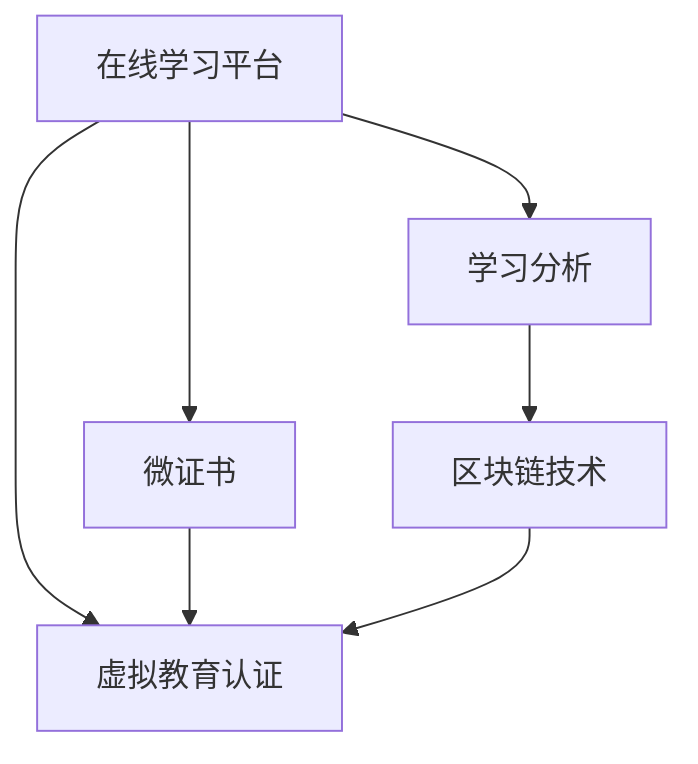

                 

# 虚拟教育认证:全球脑时代的学历学位体系

## 1. 背景介绍

### 1.1 问题由来

在信息爆炸、知识更迭加速的全球脑时代，教育形式正发生深刻变革。传统以校内线下教学为主的学历学位体系，逐渐显示出其局限性。受疫情影响，全球线上教育需求激增，虚拟教育体系的价值被进一步凸显。如何构建更高效、更灵活、更个性化的虚拟教育体系，成为了各国教育机构和学术界关注的焦点。

### 1.2 问题核心关键点

虚拟教育认证的核心在于通过数字化技术，建立一种基于学生在线学习表现的新型学历学位体系。这一体系旨在打破时间和空间的限制，允许学生通过自主学习获取认可的学历学位。相较于传统的线下认证体系，虚拟教育认证更加灵活多样，可以更好地适应全球化、信息化教育趋势。

### 1.3 问题研究意义

构建虚拟教育认证体系，对推动教育公平、促进终身学习、实现教育智能化具有重要意义：

1. **教育公平**：虚拟教育提供了更多优质的学习资源，无论身处何地，只要有互联网连接，就能获得高水平教育。
2. **终身学习**：鼓励个体在职业生涯的不同阶段持续学习，提升个人技能，应对未来职业变化。
3. **教育智能化**：通过数据分析和智能推荐，个性化定制学习路径，提升学习效率和效果。
4. **国际合作**：促进全球教育资源共享，推动各国教育机构和学术界的交流与合作。
5. **创新应用**：为虚拟现实、人工智能等新兴技术在教育中的应用提供新场景，推动教育技术创新。

## 2. 核心概念与联系

### 2.1 核心概念概述

- **虚拟教育认证（Virtual Education Credentialing）**：基于数字化技术，通过学习平台记录和评估学生的学习行为和表现，最终授予相应的学历学位。
- **在线学习平台（Online Learning Platform）**：提供虚拟教育认证所依托的学习资源、学习工具和评估机制。
- **学习分析（Learning Analytics）**：通过分析学生在线学习行为数据，评估其学习效果和个性化需求，指导后续学习路径。
- **微证书（Micro-Credentials）**：针对特定学习模块或技能培训颁发的数字证书，提供更具针对性的认证。
- **区块链技术（Blockchain）**：用于保障虚拟教育认证数据的不可篡改、透明性和可追溯性。

### 2.2 概念间的关系

虚拟教育认证体系的核心在于通过数字化技术，构建一种新型的学历学位认证方式。这一体系由在线学习平台、学习分析、微证书和区块链技术等关键组件组成，形成一个完整的生态系统。以下是一个Mermaid流程图，展示了这些概念间的关系：



在线学习平台提供了虚拟教育认证的基础环境，学习分析通过评估学生在线学习行为，指导学习路径和评估学习效果。微证书提供更为细粒度的认证，区块链技术保障了认证数据的不可篡改和透明性，最终通过虚拟教育认证完成学历学位的颁发。

## 3. 核心算法原理 & 具体操作步骤
### 3.1 算法原理概述

虚拟教育认证的算法原理主要基于学习分析技术和区块链技术。其中，学习分析通过收集和分析学生在线学习数据，评估其学习效果和能力。区块链技术则用于保障数据的安全、透明和不可篡改性。

学习分析的核心算法包括行为分析（Behavior Analysis）、绩效评估（Performance Evaluation）和个性化推荐（Personalized Recommendation）。行为分析主要评估学生在学习平台上的活动频率、时长和互动程度，绩效评估则通过测试和作业等形式，量化学生的学习成果。个性化推荐则是通过学习分析结果，为学生推荐适合的学习资源和路径。

区块链技术的核心原理包括分布式账本（Distributed Ledger）、共识机制（Consensus Mechanism）和智能合约（Smart Contracts）。分布式账本记录所有学习行为和成绩，共识机制保障数据的透明性和不可篡改性，智能合约则用于自动化和可靠化虚拟教育认证过程。

### 3.2 算法步骤详解

虚拟教育认证的算法步骤可以分为以下几个阶段：

1. **数据收集**：通过在线学习平台，收集学生的学习行为数据，包括登录时间、学习时长、课程完成情况等。
2. **行为分析**：利用机器学习算法，对学生行为数据进行分析，评估其学习积极性和效果。
3. **绩效评估**：通过测试和作业等形式，量化学生的学习成果，评估其知识掌握程度。
4. **个性化推荐**：根据学习分析结果，为学生推荐适合的学习资源和路径，优化学习效果。
5. **数据上链**：将学生的学习行为和成绩数据，存储在区块链上，确保数据透明性和不可篡改性。
6. **虚拟认证**：通过区块链技术，自动化完成虚拟教育认证过程，颁发学历学位证书。

### 3.3 算法优缺点

虚拟教育认证体系的算法具有以下优点：

- **灵活多样**：允许学生自主选择学习路径和时间，灵活适应个体差异。
- **透明公正**：基于客观数据分析和区块链技术，确保认证过程的透明性和公正性。
- **实时更新**：通过持续收集和分析学习数据，实时更新学生的学习状态和成果。

同时，也存在一些局限性：

- **数据隐私**：学生的在线学习数据涉及个人隐私，需要采取有效的数据保护措施。
- **技术门槛**：虚拟教育认证涉及复杂的技术体系，对技术开发和运维要求较高。
- **标准化问题**：不同平台和机构之间的认证数据可能存在差异，需要建立统一的标准。

### 3.4 算法应用领域

虚拟教育认证体系的应用领域广泛，涵盖以下方面：

- **高等教育**：通过虚拟教育认证，提供灵活的学位课程，支持终身学习。
- **职业教育**：为技能培训提供认证，提升职业竞争力。
- **继续教育**：支持成人教育，满足工作后的继续教育需求。
- **企业培训**：为员工提供职业培训认证，提升员工技能。
- **在线教育**：为在线课程提供认证，增强课程的权威性和吸引力。

## 4. 数学模型和公式 & 详细讲解 & 举例说明

### 4.1 数学模型构建

虚拟教育认证的数学模型主要包含以下几个部分：

- **学生行为模型**：通过时间序列分析，评估学生的学习频率和时长。
- **学习效果模型**：通过回归分析，量化学生的学习成果。
- **个性化推荐模型**：通过协同过滤和深度学习，推荐适合的学习资源。
- **数据安全模型**：通过加密和分布式账本技术，保障数据的安全性和不可篡改性。

### 4.2 公式推导过程

以学习效果模型为例，假设学生在学习平台上的行为数据为 $x = (x_1, x_2, ..., x_n)$，其中 $x_i$ 表示第 $i$ 天的学习行为数据。设 $y$ 为学生的最终成绩，$w$ 为模型的权重向量。则学习效果模型的线性回归公式为：

$$
y = wx + b
$$

其中 $b$ 为截距，$w$ 为权重向量。通过对 $x$ 和 $y$ 进行训练，求得最优的 $w$ 和 $b$。

### 4.3 案例分析与讲解

假设某在线教育平台记录了一名学生的学习行为数据，其中每天的学习时长、测试成绩和最终成绩如下表所示：

| 日期       | 学习时长 | 测试成绩 | 最终成绩 |
|------------|---------|---------|---------|
| 2023-01-01 | 2.5     | 85      | 90      |
| 2023-01-02 | 3.0     | 90      | 95      |
| 2023-01-03 | 1.5     | 75      | 80      |
| 2023-01-04 | 3.0     | 85      | 90      |
| 2023-01-05 | 2.0     | 80      | 85      |
| 2023-01-06 | 4.0     | 95      | 95      |

通过以上数据，可以使用线性回归模型计算学生的学习效果。以学习时长为自变量 $x_i$，最终成绩为因变量 $y$，利用最小二乘法求解最优的 $w$ 和 $b$，得到学习效果模型为：

$$
y = 0.5x + 40
$$

通过该模型，可以对学生的学习行为进行预测和评估，为其提供个性化的学习建议。

## 5. 项目实践：代码实例和详细解释说明

### 5.1 开发环境搭建

为了实践虚拟教育认证，我们需要搭建一个完整的开发环境。以下是主要步骤：

1. **选择编程语言和框架**：选择Python作为主要开发语言，使用TensorFlow或PyTorch框架进行模型训练和预测。
2. **安装依赖包**：安装TensorFlow或PyTorch，以及相关的数据处理和机器学习库，如Pandas、NumPy、Scikit-learn等。
3. **搭建学习平台**：使用Django等框架搭建在线学习平台，提供课程资源和评估工具。
4. **配置区块链**：选择Ethereum等区块链平台，搭建虚拟教育认证的区块链网络，记录和验证学生的学习数据。

### 5.2 源代码详细实现

以下是一个简单的虚拟教育认证系统的代码实现，包括学习分析、区块链认证和个性化推荐模块。

**学习分析模块**：

```python
import pandas as pd
from sklearn.linear_model import LinearRegression

def analyze_learning_behavior(data):
    # 将学习行为数据按天分组，计算平均学习时长
    grouped_data = data.groupby('date')['study_hours'].mean()
    # 使用线性回归模型，预测最终成绩
    model = LinearRegression().fit(grouped_data.values.reshape(-1, 1), data['final_grade'].values)
    return model.predict(grouped_data.index.reshape(-1, 1)), model.coef_[0]

# 假设学习行为数据如下
data = pd.DataFrame({
    'date': ['2023-01-01', '2023-01-02', '2023-01-03', '2023-01-04', '2023-01-05', '2023-01-06'],
    'study_hours': [2.5, 3.0, 1.5, 3.0, 2.0, 4.0],
    'final_grade': [90, 95, 80, 90, 85, 95]
})

predicted_scores, learning_rate = analyze_learning_behavior(data)
print('预测最终成绩：', predicted_scores)
print('学习效果系数：', learning_rate)
```

**区块链认证模块**：

```python
from web3 import Web3, HTTPProvider

# 连接Ethereum主网
provider = HTTPProvider('https://mainnet.infura.io/v3/{your_api_key}')
w3 = Web3(provider)

# 创建智能合约
contract = w3.eth.contract(
    address='0x1234567890', 
    abi='your_ABI'
)

# 向区块链上提交学习数据
def submit_learning_data(study_hours, test_score, final_grade):
    tx = {
        'type': 'raw',
        'data': '0x{study_hours:04x}00000000000000000000000000000000000000000000000000000000000000000000000000000000000000000000000000000000000000000000000000000000000000000000000000000000000000000000000000000000000000000000000000000000000000000000000000000000000000000000000000000000000000000000000000000000000000000000000000000000000000000000000000000000000000000000000000000000000000000000000000000000000000000000000000000000000000000000000000000000000000000000000000000000000000000000000000000000000000000000000000000000000000000000000000000000000000000000000000000000000000000000000000000000000000000000000000000000000000000000000000000000000000000000000000000000000000000000000000000000000000000000000000000000000000000000000000000000000000000000000000000000000000000000000000000000000000000000000000000000000000000000000000000000000000000000000000000000000000000000000000000000000000000000000000000000000000000000000000000000000000000000000000000000000000000000000000000000000000000000000000000000000000000000000000000000000000000000000000000000000000000000000000000000000000000000000000000000000000000000000000000000000000000000000000000000000000000000000000000000000000000000000000000000000000000000000000000000000000000000000000000000000000000000000000000000000000000000000000000000000000000000000000000000000000000000000000000000000000000000000000000000000000000000000000000000000000000000000000000000000000000000000000000000000000000000000000000000000000000000000000000000000000000000000000000000000000000000000000000000000000000000000000000000000000000000000000000000000000000000000000000000000000000000000000000000000000000000000000000000000000000000000000000000000000000000000000000000000000000000000000000000000000000000000000000000000000000000000000000000000000000000000000000000000000000000000000000000000000000000000000000000000000000000000000000000000000000000000000000000000000000000000000000000000000000000000000000000000000000000000000000000000000000000000000000000000000000000000000000000000000000000000000000000000000000000000000000000000000000000000000000000000000000000000000000000000000000000000000000000000000000000000000000000000000000000000000000000000000000000000000000000000000000000000000000000000000000000000000000000000000000000000000000000000000000000000000000000000000000000000000000000000000000000000000000000000000000000000000000000000000000000000000000000000000000000000000000000000000000000000000000000000000000000000000000000000000000000000000000000000000000000000000000000000000000000000000000000000000000000000000000000000000000000000000000000000000000000000000000000000000000000000000000000000000000000000000000000000000000000000000000000000000000000000000000000000000000000000000000000000000000000000000000000000000000000000000000000000000000000000000000000000000000000000000000000000000000000000000000000000000000000000000000000000000000000000000000000000000000000000000000000000000000000000000000000000000000000000000000000000000000000000000000000000000000000000000000000000000000000000000000000000000000000000000000000000000000000000000000000000000000000000000000000000000000000000000000000000000000000000000000000000000000000000000000000000000000000000000000000000000000000000000000000000000000000000000000000000000000000000000000000000000000000000000000000000000000000000000000000000000000000000000000000000000000000000000000000000000000000000000000000000000000000000000000000000000000000000000000000000000000000000000000000000000000000000000000000000000000000000000000000000000000000000000000000000000000000000000000000000000000000000000000000000000000000000000000000000000000000000000000000000000000000000000000000000000000000000000000000000000000000000000000000000000000000000000000000000000000000000000000000000000000000000000000000000000000000000000000000000000000000000000000000000000000000000000000000000000000000000000000000000000000000000000000000000000000000000000000000000000000000000000000000000000000000000000000000000000000000000000000000000000000000000000000000000000000000000000000000000000000000000000000000000000000000000000000000000000000000000000000000000000000000000000000000000000000000000000000000000000000000000000000000000000000000000000000000000000000000000000000000000000000000000000000000000000000000000000000000000000000000000000000000000000000000000000000000000000000000000000000000000000000000000000000000000000000000000000000000000000000000000000000000000000000000000000000000000000000000000000000000000000000000000000000000000000000000000000000000000000000000000000000000000000000000000000000000000000000000000000000000000000000000000000000000000000000000000000000000000000000000000000000000000000000000000000000000000000000000000000000000000000000000000000000000000000000000000000000000000000000000000000000000000000000000000000000000000000000000000000000000000000000000000000000000000000000000000000000000000000000000000000000000000000000000000000000000000000000000000000000000000000000000000000000000000000000000000000000000000000000000000000000000000000000000000000000000000000000000000000000000000000000000000000000000000000000000000000000000000000000000000000000000000000000000000000000000000000000000000000000000000000000000000000000000000000000000000000000000000000000000000000000000000000000000000000000000000000000000000000000000000000000000000000000000000000000000000000000000000000000000000000000000000000000000000000000000000000000000000000000000000000000000000000000000000000000000000000000000000000000000000000000000000000000000000000000000000000000000000000000000000000000000000000000000000000000000000000000000000000000000000000000000000000000000000000000000000000000000000000000000000000000000000000000000000000000000000000000000000000000000000000000000000000000000000000000000000000000000000000000000000000000000000000000000000000000000000000000000000000000000000000000000000000000000000000000000000000000000000000000000000000000000000000000000000000000000000000000000000000000000000000000000000000000000000000000000000000000000000000000000000000000000000000000000000000000000000000000000000000000000000000000000000000000000000000000000000000000000000000000000000000000000000000000000000000000000000000000000000000000000000000000000000000000000000000000000000000000000000000000000000000000000000000000000000000000000000000000000000000000000000000000000000000000000000000000000000000000000000000000000000000000000000000000000000000000000000000000000000000000000000000000000000000000000000000000000000000000000000000000000000000000000000000000000000000000000000000000000000000000000

