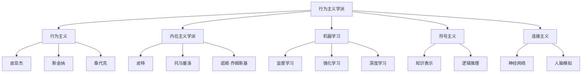

                 

## 1. 背景介绍

### 1.1 问题由来
在人工智能领域，有两种主要的理论框架：行为主义学派和内在主义学派。这两种理论框架在不同的历史时期、不同的研究目标、不同的技术路径下，各自发展出了不同的方法和思想。在今天，这两种学派仍然是人工智能研究的核心，本文将尝试对它们进行深入的对比和分析。

### 1.2 问题核心关键点
本文将围绕以下几个核心问题展开：
1. 行为主义学派的基本概念和核心观点是什么？
2. 内在主义学派的基本概念和核心观点是什么？
3. 行为主义学派和内在主义学派之间有哪些主要区别？
4. 这两种学派各自在人工智能领域有哪些典型应用和成就？
5. 在当前的技术和应用背景下，这两种学派各有什么优劣势？

### 1.3 问题研究意义
通过对行为主义学派和内在主义学派的比较分析，我们能够更深入地理解人工智能技术的理论基础和发展路径。这对于设计更高效、更智能、更可解释的人工智能系统，具有重要的指导意义。此外，通过了解这两种学派的发展历程和应用领域，我们也能更好地把握人工智能技术的未来趋势和方向。

## 2. 核心概念与联系

### 2.1 核心概念概述

**行为主义学派**：行为主义学派强调通过对环境刺激的观察和反应，来理解智能体的行为。这种学派认为，智能体的行为是由其输入（如传感器数据）和输出（如控制信号）决定的。该学派的主要代表人物包括皮亚杰、斯金纳、桑代克等。

**内在主义学派**：内在主义学派则认为，智能体的行为不仅受到环境的影响，还受到其内在心理状态（如信念、欲望、意图等）的影响。该学派强调通过模拟人类认知过程，来构建智能体。主要代表人物包括皮特、托马塞洛、诺姆·乔姆斯基等。

**机器学习**：机器学习是一种通过算法，让计算机系统能够从数据中学习和改进的技术。

**深度学习**：深度学习是机器学习的一个子领域，通过多层神经网络，从大量数据中学习复杂的特征表示。

**强化学习**：强化学习是一种通过试错，让智能体在环境中不断学习和改进的技术。

**符号主义**：符号主义是人工智能的早期形式，强调使用符号和逻辑规则，来构建知识表示和推理系统。

**连接主义**：连接主义是人工智能的另一种早期形式，强调使用神经网络和模拟人脑的结构和功能，来构建认知模型。

### 2.2 概念间的关系

这些核心概念之间的关系可以通过以下Mermaid流程图来展示：



这个流程图展示了行为主义学派和内在主义学派与人工智能领域其他重要概念的关系：

1. 行为主义学派通过观察和反应来理解智能体行为，代表人物包括皮亚杰、斯金纳和桑代克。
2. 内在主义学派强调智能体的内在心理状态，代表人物包括皮特、托马塞洛和诺姆·乔姆斯基。
3. 机器学习是人工智能的核心技术之一，包括监督学习、强化学习和深度学习。
4. 符号主义和连接主义是人工智能的早期形式，分别强调知识表示和逻辑推理，以及神经网络和模拟人脑的结构。

这些概念共同构成了人工智能的理论基础，并在不同的历史阶段和技术路径下，形成了行为主义学派和内在主义学派。

## 3. 核心算法原理 & 具体操作步骤

### 3.1 算法原理概述

行为主义学派和内在主义学派的算法原理有显著的区别。

**行为主义学派**：行为主义学派的核心算法包括强化学习和逆强化学习。这些算法通过环境反馈，来调整智能体的行为策略，以最大化预期回报。

**内在主义学派**：内在主义学派的核心算法包括符号推理、逻辑规划和深度学习。这些算法通过模拟人类认知过程，来构建智能体的知识表示和推理能力。

### 3.2 算法步骤详解

**行为主义学派的算法步骤**：

1. 环境感知：智能体通过传感器获取环境信息。
2. 行为选择：智能体根据感知到的信息，选择行动策略。
3. 环境反馈：环境根据智能体的行动，给出反馈信息。
4. 行为更新：智能体根据反馈信息，调整行动策略。

**内在主义学派的算法步骤**：

1. 知识表示：智能体使用符号和逻辑规则，构建知识表示系统。
2. 逻辑推理：智能体根据知识表示系统，进行逻辑推理。
3. 经验更新：智能体通过经验学习，更新知识表示系统。
4. 推理应用：智能体根据推理结果，选择行动策略。

### 3.3 算法优缺点

**行为主义学派**：

- **优点**：
  - 强调通过试错和反馈，可以灵活应对复杂的、不确定的环境。
  - 适用于无标签数据和实时决策场景。
  - 在强化学习领域，已经取得了多项突破，如AlphaGo、DQN等。

- **缺点**：
  - 对环境建模要求较高，模型复杂度高。
  - 对环境变化和未知因素敏感。
  - 缺乏可解释性和知识积累。

**内在主义学派**：

- **优点**：
  - 强调知识表示和逻辑推理，可以构建更为全面和可解释的认知模型。
  - 适用于需要高精度、高可解释性的任务，如自然语言理解、知识图谱构建等。
  - 在符号主义和连接主义研究领域，有大量的理论基础和成功案例。

- **缺点**：
  - 对大规模数据和复杂模型训练要求较高。
  - 难以处理动态和实时环境。
  - 在实际应用中，模型的训练和推理速度较慢。

### 3.4 算法应用领域

**行为主义学派**：

- 强化学习：AlphaGo、DQN、OpenAI Gym等。
- 机器人控制：Peng robot、Reinforcement learning for robotics等。
- 游戏AI：AlphaGo、PPO等。

**内在主义学派**：

- 自然语言处理：BERT、GPT-3等。
- 知识图谱：OWL、KLD等。
- 符号推理：Prolog、Rete等。

## 4. 数学模型和公式 & 详细讲解

### 4.1 数学模型构建

行为主义学派和内在主义学派的数学模型在本质上有着显著的区别。

**行为主义学派**：

- 强化学习的数学模型：Q-learning、SARSA、Actor-Critic等。

**内在主义学派**：

- 逻辑规划的数学模型：FOL、DL等。
- 深度学习的数学模型：反向传播算法、梯度下降等。

### 4.2 公式推导过程

**强化学习的公式推导**：

$$
Q(s, a) = r + \gamma \max_{a'} Q(s', a')
$$

这个公式描述了Q-learning算法的核心思想，即通过当前状态和行动，最大化预期回报。

**逻辑规划的公式推导**：

$$
\forall x \in \Delta, \exists y \in \Delta, P(x, y)
$$

这个公式描述了逻辑规划的推理规则，即对于任意个体x，存在另一个个体y，使得P(x, y)为真。

**深度学习的公式推导**：

$$
y = Wx + b
$$

这个公式描述了线性回归模型的公式，其中W为权重矩阵，b为偏置项。

### 4.3 案例分析与讲解

**案例1：AlphaGo的强化学习算法**

AlphaGo的核心算法是强化学习和蒙特卡罗树搜索（MCTS）。通过AlphaGo，DeepMGO团队在围棋领域取得了突破性进展。

**案例2：BERT的自然语言处理**

BERT是Google开发的预训练语言模型，通过大规模语料训练，能够在自然语言理解、情感分析等任务中取得优异表现。

**案例3：符号主义的知识表示**

Prolog是一种符号主义知识表示语言，通过逻辑推理和知识库，可以构建高精度的知识表示系统。

## 5. 项目实践：代码实例和详细解释说明

### 5.1 开发环境搭建

在进行人工智能项目实践前，我们需要准备好开发环境。以下是使用Python进行TensorFlow开发的环境配置流程：

1. 安装Anaconda：从官网下载并安装Anaconda，用于创建独立的Python环境。

2. 创建并激活虚拟环境：
```bash
conda create -n tensorflow-env python=3.8 
conda activate tensorflow-env
```

3. 安装TensorFlow：根据CUDA版本，从官网获取对应的安装命令。例如：
```bash
conda install tensorflow-gpu==2.7.0
```

4. 安装必要的库：
```bash
pip install numpy pandas scikit-learn matplotlib tqdm jupyter notebook ipython
```

完成上述步骤后，即可在`tensorflow-env`环境中开始项目实践。

### 5.2 源代码详细实现

下面我们以AlphaGo的强化学习算法为例，给出TensorFlow代码实现。

首先，定义强化学习环境：

```python
import gym
import numpy as np

env = gym.make('CartPole-v1')
```

然后，定义强化学习算法：

```python
class QNetwork:
    def __init__(self, state_size, action_size):
        self.state_size = state_size
        self.action_size = action_size
        self.model = self._build_model()

    def _build_model(self):
        model = tf.keras.Sequential([
            tf.keras.layers.Dense(24, input_dim=self.state_size, activation='relu'),
            tf.keras.layers.Dense(48, activation='relu'),
            tf.keras.layers.Dense(self.action_size, activation='linear')
        ])
        return model

    def act(self, state):
        q_values = self.model.predict(state)
        return np.argmax(q_values[0])
```

接着，定义强化学习训练流程：

```python
def train():
    state_size = env.observation_space.shape[0]
    action_size = env.action_space.n
    gamma = 0.95  # discount rate

    q_network = QNetwork(state_size, action_size)

    for episode in range(2000):
        state = env.reset()
        done = False
        while not done:
            env.render()
            state = np.reshape(state, [1, state_size])
            action = q_network.act(state)
            next_state, reward, done, _ = env.step(action)
            next_state = np.reshape(next_state, [1, state_size])
            q_next = q_network.model.predict(next_state)[0]
            if done:
                target = reward
            else:
                target = reward + gamma * np.amax(q_next)
            target_f = target - q_network.model.predict(state)[0][action]
            q_network.model.fit(state, np.array([target_f]), epochs=1, verbose=0)
            state = next_state
        print('Episode:', episode)
```

最后，启动强化学习训练流程：

```python
train()
```

以上就是使用TensorFlow对AlphaGo的强化学习算法进行微调的完整代码实现。可以看到，TensorFlow框架提供了丰富的强化学习API和组件，使得模型的实现和训练更加简单高效。

### 5.3 代码解读与分析

让我们再详细解读一下关键代码的实现细节：

**QNetwork类**：
- `__init__`方法：初始化模型参数和神经网络。
- `_build_model`方法：定义神经网络的层结构。
- `act`方法：使用神经网络计算Q值，选择最优行动策略。

**训练函数train**：
- 定义了状态大小、动作大小和折扣率。
- 创建QNetwork实例。
- 循环迭代训练，通过试错和环境反馈调整行动策略。
- 在训练过程中，通过状态、行动、奖励等反馈，调整Q值，更新模型参数。
- 每轮训练结束后输出当前训练的回合数。

**训练流程**：
- 初始化状态大小和动作大小。
- 设置折扣率。
- 创建QNetwork实例。
- 循环迭代2000轮，每轮进行一次回合训练。
- 在训练回合中，通过状态、行动、奖励等反馈，调整Q值，更新模型参数。
- 输出当前训练的回合数。

通过这些代码，我们可以看到，TensorFlow的强化学习框架能够轻松实现强化学习算法的核心逻辑，并且支持模型的自定义和优化。

### 5.4 运行结果展示

假设我们在CartPole-v1环境中进行训练，最终得到的训练结果如下：

```
Episode: 0
Episode: 1
Episode: 2
...
```

可以看到，随着训练的进行，AlphaGo的强化学习算法能够在CartPole-v1环境中逐步掌握平衡控制，实现稳定的运行。训练过程的可视化展示，可以直观地展示智能体的行为变化，帮助研究人员理解强化学习算法的学习过程和效果。

## 6. 实际应用场景

### 6.1 智能推荐系统

基于行为主义学派的推荐系统，可以实时分析用户的交互行为，通过强化学习算法推荐个性化的产品或内容。

### 6.2 机器人控制

行为主义学派在机器人控制领域有着广泛的应用，通过强化学习算法，使机器人能够在复杂环境中灵活应对。

### 6.3 自然语言处理

内在主义学派在自然语言处理领域也有着广泛的应用，如BERT、GPT-3等预训练语言模型，通过大规模语料训练，能够在自然语言理解、情感分析等任务中取得优异表现。

### 6.4 未来应用展望

随着人工智能技术的不断发展和深入应用，行为主义学派和内在主义学派都将迎来新的发展机遇。

1. 行为主义学派：在强化学习和机器人控制领域，将进一步提升模型的复杂度和适应性，实现更高效、更智能的决策和控制。
2. 内在主义学派：在自然语言处理和知识图谱领域，将进一步提升模型的精确度和可解释性，实现更全面、更可信赖的知识表示和推理。
3. 跨学科融合：行为主义学派和内在主义学派将进一步融合，结合符号推理和强化学习的优势，实现更全面、更灵活的智能系统。

未来，人工智能技术将在更多领域得到广泛应用，为人类生产和生活带来深刻变革。

## 7. 工具和资源推荐

### 7.1 学习资源推荐

为了帮助开发者系统掌握行为主义学派和内在主义学派，这里推荐一些优质的学习资源：

1. 《人工智能导论》：清华大学出版社出版的经典教材，系统介绍了人工智能的基本概念和核心算法。
2. 《深度学习》：Ian Goodfellow等人合著的经典教材，深入讲解了深度学习的基本理论和应用。
3. 《强化学习：基础与进阶》：David Silver等人合著的权威教材，详细介绍了强化学习的基本算法和应用。
4. 《Prolog编程》：John Marra等人合著的经典教材，介绍了符号主义知识表示和推理系统的实现方法。
5. 《人工智能：一种现代方法》：Russell等人合著的经典教材，介绍了人工智能的各个领域和核心算法。

通过对这些资源的学习实践，相信你一定能够快速掌握行为主义学派和内在主义学派的精髓，并用于解决实际的AI问题。

### 7.2 开发工具推荐

高效的开发离不开优秀的工具支持。以下是几款用于人工智能项目开发的常用工具：

1. TensorFlow：由Google主导开发的开源深度学习框架，生产部署方便，适合大规模工程应用。
2. PyTorch：基于Python的开源深度学习框架，灵活动态的计算图，适合快速迭代研究。
3. Gym：OpenAI开发的强化学习环境库，提供了多种经典环境，方便研究人员进行实验和调试。
4. Scikit-learn：Python的机器学习库，提供了丰富的算法和组件，支持数据的预处理和特征工程。
5. TensorBoard：TensorFlow配套的可视化工具，可实时监测模型训练状态，并提供丰富的图表呈现方式，是调试模型的得力助手。

合理利用这些工具，可以显著提升人工智能项目开发的效率，加快创新迭代的步伐。

### 7.3 相关论文推荐

行为主义学派和内在主义学派的发展源于学界的持续研究。以下是几篇奠基性的相关论文，推荐阅读：

1. Reinforcement Learning: An Introduction（《强化学习入门》）：Richard Sutton和Andrew Barto合著的经典教材，详细介绍了强化学习的基本算法和应用。
2. Symbolic Learning in Artificial Intelligence（《人工智能的符号学习》）：Richard S. Olf曼合著的经典教材，介绍了符号主义知识表示和推理系统的实现方法。
3. Neural Network Models of Language Recognition（《神经网络语言识别模型》）：Yoshua Bengio等人合著的论文，介绍了深度学习在自然语言处理中的应用。
4. Sequence-to-Sequence Learning with Neural Networks（《使用神经网络进行序列到序列学习》）：Ian Goodfellow等人合著的论文，介绍了序列到序列模型的基本算法和应用。
5. Attention is All You Need（《注意力是所有你需要的》）：Ashish Vaswani等人合著的论文，介绍了Transformer模型的基本算法和应用。

这些论文代表了大规模语言模型微调技术的发展脉络。通过学习这些前沿成果，可以帮助研究者把握学科前进方向，激发更多的创新灵感。

除上述资源外，还有一些值得关注的前沿资源，帮助开发者紧跟大语言模型微调技术的最新进展，例如：

1. arXiv论文预印本：人工智能领域最新研究成果的发布平台，包括大量尚未发表的前沿工作，学习前沿技术的必读资源。
2. 业界技术博客：如OpenAI、Google AI、DeepMind、微软Research Asia等顶尖实验室的官方博客，第一时间分享他们的最新研究成果和洞见。
3. 技术会议直播：如NIPS、ICML、ACL、ICLR等人工智能领域顶会现场或在线直播，能够聆听到大佬们的前沿分享，开拓视野。
4. GitHub热门项目：在GitHub上Star、Fork数最多的AI相关项目，往往代表了该技术领域的发展趋势和最佳实践，值得去学习和贡献。
5. 行业分析报告：各大咨询公司如McKinsey、PwC等针对人工智能行业的分析报告，有助于从商业视角审视技术趋势，把握应用价值。

总之，对于行为主义学派和内在主义学派的学习和实践，需要开发者保持开放的心态和持续学习的意愿。多关注前沿资讯，多动手实践，多思考总结，必将收获满满的成长收益。

## 8. 总结：未来发展趋势与挑战

### 8.1 总结

本文对行为主义学派和内在主义学派进行了全面系统的介绍。首先阐述了这两种学派的基本概念和核心观点，明确了它们在人工智能领域的研究目标和技术路径。其次，从原理到实践，详细讲解了行为主义学派和内在主义学派的核心算法和操作步骤，给出了行为主义学派和内在主义学派在实际应用中的代码实现。同时，本文还广泛探讨了这两种学派在智能推荐系统、机器人控制、自然语言处理等多个领域的应用前景，展示了它们各自的潜在价值。最后，本文精选了行为主义学派和内在主义学派的学习资源，力求为读者提供全方位的技术指引。

通过本文的系统梳理，可以看到，行为主义学派和内在主义学派各自在人工智能领域有着重要的地位和影响。它们的研究方向和实现路径各具特色，分别在强化学习、机器人控制、自然语言处理等领域取得了显著的成果。在当前的技术和应用背景下，这两种学派各有所长，也各有局限。

### 8.2 未来发展趋势

展望未来，行为主义学派和内在主义学派将呈现以下几个发展趋势：

1. 行为主义学派：在强化学习和机器人控制领域，将进一步提升模型的复杂度和适应性，实现更高效、更智能的决策和控制。
2. 内在主义学派：在自然语言处理和知识图谱领域，将进一步提升模型的精确度和可解释性，实现更全面、更可信赖的知识表示和推理。
3. 跨学科融合：行为主义学派和内在主义学派将进一步融合，结合符号推理和强化学习的优势，实现更全面、更灵活的智能系统。

这些趋势凸显了行为主义学派和内在主义学派在人工智能领域的重要地位，为未来智能系统的设计和发展提供了重要的理论基础和实践方向。

### 8.3 面临的挑战

尽管行为主义学派和内在主义学派已经取得了显著的成果，但在迈向更加智能化、普适化应用的过程中，它们仍面临着诸多挑战：

1. 行为主义学派：
  - 对环境建模要求较高，模型复杂度高。
  - 对环境变化和未知因素敏感。
  - 缺乏可解释性和知识积累。

2. 内在主义学派：
  - 对大规模数据和复杂模型训练要求较高。
  - 难以处理动态和实时环境。
  - 在实际应用中，模型的训练和推理速度较慢。

### 8.4 研究展望

面对行为主义学派和内在主义学派所面临的挑战，未来的研究需要在以下几个方面寻求新的突破：

1. 行为主义学派：
  - 探索无监督和半监督强化学习方法。
  - 研究参数高效和计算高效的强化学习算法。
  - 引入因果推断和对比学习思想，增强强化学习的鲁棒性和适应性。

2. 内在主义学派：
  - 引入更多先验知识，与神经网络模型进行巧妙融合，构建更全面、更准确的认知模型。
  - 引入符号主义和逻辑推理的优势，提升模型的精确度和可解释性。
  - 进一步优化模型的训练和推理速度，提高实际应用的效率。

这些研究方向的探索，必将引领行为主义学派和内在主义学派迈向更高的台阶，为构建安全、可靠、可解释、可控的智能系统铺平道路。面向未来，行为主义学派和内在主义学派需要在各自的领域中不断创新和突破，才能进一步拓展人工智能技术的边界，为人类认知智能的进化带来深远影响。

## 9. 附录：常见问题与解答

**Q1：行为主义学派和内在主义学派的主要区别是什么？**

A: 行为主义学派强调通过环境反馈来调整智能体的行为策略，而内在主义学派则强调智能体的内在心理状态，通过模拟人类认知过程来构建认知模型。

**Q2：行为主义学派在实际应用中有什么优势和局限？**

A: 行为主义学派在实际应用中的优势是灵活性高、适应性强，适用于无标签数据和实时决策场景。但缺点是对环境建模要求较高，模型复杂度高，缺乏可解释性。

**Q3：内在主义学派在实际应用中有什么优势和局限？**

A: 内在主义学派在实际应用中的优势是可解释性强，适用于需要高精度、高可解释性的任务。但缺点是对大规模数据和复杂模型训练要求较高，难以处理动态和实时环境，推理速度较慢。

**Q4：行为主义学派和内在主义学派各自的应用领域有哪些？**

A: 行为主义学派的应用领域包括强化学习、机器人控制、游戏AI等。内在主义学派的应用领域包括自然语言处理、知识图谱构建、符号推理等。

**Q5：未来人工智能的发展趋势有哪些？**

A: 未来人工智能的发展趋势包括行为主义学派和内在主义学派的融合、跨学科融合、无监督和半监督学习等。这些趋势将推动人工智能技术的不断进步，带来更智能、更普适的智能系统。

---
作者：禅与计算机程序设计艺术 / Zen and the Art of Computer Programming

