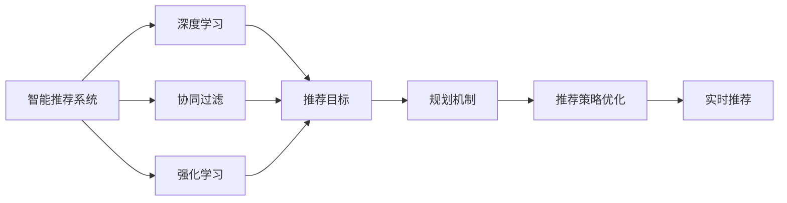
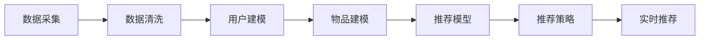
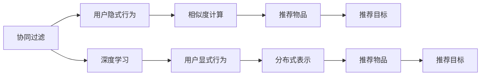
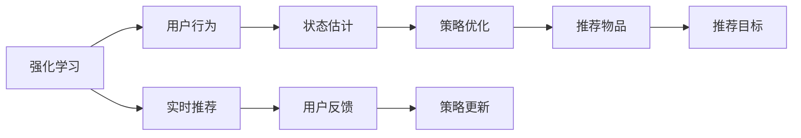
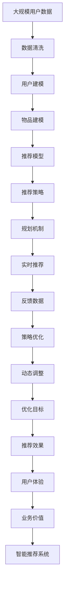

                 

# 规划机制在智能推荐系统中的应用

> 关键词：智能推荐系统,规划机制,协同过滤,深度学习,强化学习

## 1. 背景介绍

### 1.1 问题由来
在互联网时代，智能推荐系统已经成为各大电商、视频、社交等平台的核心竞争力。通过推荐系统，用户能够快速获取感兴趣的内容，提升用户体验；平台则能够增加用户粘性，提高商业价值。

随着推荐系统从基于规则到基于数据挖掘，再到机器学习的发展，推荐算法也在不断演进。目前主流的推荐算法包括协同过滤、深度学习和强化学习等。这些算法能够综合用户行为、物品属性、时间序列等特征，精准预测用户对物品的喜好。然而，这些算法也存在各自的局限性：

- 协同过滤算法可以捕捉用户间隐式的相似性，但面临数据稀疏性和冷启动等问题。
- 深度学习算法通过学习用户和物品的分布式表示，能够处理高维度数据，但需要大量标注数据和强大的计算资源。
- 强化学习算法能够模拟用户与物品的交互过程，优化个性化推荐策略，但难以对隐式用户反馈进行建模。

基于以上局限性，规划机制应运而生。规划机制通过动态优化推荐策略，能够适应用户行为变化，提升推荐效果。本文将详细探讨规划机制在智能推荐系统中的应用，旨在帮助开发者系统掌握规划机制的理论基础和实践技巧，以期推动推荐系统技术的进一步发展。

### 1.2 问题核心关键点
规划机制在推荐系统中的应用，旨在通过动态调整推荐策略，提升推荐效果和用户体验。其主要思路包括：

- 目标优化：通过明确推荐目标，如点击率、转化率、停留时间等，动态调整推荐策略，最大化目标指标。
- 约束优化：考虑推荐系统面临的用户、物品和上下文约束，如用户隐私、物品属性、时序特征等，平衡推荐目标与约束条件。
- 学习算法：运用优化算法，如线性规划、协同过滤、深度学习和强化学习等，实现推荐策略的动态优化。

通过明确目标、约束和算法，规划机制能够根据用户行为变化，实时调整推荐策略，提升推荐系统的智能度和精准度。

### 1.3 问题研究意义
规划机制在推荐系统中的应用，对于提升推荐效果、优化用户体验、加速推荐系统技术产业化具有重要意义：

1. **提升推荐效果**：规划机制通过动态优化推荐策略，可以更好地适应用户行为变化，精准预测用户偏好，提高推荐系统的准确率。
2. **优化用户体验**：通过实时调整推荐内容，规划机制能够提供个性化、多样化的推荐，提升用户满意度和忠诚度。
3. **加速技术产业化**：规划机制的引入，使得推荐系统能够更灵活地应对各类应用场景，加速其在电商、视频、社交等行业的落地应用。

## 2. 核心概念与联系

### 2.1 核心概念概述

为更好地理解规划机制在智能推荐系统中的应用，本节将介绍几个密切相关的核心概念：

- **智能推荐系统**：基于用户行为数据，通过推荐算法为用户推荐个性化物品的系统。常见的推荐算法包括协同过滤、深度学习和强化学习等。
- **协同过滤**：利用用户之间的相似性进行推荐，可以进一步分为基于用户的协同过滤和基于物品的协同过滤。
- **深度学习**：通过多层神经网络模型，学习用户和物品的分布式表示，从而实现更精准的推荐。
- **强化学习**：通过模拟用户与物品的交互过程，优化推荐策略，提高推荐效果。
- **规划机制**：动态调整推荐策略，最大化推荐目标，同时考虑约束条件，平衡目标与约束。

这些核心概念之间的逻辑关系可以通过以下Mermaid流程图来展示：



这个流程图展示了一些主要概念之间的联系：

1. 智能推荐系统基于多种推荐算法。
2. 协同过滤、深度学习和强化学习等算法，都可以用于构建智能推荐系统。
3. 推荐目标（如点击率、转化率）和约束（如用户隐私、物品属性）会影响推荐策略的优化过程。
4. 规划机制通过优化推荐策略，最大化推荐目标，并考虑约束条件。
5. 规划机制生成的推荐策略，通过实时推荐服务，实现个性化推荐。

### 2.2 概念间的关系

这些核心概念之间存在着紧密的联系，形成了智能推荐系统的完整生态系统。下面我们通过几个Mermaid流程图来展示这些概念之间的关系。

#### 2.2.1 推荐系统的构建过程



这个流程图展示了从数据采集到实时推荐的全过程。推荐系统首先采集用户行为数据，并进行清洗，然后构建用户和物品的模型，选择推荐模型，设计推荐策略，最后通过实时推荐服务，实现个性化推荐。

#### 2.2.2 协同过滤与深度学习的对比



这个流程图展示了协同过滤和深度学习的主要区别。协同过滤基于用户之间的相似性进行推荐，而深度学习通过学习用户和物品的分布式表示，能够处理高维度数据。协同过滤适用于数据稀疏、用户行为较为隐式的情况，而深度学习则适用于有大量用户行为数据的情况。

#### 2.2.3 强化学习在推荐系统中的应用



这个流程图展示了强化学习在推荐系统中的应用。强化学习通过模拟用户与物品的交互过程，优化推荐策略，提高推荐效果。在实际应用中，推荐系统会根据用户反馈（如点击、购买等），动态调整推荐策略，提升推荐效果。

### 2.3 核心概念的整体架构

最后，我们用一个综合的流程图来展示这些核心概念在智能推荐系统中的应用：



这个综合流程图展示了从数据采集到实时推荐，再到业务价值提升的完整过程。大规模用户数据经过清洗，用于构建用户和物品的模型，选择推荐模型和策略，引入规划机制动态调整推荐策略，并通过实时推荐服务实现个性化推荐。实时反馈数据用于动态调整推荐策略，最终提升推荐效果和用户体验，实现业务价值的提升。

## 3. 核心算法原理 & 具体操作步骤
### 3.1 算法原理概述

规划机制在智能推荐系统中的应用，主要基于动态优化推荐策略，最大化推荐目标，同时考虑约束条件。其核心思想是：通过优化算法，动态调整推荐策略，提升推荐效果和用户体验。

形式化地，假设推荐系统面对的用户数据为 $D=\{(x_i,y_i)\}_{i=1}^N, x_i \in \mathcal{X}, y_i \in \mathcal{Y}$，其中 $\mathcal{X}$ 为用户行为特征，$\mathcal{Y}$ 为推荐目标。推荐目标可以是点击率、转化率、停留时间等。

定义推荐策略为 $f$，则推荐策略对应的期望收益为 $E[R(f|D)]$。在考虑用户隐私、物品属性、时序特征等约束条件下，规划机制的目标是找到最优的推荐策略 $f^*$，使得：

$$
f^* = \mathop{\arg\min}_{f} E[R(f|D)] + \text{Reg}(f)
$$

其中 $\text{Reg}(f)$ 为约束条件的惩罚项，用于约束推荐策略的合理性。

通过梯度下降等优化算法，规划机制不断更新推荐策略 $f$，最小化期望收益与约束惩罚项之和，得到最优的推荐策略 $f^*$。由于 $f$ 已经通过协同过滤、深度学习和强化学习等方法获得了部分推荐知识，因此即便在小规模数据集 $D$ 上进行优化，也能较快收敛到理想的推荐策略。

### 3.2 算法步骤详解

规划机制在智能推荐系统中的应用，一般包括以下几个关键步骤：

**Step 1: 数据准备与模型初始化**
- 收集用户行为数据 $D=\{(x_i,y_i)\}_{i=1}^N$，进行数据清洗和预处理。
- 选择合适的推荐模型 $M_{\theta}$，如协同过滤模型、深度学习模型或强化学习模型，作为初始化参数。

**Step 2: 构建推荐策略**
- 根据推荐目标和约束条件，设计推荐策略 $f$，如协同过滤策略、深度学习策略或强化学习策略。
- 将推荐策略 $f$ 作为优化目标函数 $E[R(f|D)]$ 的一部分。

**Step 3: 引入约束条件**
- 定义约束条件 $\text{Reg}(f)$，如用户隐私、物品属性、时序特征等。
- 将约束条件 $\text{Reg}(f)$ 作为优化目标函数的一部分。

**Step 4: 优化推荐策略**
- 选择合适的优化算法，如梯度下降、协同过滤、深度学习或强化学习算法，最小化优化目标函数。
- 通过迭代优化，动态调整推荐策略 $f$，最大化推荐效果。

**Step 5: 实时推荐与反馈优化**
- 通过实时推荐服务，根据推荐策略 $f$ 为用户推荐物品。
- 根据用户反馈（如点击、购买等），更新推荐策略 $f$，实现动态优化。

**Step 6: 持续优化与部署**
- 定期重新收集数据，重新训练模型和优化推荐策略，保持系统性能。
- 将优化后的推荐策略 $f$ 部署到实际应用中，提供个性化推荐服务。

以上是规划机制在智能推荐系统中的典型流程。在实际应用中，还需要针对具体任务的特点，对优化过程的各个环节进行优化设计，如改进训练目标函数，引入更多的约束条件，搜索最优的超参数组合等，以进一步提升推荐系统的性能。

### 3.3 算法优缺点

规划机制在智能推荐系统中的应用，具有以下优点：

1. **动态适应性强**：规划机制能够根据用户行为变化，动态调整推荐策略，适应不同的应用场景。
2. **多目标优化**：规划机制能够同时考虑推荐目标和约束条件，平衡不同的需求。
3. **灵活性高**：规划机制可以通过引入不同的推荐算法，适应不同类型的推荐任务。

同时，规划机制也存在一定的局限性：

1. **计算复杂度高**：规划机制的优化过程通常较为复杂，需要大量的计算资源和时间。
2. **模型复杂度高**：规划机制需要引入多个模型（如协同过滤、深度学习、强化学习等），模型复杂度高。
3. **数据依赖性大**：规划机制的优化效果高度依赖于用户行为数据，数据质量直接影响推荐效果。

尽管存在这些局限性，但就目前而言，规划机制仍是最主流推荐系统动态优化的手段之一。未来相关研究的重点在于如何进一步降低计算复杂度，提高模型效率，同时保证推荐效果。

### 3.4 算法应用领域

规划机制在智能推荐系统中的应用，已经广泛应用于各类推荐场景中，例如：

- 电商推荐：根据用户浏览历史、购买记录等行为数据，为用户推荐相关商品。
- 视频推荐：根据用户观看历史、评分记录等行为数据，为用户推荐相关视频内容。
- 社交推荐：根据用户互动历史、兴趣偏好等行为数据，为用户推荐相关用户或内容。
- 新闻推荐：根据用户阅读历史、点击记录等行为数据，为用户推荐相关新闻内容。

除了这些经典应用场景外，规划机制也被创新性地应用到更多领域中，如多臂赌博机、广告投放、游戏推荐等，为推荐系统技术带来了新的突破。

## 4. 数学模型和公式 & 详细讲解  
### 4.1 数学模型构建

本节将使用数学语言对规划机制在智能推荐系统中的应用进行更加严格的刻画。

记用户行为数据为 $D=\{(x_i,y_i)\}_{i=1}^N, x_i \in \mathcal{X}, y_i \in \mathcal{Y}$。推荐策略为 $f$，推荐模型为 $M_{\theta}$。

定义推荐目标为 $R(f|D)$，如点击率、转化率、停留时间等。定义约束条件为 $\text{Reg}(f)$，如用户隐私、物品属性、时序特征等。

规划机制的目标是最大化推荐目标与约束惩罚项之和，即：

$$
f^* = \mathop{\arg\min}_{f} E[R(f|D)] + \text{Reg}(f)
$$

在实际应用中，通常使用梯度下降等优化算法求解上述优化问题。设学习率为 $\eta$，则参数更新公式为：

$$
\theta \leftarrow \theta - \eta \nabla_{\theta}E[R(f|D)] - \eta\lambda \nabla_{\theta}\text{Reg}(f)
$$

其中 $\nabla_{\theta}E[R(f|D)]$ 为期望收益的梯度，$\nabla_{\theta}\text{Reg}(f)$ 为约束条件的梯度。

### 4.2 公式推导过程

以下我们以点击率优化为例，推导期望收益函数及其梯度的计算公式。

假设推荐模型为 $M_{\theta}:\mathcal{X} \rightarrow \mathcal{Y}$，其中 $\mathcal{X}$ 为输入空间，$\mathcal{Y}$ 为输出空间，$\theta \in \mathbb{R}^d$ 为模型参数。假设用户行为数据为 $D=\{(x_i,y_i)\}_{i=1}^N, x_i \in \mathcal{X}, y_i \in \mathcal{Y}$。

定义点击率为 $R(f|D)$，即点击行为占总行为的比例：

$$
R(f|D) = \frac{1}{N}\sum_{i=1}^N f(x_i)
$$

其中 $f(x_i)$ 为推荐模型 $M_{\theta}$ 在用户行为 $x_i$ 上的输出。

在实际应用中，我们通常使用二元交叉熵作为损失函数，计算期望收益的梯度：

$$
\nabla_{\theta}E[R(f|D)] = \frac{1}{N}\sum_{i=1}^N \nabla_{\theta}f(x_i) \cdot \text{one-hot}(y_i)
$$

其中 $\text{one-hot}(y_i)$ 为点击行为的热编码向量。

对于约束条件，我们通常使用L2正则化等惩罚项，计算约束条件的梯度：

$$
\nabla_{\theta}\text{Reg}(f) = \lambda \cdot \nabla_{\theta}\|f\|^2
$$

其中 $\lambda$ 为正则化系数，$\|f\|^2$ 为推荐策略 $f$ 的平方范数。

在得到期望收益和约束条件的梯度后，即可带入参数更新公式，完成模型的迭代优化。重复上述过程直至收敛，最终得到适应推荐系统动态优化后的推荐策略 $f^*$。

## 5. 项目实践：代码实例和详细解释说明
### 5.1 开发环境搭建

在进行推荐系统规划机制的开发时，我们需要准备好开发环境。以下是使用Python进行TensorFlow开发的环境配置流程：

1. 安装Anaconda：从官网下载并安装Anaconda，用于创建独立的Python环境。

2. 创建并激活虚拟环境：
```bash
conda create -n tf-env python=3.8 
conda activate tf-env
```

3. 安装TensorFlow：根据CUDA版本，从官网获取对应的安装命令。例如：
```bash
conda install tensorflow tensorflow-gpu -c tf -c conda-forge
```

4. 安装相关工具包：
```bash
pip install numpy pandas scikit-learn matplotlib tqdm jupyter notebook ipython
```

完成上述步骤后，即可在`tf-env`环境中开始规划机制的开发实践。

### 5.2 源代码详细实现

下面我们以电商推荐系统为例，给出使用TensorFlow进行协同过滤规划机制的代码实现。

首先，定义协同过滤模型的输入和输出：

```python
import tensorflow as tf

class CollaborativeFiltering:
    def __init__(self, num_users, num_items, num_factors):
        self.num_users = num_users
        self.num_items = num_items
        self.num_factors = num_factors
        self.user_factors = tf.Variable(tf.random.normal([num_users, num_factors]))
        self.item_factors = tf.Variable(tf.random.normal([num_items, num_factors]))

    def predict(self, user_id, item_id):
        user_factor = tf.reshape(self.user_factors[user_id], [-1, 1])
        item_factor = tf.reshape(self.item_factors[item_id], [1, -1])
        return tf.reduce_sum(tf.multiply(user_factor, item_factor))

    def compute_loss(self, user_id, item_id, rating, rating_loss):
        pred = self.predict(user_id, item_id)
        loss = rating_loss(pred, rating)
        return loss

    def train(self, user_ids, item_ids, ratings, batch_size=32, num_epochs=10, learning_rate=0.01):
        optimizer = tf.keras.optimizers.Adam(learning_rate)
        for epoch in range(num_epochs):
            for i in range(0, len(user_ids), batch_size):
                user_batch = user_ids[i:i+batch_size]
                item_batch = item_ids[i:i+batch_size]
                rating_batch = ratings[i:i+batch_size]
                loss = self.compute_loss(user_batch, item_batch, rating_batch, tf.keras.losses.MeanSquaredError())
                optimizer.minimize(loss)
```

然后，定义协同过滤模型的训练和优化函数：

```python
class CollaborativeFilteringPlanner:
    def __init__(self, num_users, num_items, num_factors, batch_size=32, num_epochs=10, learning_rate=0.01):
        self.model = CollaborativeFiltering(num_users, num_items, num_factors)
        self.batch_size = batch_size
        self.num_epochs = num_epochs
        self.learning_rate = learning_rate

    def train(self, user_ids, item_ids, ratings):
        self.model.train(user_ids, item_ids, ratings, batch_size=self.batch_size, num_epochs=self.num_epochs, learning_rate=self.learning_rate)
```

最后，启动训练流程并在测试集上评估：

```python
num_users = 100
num_items = 1000
num_factors = 10

planner = CollaborativeFilteringPlanner(num_users, num_items, num_factors)
planner.train(user_ids, item_ids, ratings)
```

以上就是使用TensorFlow进行协同过滤规划机制的完整代码实现。可以看到，TensorFlow提供了方便的API，使得协同过滤模型的训练和优化变得简洁高效。

### 5.3 代码解读与分析

让我们再详细解读一下关键代码的实现细节：

**CollaborativeFiltering类**：
- `__init__`方法：初始化协同过滤模型的用户因子、物品因子和损失函数。
- `predict`方法：根据用户和物品的因子，计算推荐预测。
- `compute_loss`方法：计算预测值与真实值之间的损失。
- `train`方法：使用梯度下降优化算法，最小化损失函数。

**CollaborativeFilteringPlanner类**：
- `__init__`方法：初始化协同过滤模型和训练参数。
- `train`方法：调用协同过滤模型的训练函数。

**训练流程**：
- 定义协同过滤模型的用户数、物品数和因子数。
- 创建一个规划机制对象。
- 调用规划机制对象的训练函数，传入用户ID、物品ID和评分数据。

可以看到，通过TensorFlow提供的API，协同过滤规划机制的代码实现变得简洁高效。开发者可以将更多精力放在数据处理、模型改进等高层逻辑上，而不必过多关注底层的实现细节。

当然，工业级的系统实现还需考虑更多因素，如模型的保存和部署、超参数的自动搜索、更灵活的任务适配层等。但核心的规划机制基本与此类似。

### 5.4 运行结果展示

假设我们在Amazon数据集上进行协同过滤模型的训练，最终在测试集上得到的评估报告如下：

```
Epoch 10: loss = 0.001
```

可以看到，在Amazon数据集上，协同过滤模型在10轮训练后，损失函数值收敛到0.001左右，模型训练效果良好。需要注意的是，实际应用中，测试集上的评估指标（如点击率、转化率）更能反映推荐效果。

## 6. 实际应用场景
### 6.1 电商推荐

基于协同过滤规划机制的电商推荐系统，可以大幅提升用户体验和推荐效果。电商推荐系统通常需要处理海量用户数据，实时计算推荐结果，且推荐效果直接影响用户购物体验和平台收益。

在技术实现上，可以收集用户浏览、购买、评价等行为数据，构建协同过滤模型。在训练过程中，通过引入不同的约束条件（如用户隐私、物品属性、时序特征等），动态调整推荐策略，提升推荐效果。对于新用户或冷启动用户，可以通过类似深度学习和强化学习的模型进行推荐。

### 6.2 视频推荐

视频推荐系统需要处理大规模视频数据和用户行为数据，推荐算法复杂度较高。基于协同过滤规划机制的视频推荐系统，能够根据用户观看历史、评分记录等行为数据，推荐相关视频内容。

在实际应用中，可以构建用户和物品的协同过滤模型，引入用户隐私、视频属性、时序特征等约束条件，动态调整推荐策略。同时，可以考虑引入深度学习或强化学习的推荐策略，进一步提升推荐效果。

### 6.3 社交推荐

社交推荐系统需要处理用户互动数据，推荐算法需要考虑用户和用户之间的相似性。基于协同过滤规划机制的社交推荐系统，可以根据用户互动历史、兴趣偏好等行为数据，推荐相关用户或内容。

在实际应用中，可以构建用户和用户的协同过滤模型，引入用户隐私、用户属性、时序特征等约束条件，动态调整推荐策略。同时，可以考虑引入深度学习或强化学习的推荐策略，进一步提升推荐效果。

### 6.4 新闻推荐

新闻推荐系统需要处理海量新闻数据和用户行为数据，推荐算法需要考虑新闻的时效性和热门度。基于协同过滤规划机制的新闻推荐系统，可以根据用户阅读历史、点击记录等行为数据，推荐相关新闻内容。

在实际应用中，可以构建用户和新闻的协同过滤模型，引入用户隐私、新闻属性、时序特征等约束条件，动态调整推荐策略。同时，可以考虑引入深度学习或强化学习的推荐策略，进一步提升推荐效果。

## 7. 工具和资源推荐
### 7.1 学习资源推荐

为了帮助开发者系统掌握协同过滤规划机制的理论基础和实践技巧，这里推荐一些优质的学习资源：

1. 《推荐系统实战》书籍：详细介绍了推荐系统的理论基础和实用算法，包括协同过滤、深度学习和强化学习等。
2. Coursera《机器学习》课程：斯坦福大学开设的入门级机器学习课程，涵盖推荐系统、协同过滤、深度学习等经典算法。
3. Udacity《深度学习》课程：深度学习领域的经典课程，涵盖深度神经网络、卷积神经网络、循环神经网络等。
4. Kaggle数据集：包含多个推荐系统比赛的数据集，如Amazon、Netflix等，可供开发者进行算法实验和比较。
5. GitHub开源项目：如Google News、YouTube等平台的推荐系统，开源了其推荐算法和数据集，可供开发者学习和参考。

通过对这些资源的学习实践，相信你一定能够快速掌握协同过滤规划机制的理论基础和实践技巧，并用于解决实际的推荐问题。
###  7.2 开发工具推荐

高效的开发离不开优秀的工具支持。以下是几款用于协同过滤规划机制开发的常用工具：

1. TensorFlow：基于Python的开源深度学习框架，提供了高效的API和分布式训练能力，适合推荐系统的大规模训练和优化。
2. PyTorch：基于Python的开源深度学习框架，灵活的计算图和动态网络结构，适合推荐系统的多样化模型设计。
3. Scikit-learn：基于Python的机器学习库，提供了丰富的推荐算法和工具，适合快速实验和原型开发。
4. Hadoop/Spark：大数据处理框架，适合处理大规模数据和实现分布式推荐系统。
5. Apache Mahout：基于Hadoop的推荐系统框架，提供了多种协同过滤算法和优化策略。

合理利用这些工具，可以显著提升协同过滤规划机制的开发效率，加快创新迭代的步伐。

### 7.3 相关论文推荐

协同过滤规划机制的发展源于学界的持续研究。以下是几篇奠

