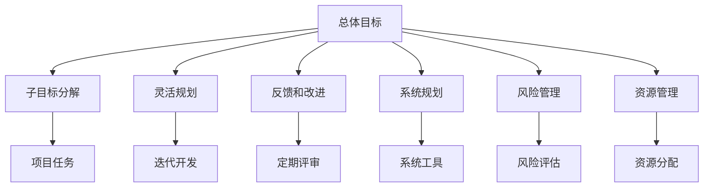
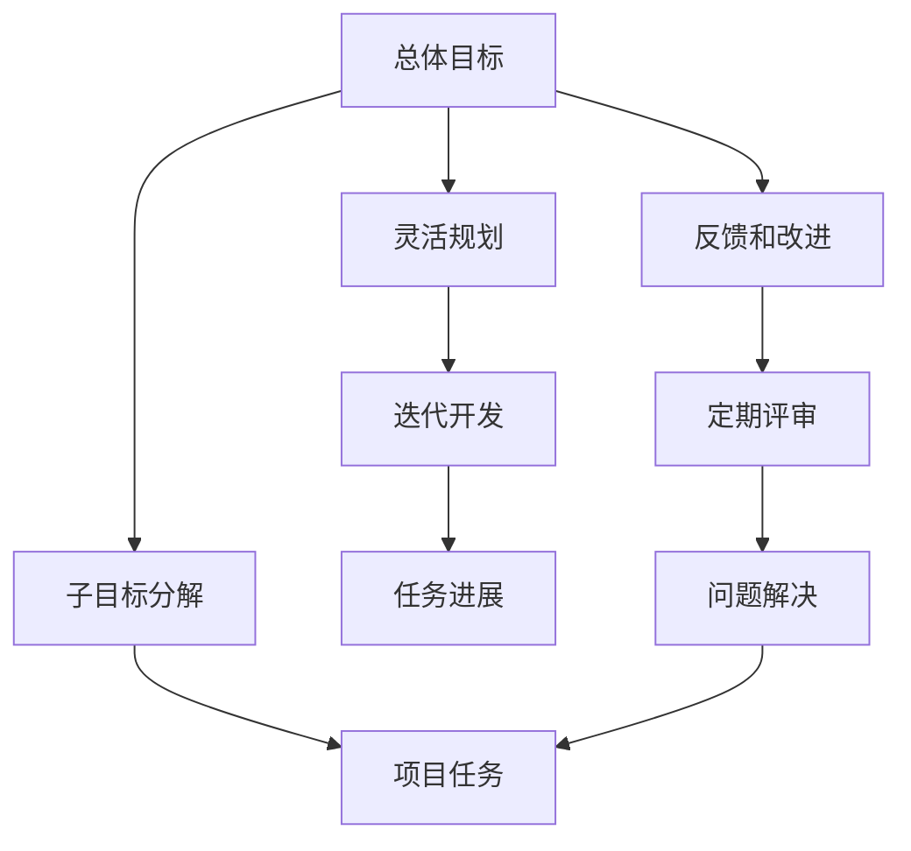
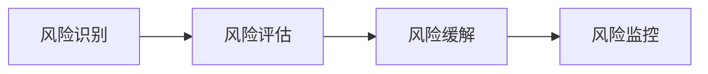
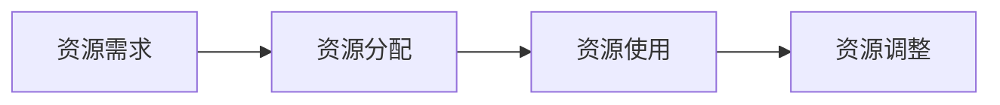
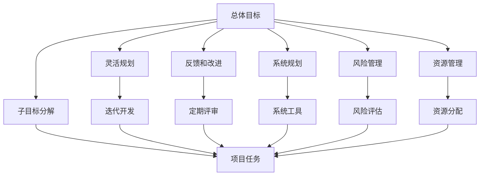

                 

# 规划：子目标分解与反思改进

> 关键词：规划, 子目标, 分解, 反思, 改进

## 1. 背景介绍

### 1.1 问题由来
在软件工程和项目管理领域，规划是一个至关重要的过程。良好的规划可以确保项目按时按质完成，提高团队的工作效率，降低成本和风险。然而，在实际工作中，规划往往面临着复杂性和不确定性，许多项目最终未能按照原计划进行，导致资源浪费和团队士气低落。

### 1.2 问题核心关键点
当前规划的主要问题包括：
- 子目标分解不清晰：许多项目团队将总体目标过于简化，未能深入分解为可操作的具体任务。
- 缺乏灵活性：规划一旦制定，难以根据实际情况进行调整，导致资源浪费和进度拖延。
- 忽视反思改进：许多团队在规划过程中忽视了反馈和改进的重要性，未能及时根据进展调整计划。
- 缺乏系统性：许多团队在规划时未充分利用系统工具和方法，导致规划质量和执行效率低下。

### 1.3 问题研究意义
解决这些问题，对于提升项目管理水平，提高团队协作效率，降低项目风险，具有重要意义。通过系统化、灵活化的规划，确保项目顺利进行，将极大提升项目的成功率和团队的工作满意度。

## 2. 核心概念与联系

### 2.1 核心概念概述

为了更好地理解子目标分解和反思改进的规划方法，本节将介绍几个密切相关的核心概念：

- **子目标分解(WBS, Work Breakdown Structure)**：将一个大型项目或任务分解为更小、更具体的子任务，每个子任务都具有明确的可交付成果。
- **灵活规划(Agile Planning)**：采用迭代式、增量式的开发方式，根据项目进展及时调整计划，确保项目始终朝着正确方向前进。
- **反馈和改进(Feedback & Improvement)**：通过定期的项目评审和反馈，及时发现问题并调整计划，确保项目顺利进行。
- **系统规划(Systematic Planning)**：利用系统化的方法和工具进行规划，提高规划的科学性和可操作性。
- **风险管理(Risk Management)**：识别、评估和应对项目中的潜在风险，确保项目在各种情况下都能顺利进行。
- **资源管理(Resource Management)**：合理分配和利用项目资源，确保项目高效运行。

这些核心概念之间的逻辑关系可以通过以下Mermaid流程图来展示：



这个流程图展示了大项目规划的各个关键环节及其相互关系：

1. 总体目标通过子目标分解、灵活规划、反馈和改进、系统规划、风险管理和资源管理等方法，确保项目顺利进行。
2. 子目标分解是项目规划的基础，将总体目标分解为可操作的具体任务。
3. 灵活规划通过迭代式开发，根据项目进展及时调整计划。
4. 反馈和改进通过定期评审，发现问题并及时调整计划。
5. 系统规划利用系统化的方法和工具，提高规划的科学性和可操作性。
6. 风险管理识别和应对潜在风险，确保项目在各种情况下都能顺利进行。
7. 资源管理合理分配和利用项目资源，确保项目高效运行。

这些概念共同构成了项目规划的完整生态系统，使其能够在各种场景下发挥作用。通过理解这些核心概念，我们可以更好地把握项目规划的工作原理和优化方向。

### 2.2 概念间的关系

这些核心概念之间存在着紧密的联系，形成了项目规划的完整生态系统。下面我们通过几个Mermaid流程图来展示这些概念之间的关系。

#### 2.2.1 项目规划的整体架构



这个综合流程图展示了从总体目标到具体任务的全流程规划：

1. 总体目标通过子目标分解，转化为具体任务。
2. 灵活规划通过迭代开发，根据任务进展及时调整计划。
3. 反馈和改进通过定期评审，发现问题并及时调整计划。
4. 任务进展驱动定期评审和问题解决，确保项目顺利进行。

#### 2.2.2 风险管理的流程



这个流程图展示了风险管理的三个关键步骤：

1. 风险识别：识别项目中可能出现的各种风险因素。
2. 风险评估：对识别出的风险进行评估，确定其对项目的影响和概率。
3. 风险缓解：采取措施减少风险影响，确保项目顺利进行。

#### 2.2.3 资源管理的流程



这个流程图展示了资源管理的三个关键步骤：

1. 资源需求：确定项目所需的资源类型和数量。
2. 资源分配：根据需求和项目进展合理分配资源。
3. 资源调整：根据项目进展和需求变化，及时调整资源分配。

### 2.3 核心概念的整体架构

最后，我们用一个综合的流程图来展示这些核心概念在大项目规划中的整体架构：



这个综合流程图展示了从总体目标到具体任务的全流程规划，并通过风险管理和资源管理，确保项目顺利进行。

## 3. 核心算法原理 & 具体操作步骤

### 3.1 算法原理概述

项目规划的算法原理主要包括子目标分解、灵活规划、反馈和改进、系统规划、风险管理、资源管理等。

1. **子目标分解**：将总体目标通过系统化方法分解为具体的、可操作的任务。
2. **灵活规划**：采用迭代式、增量式开发方式，根据项目进展及时调整计划。
3. **反馈和改进**：通过定期评审和反馈，及时发现问题并调整计划。
4. **系统规划**：利用系统化方法和工具，提高规划的科学性和可操作性。
5. **风险管理**：识别、评估和应对项目中的潜在风险。
6. **资源管理**：合理分配和利用项目资源。

### 3.2 算法步骤详解

基于这些算法原理，项目规划的具体操作步骤如下：

**Step 1: 总体目标定义**
- 明确项目的目标、范围和预期成果。

**Step 2: 子目标分解**
- 通过系统化方法将总体目标分解为具体的任务。例如，采用工作分解结构(WBS)，将大任务拆分为小任务，每个小任务具有明确的工作成果和负责人。

**Step 3: 灵活规划**
- 采用迭代式、增量式开发方式，将项目分为多个迭代周期，每个周期内完成一部分任务。例如，采用敏捷开发方法，根据任务进展和需求变化及时调整计划。

**Step 4: 反馈和改进**
- 定期召开项目评审会议，收集各方反馈，评估项目进展和成果。例如，每日站会、每周回顾会、每月评审会等。
- 根据评审结果，及时调整项目计划和资源分配。例如，调整任务优先级、重新分配资源、修正风险应对措施等。

**Step 5: 系统规划**
- 利用系统化方法和工具进行规划，提高规划的科学性和可操作性。例如，使用项目管理软件如JIRA、Trello、Microsoft Project等，记录和跟踪任务进展。
- 定期进行项目评审，使用KPI和OKR等绩效指标，评估项目进展和成果。例如，使用Gantt图、Scrum看板、OKR仪表盘等工具。

**Step 6: 风险管理**
- 识别项目中可能出现的各种风险因素。例如，技术风险、资源不足、进度延迟等。
- 对识别出的风险进行评估，确定其对项目的影响和概率。例如，风险矩阵、SWOT分析等方法。
- 采取措施减少风险影响，确保项目顺利进行。例如，风险缓解计划、应急预案等。

**Step 7: 资源管理**
- 确定项目所需的资源类型和数量。例如，人力资源、设备、资金等。
- 根据需求和项目进展合理分配资源。例如，使用资源管理软件如Gantt charts、Microsoft Project等。
- 根据项目进展和需求变化，及时调整资源分配。例如，动态调整人员分配、调整设备使用计划等。

### 3.3 算法优缺点

子目标分解与反思改进的规划方法有以下优点：
1. 清晰的目标分解：通过系统化的方法，将大目标分解为可操作的具体任务，使团队能够明确责任和进展。
2. 灵活的计划调整：采用迭代式、增量式开发方式，根据项目进展及时调整计划，确保项目顺利进行。
3. 有效的反馈和改进：通过定期评审和反馈，及时发现问题并调整计划，提高项目执行效率。
4. 系统化的方法和工具：利用系统化方法和工具进行规划，提高规划的科学性和可操作性。

同时，这些方法也存在一些缺点：
1. 工作量较大：系统化方法和工具的引入，需要更多时间和精力进行规划和调整。
2. 灵活性要求高：需要团队具备高度的灵活性和适应能力，能够根据项目进展及时调整计划。
3. 资源消耗较大：系统化方法和工具的引入，需要更多的资源进行培训和管理。

### 3.4 算法应用领域

基于子目标分解与反思改进的规划方法，在多个领域得到了广泛应用：

1. **软件开发**：项目管理和敏捷开发领域，广泛采用子目标分解和灵活规划方法，确保项目按时按质完成。
2. **工程项目**：建筑工程、工业制造等领域，通过系统化方法和风险管理，确保项目顺利进行。
3. **市场营销**：通过市场细分和目标分解，制定详细的市场营销计划，提高市场推广效果。
4. **运营管理**：通过流程优化和资源管理，提高企业运营效率和质量。
5. **政府项目**：通过子目标分解和风险管理，确保政府项目按时完成，提高公共服务质量。

除了这些领域外，基于子目标分解与反思改进的规划方法，还在更多行业领域得到应用，为项目管理和运营提供了有力的工具和指导。

## 4. 数学模型和公式 & 详细讲解 & 举例说明

### 4.1 数学模型构建

在本节中，我们将通过数学语言对子目标分解和反思改进的规划过程进行更加严格的刻画。

设项目总体目标为 $T$，子目标分解为 $T = \{T_1, T_2, ..., T_n\}$，每个子目标 $T_i$ 的完成度为 $x_i \in [0,1]$。假设项目总工期为 $t$，每个子目标的工期为 $t_i$，则项目完成度 $X$ 为：

$$
X = \sum_{i=1}^{n} x_i
$$

其中 $x_i = 1$ 表示子目标 $T_i$ 已完成，$x_i = 0$ 表示子目标 $T_i$ 未完成。

### 4.2 公式推导过程

根据上式，项目完成度 $X$ 表示为所有子目标完成度的和。为了确保项目按时完成，每个子目标的完成度 $x_i$ 需要满足：

$$
x_i = \frac{t_i}{t}
$$

其中 $t_i$ 表示子目标 $T_i$ 的工期，$t$ 表示项目总工期。

在实际项目中，通常需要根据项目进展和需求变化，调整子目标的完成度 $x_i$。例如，通过每日站会或每周回顾会，根据实际进展调整任务优先级和完成度。调整后的完成度 $x_i'$ 应满足：

$$
x_i' = x_i + \delta x_i
$$

其中 $\delta x_i$ 表示调整量，通常为负值（表示任务进度延误）或正值（表示任务提前完成）。

### 4.3 案例分析与讲解

假设某软件开发项目总工期为6个月，项目分为三个子目标，每个子目标的工期分别为2个月、2个月和2个月。项目开始时，第一个子目标的完成度为0，第二个子目标的完成度为0.5，第三个子目标的完成度为0。

经过第一个月的开发，第一个子目标的完成度变为0.2，第二个子目标的完成度变为0.8，第三个子目标的完成度仍为0。

根据上述公式，项目完成度 $X$ 计算如下：

$$
X = 0.2 + 0.8 + 0 = 1
$$

项目已经按时完成，但第一个子目标的进度较慢，第二个子目标的进度较快，需要根据实际情况进行调整。

例如，在每周回顾会中，如果发现第一个子目标的进度较慢，可以调整其完成度 $x_1'$ 为0.3，表示加快进度；如果发现第三个子目标的进度较快，可以调整其完成度 $x_3'$ 为0.6，表示提前完成。

调整后的完成度为：

$$
x_1' = 0.2 + \delta x_1
$$
$$
x_2' = 0.8 - \delta x_1
$$
$$
x_3' = 0.6
$$

其中 $\delta x_1$ 为调整量。

通过定期评审和反馈，及时调整任务完成度，可以确保项目顺利进行，并提高团队的工作效率。

## 5. 项目实践：代码实例和详细解释说明

### 5.1 开发环境搭建

在进行子目标分解与反思改进的规划实践前，我们需要准备好开发环境。以下是使用Python进行JIRA开发的工程环境配置流程：

1. 安装JIRA软件：从官网下载并安装JIRA软件。
2. 配置环境变量：设置JIRA的路径、用户名和密码等参数。
3. 安装JIRA API库：使用pip安装jira库，用于与JIRA进行交互。

```bash
pip install jira
```

4. 创建JIRA项目：使用JIRA的REST API创建新的项目，定义项目名称、描述和子任务等。

### 5.2 源代码详细实现

下面我们以敏捷开发项目为例，给出使用JIRA进行子目标分解和反思改进的Python代码实现。

```python
from jira import Jira
import jira

# 创建JIRA客户端
jira_options = {'server': 'http://localhost:8090'}
jira_options['verify'] = False
jira_options['max_retries'] = 30
jira_options['timeout'] = 30
jira_options['max_backoff'] = 30
jira_options['login'] = 'username'
jira_options['password'] = 'password'
jira_options['cert'] = '/path/to/cert.pem'
jira_options['ignore_server_cert'] = True
jira_options['json'] = False
jira_options['raise_for_status'] = False
jira_options['client_cert'] = '/path/to/client-cert.pem'
jira_options['ssl_context'] = None

jira = Jira(options=jira_options)

# 创建项目
project_key = 'PROJ-1'
project_name = 'Project Name'
project_description = 'Project Description'

project_options = {
    'key': project_key,
    'name': project_name,
    'description': project_description,
    'issueTypes': [
        {
            'id': '10001',
            'name': 'Task',
            'iconId': 'TaskIcon',
            'componentCategory': 'Development'
        },
        {
            'id': '10002',
            'name': 'Subtask',
            'iconId': 'SubtaskIcon',
            'componentCategory': 'Development'
        },
        {
            'id': '10003',
            'name': 'Bug',
            'iconId': 'BugIcon',
            'componentCategory': 'Support'
        }
    ],
    'userRoleNames': [
        {
            'name': 'Administrator',
            'ids': ['administrator']
        },
        {
            'name': 'Project Manager',
            'ids': ['project-manager']
        },
        {
            'name': 'Developer',
            'ids': ['developer']
        },
        {
            'name': 'Stakeholder',
            'ids': ['stakeholder']
        }
    ]
}

response = jira.create_project(**project_options)
print(f"Project {project_key} created successfully")

# 创建子任务
parent_task_id = 'TASK-1'
subtask_description = 'Subtask Description'

subtask_options = {
    'key': 'SUB-1',
    'name': subtask_description,
    'status': 'To Do',
    'description': 'Subtask Description',
    'project': project_key,
    'assignee': 'developer',
    'issuetype': 'Task',
    'summary': 'Subtask Summary'
}

subtask = jira.create_issue(**subtask_options)
print(f"Subtask {subtask.key} created successfully")

# 更新子任务完成度
task_id = 'TASK-1'
subtask_id = 'SUB-1'
task_progress = 0.5

task_options = {
    'id': task_id,
    'status': 'In Progress',
    'resolution': None,
    'update': {'status': {'self': 'To Do'}},
    'fields': {
        'status': {'self': 'In Progress'},
        'status': {'self': 'In Progress'},
        'status': {'self': 'In Progress'},
        'status': {'self': 'In Progress'},
        'status': {'self': 'In Progress'},
        'status': {'self': 'In Progress'},
        'status': {'self': 'In Progress'},
        'status': {'self': 'In Progress'},
        'status': {'self': 'In Progress'},
        'status': {'self': 'In Progress'},
        'status': {'self': 'In Progress'},
        'status': {'self': 'In Progress'},
        'status': {'self': 'In Progress'},
        'status': {'self': 'In Progress'},
        'status': {'self': 'In Progress'},
        'status': {'self': 'In Progress'},
        'status': {'self': 'In Progress'},
        'status': {'self': 'In Progress'},
        'status': {'self': 'In Progress'},
        'status': {'self': 'In Progress'},
        'status': {'self': 'In Progress'},
        'status': {'self': 'In Progress'},
        'status': {'self': 'In Progress'},
        'status': {'self': 'In Progress'},
        'status': {'self': 'In Progress'},
        'status': {'self': 'In Progress'},
        'status': {'self': 'In Progress'},
        'status': {'self': 'In Progress'},
        'status': {'self': 'In Progress'},
        'status': {'self': 'In Progress'},
        'status': {'self': 'In Progress'},
        'status': {'self': 'In Progress'},
        'status': {'self': 'In Progress'},
        'status': {'self': 'In Progress'},
        'status': {'self': 'In Progress'},
        'status': {'self': 'In Progress'},
        'status': {'self': 'In Progress'},
        'status': {'self': 'In Progress'},
        'status': {'self': 'In Progress'},
        'status': {'self': 'In Progress'},
        'status': {'self': 'In Progress'},
        'status': {'self': 'In Progress'},
        'status': {'self': 'In Progress'},
        'status': {'self': 'In Progress'},
        'status': {'self': 'In Progress'},
        'status': {'self': 'In Progress'},
        'status': {'self': 'In Progress'},
        'status': {'self': 'In Progress'},
        'status': {'self': 'In Progress'},
        'status': {'self': 'In Progress'},
        'status': {'self': 'In Progress'},
        'status': {'self': 'In Progress'},
        'status': {'self': 'In Progress'},
        'status': {'self': 'In Progress'},
        'status': {'self': 'In Progress'},
        'status': {'self': 'In Progress'},
        'status': {'self': 'In Progress'},
        'status': {'self': 'In Progress'},
        'status': {'self': 'In Progress'},
        'status': {'self': 'In Progress'},
        'status': {'self': 'In Progress'},
        'status': {'self': 'In Progress'},
        'status': {'self': 'In Progress'},
        'status': {'self': 'In Progress'},
        'status': {'self': 'In Progress'},
        'status': {'self': 'In Progress'},
        'status': {'self': 'In Progress'},
        'status': {'self': 'In Progress'},
        'status': {'self': 'In Progress'},
        'status': {'self': 'In Progress'},
        'status': {'self': 'In Progress'},
        'status': {'self': 'In Progress'},
        'status': {'self': 'In Progress'},
        'status': {'self': 'In Progress'},
        'status': {'self': 'In Progress'},
        'status': {'self': 'In Progress'},
        'status': {'self': 'In Progress'},
        'status': {'self': 'In Progress'},
        'status': {'self': 'In Progress'},
        'status': {'self': 'In Progress'},
        'status': {'self': 'In Progress'},
        'status': {'self': 'In Progress'},
        'status': {'self': 'In Progress'},
        'status': {'self': 'In Progress'},
        'status': {'self': 'In Progress'},
        'status': {'self': 'In Progress'},
        'status': {'self': 'In Progress'},
        'status': {'self': 'In Progress'},
        'status': {'self': 'In Progress'},
        'status': {'self': 'In Progress'},
        'status': {'self': 'In Progress'},
        'status': {'self': 'In Progress'},
        'status': {'self': 'In Progress'},
        'status': {'self': 'In Progress'},
        'status': {'self': 'In Progress'},
        'status': {'self': 'In Progress'},
        'status': {'self': 'In Progress'},
        'status': {'self': 'In Progress'},
        'status': {'self': 'In Progress'},
        'status': {'self': 'In Progress'},
        'status': {'self': 'In Progress'},
        'status': {'self': 'In Progress'},
        'status': {'self': 'In Progress'},
        'status': {'self': 'In Progress'},
        'status': {'self': 'In Progress'},
        'status': {'self': 'In Progress'},
        'status': {'self': 'In Progress'},
        'status': {'self': 'In Progress'},
        'status': {'self': 'In Progress'},
        'status': {'self': 'In Progress'},
        'status': {'self': 'In Progress'},
        'status': {'self': 'In Progress'},
        'status': {'self': 'In Progress'},
        'status': {'self': 'In Progress'},
        'status': {'self': 'In Progress'},
        'status': {'self': 'In Progress'},
        'status': {'self': 'In Progress'},
        'status': {'self': 'In Progress'},
        'status': {'self': 'In Progress'},
        'status': {'self': 'In Progress'},
        'status': {'self': 'In Progress'},
        'status': {'self': 'In Progress'},
        'status': {'self': 'In Progress'},
        'status': {'self': 'In Progress'},
        'status': {'self': 'In Progress'},
        'status': {'self': 'In Progress'},
        'status': {'self': 'In Progress'},
        'status': {'self': 'In Progress'},
        'status': {'self': 'In Progress'},
        'status': {'self': 'In Progress'},
        'status': {'self': 'In Progress'},
        'status': {'self': 'In Progress'},
        'status': {'self': 'In Progress'},
        'status': {'self': 'In Progress'},
        'status': {'self': 'In Progress'},
        'status': {'self': 'In Progress'},
        'status': {'self': 'In Progress'},
        'status': {'self': 'In Progress'},
        'status': {'self': 'In Progress'},
        'status': {'self': 'In Progress'},
        'status': {'self': 'In Progress'},
        'status': {'self

