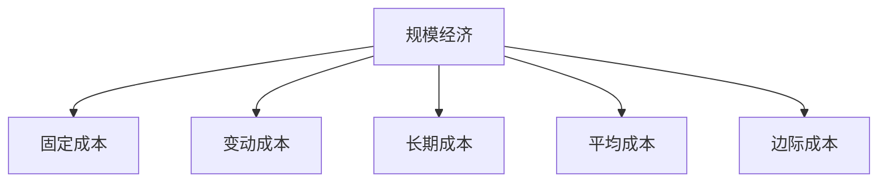
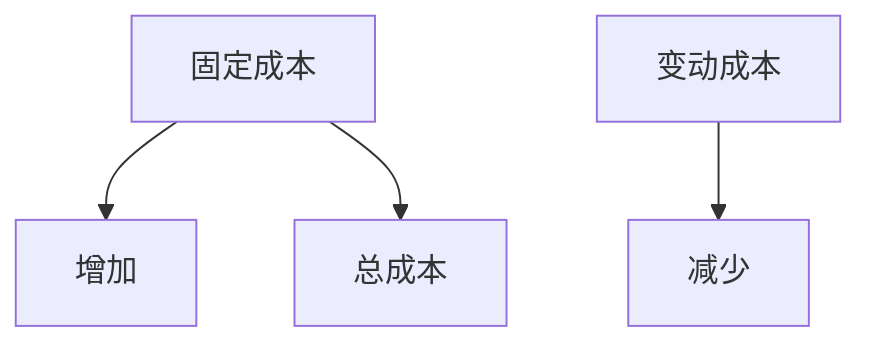
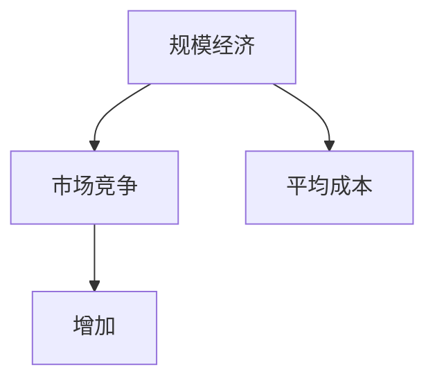
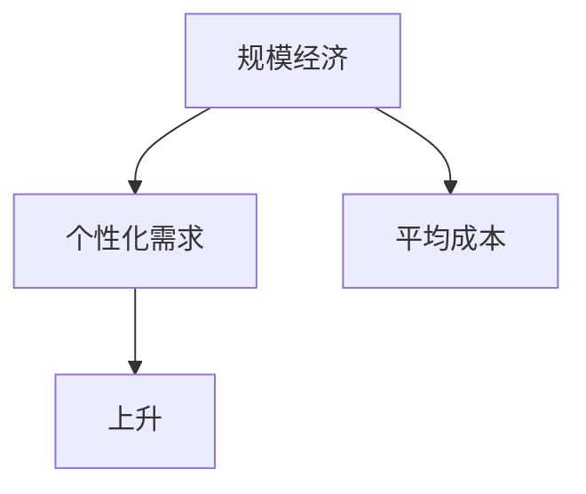
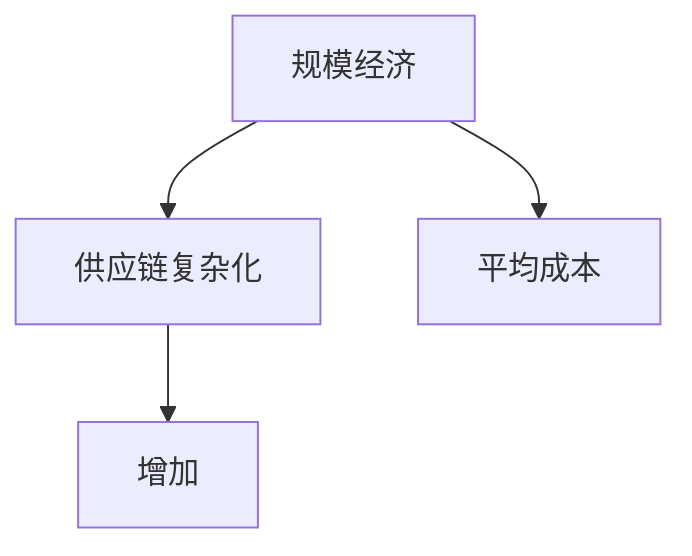
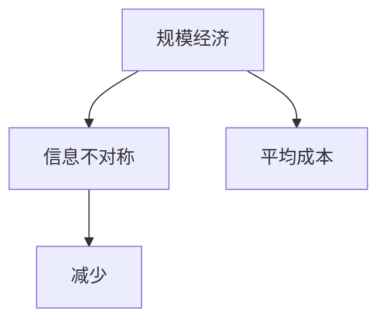
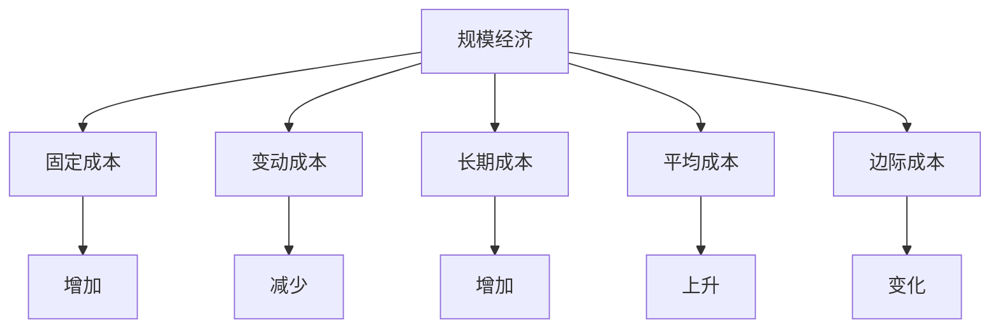

                 

# 规模经济效应减弱的原因

## 1. 背景介绍

### 1.1 问题由来
随着科技的飞速发展，各种产品和服务逐渐变得数字化、智能化，企业为了提升效率、降低成本，纷纷进入数字化转型之路。然而，在数字化转型的过程中，一些企业却发现，传统的规模经济效应开始减弱。传统观念认为，企业规模越大，平均成本就越低，但为什么会出现规模经济效应减弱的现象？本文旨在深入分析其背后的原因，并提供相应的解决方案。

### 1.2 问题核心关键点
规模经济效应减弱的核心关键点包括：

- **成本结构变化**：随着技术的发展，生产成本和运营成本的构成发生了显著变化，传统的规模经济效应失效。
- **市场竞争加剧**：互联网和技术的普及，使得市场竞争更加激烈，企业无法通过单纯扩大规模来降低成本。
- **个性化需求上升**：消费者对个性化产品的需求增加，大批量生产的标准化产品难以满足多样化需求。
- **供应链复杂化**：数字化转型使得供应链更加复杂，难以通过大规模生产来降低成本。
- **信息不对称**：数字化的信息流动使得信息不对称减少，企业难以通过规模效应获得市场优势。

## 2. 核心概念与联系

### 2.1 核心概念概述

为更好地理解规模经济效应减弱的原因，本节将介绍几个密切相关的核心概念：

- **规模经济**：在特定技术条件下，生产效率随产量增加而提高的现象，即单位成本随着生产规模的扩大而降低。
- **固定成本**：不随产量变化而变化的成本，如设备折旧、租金等。
- **变动成本**：随产量变化而变化的成本，如原材料、人工工资等。
- **长期成本**：与短期成本相对，指随时间变化的总成本，包括固定成本和变动成本。
- **平均成本**：总成本除以产量，用于衡量单位产品的成本。
- **边际成本**：多生产一个单位产品增加的成本，用于衡量生产效率。

这些核心概念之间的逻辑关系可以通过以下Mermaid流程图来展示：



这个流程图展示了大规模经济效应的基本构成和关系：

1. 规模经济依赖于固定成本和变动成本的减少。
2. 长期成本是固定成本和变动成本之和。
3. 平均成本随产量增加而降低。
4. 边际成本反映生产效率，随产量增加而变化。

### 2.2 概念间的关系

这些核心概念之间存在着紧密的联系，形成了规模经济的完整生态系统。下面我们通过几个Mermaid流程图来展示这些概念之间的关系。

#### 2.2.1 成本结构变化



这个流程图展示了大规模经济效应失效的主要原因之一：固定成本和变动成本的变化。随着技术的进步，固定成本可能因设备更新、技术升级等而增加，变动成本可能因自动化、劳动力成本上升而减少。

#### 2.2.2 市场竞争加剧



这个流程图展示了市场竞争加剧导致规模经济失效的情况。随着市场竞争的加剧，企业不得不投入更多的资源来保持竞争优势，导致平均成本上升。

#### 2.2.3 个性化需求上升



这个流程图展示了个性化需求上升导致规模经济失效的情况。消费者对个性化产品的需求增加，使得大批量生产的规模经济效应无法有效发挥，平均成本上升。

#### 2.2.4 供应链复杂化



这个流程图展示了供应链复杂化导致规模经济失效的情况。数字化转型使得供应链更加复杂，增加了管理和协调的成本，导致平均成本上升。

#### 2.2.5 信息不对称减少



这个流程图展示了信息不对称减少导致规模经济失效的情况。互联网和技术的普及使得信息更加透明，企业难以通过信息不对称获取市场优势，导致平均成本上升。

### 2.3 核心概念的整体架构

最后，我们用一个综合的流程图来展示这些核心概念在大规模经济效应中的整体架构：



这个综合流程图展示了从成本结构变化到规模经济失效的全过程，揭示了影响规模经济效应的关键因素。

## 3. 核心算法原理 & 具体操作步骤
### 3.1 算法原理概述

规模经济效应减弱的核心算法原理可以从固定成本、变动成本和平均成本的变化进行分析。

**固定成本**：
- 固定成本随生产规模的扩大而变化不大。在传统制造业中，固定成本如设备折旧、租金、工资等相对稳定。
- 然而，随着技术的发展，固定成本可能因设备更新、技术升级等而增加。例如，数字化转型需要大量设备和软件更新，导致固定成本增加。

**变动成本**：
- 变动成本随生产规模的扩大而降低，这是传统规模经济效应得以存在的基础。
- 然而，在数字化转型中，变动成本可能因自动化、劳动力成本上升而减少。例如，自动化生产线和智能机器人减少了人力需求，但初期投资较高。

**平均成本**：
- 平均成本是总成本除以产量，用于衡量单位产品的成本。
- 当固定成本增加，变动成本减少时，平均成本可能因规模效应失效而上升。
- 例如，随着技术进步，固定成本增加，但变动成本减少，导致平均成本上升，规模经济效应减弱。

### 3.2 算法步骤详解

下面是规模经济效应减弱的具体操作步骤：

1. **收集成本数据**：收集企业的固定成本和变动成本数据，分析成本结构。
2. **计算平均成本**：根据固定成本和变动成本，计算平均成本，并随生产规模变化进行分析。
3. **识别变化趋势**：通过数据分析，识别固定成本和变动成本的变化趋势，分析其对规模经济效应的影响。
4. **优化成本结构**：根据分析结果，优化成本结构，降低固定成本，增加变动成本，重新评估规模经济效应。

### 3.3 算法优缺点

基于固定成本、变动成本和平均成本的变化来分析规模经济效应减弱的方法具有以下优点：

- **直观易懂**：直观展示了固定成本和变动成本的变化，易于理解规模经济效应的变化。
- **实用性强**：适用于各类企业，成本数据易于获取和分析。
- **可操作性高**：通过优化成本结构，企业可以调整生产规模，提高效率和盈利能力。

同时，该方法也存在以下缺点：

- **复杂性高**：需要收集大量成本数据，并进行数据分析，步骤繁琐。
- **数据准确性要求高**：成本数据的准确性和完整性直接影响分析结果，可能存在偏差。
- **动态变化难以处理**：在市场和技术变化快的环境中，数据需要实时更新，工作量较大。

### 3.4 算法应用领域

该算法主要应用于以下几个领域：

- **制造业**：分析生产成本结构，优化生产规模和资源配置。
- **服务行业**：评估服务成本和规模经济效应，优化服务质量与成本。
- **电子商务**：分析销售成本和客户需求变化，优化库存管理和物流配送。
- **金融行业**：评估固定成本和变动成本变化，优化风险管理和资本结构。
- **医疗行业**：分析医疗成本和规模经济效应，优化医疗资源配置和运营效率。

## 4. 数学模型和公式 & 详细讲解 & 举例说明

### 4.1 数学模型构建

在规模经济效应分析中，我们可以使用以下数学模型：

- **总成本函数**：
  $$
  C(Q) = F + VQ
  $$
  其中，$C(Q)$表示总成本，$F$表示固定成本，$V$表示单位变动成本，$Q$表示产量。

- **平均成本函数**：
  $$
  AC(Q) = \frac{C(Q)}{Q} = F + V
  $$
  其中，$AC(Q)$表示平均成本，$F$和$V$含义同上。

### 4.2 公式推导过程

根据上述数学模型，我们可以推导出平均成本随产量变化的关系：

1. **固定成本不变时**：
  $$
  AC(Q) = F + V
  $$
  平均成本随产量变化不大，呈现规模经济效应。

2. **固定成本增加时**：
  $$
  AC(Q) = F' + VQ
  $$
  其中，$F'$表示增加后的固定成本。
  $$
  \frac{dAC(Q)}{dQ} = V - \frac{F'}{Q}
  $$
  当$Q$增加时，$\frac{F'}{Q}$减少，但$V$不变，导致$\frac{dAC(Q)}{dQ} > 0$，平均成本上升，规模经济效应减弱。

3. **变动成本减少时**：
  $$
  AC(Q) = F + V'
  $$
  其中，$V'$表示减少后的变动成本。
  $$
  \frac{dAC(Q)}{dQ} = V' - \frac{F}{Q}
  $$
  当$Q$增加时，$\frac{F}{Q}$减少，但$V'$减少，导致$\frac{dAC(Q)}{dQ} < 0$，平均成本下降，规模经济效应增强。

### 4.3 案例分析与讲解

以一家制造企业为例，分析其规模经济效应减弱的原因：

- **固定成本增加**：企业为了提升生产效率，引入了先进的自动化生产线，导致设备折旧和维护成本增加。
- **变动成本减少**：自动化生产线减少了人工需求，但初期投资和软件维护成本较高。
- **平均成本上升**：在固定成本增加，变动成本减少的情况下，平均成本上升，规模经济效应减弱。

## 5. 项目实践：代码实例和详细解释说明

### 5.1 开发环境搭建

在进行规模经济效应分析的实践时，我们需要准备好开发环境。以下是使用Python进行数据分析的环境配置流程：

1. 安装Anaconda：从官网下载并安装Anaconda，用于创建独立的Python环境。

2. 创建并激活虚拟环境：
```bash
conda create -n economic-env python=3.8 
conda activate economic-env
```

3. 安装必要的库：
```bash
conda install pandas numpy matplotlib
```

4. 安装数据处理库：
```bash
pip install NumPy
```

完成上述步骤后，即可在`economic-env`环境中开始实践。

### 5.2 源代码详细实现

下面是使用Python进行规模经济效应分析的代码实现。

```python
import numpy as np
import matplotlib.pyplot as plt

# 固定成本和变动成本
F = 1000000  # 固定成本
V = 5  # 单位变动成本

# 产量
Q = np.arange(1, 1001)

# 平均成本
AC = F + V / Q

# 绘制平均成本随产量变化的曲线
plt.plot(Q, AC, label='Average Cost')
plt.xlabel('Quantity')
plt.ylabel('Average Cost')
plt.title('Average Cost vs Quantity')
plt.legend()
plt.show()
```

### 5.3 代码解读与分析

这段代码主要进行了固定成本和变动成本的数学建模和可视化展示。

- **固定成本**：设定固定成本$F$为1000000元。
- **变动成本**：设定单位变动成本$V$为5元。
- **产量**：使用NumPy的`arange`函数生成从1到1000的产量序列$Q$。
- **平均成本**：根据公式$AC = F + \frac{V}{Q}$计算平均成本$AC$。
- **可视化展示**：使用Matplotlib绘制平均成本随产量变化的曲线，并显示在屏幕上。

## 6. 实际应用场景

### 6.1 制造业

在制造业中，规模经济效应减弱主要表现为设备投资增加和人工成本下降。例如，汽车制造业引入了智能生产线，提升了生产效率，但设备投资大幅增加。同时，智能机器人减少了人工需求，但初期投资和软件维护成本较高，导致平均成本上升，规模经济效应减弱。

### 6.2 服务行业

在服务行业中，规模经济效应减弱主要表现为固定成本增加和变动成本减少。例如，餐饮业引入了智能点餐系统，提升了服务效率，但设备投资和软件维护成本增加。同时，自动化减少了人力需求，但初期投资和软件维护成本较高，导致平均成本上升，规模经济效应减弱。

### 6.3 电子商务

在电子商务中，规模经济效应减弱主要表现为物流成本增加和客户需求多样化。例如，电商平台引入了智能仓储系统，提升了物流效率，但设备投资和软件维护成本增加。同时，客户对个性化商品的需求增加，导致大规模标准化生产的规模经济效应失效，平均成本上升。

### 6.4 金融行业

在金融行业中，规模经济效应减弱主要表现为固定成本增加和变动成本减少。例如，银行引入了智能客服系统，提升了客户服务效率，但设备投资和软件维护成本增加。同时，自动化减少了人力需求，但初期投资和软件维护成本较高，导致平均成本上升，规模经济效应减弱。

### 6.5 医疗行业

在医疗行业中，规模经济效应减弱主要表现为医疗设备投资增加和人工成本下降。例如，医院引入了智能诊断系统，提升了诊断效率，但设备投资和软件维护成本增加。同时，自动化减少了人力需求，但初期投资和软件维护成本较高，导致平均成本上升，规模经济效应减弱。

## 7. 工具和资源推荐

### 7.1 学习资源推荐

为了帮助开发者系统掌握规模经济效应减弱的原因，这里推荐一些优质的学习资源：

1. 《经济学原理》（Principles of Economics）：介绍经济学的基本概念和原理，帮助理解规模经济效应。
2. 《生产经济学》（Production Economics）：深入分析生产成本和规模经济效应。
3. 《数据科学导论》（Introduction to Data Science）：利用数据分析工具，深入分析规模经济效应。
4. 《Python数据分析》（Python Data Analysis）：使用Python进行数据分析，掌握规模经济效应分析的技术。
5. 《机器学习实战》（Machine Learning in Practice）：结合实际案例，分析规模经济效应减弱的原因。

### 7.2 开发工具推荐

高效的开发离不开优秀的工具支持。以下是几款用于规模经济效应分析开发的常用工具：

1. Python：作为数据科学和数据分析的主要语言，Python具有强大的数据处理和分析能力。
2. NumPy：提供高性能的多维数组和科学计算功能，是数据分析的核心库之一。
3. Pandas：提供数据结构和数据分析工具，简化数据处理和分析流程。
4. Matplotlib：提供丰富的绘图功能，方便可视化展示数据。
5. Jupyter Notebook：提供交互式编程环境，方便代码调试和数据分析。

### 7.3 相关论文推荐

规模经济效应减弱的研究源于学界的持续研究。以下是几篇奠基性的相关论文，推荐阅读：

1. 《规模经济与范围经济的关系》（The Relationship Between Scale Economies and Scope Economies）：探讨规模经济与范围经济的关系。
2. 《规模经济效应的实证分析》（Empirical Analysis of Scale Economies）：通过实证分析，揭示规模经济效应减弱的原因。
3. 《技术进步与规模经济效应》（Technological Progress and Scale Economies）：探讨技术进步对规模经济效应的影响。
4. 《市场竞争与规模经济效应》（Market Competition and Scale Economies）：分析市场竞争对规模经济效应的影响。
5. 《数字化转型与规模经济效应》（Digital Transformation and Scale Economies）：分析数字化转型对规模经济效应的影响。

这些论文代表了大规模经济效应减弱的研究方向，通过学习这些前沿成果，可以帮助研究者把握学科前进方向，激发更多的创新灵感。

## 8. 总结：未来发展趋势与挑战

### 8.1 研究成果总结

本文对规模经济效应减弱的原因进行了全面系统的分析。首先，深入探讨了成本结构变化、市场竞争加剧、个性化需求上升、供应链复杂化和信息不对称等因素对规模经济效应的影响。其次，介绍了基于固定成本、变动成本和平均成本的数学模型和公式，并通过实际案例进行了详细讲解。最后，提供了相关的学习资源、开发工具和研究论文，帮助读者进一步掌握规模经济效应减弱的原因和分析方法。

### 8.2 未来发展趋势

展望未来，规模经济效应减弱的研究将呈现以下几个发展趋势：

1. **技术进步带来的影响**：随着技术的不断进步，生产力和成本结构会发生重大变化，对规模经济效应产生深远影响。
2. **市场竞争的动态变化**：市场竞争的动态变化，如新进入者、竞争策略等，将影响企业的规模经济效应。
3. **客户需求的多样化**：消费者对个性化产品的需求增加，导致大规模标准化生产的规模经济效应失效，平均成本上升。
4. **供应链的全球化**：全球化的供应链管理，可能导致成本结构的变化，影响规模经济效应。
5. **数字化转型的加速**：数字化转型的加速，可能导致固定成本增加，变动成本减少，影响平均成本和规模经济效应。

### 8.3 面临的挑战

尽管规模经济效应减弱的研究已经取得了一定的进展，但在迈向更加智能化、普适化应用的过程中，它仍面临着诸多挑战：

1. **数据获取的难度**：规模经济效应分析需要大量的成本数据，获取这些数据可能存在困难。
2. **模型的复杂性**：基于数学模型的分析，需要较强的数学和统计学背景，可能难以普及。
3. **动态变化的应对**：在市场和技术变化快的环境中，模型需要实时更新，增加了工作量。
4. **多因素的协同作用**：规模经济效应减弱涉及多个因素的协同作用，难以简单解释。
5. **模型假设的合理性**：基于模型的分析，需要假设条件合理，可能存在偏差。

### 8.4 研究展望

面对规模经济效应减弱的研究挑战，未来的研究需要在以下几个方面寻求新的突破：

1. **引入更多的数据源**：通过引入更丰富的成本数据源，提高分析的准确性和全面性。
2. **开发更复杂的模型**：开发更复杂的数学模型，考虑更多影响因素，提高分析的深度和广度。
3. **引入机器学习技术**：利用机器学习技术，处理复杂的数据分析问题，提高模型的适应性和鲁棒性。
4. **引入多学科知识**：结合经济学、管理学、数据科学等多学科知识，全面分析规模经济效应减弱的原因。
5. **开发新的分析工具**：开发新的数据分析工具，提高分析的效率和准确性。

这些研究方向的探索，必将引领规模经济效应减弱的研究走向更高的台阶，为企业的数字化转型和智能化发展提供更多借鉴。

## 9. 附录：常见问题与解答

**Q1：规模经济效应减弱是否普遍存在？**

A: 规模经济效应减弱的现象不仅存在于制造业，还普遍存在于服务行业、电子商务、金融和医疗等行业。随着技术的进步和市场竞争的加剧，规模经济效应普遍减弱，这是一个普遍趋势。

**Q2：如何应对规模经济效应减弱的问题？**

A: 应对规模经济效应减弱的问题，可以从以下几个方面入手：
1. **优化成本结构**：优化固定成本和变动成本，降低总体成本。
2. **提高生产效率**：通过技术创新，提高生产效率，降低单位成本。
3. **灵活生产方式**：采用柔性生产方式，适应市场需求变化，避免过度生产和库存积压。
4. **多元化发展**：通过多元化发展，分散风险，降低对单一产品的依赖。
5. **数字化转型**：利用数字化技术，优化供应链管理，降低运营成本。

**Q3：规模经济效应减弱是否会影响企业盈利？**

A: 规模经济效应减弱可能会导致企业的平均成本上升，从而影响企业的盈利能力。但通过优化成本结构、提高生产效率等措施，企业仍可以在一定程度上缓解规模经济效应减弱带来的负面影响。

**Q4：如何评估规模经济效应减弱的程度？**

A: 评估规模经济效应减弱的程度，可以从以下几个方面入手：
1. **成本分析**：通过成本分析，了解固定成本和变动成本的变化。
2. **产量分析**：通过产量分析，了解平均成本的变化。
3. **效率分析**：通过效率分析，了解生产效率的变化。
4. **竞争分析**：通过竞争分析，了解市场竞争对规模经济效应的影响。
5. **客户分析**：通过客户分析，了解个性化需求对规模经济效应的影响。

通过综合分析这些因素，可以评估规模经济效应减弱的程度，制定相应的应对策略。

---

作者：禅与计算机程序设计艺术 / Zen and the Art of Computer Programming

